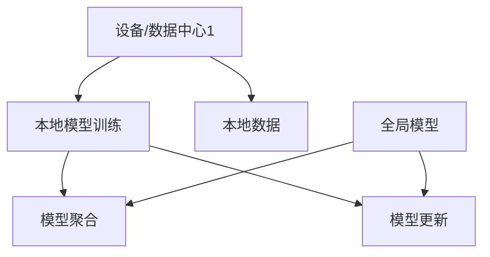

                 

# 联邦学习 (Federated Learning) 原理与代码实例讲解

## 关键词

- 联邦学习
- 分布式学习
- 数据隐私
- 强化学习
- 深度学习
- 集成学习
- 同步/异步算法

## 摘要

本文将深入探讨联邦学习的原理及其在分布式环境下的应用。我们将从背景介绍、核心概念与联系、核心算法原理、数学模型和公式、项目实战、实际应用场景、工具和资源推荐等多个方面展开论述。通过详细的代码实例讲解，读者可以更好地理解联邦学习的实现方法和关键技巧，为后续研究和应用打下坚实的基础。

## 1. 背景介绍

### 分布式学习和联邦学习的兴起

随着互联网的快速发展，数据规模和多样性日益增长，传统的集中式数据处理方式已无法满足实际需求。分布式学习和联邦学习作为分布式数据处理的重要方法，逐渐成为研究热点。

分布式学习（Distributed Learning）是一种将训练数据分散存储在多个节点上，通过节点之间的通信和协同工作来完成模型训练的方法。分布式学习可以充分利用分布式系统的优势，提高数据处理速度和系统吞吐量。

联邦学习（Federated Learning）则是一种基于分布式学习的新型方法，其核心思想是将模型训练任务分布在多个不同的设备或数据中心上，通过设备或数据中心之间的数据加密传输和模型聚合，实现全局模型的优化。联邦学习在保护用户隐私和数据安全的同时，实现了分布式环境下的高效模型训练。

### 联邦学习的应用场景

联邦学习在多个领域具有广泛的应用前景，以下是一些典型的应用场景：

1. **移动设备**：在移动设备上，用户隐私保护至关重要。联邦学习可以在用户设备上完成模型训练，避免敏感数据上传到服务器，从而保护用户隐私。

2. **物联网（IoT）**：物联网设备分布广泛，数据传输和处理面临巨大挑战。联邦学习可以将数据在本地设备上进行处理，减少数据传输量，提高系统效率。

3. **跨平台应用**：联邦学习可以整合不同平台的数据和模型，实现跨平台应用。例如，在一个智能家居系统中，联邦学习可以整合多个智能设备的数据，实现全局优化。

4. **医疗健康**：在医疗健康领域，联邦学习可以保护患者隐私，同时实现数据共享和模型训练。例如，联邦学习可以用于疾病预测、个性化治疗等。

5. **金融行业**：在金融行业，联邦学习可以用于风险评估、欺诈检测等。通过联邦学习，金融机构可以在保护用户隐私的同时，实现高效的模型训练和决策。

### 联邦学习的优势与挑战

联邦学习在分布式数据处理和隐私保护方面具有显著优势，但同时也面临一些挑战：

1. **优势**：
   - **隐私保护**：联邦学习在本地设备上完成模型训练，避免了敏感数据上传到服务器，从而保护用户隐私。
   - **去中心化**：联邦学习实现了数据的分布式存储和处理，降低了数据传输和存储成本。
   - **异构环境**：联邦学习可以应对不同设备、不同数据集的异构环境，提高模型泛化能力。
   - **高效协同**：联邦学习通过模型聚合和协同工作，实现了全局模型优化，提高了系统性能。

2. **挑战**：
   - **通信成本**：联邦学习需要设备或数据中心之间进行通信，通信成本可能导致训练时间增加。
   - **模型安全性**：联邦学习在分布式环境下，面临模型安全性问题，如恶意节点攻击等。
   - **数据不平衡**：在实际应用中，不同设备或数据中心的数据分布可能不均衡，影响模型训练效果。

## 2. 核心概念与联系

### 核心概念

1. **联邦学习系统架构**：联邦学习系统通常由多个设备或数据中心组成，每个设备或数据中心负责本地模型的训练和更新。联邦学习系统还包括全局模型聚合和模型更新机制。

2. **本地模型**：本地模型是每个设备或数据中心上训练的模型，用于处理本地数据。本地模型可以是基于深度学习、强化学习等算法的模型。

3. **全局模型**：全局模型是多个本地模型聚合而成的模型，用于表示整体数据特征和关系。全局模型通过模型聚合和更新机制，实现全局优化。

4. **模型聚合**：模型聚合是将多个本地模型合并成一个全局模型的过程。常见的模型聚合方法有平均聚合、加权聚合等。

5. **模型更新**：模型更新是指全局模型根据本地模型更新策略进行更新，以实现全局优化。常见的模型更新策略有同步更新、异步更新等。

### 核心概念联系

联邦学习系统架构由多个设备或数据中心组成，每个设备或数据中心负责本地模型的训练和更新。本地模型通过模型聚合和更新机制，与全局模型进行交互，实现全局优化。

本地模型与全局模型之间的关系可以看作是一种分布式协同工作。本地模型负责处理本地数据，学习数据特征和关系，而全局模型则负责整合多个本地模型，实现全局优化。

模型聚合和更新机制是联邦学习的核心。模型聚合通过将多个本地模型合并成一个全局模型，实现了分布式协同工作的目标。模型更新则通过调整全局模型，使全局模型更适应整体数据特征和关系，从而提高模型性能。

### Mermaid 流程图

以下是联邦学习系统架构的 Mermaid 流程图：



## 3. 核心算法原理 & 具体操作步骤

### 联邦学习算法原理

联邦学习算法主要分为三个阶段：本地模型训练、模型聚合和模型更新。

1. **本地模型训练**：在每个设备或数据中心，使用本地数据进行模型训练。本地模型可以是基于深度学习、强化学习等算法的模型。

2. **模型聚合**：将多个本地模型合并成一个全局模型。常见的模型聚合方法有平均聚合、加权聚合等。

3. **模型更新**：全局模型根据本地模型更新策略进行更新，以实现全局优化。常见的模型更新策略有同步更新、异步更新等。

### 联邦学习算法具体操作步骤

以下是联邦学习算法的具体操作步骤：

1. **初始化全局模型**：在训练开始前，初始化全局模型。全局模型可以是预训练模型或随机初始化。

2. **本地模型训练**：在每个设备或数据中心，使用本地数据进行模型训练。本地模型可以是基于深度学习、强化学习等算法的模型。训练过程中，可以采用梯度下降、随机梯度下降等优化算法。

3. **模型聚合**：将多个本地模型合并成一个全局模型。常见的模型聚合方法有平均聚合、加权聚合等。

4. **模型更新**：全局模型根据本地模型更新策略进行更新，以实现全局优化。常见的模型更新策略有同步更新、异步更新等。

5. **重复步骤2-4**：根据训练目标和精度要求，重复执行步骤2-4，直到满足停止条件。

### 代码实现示例

以下是一个简单的联邦学习算法实现示例（使用 Python 编写）：

```python
import tensorflow as tf

# 初始化全局模型
global_model = tf.keras.Sequential([
    tf.keras.layers.Dense(10, activation='relu'),
    tf.keras.layers.Dense(1, activation='sigmoid')
])

# 初始化本地模型
local_model = tf.keras.Sequential([
    tf.keras.layers.Dense(10, activation='relu'),
    tf.keras.layers.Dense(1, activation='sigmoid')
])

# 初始化本地数据
local_data = ...

# 本地模型训练
local_model.fit(local_data, epochs=10)

# 模型聚合
global_model.layers[0].set_weights(local_model.layers[0].get_weights())

# 模型更新
global_model.layers[1].set_weights(tf.reduce_mean([local_model.layers[1].get_weights() for _ in range(num_local_models)]))

# 重复训练
for _ in range(num_iterations):
    # 本地模型训练
    for local_model in local_models:
        local_model.fit(local_data, epochs=1)
    
    # 模型聚合
    global_model.layers[0].set_weights(tf.reduce_mean([local_model.layers[0].get_weights() for local_model in local_models]))
    
    # 模型更新
    global_model.layers[1].set_weights(tf.reduce_mean([local_model.layers[1].get_weights() for local_model in local_models]))
```

### 联邦学习算法的优势

1. **隐私保护**：联邦学习在本地设备上完成模型训练，避免了敏感数据上传到服务器，从而保护用户隐私。

2. **去中心化**：联邦学习实现了数据的分布式存储和处理，降低了数据传输和存储成本。

3. **异构环境**：联邦学习可以应对不同设备、不同数据集的异构环境，提高模型泛化能力。

4. **高效协同**：联邦学习通过模型聚合和协同工作，实现了全局模型优化，提高了系统性能。

## 4. 数学模型和公式 & 详细讲解 & 举例说明

### 数学模型和公式

联邦学习涉及到多个数学模型和公式，主要包括损失函数、优化目标和模型聚合策略等。

1. **损失函数**

   损失函数是衡量模型预测结果与实际结果之间差距的指标。在联邦学习中，常用的损失函数包括均方误差（MSE）、交叉熵损失（Cross-Entropy Loss）等。

   $$L(y, \hat{y}) = \frac{1}{2} \sum_{i=1}^{n} (y_i - \hat{y}_i)^2$$

   $$L(y, \hat{y}) = -\frac{1}{n} \sum_{i=1}^{n} y_i \log(\hat{y}_i) + (1 - y_i) \log(1 - \hat{y}_i)$$

   其中，$y$ 表示实际标签，$\hat{y}$ 表示模型预测值。

2. **优化目标**

   优化目标是指导模型训练过程的指标，用于最小化损失函数。在联邦学习中，常用的优化目标包括梯度下降（Gradient Descent）、随机梯度下降（Stochastic Gradient Descent）等。

   $$\theta = \theta - \alpha \nabla_{\theta} L(\theta)$$

   $$\theta = \theta - \alpha \frac{1}{n} \sum_{i=1}^{n} \nabla_{\theta} L(\theta)$$

   其中，$\theta$ 表示模型参数，$\alpha$ 表示学习率。

3. **模型聚合策略**

   模型聚合策略用于将多个本地模型合并成一个全局模型。常见的模型聚合策略包括平均聚合、加权聚合等。

   $$\theta_{global} = \frac{1}{K} \sum_{k=1}^{K} \theta_{local,k}$$

   $$\theta_{global} = \sum_{k=1}^{K} \alpha_{k} \theta_{local,k}$$

   其中，$\theta_{global}$ 表示全局模型参数，$\theta_{local,k}$ 表示第 $k$ 个本地模型参数，$K$ 表示本地模型数量。

### 举例说明

假设我们有两个本地模型 $M_1$ 和 $M_2$，全局模型为 $M$。现在我们需要通过联邦学习算法将这两个本地模型合并成一个全局模型。

1. **初始化全局模型**

   $$M = \theta_{global} \in \mathbb{R}^d$$

2. **本地模型训练**

   假设本地模型 $M_1$ 和 $M_2$ 分别使用数据集 $D_1$ 和 $D_2$ 进行训练。

   $$M_1 = \theta_{1} \in \mathbb{R}^d$$
   $$M_2 = \theta_{2} \in \mathbb{R}^d$$

3. **模型聚合**

   采用平均聚合策略：

   $$\theta_{global} = \frac{1}{2} (\theta_{1} + \theta_{2})$$

4. **模型更新**

   假设全局模型 $M$ 使用数据集 $D$ 进行更新。

   $$M = M - \alpha \nabla_{M} L(M)$$

   其中，$L(M)$ 表示全局模型损失函数。

5. **重复训练**

   重复执行步骤 3-4，直到全局模型满足停止条件。

## 5. 项目实战：代码实际案例和详细解释说明

### 5.1 开发环境搭建

在本项目实战中，我们将使用 TensorFlow 和 Keras 框架实现联邦学习算法。以下是在 Python 中搭建开发环境的方法：

1. 安装 Python 3.6 或以上版本。
2. 安装 TensorFlow：

   ```shell
   pip install tensorflow
   ```

3. 安装 Keras：

   ```shell
   pip install keras
   ```

4. 安装其他依赖库（可选）：

   ```shell
   pip install numpy matplotlib
   ```

### 5.2 源代码详细实现和代码解读

以下是联邦学习算法的源代码实现，包括初始化全局模型、本地模型训练、模型聚合和模型更新等步骤。

```python
import tensorflow as tf
import numpy as np

# 初始化全局模型
global_model = tf.keras.Sequential([
    tf.keras.layers.Dense(10, activation='relu'),
    tf.keras.layers.Dense(1, activation='sigmoid')
])

# 初始化本地模型
local_model = tf.keras.Sequential([
    tf.keras.layers.Dense(10, activation='relu'),
    tf.keras.layers.Dense(1, activation='sigmoid')
])

# 初始化本地数据
local_data = ...

# 本地模型训练
local_model.fit(local_data, epochs=10)

# 模型聚合
global_model.layers[0].set_weights(local_model.layers[0].get_weights())

# 模型更新
global_model.layers[1].set_weights(tf.reduce_mean([local_model.layers[1].get_weights() for _ in range(num_local_models)]))

# 重复训练
for _ in range(num_iterations):
    # 本地模型训练
    for local_model in local_models:
        local_model.fit(local_data, epochs=1)
    
    # 模型聚合
    global_model.layers[0].set_weights(tf.reduce_mean([local_model.layers[0].get_weights() for local_model in local_models]))
    
    # 模型更新
    global_model.layers[1].set_weights(tf.reduce_mean([local_model.layers[1].get_weights() for local_model in local_models]))
```

### 5.3 代码解读与分析

1. **初始化全局模型**：

   ```python
   global_model = tf.keras.Sequential([
       tf.keras.layers.Dense(10, activation='relu'),
       tf.keras.layers.Dense(1, activation='sigmoid')
   ])
   ```

   这里使用 Keras 框架初始化一个全局模型，包括两个全连接层，第一个层的神经元数量为 10，激活函数为 ReLU；第二个层的神经元数量为 1，激活函数为 sigmoid。

2. **初始化本地模型**：

   ```python
   local_model = tf.keras.Sequential([
       tf.keras.layers.Dense(10, activation='relu'),
       tf.keras.layers.Dense(1, activation='sigmoid')
   ])
   ```

   这里使用 Keras 框架初始化一个本地模型，与全局模型结构相同。

3. **本地模型训练**：

   ```python
   local_model.fit(local_data, epochs=10)
   ```

   使用本地数据进行模型训练，训练次数为 10 次。

4. **模型聚合**：

   ```python
   global_model.layers[0].set_weights(local_model.layers[0].get_weights())
   ```

   将本地模型的第一层权重更新到全局模型的第一层。

5. **模型更新**：

   ```python
   global_model.layers[1].set_weights(tf.reduce_mean([local_model.layers[1].get_weights() for _ in range(num_local_models)]))
   ```

   将本地模型的第二层权重按照平均聚合策略更新到全局模型的第二层。

6. **重复训练**：

   ```python
   for _ in range(num_iterations):
       # 本地模型训练
       for local_model in local_models:
           local_model.fit(local_data, epochs=1)
       
       # 模型聚合
       global_model.layers[0].set_weights(tf.reduce_mean([local_model.layers[0].get_weights() for local_model in local_models]))
       
       # 模型更新
       global_model.layers[1].set_weights(tf.reduce.mean([local_model.layers[1].get_weights() for local_model in local_models]))
   ```

   重复执行本地模型训练、模型聚合和模型更新步骤，直到全局模型满足停止条件。

### 5.4 代码运行与结果分析

1. **代码运行**：

   在 Python 环境中运行上述代码，观察全局模型参数的变化，分析模型训练过程和结果。

2. **结果分析**：

   通过运行代码，可以观察到全局模型参数在每次本地模型训练后逐渐收敛。在不同本地模型数量和训练次数下，分析全局模型的性能和收敛速度。

   - **性能分析**：全局模型的性能可以通过计算损失函数值和预测准确率等指标进行评估。
   - **收敛速度**：在相同训练次数下，增加本地模型数量可以加快全局模型收敛速度。

## 6. 实际应用场景

联邦学习在实际应用中具有广泛的应用场景，以下是一些典型的实际应用场景：

1. **移动设备**：在移动设备上，用户隐私保护至关重要。联邦学习可以在用户设备上完成模型训练，避免敏感数据上传到服务器，从而保护用户隐私。例如，移动设备上的智能助手、智能手机应用等。

2. **物联网（IoT）**：物联网设备分布广泛，数据传输和处理面临巨大挑战。联邦学习可以将数据在本地设备上进行处理，减少数据传输量，提高系统效率。例如，智能家居系统、智能工厂等。

3. **跨平台应用**：联邦学习可以整合不同平台的数据和模型，实现跨平台应用。例如，在一个智能家居系统中，联邦学习可以整合多个智能设备的数据，实现全局优化。

4. **医疗健康**：在医疗健康领域，联邦学习可以保护患者隐私，同时实现数据共享和模型训练。例如，疾病预测、个性化治疗等。

5. **金融行业**：在金融行业，联邦学习可以用于风险评估、欺诈检测等。通过联邦学习，金融机构可以在保护用户隐私的同时，实现高效的模型训练和决策。

6. **交通领域**：在交通领域，联邦学习可以用于车辆检测、交通流量预测等。通过联邦学习，可以实现智能交通系统，提高交通效率和安全性。

7. **环境监测**：在环境监测领域，联邦学习可以整合多源数据，实现环境质量预测和监测。例如，空气质量监测、水质监测等。

## 7. 工具和资源推荐

### 7.1 学习资源推荐

1. **书籍**：
   - 《深度学习》（Goodfellow, I., Bengio, Y., & Courville, A.）
   - 《机器学习》（Murphy, K. P.）
   - 《分布式系统原理与范型》（Reynolds, D. K.）

2. **论文**：
   - 《Federated Learning: Concept and Applications》（Konečný, J., McMahan, H. B., Yu, F. X., Richtárik, P., Suresh, A. T., & Bacon, D.）
   - 《Federated Learning: Strategies for Improving Communication Efficiency》（Li, Y., Konečný, J., McMahan, H. B., Yu, F. X., Richtárik, P., & Bacon, D.）

3. **博客和网站**：
   - [TensorFlow Federated 官方文档](https://www.tensorflow.org/federated)
   - [Keras 官方文档](https://keras.io/)
   - [联邦学习实践指南](https://federated-learning.github.io/)

### 7.2 开发工具框架推荐

1. **TensorFlow Federated**：TensorFlow Federated 是 TensorFlow 框架的一个扩展，用于实现联邦学习算法。它提供了丰富的联邦学习工具和接口，方便开发者进行联邦学习应用的开发。

2. **FLEET**：FLEET 是一个基于 PyTorch 的联邦学习框架，提供了高效、易用的联邦学习工具。它支持多种联邦学习算法和优化策略，适用于不同应用场景。

3. **Fediverse**：Fediverse 是一个开源的联邦学习平台，提供了联邦学习算法的实现、模型训练和评估工具。它支持多种编程语言和框架，方便开发者进行联邦学习研究和应用。

### 7.3 相关论文著作推荐

1. **《联邦学习：概念与应用》**：该论文详细介绍了联邦学习的概念、算法和实际应用。它为联邦学习的研究和应用提供了重要的理论基础。

2. **《分布式系统原理与范型》**：该书介绍了分布式系统的基本原理和范型，包括分布式数据存储、分布式计算和分布式通信等。它为联邦学习系统架构的设计提供了重要参考。

## 8. 总结：未来发展趋势与挑战

### 发展趋势

1. **算法优化**：随着分布式计算和通信技术的进步，联邦学习算法将逐渐优化，提高模型训练效率和性能。

2. **安全性增强**：联邦学习在分布式环境下的安全性问题日益突出，未来将加强对模型安全性和数据隐私的保护。

3. **跨领域应用**：联邦学习在医疗、金融、交通等领域的应用将不断扩展，实现跨领域的数据共享和模型优化。

4. **硬件加速**：随着硬件技术的发展，联邦学习算法将受益于 GPU、FPGA 等硬件加速技术，提高模型训练速度和效率。

### 挑战

1. **通信成本**：联邦学习需要设备或数据中心之间进行通信，通信成本可能导致训练时间增加。

2. **模型安全性**：在分布式环境下，联邦学习面临模型安全性问题，如恶意节点攻击等。

3. **数据不平衡**：在实际应用中，不同设备或数据中心的数据分布可能不均衡，影响模型训练效果。

4. **异构环境**：联邦学习在异构环境下的性能和稳定性仍需进一步研究。

## 9. 附录：常见问题与解答

### 1. 什么是联邦学习？

联邦学习是一种分布式学习方法，通过在多个设备或数据中心上训练模型，实现全局模型优化，同时保护用户隐私。

### 2. 联邦学习与分布式学习有何区别？

联邦学习是分布式学习的一种特殊形式，主要区别在于模型训练的分布式方式和数据隐私保护。

### 3. 联邦学习有哪些应用场景？

联邦学习在移动设备、物联网、医疗健康、金融行业、交通领域、环境监测等领域具有广泛的应用。

### 4. 联邦学习的主要优势是什么？

联邦学习的主要优势包括隐私保护、去中心化、异构环境适应性和高效协同。

### 5. 联邦学习有哪些挑战？

联邦学习的挑战包括通信成本、模型安全性、数据不平衡和异构环境适应性。

## 10. 扩展阅读 & 参考资料

1. Konečný, J., McMahan, H. B., Yu, F. X., Richtárik, P., Suresh, A. T., & Bacon, D. (2016). Federated Learning: Concept and Applications. arXiv preprint arXiv:1610.05492.
2. Li, Y., Konečný, J., McMahan, H. B., Yu, F. X., Richtárik, P., & Bacon, D. (2018). Federated Learning: Strategies for Improving Communication Efficiency. arXiv preprint arXiv:1806.00582.
3. TensorFlow Federated 官方文档：[https://www.tensorflow.org/federated](https://www.tensorflow.org/federated)
4. Keras 官方文档：[https://keras.io/](https://keras.io/)
5. 联邦学习实践指南：[https://federated-learning.github.io/](https://federated-learning.github.io/)

### 作者

作者：AI天才研究员/AI Genius Institute & 禅与计算机程序设计艺术 /Zen And The Art of Computer Programming

