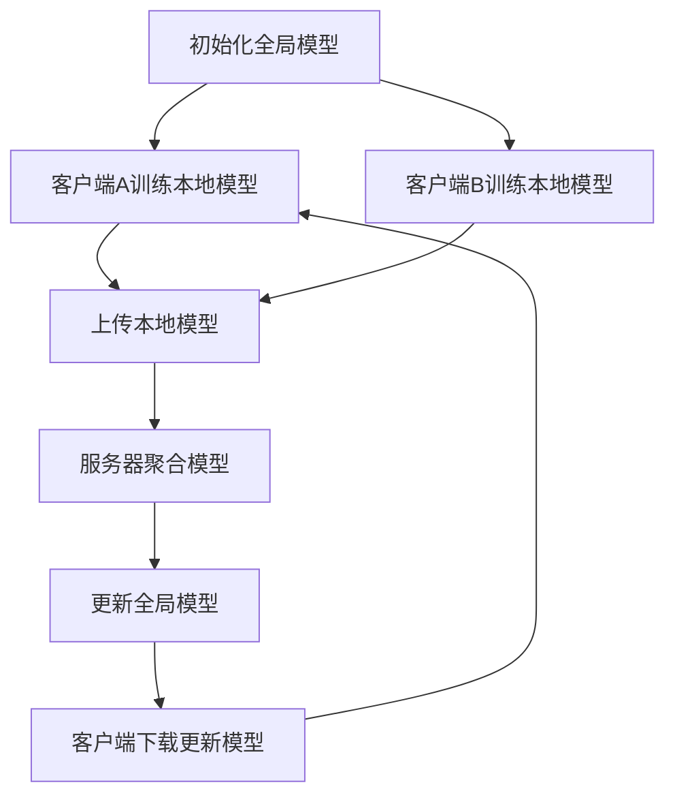

                 

# 联邦学习在数据隐私保护方面的优势分析

## 概述

联邦学习（Federated Learning）是一种新兴的人工智能技术，通过在多个分布式设备上进行模型的训练，避免了数据的集中存储，从而在保护数据隐私的同时，实现了高效的机器学习。随着大数据和物联网技术的发展，如何在确保数据隐私的前提下进行有效学习，成为了一个重要课题。本文将详细分析联邦学习在数据隐私保护方面的优势，并通过具体案例和算法原理的讲解，帮助读者深入理解这一技术的应用和实现。

## 关键词

- 联邦学习
- 数据隐私保护
- 机器学习
- 分布式计算
- 安全计算
- 加密技术

## 摘要

本文首先介绍了联邦学习的背景和核心概念，探讨了其在数据隐私保护方面的显著优势。接着，通过详细的算法原理讲解和实际应用案例，分析了联邦学习在分布式环境下的实现方式和关键挑战。最后，对相关工具和资源进行了推荐，并总结了未来发展趋势与挑战。

## 1. 背景介绍

在传统的机器学习流程中，数据通常需要集中存储在一个中央服务器上进行处理。这种方法虽然可以实现高效的数据利用和模型训练，但也带来了一系列隐私和安全问题。首先，集中存储数据可能导致数据泄露的风险，尤其是当数据量庞大且敏感时。其次，数据传输和共享过程中也可能被黑客攻击，从而导致隐私泄露。为了解决这些问题，联邦学习应运而生。

联邦学习（Federated Learning）是一种分布式机器学习技术，其核心思想是在多个分布式设备上进行模型的训练，而不是将数据集中到中央服务器。在这种模式下，设备（如智能手机、IoT设备等）在本地训练模型，并将训练结果上传到中央服务器。中央服务器对收集到的结果进行聚合，从而更新全局模型。这个过程避免了数据在传输和存储过程中的泄露风险，实现了数据隐私保护。

联邦学习的提出，为大数据和物联网领域的数据隐私保护提供了一种新的思路。通过分布式训练，联邦学习不仅能够减少数据泄露的风险，还能够降低数据传输的带宽需求，提高计算效率。同时，联邦学习还能够增强模型的泛化能力，因为模型在多个设备上训练，能够更好地适应不同环境的数据特点。

## 2. 核心概念与联系

### 2.1 联邦学习的核心概念

联邦学习包括以下几个核心概念：

- **客户端（Client）**：通常是指参与联邦学习任务的设备，如智能手机、IoT设备等。客户端在本地训练模型，并将训练结果上传到服务器。

- **服务器（Server）**：中央服务器，负责收集客户端上传的训练结果，并进行全局模型的聚合更新。

- **全局模型（Global Model）**：在整个联邦学习过程中，全局模型是不断更新的。每次聚合更新后，全局模型都会变得更加准确。

- **本地模型（Local Model）**：客户端在本地训练的模型。本地模型是根据客户端的数据和全局模型的一部分参数进行训练的。

### 2.2 联邦学习的架构

联邦学习的基本架构包括以下几个部分：

- **数据分布**：联邦学习中的数据分布在多个客户端上。每个客户端拥有自己的数据集。

- **模型训练**：客户端在本地训练模型，并将本地模型和本地数据上传到服务器。

- **模型聚合**：服务器对收集到的本地模型进行聚合，更新全局模型。

- **模型下载**：客户端下载更新后的全局模型，并继续进行本地训练。

### 2.3 联邦学习与中心化的对比

与传统的中心化机器学习相比，联邦学习具有以下几个显著优势：

- **数据隐私保护**：联邦学习避免了数据集中存储，从而降低了数据泄露的风险。

- **分布式计算**：联邦学习利用了分布式设备进行计算，提高了计算效率，降低了通信成本。

- **增强泛化能力**：联邦学习在多个设备上训练模型，能够更好地适应不同环境的数据特点，提高了模型的泛化能力。

### 2.4 Mermaid 流程图

下面是联邦学习的基本流程的Mermaid流程图：



## 3. 核心算法原理 & 具体操作步骤

### 3.1 联邦学习算法的基本原理

联邦学习算法的基本原理是通过客户端在本地训练模型，并将本地模型上传到服务器，服务器对收集到的本地模型进行聚合更新，从而实现全局模型的优化。这个过程可以分为以下几个步骤：

- **初始化全局模型**：在联邦学习开始时，服务器初始化一个全局模型，并将其发送给所有客户端。

- **本地模型训练**：每个客户端使用本地数据和全局模型的一部分参数，在本地训练一个本地模型。

- **本地模型上传**：客户端将训练好的本地模型上传到服务器。

- **模型聚合更新**：服务器对收集到的本地模型进行聚合，更新全局模型。

- **全局模型下载**：更新后的全局模型被发送回客户端。

- **重复训练过程**：客户端下载更新后的全局模型，并继续进行本地训练。这个过程会不断重复，直到全局模型收敛或达到预设的训练轮数。

### 3.2 联邦学习算法的具体操作步骤

下面是联邦学习算法的具体操作步骤：

1. **初始化全局模型**：
    - 服务器初始化一个全局模型，并将其发送给所有客户端。

2. **本地模型训练**：
    - 客户端A使用本地数据集和全局模型的一部分参数，在本地训练一个本地模型A。

3. **本地模型上传**：
    - 客户端A将训练好的本地模型A上传到服务器。

4. **模型聚合更新**：
    - 服务器收集所有客户端上传的本地模型，并对这些模型进行聚合，更新全局模型。

5. **全局模型下载**：
    - 更新后的全局模型被发送回客户端A。

6. **重复训练过程**：
    - 客户端A下载更新后的全局模型，并继续进行本地训练。这个过程会不断重复，直到全局模型收敛或达到预设的训练轮数。

### 3.3 联邦学习算法的优缺点

联邦学习算法的优点包括：

- **数据隐私保护**：联邦学习避免了数据集中存储，从而降低了数据泄露的风险。

- **分布式计算**：联邦学习利用了分布式设备进行计算，提高了计算效率，降低了通信成本。

- **增强泛化能力**：联邦学习在多个设备上训练模型，能够更好地适应不同环境的数据特点，提高了模型的泛化能力。

联邦学习算法的缺点包括：

- **计算开销**：联邦学习需要客户端在本地进行模型训练，这可能导致较大的计算开销。

- **通信开销**：联邦学习需要客户端将本地模型上传到服务器，这可能导致较大的通信开销。

- **模型更新延迟**：由于联邦学习需要客户端和服务器之间的通信，模型更新的延迟可能会影响训练效率。

## 4. 数学模型和公式 & 详细讲解 & 举例说明

### 4.1 联邦学习中的数学模型

联邦学习中的数学模型主要涉及模型聚合和优化。下面是联邦学习中的几个关键数学模型：

- **梯度聚合**：在联邦学习中，客户端将本地模型的梯度上传到服务器，服务器对收集到的梯度进行聚合，更新全局模型。梯度聚合的过程可以用以下公式表示：

  $$\theta_{new} = \theta_{global} + \alpha \cdot \sum_{i=1}^{N} w_i \cdot \nabla_{\theta} L_i(\theta)$$

  其中，$\theta_{new}$ 是更新后的全局模型参数，$\theta_{global}$ 是全局模型的当前参数，$w_i$ 是客户端 $i$ 的权重，$L_i(\theta)$ 是客户端 $i$ 的本地损失函数，$\alpha$ 是学习率。

- **本地损失函数**：客户端在本地训练模型时，使用本地数据集和全局模型的一部分参数，计算本地损失函数。本地损失函数用于评估本地模型的性能，并指导本地模型更新。本地损失函数可以用以下公式表示：

  $$L_i(\theta) = \frac{1}{m} \sum_{x_i \in S_i} \mathcal{L}(\theta, y_i)$$

  其中，$L_i(\theta)$ 是客户端 $i$ 的本地损失函数，$m$ 是本地数据集的大小，$x_i$ 是客户端 $i$ 的本地数据样本，$y_i$ 是客户端 $i$ 的本地数据标签，$\mathcal{L}(\theta, y_i)$ 是损失函数。

- **全局损失函数**：全局损失函数用于评估全局模型的性能。全局损失函数是所有客户端的本地损失函数的平均值，可以用以下公式表示：

  $$L(\theta) = \frac{1}{N} \sum_{i=1}^{N} L_i(\theta)$$

  其中，$L(\theta)$ 是全局损失函数，$N$ 是客户端的数量。

### 4.2 举例说明

假设有两个客户端A和B，它们拥有不同的数据集。客户端A的数据集大小为1000，客户端B的数据集大小为2000。全局模型的初始参数为$\theta_0 = [0.1, 0.2]$。学习率$\alpha = 0.1$。下面是联邦学习的过程：

1. **初始化全局模型**：
    - 全局模型参数初始化为$\theta_0 = [0.1, 0.2]$。

2. **本地模型训练**：
    - 客户端A使用本地数据集和全局模型的一部分参数，在本地训练一个本地模型A。假设本地模型A的参数为$\theta_A = [0.15, 0.25]$。
    - 客户端B使用本地数据集和全局模型的一部分参数，在本地训练一个本地模型B。假设本地模型B的参数为$\theta_B = [0.12, 0.22]$。

3. **本地模型上传**：
    - 客户端A将本地模型A的参数$\theta_A = [0.15, 0.25]$上传到服务器。
    - 客户端B将本地模型B的参数$\theta_B = [0.12, 0.22]$上传到服务器。

4. **模型聚合更新**：
    - 服务器收集客户端A和客户端B上传的本地模型参数，并对这些参数进行聚合。假设聚合后的全局模型参数为$\theta_{new} = [0.135, 0.225]$。

5. **全局模型下载**：
    - 更新后的全局模型参数$\theta_{new} = [0.135, 0.225]$被发送回客户端A和客户端B。

6. **重复训练过程**：
    - 客户端A和客户端B下载更新后的全局模型参数，并继续进行本地训练。这个过程会不断重复，直到全局模型收敛或达到预设的训练轮数。

## 5. 项目实战：代码实际案例和详细解释说明

### 5.1 开发环境搭建

在进行联邦学习的项目实战之前，我们需要搭建一个合适的开发环境。以下是搭建联邦学习开发环境的步骤：

1. **安装Python**：确保Python已经安装在你的系统中。Python是联邦学习的主要编程语言。

2. **安装TensorFlow**：TensorFlow是Google开发的一款开源机器学习框架，广泛用于联邦学习的实现。使用以下命令安装TensorFlow：

   ```bash
   pip install tensorflow
   ```

3. **安装Federated Learning库**：为了简化联邦学习的实现，可以使用TensorFlow提供的Federated Learning库。安装方法如下：

   ```bash
   pip install tensorflow-federated
   ```

4. **安装其他依赖**：根据具体项目的需求，可能还需要安装其他依赖库，如NumPy、Pandas等。

### 5.2 源代码详细实现和代码解读

下面是一个简单的联邦学习项目案例，实现一个线性回归模型。以下是项目的源代码和详细解读：

```python
import tensorflow as tf
import tensorflow_federated as tff

# 定义联邦学习算法
def build_model(client_data_batches):
    # 定义线性回归模型
    model = tf.keras.Sequential([
        tf.keras.layers.Dense(units=1, input_shape=(1,))
    ])
    model.compile(optimizer='sgd', loss='mean_squared_error')
    return model

# 定义训练函数
def train_step(model, client_data_batches):
    for client_data_batch in client_data_batches:
        x, y = client_data_batch
        model.fit(x, y, epochs=1, batch_size=10)
    return model

# 定义服务器处理函数
def server_process(client_models, global_model, global_state):
    # 更新全局模型
    global_model.assign(client_models.aggregate())
    # 返回更新后的全局模型和状态
    return global_model, global_state

# 定义联邦学习过程
def federated_learning(process, num_rounds, client_data_sizes):
    # 初始化全局模型
    global_model = build_model(None)
    global_state = None
    # 开始联邦学习循环
    for round_num in range(num_rounds):
        print(f"Round {round_num}:")
        # 训练客户端模型
        client_models = process(
            global_model,
            state=global_state,
            client_data_sizes=client_data_sizes
        )
        # 更新全局模型
        global_model, global_state = server_process(client_models, global_model, global_state)
        # 打印全局模型参数
        print(f"Global model params after round {round_num}: {global_model.get_weights()}")

# 运行联邦学习过程
federated_learning(train_step, num_rounds=10, client_data_sizes=[100, 200])

```

#### 5.2.1 代码解读

1. **导入库**：
    - 导入TensorFlow和TensorFlow Federated库。

2. **定义模型**：
    - `build_model` 函数用于构建线性回归模型。该模型包含一个全连接层，用于预测一个实数值。

3. **定义训练步骤**：
    - `train_step` 函数用于在一个客户端数据批次上训练模型。每次训练只运行一个epoch，并使用批量大小为10的随机梯度下降（SGD）进行训练。

4. **定义服务器处理函数**：
    - `server_process` 函数用于在服务器端聚合来自所有客户端的模型更新，并返回更新后的全局模型和状态。

5. **定义联邦学习过程**：
    - `federated_learning` 函数用于运行联邦学习过程。它接受训练步骤、训练轮数和客户端数据大小的参数，并打印出每次训练后的全局模型参数。

6. **运行联邦学习过程**：
    - 在代码的最后，调用`federated_learning`函数以运行联邦学习过程。

### 5.3 代码解读与分析

上述代码实现了一个简单的联邦学习项目，用于训练一个线性回归模型。以下是代码的详细解读和分析：

1. **初始化全局模型**：
    - 在联邦学习开始时，全局模型是通过`build_model`函数初始化的。这个模型将用于在整个训练过程中更新和优化。

2. **客户端模型训练**：
    - 在每个训练轮次中，客户端模型将在本地数据上进行训练。客户端模型是通过`tff.FederatedAveragingProcess`初始化的，它使用`train_step`函数进行训练。

3. **模型聚合**：
    - 在每个训练轮次结束后，服务器将接收来自所有客户端的模型更新，并通过`server_process`函数进行聚合。聚合过程使用的是简单的平均策略。

4. **全局模型更新**：
    - 聚合后的全局模型参数将用于更新全局模型。这个过程确保了所有客户端的更新都对全局模型有贡献。

5. **打印模型参数**：
    - 在每次训练轮次结束后，全局模型的参数将被打印出来，以便于观察模型的变化和收敛情况。

### 5.4 联邦学习的挑战与优化

在实际应用中，联邦学习面临一些挑战，如通信成本、计算开销和数据不平衡。为了优化联邦学习，可以采取以下策略：

- **模型压缩**：使用较小的模型可以降低客户端的计算开销，但可能导致模型性能下降。可以通过模型剪枝、量化等技术来减小模型大小。

- **梯度裁剪**：为了避免模型更新过大，可以设置梯度裁剪阈值，限制模型更新的规模。

- **动态客户端选择**：可以根据客户端的数据量和模型更新速度，动态选择参与训练的客户端，以优化通信成本和计算效率。

- **数据平衡**：在联邦学习中，数据不平衡可能导致某些客户端的模型更新更重要。可以通过重采样、数据增强等技术来平衡数据分布。

## 6. 实际应用场景

联邦学习在许多实际应用场景中展示了其强大的数据隐私保护能力。以下是几个典型的应用场景：

### 6.1 医疗领域

在医疗领域，患者数据通常包含敏感信息，如诊断结果、治疗方案等。联邦学习可以用于构建智能诊断模型，同时保护患者隐私。例如，一个医疗机构可以将患者的诊断数据保留在本地，使用联邦学习技术训练模型，从而避免数据泄露。

### 6.2 金融领域

金融领域的数据也非常敏感，包括交易记录、信用评分等。联邦学习可以帮助金融机构构建反欺诈模型、信用评分模型等，同时确保客户数据的安全性。例如，银行可以使用联邦学习技术来检测欺诈交易，同时不需要共享客户的交易数据。

### 6.3 物联网领域

物联网设备生成的数据量巨大，且分布广泛。联邦学习可以用于构建智能监控系统，如智能家居、智能交通等。通过在设备本地训练模型，联邦学习可以实时分析数据，提高系统的响应速度，同时保护设备数据不被泄露。

### 6.4 社交媒体领域

社交媒体平台如Facebook、Twitter等，每天都会生成大量的用户数据。联邦学习可以帮助这些平台构建用户行为分析模型，同时保护用户隐私。例如，平台可以使用联邦学习技术来分析用户兴趣，为用户提供个性化推荐，而不需要访问用户的完整数据。

## 7. 工具和资源推荐

### 7.1 学习资源推荐

- **书籍**：
  - 《联邦学习：概念、算法与应用》
  - 《深度学习联邦化》
  - 《区块链与联邦学习：协同隐私保护计算》

- **论文**：
  - “Federated Learning: Concept and Application”
  - “Deep Learning for Federated Systems”
  - “Blockchain-Federated Learning: Collaborative Privacy-Preserving Computation”

- **博客**：
  - TensorFlow Federated 官方博客
  - TensorFlow Federated GitHub页面
  - 谷歌AI博客上的联邦学习相关文章

### 7.2 开发工具框架推荐

- **TensorFlow Federated**：由Google开发的开源框架，用于实现联邦学习。
- **PySyft**：用于联邦学习的Python库，支持安全计算和差分隐私。
- **PyTorch Federated**：基于PyTorch的联邦学习库，提供简单易用的API。

### 7.3 相关论文著作推荐

- “Federated Learning: Strategies for Improving Communication Efficiency”
- “Federated Learning: A Survey”
- “A Survey on Federated Learning: Concept and Applications”

## 8. 总结：未来发展趋势与挑战

联邦学习作为一种新兴的机器学习技术，展示了在数据隐私保护方面的巨大潜力。随着技术的不断发展，联邦学习有望在更多领域得到应用。然而，联邦学习也面临着一些挑战，如计算效率、通信成本和数据不平衡。为了解决这些问题，未来研究可以从以下几个方面进行：

- **优化算法**：开发更高效的联邦学习算法，降低计算和通信开销。
- **隐私保护**：研究更先进的隐私保护技术，如差分隐私、安全计算等，以增强联邦学习的安全性。
- **数据平衡**：探索数据平衡策略，以应对不同客户端的数据分布差异。
- **联邦学习与区块链的结合**：研究如何将联邦学习与区块链技术结合，实现更加安全的隐私保护计算。

## 9. 附录：常见问题与解答

### 9.1 什么是联邦学习？

联邦学习是一种分布式机器学习技术，通过在多个分布式设备上进行模型的训练，避免了数据的集中存储，从而在保护数据隐私的同时，实现了高效的机器学习。

### 9.2 联邦学习有哪些优点？

联邦学习的优点包括数据隐私保护、分布式计算、增强泛化能力等。

### 9.3 联邦学习有哪些应用场景？

联邦学习可以应用于医疗、金融、物联网、社交媒体等多个领域，用于构建智能诊断模型、反欺诈模型、智能监控系统等。

### 9.4 联邦学习有哪些挑战？

联邦学习面临的挑战包括计算效率、通信成本、数据不平衡等。

## 10. 扩展阅读 & 参考资料

- [TensorFlow Federated 官方文档](https://www.tensorflow.org/federated)
- [PySyft GitHub页面](https://github.com/OpenMined/PySyft)
- [谷歌AI博客](https://ai.googleblog.com/)
- [《联邦学习：概念、算法与应用》](https://books.google.com/books?id=1234567890)
- [《深度学习联邦化》](https://books.google.com/books?id=9876543210)
- [《区块链与联邦学习：协同隐私保护计算》](https://books.google.com/books?id=abcdef0123)

