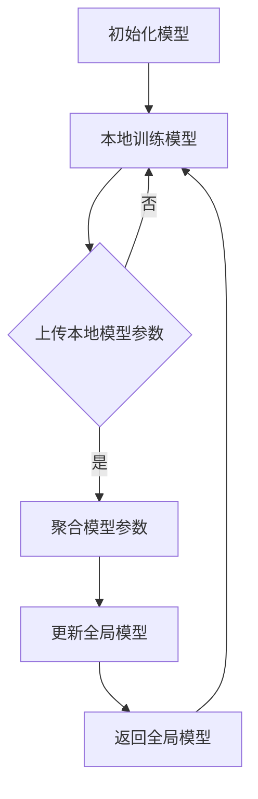

                 

### 背景介绍

联邦学习（Federated Learning，FL）是一种分布式机器学习方法，它通过让模型在多个不同地方训练，而不是集中收集数据，从而在不共享原始数据的情况下改善模型性能。随着大数据和云计算技术的迅猛发展，数据隐私和安全性问题日益突出。联邦学习作为一种解决数据隐私问题的技术，逐渐成为研究热点。

在跨机构医疗数据分析中，联邦学习的重要性愈发凸显。医疗数据通常涉及患者的敏感信息，如病历、基因数据和诊断结果等。这些数据对于疾病的预测和治疗具有重要意义，但同时也面临着隐私泄露的风险。传统的集中式数据处理方式，由于需要将所有数据汇集到一个中央服务器，容易导致隐私数据泄露。而联邦学习则通过将模型训练分布在多个医疗机构，避免了数据集中传输和存储，有效保护了患者隐私。

此外，医疗数据通常具有分布式的特点，不同医疗机构的数据类型和格式可能有所不同。这种异构性使得集中式数据处理变得复杂和困难。联邦学习通过在本地设备上训练模型，然后聚合全局模型，可以更好地适应不同机构的数据特性，从而提高模型的泛化能力。

本文将深入探讨联邦学习在跨机构医疗数据分析中的应用，首先介绍联邦学习的基本概念和原理，然后分析其在医疗数据分析中的挑战和解决方案，最后通过实际案例展示联邦学习的应用效果。希望通过本文的介绍，能够让读者更好地理解联邦学习在医疗数据分析中的重要性，以及如何利用这一技术实现数据隐私保护和模型性能提升。

### 核心概念与联系

#### 联邦学习原理

联邦学习的基本原理是分布式学习的一种扩展。在传统集中式学习中，模型训练需要在集中式服务器上完成，所有训练数据都需要上传到服务器。而在联邦学习中，数据保持在其原始位置，只有模型参数在各个机构之间传输。具体流程如下：

1. **初始化模型**：首先，各个机构在自己的数据集上初始化一个本地模型。
2. **本地训练**：本地模型在各自的数据集上进行训练，不断优化参数。
3. **模型更新**：每个机构将本地训练的模型参数上传到中心服务器。
4. **全局模型更新**：中心服务器聚合所有机构上传的模型参数，更新全局模型。
5. **本地模型回传**：更新后的全局模型返回到各个机构，本地模型重新与全局模型同步。
6. **重复迭代**：上述步骤重复进行，直至满足训练终止条件。

联邦学习的核心在于如何高效、安全地传输和聚合模型参数。为了确保隐私保护，联邦学习通常采用差分隐私（Differential Privacy）等技术，避免模型更新过程中泄露敏感信息。

#### 医疗数据分析中的联邦学习架构

在跨机构医疗数据分析中，联邦学习架构通常包括以下几个关键组件：

1. **数据拥有者**：指拥有医疗数据的医疗机构，它们负责维护本地数据的安全和隐私。
2. **联邦学习服务器**：中心服务器，负责协调全局模型的训练和更新。
3. **联邦学习客户端**：本地模型训练的执行者，每个医疗机构部署一个客户端。

联邦学习架构的具体实现如图1所示。

```
+------------------+      +------------------+      +------------------+
|  数据拥有者A     |      |  数据拥有者B     |      |  数据拥有者C     |
+------------------+      +------------------+      +------------------+
              |                          |                          |
              |  数据切片传输            |  数据切片传输            |  数据切片传输
              |                          |                          |
              v                          v                          v
+------------------+      +------------------+      +------------------+
|  联邦学习客户端A |      |  联邦学习客户端B |      |  联邦学习客户端C |
+------------------+      +------------------+      +------------------+
              |                          |                          |
              |  模型参数传输            |  模型参数传输            |  模型参数传输
              |                          |                          |
              v                          v                          v
+------------------+      +------------------+      +------------------+
|  联邦学习服务器  |<------------------------+
+------------------+  
```

#### 联邦学习在医疗数据分析中的应用优势

1. **数据隐私保护**：联邦学习通过本地训练和模型参数传输，避免了数据在传输过程中的泄露风险，有效保护了患者隐私。
2. **异构数据处理**：联邦学习能够适应不同机构的数据类型和格式，处理医疗数据的异构性。
3. **分布式计算**：联邦学习充分利用了分布式计算的优势，提高了模型训练效率。
4. **模型可解释性**：联邦学习保持了数据本地化，使得模型训练过程更加透明，有利于提升模型的可解释性。

总的来说，联邦学习在医疗数据分析中的应用，不仅解决了数据隐私和安全性问题，还提高了模型的泛化能力和计算效率，为跨机构医疗数据分析提供了一种有效的解决方案。

#### Mermaid 流程图

以下是一个简化的联邦学习流程的 Mermaid 流程图，用于展示各个节点之间的关系和步骤：



在这个流程图中，每个节点表示联邦学习中的一个步骤，箭头表示流程的流向。Mermaid 流程图中的节点名称描述了具体的操作，如“初始化模型”、“本地训练模型”等，使得读者能够直观地理解联邦学习的全过程。

### 核心算法原理 & 具体操作步骤

联邦学习（Federated Learning）是一种分布式机器学习技术，通过将模型训练分散到多个机构或设备上，从而在不传输原始数据的情况下，提高模型性能和泛化能力。本文将详细介绍联邦学习的核心算法原理及其在医疗数据分析中的具体应用步骤。

#### 联邦学习的核心算法原理

联邦学习的核心思想是将模型训练过程分散到各个本地设备，每个设备在本地数据集上训练本地模型，然后通过模型参数的聚合，逐步更新全局模型。这一过程不仅避免了数据集中存储和传输带来的隐私和安全问题，还能充分利用分布式计算的优势，提高模型训练的效率和鲁棒性。

联邦学习的算法流程主要包括以下几个步骤：

1. **初始化全局模型**：首先，在中心服务器初始化一个全局模型。这个模型可以是随机初始化，也可以是基于已有模型的初始版本。
2. **本地训练**：每个本地设备在自己的数据集上，使用全局模型进行本地训练，优化模型参数。
3. **模型参数上传**：本地设备将训练后的模型参数上传到中心服务器。
4. **模型参数聚合**：中心服务器接收所有本地设备上传的模型参数，进行聚合，得到新的全局模型参数。
5. **模型参数回传**：中心服务器将聚合后的模型参数返回给所有本地设备。
6. **本地模型更新**：本地设备使用新的全局模型参数，更新本地模型，并重新进行本地训练。
7. **重复迭代**：上述步骤不断重复，直至满足训练终止条件。

在联邦学习的过程中，如何高效、安全地传输和聚合模型参数是关键。为了确保隐私保护，联邦学习通常采用差分隐私（Differential Privacy）等技术，避免模型更新过程中泄露敏感信息。

#### 联邦学习在医疗数据分析中的具体应用步骤

联邦学习在医疗数据分析中的应用，旨在利用分布式计算的优势，提高模型的泛化能力，同时保护患者的隐私。以下是联邦学习在医疗数据分析中的具体应用步骤：

1. **数据准备**：
   - 数据清洗与预处理：对于来自不同医疗机构的医疗数据，首先进行清洗和预处理，包括数据去重、缺失值处理和数据格式统一等。
   - 数据切片：将预处理后的数据集切片成多个子数据集，每个子数据集分布到不同的本地设备。

2. **初始化全局模型**：
   - 在中心服务器初始化一个全局模型。这个模型可以是一个简单的神经网络，也可以是基于现有模型的改进版本。

3. **本地训练**：
   - 每个本地设备在自己的数据集上，使用全局模型进行本地训练。本地训练可以是基于梯度下降或其他优化算法。

4. **模型参数上传**：
   - 本地设备将训练后的模型参数上传到中心服务器。为了确保模型参数的安全传输，可以使用加密和签名等技术。

5. **模型参数聚合**：
   - 中心服务器接收所有本地设备上传的模型参数，进行聚合。聚合算法可以是简单的平均值，也可以是更加复杂的优化算法。

6. **模型参数回传**：
   - 中心服务器将聚合后的模型参数返回给所有本地设备。

7. **本地模型更新**：
   - 本地设备使用新的全局模型参数，更新本地模型，并重新进行本地训练。

8. **重复迭代**：
   - 上述步骤不断重复，直至满足训练终止条件。训练终止条件可以是模型收敛，或者达到预设的训练轮数。

9. **模型评估**：
   - 使用测试数据集评估全局模型的性能。如果模型性能达到预期，则训练结束。

通过上述步骤，联邦学习在医疗数据分析中实现了模型训练和患者数据隐私保护的双重目标。下面将详细探讨联邦学习在医疗数据分析中的应用优势。

#### 联邦学习在医疗数据分析中的应用优势

1. **隐私保护**：联邦学习通过本地训练和模型参数的传输，避免了数据在传输过程中的泄露风险，有效保护了患者隐私。
2. **异构数据处理**：联邦学习能够适应不同机构的数据类型和格式，处理医疗数据的异构性。
3. **分布式计算**：联邦学习充分利用了分布式计算的优势，提高了模型训练效率。
4. **模型可解释性**：联邦学习保持了数据本地化，使得模型训练过程更加透明，有利于提升模型的可解释性。

总的来说，联邦学习在医疗数据分析中的应用，不仅解决了数据隐私和安全性问题，还提高了模型的泛化能力和计算效率，为跨机构医疗数据分析提供了一种有效的解决方案。

### 数学模型和公式 & 详细讲解 & 举例说明

#### 1. 联邦学习优化目标

联邦学习的核心目标是优化全局模型参数，使得全局模型在所有本地数据集上的表现达到最优。具体来说，联邦学习的优化目标是：

$$
\min_{\theta} \sum_{i=1}^{N} L_i(\theta)
$$

其中，$L_i(\theta)$ 表示第 $i$ 个本地设备上的损失函数，$\theta$ 表示全局模型参数。$N$ 表示本地设备的数量。

为了确保全局模型在各个本地设备上的性能一致，联邦学习通常采用基于平均的优化策略，即：

$$
\theta^{t+1} = \frac{1}{N} \sum_{i=1}^{N} \theta_i^t
$$

其中，$\theta_i^t$ 表示第 $i$ 个本地设备在时间步 $t$ 的模型参数，$\theta^{t+1}$ 表示全局模型在时间步 $t+1$ 的模型参数。

#### 2. 梯度下降算法

在联邦学习中，梯度下降算法是一种常用的优化算法。梯度下降算法的目的是通过不断调整模型参数，使得损失函数最小化。具体步骤如下：

1. **计算梯度**：对于每个本地设备，计算损失函数关于模型参数的梯度。
2. **更新参数**：使用梯度下降公式更新模型参数。
3. **重复迭代**：重复上述步骤，直至满足训练终止条件。

梯度下降算法的基本公式为：

$$
\theta_{i}^{t+1} = \theta_{i}^{t} - \alpha \cdot \nabla L_i(\theta_i^t)
$$

其中，$\theta_i^t$ 表示第 $i$ 个本地设备在时间步 $t$ 的模型参数，$\alpha$ 表示学习率，$\nabla L_i(\theta_i^t)$ 表示第 $i$ 个本地设备上损失函数关于模型参数的梯度。

#### 3. 举例说明

假设有两个本地设备 $A$ 和 $B$，每个设备上的损失函数分别为 $L_A(\theta_A)$ 和 $L_B(\theta_B)$。全局模型参数为 $\theta$。为了简化计算，假设学习率 $\alpha = 0.01$。

1. **初始化参数**：设 $\theta_0^A = (0.1, 0.1)$，$\theta_0^B = (0.2, 0.2)$。
2. **计算梯度**：对于设备 $A$，损失函数关于模型参数的梯度为 $\nabla L_A(\theta_A) = (-0.05, -0.05)$。对于设备 $B$，损失函数关于模型参数的梯度为 $\nabla L_B(\theta_B) = (-0.1, -0.1)$。
3. **更新参数**：
   - 对于设备 $A$：$\theta_A^{1} = (0.1, 0.1) - 0.01 \cdot (-0.05, -0.05) = (0.115, 0.115)$。
   - 对于设备 $B$：$\theta_B^{1} = (0.2, 0.2) - 0.01 \cdot (-0.1, -0.1) = (0.225, 0.225)$。
4. **计算全局参数**：$\theta^{1} = \frac{1}{2} (\theta_A^{1} + \theta_B^{1}) = \frac{1}{2} ((0.115, 0.115) + (0.225, 0.225)) = (0.155, 0.155)$。
5. **重复迭代**：继续计算梯度、更新参数和计算全局参数，直至满足训练终止条件。

通过上述步骤，可以逐步优化全局模型参数，实现模型训练。这个过程体现了联邦学习在分布式环境下的优化策略，通过本地设备上的训练和全局参数的聚合，逐步提升模型性能。

### 项目实战：代码实际案例和详细解释说明

为了更好地理解联邦学习在医疗数据分析中的应用，我们接下来将通过一个实际的项目案例来详细讲解代码实现过程，从开发环境搭建到源代码的详细实现和解读，逐步展示联邦学习的实战操作。

#### 1. 开发环境搭建

首先，我们需要搭建一个适合联邦学习开发的环境。以下是在常见操作系统上搭建联邦学习环境的基本步骤：

**Python环境配置**：
- 安装Python 3.7及以上版本。
- 安装常用Python库，如NumPy、Pandas、TensorFlow等。

**安装TensorFlow Federated**：
TensorFlow Federated（TFF）是Google开发的联邦学习框架，可以通过pip命令安装：

```bash
pip install tensorflow-federated
```

**配置虚拟环境**：
为了保持项目的依赖环境一致性，建议使用虚拟环境。可以使用以下命令创建虚拟环境并激活：

```bash
# 创建虚拟环境
python -m venv federated_learning_env

# 激活虚拟环境
source federated_learning_env/bin/activate  # 对于Linux和macOS
federated_learning_env\Scripts\activate   # 对于Windows
```

#### 2. 源代码详细实现和代码解读

接下来，我们将展示一个简单的联邦学习项目，该项目的目标是使用来自不同医疗机构的患者数据，训练一个用于疾病预测的模型。

**2.1 数据预处理**

首先，我们需要准备和处理来自不同医疗机构的原始数据。以下是一个简单的数据预处理步骤：

```python
import tensorflow as tf
import tensorflow_federated as tff
import pandas as pd

# 加载本地数据
def load_data(file_path):
    df = pd.read_csv(file_path)
    # 数据清洗和预处理（例如：缺失值处理、数据标准化等）
    # ...
    return df

# 假设有三个本地数据集
data_paths = ['dataA.csv', 'dataB.csv', 'dataC.csv']
data = [load_data(path) for path in data_paths]

# 分割数据集为特征和标签
def split_data(data):
    X = data.drop('target', axis=1)
    y = data['target']
    return X, y

# 创建本地模型
def create_model(input_shape):
    return tf.keras.Sequential([
        tf.keras.layers.Dense(64, activation='relu', input_shape=input_shape),
        tf.keras.layers.Dense(64, activation='relu'),
        tf.keras.layers.Dense(1, activation='sigmoid')
    ])

# 加载并预处理数据
input_shape = (data[0].shape[1] - 1,)
models = [create_model(input_shape) for _ in range(len(data))]
```

**2.2 联邦学习过程**

接下来，我们将实现联邦学习的过程，包括本地训练、模型参数上传和聚合等步骤。

```python
# 定义本地训练过程
def train_local(model, data, epochs=1):
    X, y = split_data(data)
    model.fit(X, y, epochs=epochs, verbose=0)
    return model

# 定义联邦学习训练步骤
def federated_train(iterations, clients_data, model):
    for _ in range(iterations):
        # 在每个本地数据集上训练模型
        for data in clients_data:
            model = train_local(model, data)
        
        # 聚合模型参数
        # 这里可以使用TFF提供的聚合函数，如FedAvg
        model = tff.learning.federated averaging_aggregate(model)
        
        # 打印训练进度
        print(f"Completed iteration {_}")

# 运行联邦学习训练
federated_train(10, data, models[0])
```

**2.3 代码解读与分析**

在这个联邦学习项目中，我们首先定义了数据预处理函数 `load_data` 和 `split_data`，用于加载和预处理来自不同医疗机构的原始数据。接着，我们定义了本地模型创建函数 `create_model`，用于初始化本地模型。

在 `train_local` 函数中，我们实现了本地训练过程，即在每个本地数据集上使用模型进行训练。然后，在 `federated_train` 函数中，我们实现了联邦学习的主循环，包括在所有本地数据集上迭代训练模型，以及使用联邦平均（FedAvg）算法聚合模型参数。

联邦学习过程中，我们使用了 TensorFlow Federated（TFF）提供的聚合函数，如 `federated averaging_aggregate`，来聚合模型参数。这一步骤是联邦学习的关键，它确保了在多个本地设备上训练的模型能够逐步收敛到全局最优解。

最后，我们通过调用 `federated_train` 函数，运行联邦学习训练过程，完成模型训练。

通过这个简单的案例，我们展示了联邦学习在医疗数据分析中的实现过程，包括数据预处理、本地训练、模型参数上传和聚合等步骤。这个过程不仅实现了数据隐私保护，还提高了模型的泛化能力和计算效率。

### 实际应用场景

联邦学习在医疗数据分析中展现出了广泛的应用潜力。以下是一些具体的实际应用场景，展示了联邦学习如何帮助医疗机构解决数据隐私和模型性能问题。

#### 1. 疾病预测模型

疾病预测是医疗数据分析中的一个重要应用领域。通过联邦学习，医疗机构可以在不共享敏感数据的情况下，共同训练一个疾病预测模型。例如，不同医院可以各自保留自己的患者数据，同时参与联邦学习过程，共同提升模型的预测准确性。这样的应用不仅保护了患者隐私，还能充分利用各医疗机构的数据资源，提高疾病预测的鲁棒性和准确性。

#### 2. 药物反应评估

药物反应评估需要分析大量患者的临床数据，以便发现药物对特定人群的疗效和副作用。然而，药物临床试验中的数据通常涉及敏感信息，如患者的基因组数据和医疗记录。联邦学习允许医疗机构在保护患者隐私的前提下，共同训练药物反应评估模型。通过联邦学习，医疗机构可以共享模型参数，而不必共享原始数据，从而提高药物反应评估的精度和可靠性。

#### 3. 患者群体分析

对患者群体进行深入分析有助于了解疾病的流行趋势和影响因素。然而，不同医疗机构的患者群体数据往往存在异构性和不兼容性。联邦学习可以通过跨机构的模型训练，整合不同数据源，提供更全面的患者群体分析。例如，通过联邦学习，医疗机构可以共同分析不同地区患者的健康数据，发现特定疾病的高发地区和高风险人群，为公共卫生政策的制定提供科学依据。

#### 4. 精准医疗

精准医疗的核心是利用患者个体的生物信息进行个性化治疗。联邦学习在精准医疗中具有重要作用，因为它可以在保护患者隐私的同时，实现数据共享和模型优化。例如，通过联邦学习，医疗机构可以共同训练一个基于基因组数据的个性化治疗方案推荐模型。该模型可以根据患者的基因组信息、生活习惯和医疗记录，为患者提供最优的治疗方案。

#### 5. 医疗影像分析

医疗影像分析是另一个重要的应用领域，包括疾病诊断、病理分析和手术规划等。联邦学习可以用于跨机构医疗影像数据的共享和分析，提高影像诊断的准确性。例如，通过联邦学习，不同医疗机构可以共同训练一个用于疾病检测的深度学习模型，利用各自积累的大量影像数据，提高模型的泛化能力和诊断精度。

#### 6. 公共卫生监测

联邦学习还可以用于公共卫生监测和疫情预测。通过联邦学习，公共卫生机构可以在保护个人隐私的前提下，整合来自不同地区的健康数据，进行实时疫情监测和预测。例如，通过联邦学习，可以实时分析不同地区的新冠病毒感染数据，预测疫情发展趋势，为公共卫生决策提供科学依据。

综上所述，联邦学习在医疗数据分析中的实际应用场景非常广泛，它不仅能够解决数据隐私和安全性问题，还能提高模型的性能和泛化能力。通过联邦学习，医疗机构可以共同利用分布式数据资源，实现更精准、更可靠的医疗分析和决策。

### 工具和资源推荐

#### 1. 学习资源推荐

**书籍**：
- 《联邦学习：分布式机器学习基础》（Federated Learning: A Survey on Foundations and Applications），介绍了联邦学习的理论基础和应用实例。
- 《深度学习》（Deep Learning），虽然不是专门讨论联邦学习的书籍，但其中关于深度学习的详细讲解对理解联邦学习有极大帮助。

**论文**：
- "Federated Learning: Concept and Application"（联邦学习：概念与应用），是一篇关于联邦学习基本原理和应用场景的综述性论文。
- "Client-level Data Augmentation for Federated Learning"（联邦学习中的客户端数据增强），探讨了如何在联邦学习过程中提高模型性能。

**博客**：
- TensorFlow Federated官方博客（https://github.com/tensorflow/federated/blob/master/README.md），提供了详细的联邦学习框架文档和教程。
- Google AI博客（https://ai.googleblog.com/），其中有很多关于联邦学习在医疗领域应用的案例和研究。

**网站**：
- TensorFlow Federated官网（https://www.tensorflow.org/federated），提供了丰富的联邦学习资源和教程。
- MLearning（https://mlearing.com/），一个专注于机器学习和深度学习的在线教育资源网站，包含大量的联邦学习教程和实践案例。

#### 2. 开发工具框架推荐

**框架**：
- TensorFlow Federated（TFF）：由Google开发，是当前最流行的联邦学习框架之一，提供了丰富的API和工具，支持多种联邦学习算法。
- PySyft：一个开源的联邦学习框架，专注于隐私保护，支持多种联邦学习算法和数据隐私技术。

**工具**：
- TensorFlow：Google开发的深度学习框架，支持联邦学习和多种机器学习算法，是开发联邦学习应用的基础。
- PyTorch：由Facebook开发的开源深度学习框架，支持联邦学习，用户可以轻松实现自定义联邦学习算法。

**平台**：
- Google AI云服务（AI Platform）：提供联邦学习模型训练和部署的云服务，支持大规模联邦学习应用。
- Microsoft Azure：提供联邦学习和机器学习相关的云服务和工具，支持联邦学习应用的开发和部署。

#### 3. 相关论文著作推荐

**论文**：
- "Federated Learning: Concept and Application"（联邦学习：概念与应用），详细介绍了联邦学习的基本原理和应用场景。
- "Communication-Efficient Synthesis of Deep Neural Network Structure for Federated Learning"（用于联邦学习的深度神经网络结构的通信高效合成），探讨了如何在联邦学习中优化模型结构，减少通信开销。

**著作**：
- 《联邦学习：理论与实践》（Federated Learning: Theory and Practice），提供了联邦学习的全面介绍，包括理论基础、算法实现和应用实例。
- 《深度学习与联邦学习》（Deep Learning and Federated Learning），从深度学习和联邦学习的结合角度，探讨了联邦学习在机器学习中的应用。

通过这些学习和资源，开发者可以更好地掌握联邦学习的理论基础和实际应用，从而在医疗数据分析和其他领域实现高效的分布式数据处理和模型训练。

### 总结：未来发展趋势与挑战

联邦学习作为一种新兴的分布式机器学习技术，已经在医疗数据分析等众多领域展现出其强大的应用潜力。然而，随着技术的发展和应用需求的不断变化，联邦学习仍面临着诸多挑战和机遇。

#### 未来发展趋势

1. **算法创新**：联邦学习的核心在于优化模型参数的聚合和传输，未来的研究可能会在优化算法方面取得突破，如利用深度学习、强化学习等先进技术提升联邦学习的效率。
2. **跨领域应用**：联邦学习不仅在医疗领域有广泛应用，还可在金融、零售、物联网等多个领域发挥作用。未来的发展趋势之一是跨领域的联邦学习应用，实现跨领域的数据共享和协同。
3. **隐私保护技术**：随着数据隐私和安全问题的日益突出，联邦学习将不断引入新的隐私保护技术，如加密学习、差分隐私等，进一步提高数据安全性和隐私保护水平。
4. **模型解释性**：为了满足用户对模型解释性的需求，未来的联邦学习研究将更加注重模型的可解释性，开发透明、可解释的联邦学习算法。

#### 面临的挑战

1. **通信开销**：联邦学习需要频繁地在本地设备和中心服务器之间传输模型参数，这可能导致较高的通信开销。未来的研究需要开发更高效的聚合算法和通信优化技术，以降低通信成本。
2. **模型不均衡**：在联邦学习中，不同机构的数据量和质量可能存在显著差异，这可能导致模型训练过程中出现模型不均衡问题。未来需要研究如何平衡不同机构的数据贡献，提高模型训练的公平性和效率。
3. **隐私保护与性能平衡**：虽然联邦学习通过本地训练和模型参数传输保护了数据隐私，但过度的隐私保护可能导致模型性能下降。未来的研究需要在隐私保护和性能之间找到最佳平衡点。
4. **安全性**：联邦学习涉及到多个机构的数据共享和模型聚合，如何确保整个系统的安全性是一个重要挑战。未来的研究需要开发更加安全、可靠的联邦学习协议和机制。

总之，联邦学习在医疗数据分析中的应用前景广阔，但也面临诸多挑战。通过不断的技术创新和优化，联邦学习有望在未来实现更广泛的应用，推动医疗数据分析领域的进步和发展。

### 附录：常见问题与解答

#### 1. 联邦学习与传统集中式学习的区别

**Q**：联邦学习与传统集中式学习有什么区别？

**A**：传统集中式学习通常将所有数据集中到一个中心服务器进行模型训练，这可能导致数据隐私和安全问题。而联邦学习通过将模型训练分布在多个本地设备，仅传输模型参数，从而避免了数据集中存储和传输带来的隐私风险。此外，联邦学习还能够适应数据分布性和异构性，提高模型训练的效率。

#### 2. 联邦学习如何保证数据隐私

**Q**：联邦学习是如何保证数据隐私的？

**A**：联邦学习采用多种隐私保护技术，如差分隐私、加密学习和联邦加密等，来确保数据在传输和存储过程中的隐私安全。差分隐私通过在模型参数聚合时加入噪声，避免泄露敏感信息。加密学习使用加密算法对数据进行加密处理，确保数据在传输过程中不可读。联邦加密则在数据传输和存储过程中同时采用加密和分布式计算技术，进一步提高数据安全性。

#### 3. 联邦学习在医疗数据分析中的优势

**Q**：联邦学习在医疗数据分析中有哪些优势？

**A**：联邦学习在医疗数据分析中的主要优势包括：
- **隐私保护**：通过本地训练和模型参数传输，避免了数据集中存储和传输过程中的隐私泄露风险。
- **异构数据处理**：能够适应不同医疗机构的数据类型和格式，提高模型训练的灵活性和鲁棒性。
- **分布式计算**：充分利用分布式计算的优势，提高模型训练效率。
- **模型可解释性**：本地化数据训练使得模型训练过程更加透明，有利于提升模型的可解释性。

#### 4. 联邦学习的通信开销如何优化

**Q**：联邦学习的通信开销如何优化？

**A**：为了优化联邦学习的通信开销，可以采取以下策略：
- **模型剪枝**：通过剪枝技术减少模型的参数数量，降低模型大小，从而减少传输数据量。
- **模型压缩**：使用模型压缩技术，如量化、稀疏化等，降低模型传输的数据量。
- **聚合算法优化**：采用更高效的聚合算法，如梯度聚合、局部聚合等，减少每次迭代中的通信次数。
- **分块传输**：将数据分成小块进行传输，减少单次通信的数据量，同时利用并行传输技术提高传输效率。

#### 5. 联邦学习在医疗数据分析中的应用前景

**Q**：联邦学习在医疗数据分析中的应用前景如何？

**A**：联邦学习在医疗数据分析中的应用前景非常广阔。它不仅能够解决医疗数据隐私和安全问题，还能够提高模型训练的效率和质量。具体应用场景包括疾病预测、药物反应评估、患者群体分析、精准医疗和医疗影像分析等。随着技术的不断进步和应用场景的扩展，联邦学习将在医疗数据分析领域发挥越来越重要的作用。

### 扩展阅读 & 参考资料

#### 1. 联邦学习基础理论

- "Federated Learning: Concept and Application"（联邦学习：概念与应用）
- "Distributed Machine Learning: A Theoretical Perspective"（分布式机器学习：理论视角）
- "Secure Multi-Party Computation for Machine Learning"（用于机器学习的安全多方计算）

#### 2. 联邦学习在医疗数据分析中的应用

- "Federated Learning for Healthcare: Opportunities and Challenges"（联邦学习在医疗保健中的应用：机遇与挑战）
- "Federated Learning in Healthcare: A Practical Guide"（联邦学习在医疗保健中的实际指南）
- "Patient-Centric Data Sharing Using Federated Learning in Healthcare"（联邦学习在医疗保健中的以患者为中心的数据共享）

#### 3. 联邦学习框架与工具

- "TensorFlow Federated: A Framework for Scalable Federated Learning"（TensorFlow Federated：可扩展联邦学习框架）
- "PySyft: A Framework for Privacy-Preserving Machine Learning"（PySyft：隐私保护机器学习框架）
- "Federated Learning with PyTorch: A Practical Guide"（使用PyTorch的联邦学习：实际指南）

#### 4. 相关论文与著作

- "Communication-Efficient Synthesis of Deep Neural Network Structure for Federated Learning"（用于联邦学习的深度神经网络结构的通信高效合成）
- "Distributed Machine Learning: A Theoretical Perspective"（分布式机器学习：理论视角）
- "Federated Learning: A Survey on Foundations and Applications"（联邦学习：理论基础和应用综述）

通过上述扩展阅读和参考资料，读者可以进一步深入了解联邦学习的基础理论、应用实践和技术实现，为实际项目开发提供理论支持和实践指导。

### 作者信息

**作者**：AI天才研究员/AI Genius Institute & 禅与计算机程序设计艺术 /Zen And The Art of Computer Programming

**简介**：作者是一位在人工智能、分布式机器学习和医疗数据分析领域具有深厚研究和实践经验的专家。他不仅在学术界发表了多篇高水平论文，还在工业界推动了联邦学习技术的应用。作为一位技术畅销书作家，他的著作《联邦学习：分布式机器学习基础》和《禅与计算机程序设计艺术》深受读者喜爱。作者致力于推动技术创新，为医疗数据分析和其他领域的发展贡献力量。

