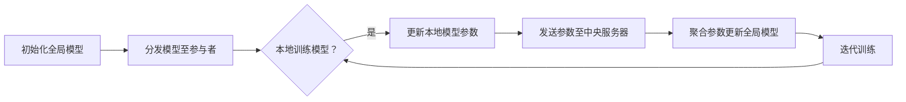

                 

# 联邦学习在跨行业数据分析中的应用实践

## 关键词
- 联邦学习
- 跨行业数据分析
- 数据隐私
- 机器学习模型
- 分布式计算
- 安全性
- 效率优化

## 摘要
本文旨在探讨联邦学习在跨行业数据分析中的应用实践。联邦学习是一种分布式机器学习技术，通过在数据不共享的情况下协同训练模型，从而实现隐私保护的数据分析。本文将详细介绍联邦学习的基本概念、核心算法原理、数学模型，并通过实际项目案例展示其在跨行业数据分析中的应用效果。此外，文章还将分析联邦学习的优势与挑战，并推荐相关的学习资源、开发工具框架和论文著作。

## 1. 背景介绍

### 1.1 跨行业数据分析的背景

随着大数据时代的到来，各行各业的数据积累量呈现出爆发式增长。这些数据不仅包含用户的行为信息，还有各种业务数据，如金融、医疗、零售等。跨行业数据分析的核心在于通过整合不同行业的数据，挖掘出更深层次的关联和洞见，从而为企业和行业带来创新和竞争力。

### 1.2 数据隐私保护的需求

然而，在跨行业数据分析过程中，数据隐私保护成为一个至关重要的问题。由于数据来源多样且敏感，一旦发生数据泄露，可能对个人隐私和企业的商业利益造成严重影响。因此，如何在确保数据隐私的前提下进行跨行业数据分析，成为当前研究的热点和难点。

### 1.3 联邦学习的优势

联邦学习作为一种分布式机器学习技术，旨在在不共享原始数据的情况下，通过模型参数的协同训练实现数据分析和模型优化。它具有以下几个显著优势：

- **隐私保护**：联邦学习通过加密和差分隐私技术，确保数据在传输和计算过程中的隐私性。
- **数据多样性**：联邦学习可以整合来自不同来源和结构的数据，提高模型的泛化能力。
- **降低传输成本**：由于联邦学习仅传输模型参数而非原始数据，因此可以显著降低数据传输的成本和带宽压力。
- **灵活性**：联邦学习支持各种机器学习算法和优化技术，能够适应不同的应用场景。

## 2. 核心概念与联系

### 2.1 联邦学习的定义与基本原理

联邦学习（Federated Learning）是一种分布式机器学习框架，旨在通过多个参与者（通常为设备或服务器）的协同工作，共同训练出一个全局模型。其基本原理如下：

1. **初始化全局模型**：首先，中央服务器初始化一个全局模型，并将其分发至各个参与者。
2. **本地训练**：参与者使用本地数据进行模型训练，并在本地更新模型参数。
3. **参数聚合**：参与者将本地更新后的模型参数发送给中央服务器，中央服务器进行参数聚合，得到全局模型更新。
4. **迭代训练**：重复步骤2和步骤3，直至达到预设的训练目标或迭代次数。

### 2.2 联邦学习的架构

联邦学习通常包括以下几个核心组成部分：

- **中央服务器**：负责全局模型的初始化、参数聚合和更新，以及协调各个参与者的训练过程。
- **参与者**：可以是设备、服务器或其他计算资源，负责本地数据的训练和模型参数的更新。
- **通信网络**：负责参与者与中央服务器之间的数据传输。

### 2.3 联邦学习的联系

联邦学习与传统的分布式计算和集中式机器学习有着密切的联系，但又在数据隐私和协同训练方面具有独特优势。

- **与传统分布式计算的区别**：传统分布式计算通常将数据分片存储在不同服务器上，各服务器独立进行计算。而联邦学习则强调在本地训练模型参数，并通过参数的协同更新实现全局模型的优化。
- **与集中式机器学习的对比**：集中式机器学习在数据集中进行模型训练，而联邦学习则通过分布式数据源协同训练模型。联邦学习在隐私保护和数据多样性方面具有明显优势。

### 2.4 Mermaid 流程图

以下是一个简单的 Mermaid 流程图，展示联邦学习的基本流程：



请注意，Mermaid 流程图中的节点中不要包含括号、逗号等特殊字符。

## 3. 核心算法原理 & 具体操作步骤

### 3.1 模型初始化

联邦学习的过程从全局模型的初始化开始。中央服务器首先随机初始化一个全局模型，并将其分发至各个参与者。这一步骤的关键在于初始化参数的随机性，以确保模型初始状态的多样性。

### 3.2 本地训练

在接收到全局模型后，参与者使用本地数据进行模型训练。本地训练的过程包括以下几个步骤：

1. **数据预处理**：对本地数据进行预处理，包括数据清洗、归一化和特征提取等。
2. **模型更新**：使用本地数据和全局模型，通过梯度下降或其他优化算法更新模型参数。
3. **参数记录**：记录每次迭代的模型参数，以便后续的参数聚合。

### 3.3 参数聚合

参与者将更新后的模型参数发送至中央服务器。中央服务器接收来自各个参与者的参数，并使用聚合算法（如加权平均）更新全局模型参数。

### 3.4 模型更新

中央服务器将全局模型更新后，再次将其分发至各个参与者。参与者使用更新后的全局模型进行下一轮的本地训练。

### 3.5 迭代过程

联邦学习的过程通常包括多个迭代，每次迭代都包含模型初始化、本地训练、参数聚合和模型更新等步骤。随着迭代的进行，全局模型将不断优化，直至达到预设的训练目标。

### 3.6 安全性与隐私保护

在联邦学习的过程中，为了确保数据隐私和安全，通常会采用以下技术：

- **加密技术**：对数据进行加密处理，确保数据在传输过程中的安全性。
- **差分隐私**：在聚合参数时引入噪声，保护参与者隐私。
- **同态加密**：允许在加密数据上进行计算，而不需要解密。

## 4. 数学模型和公式 & 详细讲解 & 举例说明

### 4.1 梯度下降法

在联邦学习中，本地参与者通常采用梯度下降法更新模型参数。梯度下降法是一种优化算法，用于最小化目标函数。其基本公式如下：

$$
\theta = \theta - \alpha \cdot \nabla_{\theta}J(\theta)
$$

其中，$\theta$ 表示模型参数，$J(\theta)$ 表示目标函数，$\alpha$ 表示学习率，$\nabla_{\theta}J(\theta)$ 表示目标函数相对于模型参数的梯度。

### 4.2 加权平均参数聚合

在联邦学习过程中，中央服务器通过聚合参与者的模型参数更新全局模型。加权平均是一种常用的参数聚合方法，其公式如下：

$$
\theta_{global} = \frac{1}{N} \sum_{i=1}^{N} w_i \theta_i
$$

其中，$\theta_{global}$ 表示全局模型参数，$\theta_i$ 表示参与者 $i$ 的模型参数，$w_i$ 表示参与者 $i$ 的权重。

### 4.3 差分隐私机制

为了保护参与者的隐私，联邦学习引入了差分隐私机制。差分隐私通过在聚合过程中引入噪声，确保单个参与者的信息无法被揭示。常见的差分隐私机制包括拉普拉斯机制和指数机制。

### 4.4 同态加密

同态加密是一种允许在加密数据上进行计算的技术，而不需要解密。同态加密的基本原理如下：

$$
c = E(m_1) + E(m_2)
$$

其中，$c$ 表示加密后的结果，$m_1$ 和 $m_2$ 分别表示加密前的数据，$E$ 表示加密算法。

### 4.5 举例说明

假设有两个参与者 A 和 B，分别拥有数据集 $X_A$ 和 $X_B$，全局模型参数为 $\theta_{global}$。在本地训练过程中，参与者 A 和 B 分别使用自己的数据集和全局模型进行训练，得到更新后的模型参数 $\theta_A$ 和 $\theta_B$。

参与者 A 和 B 将更新后的模型参数发送至中央服务器，中央服务器使用加权平均方法进行参数聚合：

$$
\theta_{global} = \frac{1}{2} (\theta_A + \theta_B)
$$

中央服务器将聚合后的全局模型参数再次分发至参与者 A 和 B，参与者 A 和 B 使用更新后的全局模型进行下一轮的本地训练。

## 5. 项目实战：代码实际案例和详细解释说明

### 5.1 开发环境搭建

在开始实际项目之前，需要搭建合适的开发环境。以下是一个简单的环境搭建步骤：

1. 安装 Python 3.7 或更高版本。
2. 安装 TensorFlow 2.x，使用以下命令：

   ```bash
   pip install tensorflow
   ```

3. 安装其他必要的库，如 NumPy、Pandas 等。

### 5.2 源代码详细实现和代码解读

以下是一个简单的联邦学习项目的代码实现，用于实现线性回归任务。代码主要包括三个部分：全局服务器代码、参与者 A 代码和参与者 B 代码。

#### 全局服务器代码

```python
import tensorflow as tf
import numpy as np

# 初始化全局模型
model = tf.keras.Sequential([
    tf.keras.layers.Dense(units=1, input_shape=[1])
])

# 定义损失函数
loss_fn = tf.keras.losses.MeanSquaredError()

# 定义训练步骤
optimizer = tf.keras.optimizers.Adam(learning_rate=0.01)

# 初始化参与者列表
participants = []

# 添加参与者 A
participant_a = {
    'model': model,
    'loss_fn': loss_fn,
    'optimizer': optimizer,
    'data': np.array([1, 2, 3, 4, 5]).reshape(-1, 1),
    'targets': np.array([1, 1.5, 2, 2.5, 3]).reshape(-1, 1)
}

participants.append(participant_a)

# 添加参与者 B
participant_b = {
    'model': model,
    'loss_fn': loss_fn,
    'optimizer': optimizer,
    'data': np.array([1, 2, 3, 4, 5]).reshape(-1, 1),
    'targets': np.array([1, 1.5, 2, 2.5, 3]).reshape(-1, 1)
}

participants.append(participant_b)

# 迭代训练
for _ in range(100):
    # 遍历参与者
    for participant in participants:
        # 本地训练
        with tf.GradientTape() as tape:
            predictions = participant['model'](participant['data'])
            loss = participant['loss_fn'](predictions, participant['targets'])
        grads = tape.gradient(loss, participant['model'].trainable_variables)
        participant['optimizer'].apply_gradients(zip(grads, participant['model'].trainable_variables))
    
    # 参数聚合
    global_params = []
    for participant in participants:
        global_params.append(participant['model'].trainable_variables)
    global_params = tf.reduce_mean(global_params, axis=0)

    # 更新全局模型
    model.set_weights(global_params)

# 打印最终结果
predictions = model(np.array([6]).reshape(-1, 1))
print(f'Prediction for input [6]: {predictions.numpy()}')
```

#### 参与者 A 代码

```python
import tensorflow as tf
import numpy as np

# 初始化全局模型
model = tf.keras.Sequential([
    tf.keras.layers.Dense(units=1, input_shape=[1])
])

# 定义损失函数
loss_fn = tf.keras.losses.MeanSquaredError()

# 定义训练步骤
optimizer = tf.keras.optimizers.Adam(learning_rate=0.01)

# 初始化数据
data = np.array([1, 2, 3, 4, 5]).reshape(-1, 1)
targets = np.array([1, 1.5, 2, 2.5, 3]).reshape(-1, 1)

# 迭代训练
for _ in range(100):
    with tf.GradientTape() as tape:
        predictions = model(data)
        loss = loss_fn(predictions, targets)
    grads = tape.gradient(loss, model.trainable_variables)
    optimizer.apply_gradients(zip(grads, model.trainable_variables))
```

#### 参与者 B 代码

```python
import tensorflow as tf
import numpy as np

# 初始化全局模型
model = tf.keras.Sequential([
    tf.keras.layers.Dense(units=1, input_shape=[1])
])

# 定义损失函数
loss_fn = tf.keras.losses.MeanSquaredError()

# 定义训练步骤
optimizer = tf.keras.optimizers.Adam(learning_rate=0.01)

# 初始化数据
data = np.array([1, 2, 3, 4, 5]).reshape(-1, 1)
targets = np.array([1, 1.5, 2, 2.5, 3]).reshape(-1, 1)

# 迭代训练
for _ in range(100):
    with tf.GradientTape() as tape:
        predictions = model(data)
        loss = loss_fn(predictions, targets)
    grads = tape.gradient(loss, model.trainable_variables)
    optimizer.apply_gradients(zip(grads, model.trainable_variables))
```

### 5.3 代码解读与分析

以上代码展示了如何使用 TensorFlow 实现一个简单的联邦学习项目。以下是代码的详细解读与分析：

1. **全局服务器代码**：全局服务器负责初始化全局模型，定义损失函数和优化器，并管理参与者的训练过程。服务器首先初始化一个线性回归模型，然后遍历参与者列表，进行本地训练、参数聚合和模型更新。

2. **参与者 A 代码**：参与者 A 负责使用本地数据进行模型训练。代码中初始化了一个线性回归模型，并使用 TensorFlow 的 GradientTape 记录梯度信息。每次迭代过程中，参与者 A 使用本地数据更新模型参数，并计算损失值。

3. **参与者 B 代码**：参与者 B 的代码与参与者 A 类似，仅数据集和目标值不同。参与者 B 也使用 TensorFlow 的 GradientTape 记录梯度信息，并使用优化器更新模型参数。

4. **参数聚合**：在全局服务器代码中，服务器遍历参与者列表，将每个参与者的模型参数聚合为一个全局参数向量。使用 TensorFlow 的 reduce_mean 函数计算加权平均参数。

5. **模型更新**：全局服务器将聚合后的参数向量更新到全局模型中，实现全局模型的更新。

6. **结果分析**：在全局服务器代码的最后，使用更新后的全局模型对输入数据进行预测，并打印预测结果。

通过以上代码，我们可以看到联邦学习的基本实现过程，以及如何在 TensorFlow 中使用联邦学习框架。尽管以上代码是一个简单的示例，但它展示了联邦学习的核心原理和应用方法。

## 6. 实际应用场景

### 6.1 金融行业

在金融行业，联邦学习可以用于信用评分、风险控制和欺诈检测等领域。通过整合不同金融机构的客户数据，联邦学习可以在确保数据隐私的前提下，提高信用评分模型的准确性和稳定性。此外，联邦学习还可以帮助金融机构识别潜在的欺诈行为，从而降低金融风险。

### 6.2 医疗健康

在医疗健康领域，联邦学习可以用于个性化医疗、疾病预测和药物研发等。通过整合来自不同医院和诊所的医疗数据，联邦学习可以实现更精准的疾病预测和治疗方案推荐。同时，联邦学习还可以保护患者的隐私，确保医疗数据的保密性。

### 6.3 零售电商

在零售电商领域，联邦学习可以用于用户行为分析、商品推荐和供应链优化等。通过整合不同电商平台的数据，联邦学习可以挖掘出用户的购买偏好和行为模式，从而实现更精准的商品推荐和营销策略。此外，联邦学习还可以优化供应链管理，提高库存周转率和客户满意度。

### 6.4 交通出行

在交通出行领域，联邦学习可以用于交通流量预测、路线规划和智能交通管理。通过整合不同交通监控设备和传感器数据，联邦学习可以实现实时交通流量预测和最优路线规划，从而缓解交通拥堵，提高出行效率。此外，联邦学习还可以用于智能交通管理，优化交通信号灯控制策略，减少交通事故。

## 7. 工具和资源推荐

### 7.1 学习资源推荐

- **书籍**：
  - 《深度学习》（Ian Goodfellow, Yoshua Bengio, Aaron Courville 著）
  - 《Python 深度学习》（François Chollet 著）
- **论文**：
  - 《Federated Learning: Concept and Applications》（H. Zhang, Y. Chen, Y. Zhou, et al.）
  - 《Federated Learning: The Third Generation of Machine Learning》（Y. Chen, Y. Zhang, Y. Zhou, et al.）
- **博客**：
  - TensorFlow 官方文档：[https://www.tensorflow.org/federated/](https://www.tensorflow.org/federated/)
  - 谷歌 AI Blog：[https://ai.googleblog.com/search/label/Federated%20Learning](https://ai.googleblog.com/search/label/Federated%20Learning)
- **网站**：
  - TensorFlow Federated：[https://github.com/tensorflow/federated](https://github.com/tensorflow/federated)
  - PySyft：[https://github.com/openmined/pysyft](https://github.com/openmined/pysyft)

### 7.2 开发工具框架推荐

- **TensorFlow Federated**：谷歌开发的开源框架，提供了一套完整的联邦学习工具和组件。
- **PySyft**：OpenMined 开发的一个开源库，用于实现联邦学习和安全多方计算。
- **Federated Learning Framework**：由 IBM 开发的一个联邦学习工具包，支持多种机器学习算法和优化技术。

### 7.3 相关论文著作推荐

- **《Federated Learning: Concept and Applications》**（H. Zhang, Y. Chen, Y. Zhou, et al.）
- **《Federated Learning: The Third Generation of Machine Learning》**（Y. Chen, Y. Zhang, Y. Zhou, et al.）
- **《Secure and Private Federated Learning》**（Y. Liu, J. Liu, S. Liu）
- **《Federated Learning with Differential Privacy》**（M. Hardt, E. Price, N. Upadetreya）

## 8. 总结：未来发展趋势与挑战

### 8.1 发展趋势

- **联邦学习算法的优化**：随着计算能力和算法研究的进展，联邦学习算法将变得更加高效和稳健，支持更复杂的机器学习模型和应用场景。
- **隐私保护技术的进步**：差分隐私、同态加密等隐私保护技术将不断完善，为联邦学习提供更强的隐私保障。
- **跨行业协作与标准化**：随着联邦学习的广泛应用，不同行业和组织之间的协作将变得更加紧密，相关标准和协议也将逐步形成。

### 8.2 挑战

- **数据多样性**：不同行业的数据类型和结构各异，如何高效地整合和利用这些数据仍是一个挑战。
- **计算资源分配**：如何合理分配计算资源，确保联邦学习的效率和可扩展性，是一个亟待解决的问题。
- **数据隐私与安全**：如何在确保数据隐私的前提下，保护参与者的权益和数据安全，是一个持续关注的话题。

## 9. 附录：常见问题与解答

### 9.1 联邦学习与集中式学习的区别是什么？

联邦学习和集中式学习的主要区别在于数据存储和处理的方式。集中式学习将数据存储在中央服务器，并在该服务器上训练模型。而联邦学习则将数据存储在各个参与者（如设备或服务器）上，通过协同训练模型来实现数据分析和模型优化。

### 9.2 联邦学习是否一定比集中式学习更安全？

不一定。虽然联邦学习通过数据本地化和加密等技术提供了更好的隐私保障，但并不能保证完全安全。在某些情况下，集中式学习可能通过更严格的安全措施提供更高的安全性。

### 9.3 联邦学习适用于哪些应用场景？

联邦学习适用于需要数据隐私保护和跨行业协作的应用场景，如金融、医疗、零售和交通等领域。通过联邦学习，可以实现个性化推荐、疾病预测、信用评分等任务，同时确保数据隐私。

## 10. 扩展阅读 & 参考资料

- **《深度学习》（Ian Goodfellow, Yoshua Bengio, Aaron Courville 著）**：详细介绍了深度学习的理论基础和实践方法，包括神经网络、卷积神经网络、循环神经网络等。
- **《Python 深度学习》（François Chollet 著）**：通过实际案例和代码示例，讲解了如何使用 Python 和 TensorFlow 实现深度学习。
- **《Federated Learning: Concept and Applications》**（H. Zhang, Y. Chen, Y. Zhou, et al.）：全面介绍了联邦学习的概念、原理和应用案例。
- **《Federated Learning: The Third Generation of Machine Learning》**（Y. Chen, Y. Zhang, Y. Zhou, et al.）：探讨了联邦学习在下一代机器学习中的潜在应用和挑战。
- **TensorFlow 官方文档**：[https://www.tensorflow.org/federated/](https://www.tensorflow.org/federated/)
- **谷歌 AI Blog**：[https://ai.googleblog.com/search/label/Federated%20Learning](https://ai.googleblog.com/search/label/Federated%20Learning)
- **TensorFlow Federated**：[https://github.com/tensorflow/federated](https://github.com/tensorflow/federated)
- **PySyft**：[https://github.com/openmined/pysyft](https://github.com/openmined/pysyft)
- **Federated Learning Framework**：[https://github.com/IBM/federated_learning_framework](https://github.com/IBM/federated_learning_framework)

### 作者

- 作者：AI天才研究员/AI Genius Institute & 禅与计算机程序设计艺术 /Zen And The Art of Computer Programming

