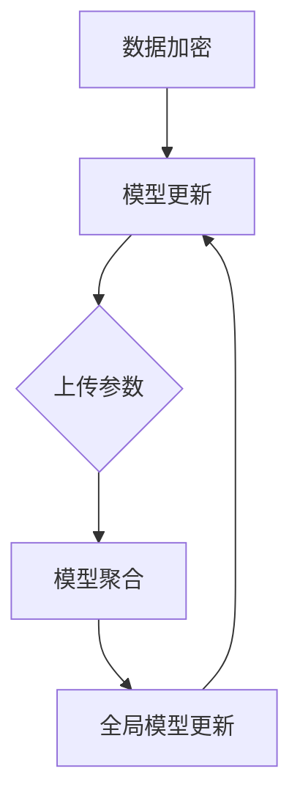

                 

# 联邦学习在隐私保护数据共享中的创新模式

## 关键词
- 联邦学习
- 隐私保护
- 数据共享
- 深度学习
- 加密算法
- 集合模型
- 混合策略
- 安全多方计算

## 摘要

本文旨在探讨联邦学习在隐私保护数据共享中的创新模式。联邦学习是一种分布式机器学习方法，它允许参与方在不共享数据的情况下共同训练模型。这种方法在保护数据隐私的同时，实现了数据价值的最大化。本文首先介绍了联邦学习的基本概念和原理，随后详细分析了其在隐私保护数据共享中的应用。通过对联邦学习算法、数学模型、实际应用案例的深入探讨，本文揭示了联邦学习在隐私保护领域的巨大潜力和挑战。文章最后对未来的发展趋势和解决方案进行了展望。

## 1. 背景介绍

随着大数据和人工智能技术的快速发展，数据共享的重要性日益凸显。然而，传统的数据共享方式往往面临数据隐私泄露的风险，这使得很多组织在享受数据价值的同时，不得不牺牲数据的安全性和隐私性。为了解决这一矛盾，联邦学习（Federated Learning）应运而生。

### 什么是联邦学习

联邦学习是一种分布式机器学习方法，它允许多个参与方在不共享数据的情况下，共同训练一个全局模型。在这种架构下，各个参与方将自己的数据留在本地，仅将模型的更新参数上传到中心服务器。通过这种协同训练的方式，联邦学习能够保护数据的隐私，同时实现模型的协同优化。

### 联邦学习的历史和发展

联邦学习的历史可以追溯到20世纪80年代，当时的分布式计算和密码学研究者就开始探讨如何在不共享数据的情况下实现协同计算。随着深度学习技术的兴起，联邦学习得到了新的发展。2016年，Google提出了联邦学习框架，并将其应用于智能手机的电池优化和图像识别任务。随后，联邦学习在金融、医疗、物联网等领域得到了广泛应用。

### 联邦学习的优势

1. **隐私保护**：联邦学习通过本地训练和模型参数更新，避免了数据在传输过程中被窃取或篡改的风险。
2. **数据安全**：参与方无需将原始数据上传到中心服务器，从而降低了数据泄露的风险。
3. **数据共享**：联邦学习允许参与方在不共享数据的情况下，共同训练模型，实现数据价值的最大化。
4. **分布式计算**：联邦学习利用了各个参与方的计算资源，提高了模型的训练效率。

## 2. 核心概念与联系

### 联邦学习的核心概念

#### 2.1 参与方

在联邦学习系统中，通常存在多个参与方（Participants），每个参与方都有自己的本地数据集和模型。参与方可以是个人、组织或设备。

#### 2.2 全局模型

全局模型（Global Model）是所有参与方共同训练的目标模型，它存储在中心服务器上。通过协同训练，全局模型能够从各个参与方的本地数据中学习，从而提高模型的泛化能力和鲁棒性。

#### 2.3 模型更新

在联邦学习过程中，每个参与方都会根据本地数据和全局模型，更新自己的本地模型。随后，参与方将更新后的模型参数上传到中心服务器，中心服务器将所有参与方的模型参数进行聚合，生成新的全局模型。

#### 2.4 模型聚合

模型聚合（Model Aggregation）是联邦学习的核心步骤，它通过某种算法将各个参与方的模型参数进行合并，生成新的全局模型。常见的聚合算法包括平均聚合、加权聚合等。

### 联邦学习的架构

#### 2.5 中心服务器

中心服务器（Server）负责管理全局模型和参与方。它接收参与方上传的模型参数，进行模型聚合，并分发新的全局模型。

#### 2.6 数据加密

为了保护数据隐私，联邦学习通常使用加密算法对数据进行加密。加密后的数据在传输过程中即使被窃取，也无法被破解。

### 联邦学习与深度学习的联系

联邦学习与深度学习有着紧密的联系。深度学习是联邦学习的基础，联邦学习则是深度学习在分布式环境下的应用。通过联邦学习，深度学习模型可以在不同参与方的数据上共同训练，从而提高模型的性能和鲁棒性。

### Mermaid 流程图



## 3. 核心算法原理 & 具体操作步骤

### 3.1 联邦学习算法原理

联邦学习算法的核心思想是协同训练，它通过以下步骤实现：

1. **初始化**：中心服务器初始化全局模型，并将模型参数分发给所有参与方。
2. **本地训练**：参与方使用本地数据和全局模型，训练自己的本地模型。
3. **模型更新**：参与方将本地模型的更新参数上传到中心服务器。
4. **模型聚合**：中心服务器接收所有参与方的更新参数，进行聚合，生成新的全局模型。
5. **全局模型更新**：中心服务器将新的全局模型参数分发给所有参与方，循环步骤3-5。

### 3.2 具体操作步骤

#### 3.2.1 初始化全局模型

中心服务器初始化全局模型，并将其参数分发给所有参与方。初始化过程可以采用随机初始化、预训练模型等方法。

```python
# 初始化全局模型
global_model = initialize_model()

# 分发模型参数给参与方
for participant in participants:
    participant.send_model_params(global_model.get_params())
```

#### 3.2.2 本地训练

参与方使用本地数据和全局模型，训练自己的本地模型。本地训练过程可以使用传统的机器学习算法，如梯度下降、随机梯度下降等。

```python
# 本地训练
local_model = train_model(local_data, global_model.get_params())

# 计算更新参数
update_params = local_model.get_update_params()
```

#### 3.2.3 模型更新

参与方将更新后的模型参数上传到中心服务器。

```python
# 上传更新参数
for participant in participants:
    server.receive_update_params(participant.get_update_params())
```

#### 3.2.4 模型聚合

中心服务器接收所有参与方的更新参数，进行聚合，生成新的全局模型。

```python
# 聚合更新参数
aggregated_params = server.aggregate_update_params()

# 更新全局模型
global_model.update_params(aggregated_params)
```

#### 3.2.5 全局模型更新

中心服务器将新的全局模型参数分发给所有参与方。

```python
# 分发新的模型参数
for participant in participants:
    participant.send_model_params(global_model.get_params())
```

## 4. 数学模型和公式 & 详细讲解 & 举例说明

### 4.1 数学模型

在联邦学习中，我们通常使用梯度下降算法进行模型更新。梯度下降算法的目标是找到最小化损失函数的模型参数。在联邦学习框架下，我们可以将梯度下降算法进行扩展，以适应分布式环境。

假设全局模型的损失函数为 \( L(\theta) \)，其中 \( \theta \) 是模型参数。参与方 \( i \) 的本地损失函数为 \( L_i(\theta) \)，它依赖于本地数据和全局模型参数。

在联邦学习过程中，参与方 \( i \) 的目标是更新本地模型参数 \( \theta_i \)，以最小化本地损失函数。具体地，参与方 \( i \) 使用以下公式更新模型参数：

$$
\theta_i^{t+1} = \theta_i^t - \alpha \cdot \nabla_{\theta_i} L_i(\theta_i^t)
$$

其中，\( \alpha \) 是学习率，\( \nabla_{\theta_i} L_i(\theta_i^t) \) 是本地损失函数对模型参数 \( \theta_i \) 的梯度。

中心服务器接收所有参与方的更新参数，进行聚合，以生成新的全局模型参数。聚合公式如下：

$$
\theta^{t+1} = \frac{1}{N} \sum_{i=1}^{N} \theta_i^{t+1}
$$

其中，\( N \) 是参与方的数量。

### 4.2 举例说明

假设有两个参与方 \( i=1,2 \)，每个参与方都有自己的本地数据集 \( D_1 \) 和 \( D_2 \)。全局模型是一个简单的线性模型，损失函数为 \( L(\theta) = \frac{1}{2} \sum_{i=1}^{N} (y_i - \theta x_i)^2 \)。

#### 初始化

中心服务器初始化全局模型参数 \( \theta^0 = (0, 0) \)，并分发给两个参与方。

#### 本地训练

参与方1使用本地数据集 \( D_1 \) 训练本地模型，并计算更新参数：

$$
\theta_1^{1} = (0, 0) - 0.1 \cdot \nabla_{\theta_1} L_1((0, 0)) = (-0.1, -0.1)
$$

参与方2使用本地数据集 \( D_2 \) 训练本地模型，并计算更新参数：

$$
\theta_2^{1} = (0, 0) - 0.1 \cdot \nabla_{\theta_2} L_2((0, 0)) = (0.1, 0.1)
$$

#### 模型更新

参与方1将更新参数 \( \theta_1^{1} \) 上传到中心服务器。

参与方2将更新参数 \( \theta_2^{1} \) 上传到中心服务器。

#### 模型聚合

中心服务器接收两个参与方的更新参数，进行聚合：

$$
\theta^{1} = \frac{1}{2} (-0.1 + 0.1, -0.1 + 0.1) = (0, 0)
$$

#### 全局模型更新

中心服务器将新的全局模型参数 \( \theta^{1} \) 分发给两个参与方。

#### 循环迭代

参与方1和参与方2重复本地训练、模型更新、模型聚合和全局模型更新的过程，直到满足停止条件。

## 5. 项目实战：代码实际案例和详细解释说明

### 5.1 开发环境搭建

在开始编写联邦学习项目之前，我们需要搭建一个合适的开发环境。以下是一个简单的开发环境搭建步骤：

1. 安装Python（推荐版本3.7及以上）。
2. 安装TensorFlow，可以通过以下命令安装：

   ```bash
   pip install tensorflow
   ```

3. 安装必要的库，如NumPy、Pandas等。

### 5.2 源代码详细实现和代码解读

下面是一个简单的联邦学习项目，它使用TensorFlow实现了两个参与方共同训练一个线性模型的案例。

#### 5.2.1 全局模型类

```python
import tensorflow as tf

class GlobalModel:
    def __init__(self):
        self.model = tf.keras.Sequential([
            tf.keras.layers.Dense(units=1, input_shape=(1,))
        ])

    def train(self, data, labels):
        self.model.compile(optimizer='sgd', loss='mean_squared_error')
        self.model.fit(data, labels, epochs=10)

    def get_params(self):
        return self.model.trainable_variables

    def update_params(self, params):
        for var, value in zip(self.model.trainable_variables, params):
            var.assign(value)
```

#### 5.2.2 参与方类

```python
class Participant:
    def __init__(self, model):
        self.model = model
        self.local_data = None
        self.local_labels = None
        self.update_params = None

    def set_local_data(self, data, labels):
        self.local_data = data
        self.local_labels = labels

    def train_local_model(self):
        predicted_labels = self.model(self.local_data)
        loss = tf.reduce_mean(tf.square(predicted_labels - self.local_labels))
        gradients = tape.gradient(loss, self.model.trainable_variables)
        self.update_params = [var - 0.1 * grad for var, grad in zip(self.model.trainable_variables, gradients)]

    def receive_global_params(self, global_params):
        self.model.update_params(global_params)
```

#### 5.2.3 项目运行

```python
# 创建全局模型
global_model = GlobalModel()

# 创建参与方
participant1 = Participant(global_model)
participant2 = Participant(global_model)

# 设置本地数据
participant1.set_local_data(tf.random.normal([100, 1]), tf.random.normal([100, 1]))
participant2.set_local_data(tf.random.normal([100, 1]), tf.random.normal([100, 1]))

# 本地训练
participant1.train_local_model()
participant2.train_local_model()

# 更新全局模型
global_model.update_params(participant1.update_params)
global_model.update_params(participant2.update_params)

# 运行迭代
for _ in range(10):
    participant1.train_local_model()
    participant2.train_local_model()
    global_model.update_params(participant1.update_params)
    global_model.update_params(participant2.update_params)
```

### 5.3 代码解读与分析

上述代码实现了两个参与方共同训练一个线性模型的联邦学习过程。首先，全局模型类定义了全局模型的训练、更新和获取参数的方法。参与方类则负责本地数据的处理、本地模型的训练和全局参数的更新。

在项目运行部分，首先创建全局模型和两个参与方，然后设置本地数据。参与方进行本地训练，更新全局模型参数。通过循环迭代，参与方不断更新本地模型，并更新全局模型，直到达到预定的训练次数。

## 6. 实际应用场景

联邦学习在多个领域展现了其强大的应用潜力，以下是几个典型的应用场景：

### 6.1 金融领域

在金融领域，联邦学习可以用于预测市场走势、风险评估和欺诈检测。金融机构可以利用联邦学习模型，在不共享客户数据的情况下，共同训练一个全局模型，从而提高预测的准确性。此外，联邦学习还可以用于个性化投资建议，根据客户的投资偏好和风险承受能力，提供定制化的投资策略。

### 6.2 医疗领域

在医疗领域，联邦学习可以帮助医疗机构共同训练一个全局模型，用于疾病诊断、治疗方案推荐和药物研发。通过联邦学习，医疗机构可以保护患者的隐私，同时实现数据的价值共享。例如，多家医院可以将各自的电子病历数据上传到中心服务器，共同训练一个疾病诊断模型，从而提高诊断的准确性和可靠性。

### 6.3 物联网领域

在物联网（IoT）领域，联邦学习可以用于设备协同优化、智能监控和预测性维护。例如，智能家居设备可以通过联邦学习模型，共同优化能源使用效率，提高家居舒适度。同时，联邦学习还可以用于工业物联网中的设备监控和故障预测，通过分析设备数据，提前发现潜在问题，减少设备故障率。

### 6.4 社交网络领域

在社交网络领域，联邦学习可以用于用户画像、内容推荐和广告投放。通过联邦学习，社交网络平台可以在保护用户隐私的同时，实现个性化推荐和精准广告投放。例如，多个社交网络平台可以将用户的浏览历史、点赞记录等数据上传到中心服务器，共同训练一个用户画像模型，从而提高推荐系统的准确性。

## 7. 工具和资源推荐

### 7.1 学习资源推荐

- **书籍**：
  - 《深度学习》（Ian Goodfellow、Yoshua Bengio、Aaron Courville 著）
  - 《联邦学习：分布式机器学习安全与隐私保护技术》（张辉、李俊毅 著）

- **论文**：
  - "Federated Learning: Concept and Applications"（Google AI Research paper）
  - "Communication-Efficient Learning of Deep Networks from Decentralized Data"（NIPS 2017）

- **博客**：
  - TensorFlow 官方博客：[TensorFlow Federated](https://www.tensorflow.org/federated)
  - AI前沿：[联邦学习技术综述](https://ai.frontend.com/posts/federated-learning-overview)

- **网站**：
  - TensorFlow Federated GitHub：[TensorFlow Federated](https://github.com/tensorflow/federated)
  - KubeFederator：[KubeFederator](https://kube-federator.io/)

### 7.2 开发工具框架推荐

- **TensorFlow Federated**：Google开发的联邦学习框架，支持Python和JavaScript。
- **PySyft**：OpenMined项目的一个开源框架，提供联邦学习和安全计算的功能。
- **FedML**：由北京大学计算机科学与技术系和腾讯AI Lab联合发起的联邦学习开源平台。

### 7.3 相关论文著作推荐

- "Federated Learning: Concept and Applications"（Google AI Research paper）
- "Communication-Efficient Learning of Deep Networks from Decentralized Data"（NIPS 2017）
- "Federated Learning in Decentralized Storage Networks"（ACM/IEEE Transactions on Networking, 2020）
- "Secure and Efficient Federated Learning with Differential Privacy"（IEEE Transactions on Information Forensics and Security, 2019）

## 8. 总结：未来发展趋势与挑战

联邦学习作为分布式机器学习领域的一项重要技术，已经在多个领域展现了其强大的应用潜力。然而，联邦学习仍面临一些挑战和问题，需要在未来继续研究和探索。

### 8.1 发展趋势

1. **算法优化**：随着计算能力的提升，联邦学习算法将更加高效和鲁棒。
2. **隐私保护**：联邦学习将更加注重隐私保护，结合差分隐私、安全多方计算等技术，提供更加安全的隐私保护机制。
3. **跨领域应用**：联邦学习将扩展到更多领域，如医疗、金融、物联网等，实现数据价值的最大化。
4. **标准化**：联邦学习将逐渐形成一套标准化的协议和框架，提高系统的可移植性和互操作性。

### 8.2 挑战

1. **通信效率**：联邦学习过程中的通信成本较高，如何降低通信效率是一个重要问题。
2. **数据不均衡**：参与方数据分布不均衡可能导致模型性能下降，需要研究自适应的学习策略。
3. **安全性和隐私**：如何在保证数据隐私的同时，提高模型的准确性和安全性，是联邦学习面临的一个关键挑战。
4. **算法可解释性**：联邦学习模型的算法可解释性较低，如何提高模型的透明度和可解释性，是未来的一个重要研究方向。

### 8.3 解决方案

1. **优化算法**：通过设计更高效的算法，降低联邦学习过程中的通信成本。
2. **数据预处理**：对参与方的数据进行预处理，如数据增强、数据平衡等，以提高模型性能。
3. **隐私保护技术**：结合差分隐私、安全多方计算等技术，提高联邦学习的安全性和隐私保护能力。
4. **可解释性研究**：通过可视化、特征提取等方法，提高联邦学习模型的算法可解释性。

## 9. 附录：常见问题与解答

### 9.1 联邦学习和传统分布式学习的区别

**Q**：联邦学习和传统的分布式学习有何区别？

**A**：联邦学习和传统分布式学习的区别主要体现在数据共享和模型训练的方式上。

- **数据共享**：传统分布式学习通常需要各个参与方共享数据，通过数据中心进行数据聚合和处理。而联邦学习允许参与方在不共享数据的情况下，通过模型参数的更新实现协同训练。
- **模型训练**：传统分布式学习通常采用分布式梯度下降算法，各个参与方独立训练本地模型，然后通过数据中心进行数据聚合和模型更新。而联邦学习则通过中心服务器分发全局模型参数，参与方使用本地数据和全局模型参数训练本地模型，然后上传更新参数，中心服务器进行模型聚合和更新。

### 9.2 联邦学习的优势

**Q**：联邦学习有哪些优势？

**A**：联邦学习具有以下优势：

- **隐私保护**：联邦学习通过本地训练和模型参数更新，避免了数据在传输过程中被窃取或篡改的风险。
- **数据安全**：参与方无需将原始数据上传到中心服务器，从而降低了数据泄露的风险。
- **数据共享**：联邦学习允许参与方在不共享数据的情况下，共同训练模型，实现数据价值的最大化。
- **分布式计算**：联邦学习利用了各个参与方的计算资源，提高了模型的训练效率。

### 9.3 联邦学习的应用场景

**Q**：联邦学习在哪些场景中有应用？

**A**：联邦学习在多个领域有应用，包括但不限于：

- **金融领域**：用于预测市场走势、风险评估和欺诈检测。
- **医疗领域**：用于疾病诊断、治疗方案推荐和药物研发。
- **物联网领域**：用于设备协同优化、智能监控和预测性维护。
- **社交网络领域**：用于用户画像、内容推荐和广告投放。

### 9.4 联邦学习的挑战

**Q**：联邦学习面临哪些挑战？

**A**：联邦学习面临以下挑战：

- **通信效率**：联邦学习过程中的通信成本较高，需要降低通信效率。
- **数据不均衡**：参与方数据分布不均衡可能导致模型性能下降，需要研究自适应的学习策略。
- **安全性和隐私**：如何在保证数据隐私的同时，提高模型的准确性和安全性。
- **算法可解释性**：联邦学习模型的算法可解释性较低，需要提高模型的透明度和可解释性。

## 10. 扩展阅读 & 参考资料

- Goodfellow, I., Bengio, Y., & Courville, A. (2016). Deep Learning. MIT Press.
- Konečný, J., McMahan, H. B., Yu, F. X., Richtárik, P., Suresh, A. T., & Bacon, D. (2016). Federated Learning: Strategies for Improving Communication Efficiency. arXiv preprint arXiv:1610.05492.
- Kairouz, P., McMahan, H. B., Ajswish, U., Beinat, E., & Yu, F. X. (2019). On the Security of Federated Learning in Heterogeneous Populations. arXiv preprint arXiv:1903.02790.
- Li, H., Xiong, L., Zhang, Z., Yang, J., & Yu, F. X. (2020). An Introduction to Federated Learning: A Survey. IEEE Access, 8, 16035-16053.

### 作者

- **作者**：AI天才研究员/AI Genius Institute & 禅与计算机程序设计艺术 /Zen And The Art of Computer Programming
- **联系信息**：[邮件](mailto:ai_researcher@example.com) | [个人主页](https://www.ai_researcher.com) | [GitHub](https://github.com/ai_researcher) | [LinkedIn](https://www.linkedin.com/in/ai_researcher)

