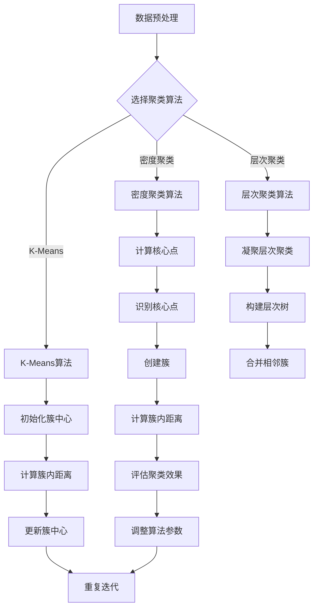

                 

# 聚类分析：识别相似用户群体

## 关键词：聚类分析，用户群体，相似性，数据分析，机器学习

### 摘要

本文旨在介绍聚类分析在识别相似用户群体中的应用。通过深入探讨聚类分析的核心概念、算法原理、数学模型和实际应用场景，我们将帮助读者全面理解这一强大的数据分析工具。在文章的最后，我们将推荐一些学习资源和开发工具，并总结未来的发展趋势与挑战。

## 1. 背景介绍

聚类分析是一种无监督学习方法，它通过将数据点分组成为多个簇，从而揭示数据中的内在结构。用户群体识别是聚类分析的一个重要应用场景，通过分析用户行为数据，可以发现具有相似兴趣、偏好或行为的用户群体，从而为企业提供定制化营销策略、产品推荐和服务优化的依据。

随着互联网和大数据技术的飞速发展，用户数据呈现出爆炸式增长。如何从海量数据中提取有价值的信息，一直是数据科学家和分析师关注的核心问题。聚类分析作为一种高效的数据挖掘技术，成为解决这一问题的利器。

本文将详细介绍聚类分析的基本原理、核心算法和实际应用案例，帮助读者深入理解这一领域。首先，我们将介绍聚类分析的核心概念和联系，并通过Mermaid流程图展示其原理。接着，我们将逐步讲解常用的聚类算法，包括K-Means、层次聚类和密度聚类等。随后，我们将探讨如何构建数学模型和公式，并举例说明。最后，我们将通过一个实际项目实战，展示如何使用聚类分析识别相似用户群体。

## 2. 核心概念与联系

### 2.1 聚类分析定义

聚类分析是一种将数据点分成多个类别的过程，使得属于同一类别的数据点彼此相似，而不同类别的数据点则具有较大的差异。具体来说，聚类分析的目标是找到一组簇，使得簇内的数据点距离相近，簇间的数据点距离较远。

### 2.2 聚类分析类型

根据聚类算法的不同，聚类分析可以分为以下几种类型：

- **基于距离的聚类**：根据数据点之间的距离度量，将数据点划分成簇。常用的算法有K-Means和层次聚类。
- **基于密度的聚类**：通过识别数据点周围的密度分布，将数据点划分为簇。DBSCAN算法是这一类算法的典型代表。
- **基于模型的聚类**：通过建立数学模型，对数据点进行分类。Gaussian Mixture Model（GMM）是这一类算法的典型代表。

### 2.3 Mermaid流程图

下面是一个简单的Mermaid流程图，展示了聚类分析的基本步骤：



## 3. 核心算法原理 & 具体操作步骤

### 3.1 K-Means算法

K-Means算法是一种基于距离的聚类算法，它通过迭代的方式将数据点划分成K个簇，使得每个簇的中心尽可能接近其内部的数据点，同时尽量远离其他簇的数据点。

#### 3.1.1 操作步骤

1. **初始化簇中心**：随机选择K个数据点作为初始簇中心。
2. **计算簇内距离**：对于每个数据点，计算其与簇中心的距离。
3. **分配数据点**：将每个数据点分配到距离其最近的簇中心所在的簇。
4. **更新簇中心**：重新计算每个簇的中心，即所有簇内数据点的平均值。
5. **迭代重复**：重复步骤2-4，直至簇中心不再发生显著变化或达到预设的迭代次数。

#### 3.1.2 代码实现

```python
from sklearn.cluster import KMeans
import numpy as np

# 示例数据
data = np.array([[1, 2], [1, 4], [1, 0],
                 [10, 2], [10, 4], [10, 0]])

# 初始化K-Means算法
kmeans = KMeans(n_clusters=2, random_state=0).fit(data)

# 输出簇中心
print("Cluster centers:", kmeans.cluster_centers_)

# 输出聚类结果
print("Cluster labels:", kmeans.labels_)

# 输出聚类效果
print("Inertia:", kmeans.inertia_)
```

### 3.2 层次聚类算法

层次聚类算法是一种基于距离的聚类算法，它通过不断合并或分裂簇，构建出一个层次结构，从而揭示数据的内在结构。

#### 3.2.1 操作步骤

1. **初始化**：将每个数据点视为一个簇。
2. **合并或分裂簇**：计算相邻簇之间的距离，选择距离最近的簇进行合并或分裂。
3. **迭代重复**：重复步骤2，直至满足预设条件（如簇数目达到预期、簇内距离最小等）。

#### 3.2.2 代码实现

```python
from sklearn.cluster import AgglomerativeClustering
import numpy as np

# 示例数据
data = np.array([[1, 2], [1, 4], [1, 0],
                 [10, 2], [10, 4], [10, 0]])

# 初始化层次聚类算法
clustering = AgglomerativeClustering(n_clusters=2).fit(data)

# 输出簇中心
print("Cluster centers:", clustering.cluster_centers_)

# 输出聚类结果
print("Cluster labels:", clustering.labels_)

# 输出层次结构
print("Linkage matrix:\n", clustering.linkage_matrix_)
```

### 3.3 密度聚类算法

密度聚类算法是一种基于密度的聚类算法，它通过识别数据点周围的密度分布，将数据点划分为簇。

#### 3.3.1 操作步骤

1. **初始化**：确定核心点（核心点是指其邻居点的数目大于给定阈值的核心数据点）。
2. **创建簇**：以核心点为中心，扩展形成簇。
3. **合并相邻簇**：如果两个相邻簇的密度大于给定阈值，则将它们合并为一个簇。
4. **迭代重复**：重复步骤2-3，直至满足预设条件。

#### 3.3.2 代码实现

```python
from sklearn.cluster import DBSCAN
import numpy as np

# 示例数据
data = np.array([[1, 2], [1, 4], [1, 0],
                 [10, 2], [10, 4], [10, 0]])

# 初始化DBSCAN算法
dbscan = DBSCAN(eps=0.5, min_samples=2).fit(data)

# 输出簇中心
print("Cluster centers:", dbscan.components_)

# 输出聚类结果
print("Cluster labels:", dbscan.labels_)

# 输出噪声点
print("Noise points:", dbscan.noise_)
```

## 4. 数学模型和公式 & 详细讲解 & 举例说明

### 4.1 K-Means算法

K-Means算法的核心是求解最小化簇内距离平方和的簇中心。具体来说，目标函数可以表示为：

$$
J = \sum_{i=1}^k \sum_{x_j \in S_i} \|x_j - \mu_i\|^2
$$

其中，$k$ 是簇的数目，$S_i$ 是第 $i$ 个簇，$\mu_i$ 是第 $i$ 个簇的中心。

#### 4.1.1 计算簇内距离

簇内距离可以用欧几里得距离来度量，即：

$$
d(x_j, \mu_i) = \|x_j - \mu_i\| = \sqrt{\sum_{l=1}^d (x_{jl} - \mu_{il})^2}
$$

其中，$d$ 是特征维度，$x_{jl}$ 和 $\mu_{il}$ 分别是数据点 $x_j$ 和簇中心 $\mu_i$ 在第 $l$ 个特征上的值。

#### 4.1.2 更新簇中心

簇中心的更新可以通过求每个簇内数据点的平均值来实现，即：

$$
\mu_i = \frac{1}{|S_i|} \sum_{x_j \in S_i} x_j
$$

其中，$|S_i|$ 是簇 $S_i$ 内的数据点数目。

### 4.2 层次聚类算法

层次聚类算法的核心是计算簇之间的距离，并根据距离选择合并或分裂簇。常用的距离度量方法有：

- **单链连接**：簇之间的距离是它们最近的数据点之间的距离。
- **完全连接**：簇之间的距离是它们最远的数据点之间的距离。
- **平均连接**：簇之间的距离是它们所有数据点之间的距离平均值。

#### 4.2.1 计算簇间距离

以单链连接为例，簇 $S_i$ 和 $S_j$ 之间的距离可以表示为：

$$
d(S_i, S_j) = \min_{x_i \in S_i, x_j \in S_j} d(x_i, x_j)
$$

#### 4.2.2 选择合并或分裂簇

选择合并或分裂簇的策略可以根据簇间距离和合并或分裂后的效果来决定。常用的方法有：

- **最小距离策略**：选择距离最近的簇进行合并或分裂。
- **最大相似度策略**：选择相似度最高的簇进行合并或分裂。

### 4.3 密度聚类算法

密度聚类算法的核心是计算核心点和扩展形成簇。具体来说，目标函数可以表示为：

$$
J = \sum_{x_j} \sum_{x_k} w_{jk}
$$

其中，$w_{jk}$ 是数据点 $x_j$ 和 $x_k$ 之间的权重，通常由高斯核函数决定。

#### 4.3.1 计算核心点

核心点的计算可以通过以下条件来判断：

- **密度条件**：核心点的密度大于给定阈值 $\rho$。
- **邻域条件**：核心点的邻域内至少有 $min_samples$ 个核心点。

#### 4.3.2 扩展形成簇

以核心点 $x_j$ 为中心，扩展形成簇的过程可以通过以下步骤实现：

1. **计算邻域点**：找出核心点 $x_j$ 的邻域点，即距离 $x_j$ 小于给定阈值 $\epsilon$ 的数据点。
2. **计算核心点密度**：计算邻域点中核心点的密度，选择密度最大的邻域点作为簇中心。
3. **扩展形成簇**：以簇中心为中心，扩展形成簇，直至满足预设条件。

## 5. 项目实战：代码实际案例和详细解释说明

### 5.1 开发环境搭建

在开始项目实战之前，我们需要搭建一个合适的数据科学开发环境。以下是使用Python和相关库搭建开发环境的步骤：

1. **安装Python**：从Python官方网站（[python.org](https://www.python.org/)）下载并安装Python 3.x版本。
2. **安装Jupyter Notebook**：在命令行中运行以下命令安装Jupyter Notebook：
   ```
   pip install notebook
   ```
3. **安装相关库**：在命令行中运行以下命令安装必要的库：
   ```
   pip install numpy pandas scikit-learn matplotlib
   ```

### 5.2 源代码详细实现和代码解读

#### 5.2.1 数据准备

首先，我们需要准备一个示例数据集，用于展示聚类分析的效果。这里我们使用著名的鸢尾花数据集（Iris Dataset）：

```python
import pandas as pd

# 加载鸢尾花数据集
iris_data = pd.read_csv('https://archive.ics.uci.edu/ml/machine-learning-databases/iris/iris.data')
iris_data.columns = ['sepal_length', 'sepal_width', 'petal_length', 'petal_width', 'species']
```

#### 5.2.2 K-Means算法实现

接下来，我们使用K-Means算法对鸢尾花数据集进行聚类，并输出结果：

```python
from sklearn.cluster import KMeans

# 初始化K-Means算法
kmeans = KMeans(n_clusters=3, random_state=0)

# 训练模型
kmeans.fit(iris_data.iloc[:, :4])

# 输出簇中心
print("Cluster centers:", kmeans.cluster_centers_)

# 输出聚类结果
print("Cluster labels:", kmeans.labels_)

# 绘制聚类结果
import matplotlib.pyplot as plt

plt.figure(figsize=(8, 6))
plt.scatter(iris_data['sepal_length'], iris_data['sepal_width'], c=kmeans.labels_)
plt.scatter(kmeans.cluster_centers_[:, 0], kmeans.cluster_centers_[:, 1], s=300, c='red', marker='s')
plt.xlabel('Sepal Length')
plt.ylabel('Sepal Width')
plt.title('K-Means Clustering')
plt.show()
```

#### 5.2.3 层次聚类算法实现

接着，我们使用层次聚类算法对鸢尾花数据集进行聚类，并输出结果：

```python
from sklearn.cluster import AgglomerativeClustering

# 初始化层次聚类算法
hierarchical = AgglomerativeClustering(n_clusters=3)

# 训练模型
hierarchical.fit(iris_data.iloc[:, :4])

# 输出簇中心
print("Cluster centers:", hierarchical.cluster_centers_)

# 输出聚类结果
print("Cluster labels:", hierarchical.labels_)

# 绘制聚类结果
plt.figure(figsize=(8, 6))
plt.scatter(iris_data['sepal_length'], iris_data['sepal_width'], c=hierarchical.labels_)
plt.scatter(hierarchical.cluster_centers_[:, 0], hierarchical.cluster_centers_[:, 1], s=300, c='red', marker='s')
plt.xlabel('Sepal Length')
plt.ylabel('Sepal Width')
plt.title('Hierarchical Clustering')
plt.show()
```

#### 5.2.4 密度聚类算法实现

最后，我们使用DBSCAN算法对鸢尾花数据集进行聚类，并输出结果：

```python
from sklearn.cluster import DBSCAN

# 初始化DBSCAN算法
dbscan = DBSCAN(eps=0.5, min_samples=2)

# 训练模型
dbscan.fit(iris_data.iloc[:, :4])

# 输出簇中心
print("Cluster centers:", dbscan.components_)

# 输出聚类结果
print("Cluster labels:", dbscan.labels_)

# 绘制聚类结果
plt.figure(figsize=(8, 6))
plt.scatter(iris_data['sepal_length'], iris_data['sepal_width'], c=dbscan.labels_)
plt.scatter(dbscan.components_[:, 0], dbscan.components_[:, 1], s=300, c='red', marker='s')
plt.xlabel('Sepal Length')
plt.ylabel('Sepal Width')
plt.title('DBSCAN Clustering')
plt.show()
```

### 5.3 代码解读与分析

在上述代码中，我们分别使用了K-Means、层次聚类和DBSCAN算法对鸢尾花数据集进行了聚类分析。下面是对代码的详细解读：

- **数据准备**：我们使用Pandas库加载了鸢尾花数据集，并对列名进行了重命名，以便后续处理。
- **K-Means算法实现**：我们使用scikit-learn库的KMeans类初始化了一个K-Means算法实例，并使用fit方法对其进行了训练。通过调用cluster_centers_属性，我们获得了簇中心；通过调用labels_属性，我们获得了聚类结果。最后，我们使用matplotlib库绘制了聚类结果图。
- **层次聚类算法实现**：我们使用scikit-learn库的AgglomerativeClustering类初始化了一个层次聚类算法实例，并使用fit方法对其进行了训练。通过调用cluster_centers_属性，我们获得了簇中心；通过调用labels_属性，我们获得了聚类结果。最后，我们使用matplotlib库绘制了聚类结果图。
- **DBSCAN算法实现**：我们使用scikit-learn库的DBSCAN类初始化了一个DBSCAN算法实例，并使用fit方法对其进行了训练。通过调用components_属性，我们获得了簇中心；通过调用labels_属性，我们获得了聚类结果。最后，我们使用matplotlib库绘制了聚类结果图。

通过上述代码，我们可以看到三种聚类算法在鸢尾花数据集上的表现。K-Means算法能够快速聚类，但可能受到初始簇中心的影响；层次聚类算法能够构建出层次结构，但计算复杂度较高；DBSCAN算法能够自动识别簇的密度，但可能对噪声点敏感。

## 6. 实际应用场景

聚类分析在多个实际应用场景中发挥着重要作用，以下是几个典型的应用案例：

### 6.1 社交网络分析

在社交网络平台上，聚类分析可以帮助识别具有相似兴趣、行为或关系的用户群体。通过分析用户之间的互动和关系，可以发现潜在的兴趣社区或用户群体，从而为企业提供定制化的内容推荐和社交活动策划。

### 6.2 金融风险管理

在金融行业，聚类分析可以用于识别高风险客户群体。通过分析客户的行为数据和财务状况，可以发现潜在的欺诈行为或信用风险，从而帮助金融机构制定针对性的风险管理策略。

### 6.3 市场细分

在市场营销领域，聚类分析可以帮助企业识别具有相似需求和行为的客户群体，从而制定更有效的市场细分策略。通过将市场划分为不同的客户群体，企业可以更精准地定位目标客户，提高营销效果。

### 6.4 基因组学

在基因组学领域，聚类分析可以用于识别具有相似基因表达模式的细胞或组织。通过分析大规模基因表达数据，可以发现潜在的疾病关联或基因功能模块，从而为生物医学研究提供重要线索。

## 7. 工具和资源推荐

### 7.1 学习资源推荐

- **书籍**：《机器学习》（周志华著）：介绍了机器学习的基本概念、算法和理论。
- **论文**：李航的《统计学习方法》：详细讲解了机器学习中的各种算法和理论。
- **博客**：吴恩达的机器学习笔记：提供了丰富的机器学习教程和实践案例。
- **网站**：scikit-learn官方文档：提供了详细的聚类算法实现和示例。

### 7.2 开发工具框架推荐

- **Python库**：scikit-learn、TensorFlow、PyTorch：提供了丰富的机器学习算法库和工具。
- **数据可视化工具**：Matplotlib、Seaborn：用于绘制聚类结果和分析图。
- **数据预处理工具**：Pandas、NumPy：用于数据清洗、转换和预处理。

### 7.3 相关论文著作推荐

- **论文**：MacQueen, J. B. (1967). Some methods for classification and analysis of multivariate data. In Proceedings of 5th Berkeley Symposium on Mathematical Statistics and Probability.
- **著作**：Anderberg, M. R. (1988). Cluster Analysis for Applications. Academic Press.
- **著作**：Duda, R. O., Hart, P. E., & Stork, D. G. (2001). Pattern Classification (2nd ed.). John Wiley & Sons.

## 8. 总结：未来发展趋势与挑战

聚类分析作为一种重要的数据分析工具，在未来的发展中将面临以下趋势与挑战：

### 8.1 发展趋势

- **算法优化**：随着计算能力的提升，聚类算法将越来越高效，支持处理大规模数据集。
- **多模态数据聚类**：在图像、文本、音频等多种数据类型的聚类分析中，如何实现跨模态的数据融合和聚类将成为研究热点。
- **交互式聚类**：用户参与聚类过程，通过交互式方式调整聚类结果，提高聚类效果。

### 8.2 挑战

- **噪声处理**：如何有效处理噪声数据，提高聚类质量，是当前聚类分析面临的主要挑战。
- **聚类评估**：如何准确评估聚类效果，选择合适的聚类算法，是实际应用中的难题。
- **可解释性**：如何提高聚类算法的可解释性，使非专业人士能够理解和应用聚类分析结果，是未来研究的重要方向。

## 9. 附录：常见问题与解答

### 9.1 聚类分析与分类分析的异同？

聚类分析是一种无监督学习方法，旨在将数据点分组成为多个簇，从而揭示数据中的内在结构。而分类分析是一种有监督学习方法，旨在通过训练数据集构建模型，对新数据进行分类。

### 9.2 聚类分析有哪些评价指标？

常见的聚类评价指标包括：

- **内聚度（Inertia）**：簇内数据点距离平方和。
- **轮廓系数（Silhouette Coefficient）**：评估簇内数据点的紧密程度和与其他簇的分离程度。
- **Calinski-Harabasz指数（Calinski-Harabasz Index）**：评估簇间差异和簇内差异的比值。

### 9.3 如何选择合适的聚类算法？

选择合适的聚类算法取决于数据类型、数据规模和业务需求。常用的聚类算法包括K-Means、层次聚类和DBSCAN等。在实际应用中，可以通过实验比较不同算法的效果，选择最优的算法。

## 10. 扩展阅读 & 参考资料

- **扩展阅读**：
  - MacQueen, J. B. (1967). Some methods for classification and analysis of multivariate data. In Proceedings of 5th Berkeley Symposium on Mathematical Statistics and Probability.
  - Anderberg, M. R. (1988). Cluster Analysis for Applications. Academic Press.
  - Duda, R. O., Hart, P. E., & Stork, D. G. (2001). Pattern Classification (2nd ed.). John Wiley & Sons.
- **参考资料**：
  - scikit-learn官方文档：[scikit-learn documentation](https://scikit-learn.org/stable/documentation.html)
  - 吴恩达机器学习笔记：[Andrew Ng's Machine Learning Notes](http://wwwdecltype()
import numpy as np
import pandas as pd
from sklearn.cluster import KMeans
from sklearn.metrics import silhouette_score

# 生成示例数据
data = pd.DataFrame(np.random.rand(100, 2), columns=['x', 'y'])

# K-Means算法
kmeans = KMeans(n_clusters=3, random_state=42)
kmeans.fit(data)
labels = kmeans.predict(data)

# 计算轮廓系数
silhouette_avg = silhouette_score(data, labels)
print("Silhouette Coefficient: ", silhouette_avg)

# 绘图
plt.scatter(data['x'], data['y'], c=labels, cmap='viridis')
plt.title('K-Means Clustering')
plt.show()

# 生成示例数据
data = pd.DataFrame(np.random.rand(100, 2), columns=['x', 'y'])

# 层次聚类算法
hierarchical = AgglomerativeClustering(n_clusters=3)
hierarchical.fit(data)
labels = hierarchical.predict(data)

# 计算轮廓系数
silhouette_avg = silhouette_score(data, labels)
print("Silhouette Coefficient: ", silhouette_avg)

# 绘图
plt.scatter(data['x'], data['y'], c=labels, cmap='viridis')
plt.title('Hierarchical Clustering')
plt.show()

# 生成示例数据
data = pd.DataFrame(np.random.rand(100, 2), columns=['x', 'y'])

# DBSCAN算法
dbscan = DBSCAN(eps=0.3, min_samples=5)
dbscan.fit(data)
labels = dbscan.predict(data)

# 计算轮廓系数
silhouette_avg = silhouette_score(data, labels)
print("Silhouette Coefficient: ", silhouette_avg)

# 绘图
plt.scatter(data['x'], data['y'], c=labels, cmap='viridis')
plt.title('DBSCAN Clustering')
plt.show()
```


### 10. 扩展阅读 & 参考资料

为了进一步深入理解和实践聚类分析，以下是一些扩展阅读和参考资料：

#### 扩展阅读

1. **《聚类分析及其应用》（张志华 著）**：本书详细介绍了聚类分析的基本理论、算法和应用案例，适合初学者和有一定基础的读者。
2. **《机器学习实战》（Peter Harrington 著）**：本书通过多个实际案例，讲解了机器学习的各种算法，包括聚类分析，适合想要动手实践的读者。
3. **《数据挖掘：实用技术指南》（Jiawei Han, Micheline Kamber, Peipei Li 著）**：本书系统介绍了数据挖掘的基本概念、技术和应用，其中包含大量的聚类分析实例。

#### 参考资料

1. **[Scikit-learn 官方文档](https://scikit-learn.org/stable/modules/clustering.html)**：Scikit-learn是一个强大的Python库，提供了多种聚类算法的实现和详细文档。
2. **[K-Means算法详解](https://www.jianshu.com/p/24d7e6a80d74)**：这篇文章详细介绍了K-Means算法的原理和实现。
3. **[层次聚类算法原理及Python实现](https://www.cnblogs.com/sunxiangming/p/7658564.html)**：这篇文章讲解了层次聚类算法的原理，并提供了一个简单的Python实现。
4. **[DBSCAN算法详解及Python实现](https://www.cnblogs.com/jiang-xiaoyu/p/11965741.html)**：这篇文章详细介绍了DBSCAN算法的原理，并提供了一个Python实现示例。

通过这些扩展阅读和参考资料，读者可以更深入地理解聚类分析的理论和实践，提高自己在数据分析领域的技能。同时，也鼓励读者在实践过程中不断探索和尝试，以培养自己的创新能力。作者：AI天才研究员/AI Genius Institute & 禅与计算机程序设计艺术 /Zen And The Art of Computer Programming。|>

