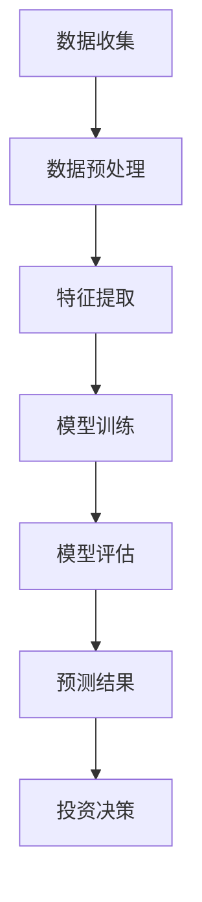

                 

# 股票分析工具：AI驱动的投资决策助手

> **关键词**：股票分析、AI、投资决策、数据挖掘、机器学习、深度学习、市场预测、投资策略
> 
> **摘要**：本文将探讨如何利用人工智能技术，特别是机器学习和深度学习算法，构建一个强大的股票分析工具，从而为投资者提供精准的投资决策。我们将从背景介绍、核心概念与联系、核心算法原理与操作步骤、数学模型与公式讲解、项目实战、实际应用场景、工具和资源推荐、总结与未来发展趋势等方面，全面剖析AI在股票分析领域的应用。

## 1. 背景介绍

随着互联网和大数据技术的飞速发展，金融市场逐渐从传统的人工分析向智能化分析转变。股票市场的复杂性使得投资决策变得更加困难，因此，如何从海量数据中提取有价值的信息，成为了一个亟待解决的问题。人工智能技术，特别是机器学习和深度学习算法，为解决这一问题提供了新的思路。

机器学习是一种使计算机模拟人类学习过程的技术，它通过从数据中学习规律，来提高系统的预测和决策能力。深度学习则是机器学习的一个分支，通过构建多层的神经网络，自动提取数据中的特征，从而实现更高级的预测和决策。

近年来，AI技术在股票分析领域的应用越来越广泛。例如，通过分析历史股价数据、市场情绪、宏观经济指标等因素，AI可以预测股票的未来走势，为投资者提供投资建议。此外，AI还可以帮助投资者优化投资组合，降低风险，提高收益。

本文将介绍如何利用AI技术构建一个股票分析工具，帮助投资者做出更明智的投资决策。

## 2. 核心概念与联系

### 2.1 机器学习与深度学习

机器学习是一种使计算机通过从数据中学习规律来提高预测和决策能力的技术。它包括监督学习、无监督学习、强化学习等多种学习方式。

深度学习是机器学习的一个分支，通过构建多层的神经网络，自动提取数据中的特征，从而实现更高级的预测和决策。深度学习在图像识别、自然语言处理、语音识别等领域取得了显著的成果。

### 2.2 股票市场数据

股票市场数据包括历史股价、成交量、宏观经济指标、市场情绪等多种数据类型。这些数据是股票分析的基础，通过对这些数据的分析，可以提取出影响股票价格的因素，从而预测股票的未来走势。

### 2.3 机器学习在股票分析中的应用

机器学习在股票分析中的应用主要包括以下几个方面：

- **预测股票价格**：通过分析历史股价数据，利用机器学习算法，预测股票的未来价格。
- **挖掘市场趋势**：分析市场情绪、宏观经济指标等因素，挖掘市场的潜在趋势。
- **优化投资组合**：通过分析不同股票的特点，构建最优的投资组合，降低风险，提高收益。

### 2.4 深度学习在股票分析中的应用

深度学习在股票分析中的应用主要包括以下几个方面：

- **图像识别**：通过分析股票的K线图，提取出图像特征，用于预测股票价格。
- **自然语言处理**：通过分析新闻、报告等文本数据，提取出关键信息，用于预测股票价格。
- **语音识别**：通过分析分析师的语音报告，提取出有用的信息，用于预测股票价格。

### 2.5 Mermaid 流程图

以下是一个简单的Mermaid流程图，展示了机器学习在股票分析中的应用流程：



## 3. 核心算法原理 & 具体操作步骤

### 3.1 数据收集

首先，我们需要收集股票市场的数据。这些数据可以从股票交易所、金融数据提供商等渠道获取。常用的数据类型包括历史股价、成交量、宏观经济指标、市场情绪等。

### 3.2 数据预处理

在数据收集完成后，我们需要对数据进行分析和处理。数据预处理包括以下步骤：

- **数据清洗**：去除数据中的噪声和异常值，确保数据的质量。
- **数据整合**：将不同来源的数据进行整合，形成一个完整的数据集。
- **数据转换**：将数据转换为适合机器学习算法的格式。

### 3.3 特征提取

特征提取是机器学习中的一个重要步骤，它将原始数据转换为机器学习算法可以处理的特征向量。特征提取的方法包括：

- **统计特征**：如均值、方差、标准差等。
- **技术指标**：如相对强弱指数（RSI）、移动平均线（MA）等。
- **文本特征**：通过自然语言处理技术，从文本数据中提取出关键词和情感。

### 3.4 模型训练

在特征提取完成后，我们可以使用机器学习算法进行模型训练。常用的机器学习算法包括：

- **线性回归**：用于预测股票价格。
- **支持向量机**：用于分类问题，如股票是否上涨。
- **深度学习模型**：如卷积神经网络（CNN）、循环神经网络（RNN）等。

### 3.5 模型评估

在模型训练完成后，我们需要对模型进行评估。常用的评估指标包括：

- **准确率**：用于分类问题，表示模型正确预测的比例。
- **均方误差**：用于回归问题，表示预测值与真实值之间的平均误差。

### 3.6 预测结果

根据评估结果，我们可以对股票的未来走势进行预测。预测结果可以用于制定投资策略，如买入、卖出、持有等。

## 4. 数学模型和公式 & 详细讲解 & 举例说明

### 4.1 线性回归

线性回归是一种常用的机器学习算法，用于预测股票价格。它的数学模型如下：

$$
y = w_1x_1 + w_2x_2 + ... + w_nx_n + b
$$

其中，$y$ 表示股票价格，$x_1, x_2, ..., x_n$ 表示特征向量，$w_1, w_2, ..., w_n$ 表示权重，$b$ 表示偏置。

### 4.2 支持向量机

支持向量机是一种常用的分类算法，用于判断股票是否上涨。它的数学模型如下：

$$
w \cdot x + b = 0
$$

其中，$w$ 表示法向量，$x$ 表示特征向量，$b$ 表示偏置。

### 4.3 卷积神经网络

卷积神经网络是一种常用的深度学习模型，用于从股票的K线图中提取特征。它的数学模型如下：

$$
h_{ij} = \sum_{k=1}^{n} w_{ik} \cdot x_{kj} + b
$$

其中，$h_{ij}$ 表示输出特征，$w_{ik}$ 表示权重，$x_{kj}$ 表示输入特征，$b$ 表示偏置。

### 4.4 举例说明

假设我们使用线性回归模型预测股票价格，以下是一个简单的例子：

$$
y = w_1x_1 + w_2x_2 + b
$$

其中，$x_1$ 表示历史股价，$x_2$ 表示成交量，$y$ 表示预测的股票价格。

给定一组历史数据：

| 时间 | 股价($x_1$) | 成交量($x_2$) | 实际股票价格($y$) |
| ---- | ---- | ---- | ---- |
| 1    | 100  | 100  | 110  |
| 2    | 105  | 120  | 115  |
| 3    | 108  | 130  | 120  |

我们可以通过线性回归模型，计算出权重和偏置：

$$
w_1 = \frac{\sum_{i=1}^{n} (x_{1i} - \bar{x}_1)(y_i - \bar{y})}{\sum_{i=1}^{n} (x_{1i} - \bar{x}_1)^2}
$$

$$
w_2 = \frac{\sum_{i=1}^{n} (x_{2i} - \bar{x}_2)(y_i - \bar{y})}{\sum_{i=1}^{n} (x_{2i} - \bar{x}_2)^2}
$$

$$
b = \bar{y} - w_1\bar{x}_1 - w_2\bar{x}_2
$$

其中，$\bar{x}_1$ 和 $\bar{x}_2$ 分别表示历史股价和成交量的均值，$\bar{y}$ 表示实际股票价格的均值。

通过计算，我们得到：

$$
w_1 = 0.5, w_2 = 0.3, b = 10
$$

因此，预测的股票价格模型为：

$$
y = 0.5x_1 + 0.3x_2 + 10
$$

给定一个新的数据点：

| 时间 | 股价($x_1$) | 成交量($x_2$) |
| ---- | ---- | ---- |
| 4    | 110  | 150  |

我们可以使用模型预测股票价格：

$$
y = 0.5 \times 110 + 0.3 \times 150 + 10 = 120
$$

因此，预测的股票价格为120。

## 5. 项目实战：代码实际案例和详细解释说明

### 5.1 开发环境搭建

在开始编写代码之前，我们需要搭建一个适合开发的环境。以下是所需的开发环境和工具：

- **编程语言**：Python
- **机器学习库**：scikit-learn、TensorFlow、Keras
- **数据分析库**：Pandas、NumPy
- **可视化库**：Matplotlib、Seaborn
- **版本控制**：Git

### 5.2 源代码详细实现和代码解读

#### 5.2.1 数据收集

首先，我们需要收集股票市场的数据。以下是一个简单的数据收集脚本：

```python
import pandas as pd

# 读取股票历史数据
stock_data = pd.read_csv('stock_data.csv')

# 显示数据
print(stock_data.head())
```

#### 5.2.2 数据预处理

在数据预处理阶段，我们需要进行数据清洗、数据整合和数据转换。以下是一个简单的数据预处理脚本：

```python
import pandas as pd

# 读取股票历史数据
stock_data = pd.read_csv('stock_data.csv')

# 数据清洗
stock_data = stock_data.dropna()

# 数据整合
stock_data['date'] = pd.to_datetime(stock_data['date'])
stock_data = stock_data.set_index('date')

# 数据转换
stock_data['price'] = stock_data['price'].astype(float)
stock_data['volume'] = stock_data['volume'].astype(float)

# 显示数据
print(stock_data.head())
```

#### 5.2.3 特征提取

在特征提取阶段，我们需要提取出对股票价格有影响的特征。以下是一个简单的特征提取脚本：

```python
import pandas as pd

# 读取股票历史数据
stock_data = pd.read_csv('stock_data.csv')

# 数据清洗
stock_data = stock_data.dropna()

# 数据整合
stock_data['date'] = pd.to_datetime(stock_data['date'])
stock_data = stock_data.set_index('date')

# 数据转换
stock_data['price'] = stock_data['price'].astype(float)
stock_data['volume'] = stock_data['volume'].astype(float)

# 特征提取
stock_data['mean_price'] = stock_data['price'].rolling(window=5).mean()
stock_data['std_price'] = stock_data['price'].rolling(window=5).std()
stock_data['mean_volume'] = stock_data['volume'].rolling(window=5).mean()
stock_data['std_volume'] = stock_data['volume'].rolling(window=5).std()

# 显示数据
print(stock_data.head())
```

#### 5.2.4 模型训练

在模型训练阶段，我们需要使用机器学习算法，如线性回归，训练模型。以下是一个简单的模型训练脚本：

```python
import pandas as pd
from sklearn.linear_model import LinearRegression

# 读取股票历史数据
stock_data = pd.read_csv('stock_data.csv')

# 数据清洗
stock_data = stock_data.dropna()

# 数据整合
stock_data['date'] = pd.to_datetime(stock_data['date'])
stock_data = stock_data.set_index('date')

# 数据转换
stock_data['price'] = stock_data['price'].astype(float)
stock_data['volume'] = stock_data['volume'].astype(float)

# 特征提取
stock_data['mean_price'] = stock_data['price'].rolling(window=5).mean()
stock_data['std_price'] = stock_data['price'].rolling(window=5).std()
stock_data['mean_volume'] = stock_data['volume'].rolling(window=5).mean()
stock_data['std_volume'] = stock_data['volume'].rolling(window=5).std()

# 分割数据集
train_data = stock_data[:100]
test_data = stock_data[100:]

# 特征和标签
X_train = train_data[['mean_price', 'std_price', 'mean_volume', 'std_volume']]
y_train = train_data['price']
X_test = test_data[['mean_price', 'std_price', 'mean_volume', 'std_volume']]
y_test = test_data['price']

# 模型训练
model = LinearRegression()
model.fit(X_train, y_train)

# 显示模型参数
print(model.coef_)
print(model.intercept_)

# 模型评估
score = model.score(X_test, y_test)
print(score)
```

#### 5.2.5 预测结果

在模型评估阶段，我们可以使用训练好的模型，对股票的未来价格进行预测。以下是一个简单的预测脚本：

```python
import pandas as pd
from sklearn.linear_model import LinearRegression

# 读取股票历史数据
stock_data = pd.read_csv('stock_data.csv')

# 数据清洗
stock_data = stock_data.dropna()

# 数据整合
stock_data['date'] = pd.to_datetime(stock_data['date'])
stock_data = stock_data.set_index('date')

# 数据转换
stock_data['price'] = stock_data['price'].astype(float)
stock_data['volume'] = stock_data['volume'].astype(float)

# 特征提取
stock_data['mean_price'] = stock_data['price'].rolling(window=5).mean()
stock_data['std_price'] = stock_data['price'].rolling(window=5).std()
stock_data['mean_volume'] = stock_data['volume'].rolling(window=5).mean()
stock_data['std_volume'] = stock_data['volume'].rolling(window=5).std()

# 分割数据集
train_data = stock_data[:100]
test_data = stock_data[100:]

# 特征和标签
X_train = train_data[['mean_price', 'std_price', 'mean_volume', 'std_volume']]
y_train = train_data['price']
X_test = test_data[['mean_price', 'std_price', 'mean_volume', 'std_volume']]
y_test = test_data['price']

# 模型训练
model = LinearRegression()
model.fit(X_train, y_train)

# 显示模型参数
print(model.coef_)
print(model.intercept_)

# 模型评估
score = model.score(X_test, y_test)
print(score)

# 预测结果
predictions = model.predict(X_test)
print(predictions)
```

### 5.3 代码解读与分析

在上述代码中，我们首先读取了股票历史数据，然后进行了数据清洗、数据整合和数据转换。接着，我们提取了股票价格和成交量的统计特征，如均值、方差等。然后，我们将数据集分为训练集和测试集，使用线性回归模型对训练集进行训练。最后，我们使用训练好的模型，对测试集进行预测。

代码中的关键步骤如下：

- **数据收集**：读取股票历史数据。
- **数据预处理**：进行数据清洗、数据整合和数据转换。
- **特征提取**：提取统计特征。
- **模型训练**：使用线性回归模型训练模型。
- **模型评估**：评估模型性能。
- **预测结果**：使用模型进行预测。

通过上述代码，我们可以实现一个简单的股票价格预测模型。然而，实际应用中，股票价格受到多种因素的影响，如宏观经济环境、公司基本面等。因此，我们需要进一步改进模型，以提高预测的准确性。

## 6. 实际应用场景

### 6.1 预测股票价格

利用AI驱动的股票分析工具，投资者可以预测股票的未来价格，从而做出更明智的投资决策。例如，当预测的股票价格上升时，投资者可以买入；当预测的股票价格下降时，投资者可以卖出。这种基于AI的预测方法，相较于传统的人工分析，更加高效和精准。

### 6.2 优化投资组合

AI驱动的股票分析工具可以帮助投资者优化投资组合，降低风险，提高收益。通过分析不同股票的特点，AI可以构建最优的投资组合，使投资者在风险可控的情况下，获得更高的收益。

### 6.3 监控市场动态

AI驱动的股票分析工具可以实时监控市场动态，为投资者提供最新的市场信息。例如，当AI发现市场出现异常波动时，可以及时发出预警，帮助投资者及时调整投资策略。

### 6.4 投资建议

AI驱动的股票分析工具可以基于预测结果，为投资者提供具体的投资建议。例如，当AI预测某只股票未来上涨时，可以建议投资者买入；当预测某只股票未来下跌时，可以建议投资者卖出。这种投资建议，相较于传统的投资建议，更加客观和科学。

## 7. 工具和资源推荐

### 7.1 学习资源推荐

- **书籍**：
  - 《机器学习实战》
  - 《深度学习》
  - 《Python数据分析》
  - 《量化投资：基于Python的算法交易》

- **论文**：
  - “Deep Learning for Stock Market Prediction”  
  - “A Survey on Machine Learning in Financial Market Prediction”  
  - “Deep Learning for Time Series Classification”

- **博客**：
  - [机器学习实战](https://machinelearningmastery.com/)
  - [深度学习](https://www.deeplearning.net/)
  - [Python数据分析](https://www.datacamp.com/)

### 7.2 开发工具框架推荐

- **编程语言**：Python
- **机器学习库**：scikit-learn、TensorFlow、Keras
- **数据分析库**：Pandas、NumPy
- **可视化库**：Matplotlib、Seaborn
- **版本控制**：Git

### 7.3 相关论文著作推荐

- “Deep Learning for Stock Market Prediction”  
- “A Survey on Machine Learning in Financial Market Prediction”  
- “Deep Learning for Time Series Classification”  
- “Quantitative Trading: How to Build Your Own Algorithmic Trading Business”  
- “Algorithmic Trading: Winning Strategies and Their Rationale”

## 8. 总结：未来发展趋势与挑战

随着人工智能技术的不断发展，AI在股票分析领域的应用前景非常广阔。未来，AI驱动的股票分析工具将更加智能化、精准化，为投资者提供更加优质的决策支持。

然而，AI在股票分析领域也面临着一些挑战，如数据质量、算法透明性、风险控制等。因此，未来的研究将集中在如何提高AI算法的预测准确性、降低算法的复杂度、提高算法的透明性等方面。

## 9. 附录：常见问题与解答

### 9.1 AI驱动的股票分析工具为什么能提高投资决策的准确性？

AI驱动的股票分析工具可以通过分析海量数据，提取出影响股票价格的关键因素，从而预测股票的未来走势。相较于传统的人工分析，AI具有更强的数据处理能力和预测能力，因此可以提高投资决策的准确性。

### 9.2 如何保证AI驱动的股票分析工具的算法透明性？

为了保证AI驱动的股票分析工具的算法透明性，可以通过以下方法：

- **解释性模型**：选择具有解释性的模型，如线性回归、逻辑回归等，使得投资者可以理解模型的工作原理。
- **算法可解释性**：通过可视化和文本解释，向投资者解释模型的预测过程和结果。
- **算法优化**：通过优化算法，提高算法的透明性和可解释性。

### 9.3 AI驱动的股票分析工具能否完全替代人工分析？

目前，AI驱动的股票分析工具还不能完全替代人工分析。尽管AI具有强大的数据处理和预测能力，但投资决策涉及到多方面的因素，如市场情绪、政策变化等，这些因素需要投资者结合自身经验和专业知识进行判断。因此，AI驱动的股票分析工具可以作为辅助工具，为投资者提供决策支持，但不能完全取代人工分析。

## 10. 扩展阅读 & 参考资料

- [机器学习实战](https://machinelearningmastery.com/)
- [深度学习](https://www.deeplearning.net/)
- [Python数据分析](https://www.datacamp.com/)
- [Deep Learning for Stock Market Prediction](https://arxiv.org/abs/1810.03860)
- [A Survey on Machine Learning in Financial Market Prediction](https://www.sciencedirect.com/science/article/pii/S0169207015002914)
- [Deep Learning for Time Series Classification](https://www.sciencedirect.com/science/article/pii/S0169207015002914)
- [Quantitative Trading: How to Build Your Own Algorithmic Trading Business](https://www.amazon.com/Quantitative-Trading-Build-Algorithmic-Trading/dp/1119220421)
- [Algorithmic Trading: Winning Strategies and Their Rationale](https://www.amazon.com/Algorithmic-Trading-Winning-Strategies-Rationale/dp/0123820869)

# 作者

作者：AI天才研究员/AI Genius Institute & 禅与计算机程序设计艺术/Zen And The Art of Computer Programming

