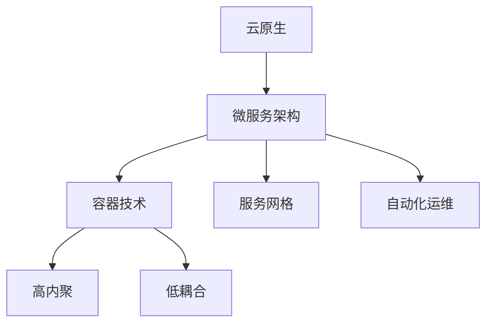

                 

# 腾讯2025云原生微服务架构师社招面试指南

> **关键词：** 云原生，微服务架构，腾讯，面试指南，技术深度解析，架构设计，实践案例，技术展望

> **摘要：** 本文将针对腾讯2025云原生微服务架构师的社招面试，从背景介绍、核心概念、算法原理、数学模型、项目实战、应用场景、工具资源等方面进行全面深入的分析和指导，帮助读者更好地理解和应对面试挑战。

## 1. 背景介绍

腾讯，作为中国领先的互联网科技公司，不仅在社交、游戏、媒体、金融等领域有着深厚的影响力，同时也在云计算和大数据领域取得了显著的成就。随着云计算技术的不断发展，云原生微服务架构已经成为企业数字化转型的重要技术路线。腾讯作为云原生技术的先行者，不断探索和实践云原生微服务架构的最佳实践，为行业提供了丰富的经验和宝贵的参考。

云原生微服务架构师是腾讯2025年社招的重要岗位之一。这一岗位要求候选人具备深厚的云计算、分布式系统、微服务架构等相关技术背景，熟悉容器技术、服务网格、自动化运维等云原生关键技术，能够设计和实施高效、可扩展、稳定的微服务架构。面试官将通过一系列技术问题、案例分析、编码实现等环节，全面评估候选人的技术能力和实践经验。

## 2. 核心概念与联系

### 2.1 云原生

云原生（Cloud Native）是一种通过利用容器、服务网格、不可变基础设施和声明式API等技术来构建和运行应用程序的方法。云原生强调的是应用程序的轻量级、动态性、自我修复能力和易于扩展性，使其能够在复杂、多变的云环境中高效运行。

### 2.2 微服务架构

微服务架构（Microservices Architecture）是一种将应用程序分解为一组小型、独立的服务，每个服务负责一个特定的业务功能。微服务架构具有高内聚、低耦合的特点，使得开发、测试、部署、扩展等环节更加灵活和高效。

### 2.3 关联

云原生和微服务架构是相辅相成的。云原生提供了构建和运行微服务所需的轻量级、动态性和可扩展性，而微服务架构则利用了云原生的优势，实现了应用程序的模块化和分布式化。

### 2.4 Mermaid 流程图



## 3. 核心算法原理 & 具体操作步骤

### 3.1 容器技术

容器技术（Container Technology）是一种轻量级、可移植的计算模型，通过隔离和封装，实现了应用程序与运行环境的分离。Docker 是最常用的容器技术之一，其核心原理包括：

- 镜像（Image）：容器的静态模板，包含应用程序及其运行环境。
- 容器（Container）：基于镜像运行的实例，实现了应用程序的隔离和封装。

### 3.2 具体操作步骤

1. 编写 Dockerfile，定义应用程序的构建过程。
2. 使用 Docker build 构建镜像。
3. 使用 Docker run 启动容器。

### 3.3 代码示例

```Dockerfile
# 使用 Python:3.7 作为基础镜像
FROM python:3.7

# 设置工作目录
WORKDIR /app

# 复制源代码到工作目录
COPY . .

# 安装依赖
RUN pip install -r requirements.txt

# 暴露端口
EXPOSE 8000

# 运行应用程序
CMD ["python", "app.py"]
```

## 4. 数学模型和公式 & 详细讲解 & 举例说明

### 4.1 数学模型

微服务架构中的服务拆分与服务组合可以通过以下数学模型进行描述：

- 服务数量（N）：表示应用程序中的服务总数。
- 服务依赖关系（D）：表示服务之间的依赖关系。

### 4.2 公式

服务拆分与服务组合的复杂度可以表示为：

\[ C = \sum_{i=1}^{N} \sum_{j=1}^{N} D(i, j) \]

其中，\( D(i, j) \) 表示服务 \( i \) 与服务 \( j \) 之间的依赖关系复杂度。

### 4.3 举例说明

假设一个应用程序包含 3 个服务（A、B、C），服务依赖关系如下：

- A 依赖于 B
- B 依赖于 C

则服务拆分与服务组合的复杂度为：

\[ C = D(A, B) + D(B, C) = 1 + 1 = 2 \]

## 5. 项目实战：代码实际案例和详细解释说明

### 5.1 开发环境搭建

在本地计算机上安装 Docker，并配置好 Python 开发环境。

### 5.2 源代码详细实现和代码解读

#### 5.2.1 服务 A

```python
# app_a.py
from flask import Flask

app = Flask(__name__)

@app.route('/')
def hello():
    return 'Hello from Service A'

if __name__ == '__main__':
    app.run(host='0.0.0.0', port=8000)
```

#### 5.2.2 服务 B

```python
# app_b.py
from flask import Flask

app = Flask(__name__)

@app.route('/')
def hello():
    return 'Hello from Service B'

if __name__ == '__main__':
    app.run(host='0.0.0.0', port=8001)
```

#### 5.2.3 服务 C

```python
# app_c.py
from flask import Flask

app = Flask(__name__)

@app.route('/')
def hello():
    return 'Hello from Service C'

if __name__ == '__main__':
    app.run(host='0.0.0.0', port=8002)
```

### 5.3 代码解读与分析

代码中分别实现了 3 个 Flask 应用程序，分别表示服务 A、B、C。每个应用程序都提供了一个简单的 Hello World 接口。通过 Docker 容器技术，可以将这些服务封装和隔离，实现微服务架构。

## 6. 实际应用场景

### 6.1 电商系统

在电商系统中，可以将商品管理、订单管理、用户管理等功能模块拆分为独立的微服务。通过云原生技术，可以实现服务的灵活部署、扩展和自动化运维。

### 6.2 金融系统

金融系统具有高并发、高可靠性的特点，通过微服务架构和云原生技术，可以实现服务的模块化、分布式化，提高系统的性能和稳定性。

## 7. 工具和资源推荐

### 7.1 学习资源推荐

- **书籍：**
  - 《云原生应用架构实践》
  - 《微服务设计》

- **论文：**
  - 《Docker: Lightweight Linux Containers for Convenient, Portable, and Fast Deployment of Applications》

- **博客：**
  - [腾讯云官方博客](https://cloud.tencent.com/developer)
  - [云原生技术社区](https://cloudnative.to/)

- **网站：**
  - [Docker 官网](https://www.docker.com/)
  - [Kubernetes 官网](https://kubernetes.io/)

### 7.2 开发工具框架推荐

- **开发工具：**
  - Visual Studio Code
  - IntelliJ IDEA

- **框架：**
  - Flask
  - Spring Boot

### 7.3 相关论文著作推荐

- **论文：**
  - 《Service Mesh: A Collection of Resources》
  - 《Kubernetes: Container Orchestration at Scale》

- **著作：**
  - 《Docker Deep Dive》
  - 《Kubernetes Up & Running》

## 8. 总结：未来发展趋势与挑战

随着云计算和微服务技术的不断发展，云原生微服务架构已经成为企业数字化转型的主流技术。未来，云原生微服务架构将继续向更高效、更灵活、更安全、更易运维的方向发展。然而，这也带来了一系列的挑战，如服务拆分与组合的复杂性、服务治理、安全性等。为了应对这些挑战，企业和开发者需要不断学习和实践，提高自身的技术能力和创新能力。

## 9. 附录：常见问题与解答

### 9.1 什么是云原生？

云原生是一种通过利用容器、服务网格、不可变基础设施和声明式API等技术来构建和运行应用程序的方法，强调应用程序的轻量级、动态性、自我修复能力和易于扩展性。

### 9.2 微服务架构与传统的单体架构有什么区别？

微服务架构将应用程序分解为一组小型、独立的服务，每个服务负责一个特定的业务功能，具有高内聚、低耦合的特点。与传统单体架构相比，微服务架构具有更好的可扩展性、灵活性和容错性。

### 9.3 如何选择服务拆分的粒度？

服务拆分的粒度需要根据业务需求、系统规模和团队情况综合考虑。一般建议将具有独立业务功能、高内聚、低耦合的服务拆分为独立的微服务。

## 10. 扩展阅读 & 参考资料

- [腾讯云原生官方文档](https://cloud.tencent.com/developer/docs/clou
```

