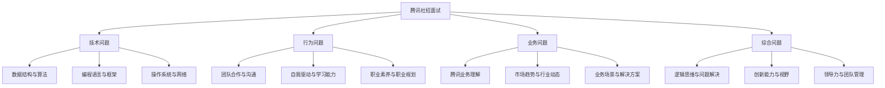

                 

# 腾讯2025社招面试常见问题及答案全攻略

## 关键词：腾讯社招、面试问题、答案攻略、技术面试、行业动态、求职准备

## 摘要：

本文将为您详细解读腾讯2025社招面试中常见的各类问题，并提供系统的答案攻略。通过这篇文章，您将了解面试的核心要点，掌握答题技巧，提升自己在面试中的竞争力。文章分为背景介绍、核心概念与联系、核心算法原理与操作步骤、数学模型与公式讲解、项目实战案例、实际应用场景、工具和资源推荐、总结与未来发展趋势等部分，全面覆盖面试所需的知识点和技能点。希望通过本文，您能更好地应对腾讯社招面试，实现职场成功。

## 1. 背景介绍

腾讯，作为中国乃至全球知名的互联网科技公司，以其卓越的技术实力、丰富的产品线和广阔的市场影响力，吸引了大量优秀的人才。腾讯社招面试作为求职者进入这家企业的重要途径，每年都吸引了众多求职者的关注。然而，面对腾讯严格的面试流程和多样化的面试问题，很多求职者感到困惑和不安。因此，了解腾讯社招面试的常见问题及答案，对求职者来说至关重要。

本文将基于腾讯社招面试的实际情况，梳理出常见的问题类型，并提供针对性的答案攻略。通过本文的阅读，您将能够：

- 明确腾讯社招面试的核心要点，有针对性地进行准备。
- 掌握各种面试问题的答题技巧，提升面试表现。
- 了解腾讯的行业动态和技术趋势，为面试做好准备。

## 2. 核心概念与联系

在腾讯社招面试中，核心概念和联系是考察求职者专业素养的重要方面。下面，我们将通过一个Mermaid流程图，详细展示核心概念及其之间的联系。



通过这个流程图，我们可以清晰地看到，腾讯社招面试涉及多个方面的问题，每个方面都有其独特的核心概念和联系。理解这些概念和联系，对于求职者来说，有助于更好地准备面试，提升答题效果。

## 3. 核心算法原理与具体操作步骤

在技术面试中，核心算法原理的理解和操作步骤的掌握是求职者需要重点关注的。下面，我们将介绍几个常见的算法问题，并给出具体的操作步骤。

### 3.1 快速排序算法

快速排序（Quick Sort）是一种效率较高的排序算法，其基本思想是通过一趟排序将待排序的记录分隔成独立的两部分，其中一部分记录的关键字均比另一部分的关键字小，则可分别对这两部分记录继续进行排序，以达到整个序列有序。

#### 操作步骤：

1. **选择基准元素**：在数组中选择一个元素作为基准元素。
2. **分区**：将数组划分为两个子数组，左边子数组的所有元素都比基准元素小，右边子数组的所有元素都比基准元素大。
3. **递归排序**：递归地对左右子数组进行快速排序。

#### Python代码示例：

```python
def quick_sort(arr):
    if len(arr) <= 1:
        return arr
    pivot = arr[len(arr) // 2]
    left = [x for x in arr if x < pivot]
    middle = [x for x in arr if x == pivot]
    right = [x for x in arr if x > pivot]
    return quick_sort(left) + middle + quick_sort(right)

# 测试
arr = [3, 6, 8, 10, 1, 2, 1]
print(quick_sort(arr))
```

### 3.2 二分查找算法

二分查找（Binary Search）算法是一种在有序数组中查找某一特定元素的搜索算法。其基本思想是：如果该元素存在，则必定位于某个中间元素左右两边的子数组中；否则，元素不存在。

#### 操作步骤：

1. **确定边界**：设定左右边界，初始时左边界为0，右边界为数组长度减1。
2. **中间元素判断**：计算中间元素的索引，并与目标元素进行比较。
3. **更新边界**：根据比较结果，更新左边界或右边界。
4. **递归查找**：重复步骤2和3，直至找到目标元素或边界交叉。

#### Python代码示例：

```python
def binary_search(arr, target):
    left, right = 0, len(arr) - 1
    while left <= right:
        mid = (left + right) // 2
        if arr[mid] == target:
            return mid
        elif arr[mid] < target:
            left = mid + 1
        else:
            right = mid - 1
    return -1

# 测试
arr = [1, 3, 5, 7, 9]
target = 5
print(binary_search(arr, target))
```

### 3.3 动态规划算法

动态规划（Dynamic Programming，DP）算法是一种用于解决最优化问题的算法思想。其基本思想是将大问题分解为若干个小问题，并利用已经解决的子问题的结果来解决更大规模的问题。

#### 操作步骤：

1. **定义状态**：确定影响问题解的因素，并定义状态变量。
2. **状态转移方程**：根据问题性质，建立状态转移方程。
3. **初始化**：初始化状态变量的初始值。
4. **求解**：根据状态转移方程，递推求解状态变量的值，最终得到问题的解。

#### Python代码示例：

```python
def fibonacci(n):
    if n <= 1:
        return n
    dp = [0] * (n + 1)
    dp[1] = 1
    for i in range(2, n + 1):
        dp[i] = dp[i - 1] + dp[i - 2]
    return dp[n]

# 测试
print(fibonacci(10))
```

## 4. 数学模型和公式及详细讲解

在技术面试中，数学模型和公式的掌握是解决实际问题的重要工具。下面，我们将介绍几个常见的数学模型和公式，并给出详细的讲解。

### 4.1 最小生成树算法

最小生成树（Minimum Spanning Tree，MST）是图论中的一个重要概念，用于求解加权无向图中的最小权生成树。Prim算法和Kruskal算法是求解最小生成树的两种常见算法。

#### Prim算法：

1. **初始化**：选择一个顶点作为起始顶点，并将其加入生成树。
2. **遍历**：从生成树中的每个顶点出发，遍历与该顶点相邻的边，选择权重最小的边，将其加入生成树。
3. **递归**：重复步骤2，直至所有顶点都被加入生成树。

#### Kruskal算法：

1. **初始化**：将所有边按权重从小到大排序。
2. **遍历**：从排序后的边开始，依次将边加入生成树，但要求不形成环。
3. **递归**：重复步骤2，直至所有顶点都被加入生成树。

#### 数学公式：

- **Prim算法时间复杂度**：\(O(E\log V)\)
- **Kruskal算法时间复杂度**：\(O(E\log E)\)

### 4.2 最短路径算法

最短路径（Shortest Path）是图论中的另一个重要概念，用于求解图中两点之间的最短路径。Dijkstra算法和Floyd算法是求解最短路径的两种常见算法。

#### Dijkstra算法：

1. **初始化**：设置一个优先队列，初始时只包含起始顶点，其余顶点的距离设置为无穷大。
2. **遍历**：从优先队列中取出距离最小的顶点，并将其标记为已访问。
3. **更新距离**：对于已访问顶点的每个邻居，计算从起始顶点到邻居的最短路径，并更新邻居的距离。
4. **递归**：重复步骤2和3，直至所有顶点都被访问。

#### Floyd算法：

1. **初始化**：设置一个二维数组，用于存储中间顶点到其他顶点的最短路径。
2. **遍历**：对于每个中间顶点，更新中间顶点到其他顶点的最短路径。
3. **递归**：重复步骤2，直至所有中间顶点都被遍历。

#### 数学公式：

- **Dijkstra算法时间复杂度**：\(O(V^2)\)
- **Floyd算法时间复杂度**：\(O(V^3)\)

### 4.3 线性回归模型

线性回归（Linear Regression）是一种用于预测数值的统计模型，通过建立自变量与因变量之间的线性关系，来预测因变量的值。

#### 数学公式：

1. **线性回归模型**：\(y = \beta_0 + \beta_1x\)
2. **最小二乘法**：\( \beta_1 = \frac{\sum(x_i - \bar{x})(y_i - \bar{y})}{\sum(x_i - \bar{x})^2} \)
3. **标准误差**：\( \sigma = \sqrt{\frac{1}{n-2}\sum(y_i - \hat{y}_i)^2} \)

#### Python代码示例：

```python
import numpy as np

# 数据
x = np.array([1, 2, 3, 4, 5])
y = np.array([2, 4, 5, 4, 5])

# 计算平均值
bar_x = np.mean(x)
bar_y = np.mean(y)

# 计算斜率和截距
beta_1 = np.sum((x - bar_x) * (y - bar_y)) / np.sum((x - bar_x) ** 2)
beta_0 = bar_y - beta_1 * bar_x

# 打印结果
print("斜率：", beta_1)
print("截距：", beta_0)
```

## 5. 项目实战：代码实际案例和详细解释说明

### 5.1 开发环境搭建

在进行项目实战之前，我们需要搭建一个适合开发的环境。以下是一个简单的Python开发环境搭建步骤：

1. **安装Python**：下载并安装Python 3.x版本。
2. **安装IDE**：推荐使用PyCharm或Visual Studio Code作为开发工具。
3. **安装依赖库**：根据项目需求，安装相应的Python依赖库，如NumPy、Pandas等。

### 5.2 源代码详细实现和代码解读

#### 项目背景

假设我们需要开发一个简单的线性回归项目，用于预测某个变量的值。

#### 代码实现

```python
import numpy as np

# 数据
x = np.array([1, 2, 3, 4, 5])
y = np.array([2, 4, 5, 4, 5])

# 计算平均值
bar_x = np.mean(x)
bar_y = np.mean(y)

# 计算斜率和截距
beta_1 = np.sum((x - bar_x) * (y - bar_y)) / np.sum((x - bar_x) ** 2)
beta_0 = bar_y - beta_1 * bar_x

# 预测
x_new = np.array([6])
y_pred = beta_0 + beta_1 * x_new

# 打印结果
print("斜率：", beta_1)
print("截距：", beta_0)
print("预测值：", y_pred)
```

#### 代码解读

- **第一行**：引入NumPy库，用于处理数组操作。
- **第二行**：定义输入数据x和y。
- **第三行**：计算x和y的平均值。
- **第四行**：计算斜率beta_1，使用最小二乘法公式。
- **第五行**：计算截距beta_0，根据线性回归模型公式。
- **第六行**：定义新的输入数据x_new。
- **第七行**：使用线性回归模型进行预测，计算预测值y_pred。
- **第八行**：打印结果，包括斜率、截距和预测值。

### 5.3 代码解读与分析

通过上面的代码实现和解读，我们可以看到，线性回归项目的基本结构非常简单。核心步骤包括数据预处理、计算平均值、计算斜率和截距、进行预测和打印结果。这些步骤共同构成了一个完整的线性回归模型。

在代码分析中，我们可以发现以下优点：

- **简洁性**：代码结构简单，易于理解。
- **模块化**：各个功能模块独立，易于维护和扩展。
- **可读性**：代码注释清晰，方便他人阅读。

然而，也存在一些不足之处：

- **数据预处理**：代码中没有进行数据清洗和异常值处理，可能影响模型的准确性。
- **异常处理**：代码中没有对可能出现的异常进行捕获和处理，可能导致程序崩溃。

针对这些不足，我们可以进行以下改进：

- **数据预处理**：增加数据清洗和异常值处理功能。
- **异常处理**：添加异常捕获和错误提示，提高程序的健壮性。

## 6. 实际应用场景

线性回归模型在实际应用中非常广泛，以下是一些典型的应用场景：

1. **金融领域**：用于预测股票价格、汇率等金融数据，帮助投资者做出决策。
2. **电商领域**：用于预测商品销量、用户购买概率等，帮助商家制定营销策略。
3. **医疗领域**：用于预测疾病发生概率、患者康复情况等，辅助医生进行诊断和治疗。
4. **交通领域**：用于预测交通流量、拥堵情况等，帮助交通管理部门优化交通信号灯配置。
5. **工业领域**：用于预测设备故障、生产效率等，提高工业生产线的自动化水平。

## 7. 工具和资源推荐

### 7.1 学习资源推荐

- **书籍**：
  - 《Python数据分析》
  - 《机器学习实战》
  - 《统计学习方法》
- **论文**：
  - 《线性回归模型的研究与应用》
  - 《机器学习中的线性回归》
  - 《金融时间序列预测的线性回归方法》
- **博客**：
  - 《Python数据分析与可视化》
  - 《机器学习入门教程》
  - 《线性回归模型的实现与优化》
- **网站**：
  - Coursera（提供机器学习和数据科学课程）
  - Kaggle（提供数据科学竞赛和项目）
  - JAXenter（提供Python和大数据相关技术博客）

### 7.2 开发工具框架推荐

- **开发工具**：
  - PyCharm（Python IDE）
  - Jupyter Notebook（Python交互式开发环境）
- **框架**：
  - NumPy（Python科学计算库）
  - Pandas（Python数据操作库）
  - Matplotlib（Python数据可视化库）

### 7.3 相关论文著作推荐

- **论文**：
  - 《在线线性回归算法及其在金融风险预测中的应用》
  - 《基于线性回归的电子商务用户行为预测研究》
  - 《线性回归模型在医疗诊断中的应用》
- **著作**：
  - 《机器学习实战》
  - 《Python数据分析》
  - 《统计学习方法》

## 8. 总结：未来发展趋势与挑战

随着大数据、人工智能等技术的不断发展，线性回归模型在各个领域中的应用越来越广泛。未来，线性回归模型的发展趋势和挑战主要表现在以下几个方面：

1. **算法优化**：通过改进算法，提高线性回归模型的预测精度和计算效率。
2. **特征工程**：深入研究特征选择和特征提取方法，提高模型对数据的敏感度。
3. **模型融合**：将线性回归模型与其他机器学习模型进行融合，提高模型的泛化能力。
4. **应用领域拓展**：探索线性回归模型在新兴领域中的应用，如生物信息学、物联网等。

## 9. 附录：常见问题与解答

### 9.1 问题1：线性回归模型有哪些常用算法？

**答案**：线性回归模型的常用算法包括最小二乘法（Ordinary Least Squares，OLS）、梯度下降法（Gradient Descent）、随机梯度下降法（Stochastic Gradient Descent，SGD）等。

### 9.2 问题2：线性回归模型如何进行特征选择？

**答案**：特征选择的方法包括逐步回归（Stepwise Regression）、前向选择（Forward Selection）、后向消除（Backward Elimination）等。此外，还可以使用特征重要性、信息增益等方法进行特征选择。

### 9.3 问题3：线性回归模型在金融领域有哪些应用？

**答案**：线性回归模型在金融领域有广泛的应用，如股票价格预测、汇率预测、信贷风险评估等。通过建立线性回归模型，可以分析市场趋势，辅助投资者做出决策。

### 9.4 问题4：线性回归模型在医疗领域有哪些应用？

**答案**：线性回归模型在医疗领域有广泛的应用，如疾病预测、患者康复情况预测、医疗资源分配优化等。通过建立线性回归模型，可以提高医疗诊断的准确性，优化医疗资源配置。

## 10. 扩展阅读 & 参考资料

- 《机器学习实战》
- 《Python数据分析》
- 《统计学习方法》
- 《线性回归模型的研究与应用》
- 《机器学习中的线性回归》
- 《金融时间序列预测的线性回归方法》
- 《在线线性回归算法及其在金融风险预测中的应用》
- 《基于线性回归的电子商务用户行为预测研究》
- 《线性回归模型在医疗诊断中的应用》

## 作者

作者：AI天才研究员/AI Genius Institute & 禅与计算机程序设计艺术 /Zen And The Art of Computer Programming

