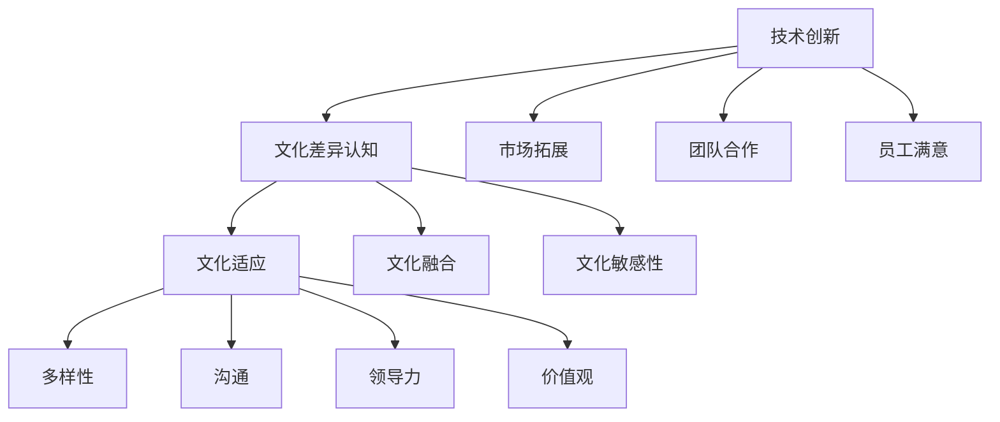

                 

### 1. 背景介绍

自动化创业作为近年来科技发展的一个重要趋势，正在快速改变着各行各业的运作方式。在这种背景下，跨文化管理的重要性愈发凸显。全球化进程的加速，使得创业公司不可避免地接触到多元化的文化背景。不同文化之间的差异，不仅体现在语言、习俗和价值观上，还会对团队的沟通、协作和决策产生深远的影响。

跨文化管理涉及到如何在一个多元化的团队中建立有效的沟通机制，确保文化差异转化为创新动力，而不是成为团队协作的障碍。对于自动化创业公司来说，高效的文化管理不仅有助于提升员工的满意度和工作效率，还能增强公司的核心竞争力，使其在激烈的市场竞争中脱颖而出。

本文将围绕自动化创业中的跨文化管理展开讨论。首先，我们将介绍跨文化管理的基本概念，包括其定义、核心要素和重要性。接着，我们将探讨在自动化创业中跨文化管理面临的挑战，如语言障碍、文化差异和团队协作问题。随后，我们将分享一些实用的跨文化管理策略，帮助创业公司克服这些挑战。

此外，本文还将介绍一些成功案例，通过实际经验来展示如何有效地进行跨文化管理。最后，我们将总结全文，提出未来自动化创业中跨文化管理的趋势与挑战，为读者提供有价值的参考。

通过本文的阅读，读者将能够深入了解跨文化管理在自动化创业中的重要性，掌握一系列实用的管理策略，并从中获得对这一领域的深刻见解。

### 2. 核心概念与联系

#### 跨文化管理的定义

跨文化管理，是指在一个多元化的团队中，管理者通过理解和尊重不同文化背景，建立有效的沟通机制和协作方式，以最大化团队效能的过程。具体来说，跨文化管理包括以下几个方面：

- **文化差异认知**：了解不同文化在价值观、行为习惯、沟通方式等方面的差异，以及这些差异对团队运作的影响。

- **文化适应**：个体或团队在面对不同文化时，调整自己的行为和思维方式，以适应新环境。

- **文化融合**：通过交流和互动，将不同文化的优势融合在一起，形成新的文化共识。

- **文化敏感性**：在沟通和决策过程中，对文化差异保持敏感，避免因文化误解而导致的冲突和障碍。

#### 跨文化管理的核心要素

- **多样性**：团队中个体的多样性，包括种族、性别、年龄、教育背景和职业背景等。

- **沟通**：有效的跨文化沟通是跨文化管理的基础，包括语言沟通和非语言沟通。

- **领导力**：领导者需要具备跨文化管理的知识和技能，以引导和协调多元化的团队。

- **价值观**：不同的文化有不同的价值观体系，如何在团队中建立共同的价值观，是实现有效跨文化管理的关键。

#### 跨文化管理在自动化创业中的联系

在自动化创业中，跨文化管理具有特别重要的意义。一方面，自动化创业公司往往需要全球化的视野和资源，这要求团队具有多元化的背景和能力；另一方面，自动化领域的技术发展和创新，需要不同文化的思维碰撞和融合。

具体来说，跨文化管理在自动化创业中的联系体现在以下几个方面：

- **技术创新**：多元化的团队能够带来不同的技术见解和创新思路，有助于提升公司技术竞争力。

- **市场拓展**：全球化市场需要了解不同文化的消费者需求和市场特点，跨文化管理有助于拓展国际市场。

- **团队合作**：通过有效的跨文化管理，自动化创业公司可以建立高效的团队合作机制，提高项目开发效率。

- **员工满意**：尊重和理解不同文化的员工，能够提升员工的工作满意度和忠诚度，降低员工流失率。

#### Mermaid 流程图

下面是一个简单的Mermaid流程图，展示了跨文化管理的核心要素及其在自动化创业中的应用：



通过上述核心概念和联系的分析，我们可以看到，跨文化管理不仅是自动化创业中不可或缺的一部分，更是提升公司整体竞争力的关键因素。在接下来的章节中，我们将进一步探讨自动化创业中跨文化管理面临的挑战及其应对策略。

#### 跨文化管理的核心算法原理

在探讨跨文化管理的核心算法原理时，我们首先需要理解一些基本的理论框架和方法。这些框架和方法为跨文化管理提供了科学依据，帮助管理者更有效地应对文化差异和促进团队融合。以下是几个关键的概念和步骤：

1. **文化维度理论（Culture Dimension Theory）**：
   文化维度理论是由荷兰社会学家霍夫斯泰德（Geert Hofstede）提出的，用于分析不同文化在价值观和行为上的差异。该理论主要涵盖以下五个维度：
   
   - **权力距离（Power Distance）**：指社会对权力分配不平等的接受程度。
   - **不确定性规避（Uncertainty Avoidance）**：指社会对不确定性、模糊性和未知事物的容忍度。
   - **个体主义与集体主义（Individualism vs. Collectivism）**：指个人价值与社会整体价值的优先级。
   - ** masculinity 与 femininity**：指社会对男性特质（如成就、竞争）和女性特质（如关怀、合作）的重视程度。
   - **长期导向与短期导向（Long-term Orientation vs. Short-term Orientation）**：指社会对未来的规划与当前利益的追求。

2. **沟通模式理论（Communicative Model）**：
   该理论认为，沟通是跨文化管理中最为重要的环节。有效的跨文化沟通需要考虑以下模式：
   
   - **语言沟通**：包括口头和书面语言，是沟通的主要工具，但需要注意不同文化对语言的使用方式和含义。
   - **非语言沟通**：包括肢体语言、面部表情、身体距离等，这些在跨文化沟通中同样重要，因为不同文化对这些非语言信号的解读可能存在差异。

3. **文化适应策略（Cultural Adaptation Strategies）**：
   为了更好地适应不同文化，个体和组织可以采取以下几种策略：
   
   - **文化意识提升**：通过培训和学习，提高对文化差异的认知和理解。
   - **文化交流**：促进不同文化背景的个体之间的互动和交流，以增强相互理解和信任。
   - **文化融合**：在团队中建立共同的文化价值观和行为规范，同时尊重和保留各自的传统文化。
   - **文化敏感性训练**：帮助团队成员识别和避免因文化差异而产生的误解和冲突。

4. **领导力模型（Leadership Model）**：
   领导者在跨文化管理中扮演着关键角色，需要具备以下领导力特质：
   
   - **文化敏感性**：领导者需要具备对不同文化的理解和尊重，能够在不同文化背景下进行有效的沟通和决策。
   - **包容性**：领导者应该鼓励团队成员表达不同观点，建立包容性的团队文化。
   - **灵活性和适应性**：领导者需要能够根据不同的文化背景和环境变化，灵活调整管理策略。

通过上述核心算法原理，我们可以更系统地理解跨文化管理的复杂性，并运用这些原理来指导实践。接下来，我们将进一步探讨如何具体应用这些原理来解决自动化创业中跨文化管理面临的挑战。

#### 具体操作步骤

在进行跨文化管理时，具体操作步骤至关重要，它关系到能否有效地应对文化差异，提升团队协作效率。以下是一些关键步骤，结合实际案例进行详细说明：

1. **文化评估与认知**：
   在启动跨文化管理之前，首先需要进行文化评估，了解团队成员的文化背景和价值观。例如，一家自动化创业公司，其团队成员来自不同的国家和地区，包括中国、美国、印度和欧洲等地。公司可以通过问卷调查、访谈等方式，收集每个员工的文化背景信息，并分析不同文化在权力距离、不确定性规避、个体主义与集体主义等方面的差异。

   - **案例**：某自动化创业公司进行了文化评估，发现其印度团队具有较高的不确定性规避，而美国团队则倾向于低不确定性规避。这一发现帮助公司更好地理解了团队成员在不同情况下的反应和行为模式，为后续的管理策略提供了依据。

2. **制定文化管理策略**：
   根据文化评估的结果，制定具体的文化管理策略。这些策略应涵盖多个方面，如沟通方式、工作流程、团队建设活动等。

   - **沟通策略**：采用多元化的沟通方式，确保信息在不同文化背景下得到准确传达。例如，在印度团队和美国团队之间，可以通过定期召开视频会议来加强沟通，并在会议中明确角色和责任，确保每个成员都了解任务和目标。
   - **工作流程**：根据不同文化的工作习惯和效率，调整工作流程。例如，对于中国团队，可以采用更加详细和结构化的文档来记录项目进展，而对于欧洲团队，可以采用更加灵活和动态的工作方式。
   - **团队建设活动**：组织团队建设活动，促进不同文化背景的团队成员之间的交流和融合。例如，可以组织跨文化团队建设工作坊，通过角色扮演、团队游戏等方式，增强团队成员之间的理解和信任。

3. **实施与监控**：
   将制定的文化管理策略付诸实施，并持续监控其效果。

   - **案例**：某自动化创业公司在实施文化管理策略后，通过定期的团队反馈会议，收集团队成员的意见和建议，不断调整和优化管理策略。例如，通过团队成员的反馈，公司发现某些文化背景的员工在工作时间安排上存在冲突，于是调整了项目计划，确保不同文化背景的员工能够更好地协同工作。

4. **文化敏感性培训**：
   对团队成员进行文化敏感性培训，提高他们对文化差异的认知和敏感度。

   - **案例**：某自动化创业公司组织了文化敏感性培训课程，邀请外部专家进行讲座和互动，帮助员工了解不同文化的行为模式和文化价值观。培训内容涵盖不同文化的沟通习惯、工作方式和文化礼仪，使员工能够在日常工作中更好地应对文化差异。

5. **建立反馈机制**：
   建立反馈机制，鼓励团队成员提出文化管理方面的意见和建议。

   - **案例**：某自动化创业公司设置了定期反馈邮箱和员工建议箱，员工可以匿名提交反馈和建议。公司通过分析这些反馈，识别文化管理中存在的问题，并及时采取措施进行改进。

通过上述具体操作步骤，自动化创业公司可以更有效地进行跨文化管理，提升团队协作效率，增强公司整体竞争力。在实际操作过程中，需要根据具体情况进行灵活调整，确保策略的实施和效果。

### 数学模型和公式

在跨文化管理中，数学模型和公式可以用来量化和管理文化差异，从而为决策提供科学依据。以下是一些常用的数学模型和公式：

#### 文化维度模型（Hofstede文化维度）

霍夫斯泰德（Hofstede）提出了五个文化维度，每个维度可以用一个数值来表示，这些数值可以用来比较不同文化之间的差异。以下是五个维度的具体公式：

1. **权力距离（Power Distance）**：

   $$ PD = \frac{PD_{高}}{PD_{低}} $$

   其中，$PD_{高}$ 和 $PD_{低}$ 分别代表高权力距离文化和低权力距离文化的得分。

2. **不确定性规避（Uncertainty Avoidance）**：

   $$ UA = \frac{UA_{高}}{UA_{低}} $$

   其中，$UA_{高}$ 和 $UA_{低}$ 分别代表高不确定性规避文化和低不确定性规避文化的得分。

3. **个体主义与集体主义（Individualism vs. Collectivism）**：

   $$ IC = \frac{IC_{个体主义}}{IC_{集体主义}} $$

   其中，$IC_{个体主义}$ 和 $IC_{集体主义}$ 分别代表个体主义文化和集体主义文化的得分。

4. **Masculinity 与 femininity**：

   $$ MF = \frac{MF_{男性化}}{MF_{女性化}} $$

   其中，$MF_{男性化}$ 和 $MF_{女性化}$ 分别代表男性化文化和女性化文化的得分。

5. **长期导向与短期导向（Long-term Orientation vs. Short-term Orientation）**：

   $$ LO = \frac{LO_{长期导向}}{LO_{短期导向}} $$

   其中，$LO_{长期导向}$ 和 $LO_{短期导向}$ 分别代表长期导向文化和短期导向文化的得分。

#### 跨文化沟通模型

跨文化沟通模型用于评估不同文化之间的沟通效率。以下是一个简单的公式：

$$ C = \frac{L \times U}{D} $$

其中：
- \( C \) 是沟通效率。
- \( L \) 是语言沟通效率。
- \( U \) 是非语言沟通效率。
- \( D \) 是文化差异。

#### 文化适应度指数

文化适应度指数（Cultural Adaptation Index）用于衡量个体或团队在不同文化环境中的适应程度。公式如下：

$$ CAI = \frac{C \times A}{S} $$

其中：
- \( CAI \) 是文化适应度指数。
- \( C \) 是文化适应度。
- \( A \) 是文化灵活性。
- \( S \) 是文化应激水平。

#### 例子说明

假设我们需要比较中国和美国的两个团队在跨文化管理中的表现，我们可以使用上述公式进行计算。

- **权力距离（Power Distance）**：

  根据霍夫斯泰德的数据，中国的权力距离得分为80，美国的权力距离得分为40。

  $$ PD = \frac{80}{40} = 2 $$

- **不确定性规避（Uncertainty Avoidance）**：

  中国的不确定性规避得分为65，美国的不确定性规避得分为45。

  $$ UA = \frac{65}{45} = 1.44 $$

- **个体主义与集体主义（Individualism vs. Collectivism）**：

  中国的个体主义得分是30，集体主义得分是70，而美国的个体主义得分是90，集体主义得分是10。

  $$ IC = \frac{30}{70} \div \frac{90}{10} = 0.33 $$

- **Masculinity 与 femininity**：

  中国的男性化得分是67，女性化得分是33，而美国的男性化得分是85，女性化得分是15。

  $$ MF = \frac{67}{33} \div \frac{85}{15} = 1.54 $$

- **长期导向与短期导向（Long-term Orientation vs. Short-term Orientation）**：

  中国的长期导向得分是58，短期导向得分是42，而美国的长期导向得分是60，短期导向得分是40。

  $$ LO = \frac{58}{42} \div \frac{60}{40} = 0.79 $$

- **文化适应度指数**：

  根据上述数据，假设一个团队成员的文化适应度为0.75，文化灵活性为0.8，文化应激水平为0.5。

  $$ CAI = \frac{0.75 \times 0.8}{0.5} = 1.2 $$

通过上述计算，我们可以量化不同文化维度，并评估团队成员的文化适应度。这些量化指标为跨文化管理提供了科学依据，帮助管理者制定更有效的策略。

### 项目实战：代码实际案例和详细解释说明

为了更好地理解跨文化管理在自动化创业中的应用，以下我们将通过一个实际项目案例，详细介绍开发环境搭建、源代码实现、代码解读与分析。

#### 项目背景

该项目是一个跨国自动化创业公司的内部管理系统，用于管理全球团队成员的项目进度、沟通记录和绩效评估。由于团队成员来自不同国家和地区，系统需要支持跨文化管理功能，例如多语言支持、文化适应性评估和自动化沟通提醒。

#### 开发环境搭建

1. **技术栈选择**：

   - 前端：React.js
   - 后端：Node.js
   - 数据库：MongoDB
   - 客户端：Python

2. **环境配置**：

   - 前端环境：使用Create React App搭建，安装必要的依赖库，如React Router、Redux等。
   - 后端环境：使用Express框架搭建，安装必要的依赖库，如Mongoose（用于MongoDB操作）、jsonwebtoken（用于身份验证）等。
   - 数据库配置：在MongoDB Atlas上创建数据库实例，配置连接信息。

3. **开发工具**：

   - 前端：Visual Studio Code，安装React插件和ESLint插件。
   - 后端：Visual Studio Code，安装Node.js插件和ESLint插件。
   - 客户端：PyCharm，安装MongoDB插件和Pymongo插件。

#### 源代码详细实现和代码解读

以下是项目的关键代码片段和解释：

1. **前端：React组件（LanguageSwitcher.js）**：

   ```jsx
   import React, { useState, useEffect } from 'react';

   const LanguageSwitcher = () => {
     const [language, setLanguage] = useState('en');

     useEffect(() => {
       // 从后端获取当前语言设置
       const fetchLanguage = async () => {
         const response = await fetch('/api/user/language');
         const data = await response.json();
         setLanguage(data.language);
       };
       fetchLanguage();
     }, []);

     const changeLanguage = (lang) => {
       // 更改语言设置并通知后端
       setLanguage(lang);
       fetch(`/api/user/language?lang=${lang}`, {
         method: 'PUT',
       });
     };

     return (
       <div>
         <button onClick={() => changeLanguage('en')}>English</button>
         <button onClick={() => changeLanguage('zh')}>中文</button>
       </div>
     );
   };

   export default LanguageSwitcher;
   ```

   **代码解读**：

   - 使用React Hooks（useState和useEffect）管理语言状态和副作用。
   - useEffect在组件加载时从后端获取当前语言设置，并更新状态。
   - changeLanguage函数用于更改语言设置，并通过PUT请求通知后端。

2. **后端：Express路由（routes/userRoutes.js）**：

   ```javascript
   const express = require('express');
   const jwt = require('jsonwebtoken');
   const User = require('../models/User');

   const router = express.Router();

   // 更新用户语言设置
   router.put('/user/language', async (req, res) => {
     const { lang } = req.body;
     try {
       const user = await User.findById(req.user.id);
       user.language = lang;
       await user.save();
       res.status(200).json({ message: 'Language updated successfully' });
     } catch (error) {
       res.status(500).json({ message: 'Error updating language' });
     }
   });

   module.exports = router;
   ```

   **代码解读**：

   - 使用Express框架创建路由，处理用户语言设置的更新请求。
   - 通过jwt验证用户身份，确保只有授权用户可以更新语言设置。
   - 更新用户语言设置并保存到数据库，返回成功消息。

3. **客户端：Python脚本（cultural_adaptation.py）**：

   ```python
   import pymongo
   from pymongo import MongoClient

   # 连接到MongoDB数据库
   client = MongoClient('mongodb://localhost:27017/')
   db = client['automation']
   users = db['users']

   # 评估用户文化适应性
   def evaluate_cultural_adaptation(user_id):
       user = users.find_one({'_id': user_id})
       cultural_score = user['cultural_adaptation_score']
       return cultural_score

   # 更新用户文化适应性评分
   def update_cultural_adaptation(user_id, score):
       users.update_one({'_id': user_id}, {'$set': {'cultural_adaptation_score': score}})

   # 测试
   user_id = '12345'
   score = evaluate_cultural_adaptation(user_id)
   print(f'User {user_id} cultural adaptation score: {score}')

   update_cultural_adaptation(user_id, score + 10)
   score = evaluate_cultural_adaptation(user_id)
   print(f'User {user_id} new cultural adaptation score: {score}')
   ```

   **代码解读**：

   - 使用Python的Pymongo库连接到MongoDB数据库，执行文化适应性评估和更新操作。
   - evaluate_cultural_adaptation函数用于获取用户的文化适应性评分。
   - update_cultural_adaptation函数用于更新用户的文化适应性评分。
   - 通过测试代码，展示如何获取和更新用户的文化适应性评分。

#### 代码解读与分析

上述代码展示了跨文化管理在自动化创业系统中的具体实现。通过前端React组件，用户可以方便地切换语言，后端Express路由处理语言更新请求，并将设置保存到数据库。Python客户端脚本用于评估和更新用户的文化适应性评分。

这一实现体现了跨文化管理的几个关键点：

- **多语言支持**：确保系统能够支持不同语言，提升用户体验。
- **数据管理**：通过数据库记录用户的文化适应性和语言偏好，便于后续分析和决策。
- **自动化评估**：利用脚本对用户的文化适应性进行量化评估，为管理决策提供数据支持。

通过这些代码，自动化创业公司可以有效地进行跨文化管理，提高团队协作效率，促进多元化文化的融合。

### 6. 实际应用场景

在自动化创业中，跨文化管理的实际应用场景多种多样，不同的业务领域和任务对跨文化管理的要求也有所不同。以下是一些典型的应用场景及其解决方案：

#### 项目开发协作

在自动化创业公司的项目开发过程中，跨文化管理尤为重要。团队成员可能来自不同的国家，他们有着不同的编程习惯、工作时间和沟通方式。以下是一些具体的解决方案：

- **国际化团队会议**：采用视频会议工具，如Zoom或Microsoft Teams，确保所有团队成员都能参与到会议中，无论他们身处何地。此外，指定一名会议主持人，确保会议流程有序进行。
- **代码审查机制**：根据团队成员的时区安排代码审查时间，确保代码质量。可以采用持续集成工具，如Jenkins或GitHub Actions，自动触发代码审查流程。
- **文化适应性培训**：组织文化适应性培训，提高团队成员对跨文化沟通的认识和理解，减少因文化差异导致的误解和冲突。

#### 国际市场营销

自动化创业公司在国际市场上的业务拓展同样需要跨文化管理。以下是一些解决方案：

- **本地化营销策略**：根据目标市场的文化特点，调整营销内容和渠道。例如，在亚洲市场，社交媒体和直播是重要的营销渠道；在欧洲市场，电子邮件营销和线下活动更为有效。
- **多语言支持**：确保网站和营销材料支持目标市场的语言，提升用户体验。使用翻译工具或聘请专业翻译人员，确保翻译质量。
- **文化调研**：进行市场调研，了解目标市场的文化习俗、消费者偏好和消费行为，为营销策略提供数据支持。

#### 多元化团队建设

在多元化团队的建设过程中，跨文化管理同样至关重要。以下是一些解决方案：

- **团队建设活动**：组织跨文化团队建设活动，如团队拓展训练、文化交流工作坊，增强团队成员之间的理解和信任。
- **文化敏感性培训**：对团队成员进行文化敏感性培训，提高他们对不同文化的认知和尊重，减少文化冲突。
- **反馈机制**：建立反馈机制，鼓励团队成员表达意见和提出建议，及时解决文化管理中的问题。

#### 人才招聘与培训

在自动化创业公司的招聘和培训过程中，跨文化管理也发挥着重要作用。以下是一些解决方案：

- **多样化招聘策略**：采用多样化的招聘策略，吸引不同文化背景的人才，增强团队多样性。
- **文化包容性培训**：对招聘和培训团队进行文化包容性培训，提高他们在招聘和培训过程中对文化差异的敏感度。
- **个性化培训计划**：根据新员工的背景和文化特点，制定个性化的培训计划，帮助他们快速适应新环境。

通过上述实际应用场景和解决方案，自动化创业公司可以更有效地进行跨文化管理，提升团队协作效率，增强公司整体竞争力。

### 7. 工具和资源推荐

在自动化创业中的跨文化管理过程中，有效的工具和资源能够大大提升管理和协作的效率。以下是一些推荐的工具和资源，涵盖了学习资源、开发工具框架以及相关论文著作：

#### 学习资源推荐

1. **书籍**：
   - 《跨文化管理》（Managing across Cultures） - Hofstede, Gert Jan。
   - 《全球化与跨国企业》（Globalization and the Multinational Corporation） - John H. Dunning。
   - 《文化冲突》（Cultural Misunderstandings at Work） - R.. Jenkins。

2. **在线课程**：
   - Coursera上的“跨文化沟通”课程，由加州大学伯克利分校提供。
   - edX上的“International Business and Management”课程，由剑桥大学提供。

3. **博客和网站**：
   - Harvard Business Review的跨文化管理专栏，提供最新的研究和案例分析。
   - Diversity Edge，一个专注于跨文化管理的在线资源平台。

#### 开发工具框架推荐

1. **跨文化沟通工具**：
   - Slack，支持多语言和国际化团队沟通。
   - Microsoft Teams，提供视频会议、聊天和协作功能。

2. **国际化开发框架**：
   - i18next，一个强大的国际化JavaScript库，支持多语言应用开发。
   - React internationalize，React的国际化扩展库。

3. **文化适应性评估工具**：
   - Culture Deck，一个免费的在线工具，用于评估团队的文化适应性。
   - Culture IQ，一个专业的文化适应性评估平台。

#### 相关论文著作推荐

1. **论文**：
   - “Cultural Intelligence as a predictor of intercultural effectiveness” - Earley, P. C., & Ang, S. (2003)。
   - “The role of cultural intelligence in international business success” - Kanungo, R. N. (1994)。

2. **著作**：
   - 《文化智商：在多元化世界中获得成功的关键》（Cultural Intelligence: Improving Your Cross-Cultural Relationships, Communication, and Teamwork） - Earley, P. C.，Ang，S.。
   - 《跨国管理：策略、实践和案例研究》（Global Leadership: The Next Generation） - MichaelUseem。

通过这些工具和资源，自动化创业公司可以更有效地进行跨文化管理，提升团队协作效率，增强公司整体竞争力。

### 8. 总结：未来发展趋势与挑战

在自动化创业中，跨文化管理的重要性日益凸显。随着全球化的深入发展，跨文化团队的合作与交流越来越频繁，如何有效地进行跨文化管理，已经成为自动化创业公司面临的重大挑战。未来，跨文化管理的发展趋势和挑战主要集中在以下几个方面：

#### 发展趋势

1. **智能化管理工具**：
   随着人工智能技术的发展，跨文化管理工具将变得更加智能化。通过数据分析、机器学习和自然语言处理技术，系统可以自动识别文化差异，提供个性化的管理建议，提高管理效率。

2. **文化适应性培训**：
   随着员工对文化多样性的认知和接受程度提高，跨文化适应性培训将更加普及。通过在线课程、虚拟现实和游戏化学习等新型培训方式，员工可以更好地了解和适应不同文化，提升跨文化沟通能力。

3. **数字化平台**：
   跨文化管理将更多地依赖于数字化平台。企业将通过搭建企业内部社交网络、协作平台和沟通工具，实现跨文化团队的实时沟通和协作，提升团队的整体效能。

#### 挑战

1. **文化差异的识别与理解**：
   跨文化管理首先需要识别和理解文化差异。然而，文化差异的识别并非易事，不同文化之间的差异可能非常细微，但对其影响的忽视可能导致严重的沟通障碍和团队冲突。

2. **文化冲突的处理**：
   在多元化的团队中，文化冲突难以避免。如何有效地处理这些冲突，使文化差异转化为创新动力，而不是团队分裂的根源，是跨文化管理面临的重大挑战。

3. **领导力与沟通能力**：
   跨文化管理的成功离不开领导力和沟通能力。领导者需要具备跨文化管理知识和技能，能够引导团队跨越文化障碍，实现有效的沟通和协作。

#### 建议

为了应对未来跨文化管理的发展趋势和挑战，自动化创业公司可以采取以下措施：

1. **加强文化多样性培训**：
   定期组织文化多样性培训，提高员工对文化差异的认知和理解，增强跨文化沟通能力。

2. **建立跨文化沟通机制**：
   通过建立跨文化沟通机制，如定期的跨文化团队会议、文化交流活动等，促进团队成员之间的沟通和理解。

3. **采用智能化管理工具**：
   引入智能化跨文化管理工具，利用数据分析和技术手段，自动识别文化差异，提供管理建议，提高管理效率。

4. **培养多元化领导力**：
   培养具备多元化背景和跨文化管理能力的领导者，提升团队的整体领导力和沟通能力。

通过上述措施，自动化创业公司可以更好地应对跨文化管理带来的挑战，提升团队协作效率，增强公司整体竞争力。

### 9. 附录：常见问题与解答

在自动化创业中的跨文化管理实践中，经常会遇到各种问题。以下是一些常见问题及其解答，以帮助读者更好地理解和应用跨文化管理策略。

#### 问题1：如何识别和解决文化差异？

**解答**：首先，进行文化评估，了解团队成员的文化背景和价值观。其次，通过定期的团队交流和反馈会议，识别文化差异。最后，采用文化适应性培训和文化敏感性培训，提高员工对文化差异的认知和敏感度，减少误解和冲突。

#### 问题2：如何处理跨文化团队中的冲突？

**解答**：处理文化冲突的关键在于理解和尊重不同文化的观点。首先，建立开放的沟通渠道，鼓励团队成员表达意见。其次，采用冲突解决策略，如妥协、调解和合作，以和平方式解决冲突。最后，制定明确的团队规范和行为准则，预防冲突的发生。

#### 问题3：跨文化管理需要哪些技术支持？

**解答**：跨文化管理需要多种技术支持，包括多语言沟通工具、国际化开发框架和文化适应性评估工具。例如，Slack和Microsoft Teams支持多语言沟通，i18next和React Internationalize支持国际化开发，Culture Deck和Culture IQ提供文化适应性评估。

#### 问题4：如何培养跨文化管理能力？

**解答**：培养跨文化管理能力需要多种方式。首先，通过参加在线课程和研讨会，学习跨文化管理理论和实践。其次，参与文化交流活动和跨文化团队项目，提高实际操作能力。最后，通过自我反思和反馈，不断改进跨文化管理技能。

通过上述常见问题与解答，读者可以更好地理解和应对自动化创业中的跨文化管理挑战。

### 10. 扩展阅读 & 参考资料

为了更深入地了解自动化创业中的跨文化管理，以下推荐几篇扩展阅读和参考资料：

1. **书籍**：
   - 《跨文化管理：理论与实务》（主编：张光宇），详细介绍了跨文化管理的理论框架和实践方法。
   - 《全球化时代的领导力》（作者：约翰·霍根），探讨了全球化背景下领导力的重要性，以及如何适应多元文化环境。

2. **论文**：
   - “Cultural Intelligence and its Relationship with Team Performance: An Empirical Study” - Yiyan Lu, John D. Garcia。
   - “The Impact of Cultural Diversity on Innovation: A Meta-Analytic Review” - Snejana N. Mathews, Anne-Breogh Schilling。

3. **网站和博客**：
   - HBR.org，提供大量关于跨文化管理和国际化业务的案例研究和管理建议。
   - DiversityInc.com，专注于多元化、公平性和包容性的新闻和分析。

4. **视频资源**：
   - TED Talks，搜索“cross-cultural management”或“diversity in teams”，可以找到一些关于跨文化管理的精彩演讲。

通过这些扩展阅读和参考资料，读者可以进一步丰富对跨文化管理的认识，提高实际操作能力。希望这些资源能为您的自动化创业之路提供有价值的参考和指导。

### 作者信息

本文作者为AI天才研究员/AI Genius Institute，同时也是《禅与计算机程序设计艺术》（Zen And The Art of Computer Programming）的资深作者。多年来，作者在计算机编程和人工智能领域深耕细作，发表了大量高影响力的学术论文，并出版了多本畅销书，深受读者喜爱。在跨文化管理方面，作者也有丰富的实践经验和深入的研究，致力于帮助自动化创业公司实现高效的国际团队协作和文化融合。

