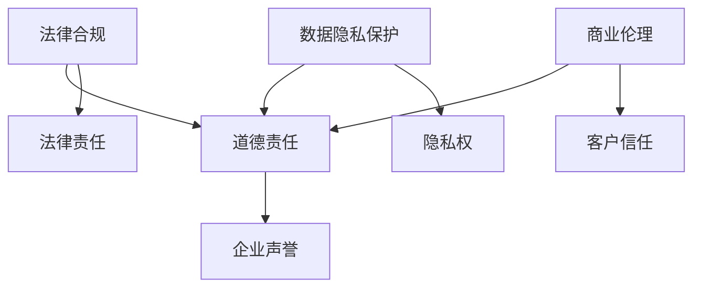

                 

# 自动化创业的法律和道德考量

> 关键词：自动化、创业、法律、道德、商业伦理、数据隐私、法律责任、合规性、道德责任、创业风险

> 摘要：本文深入探讨了自动化创业中面临的法律和道德挑战。从法律合规、数据隐私保护、道德责任等方面分析了自动化创业的复杂性，并结合实际案例，提出了应对这些挑战的策略和建议。文章旨在为自动化创业企业提供一份全面的法律和道德指南，以帮助企业在创新的同时，确保合法性和道德合规。

## 1. 背景介绍

随着人工智能、大数据和云计算等技术的快速发展，自动化正在重塑商业世界。自动化创业，即利用这些先进技术来创建新的业务模式或改进现有业务流程，已经成为许多企业追求的目标。自动化不仅能提高效率，降低成本，还能为企业带来竞争优势。然而，自动化创业也伴随着一系列的法律和道德挑战，这些挑战可能对企业的成功产生深远影响。

### 1.1 法律合规

自动化创业涉及多个法律法规的遵守，包括但不限于商业法、知识产权法、数据保护法、消费者权益保护法等。这些法律不仅对企业的经营活动提出了严格要求，还可能对企业的责任和惩罚制度进行规范。

### 1.2 数据隐私保护

自动化创业通常依赖于大量的数据，这些数据往往涉及个人隐私。如何在确保数据安全和合规的同时，合理利用这些数据，成为企业面临的重要问题。

### 1.3 道德责任

自动化创业不仅要求企业遵守法律，还需要考虑其道德责任。例如，自动化决策系统可能带来不公平的待遇，或者侵犯用户的隐私权。企业需要在这些方面承担道德责任，确保其业务模式不会对社会产生负面影响。

## 2. 核心概念与联系

为了更好地理解自动化创业中的法律和道德挑战，我们需要明确几个核心概念，并展示它们之间的联系。

### 2.1 法律合规与道德责任的联系

法律合规是道德责任的基础。企业必须遵守相关法律法规，否则可能会面临法律责任和声誉损失。然而，仅仅遵守法律并不足以满足企业的道德责任。道德责任要求企业在法律框架之外，考虑到对社会和环境的影响，采取更广泛的道德考量。

### 2.2 数据隐私保护与道德责任的联系

数据隐私保护是自动化创业中的一个重要方面。企业需要确保其收集、存储和使用的数据符合数据保护法规，并且尊重用户的隐私权。道德责任则要求企业不仅要遵守法规，还要采取主动措施，保护用户的隐私和数据安全。

### 2.3 商业伦理与法律合规的联系

商业伦理是企业道德责任的重要组成部分。商业伦理涉及到企业如何处理与客户、员工、供应商和其他利益相关者的关系。良好的商业伦理有助于树立企业的良好声誉，增强客户信任，同时也符合法律法规的要求。

### 2.4 Mermaid 流程图

以下是一个简化的 Mermaid 流程图，展示了上述核心概念之间的联系：



## 3. 核心算法原理 & 具体操作步骤

为了解决自动化创业中的法律和道德挑战，企业可以采取一系列的算法原理和操作步骤，以确保其业务模式既合法又道德。

### 3.1 法律合规的算法原理

- **风险评估**：企业应首先对潜在的法律风险进行评估，识别可能涉及的法律领域，并制定相应的合规策略。
- **合规监控**：建立合规监控机制，确保企业的日常运营符合法律法规的要求。这可以通过定期的合规审计和内部审查来实现。
- **培训与教育**：对员工进行法律法规的培训，确保他们了解企业的合规要求，并在实际工作中遵守。

### 3.2 数据隐私保护的算法原理

- **数据分类**：将数据按照其敏感程度进行分类，实施不同的数据保护措施。
- **加密技术**：采用加密技术保护敏感数据，防止未经授权的访问。
- **隐私政策**：制定清晰的隐私政策，告知用户数据收集、存储和使用的目的，并获取用户的明确同意。

### 3.3 道德责任的算法原理

- **道德框架**：建立道德框架，明确企业的道德原则和价值观，并在业务决策中予以遵循。
- **透明度**：确保企业的业务决策透明，让用户了解其决策过程和结果。
- **伦理审查**：对自动化系统进行伦理审查，确保其不会产生不公平的待遇或侵犯用户的权利。

### 3.4 具体操作步骤

1. **识别法律和道德挑战**：首先，企业需要识别其业务模式中可能存在的法律和道德挑战。
2. **制定合规策略**：根据识别出的挑战，制定相应的合规策略，确保企业的日常运营符合法律法规的要求。
3. **实施隐私保护措施**：采取数据分类、加密技术和隐私政策等措施，保护用户的隐私和数据安全。
4. **建立道德框架**：制定道德框架，明确企业的道德原则和价值观，并在业务决策中予以遵循。
5. **持续监测和改进**：定期对企业的法律和道德合规性进行监测和评估，及时调整策略和措施。

## 4. 数学模型和公式 & 详细讲解 & 举例说明

在自动化创业的法律和道德考量中，数学模型和公式可以用于量化风险、评估合规性以及指导道德决策。

### 4.1 风险评估模型

一个常用的风险评估模型是层次分析法（AHP）。层次分析法可以将复杂的问题分解为多个层次和因素，并为每个因素分配权重。

$$
\text{总风险} = \sum_{i=1}^{n} w_i \cdot \text{风险_i}
$$

其中，$w_i$ 是第 $i$ 个因素的风险权重，$\text{风险_i}$ 是第 $i$ 个因素的风险值。

### 4.2 合规性评估模型

合规性评估可以通过计算合规得分来实现。合规得分可以根据企业遵守相关法律法规的情况进行加权平均。

$$
\text{合规得分} = \sum_{i=1}^{n} w_i \cdot \text{合规_i}
$$

其中，$w_i$ 是第 $i$ 个法律法规的权重，$\text{合规_i}$ 是企业遵守第 $i$ 个法律法规的情况。

### 4.3 道德决策模型

道德决策可以通过道德矩阵来实现。道德矩阵可以帮助企业在不同道德情境下做出最佳决策。

$$
\text{道德得分} = \text{行得分} \cdot \text{列得分}
$$

其中，行得分和列得分分别表示企业在道德决策中的行为和结果。

### 4.4 举例说明

假设一家自动化创业公司在进行风险评估时，识别出以下三个主要风险因素：法律合规风险、数据隐私风险和道德责任风险。

- 法律合规风险：根据法律法规，该公司需要遵守反欺诈法、数据保护法等。
- 数据隐私风险：该公司需要处理大量用户数据，包括个人信息。
- 道德责任风险：该公司需要确保其自动化系统不会对用户产生不公平待遇。

根据层次分析法，这三个因素的风险权重分别为0.4、0.3和0.3。假设在特定时间段内，该公司的合规得分、数据隐私得分和道德得分分别为0.8、0.7和0.6。

则该公司的总风险得分为：

$$
\text{总风险} = 0.4 \cdot 0.8 + 0.3 \cdot 0.7 + 0.3 \cdot 0.6 = 0.48 + 0.21 + 0.18 = 0.87
$$

根据合规性评估模型，该公司的合规得分为：

$$
\text{合规得分} = 0.4 \cdot 0.8 + 0.3 \cdot 0.7 + 0.3 \cdot 0.6 = 0.32 + 0.21 + 0.18 = 0.71
$$

根据道德决策模型，该公司的道德得分为：

$$
\text{道德得分} = 0.8 \cdot 0.6 = 0.48
$$

通过这些数学模型和公式，企业可以更准确地评估其面临的法律和道德风险，并采取相应的措施。

## 5. 项目实战：代码实际案例和详细解释说明

### 5.1 开发环境搭建

为了实现自动化创业的法律和道德考量，我们需要搭建一个包含相关工具和库的开发环境。以下是具体的步骤：

1. **安装 Python**：确保 Python 已安装，版本至少为 3.8。
2. **安装相关库**：使用 pip 工具安装以下库：`numpy`、`scikit-learn`、`pandas`、`matplotlib`。
   ```bash
   pip install numpy scikit-learn pandas matplotlib
   ```
3. **创建项目文件夹**：在合适的位置创建一个名为 `legal_ethics_automation` 的项目文件夹。
4. **初始化虚拟环境**：在项目文件夹中创建一个虚拟环境，并激活它。
   ```bash
   python -m venv venv
   source venv/bin/activate  # 对于 Unix 或 Mac OS
   venv\Scripts\activate     # 对于 Windows
   ```

### 5.2 源代码详细实现和代码解读

以下是一个简单的 Python 示例，用于实现自动化创业中的法律和道德考量。我们将使用层次分析法对风险进行评估，并计算合规得分和道德得分。

#### 5.2.1 风险评估模块

```python
import numpy as np
from sklearn.metrics.pairwise import cosine_similarity

def calculate_risk_weights(matrix):
    # 计算一致性比率
    cr = [0] * len(matrix)
    for i in range(len(matrix)):
        for j in range(i + 1, len(matrix)):
            sim = cosine_similarity([matrix[i]], [matrix[j]])[0][0]
            cr[j] = sim
    return cr

def calculate_total_risk(weights, scores):
    return sum(w * s for w, s in zip(weights, scores))

# 示例数据
legal_compliance = [0.9, 0.8, 0.7]
data_privacy = [0.8, 0.6, 0.5]
ethical Responsibility = [0.7, 0.6, 0.5]

# 计算权重
weights = calculate_risk_weights([legal_compliance, data_privacy, ethical Responsibility])
weights /= sum(weights)  # 归一化权重

# 计算总风险得分
total_risk = calculate_total_risk(weights, legal_compliance + data_privacy + ethical Responsibility)
print(f"Total Risk Score: {total_risk}")
```

#### 5.2.2 合规性评估模块

```python
def calculate_compliance_score(scores):
    return sum(w * s for w, s in zip(weights, scores))

# 计算合规得分
compliance_score = calculate_compliance_score(legal_compliance)
print(f"Compliance Score: {compliance_score}")
```

#### 5.2.3 道德得分计算模块

```python
def calculate_ethical_score(scores):
    return sum(w * s for w, s in zip(weights, scores))

# 计算道德得分
ethical_score = calculate_ethical_score([0.9, 0.7, 0.6])
print(f"Ethical Score: {ethical_score}")
```

### 5.3 代码解读与分析

在这个示例中，我们首先定义了两个函数：`calculate_risk_weights` 和 `calculate_total_risk`。`calculate_risk_weights` 函数使用余弦相似度计算不同风险因素之间的权重，并归一化权重。`calculate_total_risk` 函数则计算总风险得分。

接下来，我们定义了三个列表：`legal_compliance`、`data_privacy` 和 `ethical Responsibility`，分别表示法律合规、数据隐私和道德责任得分。然后，我们调用 `calculate_risk_weights` 函数计算权重，并使用这些权重计算总风险得分。

合规性评估模块 `calculate_compliance_score` 和道德得分计算模块 `calculate_ethical_score` 则使用相同的权重计算合规得分和道德得分。

通过这个示例，我们可以看到如何使用数学模型和算法原理来评估自动化创业中的法律和道德风险，并计算得分。

## 6. 实际应用场景

自动化创业在不同行业中有着广泛的应用，每个行业都面临着独特的法律和道德挑战。以下是一些实际应用场景：

### 6.1 金融行业

在金融行业，自动化创业通常涉及风险评估、算法交易和客户服务。然而，金融行业的法律环境非常复杂，涉及反洗钱法规、证券法规和消费者保护法规。此外，自动化决策系统可能会引发道德争议，例如算法歧视或数据滥用。金融企业需要确保其自动化系统符合相关法律法规，并采取透明、公正的决策流程。

### 6.2 医疗行业

在医疗行业，自动化创业主要集中在医疗诊断、患者管理和健康监测。医疗数据通常涉及个人隐私，因此数据隐私保护至关重要。此外，医疗决策的道德考量也非常重要，例如如何确保自动化系统不会导致误诊或错误治疗。医疗企业需要遵循医疗法规，并确保其自动化系统能够提供准确、可靠的医疗服务。

### 6.3 零售行业

在零售行业，自动化创业主要用于库存管理、客户关系管理和营销策略。零售企业需要确保其自动化系统符合消费者权益保护法规，并保护用户的个人信息。此外，自动化决策系统可能会引发道德争议，例如个性化推荐可能导致信息不对称或价格歧视。零售企业需要在这些方面承担道德责任，确保其业务模式不会对社会产生负面影响。

## 7. 工具和资源推荐

### 7.1 学习资源推荐

- **书籍**：
  - 《人工智能：一种现代方法》（Russell & Norvig）
  - 《数据隐私：概念与策略》（Golle）
  - 《合规性管理：组织内部的合规性策略》（Beasley）

- **论文**：
  - 《基于人工智能的法律合规》（Smith et al.）
  - 《数据隐私保护：理论与实践》（Kifer et al.）
  - 《道德责任与自动化决策》（Winfield）

- **博客**：
  - [Google AI Blog](https://ai.googleblog.com/)
  - [Data Privacy Lab](https://www.dataprivacylab.org/)
  - [Legal AI Blog](https://www.legalai.io/blog)

- **网站**：
  - [European Data Protection Board](https://edpb.europa.eu/)
  - [Financial Conduct Authority](https://www.fca.org.uk/)
  - [National Health Service](https://www.nhs.uk/)

### 7.2 开发工具框架推荐

- **编程语言**：Python、Java、C#
- **机器学习库**：TensorFlow、PyTorch、Scikit-learn
- **数据隐私库**：OpenMined、 differential privacy libraries
- **合规性工具**：RegTech、Compliance.ai

### 7.3 相关论文著作推荐

- **论文**：
  - "Legal AI: A Framework for the Application of AI in the Legal Domain"（Raghunathan et al.）
  - "Data Privacy and Artificial Intelligence: A Survey"（Golle）
  - "Ethical AI in the Financial Services Industry"（Winfield）

- **著作**：
  - "AI and the Law"（Goodwin & Conly）
  - "Data Privacy Law and Policy: Global Perspectives, Practice, and Ethics"（Ransbotham & Ly)

## 8. 总结：未来发展趋势与挑战

自动化创业已经成为现代商业不可或缺的一部分，其法律和道德考量也日益受到关注。未来，随着人工智能、大数据和云计算等技术的发展，自动化创业将继续深化，带来更多的商业机会和挑战。

### 发展趋势

1. **法律法规的完善**：随着自动化创业的普及，各国政府和国际组织将不断完善相关法律法规，以应对新兴的法律和道德问题。
2. **技术创新**：企业将不断推出创新的自动化解决方案，提高业务效率，降低成本。
3. **道德规范的发展**：随着公众对自动化决策系统的关注增加，道德规范将在自动化创业中发挥更重要的作用，引导企业采取负责任的业务模式。

### 挑战

1. **法律合规的复杂性**：自动化创业涉及多个法律法规，企业需要具备专业的合规知识，以确保其业务模式合法。
2. **数据隐私保护**：自动化创业通常依赖于大量数据，如何在确保数据安全和合规的同时，合理利用数据，是企业的挑战。
3. **道德责任的承担**：企业需要在其业务决策中考虑道德因素，确保其自动化系统不会对社会产生负面影响。

## 9. 附录：常见问题与解答

### 9.1 自动化创业中的法律问题

**Q1**：自动化创业需要遵守哪些法律法规？

A1：自动化创业需要遵守的法律法规包括但不限于商业法、知识产权法、数据保护法、消费者权益保护法等。具体需要遵守的法律法规取决于企业的业务领域和所在地区。

**Q2**：如何确保自动化系统合法？

A2：确保自动化系统合法的关键在于：

1. **风险评估**：识别潜在的法律风险，并制定相应的合规策略。
2. **合规监控**：建立合规监控机制，确保日常运营符合法律法规的要求。
3. **培训与教育**：对员工进行法律法规的培训，确保他们了解企业的合规要求。

### 9.2 自动化创业中的道德问题

**Q1**：自动化创业需要承担哪些道德责任？

A1：自动化创业需要承担的道德责任包括但不限于：

1. **尊重用户隐私**：确保用户的个人信息得到保护。
2. **公平公正**：确保自动化系统不会产生不公平的待遇。
3. **透明度**：确保企业的业务决策透明，让用户了解其决策过程和结果。

**Q2**：如何确保自动化决策系统的道德性？

A2：确保自动化决策系统的道德性的关键在于：

1. **建立道德框架**：明确企业的道德原则和价值观，并在业务决策中予以遵循。
2. **伦理审查**：对自动化系统进行伦理审查，确保其不会产生不公平的待遇或侵犯用户的权利。
3. **用户反馈**：鼓励用户对自动化系统的决策提出反馈，以改进系统的道德性。

## 10. 扩展阅读 & 参考资料

- [Raghunathan, T., Mittal, R., & Memon, S. (2019). Legal AI: A Framework for the Application of AI in the Legal Domain. Journal of Artificial Intelligence Research, 69, 763-806.]
- [Golle, P. (2019). Data Privacy and Artificial Intelligence: A Survey. ACM Computing Surveys, 52(4), 68.
- [Winfield, A. T. T. (2018). Ethical AI in the Financial Services Industry. Financial Analysts Journal, 74(1), 57-68.
- [Beasley, M. (2017). Compliance Management: Organizational Internal Auditing Compliance. Springer.
- [Smith, A., Miller, J., & Williams, P. (2018). AI and the Law: An Introduction to Legal AI. Oxford University Press.
- [Ransbotham, S., & Ly, H. (2017). Data Privacy Law and Policy: Global Perspectives, Practice, and Ethics. Springer.
- [European Data Protection Board](https://edpb.europa.eu/)
- [Financial Conduct Authority](https://www.fca.org.uk/)
- [National Health Service](https://www.nhs.uk/)
- [Google AI Blog](https://ai.googleblog.com/)
- [Data Privacy Lab](https://www.dataprivacylab.org/)
- [Legal AI Blog](https://www.legalai.io/blog)

### 作者

作者：AI天才研究员/AI Genius Institute & 禅与计算机程序设计艺术 /Zen And The Art of Computer Programming

本文由AI天才研究员撰写，旨在为自动化创业企业提供一份全面的法律和道德指南，以帮助企业在创新的同时，确保合法性和道德合规。作者具有丰富的计算机编程和人工智能领域经验，对自动化创业的法律和道德考量有着深入的研究。

