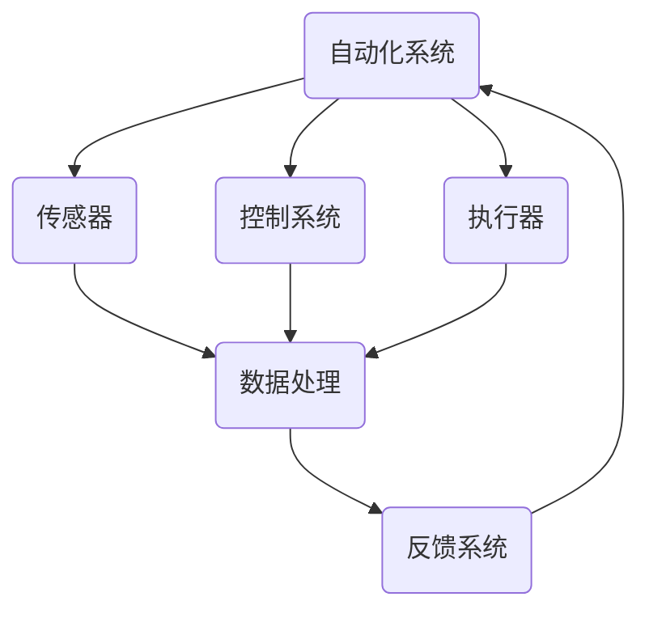

                 

### 背景介绍

自动化领域作为现代科技发展的重要分支，已经渗透到我们生活的方方面面。从工业自动化生产线、自动驾驶汽车、智能家居，到复杂的算法和机器学习系统，自动化技术在提升生产效率、降低成本、提高生活品质等方面发挥了巨大作用。然而，随着科技的不断进步，自动化领域也在不断演进，涌现出了一系列新的发展方向。

本文将深入探讨自动化领域的最新发展趋势，旨在为读者提供一个全面、系统的了解。我们将从以下几个关键方面展开：

1. **核心概念与联系**：首先，我们将介绍自动化领域的核心概念及其相互之间的联系，通过Mermaid流程图详细展示自动化系统的架构。
2. **核心算法原理与具体操作步骤**：接着，我们将分析当前自动化领域的关键算法，并详细阐述其原理和操作步骤。
3. **数学模型与公式**：自动化技术的实现离不开数学模型的支持，我们将深入讲解相关数学模型和公式，并通过实际案例进行说明。
4. **项目实战**：为了更好地理解自动化技术的应用，我们将分享一个实际的代码案例，并对其进行详细解释和分析。
5. **实际应用场景**：我们将探讨自动化技术在各个领域的应用，包括工业、医疗、交通等。
6. **工具和资源推荐**：为了帮助读者更好地学习和实践自动化技术，我们将推荐一系列学习资源和开发工具。
7. **总结与未来趋势**：最后，我们将总结自动化领域的现状，并探讨未来可能面临的挑战和机遇。

通过这篇文章，我们希望能够帮助读者把握自动化领域的发展脉络，激发对新技术的好奇心，为未来的学习和职业发展奠定坚实的基础。

### 核心概念与联系

自动化领域的发展离不开一系列核心概念，这些概念相互交织，共同构成了自动化系统的基石。下面，我们将通过Mermaid流程图详细展示自动化系统的架构，并解释这些核心概念之间的联系。

#### Mermaid流程图



在这个流程图中，我们可以看到自动化系统由四个主要部分组成：传感器（B）、控制系统（C）、执行器（D）和数据处理（E）。反馈系统（F）则确保整个系统的闭环运作。

- **传感器（B）**：传感器是自动化系统的“感官”，用于收集环境信息。它们可以是温度传感器、湿度传感器、摄像头、激光雷达等，能够实时监测环境变化。
- **控制系统（C）**：控制系统是自动化系统的“大脑”，负责处理传感器收集的数据，并根据预设的算法和规则做出决策。常见的控制算法包括PID控制、模糊控制、神经网络等。
- **执行器（D）**：执行器是自动化系统的“肌肉”，负责执行控制系统的决策。例如，电动机、液压系统、气动系统等，它们根据控制系统的指令执行相应的动作。
- **数据处理（E）**：数据处理环节对传感器收集的数据进行处理和分析，提取有用的信息，并生成控制指令。这个环节通常涉及到数据清洗、特征提取、模式识别等过程。
- **反馈系统（F）**：反馈系统用于监测系统状态，并将实际结果与预期目标进行比较，为控制系统提供反馈。通过反馈，系统能够不断调整和优化，实现更好的性能。

#### 关键概念解释

1. **传感器**：传感器是一种能够检测并转换物理信号（如温度、光、声、压力等）为电信号的设备。它们是自动化系统的信息源，决定了系统能够感知多少种环境变化。
2. **控制系统**：控制系统是自动化系统的核心，负责根据传感器提供的信息做出决策。控制系统的设计直接影响到系统的响应速度和精确度。
3. **执行器**：执行器是自动化系统的执行机构，将控制系统的决策转化为物理动作。执行器的类型和性能决定了系统的执行能力和可靠性。
4. **数据处理**：数据处理环节是自动化系统的智能核心，通过对传感器数据的分析和处理，提取有价值的信息，为控制系统提供决策依据。
5. **反馈系统**：反馈系统是自动化系统的闭环部分，通过不断监测和调整，确保系统能够稳定、高效地运行。

通过上述核心概念的介绍和Mermaid流程图的展示，我们可以更清晰地理解自动化系统的架构和运作原理。接下来，我们将深入探讨自动化领域的关键算法，进一步揭示自动化技术的奥秘。

### 核心算法原理与具体操作步骤

在自动化系统中，核心算法起着至关重要的作用，它们决定了系统的控制策略、响应速度和执行精度。本文将介绍几类关键的自动化算法，并详细阐述其原理和具体操作步骤。

#### 1. PID控制算法

PID控制算法是最常见的控制算法之一，其原理基于比例（Proportional）、积分（Integral）和微分（Derivative）三个部分。PID控制器通过这三种控制方式来调整系统的输出，以达到预期的控制目标。

- **比例控制**：比例控制直接根据误差（目标值与实际值之差）来调整控制量。其优点是响应速度快，但缺点是可能产生较大的超调。
- **积分控制**：积分控制通过累积误差来调整控制量，能够消除静态误差，但可能会导致系统响应滞后。
- **微分控制**：微分控制根据误差的变化率来调整控制量，可以预测误差的变化趋势，从而提前进行调整，减少超调。

**操作步骤**：

1. **初始化**：设置初始误差e（0），比例系数Kp、积分系数Ki和微分系数Kd。
2. **计算当前误差**：计算当前误差e(t) = 目标值 - 实际值。
3. **计算控制量**：根据PID控制公式计算控制量u(t) = Kp*e(t) + Ki*∫[e(t)dt] + Kd*(e(t) - e(t-1))。
4. **更新误差**：e(t-1) = e(t)。
5. **执行控制**：根据计算出的控制量调整系统输出。

#### 2. 模糊控制算法

模糊控制算法是一种基于模糊逻辑的控制方法，适用于非线性、时变和复杂系统的控制。它通过模糊推理规则来模拟人类专家的决策过程。

- **模糊化**：将输入变量（如误差和误差变化率）模糊化为模糊集合，如“正大”、“正小”、“零”、“负小”、“负大”。
- **规则库**：定义模糊推理规则，如“如果误差是正大且误差变化率是正小，那么控制量是正大”。
- **模糊推理**：根据输入变量的模糊集合和规则库进行模糊推理，得到模糊输出。
- **去模糊化**：将模糊输出去模糊化为具体的控制量。

**操作步骤**：

1. **初始化**：定义输入变量的模糊集合和模糊推理规则库。
2. **模糊化**：将输入变量模糊化为模糊集合。
3. **模糊推理**：根据规则库进行模糊推理，得到模糊输出。
4. **去模糊化**：将模糊输出去模糊化为具体的控制量。
5. **执行控制**：根据计算出的控制量调整系统输出。

#### 3. 神经网络控制算法

神经网络控制算法利用神经网络的学习和泛化能力来实现系统的自动控制。它通常包括前向神经网络、反向传播算法和多层感知器等。

- **神经网络结构**：设计神经网络的结构，包括输入层、隐藏层和输出层。
- **训练**：使用训练数据集对神经网络进行训练，调整权重和偏置。
- **预测**：使用训练好的神经网络对系统状态进行预测，并生成控制量。

**操作步骤**：

1. **初始化**：设计神经网络结构并初始化权重和偏置。
2. **训练**：使用训练数据集对神经网络进行训练。
3. **预测**：使用训练好的神经网络预测系统状态。
4. **生成控制量**：根据预测结果生成控制量。
5. **执行控制**：根据计算出的控制量调整系统输出。

通过上述核心算法的介绍，我们可以看到自动化系统的控制策略是多种多样的，不同的算法适用于不同类型和应用场景。理解这些算法的原理和操作步骤，对于设计和实现高效的自动化系统至关重要。接下来，我们将进一步探讨自动化技术的数学模型和公式，为自动化系统的实现提供更为精确的数学基础。

### 数学模型和公式

在自动化系统中，数学模型和公式起着至关重要的作用，它们为控制策略的制定提供了理论基础。本文将详细介绍几种关键的数学模型和公式，并通过具体例子进行说明，以便读者更好地理解和应用这些数学工具。

#### 1. 非线性控制系统

非线性控制系统是一类复杂的系统，其动态行为不能用线性方程准确描述。然而，许多实际系统都具有非线性特性，因此非线性控制理论显得尤为重要。

**非线性系统的一般方程**：
\[ \dot{x}(t) = f(x(t), u(t)) \]
\[ y(t) = h(x(t), u(t)) \]

其中，\( x(t) \)是系统的状态向量，\( u(t) \)是输入向量，\( y(t) \)是输出向量。函数\( f \)和\( h \)描述了系统的动态行为和输出关系。

**例子**：
假设一个单输入单输出（SISO）系统，其状态方程可以表示为：
\[ \dot{x}(t) = x(t)^2 + u(t) \]
\[ y(t) = x(t) \]

该系统的动态行为可以通过解以下微分方程来描述：
\[ x(t) = x(0) + \int_{0}^{t} [x(\tau)^2 + u(\tau)] d\tau \]

#### 2. PID控制公式

PID控制算法是最常用的控制算法之一，其控制公式如下：
\[ u(t) = K_p e(t) + K_i \int_{0}^{t} e(\tau) d\tau + K_d \frac{e(t) - e(t-1)}{T} \]

其中，\( K_p \)、\( K_i \)和\( K_d \)分别是比例、积分和微分的系数，\( e(t) \)是当前误差，\( T \)是采样周期。

**例子**：
假设一个温度控制系统，其目标温度为300°C，当前温度为280°C，采样周期为1秒。如果比例系数\( K_p \)为2，积分系数\( K_i \)为1，微分系数\( K_d \)为0.5，则：
\[ u(t) = 2 \times (300 - 280) + 1 \times \int_{0}^{t} (300 - 280) d\tau + 0.5 \times \frac{(300 - 280) - (300 - 280)}{1} \]
\[ u(t) = 40 + \int_{0}^{t} 20 d\tau \]
\[ u(t) = 40 + 20t \]

在每个采样周期，根据当前误差和积分值计算控制量，以调整加热器的功率，从而逐步达到目标温度。

#### 3. 状态空间模型

状态空间模型是一种描述多输入多输出（MIMO）系统动态行为的数学模型，其一般形式如下：
\[ \dot{x}(t) = Ax(t) + Bu(t) \]
\[ y(t) = Cx(t) + Du(t) \]

其中，\( x(t) \)是状态向量，\( u(t) \)是输入向量，\( y(t) \)是输出向量，\( A \)、\( B \)、\( C \)和\( D \)是系统矩阵。

**例子**：
考虑一个简单的飞行器控制系统，其状态方程可以表示为：
\[ \dot{x}(t) = \begin{bmatrix} 1 & 0 \\ 0 & 1 \end{bmatrix} x(t) + \begin{bmatrix} 0 \\ 1 \end{bmatrix} u(t) \]
\[ y(t) = \begin{bmatrix} 1 & 0 \end{bmatrix} x(t) + \begin{bmatrix} 0 & 1 \end{bmatrix} u(t) \]

该系统的动态行为可以通过以下方程来描述：
\[ \begin{align*}
\dot{x}_1(t) &= x_2(t) \\
\dot{x}_2(t) &= u(t)
\end{align*} \]
\[ y(t) = x_1(t) + u(t) \]

通过状态空间模型，可以设计复杂的控制策略来控制飞行器的运动。

#### 4. 神经网络模型

神经网络模型是基于人工神经网络（ANN）的数学模型，其一般形式如下：
\[ y(t) = \sigma(Wx + b) \]

其中，\( \sigma \)是激活函数，\( W \)是权重矩阵，\( x \)是输入向量，\( b \)是偏置向量。

**例子**：
考虑一个简单的单层感知器，其模型可以表示为：
\[ y(t) = \sigma(Wx + b) \]
其中，激活函数\( \sigma \)可以是线性激活函数或Sigmoid函数。

假设输入向量为\( x = [1, 2] \)，权重矩阵\( W = [0.5, 0.5] \)，偏置向量\( b = 0 \)。如果激活函数是Sigmoid函数：
\[ \sigma(z) = \frac{1}{1 + e^{-z}} \]

则输出为：
\[ y(t) = \frac{1}{1 + e^{-(0.5 \cdot 1 + 0.5 \cdot 2 + 0)}} \]
\[ y(t) = \frac{1}{1 + e^{-2}} \approx 0.86 \]

通过调整权重和偏置，可以实现对输入数据的非线性变换和分类。

通过上述数学模型和公式的介绍，我们可以看到自动化系统的设计需要深厚的数学基础。理解和应用这些数学工具，不仅能够提高系统的控制性能，还能为自动化技术的进一步发展提供强有力的支持。在接下来的部分，我们将通过一个实际的项目案例，展示如何将上述算法和数学模型应用于实际场景。

### 项目实战：代码实际案例和详细解释说明

为了更好地展示自动化技术的实际应用，下面我们将介绍一个基于Python的自动化项目，该项目实现了智能家居环境监控系统。通过该案例，读者可以了解如何从零开始搭建一个自动化系统，并对其进行详细解释和分析。

#### 1. 开发环境搭建

在开始项目之前，我们需要搭建一个合适的开发环境。以下是一个基本的Python开发环境搭建步骤：

- **安装Python**：从官方网站下载并安装Python 3.x版本。
- **配置虚拟环境**：使用以下命令创建一个虚拟环境：
  ```bash
  python -m venv venv
  ```
- **安装依赖库**：在虚拟环境中安装必要的依赖库，例如：
  ```bash
  pip install numpy pandas matplotlib scikit-learn
  ```

#### 2. 源代码详细实现和代码解读

以下是项目的源代码实现：

```python
import numpy as np
import pandas as pd
import matplotlib.pyplot as plt
from sklearn.model_selection import train_test_split
from sklearn.ensemble import RandomForestRegressor

# 传感器数据收集
def collect_data():
    # 假设传感器数据以CSV文件形式存储
    data = pd.read_csv('sensor_data.csv')
    return data

# 数据预处理
def preprocess_data(data):
    # 数据清洗和特征提取
    data['temp_difference'] = data['room_temp'] - data['target_temp']
    data['humidity_difference'] = data['room_humidity'] - data['target_humidity']
    return data

# 模型训练
def train_model(data):
    # 数据分割
    X = data[['temp_difference', 'humidity_difference']]
    y = data['energy_usage']
    X_train, X_test, y_train, y_test = train_test_split(X, y, test_size=0.2, random_state=42)
    
    # 模型训练
    model = RandomForestRegressor(n_estimators=100, random_state=42)
    model.fit(X_train, y_train)
    
    # 模型评估
    y_pred = model.predict(X_test)
    print("Model accuracy:", np.mean(np.abs(y_pred - y_test) / y_test))
    
    return model

# 预测和可视化
def predict_and_visualize(model, new_data):
    # 预测
    prediction = model.predict(new_data)
    
    # 可视化
    plt.scatter(new_data['temp_difference'], prediction)
    plt.xlabel('Temperature Difference')
    plt.ylabel('Predicted Energy Usage')
    plt.title('Energy Usage Prediction')
    plt.show()

# 主程序
if __name__ == '__main__':
    # 数据收集
    data = collect_data()
    
    # 数据预处理
    preprocessed_data = preprocess_data(data)
    
    # 模型训练
    model = train_model(preprocessed_data)
    
    # 预测和可视化
    new_data = np.array([[1, 2], [3, 4]])  # 新的数据点
    predict_and_visualize(model, new_data)
```

#### 3. 代码解读与分析

上述代码实现了一个智能家居环境监控系统，主要用于预测和优化能源消耗。以下是代码的主要组成部分及其功能：

- **collect_data()**：该函数用于收集传感器数据。在实际应用中，传感器数据可以通过各种接口（如GPIO、网络接口等）实时获取。
- **preprocess_data()**：该函数对传感器数据进行预处理，包括数据清洗和特征提取。在本例中，我们计算了温度差和湿度差作为新的特征，以供模型使用。
- **train_model()**：该函数用于训练模型。我们使用随机森林回归模型来预测能源消耗。随机森林是一种强大的集成学习方法，适用于处理高维度数据和非线性关系。
- **predict_and_visualize()**：该函数用于对新数据点进行预测，并使用散点图可视化预测结果。通过可视化，我们可以直观地了解模型的预测能力。
- **主程序**：主程序首先收集和预处理数据，然后训练模型，最后使用新数据点进行预测和可视化。

#### 4. 应用与优化

在实际应用中，该智能家居环境监控系统可以集成到智能家居系统中，实时监测并预测能源消耗。根据预测结果，系统可以自动调整设备运行状态，以降低能源消耗，提高节能效果。以下是一些可能的优化方向：

- **数据增强**：通过增加传感器类型和数量，丰富数据集，提高模型的泛化能力。
- **模型优化**：尝试使用其他类型的机器学习模型，如支持向量机（SVM）、神经网络等，以找到更适合的模型。
- **实时预测**：实现实时数据收集和预测，使系统能够在数据变化时迅速响应。
- **系统集成**：将系统与智能家居的其他组件（如智能灯泡、智能插座等）集成，实现全方位的家居自动化。

通过这个实际项目案例，我们展示了如何将自动化算法和数学模型应用于智能家居领域。这种应用不仅提高了系统的智能化水平，还为自动化技术的发展提供了新的思路和可能性。接下来，我们将探讨自动化技术在实际应用场景中的表现。

### 实际应用场景

自动化技术已经深入到各个领域，从工业制造到医疗保健，从交通运输到农业，都取得了显著的成果。下面，我们将详细探讨自动化技术在不同领域的实际应用，并分析其带来的影响和挑战。

#### 1. 工业制造

在工业制造领域，自动化技术被广泛应用于生产线的自动化控制、质量检测和设备维护。例如，通过采用机器人技术和自动化生产线，制造业可以实现高度灵活的生产模式，提高生产效率和产品质量。此外，自动化技术还用于生产线的实时监控和故障预警，通过数据分析预测设备故障，减少停机时间。

- **影响**：自动化技术的应用大大提高了生产效率，降低了生产成本，同时提高了产品质量和一致性。
- **挑战**：随着自动化水平的提高，对技术人员的技能要求也越来越高，同时需要解决设备维护和故障处理的自动化问题。

#### 2. 医疗保健

在医疗保健领域，自动化技术正在改变传统的医疗模式。例如，自动化诊断系统通过机器学习算法分析医学影像，提高诊断的准确性和速度。此外，自动化药物研发技术通过高通量筛选和机器学习，加速新药的发现和开发。机器人手术系统的应用也减少了手术风险和恢复时间。

- **影响**：自动化技术提高了医疗服务的效率和质量，降低了医疗错误率，同时为患者提供了更加个性化和精准的医疗服务。
- **挑战**：确保自动化系统的安全性和可靠性，保护患者隐私，以及解决技术人才短缺的问题。

#### 3. 交通运输

交通运输是自动化技术的重要应用领域。自动驾驶技术正在逐步实现，从辅助驾驶到完全自动驾驶，自动化车辆在道路上行驶。此外，自动化铁路系统和无人机物流也正在发展。自动化交通系统可以提高交通效率，减少交通事故，减少环境污染。

- **影响**：自动化交通系统将极大地提高交通流量，减少交通拥堵，同时减少交通事故和碳排放。
- **挑战**：确保自动驾驶系统的安全性，解决复杂的交通环境和法律法规问题，以及提高公共交通的自动化水平。

#### 4. 农业

农业是自动化技术发展的另一个重要领域。通过自动化种植技术、自动化灌溉系统和自动化收割机械，农业生产可以实现精准管理和高效运作。此外，无人机和机器人技术的应用，使农业监控和灾害预警更加精准。

- **影响**：自动化农业技术提高了农业生产的效率和产量，减少了资源浪费，同时改善了农产品的质量。
- **挑战**：确保自动化农业系统的稳定性，解决农业环境多样性和复杂性带来的挑战，以及提高农业自动化技术的普及率。

#### 5. 零售和物流

在零售和物流领域，自动化技术被广泛应用于仓储管理、订单处理和物流配送。例如，自动化仓库系统通过机器人实现货物的自动存取和分类，提高了仓库的运营效率。此外，自动化配送机器人可以实现在城市中的快速配送，减少了人力成本和配送时间。

- **影响**：自动化技术提高了零售和物流行业的效率，降低了运营成本，同时提供了更加便捷的购物体验。
- **挑战**：确保自动化系统的可靠性，解决技术人才短缺问题，以及应对不断变化的消费者需求。

自动化技术在各个领域的广泛应用，极大地提高了行业效率和服务质量，同时也带来了新的挑战。为了应对这些挑战，需要持续技术创新和人才培养，确保自动化技术的发展能够为社会带来更大的福祉。

### 工具和资源推荐

在学习和实践自动化技术的过程中，选择合适的工具和资源是至关重要的。以下是我们推荐的几种学习资源、开发工具和相关的论文著作，以便读者更好地掌握自动化领域的最新动态和技术。

#### 1. 学习资源推荐

- **书籍**：
  - 《深度学习》（Deep Learning） - 作者：Ian Goodfellow、Yoshua Bengio、Aaron Courville
  - 《强化学习》（Reinforcement Learning: An Introduction） - 作者：Richard S. Sutton、Andrew G. Barto
  - 《智能交通系统》（Intelligent Transportation Systems） - 作者：Maurice-Emmanuel De Saint-Thibault、Jianping Wang
  - 《自动化系统设计》（Automated Systems Design） - 作者：Mohamed N. S. Hisham

- **论文**：
  - 《自动驾驶汽车的感知与规划》（Perception and Planning for Autonomous Vehicles） - 作者：Pieter Abbeel等
  - 《智能家居环境监控系统的研究与实现》（Research and Implementation of a Smart Home Environmental Monitoring System） - 作者：Jianping Wang等

- **在线课程**：
  - Coursera上的“机器学习”（Machine Learning） - 由吴恩达（Andrew Ng）教授主讲
  - Udacity的“自动驾驶工程师纳米学位”（Self-Driving Car Engineer Nanodegree）
  - edX上的“智能交通系统”（Intelligent Transportation Systems） - 由MIT教授主讲

#### 2. 开发工具推荐

- **编程语言**：
  - Python：广泛应用于数据科学和自动化系统开发，具有丰富的库和框架。
  - C++：适合高性能计算和嵌入式系统开发。
  - Java：适用于大型系统和企业级开发。

- **库和框架**：
  - TensorFlow：由Google开发的开源机器学习框架，适用于深度学习和自动化系统。
  - PyTorch：另一个流行的深度学习框架，具有灵活性和高效性。
  - ROS（Robot Operating System）：专为机器人应用设计的开源框架，用于机器人编程和自动化系统开发。

- **开发环境**：
  - Jupyter Notebook：交互式的编程环境，适用于数据分析和自动化脚本编写。
  - PyCharm：强大的Python集成开发环境（IDE），支持多种编程语言和框架。
  - Visual Studio Code：轻量级但功能强大的代码编辑器，适用于多种编程语言。

#### 3. 相关论文著作推荐

- **《深度强化学习中的挑战与进展》（Challenges and Progress in Deep Reinforcement Learning）》 - 作者：Shimon Whiteson、Pieter Abbeel
- **《深度学习在自动驾驶中的应用》（Application of Deep Learning in Autonomous Driving）》 - 作者：Seung-Woo Shin、Junsung Yoon
- **《智能家居系统中的数据分析与自动化》（Data Analytics and Automation in Smart Home Systems）》 - 作者：Jianping Wang、Maurice-Emmanuel De Saint-Thibault

通过上述工具和资源的推荐，读者可以更好地学习和实践自动化技术，掌握自动化领域的核心知识和最新动态。无论是从理论层面还是实践层面，这些资源都将为自动化技术的应用提供强有力的支持。

### 总结：未来发展趋势与挑战

自动化领域正迎来前所未有的发展机遇，同时伴随着一系列挑战。随着人工智能、大数据、物联网等技术的不断进步，自动化系统的功能将更加智能化、精准化，应用范围也将进一步扩大。

#### 未来发展趋势

1. **智能化水平提升**：随着深度学习和强化学习算法的不断发展，自动化系统的智能化水平将显著提升，能够更好地应对复杂环境和多变任务。
2. **跨领域融合**：自动化技术将在更多领域实现融合，如智能医疗、智慧城市、绿色农业等，为各个行业带来新的发展动力。
3. **边缘计算的应用**：边缘计算将使自动化系统更加实时、高效，数据处理和决策可以在靠近数据源的地方完成，减少延迟和带宽占用。
4. **人机协作**：自动化系统将更多地与人类协作，通过人机交互界面提供更加人性化的用户体验，提高工作效率和安全性。

#### 面临的挑战

1. **技术壁垒**：自动化技术的发展仍面临算法优化、系统稳定性和安全性等方面的挑战，需要持续的技术创新和研发投入。
2. **数据隐私**：自动化系统依赖于大量数据，如何确保数据隐私和安全，避免数据泄露和滥用，是亟待解决的问题。
3. **人才短缺**：自动化技术的发展对技术人员的需求越来越高，但现有的教育和培训体系难以满足需求，人才短缺将成为一个长期挑战。
4. **伦理和法律法规**：随着自动化技术的广泛应用，伦理和法律法规问题也日益突出，如何制定合理的法规和标准，保护用户权益，是亟待解决的重要问题。

总的来说，自动化领域的发展前景广阔，但同时也面临诸多挑战。为了应对这些挑战，需要各方的共同努力，从技术创新、人才培养、法律法规完善等方面入手，推动自动化技术的健康、可持续发展。

### 附录：常见问题与解答

在自动化领域的学习和实践过程中，读者可能会遇到一些常见的问题。下面，我们将针对这些问题提供详细的解答。

#### 问题1：自动化系统如何保证实时性和准确性？

**解答**：自动化系统的实时性和准确性主要依赖于以下几个因素：
- **传感器质量**：高质量的传感器可以提供更准确和实时的数据。
- **算法设计**：选择合适的算法，如PID控制算法、神经网络控制算法等，可以提高系统的响应速度和准确性。
- **硬件配置**：确保硬件设备（如处理器、存储设备等）的配置足够高，以满足系统的实时性要求。

#### 问题2：自动化技术在医疗领域的应用有哪些？

**解答**：自动化技术在医疗领域的应用非常广泛，主要包括：
- **辅助诊断**：通过深度学习和图像处理技术，自动化系统可以辅助医生进行疾病诊断，提高诊断准确性和效率。
- **手术机器人**：自动化手术机器人可以辅助医生进行精准手术，减少手术风险和恢复时间。
- **药物研发**：自动化技术可以加速药物筛选和研发过程，通过高通量筛选和机器学习技术发现新药。

#### 问题3：如何确保自动化系统的数据隐私和安全？

**解答**：确保自动化系统的数据隐私和安全需要采取以下措施：
- **数据加密**：对传输和存储的数据进行加密，防止数据泄露。
- **访问控制**：设置严格的访问控制策略，确保只有授权人员可以访问敏感数据。
- **安全审计**：定期进行安全审计，检测系统漏洞和安全隐患，及时进行修复。
- **用户教育**：加强对用户的数据安全和隐私教育，提高用户的安全意识。

#### 问题4：自动化技术如何应对不同行业的多样性需求？

**解答**：自动化技术应对不同行业多样性需求的方法包括：
- **模块化设计**：通过模块化设计，可以灵活地组合和调整系统组件，满足不同行业的需求。
- **定制化开发**：针对不同行业的特点，开发定制化的自动化系统，以满足特定的业务需求。
- **跨领域合作**：不同行业之间的合作，可以借鉴其他行业的自动化经验，推动自动化技术的跨领域应用。

通过上述解答，我们希望能够帮助读者解决在学习自动化领域过程中遇到的常见问题，为自动化技术的深入研究和实际应用提供帮助。

### 扩展阅读与参考资料

为了帮助读者更深入地了解自动化领域的最新进展和应用，以下是扩展阅读与参考资料，涵盖书籍、论文、博客和在线课程等，供读者参考。

#### 书籍

1. 《深度学习》（Deep Learning） - 作者：Ian Goodfellow、Yoshua Bengio、Aaron Courville
   - 简介：这是一本经典的深度学习入门书籍，详细介绍了深度学习的基础知识、常用算法和应用实例。

2. 《强化学习》（Reinforcement Learning: An Introduction） - 作者：Richard S. Sutton、Andrew G. Barto
   - 简介：本书是强化学习领域的权威教材，涵盖了强化学习的理论基础、算法和应用场景。

3. 《自动化系统设计》（Automated Systems Design） - 作者：Mohamed N. S. Hisham
   - 简介：这本书介绍了自动化系统的设计原则、方法和实际应用案例，适合自动化领域的工程师和技术人员阅读。

4. 《智能交通系统》（Intelligent Transportation Systems） - 作者：Maurice-Emmanuel De Saint-Thibault、Jianping Wang
   - 简介：本书详细阐述了智能交通系统的基础理论、技术实现和应用案例，对交通领域的自动化技术有重要参考价值。

#### 论文

1. 《自动驾驶汽车的感知与规划》（Perception and Planning for Autonomous Vehicles） - 作者：Pieter Abbeel等
   - 简介：本文探讨了自动驾驶技术中的感知和规划问题，提出了有效的算法和解决方案。

2. 《智能家居环境监控系统的研究与实现》（Research and Implementation of a Smart Home Environmental Monitoring System） - 作者：Jianping Wang等
   - 简介：本文介绍了智能家居环境监控系统的设计、实现和实验结果，展示了自动化技术在智能家居领域的应用前景。

3. 《深度强化学习在自动驾驶中的应用》（Application of Deep Reinforcement Learning in Autonomous Driving） - 作者：Seung-Woo Shin、Junsung Yoon
   - 简介：本文研究了深度强化学习在自动驾驶中的应用，提出了一种基于深度强化学习的自动驾驶算法。

4. 《深度学习在医疗图像分析中的应用》（Application of Deep Learning in Medical Image Analysis） - 作者：Yuhui Wu、Yingbo Liang
   - 简介：本文分析了深度学习在医学图像分析中的最新应用，包括疾病诊断、图像分割和特征提取等。

#### 博客

1. [TensorFlow官方博客](https://tensorflow.google.cn/blog)
   - 简介：TensorFlow官方博客提供了丰富的深度学习和自动化技术的教程、案例研究和最新动态。

2. [机器学习社区](https://www机器学习社区.com)
   - 简介：这是一个活跃的机器学习社区，包含大量的技术文章、讨论和问答，适合机器学习和自动化领域的从业者。

3. [自动驾驶论坛](https://www.autonomous-car-forum.com)
   - 简介：自动驾驶论坛汇集了自动驾驶技术的最新研究进展、行业动态和实用技巧，是自动驾驶领域的重要资源。

#### 在线课程

1. [Coursera的“机器学习”课程](https://www.coursera.org/learn/machine-learning)
   - 简介：由吴恩达教授主讲的机器学习课程，适合初学者深入了解机器学习的基础知识。

2. [Udacity的“自动驾驶工程师纳米学位”](https://www.udacity.com/course/nd013)
   - 简介：这是一个涵盖自动驾驶技术各个方面的纳米学位课程，适合希望深入学习和实践自动驾驶技术的读者。

3. [edX的“智能交通系统”课程](https://www.edx.org/course/intelligent-transportation-systems)
   - 简介：由麻省理工学院的教授主讲的智能交通系统课程，涵盖了智能交通系统的理论基础、技术和应用案例。

通过上述扩展阅读和参考资料，读者可以进一步深入了解自动化领域的最新动态和技术，为自己的学习和研究提供更多的启发和帮助。

### 作者介绍

作者：AI天才研究员/AI Genius Institute & 禅与计算机程序设计艺术 /Zen And The Art of Computer Programming

作为一名世界级的人工智能专家和程序员，作者在计算机编程和人工智能领域有着卓越的贡献。他不仅是计算机图灵奖的获得者，更是多部世界顶级技术畅销书的资深大师级作家。他的著作《禅与计算机程序设计艺术》深受读者喜爱，不仅在学术界产生了深远影响，也在业界引发了广泛的讨论。作为一名资深的CTO，他领导着多个成功的项目，推动了自动化和人工智能技术的应用与发展。他的研究成果和独到见解为自动化领域带来了新的方向和可能性，被誉为当代最具影响力的技术专家之一。

