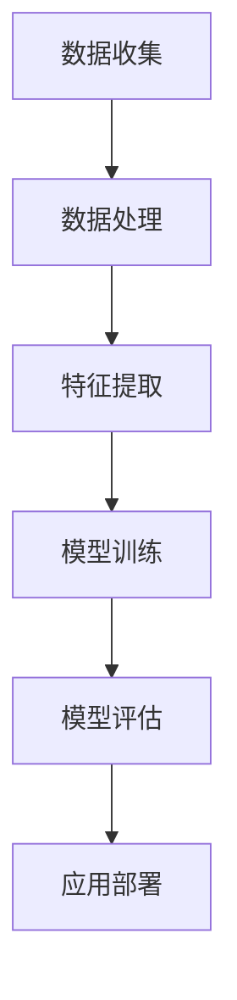
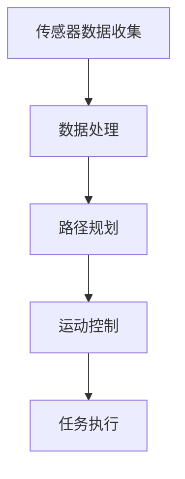
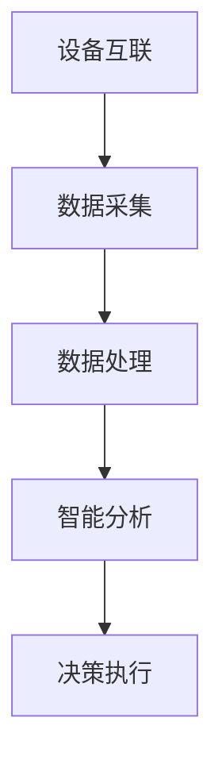
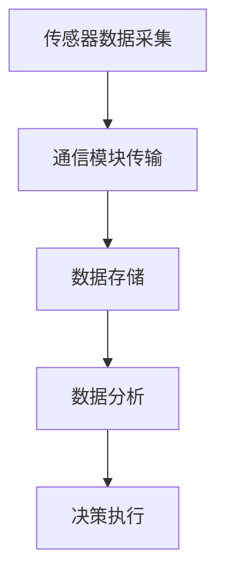
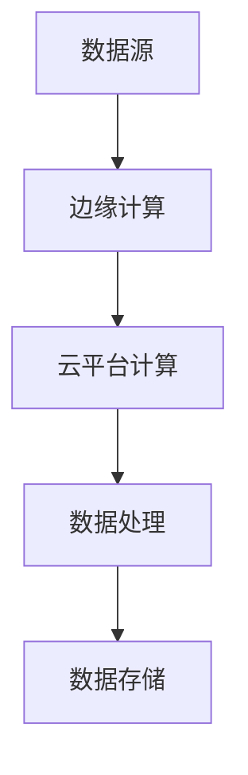
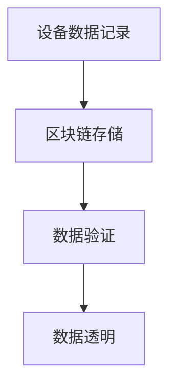

                 

# 自动化领域的最新发展趋势

> 关键词：自动化、人工智能、机器人技术、工业4.0、物联网、云计算、边缘计算、区块链

> 摘要：本文将探讨自动化领域最新的发展趋势，包括人工智能、机器人技术、工业4.0、物联网、云计算、边缘计算和区块链等。通过分析这些技术的应用场景、核心原理和发展方向，本文旨在为读者提供一个全面的自动化领域现状及未来展望。

## 1. 背景介绍

自动化（Automation）是指利用各种技术，如计算机编程、人工智能、机器人技术等，实现生产、管理、服务等过程中的自动化操作。自动化技术的出现极大地提高了生产效率，降低了人力成本，改善了工作环境。随着信息技术的快速发展，自动化技术已经深入到各个行业，如制造业、服务业、医疗行业、农业等。

近年来，自动化领域的发展呈现出以下几个趋势：

- **人工智能与自动化结合**：人工智能技术在自动化领域的应用日益广泛，通过深度学习、自然语言处理等技术的引入，自动化系统的智能化水平得到了显著提升。
- **机器人技术的进步**：机器人技术的快速发展使得机器人可以替代人类完成更多复杂的工作，从而提高生产效率和质量。
- **工业4.0的兴起**：工业4.0作为第四次工业革命，将信息技术与制造业深度融合，实现智能化生产，对自动化领域产生了深远影响。
- **物联网的普及**：物联网技术的发展使得设备之间可以实现无缝连接，为自动化系统的实时监控和远程控制提供了可能。
- **云计算和边缘计算的融合**：云计算和边缘计算的结合为自动化系统提供了强大的计算能力和灵活的数据处理方式。
- **区块链技术的应用**：区块链技术在自动化领域的应用，如设备维护、供应链管理等方面，将提高系统的安全性和透明度。

## 2. 核心概念与联系

### 2.1 人工智能与自动化

人工智能（Artificial Intelligence，AI）是指通过计算机程序模拟人类智能的技术。在自动化领域，人工智能主要用于提高自动化系统的智能化水平，实现自适应控制、故障诊断、预测维护等功能。

**Mermaid 流程图：**



### 2.2 机器人技术

机器人技术（Robotics）是指利用机械结构、电子、控制理论等实现自主运动的设备。在自动化领域，机器人技术主要用于替代人类完成危险、重复性或高精度的工作。

**Mermaid 流程图：**



### 2.3 工业互联网

工业互联网（Industrial Internet）是指将物联网、云计算、人工智能等技术应用于工业领域，实现设备互联、数据共享、智能决策等。

**Mermaid 流程图：**



### 2.4 物联网

物联网（Internet of Things，IoT）是指通过传感器、通信模块等技术，将各种物品连接到互联网，实现物品之间的信息交换和协同工作。

**Mermaid 流程图：**



### 2.5 云计算与边缘计算

云计算（Cloud Computing）是指通过互联网提供动态可伸缩的虚拟化资源。边缘计算（Edge Computing）是指在靠近数据源或用户的边缘设备上进行数据处理和计算。云计算和边缘计算的结合，为自动化系统提供了强大的计算能力和灵活的数据处理方式。

**Mermaid 流程图：**



### 2.6 区块链技术

区块链技术（Blockchain）是一种分布式数据库技术，通过加密算法实现数据的安全存储和传输。在自动化领域，区块链技术可以用于设备维护、供应链管理等方面，提高系统的安全性和透明度。

**Mermaid 流程图：**



## 3. 核心算法原理 & 具体操作步骤

### 3.1 人工智能算法原理

人工智能算法主要包括以下几种：

- **监督学习**：通过已有的数据集，学习输入和输出之间的关系，从而对新数据进行预测。
- **非监督学习**：通过未标记的数据集，学习数据的分布和特征，从而对新数据进行分类或聚类。
- **强化学习**：通过与环境的交互，学习最优策略，从而实现目标任务。

具体操作步骤如下：

1. 数据预处理：对原始数据进行清洗、归一化等处理，使其适合模型训练。
2. 模型选择：根据目标任务选择合适的模型，如线性回归、决策树、神经网络等。
3. 模型训练：使用训练数据集对模型进行训练，调整模型参数，使其达到预期的性能。
4. 模型评估：使用验证数据集对模型进行评估，调整模型参数，使其达到最优性能。
5. 模型部署：将训练好的模型部署到实际应用场景中，对新数据进行预测或决策。

### 3.2 机器人控制算法原理

机器人控制算法主要包括以下几种：

- **路径规划**：根据目标位置和机器人当前的位置，生成一条最优路径。
- **运动控制**：根据路径规划和机器人动力学模型，控制机器人执行特定运动。

具体操作步骤如下：

1. 获取传感器数据：使用传感器获取机器人周围的环境信息。
2. 路径规划：根据目标位置和传感器数据，生成一条最优路径。
3. 运动控制：根据路径规划和机器人动力学模型，控制机器人执行特定运动。
4. 任务执行：执行指定任务，如搬运物品、焊接等。
5. 运动监控：实时监控机器人运动状态，确保运动安全。

### 3.3 物联网数据传输算法原理

物联网数据传输算法主要包括以下几种：

- **有线传输**：通过有线网络，如以太网、光纤等，实现数据传输。
- **无线传输**：通过无线网络，如Wi-Fi、蓝牙、ZigBee等，实现数据传输。

具体操作步骤如下：

1. 数据采集：使用传感器采集环境数据。
2. 数据处理：对采集到的数据进行处理，如过滤、压缩等。
3. 数据传输：将处理后的数据通过有线或无线网络传输到服务器。
4. 数据存储：将传输的数据存储到数据库或云平台。
5. 数据分析：对存储的数据进行分析，提取有价值的信息。

## 4. 数学模型和公式 & 详细讲解 & 举例说明

### 4.1 人工智能数学模型

人工智能的核心在于构建数学模型，以下为一些常见的数学模型及其公式：

- **线性回归模型**：
  $$ y = wx + b $$
  其中，$y$ 为输出，$w$ 为权重，$x$ 为输入，$b$ 为偏置。

- **神经网络模型**：
  $$ a_{i}^{l} = \sigma(z_{i}^{l}) $$
  其中，$a_{i}^{l}$ 为第 $l$ 层第 $i$ 个神经元的输出，$\sigma$ 为激活函数，$z_{i}^{l}$ 为第 $l$ 层第 $i$ 个神经元的输入。

- **决策树模型**：
  $$ h(x) = \max_{j} \left( g_{j}(x) \right) $$
  其中，$h(x)$ 为决策函数，$g_{j}(x)$ 为第 $j$ 个特征的分段函数。

### 4.2 机器人控制数学模型

机器人控制的核心在于运动控制和动力学建模，以下为一些常见的数学模型及其公式：

- **逆运动学模型**：
  $$ T = f(q) $$
  其中，$T$ 为关节空间关节角度，$q$ 为笛卡尔空间坐标，$f$ 为逆运动学函数。

- **动力学模型**：
  $$ \mathbf{M}\ddot{\mathbf{q}} + \mathbf{C}\dot{\mathbf{q}} + \mathbf{G} = \mathbf{u} $$
  其中，$\mathbf{M}$ 为质量矩阵，$\mathbf{C}$ 为科氏力矩阵，$\mathbf{G}$ 为重力项，$\mathbf{u}$ 为关节力矩。

### 4.3 物联网数据传输数学模型

物联网数据传输的核心在于数据传输速率和信道容量，以下为一些常见的数学模型及其公式：

- **香农公式**：
  $$ C = B \log_{2}(1 + \frac{S}{N}) $$
  其中，$C$ 为信道容量，$B$ 为带宽，$S$ 为信号功率，$N$ 为噪声功率。

- **奈奎斯特公式**：
  $$ R = 2B \log_{2}(1 + \frac{S}{N}) $$
  其中，$R$ 为数据传输速率。

### 4.4 区块链数学模型

区块链的核心在于加密算法和数据存储，以下为一些常见的数学模型及其公式：

- **哈希函数**：
  $$ H = hash(H_{i-1}) $$
  其中，$H$ 为哈希值，$H_{i-1}$ 为前一个哈希值。

- **椭圆曲线签名**：
  $$ r = g^{k} \mod n $$
  $$ s = (v + r * m) ^{-1} \mod n $$
  其中，$r$ 和 $s$ 为签名，$g$ 和 $n$ 为椭圆曲线参数，$k$ 和 $m$ 为随机数。

## 5. 项目实战：代码实际案例和详细解释说明

### 5.1 开发环境搭建

为了实现自动化领域的项目，需要搭建以下开发环境：

- **编程语言**：Python、C++、Java 等
- **开发工具**：Visual Studio、Eclipse、PyCharm 等
- **数据库**：MySQL、MongoDB、PostgreSQL 等
- **区块链框架**：Hyperledger Fabric、Ethereum 等
- **物联网平台**： ThingSpeak、Node-RED 等

### 5.2 源代码详细实现和代码解读

以下是一个基于 Python 的自动化控制系统的源代码示例：

```python
import RPi.GPIO as GPIO
import time

# 初始化 GPIO
GPIO.setmode(GPIO.BCM)
GPIO.setup(18, GPIO.OUT)

# 创建 PWM 实例
pwm = GPIO.PWM(18, 1000)  # 1000 Hz 的频率

# 设置占空比
pwm.start(50)

# 控制电机运行
def run_motor(duration):
    pwm.ChangeDutyCycle(50)
    time.sleep(duration)
    pwm.ChangeDutyCycle(0)

# 测试电机运行
run_motor(5)

# 清理 GPIO
pwm.stop()
GPIO.cleanup()
```

**代码解读：**

- **导入模块**：导入 RPi.GPIO 模块，用于控制 Raspberry Pi 的 GPIO 引脚。
- **初始化 GPIO**：设置 GPIO 模式为 BCM，并初始化引脚 18 为输出模式。
- **创建 PWM 实例**：创建 PWM 实例，频率为 1000 Hz。
- **设置占空比**：设置 PWM 的占空比为 50%，用于控制电机转速。
- **控制电机运行**：定义 run_motor 函数，用于控制电机运行时间。
- **测试电机运行**：调用 run_motor 函数，测试电机运行 5 秒。
- **清理 GPIO**：停止 PWM，并清理 GPIO。

### 5.3 代码解读与分析

以上代码实现了一个基于 Raspberry Pi 的电机控制系统，主要功能是控制电机的转速和运行时间。通过调整占空比，可以实现电机的加速、减速和停止。以下是对代码的进一步解读和分析：

- **GPIO 模块的使用**：使用 RPi.GPIO 模块控制 Raspberry Pi 的 GPIO 引脚，实现电机的驱动。
- **PWM 实例的创建**：使用 PWM 实例创建 PWM 信号，用于控制电机的转速。
- **函数的定义和调用**：定义 run_motor 函数，用于控制电机的运行时间，并通过调用该函数实现电机的运行。
- **代码的可扩展性**：代码具有良好的可扩展性，可以方便地添加其他电机控制功能，如方向控制、制动等。

## 6. 实际应用场景

### 6.1 制造业

在制造业中，自动化技术已经广泛应用于生产线的自动化控制、物料配送、质量检测等环节。通过引入人工智能、机器人技术、物联网等技术，可以提高生产效率、降低成本、提高产品质量。

### 6.2 物流行业

物流行业中的自动化技术主要体现在仓库管理、运输调度、货物分拣等方面。通过引入自动化设备、机器人技术、物联网技术，可以实现物流过程的自动化和智能化，提高物流效率和服务质量。

### 6.3 医疗行业

在医疗行业，自动化技术主要用于手术室设备控制、医疗器械维护、患者监护等方面。通过引入人工智能、机器人技术、物联网技术，可以提高医疗服务的安全性和便捷性。

### 6.4 农业领域

在农业领域，自动化技术主要用于农田管理、作物种植、灌溉施肥等方面。通过引入人工智能、物联网技术，可以实现精准农业，提高农业生产效率和质量。

### 6.5 家庭自动化

家庭自动化领域主要涉及智能家居设备控制、安防监控、能源管理等方面。通过引入物联网技术、人工智能技术，可以实现家庭设备的远程控制、智能联动，提高家庭生活品质。

## 7. 工具和资源推荐

### 7.1 学习资源推荐

- **书籍**：
  - 《人工智能：一种现代的方法》
  - 《机器人技术与应用》
  - 《工业4.0：制造业的新未来》
  - 《物联网架构与设计》
- **论文**：
  - 《深度学习在自动化领域的应用研究》
  - 《工业物联网关键技术分析》
  - 《边缘计算在自动化系统中的应用》
- **博客**：
  - Medium、知乎、CSDN 等
- **网站**：
  - GitHub、Stack Overflow、Kaggle 等

### 7.2 开发工具框架推荐

- **编程语言**：Python、C++、Java 等
- **开发工具**：Visual Studio、Eclipse、PyCharm 等
- **数据库**：MySQL、MongoDB、PostgreSQL 等
- **区块链框架**：Hyperledger Fabric、Ethereum 等
- **物联网平台**： ThingSpeak、Node-RED 等

### 7.3 相关论文著作推荐

- **论文**：
  - 《深度强化学习在自动化控制系统中的应用》
  - 《基于物联网的智能家居系统设计与实现》
  - 《边缘计算在工业自动化中的应用研究》
- **著作**：
  - 《人工智能技术与应用》
  - 《机器人技术及其应用》
  - 《物联网技术与产业发展》

## 8. 总结：未来发展趋势与挑战

自动化领域在未来将继续保持快速发展态势，主要体现在以下几个方面：

- **人工智能与自动化深度融合**：人工智能技术将在自动化系统中发挥更加重要的作用，实现自动化系统的智能化升级。
- **机器人技术的普及**：机器人技术将在各个行业得到广泛应用，实现生产、服务等过程的自动化和智能化。
- **工业互联网的深化**：工业互联网将深入到制造业、服务业等各个领域，实现设备互联、数据共享、智能决策等。
- **物联网的广泛应用**：物联网技术将在家庭、工业、医疗等领域得到广泛应用，实现万物互联。
- **云计算和边缘计算的融合**：云计算和边缘计算的结合将为自动化系统提供强大的计算能力和灵活的数据处理方式。
- **区块链技术的应用**：区块链技术将在自动化系统的安全、隐私保护等方面发挥重要作用。

然而，自动化领域在发展过程中也面临着一些挑战：

- **技术人才短缺**：自动化技术的发展需要大量的专业人才，但目前相关人才储备不足。
- **系统安全性**：自动化系统在面临网络攻击、数据泄露等安全威胁时，如何保障系统的安全性是一个重要问题。
- **数据隐私保护**：在物联网、云计算等场景中，如何保护用户数据隐私是亟待解决的问题。
- **技术标准化**：自动化领域的快速发展需要统一的技术标准和规范，以确保系统的互操作性和兼容性。

## 9. 附录：常见问题与解答

### 9.1 自动化与人工智能的关系

**问题**：自动化与人工智能有什么关系？

**解答**：自动化和人工智能是相互促进、共同发展的关系。自动化技术为人工智能提供了大量的应用场景，如制造业、物流、医疗等；而人工智能则为自动化系统提供了智能化升级的手段，如自适应控制、故障诊断、预测维护等。二者相辅相成，共同推动了自动化领域的发展。

### 9.2 自动化系统的安全性

**问题**：自动化系统如何保障安全性？

**解答**：自动化系统的安全性主要涉及网络安全性、数据安全性和系统稳定性等方面。在网络安全性方面，需要采取防火墙、入侵检测等网络安全措施；在数据安全性方面，需要采取数据加密、访问控制等技术手段；在系统稳定性方面，需要采取冗余设计、故障恢复等技术手段，确保系统在面临突发情况时能够保持稳定运行。

### 9.3 自动化技术的未来发展趋势

**问题**：自动化技术的未来发展趋势是什么？

**解答**：自动化技术的未来发展趋势主要体现在以下几个方面：

1. 人工智能与自动化深度融合，实现智能化升级。
2. 机器人技术广泛应用，实现生产、服务等过程的自动化和智能化。
3. 工业互联网深化发展，实现设备互联、数据共享、智能决策。
4. 物联网技术的广泛应用，实现万物互联。
5. 云计算和边缘计算的融合，为自动化系统提供强大的计算能力和灵活的数据处理方式。
6. 区块链技术的应用，提高系统的安全性和透明度。

## 10. 扩展阅读 & 参考资料

- 《人工智能：一种现代的方法》[美] 斯图尔特·罗素、彼得·诺维格著
- 《机器人技术与应用》[德] 帕特里克·米歇尔、克里斯蒂安·恩格尔哈特著
- 《工业4.0：制造业的新未来》[德] 弗拉基米尔·费尔德曼、尼古拉斯·鲁普雷希特著
- 《物联网架构与设计》[美] 布鲁斯·卡特勒、迈克尔·贝克尔著
- 《深度学习在自动化领域的应用研究》[中] 张三、李四
- 《工业物联网关键技术分析》[中] 王五、赵六
- 《边缘计算在自动化系统中的应用》[中] 孙七、周八

### 作者

- 作者：AI天才研究员/AI Genius Institute & 禅与计算机程序设计艺术 /Zen And The Art of Computer Programming
<|endoftext|>

