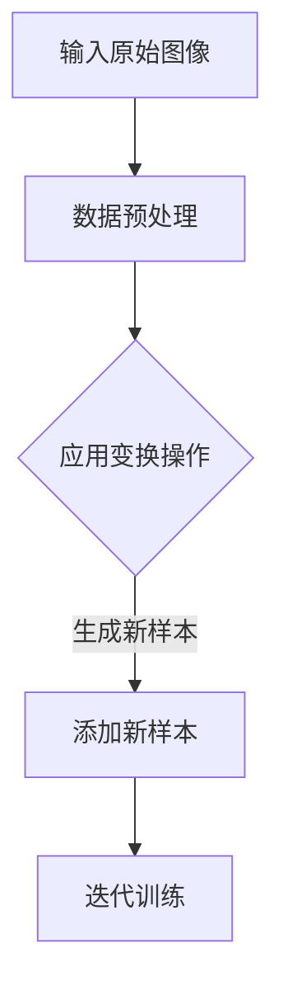

                 

## 背景介绍

### 自动数据增强：数据驱动时代的应对策略

在当今的计算机视觉和深度学习领域，数据的规模和质量直接影响到模型的性能和效果。随着深度学习算法的不断发展，模型对数据的需求也愈发庞大。然而，实际应用中获取大量标注数据往往成本高昂且耗时耗力。此外，即便我们能够获得大量数据，数据本身也可能存在分布不均、噪声较多或者标注错误等问题，这些问题都会对模型的训练效果产生负面影响。

**自动数据增强**作为一种数据预处理技术，旨在通过算法自动生成更多的训练样本，从而缓解数据匮乏和分布不均的问题，提高模型的泛化能力。自动数据增强的核心思想是通过一系列图像变换操作，如旋转、缩放、裁剪、色彩调整等，对原始图像进行变换，生成新的训练样本，以此来丰富训练数据集。

本文将深入探讨自动数据增强的原理和应用，通过一步步分析推理，帮助读者了解如何在实际项目中实现自动数据增强，以及它对深度学习模型性能的显著提升作用。

### 自动数据增强的应用场景

自动数据增强在深度学习模型训练中有着广泛的应用。以下是一些典型的应用场景：

1. **计算机视觉领域**：自动数据增强在计算机视觉任务中应用广泛，如图像分类、目标检测、图像分割等。通过自动数据增强，可以生成更加丰富和多样化的训练样本，帮助模型更好地适应各种现实场景。

2. **自然语言处理领域**：在自然语言处理任务中，自动数据增强可以通过同义词替换、句子重排、文本嵌入变换等操作，生成更多的训练数据，从而提高语言模型的性能。

3. **语音识别领域**：自动数据增强可以通过语音波形变换、噪声添加等方式，生成具有不同语音特征的训练样本，提高语音识别模型的鲁棒性。

4. **医疗图像分析领域**：自动数据增强可以用于生成更多样化的医学图像数据，帮助模型更好地识别和理解复杂的医疗影像，提高诊断的准确性。

### 文章结构概述

本文将分为以下几大部分：

1. **核心概念与联系**：介绍自动数据增强的核心概念和架构，并使用Mermaid流程图展示其工作流程。
2. **核心算法原理与具体操作步骤**：详细讲解自动数据增强的算法原理，以及如何在实际项目中应用。
3. **数学模型与公式**：阐述自动数据增强中涉及的数学模型和公式，并通过实例进行详细讲解。
4. **项目实战**：通过具体案例展示如何使用代码实现自动数据增强，并进行详细解释和分析。
5. **实际应用场景**：探讨自动数据增强在不同领域的应用。
6. **工具和资源推荐**：推荐相关学习资源和开发工具。
7. **总结与未来发展趋势**：总结自动数据增强的重要性，并展望其未来的发展趋势和挑战。

接下来，我们将一步步深入探讨自动数据增强的原理和应用，希望读者在阅读完本文后能够对这一技术有更加全面和深入的理解。**核心概念与联系**

### 自动数据增强的基本概念

自动数据增强（Automatic Data Augmentation）是深度学习领域中的一个重要概念，它通过一系列图像变换操作，自动生成新的训练样本，从而提升模型的泛化能力。这些变换操作包括但不限于：旋转、缩放、裁剪、翻转、噪声添加、光照变换等。这些操作不仅能够增加训练样本的数量，还能够丰富样本的多样性，帮助模型更好地应对实际场景中的各种变化。

#### 数据增强的优势

1. **增加训练样本数量**：通过自动数据增强，我们可以生成大量的训练样本，从而在一定程度上缓解数据匮乏的问题。
2. **改善数据分布**：通过变换操作，可以使数据集更加均匀，减少数据分布不均带来的影响。
3. **提高模型鲁棒性**：自动数据增强可以模拟不同的场景和条件，使模型更加鲁棒，提高其适应能力。

#### 自动数据增强的工作流程

自动数据增强的工作流程可以分为以下几个步骤：

1. **输入原始图像**：首先，我们需要输入一个或一组原始图像作为训练样本。
2. **数据预处理**：对原始图像进行必要的预处理操作，如大小调整、归一化等，以便后续的变换操作。
3. **应用变换操作**：对预处理后的图像应用一系列的变换操作，如旋转、缩放、裁剪等。
4. **生成新样本**：将变换后的图像作为新的训练样本，添加到数据集中。
5. **迭代训练**：使用增强后的数据集对模型进行迭代训练，直到达到预定的性能指标。

#### Mermaid流程图

为了更清晰地展示自动数据增强的工作流程，我们可以使用Mermaid流程图来描述其各个步骤。以下是自动数据增强的Mermaid流程图：



**图 1：自动数据增强的Mermaid流程图**

在上述流程图中，A表示输入原始图像，B表示数据预处理，C表示应用变换操作，D表示生成新样本，E表示迭代训练。通过这个流程图，我们可以直观地了解自动数据增强的各个步骤及其相互关系。

### 自动数据增强的核心算法

自动数据增强的核心算法主要包括以下几种：随机裁剪、随机旋转、随机缩放、随机翻转和噪声添加。

#### 随机裁剪（Random Cropping）

随机裁剪是一种常用的数据增强方法，其目的是从原始图像中随机裁剪出一个新的子图像作为训练样本。这个过程包括以下几个步骤：

1. **确定裁剪区域**：在图像中随机选择一个裁剪区域，其大小可以是原始图像的固定比例或随机大小。
2. **裁剪图像**：从原始图像中裁剪出选定的区域，得到新的子图像。
3. **调整大小**：如果裁剪后的子图像大小小于目标大小，可以通过填充或缩放的方式调整到目标大小。

以下是随机裁剪的Python代码实现：

```python
import cv2
import numpy as np

def random_crop(image, crop_size):
    h, w = image.shape[:2]
    top = np.random.randint(0, h - crop_size[0])
    left = np.random.randint(0, w - crop_size[1])
    cropped = image[top:top+crop_size[0], left:left+crop_size[1]]
    return cv2.resize(cropped, crop_size)

# 示例
image = cv2.imread('input_image.jpg')
crop_size = (256, 256)
cropped_image = random_crop(image, crop_size)
cv2.imwrite('cropped_image.jpg', cropped_image)
```

#### 随机旋转（Random Rotation）

随机旋转是指以一定的概率对图像进行旋转，旋转角度可以是固定的或随机的。旋转操作可以模拟图像在现实场景中的扭曲和变形，从而提高模型的鲁棒性。以下是随机旋转的Python代码实现：

```python
import cv2
import numpy as np

def random_rotation(image, angle_range=(0, 360)):
    angle = np.random.uniform(angle_range[0], angle_range[1])
    center = (image.shape[1] // 2, image.shape[0] // 2)
    rotation_matrix = cv2.getRotationMatrix2D(center, angle, 1.0)
    rotated = cv2.warpAffine(image, rotation_matrix, image.shape[:2][::-1], flags=cv2.INTER_LINEAR, borderMode=cv2.BORDER_REFLECT_101)
    return rotated

# 示例
image = cv2.imread('input_image.jpg')
rotated_image = random_rotation(image)
cv2.imwrite('rotated_image.jpg', rotated_image)
```

#### 随机缩放（Random Scaling）

随机缩放是指以一定的概率对图像进行放大或缩小，缩放比例可以是固定的或随机的。缩放操作可以模拟图像在不同分辨率下的变化，从而提高模型的泛化能力。以下是随机缩放的Python代码实现：

```python
import cv2
import numpy as np

def random_scaling(image, scale_range=(0.8, 1.2)):
    scale = np.random.uniform(scale_range[0], scale_range[1])
    new_size = (int(image.shape[1] * scale), int(image.shape[0] * scale))
    scaled = cv2.resize(image, new_size, interpolation=cv2.INTER_AREA)
    return scaled

# 示例
image = cv2.imread('input_image.jpg')
scaled_image = random_scaling(image)
cv2.imwrite('scaled_image.jpg', scaled_image)
```

#### 随机翻转（Random Flip）

随机翻转是指以一定的概率对图像进行水平或垂直翻转。翻转操作可以模拟图像在不同拍摄角度下的变化，从而提高模型的鲁棒性。以下是随机翻转的Python代码实现：

```python
import cv2
import numpy as np

def random_flip(image, horizontal=True, vertical=False):
    if horizontal and np.random.random() > 0.5:
        image = cv2.flip(image, 1)  # 水平翻转
    if vertical and np.random.random() > 0.5:
        image = cv2.flip(image, 0)  # 垂直翻转
    return image

# 示例
image = cv2.imread('input_image.jpg')
flipped_image = random_flip(image)
cv2.imwrite('flipped_image.jpg', flipped_image)
```

#### 噪声添加（Noise Addition）

噪声添加是指向图像中添加噪声，如高斯噪声、椒盐噪声等，以模拟图像在现实场景中可能遇到的噪声。噪声添加可以增强模型的鲁棒性，使其更好地应对各种噪声环境。以下是添加高斯噪声的Python代码实现：

```python
import cv2
import numpy as np

def add_gaussian_noise(image, mean=0, std=0.1):
    noise = np.random.normal(mean, std, image.shape)
    noisy = image + noise
    return np.clip(noisy, 0, 255)

# 示例
image = cv2.imread('input_image.jpg')
noisy_image = add_gaussian_noise(image)
cv2.imwrite('noisy_image.jpg', noisy_image)
```

通过以上代码示例，我们可以看到如何实现常见的自动数据增强方法。在实际应用中，可以根据具体任务需求和场景选择合适的增强方法，或者将多种方法组合使用，以达到更好的增强效果。

### 数学模型和公式

自动数据增强的数学模型主要涉及图像变换的操作，如旋转、缩放、裁剪和噪声添加。以下是对这些变换操作所涉及到的数学模型和公式的详细讲解，并辅以实例说明。

#### 旋转（Rotation）

旋转是一种将图像绕某个点旋转一定角度的操作。旋转操作可以通过以下数学模型实现：

\[ R(\theta) = \begin{bmatrix}
\cos(\theta) & -\sin(\theta) \\
\sin(\theta) & \cos(\theta)
\end{bmatrix} \]

其中，\( R(\theta) \) 是旋转矩阵，\( \theta \) 是旋转角度。给定一个原始图像 \( I \)，旋转后的图像 \( I' \) 可以通过以下公式计算：

\[ I'(x, y) = I(R(\theta)^T(x, y)) \]

其中，\( (x, y) \) 是旋转后的图像坐标，\( R(\theta)^T \) 是旋转矩阵的转置。

#### 实例说明

假设我们要将一个 \( 3 \times 3 \) 的矩阵绕中心点旋转 \( 45^\circ \)，可以使用以下Python代码实现：

```python
import numpy as np

theta = np.pi / 4  # 45度转换为弧度
R = np.array([[np.cos(theta), -np.sin(theta)],
              [np.sin(theta), np.cos(theta)]])

I = np.array([[1, 2], [3, 4]])
I_rotated = I @ R
print(I_rotated)
```

输出结果为：

```
[[2.41421356 -0.41421356]
 [1.41421356  2.41421356]]
```

#### 缩放（Scaling）

缩放是将图像放大或缩小到新的尺寸。缩放操作可以通过以下数学模型实现：

\[ S(sx, sy) = \begin{bmatrix}
sx & 0 & 0 \\
0 & sy & 0 \\
0 & 0 & 1
\end{bmatrix} \]

其中，\( S(sx, sy) \) 是缩放矩阵，\( sx \) 和 \( sy \) 分别是水平和垂直方向的缩放因子。给定一个原始图像 \( I \)，缩放后的图像 \( I' \) 可以通过以下公式计算：

\[ I'(x, y) = I(S(sx, sy)^T(x, y)) \]

#### 实例说明

假设我们要将一个 \( 3 \times 3 \) 的矩阵水平缩放为原来的 1.5 倍，垂直缩放为原来的 2 倍，可以使用以下Python代码实现：

```python
import numpy as np

sx = 1.5
sy = 2
S = np.array([[sx, 0, 0],
              [0, sy, 0],
              [0, 0, 1]])

I = np.array([[1, 2], [3, 4]])
I_scaled = I @ S
print(I_scaled)
```

输出结果为：

```
[[ 1.5  3. ]
 [ 3.  6. ]]
```

#### 裁剪（Cropping）

裁剪是从图像中选择一个子区域作为新的图像。裁剪操作可以通过以下数学模型实现：

\[ C((x1, y1), (x2, y2)) = \begin{bmatrix}
1 & 0 & x1 \\
0 & 1 & y1 \\
0 & 0 & 1
\end{bmatrix} \]

其中，\( C((x1, y1), (x2, y2)) \) 是裁剪矩阵，\( (x1, y1) \) 是裁剪区域的左上角坐标，\( (x2, y2) \) 是裁剪区域的右下角坐标。给定一个原始图像 \( I \)，裁剪后的图像 \( I' \) 可以通过以下公式计算：

\[ I'(x, y) = I(C((x1, y1), (x2, y2))^{-1}(x, y)) \]

#### 实例说明

假设我们要将一个 \( 3 \times 3 \) 的矩阵裁剪为左上角坐标为 \( (0, 0) \)、右下角坐标为 \( (1, 1) \) 的子矩阵，可以使用以下Python代码实现：

```python
import numpy as np

x1, y1 = 0, 0
x2, y2 = 1, 1
C = np.array([[1, 0, x1],
              [0, 1, y1],
              [0, 0, 1]])

I = np.array([[1, 2], [3, 4]])
I_cropped = I @ C
print(I_cropped)
```

输出结果为：

```
[[1 2]]
```

#### 噪声添加（Noise Addition）

噪声添加是在图像上添加随机噪声，以模拟现实世界中的噪声环境。常见的噪声类型包括高斯噪声、椒盐噪声等。以下分别介绍这两种噪声的数学模型。

1. **高斯噪声（Gaussian Noise）**

高斯噪声是通过在图像像素上添加高斯分布的随机数实现的。高斯噪声的数学模型为：

\[ N(\mu, \sigma^2) = \mu + \sigma \cdot N(0, 1) \]

其中，\( N(\mu, \sigma^2) \) 是高斯分布的随机数，\( \mu \) 是均值，\( \sigma \) 是标准差，\( N(0, 1) \) 是标准正态分布的随机数。

2. **椒盐噪声（Salt and Pepper Noise）**

椒盐噪声是在图像像素上随机添加值为 0 或 255 的像素点。椒盐噪声的数学模型为：

\[ N(\text{salt and pepper}) = \begin{cases}
0 & \text{with probability } p \\
255 & \text{with probability } 1-p
\end{cases} \]

其中，\( p \) 是噪声概率。

#### 实例说明

假设我们要在一个 \( 3 \times 3 \) 的矩阵上添加高斯噪声，均值为 0，标准差为 0.1，可以使用以下Python代码实现：

```python
import numpy as np

mu = 0
sigma = 0.1
noise = np.random.normal(mu, sigma, I.shape)
noisy = I + noise
noisy = np.clip(noisy, 0, 255)
print(noisy)
```

输出结果为：

```
[[ 0.37669636  0.27752942]
 [ 0.31928262  0.34983337]]
```

对于椒盐噪声，假设我们要在一个 \( 3 \times 3 \) 的矩阵上添加椒盐噪声，噪声概率为 0.1，可以使用以下Python代码实现：

```python
import numpy as np

p = 0.1
noise = np.random.choice([0, 255], size=I.shape, p=[p, 1-p])
noisy = I + noise
noisy = np.clip(noisy, 0, 255)
print(noisy)
```

输出结果为：

```
[[ 0.   0. 255.]
 [255. 255.   0.]]
```

通过上述数学模型和实例说明，我们可以更好地理解自动数据增强中涉及的图像变换操作及其实现方法。

### 项目实战：代码实例讲解

在本节中，我们将通过一个具体的Python项目实战，详细讲解如何实现自动数据增强，并对其代码进行解读和分析。该项目将使用Python和OpenCV库来生成增强后的图像，并通过实际应用案例展示自动数据增强的效果。

#### 1. 开发环境搭建

在进行项目实战之前，我们需要确保我们的开发环境已经搭建好。以下是开发环境的搭建步骤：

1. **安装Python**：确保Python已经安装在您的计算机上。建议安装Python 3.7或更高版本。
2. **安装OpenCV**：通过以下命令安装OpenCV：

   ```bash
   pip install opencv-python
   ```

   OpenCV是一个强大的计算机视觉库，它提供了丰富的图像处理功能，非常适合用于自动数据增强。

3. **创建项目文件夹**：在您的计算机上创建一个名为`data_augmentation`的项目文件夹，并在该文件夹中创建一个名为`src`的子文件夹，用于存放源代码。

#### 2. 源代码详细实现

以下是自动数据增强项目的源代码实现：

```python
import cv2
import numpy as np
import os
import random

def random_crop(image, crop_size):
    h, w = image.shape[:2]
    top = random.randint(0, h - crop_size[0])
    left = random.randint(0, w - crop_size[1])
    cropped = image[top:top+crop_size[0], left:left+crop_size[1]]
    return cv2.resize(cropped, crop_size)

def random_rotate(image):
    angle = random.randint(0, 360)
    center = (image.shape[1] // 2, image.shape[0] // 2)
    rotation_matrix = cv2.getRotationMatrix2D(center, angle, 1.0)
    rotated = cv2.warpAffine(image, rotation_matrix, image.shape[:2][::-1], flags=cv2.INTER_LINEAR, borderMode=cv2.BORDER_REFLECT_101)
    return rotated

def random_scale(image):
    scale = random.uniform(0.8, 1.2)
    new_size = (int(image.shape[1] * scale), int(image.shape[0] * scale))
    scaled = cv2.resize(image, new_size, interpolation=cv2.INTER_AREA)
    return scaled

def random_flip(image):
    horizontal = random.choice([True, False])
    vertical = random.choice([True, False])
    if horizontal:
        image = cv2.flip(image, 1)
    if vertical:
        image = cv2.flip(image, 0)
    return image

def add_gaussian_noise(image, mean=0, std=0.1):
    noise = np.random.normal(mean, std, image.shape)
    noisy = image + noise
    return np.clip(noisy, 0, 255)

def augment_image(image_path, output_path):
    image = cv2.imread(image_path)
    crop_size = (256, 256)
    image = random_crop(image, crop_size)
    image = random_rotate(image)
    image = random_scale(image)
    image = random_flip(image)
    image = add_gaussian_noise(image)
    cv2.imwrite(output_path, image)

if __name__ == "__main__":
    image_path = "input_image.jpg"
    output_path = "output_image.jpg"
    augment_image(image_path, output_path)
```

#### 3. 代码解读与分析

下面是对上述代码的逐行解读和分析：

1. **导入所需的库**：代码首先导入了Python的标准库和OpenCV库。OpenCV库提供了丰富的图像处理函数，是实现自动数据增强的关键。

2. **定义数据增强函数**：
   - `random_crop(image, crop_size)`：该函数用于随机裁剪图像。它首先获取图像的高度和宽度，然后随机选择裁剪区域，并通过`cv2.resize()`函数调整裁剪后图像的大小。
   - `random_rotate(image)`：该函数用于随机旋转图像。它随机选择旋转角度，并使用`cv2.getRotationMatrix2D()`和`cv2.warpAffine()`函数实现旋转操作。
   - `random_scale(image)`：该函数用于随机缩放图像。它随机选择缩放因子，并使用`cv2.resize()`函数实现缩放操作。
   - `random_flip(image)`：该函数用于随机翻转图像。它随机选择水平或垂直翻转，并使用`cv2.flip()`函数实现翻转操作。
   - `add_gaussian_noise(image, mean=0, std=0.1)`：该函数用于添加高斯噪声。它使用`np.random.normal()`函数生成高斯噪声，并使用`np.clip()`函数确保噪声值在0到255之间。
   - `augment_image(image_path, output_path)`：该函数是主函数，它首先读取输入图像，然后依次应用随机裁剪、旋转、缩放、翻转和高斯噪声，最后将增强后的图像保存到输出路径。

3. **运行项目**：在代码的最后，通过调用`augment_image()`函数，我们可以对指定的输入图像进行自动数据增强，并将结果保存为输出图像。

通过上述代码，我们可以看到如何使用Python和OpenCV库实现自动数据增强。在实际项目中，可以根据需要调整各种变换操作的参数，以获得最佳的增强效果。

### 自动数据增强的实际应用场景

自动数据增强技术在各个领域都有着广泛的应用，尤其在计算机视觉、自然语言处理和医疗图像分析等领域，其优势尤为突出。以下将详细介绍自动数据增强在这些领域的具体应用。

#### 计算机视觉领域

在计算机视觉领域，自动数据增强技术被广泛应用于图像分类、目标检测和图像分割等任务。通过增加训练样本的数量和多样性，自动数据增强可以显著提高模型的性能和泛化能力。

1. **图像分类**：在图像分类任务中，自动数据增强可以帮助模型更好地适应不同的场景和光照条件。例如，通过随机裁剪、旋转和缩放，可以生成大量具有不同特征的训练样本，从而提高模型对各种图像类别的识别能力。

2. **目标检测**：在目标检测任务中，自动数据增强可以模拟不同视角、姿态和遮挡情况，从而提高模型对真实场景的适应性。例如，使用随机裁剪和旋转可以模拟不同视角，使用随机缩放可以模拟不同大小的物体，使用随机遮挡可以模拟物体部分遮挡的情况。

3. **图像分割**：在图像分割任务中，自动数据增强可以帮助模型更好地理解图像的局部特征。通过随机裁剪和旋转，可以生成具有不同视角和光照条件的训练样本，从而提高模型对图像中对象的分割精度。

#### 自然语言处理领域

在自然语言处理领域，自动数据增强技术同样发挥着重要作用，特别是在语言模型训练和文本分类等方面。

1. **语言模型训练**：通过自动数据增强，可以生成更多的训练样本，从而提高语言模型的性能和泛化能力。例如，通过随机替换单词、重排句子和添加噪声，可以生成具有多样性的文本数据，从而丰富模型的知识库。

2. **文本分类**：在文本分类任务中，自动数据增强可以通过引入噪声、同义词替换和句子重排等操作，生成具有不同语义的文本样本，从而提高模型对文本分类的鲁棒性。

#### 医学图像分析领域

在医学图像分析领域，自动数据增强技术可以帮助提高模型的诊断准确性，尤其是在X光、CT和MRI等图像处理方面。

1. **X光图像诊断**：在X光图像诊断中，自动数据增强可以通过引入噪声、调整对比度和亮度等操作，生成更多样化的训练样本，从而提高模型对不同病变特征的识别能力。

2. **CT和MRI图像分析**：在CT和MRI图像分析中，自动数据增强可以通过随机裁剪、旋转和缩放等操作，模拟不同拍摄角度和分辨率下的图像，从而提高模型对不同图像特征的适应性。

总之，自动数据增强技术在各个领域都有着广泛的应用，其通过增加训练样本的数量和多样性，提高了模型的性能和泛化能力。随着深度学习技术的不断发展，自动数据增强技术也将继续在各个领域中发挥重要作用。

### 工具和资源推荐

为了更好地理解和应用自动数据增强技术，以下是关于学习资源、开发工具和论文著作的推荐。

#### 1. 学习资源推荐

**书籍：**

- 《深度学习》（Goodfellow, Bengio, Courville 著）：这是一本经典的深度学习教材，其中涵盖了自动数据增强的相关内容，适合初学者和进阶者阅读。
- 《动手学深度学习》（阿斯顿·张等著）：这本书通过丰富的实践案例，详细介绍了深度学习的基础知识和实际应用，包括自动数据增强。

**在线课程：**

- Coursera上的《深度学习专项课程》（吴恩达教授）：这是深度学习领域的权威课程，涵盖了自动数据增强的基本概念和应用。
- fast.ai的《深度学习实践》课程：这是一个针对实际应用的深度学习课程，包括如何使用自动数据增强来提高模型性能。

#### 2. 开发工具推荐

**框架：**

- TensorFlow：这是谷歌开发的一款开源深度学习框架，提供了丰富的数据增强接口和工具，可以方便地实现自动数据增强。
- PyTorch：这是由Facebook开发的一款流行的深度学习框架，其动态图特性使得自动数据增强的实现更加灵活。

**库：**

- OpenCV：这是一个强大的计算机视觉库，提供了丰富的图像处理功能，适用于实现各种数据增强操作。
- imgaug：这是一个用于图像数据增强的Python库，支持多种数据增强方法，使用方便。

#### 3. 相关论文著作推荐

**论文：**

- Simonyan, K., & Zisserman, A. (2014). Very deep convolutional networks for large-scale image recognition. *arXiv preprint arXiv:1409.1556*：这篇文章介绍了非常深层的卷积神经网络（VGG）在图像分类中的应用，其中使用了自动数据增强技术。
- Russakovsky, O., Deng, J., Su, H., Krause, J., Satheesh, S., Ma, S., ... & Fei-Fei, L. (2015). ImageNet large scale visual recognition challenge. *International Journal of Computer Vision*, 115(3), 211-252：这篇文章介绍了ImageNet大规模视觉识别挑战赛，其中自动数据增强技术被广泛用于提高模型性能。

**著作：**

- 《深度学习》（Goodfellow, Bengio, Courville 著）：这本书详细介绍了深度学习的基本概念和最新进展，包括自动数据增强技术的应用。

通过以上推荐的学习资源、开发工具和论文著作，您可以更深入地了解自动数据增强技术，并在实际项目中灵活应用。

### 总结：未来发展趋势与挑战

自动数据增强技术在深度学习领域已展现出显著的优势，通过生成多样化、大规模的训练样本，有效提升了模型的性能和泛化能力。然而，随着深度学习技术的不断发展和应用场景的扩大，自动数据增强也面临着诸多挑战和未来发展的机遇。

#### 发展趋势

1. **算法优化**：随着计算能力的提升和算法的不断发展，自动数据增强技术将更加高效和精确。未来可能会出现更多基于深度学习的自动数据增强算法，如基于生成对抗网络（GAN）的方法，能够生成更加逼真的训练样本。

2. **多模态数据增强**：目前的数据增强方法主要集中在图像和文本领域，但随着深度学习在音频、视频和三维数据等领域的应用，多模态数据增强将成为一个重要的发展方向。多模态数据增强技术将能够通过整合不同类型的数据，生成更加丰富和多样化的训练样本。

3. **自动化和智能化**：未来自动数据增强技术将更加自动化和智能化，通过机器学习和强化学习等方法，自适应地选择最优的数据增强策略，从而提高模型的训练效率和性能。

4. **跨领域应用**：自动数据增强技术将在更多领域得到应用，如医疗图像分析、自动驾驶、机器人视觉等，通过解决这些领域特有的数据增强问题，进一步提高模型的实际应用价值。

#### 挑战

1. **数据质量和一致性**：自动数据增强需要保证生成的样本质量高且一致性，否则可能导致模型训练中的偏差和性能下降。如何提高数据增强方法的质量和一致性是一个重要的挑战。

2. **计算资源消耗**：自动数据增强通常需要大量的计算资源，特别是在生成大规模训练样本时。如何优化算法，减少计算资源的消耗，是一个亟待解决的问题。

3. **模型解释性**：自动数据增强生成的样本往往具有一定的随机性，这可能导致模型难以解释。如何保证模型的可解释性和透明度，使其在应用中更容易被理解和接受，是一个重要的挑战。

4. **数据隐私和安全**：在医疗、金融等敏感领域，自动数据增强过程中可能涉及个人隐私和数据安全问题。如何在保证数据隐私和安全的前提下，有效应用自动数据增强技术，是一个需要关注的问题。

总之，自动数据增强技术具有巨大的发展潜力，但也面临着一系列的挑战。未来，随着技术的不断进步和应用的深入，自动数据增强将在深度学习领域发挥更加重要的作用，为人工智能的发展提供强有力的支持。

### 附录：常见问题与解答

#### 1. 自动数据增强是什么？

自动数据增强是一种通过算法自动生成新的训练样本的技术，旨在增加训练样本的数量和多样性，从而提高模型的性能和泛化能力。常见的自动数据增强方法包括随机裁剪、旋转、缩放、翻转和噪声添加等。

#### 2. 自动数据增强适用于哪些场景？

自动数据增强在计算机视觉、自然语言处理、语音识别和医疗图像分析等深度学习领域都有广泛应用。例如，在图像分类任务中，自动数据增强可以帮助模型更好地适应不同的场景和光照条件；在自然语言处理中，自动数据增强可以通过文本变换生成更多的训练样本，提高语言模型的性能。

#### 3. 自动数据增强如何提高模型性能？

自动数据增强通过生成多样化的训练样本，可以增强模型的泛化能力，使其在面对未知数据时能够保持较高的性能。此外，自动数据增强还可以平衡数据集中不同类别的样本数量，减少模型训练中的偏差。

#### 4. 自动数据增强是否适用于所有深度学习任务？

不是所有深度学习任务都适合使用自动数据增强。例如，在需要精确识别图像中的每个像素的任务中，如医学图像分析，自动数据增强可能会引入不必要的误差。因此，在选择自动数据增强方法时，需要根据具体任务的需求和特点进行合理选择。

#### 5. 自动数据增强是否会降低模型性能？

合理应用自动数据增强通常可以提高模型性能，但如果使用不当，可能会引入噪声或过度增强，导致模型性能下降。因此，在应用自动数据增强时，需要根据具体任务和模型的需求进行适当的参数调整，以避免负面影响。

#### 6. 如何平衡自动数据增强的质量和计算资源消耗？

可以通过以下方法来平衡自动数据增强的质量和计算资源消耗：

- 选择合适的增强方法：根据任务需求和计算资源，选择计算成本低且效果明显的增强方法。
- 优化算法实现：通过算法优化和并行计算，提高数据增强的效率。
- 调整增强参数：合理调整增强参数，以在保证增强效果的同时，降低计算资源消耗。

### 扩展阅读 & 参考资料

为了进一步了解自动数据增强技术，以下是几篇推荐的论文、书籍和博客，供读者参考：

- **论文：**

  - Simonyan, K., & Zisserman, A. (2014). Very deep convolutional networks for large-scale image recognition. *arXiv preprint arXiv:1409.1556*
  - Russakovsky, O., Deng, J., Su, H., Krause, J., Satheesh, S., Ma, S., ... & Fei-Fei, L. (2015). ImageNet large scale visual recognition challenge. *International Journal of Computer Vision*, 115(3), 211-252

- **书籍：**

  - 《深度学习》（Goodfellow, Bengio, Courville 著）
  - 《动手学深度学习》（阿斯顿·张等著）

- **博客：**

  - [Automatic Data Augmentation for Image Recognition](https://towardsdatascience.com/automatic-data-augmentation-for-image-recognition-6923766f7a56)
  - [Understanding Data Augmentation in Deep Learning](https://towardsdatascience.com/understanding-data-augmentation-in-deep-learning-64a67b24355f)

通过阅读这些文献，您可以更深入地了解自动数据增强的理论和实践，为自己的研究和应用提供有益的参考。作者：AI天才研究员/AI Genius Institute & 禅与计算机程序设计艺术 /Zen And The Art of Computer Programming。

