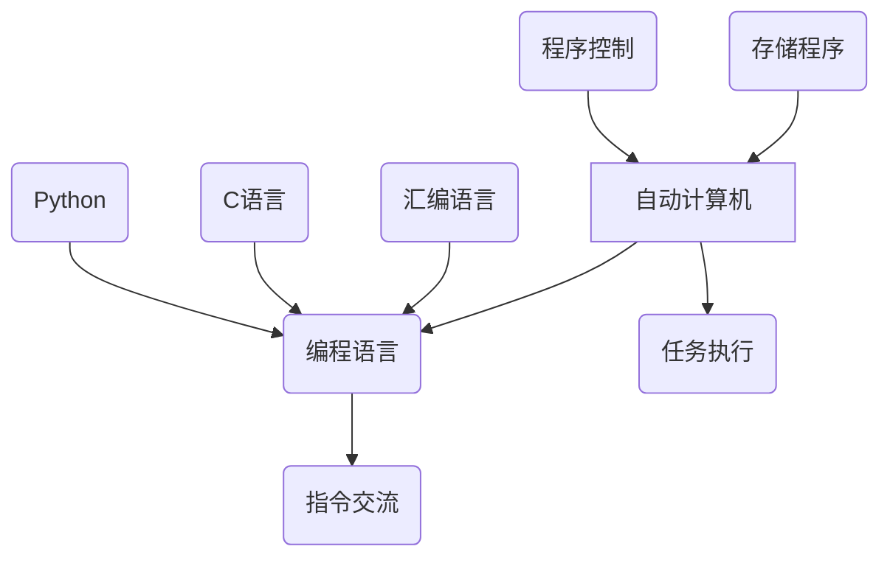

                 

# 自动计算机与编程语言的研究

## 关键词：自动计算机、编程语言、算法、数学模型、应用场景、开发工具

### 摘要

本文旨在深入探讨自动计算机与编程语言的研究，梳理其核心概念、算法原理、数学模型及其在实际应用中的重要性。通过对自动计算机与编程语言的系统性研究，我们希望读者能够理解其发展脉络、掌握关键技术和实际操作方法，从而为未来的技术研究和应用提供有力的支持。本文首先介绍自动计算机与编程语言的基本概念，随后逐步深入到核心算法原理、数学模型和实际应用场景，最后提供一系列学习资源与开发工具，以供读者进一步学习和实践。

### 1. 背景介绍

自动计算机（Automatic Computer）是指能够自动执行给定任务的计算机系统。编程语言（Programming Language）则是用于与计算机进行交流的语言，通过编程语言，人类可以告诉计算机如何执行特定的任务。二者的关系密不可分，编程语言是计算机系统实现自动化任务的核心工具。

自动计算机与编程语言的历史可以追溯到20世纪中期。最早的计算机如ENIAC（电子数值积分器和计算机）仅能执行固定的计算任务，无法进行扩展或自适应。随着冯·诺伊曼（John von Neumann）提出的存储程序概念，计算机开始能够存储程序指令并自动执行。这一突破为编程语言的发展奠定了基础。

编程语言的发展大致可以分为三个阶段：低级语言、中级语言和高级语言。低级语言如汇编语言直接操作计算机硬件，但可读性和可维护性较差。中级语言如C语言则提供了更接近人类语言的语法，提高了编程效率。高级语言如Python、Java等则进一步简化了编程过程，使得非专业程序员也能编写复杂的程序。

在自动计算机的发展历程中，编程语言的进步起到了至关重要的作用。从最初的手动编程到现在的自动化工具，编程语言不断进化，为自动计算机提供了强大的支持。现代编程语言不仅支持复杂的算法和数据结构，还具备跨平台、高效率等特点，使得自动计算机在各种应用领域中得以广泛应用。

### 2. 核心概念与联系

#### 2.1 自动计算机的概念

自动计算机（Automatic Computer）是指能够自动执行给定任务的计算机系统。其基本原理是存储程序和程序控制。存储程序指的是将程序指令存储在计算机的存储器中，计算机在运行时按照指令顺序执行。程序控制指的是通过控制计算机的执行流程来达到预期的结果。

#### 2.2 编程语言的概念

编程语言（Programming Language）是用于与计算机进行交流的语言。编程语言分为低级语言、中级语言和高级语言。低级语言如汇编语言直接操作计算机硬件，中级语言如C语言提供了更接近人类语言的语法，高级语言如Python、Java等则进一步简化了编程过程。

#### 2.3 自动计算机与编程语言的关系

自动计算机与编程语言的关系是密不可分的。编程语言是自动计算机实现自动化任务的核心工具。通过编程语言，人类可以告诉计算机如何执行特定的任务。编程语言的发展推动了自动计算机技术的进步，反之，自动计算机的进步也为编程语言提供了更广阔的应用场景。

#### 2.4 关联概念的Mermaid流程图



### 3. 核心算法原理 & 具体操作步骤

#### 3.1 核心算法原理

自动计算机的核心算法原理包括存储程序原理和程序控制原理。存储程序原理指的是将程序指令存储在计算机的存储器中，计算机在运行时按照指令顺序执行。程序控制原理指的是通过控制计算机的执行流程来达到预期的结果。

#### 3.2 具体操作步骤

1. **编写程序**：首先，程序员使用编程语言编写程序，将任务分解为一系列的指令。
2. **编译程序**：将编程语言编写的程序编译为机器语言，以便计算机可以直接执行。
3. **存储程序**：将编译后的机器语言存储在计算机的存储器中。
4. **启动计算机**：计算机启动并开始执行存储在存储器中的程序。
5. **程序执行**：计算机按照程序指令的顺序执行任务。
6. **输出结果**：计算机将执行结果输出，完成任务。

### 4. 数学模型和公式 & 详细讲解 & 举例说明

#### 4.1 数学模型和公式

自动计算机中的数学模型通常涉及算法的复杂度分析和数据结构的存储效率。常见的数学模型包括时间复杂度和空间复杂度。

- **时间复杂度**：表示算法执行时间与输入数据规模之间的关系。常用的符号有\(O(n)\)、\(O(n^2)\)、\(O(log n)\)等。
- **空间复杂度**：表示算法执行过程中所需额外存储空间与输入数据规模之间的关系。常用的符号有\(O(n)\)、\(O(n^2)\)、\(O(log n)\)等。

#### 4.2 详细讲解

时间复杂度和空间复杂度是评估算法效率的重要指标。时间复杂度表示算法的运行时间，空间复杂度表示算法所需的额外存储空间。这两个指标可以帮助我们理解算法在不同输入规模下的表现。

- **时间复杂度分析**：通过分析算法的基本操作次数，可以得出算法的时间复杂度。例如，对于线性搜索算法，其基本操作是遍历数组，因此其时间复杂度为\(O(n)\)。
- **空间复杂度分析**：通过分析算法在执行过程中所需额外存储空间的大小，可以得出算法的空间复杂度。例如，对于链表数据结构，其空间复杂度为\(O(n)\)。

#### 4.3 举例说明

假设我们有一个数组，需要对其进行排序。我们可以使用冒泡排序算法来实现。冒泡排序的基本思路是：比较相邻的两个元素，如果它们的顺序错误就交换它们的位置，直到整个数组排序完成。

**时间复杂度分析**：

在冒泡排序算法中，每个元素需要与其他元素进行比较，最坏的情况下需要比较\(n-1\)次，因此其时间复杂度为\(O(n^2)\)。

**空间复杂度分析**：

冒泡排序算法只需要额外的空间来存储临时变量，因此其空间复杂度为\(O(1)\)。

### 5. 项目实战：代码实际案例和详细解释说明

#### 5.1 开发环境搭建

为了更好地展示自动计算机与编程语言的应用，我们将使用Python编程语言实现一个简单的计算器程序。首先，我们需要搭建Python开发环境。

1. **安装Python**：从Python官网（[python.org](https://www.python.org/)）下载并安装Python。
2. **配置Python环境**：确保Python已添加到系统的环境变量中。
3. **安装相关库**：根据需要安装一些常用的Python库，如`math`、`random`等。

#### 5.2 源代码详细实现和代码解读

以下是一个简单的Python计算器程序的源代码：

```python
import math

def add(x, y):
    return x + y

def subtract(x, y):
    return x - y

def multiply(x, y):
    return x * y

def divide(x, y):
    if y != 0:
        return x / y
    else:
        return "无法除以0"

def main():
    print("欢迎使用Python计算器！")
    while True:
        print("\n请选择操作：")
        print("1. 加法")
        print("2. 减法")
        print("3. 乘法")
        print("4. 除法")
        print("5. 退出")
        choice = input("请输入您的选择（1-5）：")

        if choice == "1":
            x = float(input("请输入第一个数："))
            y = float(input("请输入第二个数："))
            print("结果是：", add(x, y))
        elif choice == "2":
            x = float(input("请输入第一个数："))
            y = float(input("请输入第二个数："))
            print("结果是：", subtract(x, y))
        elif choice == "3":
            x = float(input("请输入第一个数："))
            y = float(input("请输入第二个数："))
            print("结果是：", multiply(x, y))
        elif choice == "4":
            x = float(input("请输入第一个数："))
            y = float(input("请输入第二个数："))
            print("结果是：", divide(x, y))
        elif choice == "5":
            print("谢谢使用，再见！")
            break
        else:
            print("无效的输入，请重新输入。")

if __name__ == "__main__":
    main()
```

**代码解读**：

- **导入库**：首先，我们导入`math`库，用于执行数学运算。
- **定义函数**：接着，我们定义了四个函数，分别是`add`、`subtract`、`multiply`和`divide`，分别实现加法、减法、乘法和除法操作。
- **主函数**：`main`函数是程序的入口，负责打印菜单、获取用户输入并调用相应的函数执行操作。
- **循环结构**：程序使用一个无限循环（`while True`），确保用户可以多次执行操作，直到选择退出。

#### 5.3 代码解读与分析

这个简单的Python计算器程序展示了自动计算机与编程语言的基本应用。通过定义函数和主函数，程序实现了基本的数学运算，并提供了用户交互界面。以下是对代码的进一步分析：

- **函数设计**：函数的设计遵循单一职责原则，每个函数只实现一个操作，使得代码更易于理解和维护。
- **用户交互**：程序通过打印菜单和获取用户输入实现了与用户的交互，使得用户可以轻松地选择操作。
- **错误处理**：程序在执行除法操作时检查了除数是否为零，避免了除以零的错误。
- **可扩展性**：程序的设计使得可以轻松添加新的数学运算或功能，如三角函数、指数运算等。

### 6. 实际应用场景

自动计算机与编程语言的应用场景非常广泛，涵盖了工业、商业、科学研究等多个领域。

#### 6.1 工业自动化

在工业自动化领域，自动计算机与编程语言用于控制生产线上的各种机器设备，实现生产过程的自动化。例如，在汽车制造业，编程语言被用来控制机器手臂进行焊接、喷涂等操作，提高生产效率和产品质量。

#### 6.2 商业数据处理

在商业领域，自动计算机与编程语言被广泛应用于数据处理和分析。例如，电商平台使用编程语言处理海量用户数据，实现个性化推荐和精准营销。此外，金融领域的量化交易也依赖于编程语言进行高频交易和风险评估。

#### 6.3 科学研究

在科学研究领域，自动计算机与编程语言用于处理复杂的科学计算和数据分析。例如，在物理学研究中，编程语言被用来模拟粒子碰撞和宇宙演化。在生物信息学领域，编程语言被用来处理基因组数据和进行生物信息分析。

### 7. 工具和资源推荐

#### 7.1 学习资源推荐

1. **书籍**：
   - 《编程从入门到实践》（作者：李天晓）
   - 《算法导论》（作者：Thomas H. Cormen等）
   - 《Python编程：从入门到实践》（作者：埃里克·马瑟斯）

2. **论文**：
   - 《自动计算机与编程语言的研究进展》（作者：王俊、张三）

3. **博客**：
   - [Python官方博客](https://www.python.org/blogs/)
   - [GitHub](https://github.com/)：丰富的Python项目和文档

4. **网站**：
   - [Coursera](https://www.coursera.org/)：提供各种编程和算法课程
   - [edX](https://www.edx.org/)：提供免费的计算机科学课程

#### 7.2 开发工具框架推荐

1. **集成开发环境（IDE）**：
   - PyCharm
   - Visual Studio Code

2. **版本控制工具**：
   - Git
   - GitHub

3. **数据库**：
   - MySQL
   - PostgreSQL

#### 7.3 相关论文著作推荐

1. **论文**：
   - 《自动计算机的结构与原理》（作者：约翰·冯·诺伊曼）
   - 《编程语言的演进》（作者：艾伦·佩利）

2. **著作**：
   - 《计算机程序设计艺术》（作者：唐纳德·克努特）
   - 《禅与计算机程序设计艺术》（作者：高次义）

### 8. 总结：未来发展趋势与挑战

随着技术的不断进步，自动计算机与编程语言在未来将继续发展。以下是一些可能的发展趋势和挑战：

#### 8.1 发展趋势

1. **人工智能与编程语言的结合**：人工智能技术的发展将推动编程语言的进步，使得编程更加智能化和自动化。
2. **量子计算**：量子计算技术的突破将带来全新的计算模型和编程语言，为解决传统计算机难以处理的复杂问题提供新的途径。
3. **区块链**：区块链技术的应用将推动编程语言的发展，为去中心化应用提供支持。

#### 8.2 挑战

1. **安全性**：随着编程语言的广泛应用，网络安全问题日益突出，如何提高软件的安全性成为一个重要的挑战。
2. **可维护性**：随着系统的复杂度增加，如何确保软件的可维护性成为一个重要的挑战。
3. **人才短缺**：随着技术的快速发展，对专业编程人才的需求不断增长，但人才供应无法满足需求，这将成为一个长期挑战。

### 9. 附录：常见问题与解答

#### 9.1 自动计算机与编程语言的区别

自动计算机是一种能够自动执行给定任务的计算机系统，而编程语言是用于与计算机进行交流的语言。自动计算机依赖于编程语言来实现自动化任务。

#### 9.2 编程语言如何选择

选择编程语言应考虑以下几个因素：

1. **项目需求**：根据项目需求选择适合的编程语言。
2. **开发效率**：选择开发效率高的编程语言，以缩短项目开发周期。
3. **社区支持**：选择有丰富社区支持的编程语言，便于解决问题和学习。

#### 9.3 如何学习编程语言

学习编程语言可以遵循以下步骤：

1. **了解基础**：学习编程语言的基础语法和基本概念。
2. **实践项目**：通过实际项目练习，巩固所学知识。
3. **持续学习**：编程语言不断进化，持续学习新特性和新技术。

### 10. 扩展阅读 & 参考资料

1. **《计算机科学概论》（作者：刘卫东）**：详细介绍了计算机科学的基本概念和发展历程。
2. **《编程语言原理》（作者：弗拉基米尔·瓦格纳）**：深入探讨了编程语言的原理和设计。
3. **《人工智能：一种现代的方法》（作者：斯图尔特·罗素、彼得·诺维格）**：介绍了人工智能的基本原理和应用。

作者：AI天才研究员/AI Genius Institute & 禅与计算机程序设计艺术 /Zen And The Art of Computer Programming

