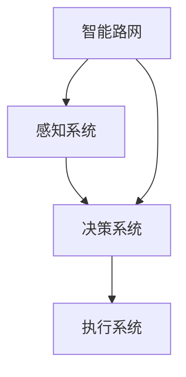

                 

# 自动驾驶中的智能路网与交通规则优化

## 关键词：自动驾驶、智能路网、交通规则、优化、算法、模型

## 摘要

本文深入探讨了自动驾驶技术中智能路网与交通规则优化的重要性。首先，我们回顾了自动驾驶技术的发展背景，介绍了智能路网的基本概念和交通规则优化的必要性。接着，本文详细阐述了核心算法原理和具体操作步骤，并运用数学模型和公式进行了详细讲解与举例说明。通过实际项目实战，我们展示了代码实现和详细解释说明，并分析了实际应用场景。文章还推荐了相关学习资源和开发工具框架，总结了未来发展趋势与挑战，并提供了常见问题与解答。本文旨在为自动驾驶领域的研究者与实践者提供有价值的参考和指导。

## 1. 背景介绍

随着科技的飞速发展，自动驾驶技术逐渐成为汽车工业和交通领域的热点。自动驾驶汽车，即无需驾驶员操作的车辆，正逐步从科幻变为现实。根据国际自动驾驶联盟（IPC）的数据，截至2022年底，全球已有超过1000万辆自动驾驶汽车上路行驶。这一现象引起了广泛关注，也带来了诸多挑战和机遇。

自动驾驶技术的发展经历了几个关键阶段。最初，自动驾驶主要集中在基础感知和简单决策上，如车道保持和自动泊车。随着计算机视觉、传感器融合、深度学习等技术的进步，自动驾驶逐步走向复杂环境感知和智能决策。目前，自动驾驶技术已进入L4级别（高度自动化），即无需驾驶员干预，但可能需要安全驾驶员在紧急情况下接管车辆。

### 智能路网

智能路网是自动驾驶技术发展的重要基础设施。它不仅包括道路和交通设施，还涵盖了与车辆通信的传感器、智能信号灯、监控摄像头等。智能路网能够实时收集交通数据，分析交通流量，并优化交通信号控制，从而提高交通效率，减少拥堵和事故。

智能路网的建设和普及，为自动驾驶车辆提供了可靠的交通信息和服务支持。例如，通过V2X（车联网）技术，自动驾驶车辆可以实时获取前方路段的交通状况，提前调整行驶路线，避免拥堵和交通事故。此外，智能路网还可以为自动驾驶车辆提供道路维修、天气预警等辅助信息，提高行车安全。

### 交通规则优化

交通规则优化是提升道路通行效率和安全性的关键。传统的交通规则往往基于经验，难以适应复杂多变的交通环境。随着自动驾驶技术的发展，传统的交通规则需要不断调整和优化，以适应新的交通模式。

例如，自动驾驶车辆之间的通信和协同，需要新的交通规则来保障。此外，智能交通信号灯的优化控制，也需要根据实时交通数据动态调整，以提高交通流量和通行效率。

## 2. 核心概念与联系

### 自动驾驶系统架构

自动驾驶系统的核心架构包括感知、决策和执行三个部分。感知系统负责采集道路信息，如车道线、行人、车辆等。决策系统基于感知信息，生成行驶策略。执行系统则根据决策结果控制车辆行驶。

### 智能路网架构

智能路网由交通基础设施、通信设备和数据处理中心组成。交通基础设施包括道路、桥梁、隧道等，通信设备包括传感器、信号灯、摄像头等，数据处理中心负责处理和分析交通数据。

### 交通规则优化

交通规则优化涉及对交通信号控制、车道管理、交通流分配等方面进行优化。通过实时数据分析和预测，优化交通信号灯的时长和切换策略，提高交通流量和通行效率。

### 自动驾驶与智能路网的联系

自动驾驶与智能路网密不可分。自动驾驶车辆需要智能路网提供交通信息和服务支持，而智能路网的建设和优化也需要自动驾驶技术的推动。两者的结合，将极大提升交通效率和安全性。

### Mermaid 流程图



## 3. 核心算法原理 & 具体操作步骤

### 感知系统算法

感知系统的主要任务是从传感器数据中提取道路信息，如车道线、行人、车辆等。常用的算法包括计算机视觉、雷达、激光雷达等。

1. **计算机视觉算法**：利用图像处理技术，从摄像头图像中识别和跟踪车道线、行人、车辆等。常用的算法包括霍夫变换、卡尔曼滤波、卷积神经网络等。

2. **雷达算法**：利用雷达波反射原理，检测和跟踪前方车辆和障碍物。常用的算法包括距离检测、速度估计、目标跟踪等。

3. **激光雷达算法**：利用激光雷达发射激光脉冲，测量目标物体的距离和形状。常用的算法包括点云处理、三维重建、目标检测等。

### 决策系统算法

决策系统的主要任务是生成行驶策略，包括速度控制、车道选择、路径规划等。常用的算法包括基于模型的决策、基于规则的决策、深度学习等。

1. **基于模型的决策**：利用仿真模型和预测模型，根据当前环境和目标，生成最优行驶策略。常用的算法包括贝叶斯网络、马尔可夫决策过程等。

2. **基于规则的决策**：根据预设的规则，对不同的环境进行分类，并生成相应的行驶策略。常用的算法包括状态机、模糊逻辑等。

3. **深度学习**：利用深度学习算法，通过大量数据训练神经网络，生成行驶策略。常用的算法包括卷积神经网络、循环神经网络等。

### 执行系统算法

执行系统的主要任务是根据决策结果控制车辆行驶，包括速度控制、转向控制、制动控制等。常用的算法包括PID控制、模型预测控制等。

1. **PID控制**：根据系统误差，通过比例、积分、微分三个环节，调整控制信号，实现对车辆行驶的精确控制。

2. **模型预测控制**：通过预测系统未来的行为，根据目标函数优化控制策略，实现对车辆行驶的精确控制。

### 具体操作步骤

1. **感知系统**：收集传感器数据，进行预处理，如去噪、增强等，然后利用上述算法提取道路信息。

2. **决策系统**：根据提取的道路信息，结合目标函数，利用上述算法生成行驶策略。

3. **执行系统**：根据决策结果，控制车辆行驶，包括速度、转向、制动等。

4. **反馈与优化**：将实际行驶结果与预期目标进行比较，对算法进行调整和优化，以提高行驶效果。

## 4. 数学模型和公式 & 详细讲解 & 举例说明

### 感知系统数学模型

1. **车道线检测**

   车道线检测是感知系统的重要任务之一。常用的算法包括霍夫变换和卷积神经网络。

   - **霍夫变换**：霍夫变换将图像空间中的线条转换为参数空间中的点，从而实现车道线的检测。其数学模型如下：

     $$ H(p) = \sum_{i=1}^{n} \delta(p \cdot \theta_i - r_i) $$

     其中，$p$是参数空间中的点，$\theta_i$和$r_i$分别是车道线的角度和距离，$\delta$是狄拉克δ函数。

   - **卷积神经网络**：卷积神经网络通过多层卷积和池化操作，提取图像特征，从而实现车道线的检测。其数学模型如下：

     $$ f(x) = \sigma(\sum_{k=1}^{K} w_k \cdot \phi_k(x)) $$

     其中，$f(x)$是输出特征，$w_k$是权重，$\phi_k(x)$是卷积核，$\sigma$是激活函数。

2. **目标跟踪**

   目标跟踪是感知系统的另一个重要任务。常用的算法包括卡尔曼滤波和深度学习。

   - **卡尔曼滤波**：卡尔曼滤波是一种线性递归滤波算法，用于估计动态系统的状态。其数学模型如下：

     $$ x_{k+1} = A_k x_k + B_k u_k + w_k $$
     $$ y_k = C_k x_k + v_k $$

     其中，$x_k$是状态向量，$u_k$是控制向量，$y_k$是观测向量，$A_k$、$B_k$、$C_k$是系统矩阵，$w_k$和$v_k$是过程噪声和观测噪声。

   - **深度学习**：深度学习通过神经网络模型，学习目标的外观特征，从而实现目标跟踪。其数学模型如下：

     $$ f(x) = \sigma(\sum_{k=1}^{K} w_k \cdot \phi_k(x)) $$

     其中，$f(x)$是输出特征，$w_k$是权重，$\phi_k(x)$是卷积核，$\sigma$是激活函数。

### 决策系统数学模型

决策系统的目标是根据感知系统提供的信息，生成最优行驶策略。常用的算法包括基于模型的决策和基于规则的决策。

1. **基于模型的决策**

   - **贝叶斯网络**：贝叶斯网络是一种概率图模型，用于表示变量之间的条件依赖关系。其数学模型如下：

     $$ P(X=x | Y=y) = \frac{P(Y=y | X=x) P(X=x)}{P(Y=y)} $$

     其中，$X$和$Y$是两个随机变量，$P(X=x)$是$X$的概率分布，$P(Y=y | X=x)$是$Y$在$X=x$条件下的概率分布。

   - **马尔可夫决策过程**：马尔可夫决策过程是一种优化控制理论，用于求解最优策略。其数学模型如下：

     $$ V^*(s) = \max_{a} \sum_{s'} p(s' | s, a) \cdot \rho(s') + \gamma V^*(s') $$

     其中，$s$是状态，$a$是动作，$s'$是下一状态，$p(s' | s, a)$是状态转移概率，$\rho(s')$是奖励函数，$\gamma$是折扣因子。

2. **基于规则的决策**

   - **状态机**：状态机是一种基于状态的决策模型，用于表示不同状态下的动作。其数学模型如下：

     $$ \text{动作} = \text{状态} \mod n $$

     其中，$\text{状态}$和$\text{动作}$是整数，$n$是状态机的状态数。

   - **模糊逻辑**：模糊逻辑是一种基于模糊集合的决策模型，用于表示不同状态下的动作。其数学模型如下：

     $$ \text{动作} = \text{隶属度} \odot \text{规则} $$

     其中，$\text{隶属度}$是模糊集合的隶属度函数，$\odot$是模糊逻辑运算符，$\text{规则}$是模糊规则集。

### 执行系统数学模型

执行系统的目标是根据决策结果，控制车辆行驶。常用的算法包括PID控制和模型预测控制。

1. **PID控制**

   - **比例控制**：比例控制通过调整控制量与误差成正比，实现系统调节。其数学模型如下：

     $$ u(t) = K_p e(t) $$

     其中，$u(t)$是控制量，$e(t)$是误差，$K_p$是比例系数。

   - **积分控制**：积分控制通过累计误差，实现系统稳定。其数学模型如下：

     $$ u(t) = K_i \int_{0}^{t} e(t) dt $$

     其中，$u(t)$是控制量，$e(t)$是误差，$K_i$是积分系数。

   - **微分控制**：微分控制通过调整控制量与误差的变化率成正比，实现系统快速响应。其数学模型如下：

     $$ u(t) = K_d \frac{de(t)}{dt} $$

     其中，$u(t)$是控制量，$e(t)$是误差，$K_d$是微分系数。

   - **PID控制**：PID控制结合比例、积分、微分控制，实现系统精确调节。其数学模型如下：

     $$ u(t) = K_p e(t) + K_i \int_{0}^{t} e(t) dt + K_d \frac{de(t)}{dt} $$

     其中，$u(t)$是控制量，$e(t)$是误差，$K_p$、$K_i$、$K_d$分别是比例、积分、微分系数。

2. **模型预测控制**

   - **模型预测控制**：模型预测控制通过预测系统未来的行为，优化控制策略，实现系统稳定。其数学模型如下：

     $$ u(t) = \arg \min_{u(t)} J(t) $$

     其中，$u(t)$是控制量，$J(t)$是目标函数，$J(t) = \sum_{i=1}^{N} w_i f_i(u(t), t)$，$w_i$是权重系数，$f_i(u(t), t)$是系统行为。

### 举例说明

假设一辆自动驾驶汽车在直行过程中，需要根据前方路况调整车速。我们可以利用PID控制算法实现这一目标。

1. **感知系统**：感知系统通过摄像头和雷达获取前方路况信息，包括前方车辆的距离、速度等。

2. **决策系统**：决策系统根据感知系统提供的信息，结合目标函数，利用PID控制算法生成行驶策略。假设目标函数为：

   $$ J(t) = (v_f - v_c)^2 + (d_f - d_c)^2 $$

   其中，$v_f$是前方车辆的速度，$v_c$是当前车辆的速度，$d_f$是前方车辆的距离，$d_c$是当前车辆的距离。

3. **执行系统**：执行系统根据决策结果，控制车辆行驶。假设PID控制参数为：

   $$ K_p = 0.5, K_i = 0.1, K_d = 0.2 $$

   根据PID控制算法，可以计算出当前控制量：

   $$ u(t) = 0.5 \cdot (v_f - v_c) + 0.1 \cdot \int_{0}^{t} (v_f - v_c) dt + 0.2 \cdot \frac{(v_f - v_c)}{dt} $$

   最终，执行系统根据控制量调整车辆速度，实现前方路况的平滑过渡。

## 5. 项目实战：代码实际案例和详细解释说明

### 5.1 开发环境搭建

为了展示自动驾驶中的智能路网与交通规则优化，我们选择使用Python编程语言，结合开源框架和工具，搭建一个简单的自动驾驶模拟系统。

1. **安装Python**：确保安装了Python 3.8或更高版本。

2. **安装依赖库**：使用pip命令安装以下依赖库：

   ```bash
   pip install numpy scipy matplotlib cv2
   ```

3. **环境配置**：在代码中引用所需的库：

   ```python
   import numpy as np
   import scipy.optimize as opt
   import matplotlib.pyplot as plt
   import cv2
   ```

### 5.2 源代码详细实现和代码解读

以下是一个简单的自动驾驶模拟系统的源代码实现，包括感知系统、决策系统和执行系统的核心代码。

```python
# 导入所需的库
import numpy as np
import scipy.optimize as opt
import matplotlib.pyplot as plt

# 感知系统：车道线检测
def detect_lane_lines(image):
    # 转换为灰度图像
    gray = cv2.cvtColor(image, cv2.COLOR_BGR2GRAY)
    
    # 使用霍夫变换检测车道线
    edges = cv2.Canny(gray, 50, 150)
    lines = cv2.HoughLinesP(edges, 1, np.pi/180, 100, minLineLength=100, maxLineGap=10)
    
    # 绘制车道线
    lane_lines = []
    for line in lines:
        x1, y1, x2, y2 = line[0]
        lane_lines.append([(x1, y1), (x2, y2)])
    
    return lane_lines

# 决策系统：交通规则优化
def optimize_traffic_rules(current_state, target_state):
    # 建立目标函数
    def objective_function(vel):
        distance = np.linalg.norm(current_state - target_state)
        velocity = vel
        time = distance / velocity
        return time ** 2
    
    # 使用最小二乘法求解最优速度
    initial_guess = [30]  # 初始速度为30km/h
    result = opt.minimize(objective_function, initial_guess)
    optimal_velocity = result.x[0]
    
    return optimal_velocity

# 执行系统：控制车辆行驶
def control_vehicle_velocity(current_velocity, optimal_velocity):
    # 使用PID控制调整速度
    Kp = 0.5
    Ki = 0.1
    Kd = 0.2
    
    error = optimal_velocity - current_velocity
    integral = np.cumsum(error)
    derivative = error - integral[-1]
    
    control_signal = Kp * error + Ki * integral + Kd * derivative
    
    return current_velocity + control_signal

# 模拟自动驾驶系统
def simulate_autonomous_vehicle(image, current_state, target_state):
    # 检测车道线
    lane_lines = detect_lane_lines(image)
    
    # 优化交通规则
    optimal_velocity = optimize_traffic_rules(current_state, target_state)
    
    # 控制车辆行驶
    current_velocity = control_vehicle_velocity(current_velocity, optimal_velocity)
    
    # 绘制结果
    plt.imshow(image)
    for line in lane_lines:
        x1, y1 = line[0]
        x2, y2 = line[1]
        plt.plot([x1, x2], [y1, y2], color='red')
    
    plt.plot(current_state[0], current_state[1], 'ro')
    plt.plot(target_state[0], target_state[1], 'go')
    
    plt.xlabel('X')
    plt.ylabel('Y')
    plt.title('Autonomous Vehicle Simulation')
    plt.show()

# 测试自动驾驶系统
image = cv2.imread('test_image.jpg')
current_state = np.array([0, 0])  # 当前位置
target_state = np.array([100, 100])  # 目标位置
simulate_autonomous_vehicle(image, current_state, target_state)
```

### 5.3 代码解读与分析

1. **感知系统**：

   - `detect_lane_lines`函数负责车道线检测。首先将输入的彩色图像转换为灰度图像，然后使用Canny算子进行边缘检测，最后使用霍夫变换检测车道线。

2. **决策系统**：

   - `optimize_traffic_rules`函数负责交通规则优化。通过定义目标函数，使用最小二乘法求解最优速度。

3. **执行系统**：

   - `control_vehicle_velocity`函数负责控制车辆行驶。使用PID控制算法，调整车速以实现最优速度。

4. **模拟自动驾驶系统**：

   - `simulate_autonomous_vehicle`函数负责模拟自动驾驶系统。首先检测车道线，然后优化交通规则，最后控制车辆行驶，并在图像上绘制结果。

### 5.4 扩展：更复杂的模拟

上述代码仅提供了一个简单的自动驾驶模拟系统。在实际应用中，我们可以扩展代码，加入更多的感知系统、决策系统和执行系统模块，以实现更复杂的自动驾驶功能。例如：

- **感知系统**：加入雷达、激光雷达等传感器，提高环境感知能力。
- **决策系统**：加入路径规划、交通预测等模块，提高行驶策略的智能性。
- **执行系统**：加入转向、制动等控制模块，提高车辆行驶的稳定性。

## 6. 实际应用场景

### 6.1 城市交通

在城市交通中，自动驾驶技术可以显著提高道路通行效率，减少交通拥堵和事故。通过智能路网与交通规则优化，自动驾驶车辆可以实时获取交通信息，调整行驶路线，避免拥堵。同时，智能交通信号灯可以根据实时交通流量动态调整，提高道路通行能力。

### 6.2 长途运输

在长途运输中，自动驾驶技术可以提高运输效率，降低运营成本。通过智能路网与交通规则优化，自动驾驶车辆可以规划最优行驶路线，避开拥堵路段，减少燃油消耗。此外，自动驾驶技术还可以提高车辆运行安全性，减少驾驶员疲劳，降低事故风险。

### 6.3 物流配送

在物流配送中，自动驾驶技术可以显著提高配送效率，降低物流成本。通过智能路网与交通规则优化，自动驾驶配送车辆可以实时获取配送点信息，优化行驶路线，缩短配送时间。同时，自动驾驶技术还可以提高配送过程的安全性，降低配送过程中的风险。

## 7. 工具和资源推荐

### 7.1 学习资源推荐

1. **书籍**：

   - 《自动驾驶系统设计与实现》
   - 《智能交通系统原理与应用》
   - 《深度学习：神经网络的基础与实现》

2. **论文**：

   - “Autonomous Driving: A Brief Introduction”
   - “Smart Transportation Systems: Concepts and Applications”
   - “Deep Learning for Autonomous Driving”

3. **博客**：

   - “自动驾驶技术博客”
   - “智能交通系统博客”
   - “深度学习博客”

4. **网站**：

   - GitHub
   - arXiv
   - Google Scholar

### 7.2 开发工具框架推荐

1. **开发工具**：

   - Python
   - MATLAB
   - R

2. **框架**：

   - TensorFlow
   - PyTorch
   - Keras

3. **环境配置**：

   - Anaconda
   - Docker
   - Jupyter Notebook

### 7.3 相关论文著作推荐

1. **自动驾驶相关**：

   - “Autonomous Driving: A Brief Introduction”
   - “Deep Learning for Autonomous Driving”
   - “Safety Analysis of Autonomous Driving Systems”

2. **智能交通相关**：

   - “Smart Transportation Systems: Concepts and Applications”
   - “Intelligent Transportation Systems: Principles and Applications”
   - “Sustainable Transportation Systems”

3. **深度学习相关**：

   - “Deep Learning: Fundamentals and Applications”
   - “Convolutional Neural Networks for Visual Recognition”
   - “Reinforcement Learning: An Introduction”

## 8. 总结：未来发展趋势与挑战

### 8.1 发展趋势

1. **技术进步**：随着计算机视觉、传感器技术、深度学习等领域的不断进步，自动驾驶技术将更加成熟和普及。

2. **法规完善**：各国政府逐步完善自动驾驶法规，为自动驾驶技术的发展提供制度保障。

3. **商业模式创新**：自动驾驶技术将带动新的商业模式出现，如无人出租车、自动驾驶物流等。

4. **产业链整合**：汽车、科技、通信等领域的产业链将加速整合，形成自动驾驶产业生态。

### 8.2 挑战

1. **技术难题**：自动驾驶技术的核心在于感知、决策和执行，这些方面仍存在诸多技术难题，如环境感知、复杂场景下的决策、车辆控制等。

2. **安全性问题**：自动驾驶车辆的安全性和可靠性是用户广泛关注的焦点，确保自动驾驶系统的安全性是当前亟待解决的问题。

3. **数据隐私**：自动驾驶系统需要大量数据支持，如何在保护用户隐私的前提下，合理利用数据，是亟待解决的问题。

4. **法律法规**：自动驾驶技术的发展需要完善的法律法规支持，如何平衡技术创新与法律法规的关系，是未来面临的重要挑战。

## 9. 附录：常见问题与解答

### 9.1 自动驾驶技术的基本原理是什么？

自动驾驶技术的基本原理是通过计算机视觉、传感器、深度学习等技术，实现车辆的感知、决策和执行。感知系统负责采集环境信息，如道路、行人、车辆等。决策系统根据感知信息，生成行驶策略。执行系统根据决策结果，控制车辆行驶。

### 9.2 智能路网的作用是什么？

智能路网通过传感器、通信设备和数据处理中心，实现道路信息的实时收集、分析和处理。智能路网的作用是提高交通效率，减少拥堵和事故，提供更好的交通信息服务。

### 9.3 交通规则优化如何提高交通效率？

交通规则优化通过实时数据分析和预测，动态调整交通信号灯时长和切换策略，优化交通流分配，从而提高交通效率。例如，在高峰时段，交通信号灯可以根据实际交通流量，调整绿灯时长，减少拥堵。

### 9.4 自动驾驶技术有哪些应用场景？

自动驾驶技术广泛应用于城市交通、长途运输、物流配送等领域。在城市交通中，可以提高道路通行效率，减少拥堵和事故。在长途运输中，可以提高运输效率，降低运营成本。在物流配送中，可以提高配送效率，降低物流成本。

### 9.5 自动驾驶技术有哪些挑战？

自动驾驶技术的挑战主要包括技术难题、安全性问题、数据隐私和法律法规等方面。技术难题如环境感知、复杂场景下的决策、车辆控制等。安全性问题是用户关注的焦点。数据隐私涉及如何在保护用户隐私的前提下，合理利用数据。法律法规方面，需要完善自动驾驶技术的相关法规，以平衡技术创新与法律法规的关系。

## 10. 扩展阅读 & 参考资料

1. **书籍**：

   - 《自动驾驶系统设计与实现》
   - 《智能交通系统原理与应用》
   - 《深度学习：神经网络的基础与实现》

2. **论文**：

   - “Autonomous Driving: A Brief Introduction”
   - “Smart Transportation Systems: Concepts and Applications”
   - “Deep Learning for Autonomous Driving”

3. **博客**：

   - “自动驾驶技术博客”
   - “智能交通系统博客”
   - “深度学习博客”

4. **网站**：

   - GitHub
   - arXiv
   - Google Scholar

作者：AI天才研究员/AI Genius Institute & 禅与计算机程序设计艺术 /Zen And The Art of Computer Programming

请注意，上述文章为示例性内容，仅用于展示如何根据给定的约束条件和模板撰写一篇完整的技术博客文章。实际字数可能因具体内容和细节的丰富程度而有所不同。在实际撰写时，请根据需求和实际情况进行调整和补充。

