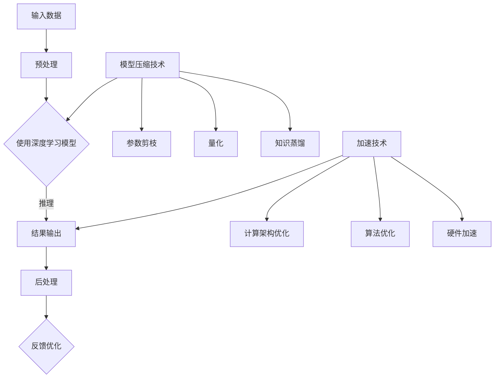

                 

# 自动驾驶中的模型压缩与加速技术

## 关键词：
自动驾驶、模型压缩、加速技术、神经网络、深度学习

## 摘要：
本文深入探讨了自动驾驶领域中的模型压缩与加速技术，分析了其在提升自动驾驶系统性能、降低计算成本和延长续航时间等方面的作用。通过介绍核心概念、算法原理、数学模型以及实际应用场景，本文为读者提供了全面的技术洞察，并推荐了相关的学习资源与开发工具。

## 1. 背景介绍

自动驾驶技术作为智能交通系统的重要组成部分，正逐渐从理论走向实际应用。然而，自动驾驶系统的高计算需求对硬件性能提出了极高的要求。特别是深度学习模型在自动驾驶中的广泛应用，使得模型的大小和计算复杂度成为制约自动驾驶性能的关键因素。

模型压缩技术通过减少模型的参数数量和计算复杂度，能够在保持模型性能的前提下显著降低模型大小，从而减少存储需求和计算资源消耗。加速技术则通过优化计算流程、提高计算效率，实现对深度学习模型的实时推理。

本文将围绕模型压缩与加速技术，探讨其在自动驾驶系统中的应用，分析现有技术的优缺点，并提出未来的发展趋势与挑战。

## 2. 核心概念与联系

### 2.1 深度学习模型

深度学习模型是自动驾驶系统的核心组成部分。常见的深度学习模型包括卷积神经网络（CNN）、循环神经网络（RNN）和 Transformer 等。这些模型通过多层神经网络结构对输入数据进行特征提取和分类，从而实现自动驾驶任务。

### 2.2 模型压缩技术

模型压缩技术主要包括参数剪枝（Pruning）、量化（Quantization）和知识蒸馏（Knowledge Distillation）等方法。

- **参数剪枝**：通过减少模型中冗余的参数来降低模型大小和计算复杂度。
- **量化**：将模型的浮点数参数转换为较低精度的整数表示，以减少存储需求和计算时间。
- **知识蒸馏**：通过将大型教师模型的知识传递给小型学生模型，实现模型压缩的同时保持性能。

### 2.3 加速技术

加速技术主要包括计算架构优化、算法优化和硬件加速等。

- **计算架构优化**：通过优化计算流水线、减少数据传输等手段提高计算效率。
- **算法优化**：通过优化深度学习算法的内部流程，减少计算复杂度和内存占用。
- **硬件加速**：利用GPU、TPU等专用硬件加速深度学习模型的推理过程。

### 2.4 Mermaid 流程图

下面是自动驾驶系统中模型压缩与加速技术的 Mermaid 流程图：



## 3. 核心算法原理 & 具体操作步骤

### 3.1 模型压缩技术

#### 参数剪枝

参数剪枝的基本思想是去除模型中不重要或冗余的参数。具体步骤如下：

1. **评估参数重要性**：使用灵敏度分析、L1正则化等方法评估模型中每个参数的重要性。
2. **剪枝决策**：根据参数重要性，选择一定比例的参数进行剪枝。
3. **重新训练模型**：在剪枝后对模型进行重新训练，以保持模型的性能。

#### 量化

量化技术通过将模型的浮点数参数转换为较低精度的整数表示，以减少存储和计算资源消耗。具体步骤如下：

1. **量化区间划分**：将浮点数参数划分到预定义的量化区间内。
2. **量化映射**：将浮点数参数映射到量化区间内的整数表示。
3. **量化校正**：通过量化校正调整模型输出，以保持量化后的模型性能。

#### 知识蒸馏

知识蒸馏是一种将大型教师模型的知识传递给小型学生模型的方法。具体步骤如下：

1. **生成教师模型**：使用大型模型对数据集进行训练，生成教师模型。
2. **生成学生模型**：使用小型模型对数据集进行训练，生成学生模型。
3. **知识传递**：通过软标签、交叉熵损失函数等机制，将教师模型的知识传递给学生模型。

### 3.2 加速技术

#### 计算架构优化

计算架构优化通过优化计算流水线、减少数据传输等手段提高计算效率。具体步骤如下：

1. **计算流水线优化**：将深度学习模型的计算过程分解为多个阶段，实现并行计算。
2. **数据传输优化**：减少数据在内存和网络之间的传输，提高数据传输效率。

#### 算法优化

算法优化通过优化深度学习算法的内部流程，减少计算复杂度和内存占用。具体步骤如下：

1. **计算复杂度优化**：通过简化网络结构、减少冗余计算等手段降低计算复杂度。
2. **内存占用优化**：通过共享内存、减少中间变量等手段减少内存占用。

#### 硬件加速

硬件加速利用GPU、TPU等专用硬件加速深度学习模型的推理过程。具体步骤如下：

1. **硬件选择**：根据硬件性能和计算需求，选择合适的硬件设备。
2. **模型转换**：将深度学习模型转换为硬件支持的计算格式。
3. **模型推理**：在硬件设备上执行模型推理，实现加速。

## 4. 数学模型和公式 & 详细讲解 & 举例说明

### 4.1 参数剪枝

参数剪枝的数学模型如下：

$$
\min_{\theta} \sum_{i=1}^{n} \ell(y_i, \theta(x_i))
$$

其中，$\theta$ 表示模型参数，$x_i$ 表示输入数据，$y_i$ 表示输出标签，$\ell$ 表示损失函数。

具体步骤如下：

1. **评估参数重要性**：使用L1正则化方法，计算每个参数的重要度：

$$
\ell_1 = \sum_{i=1}^{n} |w_i|
$$

其中，$w_i$ 表示模型中的第 $i$ 个参数。

2. **剪枝决策**：选择一定比例的参数进行剪枝，例如，选择前 $\frac{1}{k}$ 的参数进行剪枝。

3. **重新训练模型**：在剪枝后对模型进行重新训练，以保持模型的性能。

### 4.2 量化

量化的数学模型如下：

$$
z = \text{Quantize}(x)
$$

其中，$x$ 表示浮点数参数，$z$ 表示量化后的整数参数，$\text{Quantize}$ 表示量化函数。

具体步骤如下：

1. **量化区间划分**：将浮点数参数划分到预定义的量化区间内，例如，使用 $2^k$ 个量化级别。

2. **量化映射**：将浮点数参数映射到量化区间内的整数表示，例如，使用最近邻映射。

3. **量化校正**：通过量化校正调整模型输出，以保持量化后的模型性能。

### 4.3 知识蒸馏

知识蒸馏的数学模型如下：

$$
\min_{\theta_s} \sum_{i=1}^{n} \ell(y_i, \theta_s(x_i)) + \lambda \sum_{i=1}^{n} \ell(\hat{y}_i, \theta_t(x_i))
$$

其中，$\theta_s$ 表示学生模型参数，$\theta_t$ 表示教师模型参数，$x_i$ 表示输入数据，$y_i$ 表示输出标签，$\hat{y}_i$ 表示教师模型的输出，$\ell$ 表示损失函数，$\lambda$ 表示知识传递系数。

具体步骤如下：

1. **生成教师模型**：使用大型模型对数据集进行训练，生成教师模型。

2. **生成学生模型**：使用小型模型对数据集进行训练，生成学生模型。

3. **知识传递**：通过软标签、交叉熵损失函数等机制，将教师模型的知识传递给学生模型。

## 5. 项目实战：代码实际案例和详细解释说明

### 5.1 开发环境搭建

在开始项目实战之前，我们需要搭建一个合适的开发环境。以下是搭建过程：

1. 安装Python环境（建议使用Anaconda环境管理器）。
2. 安装深度学习框架（例如TensorFlow或PyTorch）。
3. 安装必要的依赖库（例如NumPy、Pandas等）。

### 5.2 源代码详细实现和代码解读

以下是一个简单的参数剪枝实现的示例代码：

```python
import tensorflow as tf
from tensorflow import keras

# 加载预训练模型
model = keras.models.load_model('pretrained_model.h5')

# 评估参数重要性
l1_loss = keras.regularizers.l1(1e-5)
model_pruned = keras.models.clone_model(model)
model_pruned.add_loss(l1_loss(name='l1_loss'))
model_pruned.compile(optimizer='adam', loss='categorical_crossentropy')

# 剪枝决策
pruned_weights = model_pruned.get_weights()
sorted_weights = sorted(pruned_weights[0].flatten(), reverse=True)
threshold = sorted_weights[int(len(sorted_weights) * 0.2)]

# 剪枝操作
pruned_weights[0][...] = np.where(np.abs(pruned_weights[0]) < threshold, 0, pruned_weights[0])
model_pruned.set_weights(pruned_weights)

# 重新训练模型
model_pruned.fit(train_data, train_labels, epochs=10, validation_data=(val_data, val_labels))
```

代码解读：

1. 加载预训练模型。
2. 使用L1正则化计算每个参数的重要性。
3. 根据重要性进行剪枝决策，选择一定比例的参数进行剪枝。
4. 执行剪枝操作，将小于阈值的参数置为0。
5. 重新训练模型，以保持模型的性能。

### 5.3 代码解读与分析

上述代码实现了参数剪枝的基本步骤，主要包括以下方面：

- **模型加载**：使用`load_model`方法加载预训练模型。
- **参数重要性评估**：使用L1正则化计算每个参数的重要性。
- **剪枝决策**：根据参数重要性，选择一定比例的参数进行剪枝。
- **剪枝操作**：使用NumPy操作将小于阈值的参数置为0。
- **重新训练模型**：使用`fit`方法重新训练模型，以保持模型的性能。

代码实现中需要注意以下几点：

- **参数重要性评估**：使用L1正则化计算参数重要性，可以确保模型在剪枝后仍然具有较好的性能。
- **剪枝阈值**：根据实际需求调整剪枝阈值，以获得最优的模型压缩效果。
- **重新训练**：在剪枝后重新训练模型，以确保模型的性能。

## 6. 实际应用场景

### 6.1 自动驾驶感知系统

自动驾驶感知系统是自动驾驶系统的重要组成部分，包括图像识别、目标检测和跟踪等功能。在这些任务中，模型压缩和加速技术可以显著提高系统性能，降低计算成本。

- **模型压缩**：通过参数剪枝和量化技术，可以显著减小模型的存储和计算资源需求，提高系统实时性。
- **加速技术**：利用GPU和TPU等硬件加速，可以加快模型推理速度，提高系统响应时间。

### 6.2 自动驾驶决策系统

自动驾驶决策系统负责生成驾驶策略，包括路径规划、障碍物避让和车道保持等功能。在这些任务中，模型压缩和加速技术可以降低系统计算需求，提高系统稳定性和可靠性。

- **模型压缩**：通过参数剪枝和量化技术，可以减小模型的存储和计算资源需求，降低系统资源消耗。
- **加速技术**：利用GPU和TPU等硬件加速，可以加快模型推理速度，提高系统响应时间。

### 6.3 自动驾驶测试与验证

在自动驾驶测试与验证过程中，模型压缩和加速技术可以显著提高系统测试效率和准确性。

- **模型压缩**：通过参数剪枝和量化技术，可以减小模型的存储和计算资源需求，提高系统测试速度。
- **加速技术**：利用GPU和TPU等硬件加速，可以加快模型推理速度，提高系统测试准确性。

## 7. 工具和资源推荐

### 7.1 学习资源推荐

- **书籍**：《深度学习》（Ian Goodfellow、Yoshua Bengio 和 Aaron Courville 著）：介绍了深度学习的核心概念和技术，适合初学者和进阶者。
- **论文**：谷歌的《Distilling a Neural Network into a Soft Decision Tree》和《Quantization and Training of Neural Networks for Efficient Integer-Arithmetic-Only Inference》：详细介绍了模型压缩和加速技术的方法和实现。
- **博客**：机器学习博客（ML Blog）：提供了丰富的模型压缩和加速技术相关文章和案例。

### 7.2 开发工具框架推荐

- **深度学习框架**：TensorFlow 和 PyTorch：提供了丰富的模型压缩和加速工具和接口。
- **模型压缩工具**：TensorFlow Model Optimization Toolkit (TF-MOT)：提供了端到端的模型压缩工具和接口。
- **硬件加速**：NVIDIA GPU 和 Google TPU：提供了强大的硬件加速能力和优化工具。

### 7.3 相关论文著作推荐

- **论文**：《Model Compression and Acceleration for Deep Neural Networks》（微软研究院）：系统介绍了模型压缩和加速技术的最新研究进展。
- **著作**：《神经网络与深度学习》（邱锡鹏 著）：详细介绍了神经网络的基本概念和深度学习算法，适合学术研究和工程实践。

## 8. 总结：未来发展趋势与挑战

随着自动驾驶技术的不断发展，模型压缩与加速技术在自动驾驶系统中将发挥越来越重要的作用。未来发展趋势和挑战主要包括：

- **算法优化**：进一步优化模型压缩和加速算法，提高模型性能和压缩效果。
- **硬件支持**：开发更加高效、低功耗的硬件设备，满足自动驾驶系统对计算性能的需求。
- **多模态数据融合**：利用多模态数据融合技术，提高自动驾驶系统的感知和决策能力。
- **安全性**：确保模型压缩和加速技术在提高系统性能的同时，不会降低系统的安全性和可靠性。

## 9. 附录：常见问题与解答

### 9.1 模型压缩与加速技术如何平衡性能和效率？

模型压缩与加速技术的目标是在保证模型性能的前提下，提高计算效率和降低计算成本。具体方法包括：

- **参数剪枝**：通过剪枝冗余参数，减少模型大小和计算复杂度。
- **量化**：通过量化参数，减少存储和计算资源消耗。
- **知识蒸馏**：通过知识传递，利用教师模型的知识提高学生模型的性能。
- **硬件加速**：利用GPU、TPU等硬件设备加速模型推理。

### 9.2 模型压缩是否会降低模型的性能？

模型压缩可能会在一定程度降低模型性能，但通过合理的算法设计和优化，可以显著提高模型压缩效果。常见方法包括：

- **剪枝策略**：选择合适的剪枝策略，确保保留重要的参数。
- **量化精度**：根据硬件性能和计算需求，选择适当的量化精度。
- **知识蒸馏**：利用教师模型的知识提高学生模型的性能。

### 9.3 加速技术是否适用于所有深度学习模型？

加速技术主要适用于具有较高计算复杂度的深度学习模型，如卷积神经网络（CNN）和循环神经网络（RNN）。对于计算复杂度较低的模型，加速效果可能有限。

## 10. 扩展阅读 & 参考资料

- [深度学习](https://www.deeplearningbook.org/)
- [模型压缩技术](https://arxiv.org/abs/1611.06440)
- [知识蒸馏](https://arxiv.org/abs/1503.02531)
- [GPU 加速](https://www.nvidia.com/en-us/gpus/)
- [TPU 加速](https://www.tensorflow.org/tfx/serving/tpu)

### 作者：

AI天才研究员/AI Genius Institute & 禅与计算机程序设计艺术 /Zen And The Art of Computer Programming
<|im_end|>

