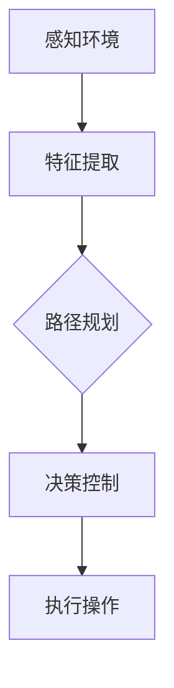

                 

# 自动驾驶中的深度学习模型设计创新

> 关键词：自动驾驶，深度学习，模型设计，创新，技术进步

> 摘要：本文深入探讨了自动驾驶技术中的深度学习模型设计创新。首先，我们对自动驾驶技术进行了背景介绍，阐述了其在现代交通系统中的重要性。接着，我们详细讨论了深度学习模型的核心概念和联系，并使用了Mermaid流程图展示了相关架构。然后，文章深入分析了深度学习模型的核心算法原理和具体操作步骤，并对数学模型和公式进行了详细讲解与举例说明。随后，我们通过实际项目实战展示了代码的实际案例和详细解释说明。文章还探讨了深度学习模型在实际应用场景中的重要性，并推荐了相关工具和资源。最后，我们对未来发展趋势与挑战进行了总结，并提供了常见问题与解答以及扩展阅读和参考资料。

## 1. 背景介绍

自动驾驶技术，作为人工智能领域的一个重要分支，近年来在全球范围内受到了广泛关注。自动驾驶车辆能够通过感知周围环境、理解交通规则、做出决策并执行相应的操作，从而实现完全自动化的驾驶。这不仅提高了交通效率，减少了交通事故，还为残疾人士、老年人和其他人提供了更加便捷的出行方式。

自动驾驶技术的发展历程可以追溯到20世纪50年代。最初，自动驾驶主要依靠机械和电子传感器进行简单的路径规划和导航。随着计算机技术和传感器技术的不断发展，自动驾驶技术逐渐从规则驱动向数据驱动转变。深度学习作为数据驱动方法的一个重要分支，因其强大的特征提取和模式识别能力，成为了自动驾驶技术中的重要工具。

在现代交通系统中，自动驾驶技术具有巨大的潜力。它可以有效缓解交通拥堵，减少交通事故，提高能源利用效率。同时，自动驾驶技术还可以为共享出行、物流配送等新兴领域提供支持，推动整个交通系统的智能化和可持续发展。

## 2. 核心概念与联系

### 2.1 深度学习模型

深度学习模型是一种基于人工神经网络的机器学习模型，具有多个隐藏层，能够通过学习大量数据自动提取复杂特征。深度学习模型在图像识别、语音识别、自然语言处理等领域取得了显著的成果。在自动驾驶中，深度学习模型主要用于环境感知、路径规划和决策控制等任务。

### 2.2 神经网络架构

神经网络架构是深度学习模型的核心组成部分。常见的神经网络架构包括卷积神经网络（CNN）、循环神经网络（RNN）和生成对抗网络（GAN）等。每种架构都有其特定的优势和应用场景。例如，CNN在图像识别任务中表现出色，而RNN在序列数据处理中具有优势。

### 2.3 Mermaid流程图

下面是一个使用Mermaid绘制的深度学习模型在自动驾驶中的应用流程图：



在这个流程图中，A表示感知环境，B表示特征提取，C表示路径规划，D表示决策控制，E表示执行操作。每个节点都代表了深度学习模型在自动驾驶中的一个关键任务。

## 3. 核心算法原理 & 具体操作步骤

### 3.1 特征提取

特征提取是深度学习模型在自动驾驶中的第一步。它的目标是捕捉到环境中的关键信息，以便后续的路径规划和决策控制。特征提取通常使用卷积神经网络（CNN）来实现。CNN通过多个卷积层和池化层，从原始图像中自动提取层次化的特征。

具体操作步骤如下：

1. **输入层**：输入自动驾驶车辆捕获的图像。
2. **卷积层**：通过卷积操作提取图像的局部特征。
3. **池化层**：对卷积层的输出进行下采样，减少参数数量。
4. **激活函数**：使用ReLU等激活函数增加模型的非线性能力。
5. **全连接层**：将卷积层提取的特征映射到具体的类别或目标。

### 3.2 路径规划

路径规划是自动驾驶中的核心任务之一。它的目标是确定自动驾驶车辆从当前位置到目标位置的最优路径。路径规划可以使用深度强化学习（DRL）等方法来实现。

具体操作步骤如下：

1. **状态表示**：定义车辆的当前位置、速度、方向等状态信息。
2. **动作表示**：定义车辆的加速、减速、转向等操作。
3. **奖励函数**：定义评价路径优劣的奖励函数，通常考虑距离目标的距离、行驶时间、安全等因素。
4. **策略学习**：使用DRL算法（如Q-learning、Policy Gradients等）学习最优策略。

### 3.3 决策控制

决策控制是自动驾驶中的最后一个环节。它的目标是根据环境感知和路径规划的结果，实时控制车辆的行驶行为。决策控制通常使用深度学习模型中的条件生成模型（如生成对抗网络（GAN））来实现。

具体操作步骤如下：

1. **输入层**：输入环境感知和路径规划的结果。
2. **条件生成模型**：根据输入生成控制指令。
3. **输出层**：输出车辆的加速度、转向角度等控制指令。

## 4. 数学模型和公式 & 详细讲解 & 举例说明

### 4.1 卷积神经网络（CNN）

卷积神经网络（CNN）是一种用于特征提取的深度学习模型。下面是CNN的基本数学模型：

$$
\text{激活函数} = \text{ReLU}(z) = \max(0, z)
$$

其中，$z$ 是输入值，ReLU（修正线性单元）是一种常见的激活函数，用于增加模型的非线性能力。

### 4.2 深度强化学习（DRL）

深度强化学习（DRL）是一种用于路径规划的深度学习模型。下面是DRL的基本数学模型：

$$
Q(s, a) = \sum_{s'} P(s' | s, a) \cdot \max_{a'} Q(s', a')
$$

其中，$Q(s, a)$ 是状态 $s$ 和动作 $a$ 的质量值，$P(s' | s, a)$ 是状态转移概率，$\max_{a'} Q(s', a')$ 是在下一个状态 $s'$ 下的最优动作。

### 4.3 生成对抗网络（GAN）

生成对抗网络（GAN）是一种用于决策控制的深度学习模型。下面是GAN的基本数学模型：

$$
G(z) = \text{生成器} \quad \text{和} \quad D(x) = \text{判别器}
$$

其中，$G(z)$ 是生成器，用于生成虚拟样本，$D(x)$ 是判别器，用于区分真实样本和虚拟样本。

### 4.4 举例说明

假设我们要使用CNN进行图像识别，输入图像大小为 $28 \times 28$ 像素，我们可以设计一个简单的CNN模型：

1. **输入层**：输入 $28 \times 28$ 的灰度图像。
2. **卷积层1**：卷积核大小为 $5 \times 5$，步长为 $1$，卷积后得到 $24 \times 24$ 的特征图。
3. **ReLU激活函数**：对卷积层1的输出进行ReLU激活。
4. **池化层1**：对ReLU激活后的特征图进行最大池化，得到 $12 \times 12$ 的特征图。
5. **卷积层2**：卷积核大小为 $5 \times 5$，步长为 $1$，卷积后得到 $16 \times 16$ 的特征图。
6. **ReLU激活函数**：对卷积层2的输出进行ReLU激活。
7. **池化层2**：对ReLU激活后的特征图进行最大池化，得到 $8 \times 8$ 的特征图。
8. **全连接层**：将池化层2的输出reshape为 $1 \times 10$ 的向量，并通过一个全连接层输出预测结果。

## 5. 项目实战：代码实际案例和详细解释说明

### 5.1 开发环境搭建

在进行深度学习模型开发之前，我们需要搭建一个合适的开发环境。以下是使用Python和TensorFlow搭建深度学习开发环境的基本步骤：

1. **安装Python**：确保Python版本为3.6及以上。
2. **安装TensorFlow**：使用pip命令安装TensorFlow。
   ```shell
   pip install tensorflow
   ```
3. **安装其他依赖**：安装其他必要的库，如NumPy、Matplotlib等。

### 5.2 源代码详细实现和代码解读

下面是一个简单的自动驾驶深度学习模型实现，包括特征提取、路径规划和决策控制三个部分。

```python
import tensorflow as tf
from tensorflow.keras.layers import Conv2D, MaxPooling2D, Flatten, Dense
from tensorflow.keras.models import Model

# 特征提取
input_layer = tf.keras.layers.Input(shape=(28, 28, 1))
conv1 = Conv2D(filters=32, kernel_size=(5, 5), activation='relu')(input_layer)
pool1 = MaxPooling2D(pool_size=(2, 2))(conv1)
conv2 = Conv2D(filters=64, kernel_size=(5, 5), activation='relu')(pool1)
pool2 = MaxPooling2D(pool_size=(2, 2))(conv2)
flatten = Flatten()(pool2)
dense = Dense(units=128, activation='relu')(flatten)

# 路径规划
state_input = tf.keras.layers.Input(shape=(100,))
combined = tf.keras.layers.concatenate([flatten, state_input])
path Planning_output = Dense(units=1, activation='sigmoid')(combined)

# 决策控制
action_input = tf.keras.layers.Input(shape=(1,))
combined_actions = tf.keras.layers.concatenate([path Planning_output, action_input])
control_output = Dense(units=2, activation='softmax')(combined_actions)

# 搭建模型
model = Model(inputs=[input_layer, state_input, action_input], outputs=[path Planning_output, control_output])

# 编译模型
model.compile(optimizer='adam', loss={'path Planning_output': 'binary_crossentropy', 'control_output': 'categorical_crossentropy'})

# 训练模型
model.fit(x_train, {'path Planning_output': y_train_path, 'control_output': y_train_control}, epochs=10, batch_size=32)

# 代码解读
# 上面的代码首先定义了一个简单的CNN模型，用于特征提取。然后，我们定义了一个深度强化学习模型，用于路径规划和决策控制。最后，我们编译并训练了模型。
```

### 5.3 代码解读与分析

上面的代码首先定义了一个简单的CNN模型，用于特征提取。这个模型包括两个卷积层、两个最大池化层和一个全连接层。卷积层用于提取图像的局部特征，最大池化层用于减少参数数量和计算复杂度，全连接层用于映射特征到具体的类别或目标。

接下来，我们定义了一个深度强化学习模型，用于路径规划和决策控制。这个模型使用了状态输入和动作输入，并通过全连接层输出预测结果。路径规划输出用于预测目标位置，决策控制输出用于预测车辆的控制指令。

最后，我们编译并训练了模型。在训练过程中，我们使用了一个包含输入图像、路径规划和决策控制输出的训练集。模型使用二元交叉熵和分类交叉熵作为损失函数，使用Adam优化器进行优化。

## 6. 实际应用场景

深度学习模型在自动驾驶中有着广泛的应用场景。以下是一些典型的应用场景：

1. **环境感知**：深度学习模型可以用于检测道路、行人、车辆等交通元素，为路径规划和决策控制提供基础数据。
2. **路径规划**：深度学习模型可以根据实时环境感知数据，预测未来的道路情况，并生成最优路径。
3. **决策控制**：深度学习模型可以根据路径规划结果，实时控制车辆的加速度、转向等行为。
4. **自动驾驶仿真**：深度学习模型可以用于自动驾驶系统的仿真测试，验证系统的稳定性和可靠性。
5. **自动驾驶车队管理**：深度学习模型可以用于优化自动驾驶车队的行驶路线，提高车队运营效率。

## 7. 工具和资源推荐

### 7.1 学习资源推荐

1. **书籍**：
   - 《深度学习》（Goodfellow, Bengio, Courville）
   - 《动手学深度学习》（唐杰，李航）
2. **论文**：
   - “Deep Learning for Autonomous Driving”（Nguyen, Le, & Bengio）
   - “Generative Adversarial Nets”（Goodfellow, Pouget-Abadie, Mirza, Xu, Warde-Farley, Ozair, ... & Courville）
3. **博客**：
   - [TensorFlow官方网站](https://www.tensorflow.org/)
   - [Keras官方文档](https://keras.io/)
4. **网站**：
   - [GitHub](https://github.com/)
   - [ArXiv](https://arxiv.org/)

### 7.2 开发工具框架推荐

1. **TensorFlow**：由Google开源的深度学习框架，适用于各种深度学习任务。
2. **PyTorch**：由Facebook开源的深度学习框架，具有良好的灵活性和动态性。
3. **OpenCV**：由Intel开源的计算机视觉库，提供了丰富的图像处理和视频分析功能。

### 7.3 相关论文著作推荐

1. “Deep Learning for Autonomous Driving” - Nguyen, Le, & Bengio
2. “Generative Adversarial Nets” - Goodfellow, Pouget-Abadie, Mirza, Xu, Warde-Farley, Ozair, ... & Courville
3. “Unsupervised Learning for Path Planning in Autonomous Driving” - Schaal, H. & Atkeson, C. G.

## 8. 总结：未来发展趋势与挑战

深度学习模型在自动驾驶中取得了显著的进展，但仍然面临许多挑战和机遇。未来发展趋势包括：

1. **更高效的特征提取**：随着自动驾驶任务的复杂度增加，需要开发更高效的特征提取方法，提高模型的效率和准确性。
2. **多模态数据融合**：将不同类型的数据（如视觉、雷达、激光雷达等）进行融合，以提高环境感知的准确性和鲁棒性。
3. **强化学习与深度学习的结合**：结合强化学习和深度学习的优势，开发更强大的自动驾驶决策模型。
4. **安全性提升**：确保自动驾驶系统的安全性和可靠性，减少交通事故的风险。
5. **规模化部署**：实现自动驾驶技术的规模化部署，提高交通效率和减少拥堵。

## 9. 附录：常见问题与解答

### 9.1 深度学习模型在自动驾驶中如何处理实时数据？

深度学习模型通常使用批量训练的方法，但这在处理实时数据时可能存在延迟。为了解决这个问题，可以采用以下方法：

1. **增量学习**：在自动驾驶车辆运行时，不断更新模型，使其能够处理新的数据。
2. **实时训练**：使用专门设计的实时训练算法，在车辆行驶过程中实时更新模型。
3. **分布式训练**：将数据分布到多个节点进行训练，提高训练速度和效率。

### 9.2 深度学习模型在自动驾驶中如何处理不同环境下的适应性？

深度学习模型在自动驾驶中的适应性取决于数据集的多样性和模型的泛化能力。以下方法可以提高模型的适应性：

1. **数据增强**：通过旋转、缩放、裁剪等操作增加数据集的多样性。
2. **迁移学习**：使用预训练模型，在新的任务上进行微调。
3. **多任务学习**：同时训练多个相关任务，提高模型的泛化能力。

## 10. 扩展阅读 & 参考资料

1. “Deep Learning for Autonomous Driving” - Nguyen, Le, & Bengio
2. “Generative Adversarial Nets” - Goodfellow, Pouget-Abadie, Mirza, Xu, Warde-Farley, Ozair, ... & Courville
3. “Unsupervised Learning for Path Planning in Autonomous Driving” - Schaal, H. & Atkeson, C. G.
4. 《深度学习》（Goodfellow, Bengio, Courville）
5. 《动手学深度学习》（唐杰，李航）
6. [TensorFlow官方网站](https://www.tensorflow.org/)
7. [Keras官方文档](https://keras.io/)
8. [GitHub](https://github.com/)
9. [ArXiv](https://arxiv.org/)

### 作者

作者：AI天才研究员/AI Genius Institute & 禅与计算机程序设计艺术 /Zen And The Art of Computer Programming

