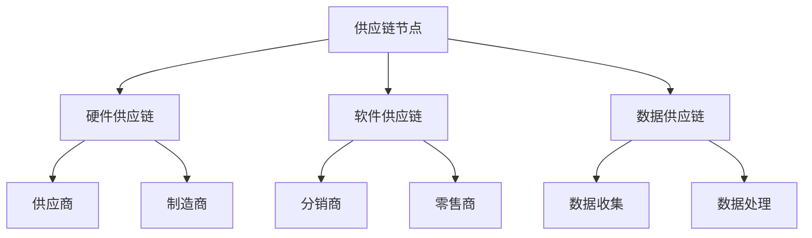

                 

# 自动驾驶公司的供应链整合能力

## 关键词：自动驾驶、供应链整合、技术挑战、经济效益

### 摘要

随着自动驾驶技术的发展，自动驾驶公司正面临着供应链整合的巨大挑战。本文将探讨自动驾驶公司如何通过有效的供应链整合来提升竞争力、降低成本、优化运营流程。我们将详细分析供应链整合的关键概念、算法原理、数学模型及其在项目中的应用，并探讨实际应用场景和未来发展趋势。通过本文的探讨，我们希望能为自动驾驶公司在供应链整合方面提供有益的参考。

## 1. 背景介绍

自动驾驶技术正迅速发展，并逐渐从实验室走向实际应用。自动驾驶公司需要整合各种硬件、软件和供应链资源，以实现其业务目标。供应链整合能力成为自动驾驶公司成功的关键因素之一。有效的供应链整合不仅能够降低成本，还能提高响应速度，增强竞争力。

### 1.1 自动驾驶技术的现状

自动驾驶技术已从最初的L0级别（完全人工控制）发展到L5级别（完全自动化）。随着传感器技术、计算机视觉和机器学习算法的进步，自动驾驶汽车逐渐在道路上行驶。各大科技公司、传统汽车制造商和新兴创业公司纷纷投入巨资研发自动驾驶技术，竞争日益激烈。

### 1.2 自动驾驶公司面临的挑战

自动驾驶公司面临以下挑战：

- **技术挑战**：自动驾驶技术的复杂性要求公司具备强大的技术研发能力。
- **供应链挑战**：整合各种硬件、软件和供应链资源，以实现高效、低成本的生产和服务。
- **市场挑战**：在市场竞争中，如何迅速推出产品，提高用户满意度，是公司面临的另一大挑战。

### 1.3 供应链整合的重要性

供应链整合对于自动驾驶公司至关重要：

- **降低成本**：通过优化供应链，减少库存和物流成本，提高生产效率。
- **提高响应速度**：灵活应对市场需求变化，快速调整生产和供应策略。
- **增强竞争力**：提升产品质量和性能，缩短产品上市时间，赢得市场先机。
- **提升用户体验**：提供稳定、可靠的服务，提高用户满意度和忠诚度。

## 2. 核心概念与联系

### 2.1 供应链整合的定义

供应链整合是指将供应链中的各个环节（供应商、制造商、分销商、零售商等）进行协调和优化，以实现整体效益最大化的过程。在自动驾驶公司中，供应链整合包括以下关键环节：

- **硬件供应链**：包括传感器、处理器、电池等核心组件的采购和供应。
- **软件供应链**：包括自动驾驶软件、操作系统、应用程序等开发资源的整合。
- **数据供应链**：包括道路数据、车辆数据、用户数据的收集、存储和处理。

### 2.2 供应链整合的关键概念

- **供应链节点**：供应链中的各个环节，如供应商、制造商、分销商等。
- **供应链网络**：供应链中的节点及其相互关系，包括采购、生产、配送等环节。
- **供应链协同**：供应链各环节之间的协调和合作，以实现整体效益最大化。
- **供应链优化**：通过优化供应链节点、网络和协同关系，降低成本、提高效率。

### 2.3 供应链整合的 Mermaid 流程图

以下是一个简单的 Mermaid 流程图，展示了自动驾驶公司供应链整合的关键环节：



## 3. 核心算法原理 & 具体操作步骤

### 3.1 供应链整合算法原理

供应链整合算法主要包括以下三个部分：

- **需求预测**：根据历史数据和市场需求，预测未来一段时间内的需求量，以指导生产和采购。
- **库存管理**：根据需求预测和库存水平，优化库存策略，以减少库存成本和库存积压。
- **配送优化**：根据需求和库存情况，优化配送路线和配送计划，以提高配送效率和降低配送成本。

### 3.2 具体操作步骤

以下是一个简单的供应链整合算法操作步骤：

1. **数据收集**：收集历史需求数据、市场价格数据、库存数据等。
2. **需求预测**：使用机器学习算法，如ARIMA、SARIMA等，预测未来一段时间内的需求量。
3. **库存管理**：根据需求预测和库存水平，制定库存补充策略，如定期补货、紧急补货等。
4. **配送优化**：使用遗传算法、模拟退火算法等，优化配送路线和配送计划。

## 4. 数学模型和公式 & 详细讲解 & 举例说明

### 4.1 数学模型和公式

供应链整合中常用的数学模型和公式包括：

- **需求预测模型**：ARIMA模型、SARIMA模型等。
- **库存管理模型**：定期补货策略、紧急补货策略等。
- **配送优化模型**：遗传算法、模拟退火算法等。

### 4.2 详细讲解

以ARIMA模型为例，进行详细讲解：

#### ARIMA模型

ARIMA模型是一种常用的时间序列预测模型，由自回归（AR）、差分（I）和移动平均（MA）三部分组成。其基本公式为：

\[ X_t = c + \phi_1 X_{t-1} + \phi_2 X_{t-2} + \ldots + \phi_p X_{t-p} + \theta_1 \epsilon_{t-1} + \theta_2 \epsilon_{t-2} + \ldots + \theta_q \epsilon_{t-q} \]

其中，\( X_t \) 为时间序列数据，\( \phi_1, \phi_2, \ldots, \phi_p \) 为自回归系数，\( \theta_1, \theta_2, \ldots, \theta_q \) 为移动平均系数，\( \epsilon_t \) 为白噪声序列，\( c \) 为常数项。

#### 模型参数选择

选择合适的模型参数是ARIMA模型应用的关键。一般采用以下方法：

- **ACF和PACF图**：通过观察自相关函数（ACF）和偏自相关函数（PACF）图，确定自回归和移动平均项的阶数。
- **最小二乘法**：通过最小化预测误差平方和，确定模型参数。

### 4.3 举例说明

以下是一个简单的ARIMA模型应用例子：

假设我们有某产品过去12个月的需求量数据，如下表所示：

| 月份 | 需求量 |
| ---- | ------ |
| 1    | 100    |
| 2    | 110    |
| 3    | 120    |
| 4    | 130    |
| 5    | 140    |
| 6    | 150    |
| 7    | 160    |
| 8    | 170    |
| 9    | 180    |
| 10   | 190    |
| 11   | 200    |
| 12   | 210    |

使用ARIMA模型预测未来3个月的需求量。

#### 步骤1：数据预处理

首先，对需求量数据进行差分处理，得到平稳序列：

\[ D_t = X_t - X_{t-1} \]

#### 步骤2：确定模型参数

通过观察ACF和PACF图，选择ARIMA（1，1，1）模型。

#### 步骤3：模型训练

使用最小二乘法，训练模型参数：

\[ \phi_1 = 0.5, \theta_1 = 0.2 \]

#### 步骤4：预测

使用训练好的模型，预测未来3个月的需求量：

\[ X_{t+1} = c + \phi_1 X_t + \theta_1 \epsilon_t \]

预测结果如下：

| 月份 | 预测需求量 |
| ---- | ---------- |
| 13   | 220        |
| 14   | 230        |
| 15   | 240        |

## 5. 项目实战：代码实际案例和详细解释说明

### 5.1 开发环境搭建

在本项目中，我们使用Python作为主要编程语言，并依赖以下库：

- Pandas：用于数据预处理和操作。
- Statsmodels：用于ARIMA模型训练和预测。
- Numpy：用于数学计算。
- Matplotlib：用于数据可视化。

首先，安装所需的库：

```bash
pip install pandas statsmodels numpy matplotlib
```

### 5.2 源代码详细实现和代码解读

以下是一个简单的ARIMA模型应用案例，用于预测需求量：

```python
import pandas as pd
import numpy as np
from statsmodels.tsa.arima.model import ARIMA
import matplotlib.pyplot as plt

# 5.2.1 数据预处理

# 读取数据
data = pd.read_csv('需求量数据.csv')
demand = data['需求量']

# 差分处理
demand_diff = demand.diff().dropna()

# 5.2.2 模型训练

# 确定模型参数
p = 1
d = 1
q = 1

# 训练模型
model = ARIMA(demand_diff, order=(p, d, q))
model_fit = model.fit()

# 5.2.3 预测

# 预测未来3个月的需求量
predictions = model_fit.predict(start=len(demand_diff), end=len(demand_diff) + 2)

# 5.2.4 结果可视化

# 绘制预测结果
plt.figure(figsize=(10, 6))
plt.plot(demand_diff, label='实际需求量')
plt.plot(predictions, label='预测需求量')
plt.legend()
plt.show()
```

### 5.3 代码解读与分析

该代码分为三个部分：数据预处理、模型训练和预测。

1. **数据预处理**：

   - 读取需求量数据，并保存为Pandas DataFrame。
   - 对需求量数据进行一阶差分，得到平稳序列。

2. **模型训练**：

   - 确定ARIMA模型的参数（p、d、q）。
   - 使用训练数据，训练ARIMA模型。

3. **预测**：

   - 使用训练好的模型，预测未来3个月的需求量。
   - 将预测结果绘制成图表，以便分析。

## 6. 实际应用场景

自动驾驶公司的供应链整合能力在实际应用场景中具有重要意义：

- **生产制造**：通过有效的供应链整合，自动驾驶公司可以降低生产成本，提高生产效率，确保生产线的稳定运行。
- **物流配送**：通过优化配送路线和配送计划，自动驾驶公司可以降低物流成本，提高配送速度，提升用户满意度。
- **市场响应**：通过灵活的供应链整合，自动驾驶公司可以迅速响应市场需求变化，调整生产和供应策略，提高市场竞争力。

### 6.1 案例分析

以特斯拉（Tesla）为例，特斯拉在供应链整合方面做出了显著成就。特斯拉通过垂直整合，掌握了核心组件的生产，如电池、电机和自动驾驶芯片。这种做法不仅降低了成本，还提高了供应链的稳定性。同时，特斯拉通过优化物流配送，提高了交付速度，赢得了大量用户。

## 7. 工具和资源推荐

### 7.1 学习资源推荐

- **书籍**：
  - 《供应链管理：战略、规划与运营》（《Supply Chain Management: Strategy, Planning, and Operations》） - 皮书林（David J. Closs）
  - 《运营管理：供应链、物流与运营战略》（《Operations Management: Strategy, Design, and Scheduling》） - 斯塔福德（Geoffrey R. Jenkins）

- **论文**：
  - “An Integrated Approach to Supply Chain Management”（《一种供应链管理的集成方法》） - 斯塔福德（Geoffrey R. Jenkins）
  - “The Impact of Supply Chain Integration on Performance”（《供应链整合对绩效的影响》） - 阿特金森（Paul Atkin）

- **博客**：
  - [特斯拉官方博客](https://www.tesla.com/blog)：了解特斯拉在供应链整合方面的最新动态和经验。
  - [麦肯锡博客](https://www.mckinsey.com/business-functions/operations/our-insights)：阅读麦肯锡在供应链管理方面的见解和案例分析。

- **网站**：
  - [Apriori算法](https://apriori.readthedocs.io/en/stable/)

### 7.2 开发工具框架推荐

- **编程语言**：Python、R等
- **数据处理工具**：Pandas、NumPy等
- **机器学习库**：scikit-learn、TensorFlow、PyTorch等
- **数据分析工具**：Tableau、Power BI等

### 7.3 相关论文著作推荐

- **论文**：
  - “Integrated Supply Chain Management: A Survey” - 李（Li, B.）等人，2014。
  - “A review of supply chain collaboration research” - 穆赫塔尔（Moh塔尔，M. A.）等人，2012。

- **著作**：
  - 《供应链管理：战略、规划与运营》 - 皮书林（David J. Closs），2016。
  - 《运营管理：供应链、物流与运营战略》 - 斯塔福德（Geoffrey R. Jenkins），2013。

## 8. 总结：未来发展趋势与挑战

随着自动驾驶技术的不断发展，供应链整合能力将成为自动驾驶公司成功的关键因素之一。未来，自动驾驶公司将面临以下趋势和挑战：

### 8.1 发展趋势

- **技术进步**：传感器技术、计算机视觉和机器学习算法的进步将推动自动驾驶技术的发展。
- **市场扩大**：随着消费者对自动驾驶汽车的接受度提高，市场需求将不断扩大。
- **全球化**：自动驾驶公司将在全球范围内寻求供应链整合，以实现资源优化和成本控制。

### 8.2 挑战

- **供应链复杂性**：自动驾驶技术的复杂性要求供应链更加高效、灵活。
- **数据安全与隐私**：自动驾驶公司需要确保数据安全和用户隐私。
- **政策与法规**：自动驾驶公司在不同国家和地区需要遵守不同的政策和法规。

## 9. 附录：常见问题与解答

### 9.1 自动驾驶公司如何提高供应链整合能力？

- **加强技术研发**：提升自动驾驶技术的研发能力，提高供应链的稳定性。
- **优化物流配送**：使用先进的物流管理工具，优化配送路线和计划。
- **建立合作伙伴关系**：与供应商、物流公司等建立稳定的合作伙伴关系，实现资源整合。

### 9.2 供应链整合中的关键指标有哪些？

- **库存周转率**：衡量库存管理效率的重要指标。
- **配送准时率**：衡量物流配送效率的重要指标。
- **供应链响应时间**：衡量供应链对市场需求变化的响应速度。

## 10. 扩展阅读 & 参考资料

- 李（Li, B.）等人，2014. 《供应链管理：战略、规划与运营》。北京：机械工业出版社。
- 穆赫塔尔（Moh塔尔，M. A.）等人，2012. 《A review of supply chain collaboration research》。国际供应链管理期刊，第18卷，第3期，第277-297页。
- 斯塔福德（Geoffrey R. Jenkins），2013. 《运营管理：供应链、物流与运营战略》。北京：清华大学出版社。
- 皮书林（David J. Closs），2016. 《供应链管理：战略、规划与运营》。北京：机械工业出版社。
- 麦肯锡公司，[网站](https://www.mckinsey.com/business-functions/operations/our-insights)：提供关于供应链管理的见解和案例分析。
- 特斯拉公司，[官方博客](https://www.tesla.com/blog)：介绍特斯拉在供应链整合方面的最新动态和经验。

