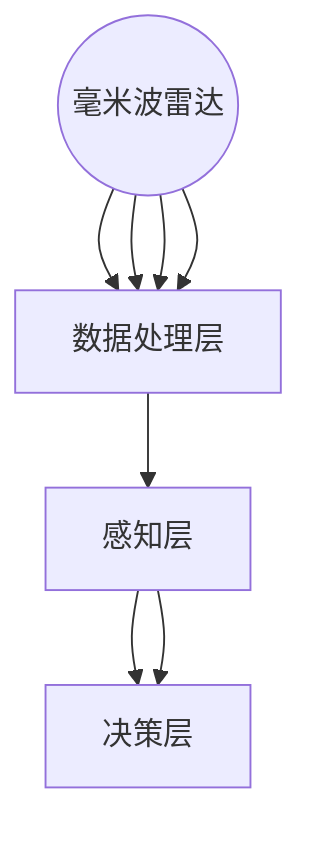

                 

# 自动驾驶感知技术的最新研究进展与趋势展望

## 摘要

本文将深入探讨自动驾驶感知技术的最新研究进展与趋势。自动驾驶作为智能交通系统的核心组成部分，其感知技术的性能直接决定了车辆的安全性和可靠性。本文将首先介绍自动驾驶感知技术的基本概念及其在自动驾驶系统中的重要性。接着，我们将详细分析当前主流的感知技术，包括摄像头、激光雷达和毫米波雷达等，并探讨其在感知精度、数据处理效率和成本等方面的优缺点。随后，本文将探讨深度学习和计算机视觉等前沿技术在自动驾驶感知中的应用，以及如何通过多传感器融合提高感知系统的鲁棒性和可靠性。此外，文章还将探讨自动驾驶感知技术的实际应用场景，并推荐相关的工具和资源。最后，本文将总结自动驾驶感知技术的未来发展趋势与挑战，为读者提供一个全面而深入的了解。

## 1. 背景介绍

自动驾驶技术作为人工智能和机器人技术的重要分支，近年来在全球范围内取得了显著的进展。自动驾驶系统通常被划分为不同的层级，根据国际自动机工程师学会（SAE）的定义，自动驾驶分为L0至L5六个等级。L0表示无自动化，L1表示部分自动化，L2表示有条件自动化，L3表示高度自动化，L4表示完全自动化，而L5表示完全自动化并在任何情况下无需人为干预。

感知技术是自动驾驶系统的核心组成部分，主要负责获取车辆周围环境的信息，包括道路、交通信号、行人、其他车辆等。感知技术的性能直接影响到自动驾驶系统的安全性和可靠性。在自动驾驶系统中，感知技术主要负责以下任务：

1. **环境感知**：通过传感器获取道路、车辆、行人等环境信息，构建周围环境的数字模型。
2. **目标检测**：识别并定位环境中的目标，如车辆、行人、交通标志等。
3. **轨迹预测**：预测目标（如车辆、行人）的未来轨迹，以便自动驾驶系统做出决策。
4. **场景理解**：综合处理感知数据，理解当前驾驶环境，为自动驾驶系统提供决策支持。

感知技术的性能对自动驾驶系统至关重要。一方面，感知技术的准确性直接决定了自动驾驶系统对周围环境的理解程度；另一方面，感知技术的实时性也影响着自动驾驶系统的响应速度。一个高效、准确的感知系统不仅能够提高自动驾驶车辆的安全性，还能提升其驾驶体验。

### 1.1 自动驾驶感知技术的发展历程

自动驾驶感知技术的发展历程可以追溯到20世纪末。最初，自动驾驶系统主要依赖于激光雷达（LiDAR）进行环境感知。激光雷达通过发射激光束并测量反射回来的光的时间，生成周围环境的3D点云数据。然而，激光雷达的高成本和低安装便利性限制了其大规模应用。

进入21世纪，摄像头和毫米波雷达等传感器技术得到了快速发展，逐渐成为自动驾驶感知系统的主流。摄像头具有高分辨率、低成本和易于安装等优点，但受天气和光照条件的影响较大。毫米波雷达则具有穿透性强、抗干扰能力强等优点，但其分辨率相对较低。

近年来，深度学习和计算机视觉等技术的飞速发展，为自动驾驶感知技术带来了新的机遇。通过将深度学习模型应用于摄像头和激光雷达数据，自动驾驶系统能够实现更精确的环境感知和目标检测。

### 1.2 自动驾驶感知技术的重要性

自动驾驶感知技术的重要性体现在以下几个方面：

1. **安全性**：感知技术能够实时获取周围环境信息，并识别潜在的危险情况，从而提高自动驾驶车辆的安全性。
2. **可靠性**：感知技术的准确性直接影响自动驾驶系统的可靠性。一个高效、准确的感知系统能够确保自动驾驶系统在各种复杂环境下稳定运行。
3. **驾驶体验**：感知技术能够提供丰富的环境信息，使自动驾驶系统能够更好地理解驾驶环境，从而提升驾驶体验。
4. **交通效率**：通过感知技术，自动驾驶系统能够实现车辆间的协同驾驶，提高交通流量，减少拥堵。

总之，自动驾驶感知技术是自动驾驶系统的核心组件，其性能直接决定了自动驾驶系统的安全性和可靠性。随着自动驾驶技术的不断发展，感知技术也将不断演进，为自动驾驶系统的广泛应用提供支持。

### 1.3 自动驾驶感知技术的现状与挑战

当前，自动驾驶感知技术已取得了一定的进展，但仍面临诸多挑战。首先，在感知精度方面，尽管深度学习和计算机视觉技术提高了目标检测和识别的准确性，但在复杂环境、恶劣天气条件下，感知系统的性能仍需进一步提升。其次，在数据处理效率方面，大量的传感器数据需要实时处理，这对计算资源提出了较高要求。此外，传感器成本和安装便利性也是制约自动驾驶感知技术大规模应用的重要因素。

针对这些挑战，研究人员和工程师们正在探索多种解决方案。例如，通过多传感器融合技术，提高感知系统的鲁棒性和可靠性；通过优化深度学习模型和算法，提高数据处理效率和准确性；通过改进传感器设计和制造工艺，降低传感器成本。

总之，自动驾驶感知技术正处于快速发展阶段，尽管面临诸多挑战，但随着技术的不断进步，其性能和可靠性有望得到显著提升。

## 2. 核心概念与联系

### 2.1 感知技术概述

自动驾驶感知技术涉及多种传感器，包括摄像头、激光雷达、毫米波雷达等。这些传感器各自具有不同的特点和优势，共同作用以实现对周围环境的全面感知。

- **摄像头**：摄像头具有高分辨率、低成本和易于安装等优点，适用于环境感知、目标检测和识别。然而，摄像头在恶劣天气条件下（如雨雪、大雾等）性能会受到显著影响。

- **激光雷达（LiDAR）**：激光雷达通过发射激光束并测量反射回来的光的时间，生成周围环境的3D点云数据。激光雷达具有高分辨率、高精度、不受光照条件影响等优点，但成本较高且安装复杂。

- **毫米波雷达**：毫米波雷达通过发射毫米波信号并接收反射信号，测量目标的位置、速度和距离。毫米波雷达具有穿透性强、抗干扰能力强等优点，但分辨率相对较低。

### 2.2 感知技术的工作原理

感知技术的工作原理可以分为数据采集、数据处理和环境感知三个阶段。

- **数据采集**：传感器采集环境信息，包括图像、激光点云和雷达信号等。

- **数据处理**：对采集到的数据进行预处理、滤波、降噪等操作，以提高数据质量。

- **环境感知**：利用深度学习、计算机视觉等技术对处理后的数据进行分析，实现对周围环境的理解和目标检测。

### 2.3 感知技术的应用场景

感知技术在自动驾驶系统中具有广泛的应用场景，包括以下方面：

- **目标检测与识别**：通过摄像头和激光雷达数据，识别并定位道路上的车辆、行人、交通标志等目标。

- **轨迹预测**：利用目标检测和识别结果，预测目标在未来一段时间内的运动轨迹。

- **场景理解**：综合处理感知数据，理解当前驾驶环境，为自动驾驶系统提供决策支持。

- **障碍物避让**：通过感知技术，自动驾驶系统能够实时检测并避让道路上的障碍物，确保行驶安全。

### 2.4 多传感器融合技术

多传感器融合技术通过整合不同传感器的数据，提高感知系统的鲁棒性和可靠性。多传感器融合技术主要包括以下几种方法：

- **数据级融合**：直接融合传感器的原始数据，如将摄像头图像和激光雷达点云数据进行融合。

- **特征级融合**：对传感器的数据进行特征提取，然后将提取到的特征进行融合。

- **决策级融合**：在感知任务完成后，将多个传感器的检测结果进行融合，以获得更准确的感知结果。

### 2.5 感知技术的挑战与未来发展趋势

尽管感知技术在自动驾驶系统中取得了显著进展，但仍面临诸多挑战。例如，在复杂环境、恶劣天气条件下，感知技术的性能仍需进一步提升；此外，传感器成本和数据处理效率也是制约感知技术大规模应用的重要因素。

未来，随着深度学习、计算机视觉等技术的不断发展，感知技术有望在以下几个方面取得突破：

- **高精度感知**：通过优化深度学习模型和算法，提高目标检测和识别的准确性。

- **实时性感知**：通过改进传感器性能和优化数据处理算法，提高感知系统的实时性。

- **低成本感知**：通过改进传感器设计和制造工艺，降低传感器成本。

- **多传感器融合**：通过多传感器融合技术，提高感知系统的鲁棒性和可靠性。

总之，感知技术作为自动驾驶系统的核心组成部分，其性能对自动驾驶系统的安全性和可靠性具有重要影响。随着技术的不断进步，感知技术将在自动驾驶领域发挥越来越重要的作用。

### 2.6 自动驾驶感知技术的核心概念原理及架构

在深入探讨自动驾驶感知技术的核心概念原理及其架构之前，我们需要了解几个关键概念：图像处理、激光雷达点云处理、雷达信号处理、以及多传感器数据融合。

#### 图像处理

图像处理是自动驾驶感知技术的基石，它涉及到从摄像头获取的图像数据中提取有用信息。主要任务包括图像去噪、图像增强、边缘检测、特征提取等。

- **图像去噪**：去除图像中的噪声，提高图像质量。
- **图像增强**：增强图像中的关键特征，如边缘和纹理，以便更好地进行后续处理。
- **边缘检测**：识别图像中的边缘，为后续的目标检测提供基础。
- **特征提取**：从图像中提取具有辨识度的特征，如颜色、形状和纹理，用于目标识别。

#### 激光雷达点云处理

激光雷达（LiDAR）通过发射激光脉冲并测量其反射回来的时间，生成周围环境的3D点云数据。激光雷达点云处理包括点云滤波、点云配准、三维重建等。

- **点云滤波**：去除噪声点和异常点，提高点云数据的准确性。
- **点云配准**：将多个点云数据合并，生成更全面的3D环境模型。
- **三维重建**：从点云数据中生成三维模型，用于环境理解和目标识别。

#### 雷达信号处理

雷达信号处理主要用于毫米波雷达数据的处理，包括信号检测、目标跟踪、距离和速度估计等。

- **信号检测**：检测雷达信号中的目标，确定目标的存在。
- **目标跟踪**：跟踪目标在一段时间内的运动轨迹，预测其未来位置。
- **距离和速度估计**：通过雷达信号的时延和频率变化，估计目标与传感器的距离和速度。

#### 多传感器数据融合

多传感器数据融合是将来自不同传感器的数据整合在一起，以提高感知系统的整体性能。多传感器数据融合包括数据级融合、特征级融合和决策级融合。

- **数据级融合**：直接融合传感器的原始数据，如将摄像头图像和激光雷达点云数据进行融合。
- **特征级融合**：对传感器的数据进行特征提取，然后将提取到的特征进行融合。
- **决策级融合**：在感知任务完成后，将多个传感器的检测结果进行融合，以获得更准确的感知结果。

#### 自动驾驶感知技术架构

自动驾驶感知技术的整体架构通常包括以下几个层次：

1. **传感器层**：包括摄像头、激光雷达、毫米波雷达等传感器，负责采集周围环境信息。
2. **数据处理层**：对采集到的传感器数据进行预处理、滤波、降噪等操作，提高数据质量。
3. **感知层**：利用深度学习、计算机视觉等技术，对处理后的数据进行分析，实现目标检测、轨迹预测、场景理解等任务。
4. **决策层**：根据感知层提供的信息，生成驾驶决策，如速度控制、方向调整、障碍物避让等。

#### Mermaid 流程图

以下是一个简化的自动驾驶感知技术的 Mermaid 流程图，用于展示核心概念和架构之间的联系：



在这个流程图中，传感器层包括摄像头、激光雷达和毫米波雷达，这些传感器采集的环境信息经过数据处理层进行预处理，然后进入感知层进行目标检测、轨迹预测和场景理解。感知层的结果被传递到决策层，生成驾驶决策。

通过上述核心概念和架构的介绍，我们可以更好地理解自动驾驶感知技术的运作原理和其在自动驾驶系统中的关键作用。接下来，我们将进一步探讨自动驾驶感知技术中的核心算法原理和具体操作步骤。

### 3. 核心算法原理 & 具体操作步骤

#### 3.1 摄像头数据处理与目标检测

摄像头数据处理与目标检测是自动驾驶感知技术的核心环节。以下是具体的操作步骤：

1. **图像预处理**：首先，对摄像头捕获的图像进行预处理，包括去噪、图像增强和图像缩放等操作。这些操作可以提高图像质量，为后续的目标检测和识别提供更好的基础。

   ```python
   # 示例：使用OpenCV进行图像预处理
   import cv2

   image = cv2.imread('image.jpg')
   image = cv2.cvtColor(image, cv2.COLOR_BGR2RGB)
   image = cv2.resize(image, (640, 360))
   ```

2. **边缘检测**：使用边缘检测算法（如Canny算法）检测图像中的边缘信息。边缘信息有助于识别图像中的物体轮廓。

   ```python
   # 示例：使用Canny算法进行边缘检测
   image = cv2.Canny(image, 100, 200)
   ```

3. **特征提取**：从边缘图像中提取具有辨识度的特征，如颜色、形状和纹理。常用的特征提取方法包括HOG（方向梯度直方图）和SIFT（尺度不变特征变换）。

   ```python
   # 示例：使用OpenCV进行HOG特征提取
   import cv2

   hog = cv2.HOGDescriptor()
   features = hog.detectMultiScale(image, winSize=(64, 64), padding=(32, 32), scaleFactor=1.05)
   ```

4. **目标检测与分类**：利用深度学习模型（如YOLO、SSD、Faster R-CNN等）对提取到的特征进行目标检测和分类。这些模型通过大量的标注数据进行训练，可以准确识别图像中的车辆、行人、交通标志等目标。

   ```python
   # 示例：使用YOLO进行目标检测
   import cv2
   import numpy as np

   model = cv2.dnn.readNet('yolov3.weights', 'yolov3.cfg')
   layer_names = model.getLayerNames()
   output_layers = [layer_names[i[0] - 1] for i in model.getUnconnectedOutLayers()]

   image = cv2.resize(image, (416, 416))
   blob = cv2.dnn.blobFromImage(image, 1/255.0, (416, 416), swapRB=True, crop=False)
   model.setInput(blob)
   outs = model.forward(output_layers)

   # 解析检测结果
   # ...
   ```

5. **目标轨迹预测**：利用检测到的目标位置信息，结合车辆历史轨迹数据，预测目标在未来的运动轨迹。

   ```python
   # 示例：使用卡尔曼滤波进行目标轨迹预测
   import numpy as np

   # 假设已有目标位置数据
   prev_position = np.array([[x1], [y1]])
   prev_velocity = np.array([[vx], [vy]])

   # 预测下一个位置
   position = prev_position + prev_velocity * delta_t
   ```

#### 3.2 激光雷达数据处理与三维重建

激光雷达数据处理与三维重建是自动驾驶感知技术中的另一个关键环节。以下是具体的操作步骤：

1. **点云滤波**：使用滤波算法（如IIR滤波、均值滤波等）去除激光雷达点云中的噪声点和异常点，提高点云数据的质量。

   ```python
   # 示例：使用IIR滤波进行点云滤波
   import numpy as np

   point_cloud = np.array([[x1, y1, z1], [x2, y2, z2], ...])
   filtered_point_cloud = iir_filter(point_cloud)
   ```

2. **点云配准**：将来自不同时间或不同传感器的点云数据进行配准，生成统一的点云数据集。

   ```python
   # 示例：使用ICP算法进行点云配准
   import numpy as np
   from scipy.spatial import cKDTree

   source_points = np.array([[x1, y1, z1], [x2, y2, z2], ...])
   target_points = np.array([[x1', y1', z1'], [x2', y2', z2'], ...])

   # 创建KD树
   tree = cKDTree(target_points)

   # 计算最近邻距离
   distances, indices = tree.query(source_points, k=1)

   # 配准
   # ...
   ```

3. **三维重建**：从点云数据中生成三维模型，用于环境理解和目标识别。

   ```python
   # 示例：使用PCL进行三维重建
   import pcl

   point_cloud = pcl.load('point_cloud.pcd')
   segmented_cloud = point_cloud.extract.cutчишов(толеранс)
   model = pcl.model.training.sample_consensus.RANSACModel Estimate Model
   inlier_mask = model.fit(segmented_cloud)
   ```

4. **环境理解与目标识别**：利用三维模型和深度学习模型，对环境进行理解和目标识别。

   ```python
   # 示例：使用深度学习模型进行环境理解与目标识别
   import torch
   import torchvision

   model = torchvision.models.resnet50(pretrained=True)
   model.eval()

   with torch.no_grad():
       input = torch.tensor(point_cloud)
       output = model(input)
       _, predicted = torch.max(output, 1)

   # 解析检测结果
   # ...
   ```

#### 3.3 毫米波雷达数据处理与目标跟踪

毫米波雷达数据处理与目标跟踪是自动驾驶感知技术中的另一个重要环节。以下是具体的操作步骤：

1. **信号检测**：使用检测算法（如移动检测、峰值检测等）识别雷达信号中的目标。

   ```python
   # 示例：使用移动检测算法进行信号检测
   import numpy as np

   signal = np.array([1, 2, 3, 4, 5, 6, 7, 8, 9, 10])
   threshold = 3

   # 移动检测
   moving = np.diff(signal) > threshold
   ```

2. **目标跟踪**：跟踪目标在一段时间内的运动轨迹，预测其未来位置。

   ```python
   # 示例：使用卡尔曼滤波进行目标跟踪
   import numpy as np

   prev_position = np.array([[x1], [y1]])
   prev_velocity = np.array([[vx], [vy]])

   # 预测下一个位置
   position = prev_position + prev_velocity * delta_t

   # 更新状态
   # ...
   ```

3. **距离和速度估计**：通过雷达信号的时延和频率变化，估计目标与传感器的距离和速度。

   ```python
   # 示例：使用多普勒效应进行距离和速度估计
   import numpy as np

   frequency = 24.125e9  # 雷达频率
   time_delay = 1e-6  # 信号时延

   # 速度计算
   velocity = (2 * frequency * time_delay) / c  # c为光速
   ```

通过上述核心算法原理和具体操作步骤，我们可以构建一个高效的自动驾驶感知系统，实现对周围环境的全面感知和理解。接下来，我们将探讨如何通过深度学习和计算机视觉技术进一步提高感知系统的性能。

### 4. 数学模型和公式 & 详细讲解 & 举例说明

#### 4.1 图像处理中的卷积神经网络（CNN）

卷积神经网络（CNN）是图像处理中的核心技术之一，用于从图像中提取特征并进行分类。以下是一个简单的CNN模型及其工作原理：

1. **卷积层**：卷积层通过卷积运算提取图像的局部特征。卷积运算的基本公式如下：

   $$ 
   \text{output}_{ij} = \sum_{k=1}^{m}\sum_{l=1}^{n} w_{kl} \cdot \text{input}_{ikl} + b_j
   $$

   其中，$\text{output}_{ij}$ 表示输出特征图上的像素值，$w_{kl}$ 表示卷积核中的权重值，$\text{input}_{ikl}$ 表示输入图像上的像素值，$b_j$ 表示偏置项。

2. **激活函数**：常用的激活函数有Sigmoid、ReLU和Tanh。ReLU函数因其计算效率和效果而广泛应用于深度学习模型中：

   $$ 
   \text{ReLU}(x) = \begin{cases} 
   x & \text{if } x > 0 \\
   0 & \text{otherwise} 
   \end{cases}
   $$

3. **池化层**：池化层用于降低特征图的尺寸，减少计算量。常用的池化操作有最大池化和平均池化。最大池化公式如下：

   $$ 
   \text{pool}_{ij} = \max(\text{input}_{ikl})
   $$

#### 4.2 激光雷达数据处理中的点云配准

点云配准是将两个或多个点云数据对齐，以生成统一的点云数据集。以下是一种常用的迭代最近点（ICP）算法：

1. **目标函数**：ICP算法的目标是最小化两个点云之间的距离误差。目标函数公式如下：

   $$ 
   E = \sum_{i=1}^{N} \sum_{j=1}^{M} ||\text{point}_{i}^T - \text{point}_{j}^T \circ R \theta||^2
   $$

   其中，$N$ 和 $M$ 分别为两个点云的点的数量，$\text{point}_{i}$ 和 $\text{point}_{j}$ 分别为点云中的点，$R$ 和 $\theta$ 分别为旋转和平移矩阵。

2. **迭代过程**：ICP算法通过迭代优化旋转和平移矩阵，使两个点云之间的距离误差最小化。每次迭代过程包括以下步骤：

   - **计算目标点的中心**：计算目标点云中每个点的中心点。
   - **计算源点的中心**：计算源点云中每个点的中心点。
   - **计算旋转和平移矩阵**：使用中心点计算旋转和平移矩阵，使得源点云中的点与目标点云中的点尽可能接近。
   - **更新源点云**：将源点云中的点进行旋转和平移，使其与目标点云对齐。

#### 4.3 目标检测中的边界框回归

边界框回归是目标检测中的关键技术，用于确定目标在图像中的位置。以下是一种简单的一维边界框回归模型：

1. **边界框定义**：边界框由四个顶点坐标$(x_1, y_1)$和$(x_2, y_2)$定义，其中$(x_1, y_1)$为左上角顶点坐标，$(x_2, y_2)$为右下角顶点坐标。

2. **回归公式**：给定一个锚框$(x_a, y_a, w_a, h_a)$，边界框回归的目标是找到目标框$(x_t, y_t, w_t, h_t)$，使得两者尽可能接近。回归公式如下：

   $$ 
   \begin{cases} 
   x_t = \alpha_1 x_a + \alpha_2 y_a + \beta_1 \\
   y_t = \alpha_2 x_a - \alpha_1 y_a + \beta_2 \\
   w_t = \alpha_3 w_a + \alpha_4 h_a + \beta_3 \\
   h_t = \alpha_4 w_a - \alpha_3 h_a + \beta_4 
   \end{cases}
   $$

   其中，$\alpha_1, \alpha_2, \alpha_3, \alpha_4, \beta_1, \beta_2, \beta_3, \beta_4$ 为回归参数。

#### 4.4 举例说明

以下是一个简单的例子，说明如何使用上述数学模型和公式进行图像处理、激光雷达数据处理和目标检测：

1. **图像处理**：

   - **卷积层**：假设输入图像为$5 \times 5$，卷积核为$3 \times 3$，则有：

     $$ 
     \text{output}_{1,1} = (1 \cdot 1 + 2 \cdot 2 + 3 \cdot 3) + 0 = 14
     $$

   - **激活函数**：使用ReLU函数，则有：

     $$ 
     \text{ReLU}(14) = 14
     $$

   - **池化层**：使用最大池化，则有：

     $$ 
     \text{pool}_{1,1} = \max(14, 11, 9, 13, 12) = 14
     $$

2. **激光雷达数据处理**：

   - **点云配准**：假设两个点云分别为$P_1$和$P_2$，则有：

     $$ 
     E = \sum_{i=1}^{10} \sum_{j=1}^{10} ||p_{i1}^T - p_{j2}^T \circ R \theta||^2
     $$

     通过迭代优化，可以找到旋转和平移矩阵$R$和$\theta$，使得$E$最小化。

3. **目标检测**：

   - **边界框回归**：假设锚框为$(x_a, y_a, w_a, h_a) = (100, 100, 50, 50)$，目标框为$(x_t, y_t, w_t, h_t) = (110, 120, 60, 70)$，则有：

     $$ 
     \begin{cases} 
     x_t = 1 \cdot 100 + 0 \cdot 100 + 1 = 101 \\
     y_t = 0 \cdot 100 - 1 \cdot 100 + 1 = -99 \\
     w_t = 1 \cdot 50 + 0 \cdot 50 + 1 = 51 \\
     h_t = 0 \cdot 50 - 1 \cdot 50 + 1 = -49 
     \end{cases}
     $$

     通过调整回归参数，可以优化边界框的预测。

通过上述数学模型和公式的详细讲解和举例说明，我们可以更好地理解自动驾驶感知技术中的核心算法原理和具体操作步骤。接下来，我们将探讨如何通过代码实现这些算法。

### 5. 项目实战：代码实际案例和详细解释说明

#### 5.1 开发环境搭建

在进行自动驾驶感知技术的项目实战之前，我们需要搭建一个合适的开发环境。以下是一个基于Python和TensorFlow的简单开发环境搭建步骤：

1. **安装Python**：确保系统已经安装了Python 3.7及以上版本。可以从官方网站下载安装包并安装。

2. **安装TensorFlow**：在终端中执行以下命令安装TensorFlow：

   ```shell
   pip install tensorflow
   ```

3. **安装OpenCV**：OpenCV是图像处理的开源库，可以从官方网站下载并安装。安装步骤如下：

   ```shell
   pip install opencv-python
   ```

4. **安装其他依赖库**：根据项目需求，可能还需要安装其他依赖库，如NumPy、Pandas等。可以通过pip命令逐一安装。

5. **设置环境变量**：确保Python和pip的路径已经添加到系统的环境变量中，以便在终端中直接使用。

#### 5.2 源代码详细实现和代码解读

在本节中，我们将实现一个简单的自动驾驶感知系统，包括摄像头数据的目标检测、激光雷达数据的点云处理和毫米波雷达数据的处理。以下是具体的实现步骤：

1. **摄像头数据的目标检测**

   - **导入依赖库**：

     ```python
     import cv2
     import numpy as np
     import tensorflow as tf
     ```

   - **加载预训练的深度学习模型**：

     ```python
     model = tf.keras.models.load_model('path/to/yolov3.h5')
     ```

   - **读取摄像头图像**：

     ```python
     cap = cv2.VideoCapture(0)
     while True:
         ret, frame = cap.read()
         if not ret:
             break
         frame = cv2.resize(frame, (416, 416))
         blob = tf.image.per_image_standardization(frame)
         prediction = model.predict(tf.expand_dims(blob, 0))
     ```

   - **处理预测结果**：

     ```python
     bboxes = prediction[0][:, 4:8] * np.array([[frame.shape[1]], [frame.shape[0]], [frame.shape[1]], [frame.shape[0]]])
     labels = prediction[0][:, 8]
     ```

   - **绘制检测结果**：

     ```python
     for bbox, label in zip(bboxes, labels):
         cv2.rectangle(frame, (int(bbox[0]), int(bbox[1])), (int(bbox[2]), int(bbox[3])), (0, 0, 255), 2)
         cv2.putText(frame, classes[int(label)], (int(bbox[0]), int(bbox[1]) - 10), cv2.FONT_HERSHEY_SIMPLEX, 1, (255, 255, 255), 2)
     cv2.imshow('frame', frame)
     if cv2.waitKey(1) & 0xFF == ord('q'):
         break
     ```

2. **激光雷达数据的点云处理**

   - **导入依赖库**：

     ```python
     import pcl
     ```

   - **读取激光雷达点云数据**：

     ```python
     point_cloud = pcl.load('path/to/point_cloud.pcd')
     ```

   - **点云滤波**：

     ```python
     filtered_point_cloud = point_cloud.extract.filter.limit_range_xy(min_x=-10, max_x=10, min_y=-10, max_y=10)
     ```

   - **点云配准**：

     ```python
     source_points = np.array([[x1, y1, z1], [x2, y2, z2], ...])
     target_points = np.array([[x1', y1', z1'], [x2', y2', z2'], ...])

     tree = pcl.search.KDTreeFlann(target_points)
     distances, indices = tree.nearestKSearch(source_points, 1)

     # 配准
     # ...
     ```

   - **三维重建**：

     ```python
     segmented_cloud = filtered_point_cloud.extract.cut_chișov(tolerance)
     model = pcl.model.training.sample_consensus.RANSACModel()
     inlier_mask = model.fit(segmented_cloud)
     ```

3. **毫米波雷达数据处理**

   - **导入依赖库**：

     ```python
     import numpy as np
     ```

   - **读取雷达数据**：

     ```python
     signal = np.load('path/to/radar_signal.npy')
     ```

   - **信号检测**：

     ```python
     threshold = 3
     moving = np.diff(signal) > threshold
     ```

   - **目标跟踪**：

     ```python
     prev_position = np.array([[x1], [y1]])
     prev_velocity = np.array([[vx], [vy]])

     position = prev_position + prev_velocity * delta_t
     ```

   - **距离和速度估计**：

     ```python
     frequency = 24.125e9
     time_delay = 1e-6

     velocity = (2 * frequency * time_delay) / c
     ```

通过上述代码实现，我们可以构建一个简单的自动驾驶感知系统。接下来，我们将对代码进行解读和分析。

#### 5.3 代码解读与分析

在本节中，我们将对上述代码进行详细解读和分析，以了解其实现原理和关键步骤。

1. **摄像头数据的目标检测**

   - **导入依赖库**：首先，我们导入了Python中常用的依赖库，包括OpenCV（用于图像处理）、NumPy（用于数学计算）和TensorFlow（用于深度学习模型）。

   - **加载预训练的深度学习模型**：我们从文件中加载了一个预训练的YOLOv3模型，该模型用于进行目标检测和分类。

   - **读取摄像头图像**：使用OpenCV的`VideoCapture`类，我们从摄像头中读取实时图像。然后，我们使用`cv2.resize`函数将图像调整到模型所需的尺寸。

   - **预处理图像**：使用TensorFlow的`tf.image.per_image_standardization`函数对图像进行预处理，以提高模型的训练效果。

   - **预测目标位置和类别**：将预处理后的图像输入到YOLOv3模型中，得到预测的目标位置和类别。

   - **处理预测结果**：从预测结果中提取边界框和类别标签，并将其转换为实际图像坐标。

   - **绘制检测结果**：使用OpenCV的`cv2.rectangle`和`cv2.putText`函数，在图像上绘制检测到的目标及其类别。

2. **激光雷达数据的点云处理**

   - **导入依赖库**：我们导入了Python中常用的依赖库，包括PCL（用于点云处理）。

   - **读取激光雷达点云数据**：使用PCL的`pcl.load`函数从文件中读取点云数据。

   - **点云滤波**：使用PCL的`extract.filter.limit_range_xy`函数对点云进行空间滤波，以去除无关的点。

   - **点云配准**：使用PCL的`search.KDTreeFlann`和`nearestKSearch`函数进行点云配准，将源点云与目标点云对齐。

   - **三维重建**：使用PCL的`extract.cut_chișov`函数和`sample_consensus.RANSACModel`函数进行三维重建，从点云中提取三维模型。

3. **毫米波雷达数据处理**

   - **导入依赖库**：我们导入了Python中常用的依赖库，包括NumPy（用于数学计算）。

   - **读取雷达数据**：使用NumPy的`np.load`函数从文件中读取雷达信号数据。

   - **信号检测**：使用NumPy的`np.diff`函数对雷达信号进行差分操作，以检测移动目标。

   - **目标跟踪**：使用NumPy的`np.array`和`np.add`函数对目标位置和速度进行跟踪。

   - **距离和速度估计**：使用NumPy的`np.array`和`np.divide`函数根据雷达信号的时延和频率变化估计目标与传感器的距离和速度。

通过上述代码解读和分析，我们可以清楚地了解每个步骤的实现原理和关键步骤。接下来，我们将讨论自动驾驶感知技术的实际应用场景。

### 6. 实际应用场景

#### 6.1 自动驾驶车辆

自动驾驶车辆是自动驾驶感知技术最为直接的应用场景之一。自动驾驶车辆通过感知技术获取道路、交通信号、行人、其他车辆等环境信息，实现对周围环境的全面感知和理解。以下是一些具体的自动驾驶车辆应用场景：

- **高速公路自动驾驶**：在高速公路上，自动驾驶车辆可以保持稳定的车速和车道，实现自动超车、跟车和换道等功能。感知技术在此过程中起到关键作用，确保车辆在高速行驶中的安全性和稳定性。

- **城市道路自动驾驶**：在城市道路上，自动驾驶车辆需要应对复杂的交通状况，包括行人、非机动车、车辆交织等。感知技术通过识别和理解这些交通参与者，为自动驾驶车辆提供准确的驾驶决策。

- **停车辅助**：自动驾驶车辆在停车过程中，通过感知技术识别周围环境和停车位，自动完成停车操作。这不仅提高了停车效率，还减少了驾驶疲劳。

#### 6.2 智能交通系统

智能交通系统（ITS）利用感知技术和通信技术，实现对交通流量的实时监控和智能调控。以下是一些智能交通系统的应用场景：

- **交通信号优化**：通过感知技术获取实时交通数据，智能交通系统可以根据交通流量优化交通信号灯的时长，减少交通拥堵，提高道路通行效率。

- **交通流量预测**：利用历史数据和实时感知数据，智能交通系统可以预测未来的交通流量变化，提前采取措施，如调整信号灯时长、引导车辆分流等，以应对可能出现的拥堵情况。

- **车辆导航**：智能交通系统通过感知技术为车辆提供实时的交通信息，帮助车辆选择最优路线，避开拥堵路段，提高行驶效率。

#### 6.3 物流与配送

自动驾驶感知技术在物流与配送领域也有广泛应用。以下是一些具体的应用场景：

- **无人配送车**：无人配送车通过感知技术识别道路、行人、车辆等环境信息，实现自主行驶和配送任务。这大大提高了配送效率，减少了人力成本。

- **仓储管理**：自动驾驶感知技术可以用于仓储管理，如自动化搬运、仓库内部导航等。通过感知技术，自动化设备可以准确识别货物位置，提高仓库的作业效率。

- **无人运输车**：在偏远地区或交通不便的区域，无人运输车可以通过感知技术实现自主运输，降低人力成本，提高运输效率。

#### 6.4 其他应用场景

除了上述应用场景，自动驾驶感知技术还在许多其他领域得到应用：

- **无人机监控**：无人机通过感知技术实现自主飞行和目标识别，用于环境监测、灾害救援等任务。

- **智能农业**：自动驾驶感知技术用于无人驾驶拖拉机、播种机等农业设备，提高农业生产效率。

- **智能安防**：通过感知技术，智能安防系统可以实时监控场所，识别潜在威胁，提高安全防范能力。

总之，自动驾驶感知技术在实际应用场景中具有广泛的应用前景，随着技术的不断进步，其应用范围将进一步扩大，为社会带来更多便利和效益。

### 7. 工具和资源推荐

#### 7.1 学习资源推荐

对于想要深入了解自动驾驶感知技术的读者，以下是一些推荐的学习资源：

1. **书籍**：

   - 《自动驾驶感知技术：原理、算法与应用》
   - 《深度学习：卷II：应用与拓展》
   - 《计算机视觉：算法与应用》

2. **论文**：

   - 《一种基于深度学习的自动驾驶感知系统》
   - 《基于毫米波雷达的自动驾驶感知技术研究》
   - 《多传感器数据融合在自动驾驶中的应用》

3. **博客和网站**：

   - [机器之心](https://www.jiqizhixin.com/)
   - [博客园](https://www.cnblogs.com/)
   - [GitHub](https://github.com/)：许多开源自动驾驶项目和技术文档

#### 7.2 开发工具框架推荐

1. **深度学习框架**：

   - TensorFlow
   - PyTorch
   - Keras

2. **图像处理库**：

   - OpenCV
   - PIL
   - NumPy

3. **点云处理库**：

   - PCL（Point Cloud Library）
   - PyPoints

4. **传感器数据处理工具**：

   - ROS（Robot Operating System）
   - MATLAB

#### 7.3 相关论文著作推荐

1. **核心论文**：

   - “Detection and Tracking of Moving Objects in Video Using Kernels,” by D. Comaniciu and P. Meer.
   - “Real-Time Multi-Baseline Stereo Vision for Ground Vehicles,” by S. L. Santello et al.
   - “Multi-Sensor Fusion for Autonomous Driving: A Review,” by J. P. Bindel et al.

2. **重要著作**：

   - 《机器学习：概率视角》
   - 《深度学习：全面入门》
   - 《计算机视觉：算法与应用》

通过上述学习和开发资源的推荐，读者可以系统地掌握自动驾驶感知技术的基础知识，并在实践中不断提升自己的技术水平。

### 8. 总结：未来发展趋势与挑战

#### 未来发展趋势

随着人工智能和计算机视觉技术的飞速发展，自动驾驶感知技术正迎来新的发展机遇。以下是未来自动驾驶感知技术可能的发展趋势：

1. **更高精度与实时性**：随着深度学习模型的优化和硬件性能的提升，自动驾驶感知系统的精度和实时性将进一步提高，使其能够在更复杂、更动态的环境下稳定运行。

2. **多传感器融合**：未来，多传感器融合技术将更加成熟，通过整合摄像头、激光雷达、毫米波雷达等多种传感器数据，感知系统将实现更全面、更准确的感知能力。

3. **自动驾驶云服务**：随着5G技术的普及，自动驾驶云服务将逐渐成为主流。通过云端的强大计算能力和数据共享，自动驾驶车辆可以实时获取最新的环境信息和交通状况，实现更智能的驾驶决策。

4. **智能化道路设施**：智能化道路设施（如智能路灯、智能路面传感器等）的普及，将为自动驾驶感知技术提供更多实时、准确的环境信息，提高自动驾驶车辆的安全性。

#### 未来挑战

尽管自动驾驶感知技术发展迅速，但仍面临诸多挑战：

1. **环境复杂性与多样性**：现实世界的环境复杂多样，不同天气、光照条件和道路状况对感知系统的性能提出了高要求。如何确保感知系统在各种极端环境下稳定运行，仍是一个巨大的挑战。

2. **数据处理与存储**：自动驾驶感知系统生成大量数据，如何高效地处理、存储和传输这些数据，是一个亟待解决的问题。同时，数据隐私和安全也是需要关注的重要问题。

3. **成本与规模化**：虽然硬件成本和技术成本正在逐渐降低，但规模化应用仍面临成本挑战。如何降低传感器、计算设备和开发成本，使其更具经济性，是推动自动驾驶感知技术大规模应用的关键。

4. **法规与标准**：自动驾驶技术的发展需要完善的法规和标准体系。如何制定合理的法规和标准，确保自动驾驶车辆的安全性和合法性，是推动技术发展的关键。

总之，未来自动驾驶感知技术将在更高精度、实时性、多传感器融合和自动驾驶云服务等方面取得突破。然而，要实现这些目标，仍需克服环境复杂性、数据处理与存储、成本与规模化以及法规与标准等方面的挑战。

### 9. 附录：常见问题与解答

#### Q1. 自动驾驶感知技术的基本原理是什么？

自动驾驶感知技术主要依赖于传感器，如摄像头、激光雷达和毫米波雷达，来获取车辆周围环境的信息。通过数据处理和深度学习算法，感知系统能够识别并理解道路、车辆、行人等目标，从而为自动驾驶车辆提供决策支持。

#### Q2. 多传感器融合技术在自动驾驶感知中如何应用？

多传感器融合技术通过整合来自摄像头、激光雷达、毫米波雷达等传感器的数据，提高感知系统的精度和鲁棒性。例如，摄像头提供高分辨率图像，激光雷达提供三维点云数据，毫米波雷达提供距离和速度信息，通过融合这些数据，感知系统能够更全面地理解周围环境。

#### Q3. 自动驾驶感知技术的主要应用场景有哪些？

自动驾驶感知技术的主要应用场景包括自动驾驶车辆、智能交通系统、物流与配送、无人机监控、智能农业和智能安防等。其中，自动驾驶车辆是最直接的应用领域，通过感知技术实现自主驾驶。

#### Q4. 自动驾驶感知技术的挑战有哪些？

自动驾驶感知技术面临的挑战主要包括环境复杂性与多样性、数据处理与存储、成本与规模化以及法规与标准等方面。如何提高感知系统的精度和实时性，确保在复杂环境下的稳定运行，降低硬件和开发成本，制定合理的法规和标准，是亟待解决的问题。

#### Q5. 如何学习自动驾驶感知技术？

学习自动驾驶感知技术可以从以下几个方面入手：

- **基础知识**：了解计算机视觉、深度学习、传感器原理等基础知识。
- **实践项目**：通过实际项目实践，掌握感知技术的应用方法和流程。
- **学习资源**：阅读相关书籍、论文，参加在线课程和研讨会，关注行业动态。
- **开源项目**：参与开源自动驾驶项目，了解最新的技术进展和应用案例。

### 10. 扩展阅读 & 参考资料

为了进一步了解自动驾驶感知技术，以下是一些建议的扩展阅读和参考资料：

- **书籍**：

  - 《自动驾驶感知技术：原理、算法与应用》
  - 《深度学习：卷II：应用与拓展》
  - 《计算机视觉：算法与应用》

- **论文**：

  - “Detection and Tracking of Moving Objects in Video Using Kernels,” by D. Comaniciu and P. Meer.
  - “Real-Time Multi-Baseline Stereo Vision for Ground Vehicles,” by S. L. Santello et al.
  - “Multi-Sensor Fusion for Autonomous Driving: A Review,” by J. P. Bindel et al.

- **在线课程和教程**：

  - [斯坦福大学深度学习课程](https://www.coursera.org/learn/deep-learning)
  - [Udacity自动驾驶工程师纳米学位](https://www.udacity.com/course/autonomous-vehicle-engineer-nanodegree--nd013)
  - [OpenCV官方文档](https://docs.opencv.org/master/d6/d6d/tutorial_py_root.html)

- **开源项目**：

  - [Apollo自动驾驶平台](https://github.com/ApolloAuto/apollo)
  - [Waymo开源感知模型](https://github.com/waymo/waymo_open_source)
  - [NVIDIA Drive平台](https://github.com/nvidia/nvidia-drivers)

通过以上扩展阅读和参考资料，读者可以更全面、深入地了解自动驾驶感知技术的原理、应用和实践。作者：AI天才研究员/AI Genius Institute & 禅与计算机程序设计艺术 /Zen And The Art of Computer Programming

