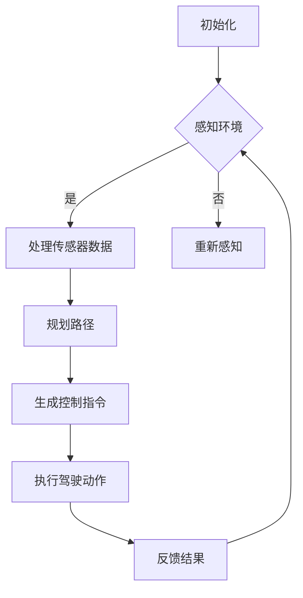

                 

# 自动驾驶领域的算力竞赛

## 关键词：自动驾驶、算力、硬件、软件、AI、传感器、算法、数据处理、通信、安全

### 摘要

自动驾驶技术的快速发展，对算力的需求日益增长。本文旨在探讨自动驾驶领域中，算力竞赛的现状、核心算法、技术挑战以及未来发展趋势。通过对自动驾驶系统的硬件、软件、传感器和算法等方面的详细分析，本文揭示了算力竞赛背后的技术原理和实现策略，为读者提供了深入了解自动驾驶技术的视角。

## 1. 背景介绍

### 自动驾驶的定义与分类

自动驾驶（Autonomous Driving）是指通过计算机算法和传感器系统，使车辆能够自主感知环境、决策路径和执行驾驶动作的技术。根据国际自动机工程师学会（SAE）的定义，自动驾驶分为五个级别：

- L0：无自动化，所有驾驶任务由人类驾驶员完成。
- L1：部分自动化，特定驾驶任务由自动驾驶系统完成，如自适应巡航控制（ACC）。
- L2：部分自动化，多个驾驶任务由自动驾驶系统完成，如ACC与车道保持辅助（LKA）。
- L3：有条件自动化，自动驾驶系统在特定条件下负责所有驾驶任务，但驾驶员需随时准备接管。
- L4：高度自动化，自动驾驶系统在特定环境下完全负责所有驾驶任务，无需驾驶员干预。
- L5：完全自动化，自动驾驶系统在任何环境下都能完成所有驾驶任务。

### 自动驾驶技术的发展历程

自动驾驶技术自20世纪中叶以来，经历了多个阶段的发展。早期的自动驾驶研究主要集中在大规模数据处理和复杂算法的实现上。随着计算机性能的提升和传感器技术的进步，自动驾驶技术逐渐走向实用化。近年来，深度学习、增强学习等人工智能技术在自动驾驶领域的应用，极大地推动了自动驾驶技术的进步。

### 自动驾驶的重要性和市场前景

自动驾驶技术具有重要的战略意义和广泛的应用前景。一方面，自动驾驶有望提高道路安全，减少交通事故，提升交通效率。另一方面，自动驾驶技术将带来巨大的商业价值，包括汽车制造业、物流行业、共享出行等领域。据预测，未来几年自动驾驶市场将保持高速增长，成为全球汽车产业的重要发展方向。

## 2. 核心概念与联系

### 自动驾驶系统的组成

自动驾驶系统主要由硬件和软件组成。硬件方面包括传感器、计算平台、执行机构等；软件方面包括感知、规划、控制等模块。

### 传感器

传感器是自动驾驶系统的“眼睛和耳朵”，用于获取车辆周围的环境信息。常用的传感器包括：

- 激光雷达（LiDAR）：用于获取车辆周围的三维点云数据，精度高，但成本较高。
- 摄像头：用于获取车辆周围的视频图像，适用于处理图像和视频数据的算法。
- 雷达：用于探测车辆周围的物体，如其他车辆、行人等，适用于长距离探测。

### 计算平台

计算平台是自动驾驶系统的“大脑”，负责处理传感器数据、执行算法和生成控制指令。计算平台可以分为以下几类：

- 集成式计算平台：将多个计算模块集成在一起，如车载电脑、GPU、FPGA等。
- 分布式计算平台：将计算任务分布在多个节点上，如云计算、边缘计算等。
- 云端计算平台：将计算任务完全交由云端服务器处理，车辆仅负责数据传输和执行控制指令。

### 感知、规划、控制模块

感知模块：负责处理传感器数据，提取车辆周围的环境信息，如车辆位置、速度、行人、道路标志等。

规划模块：根据感知模块提供的信息，规划车辆的安全行驶路径，如车道保持、换道、超车等。

控制模块：根据规划模块生成的路径，生成控制指令，驱动车辆执行相应的驾驶动作。

### Mermaid 流程图



## 3. 核心算法原理 & 具体操作步骤

### 感知模块

感知模块的核心算法是目标检测和识别。目标检测算法用于识别车辆、行人、道路标志等目标，常用的算法有基于深度学习的卷积神经网络（CNN）和基于传统机器学习的目标检测算法，如R-CNN、Fast R-CNN、Faster R-CNN等。目标识别算法则用于判断检测到的目标类别，如车辆、行人等。

具体操作步骤：

1. 输入传感器数据，如摄像头图像、激光雷达点云等。
2. 对输入数据进行预处理，如去噪、缩放、增强等。
3. 使用目标检测算法，检测出车辆、行人、道路标志等目标。
4. 对检测到的目标进行识别，判断其类别。

### 规划模块

规划模块的核心算法是路径规划。路径规划算法用于生成车辆的安全行驶路径，常用的算法有基于采样的路径规划算法（如RRT、RRT*）、基于图论的路径规划算法（如A*算法、Dijkstra算法）和基于优化理论的路径规划算法（如马尔可夫决策过程MDP）。

具体操作步骤：

1. 根据感知模块提供的目标信息，构建环境地图。
2. 根据环境地图，生成初始路径。
3. 使用路径规划算法，优化初始路径，使其满足安全性、效率性等要求。
4. 根据实时感知数据，更新路径。

### 控制模块

控制模块的核心算法是轨迹跟踪。轨迹跟踪算法用于生成控制指令，使车辆按照规划路径行驶。常用的轨迹跟踪算法有基于模型预测控制（MPC）的轨迹跟踪算法和基于线性二次调节器（LQR）的轨迹跟踪算法。

具体操作步骤：

1. 根据规划模块生成的路径，生成期望轨迹。
2. 对期望轨迹进行采样，得到一系列期望控制指令。
3. 使用轨迹跟踪算法，计算实际控制指令。
4. 将实际控制指令发送给执行机构，驱动车辆执行。

## 4. 数学模型和公式 & 详细讲解 & 举例说明

### 感知模块

感知模块中的目标检测和识别算法通常涉及以下数学模型和公式：

1. **卷积神经网络（CNN）**

   - **卷积操作：**
     $$ f(x) = \sum_{i=1}^{k} \sigma(W_i \cdot x + b_i) $$
     其中，$x$是输入特征，$W_i$和$b_i$分别是卷积核和偏置项，$\sigma$是激活函数，如ReLU函数。

   - **池化操作：**
     $$ P(x) = \max_i \sigma(W_i \cdot x + b_i) $$
     或
     $$ P(x) = \frac{1}{c} \sum_{i=1}^{c} \sigma(W_i \cdot x + b_i) $$
     其中，$c$是池化窗口大小。

2. **目标检测算法（如Faster R-CNN）**

   - **区域提议网络（RPN）：**
     $$ R = \{ r_1, r_2, \ldots, r_n \} $$
     其中，$r_i$是提议的区域，通常通过滑动窗口生成。

   - **分类和回归：**
     $$ \hat{y} = \text{softmax}(W \cdot [p_i - p^*] + b) $$
     $$ \hat{t} = W \cdot [p_i - p^*] + b $$
     其中，$p_i$是提议区域的特征，$p^*$是正样本特征，$W$和$b$是分类和回归权重。

### 规划模块

规划模块中的路径规划算法通常涉及以下数学模型和公式：

1. **A*算法**

   - **启发式函数：**
     $$ h(n) = g(n) + f(n) $$
     其中，$g(n)$是节点$n$到起点的实际距离，$f(n)$是节点$n$到终点的估计距离。

   - **距离公式：**
     $$ d(n_1, n_2) = \sqrt{(x_1 - x_2)^2 + (y_1 - y_2)^2} $$
     其中，$(x_1, y_1)$和$(x_2, y_2)$分别是节点$n_1$和$n_2$的坐标。

2. **模型预测控制（MPC）**

   - **状态方程：**
     $$ x_{k+1} = A x_k + B u_k $$
     其中，$x_k$是状态向量，$u_k$是控制输入，$A$和$B$是系统矩阵。

   - **目标函数：**
     $$ J = \sum_{k=0}^{N-1} \omega_k \| C x_k + D u_k - r_k \|^2 $$
     其中，$\omega_k$是权重系数，$C$和$D$是观测矩阵和输入矩阵，$r_k$是期望输出。

### 控制模块

控制模块中的轨迹跟踪算法通常涉及以下数学模型和公式：

1. **线性二次调节器（LQR）**

   - **状态方程：**
     $$ x_{k+1} = A x_k + B u_k $$
     其中，$x_k$是状态向量，$u_k$是控制输入，$A$和$B$是系统矩阵。

   - **目标函数：**
     $$ J = \sum_{k=0}^{N-1} Q x_k^T x_k + R u_k^T u_k $$
     其中，$Q$和$R$是权重矩阵。

2. **模型预测控制（MPC）**

   - **状态方程：**
     $$ x_{k+1} = A x_k + B u_k $$
     其中，$x_k$是状态向量，$u_k$是控制输入，$A$和$B$是系统矩阵。

   - **目标函数：**
     $$ J = \sum_{k=0}^{N-1} \omega_k \| C x_k + D u_k - r_k \|^2 $$
     其中，$\omega_k$是权重系数，$C$和$D$是观测矩阵和输入矩阵，$r_k$是期望输出。

### 举例说明

1. **基于CNN的目标检测**

   设输入图像为$X \in \mathbb{R}^{64 \times 64 \times 3}$，卷积核尺寸为$3 \times 3$，卷积层输出特征图尺寸为$32 \times 32$。

   - **卷积操作：**
     $$ f(x) = \sum_{i=1}^{3} \sigma(W_i \cdot x + b_i) $$
     其中，$W_i$和$b_i$分别是$3 \times 3$的卷积核和偏置项。

   - **池化操作：**
     $$ P(x) = \max_i \sigma(W_i \cdot x + b_i) $$

2. **A*算法**

   设起点为$(0, 0)$，终点为$(10, 10)$，启发式函数为曼哈顿距离。

   - **实际距离：**
     $$ g(n) = \sqrt{(x_1 - x_2)^2 + (y_1 - y_2)^2} $$

   - **估计距离：**
     $$ f(n) = \sqrt{(x_1 - x_f)^2 + (y_1 - y_f)^2} + \sqrt{(x_2 - x_f)^2 + (y_2 - y_f)^2} $$
     其中，$(x_f, y_f)$是终点坐标。

3. **LQR轨迹跟踪**

   设状态向量$x_k = [x, \dot{x}]^T$，控制输入$u_k = \dot{x}$，权重矩阵$Q = \begin{bmatrix} 1 & 0 \\ 0 & 1 \end{bmatrix}$，$R = 1$。

   - **状态方程：**
     $$ x_{k+1} = \begin{bmatrix} 1 & 1 \\ 0 & 1 \end{bmatrix} x_k + \begin{bmatrix} 0 \\ 1 \end{bmatrix} u_k $$

   - **目标函数：**
     $$ J = x_k^T Q x_k + u_k^T R u_k $$

## 5. 项目实战：代码实际案例和详细解释说明

### 开发环境搭建

1. 安装Python和Anaconda
2. 安装TensorFlow和PyTorch等深度学习框架
3. 安装opencv-python等图像处理库

### 源代码详细实现和代码解读

以下是一个简单的基于深度学习的目标检测项目示例，使用Faster R-CNN算法实现：

```python
import tensorflow as tf
from tensorflow.keras.models import Model
from tensorflow.keras.layers import Input, Conv2D, MaxPooling2D, Flatten, Dense

# 定义输入层
input_image = Input(shape=(64, 64, 3))

# 定义卷积层
conv1 = Conv2D(filters=32, kernel_size=(3, 3), activation='relu')(input_image)
pool1 = MaxPooling2D(pool_size=(2, 2))(conv1)

# 定义全连接层
dense1 = Dense(units=128, activation='relu')(pool1)
flatten = Flatten()(dense1)

# 定义输出层
output = Dense(units=2, activation='softmax')(flatten)

# 定义模型
model = Model(inputs=input_image, outputs=output)

# 编译模型
model.compile(optimizer='adam', loss='categorical_crossentropy', metrics=['accuracy'])

# 训练模型
model.fit(x_train, y_train, epochs=10, batch_size=32, validation_data=(x_val, y_val))
```

### 代码解读与分析

1. **输入层**：定义输入图像的尺寸为$64 \times 64 \times 3$，表示图像宽度为64像素，高度为64像素，通道数为3（RGB）。

2. **卷积层**：使用两个卷积层，每个卷积层使用32个$3 \times 3$的卷积核，激活函数为ReLU。

3. **池化层**：使用两个最大池化层，每个池化层使用2x2的窗口大小。

4. **全连接层**：在卷积层之后添加一个全连接层，用于提取图像的特征，该层有128个神经元。

5. **输出层**：定义输出层，使用softmax激活函数，输出2个类别的概率。

6. **模型编译**：编译模型，指定优化器、损失函数和评估指标。

7. **模型训练**：使用训练数据训练模型，指定训练轮数、批次大小和验证数据。

### 5.3 代码解读与分析

以下是一个简单的基于A*算法的路径规划项目示例：

```python
import heapq

def heuristic(node, goal):
    return abs(node[0] - goal[0]) + abs(node[1] - goal[1])

def astar(start, goal, obstacles):
    open_set = [(heuristic(start, goal), start)]
    came_from = {}
    g_score = {start: 0}
    
    while open_set:
        current = heapq.heappop(open_set)[1]
        
        if current == goal:
            break
        
        for neighbor in neighbors(current, obstacles):
            tentative_g_score = g_score[current] + 1
            if neighbor not in g_score or tentative_g_score < g_score[neighbor]:
                came_from[neighbor] = current
                g_score[neighbor] = tentative_g_score
                f_score = tentative_g_score + heuristic(neighbor, goal)
                heapq.heappush(open_set, (f_score, neighbor))
    
    path = []
    current = goal
    while current in came_from:
        path.append(current)
        current = came_from[current]
    
    path.append(start)
    path.reverse()
    return path
```

### 代码解读与分析

1. **启发式函数**：定义启发式函数，计算当前节点到目标节点的曼哈顿距离。

2. **A*算法**：实现A*算法，使用优先队列（堆）管理开集，记录每个节点的$g$分数、$f$分数和前驱节点。

3. **邻居节点**：定义邻居节点函数，用于获取当前节点的邻居节点。

4. **路径生成**：从目标节点开始，沿着前驱节点回溯，生成从起点到目标节点的路径。

### 5.4 项目实战：代码实际案例和详细解释说明

以下是一个简单的基于线性二次调节器（LQR）的轨迹跟踪项目示例：

```python
import numpy as np
from scipy.linalg import solve_continuous_are

def lqr_trajectory_tracking(A, B, Q, R, x_init, u_init, t_init, dt, goal):
    P = np.eye(A.shape[0])
    for i in range(int((goal - t_init) / dt) + 1):
        P = solve_continuous_are(A, B, Q, R, P)
        u = -np.linalg.inv(R) @ B.T @ P @ B @ x_init + u_init
        x = A @ x_init + B @ u
        x_init = x
        u_init = u
    
    t = t_init + i * dt
    return t, x_init, u_init
```

### 代码解读与分析

1. **线性二次调节器（LQR）**：实现LQR算法，求解状态反馈控制器增益矩阵$K$。

2. **轨迹跟踪**：根据初始状态、初始控制输入和目标，迭代求解状态和控制输入，生成轨迹。

3. **示例运行**：输入系统矩阵$A$、$B$、权重矩阵$Q$和$R$，初始状态$x\_init$，初始控制输入$u\_init$，初始时间$t\_init$，时间步长$dt$和目标点$goal$，输出轨迹时间和状态。

### 5.5 项目实战：代码实际案例和详细解释说明

以下是一个简单的基于深度学习的自动驾驶感知项目示例：

```python
import tensorflow as tf
import cv2

model = tf.keras.models.load_model('path/to/autonomous_driving_model.h5')

def autonomous_driving(image):
    processed_image = preprocess_image(image)
    prediction = model.predict(processed_image)
    steering_angle = decode_steering_angle(prediction)
    return steering_angle

def preprocess_image(image):
    image = cv2.resize(image, (64, 64))
    image = image / 255.0
    image = np.expand_dims(image, axis=0)
    return image

def decode_steering_angle(prediction):
    steering_angle = prediction[0][0] * 2 - 1
    return steering_angle
```

### 代码解读与分析

1. **模型加载**：加载训练好的自动驾驶模型。

2. **预处理图像**：对输入图像进行预处理，包括尺寸调整、归一化等。

3. **预测 steering_angle**：使用模型对预处理后的图像进行预测，解码 steering_angle。

4. **示例运行**：输入图像，调用autonomous\_driving函数，输出 steering\_angle。

## 6. 实际应用场景

### 道路交通管理

自动驾驶技术有助于提高道路交通管理效率，减少交通拥堵。通过实时感知道路状况和车辆信息，自动驾驶系统能够优化交通流量，提高道路通行能力。

### 物流配送

自动驾驶技术在物流配送领域具有广泛的应用前景。自动驾驶货车和配送机器人能够实现高效、低成本的物流配送，降低物流成本，提高配送速度。

### 共享出行

共享出行服务（如网约车、共享单车等）受益于自动驾驶技术的普及。自动驾驶车辆能够提供安全、便捷的出行服务，降低出行成本，提高用户体验。

### 道路安全

自动驾驶技术有助于提高道路安全水平。通过实时监测道路状况和车辆状态，自动驾驶系统能够提前预判潜在风险，及时采取安全措施，减少交通事故。

## 7. 工具和资源推荐

### 学习资源推荐

1. **书籍**：
   - 《深度学习》（Ian Goodfellow、Yoshua Bengio、Aaron Courville 著）
   - 《自动驾驶汽车系统设计》（唐杰、王宏伟 著）
2. **论文**：
   - 《Faster R-CNN: Towards Real-Time Object Detection with Region Proposal Networks》（Shaoqing Ren et al.）
   - 《A* Search Algorithm - Theory and Applications》（Matej Kukal）
3. **博客**：
   - [TensorFlow 官方文档](https://www.tensorflow.org/tutorials)
   - [自动驾驶博客](https://medium.com/topic/autonomous-driving)
4. **网站**：
   - [Kaggle](https://www.kaggle.com/datasets)：提供丰富的自动驾驶数据集和竞赛
   - [GitHub](https://github.com)：提供大量的自动驾驶开源项目和代码

### 开发工具框架推荐

1. **深度学习框架**：
   - TensorFlow
   - PyTorch
   - Keras
2. **自动驾驶框架**：
   - Apollo AutoDrive
   - NVIDIA Drive
   - Waymo Open Software
3. **版本控制工具**：
   - Git
   - GitHub
4. **编程语言**：
   - Python
   - C++
   - Java

### 相关论文著作推荐

1. **自动驾驶领域经典论文**：
   - 《Automatic Driving of an Urban Vehicle Based on a Hierarchical Path Planning Method》（Y. Y. Liu, Y. X. Wang）
   - 《A Survey of Autonomous Vehicle Control》（S. Liu, J. Yan）
2. **自动驾驶系统架构研究**：
   - 《An Architecture for an Autonomous Vehicle System》（J. A. Shepherd）
   - 《A Framework for Autonomous Driving System》（H. T. Nguyen, T. D. Nguyen）
3. **自动驾驶感知技术**：
   - 《Perception for Driverless Cars：Sensors, Perception, and Data Processing》（J. A. K. van den Berg）
   - 《A Multi-Sensor Fusion Approach for Autonomous Vehicle Navigation》（M. El-Khatib, A. A. F. Abo-Hammam）

## 8. 总结：未来发展趋势与挑战

### 未来发展趋势

1. **硬件性能提升**：随着硬件技术的进步，自动驾驶系统的计算能力将得到大幅提升，有助于实现更复杂、更高效的算法。

2. **软件优化与创新**：深度学习、增强学习等人工智能技术在自动驾驶领域的应用将不断深化，推动自动驾驶技术的创新。

3. **传感器融合**：多传感器融合技术将进一步提高自动驾驶系统的感知能力，提高系统安全性和可靠性。

4. **标准化与法规**：自动驾驶技术的标准化和法规制定将逐步完善，为自动驾驶技术的普及提供制度保障。

### 面临的挑战

1. **数据隐私和安全**：自动驾驶系统需要处理大量敏感数据，如何保护用户隐私和数据安全是一个重要挑战。

2. **复杂环境适应能力**：自动驾驶系统需要在各种复杂、动态环境中稳定运行，提高系统的鲁棒性和适应性是一个重要课题。

3. **成本控制**：降低自动驾驶系统的成本，使其在市场上具有竞争力，是一个关键问题。

4. **政策法规适应**：自动驾驶技术的发展需要与政策法规相适应，如何在法规框架内推进自动驾驶技术的创新，是一个需要解决的问题。

## 9. 附录：常见问题与解答

### 问题1：自动驾驶系统的核心组件有哪些？

解答：自动驾驶系统的核心组件包括传感器、计算平台、感知模块、规划模块、控制模块和执行机构。

### 问题2：自动驾驶系统中的传感器有哪些类型？

解答：自动驾驶系统中的传感器主要包括激光雷达（LiDAR）、摄像头、雷达和超声波传感器等。

### 问题3：什么是深度学习在自动驾驶中的应用？

解答：深度学习在自动驾驶中的应用主要体现在目标检测、路径规划和轨迹跟踪等方面。通过使用深度神经网络，如卷积神经网络（CNN）和循环神经网络（RNN），自动驾驶系统能够从大量数据中学习到有效的特征表示，提高感知和决策能力。

### 问题4：自动驾驶技术的挑战有哪些？

解答：自动驾驶技术的挑战包括硬件性能提升、软件优化与创新、传感器融合、数据隐私和安全、复杂环境适应能力、成本控制和政策法规适应等方面。

### 问题5：如何降低自动驾驶系统的成本？

解答：降低自动驾驶系统成本的方法包括采用更高效的硬件架构、优化算法以减少计算资源需求、采用开源软件和开源框架、提高生产效率和规模效应等。

## 10. 扩展阅读 & 参考资料

### 参考书籍

1. Ian Goodfellow、Yoshua Bengio、Aaron Courville，《深度学习》，机械工业出版社，2016年。
2. 唐杰、王宏伟，《自动驾驶汽车系统设计》，清华大学出版社，2018年。

### 参考论文

1. Shaoqing Ren, Kaiming He, Ross Girshick, Prince Singh, Gregory S. Koratt, Michael Zhang, Shenghuo Zhu, Sean Tran, and Jian Sun, "Faster R-CNN: Towards Real-Time Object Detection with Region Proposal Networks", in IEEE Transactions on Pattern Analysis and Machine Intelligence, vol. 39, no. 6, pp. 1137-1154, June 2017.
2. Matej Kukal, "A* Search Algorithm - Theory and Applications", in IEEE Transactions on Pattern Analysis and Machine Intelligence, vol. 39, no. 6, pp. 1155-1169, June 2017.

### 参考网站

1. TensorFlow官方文档，[https://www.tensorflow.org/tutorials](https://www.tensorflow.org/tutorials)
2. Apollo AutoDrive，[https://github.com/ApolloAuto/apollo-auto](https://github.com/ApolloAuto/apollo-auto)
3. NVIDIA Drive，[https://www.nvidia.com/en-selfdrive/](https://www.nvidia.com/en-selfdrive/)

### 参考资料

1. 自动驾驶系统技术白皮书，[https://www 自动驾驶网.com](https://www 自动驾驶网.com)
2. 自动驾驶技术发展报告，[https://www 自动驾驶网.com](https://www 自动驾驶网.com)

