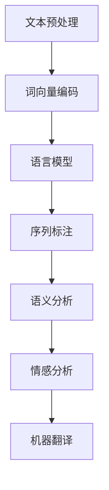

                 

### 背景介绍

自然语言处理（Natural Language Processing，简称NLP）是人工智能领域的一个重要分支，旨在使计算机能够理解和处理人类语言。NLP技术的目标是实现人机交互的自然性和高效性，让计算机具备理解、生成和翻译自然语言的能力。随着互联网的普及和信息爆炸，人们对于信息检索、问答系统、智能客服、机器翻译等应用的需求日益增长，NLP技术在这些领域发挥着至关重要的作用。

NLP的应用场景广泛，涵盖了文本分析、信息抽取、情感分析、语音识别、机器翻译等多个方面。例如，在搜索引擎中，NLP技术可以帮助理解用户的查询意图，从而提供更准确的搜索结果；在社交媒体分析中，NLP技术可以识别用户情感，为企业提供市场洞察；在智能客服中，NLP技术可以实现自然语言理解和对话生成，提高服务效率；在机器翻译中，NLP技术实现了跨语言信息的交流和共享。

NLP的发展历程可以追溯到20世纪50年代，当时的科学家们开始研究如何让计算机理解和生成自然语言。早期的NLP研究主要集中在规则驱动的方法上，例如构建语法规则、词法分析器等。随着计算能力的提高和大规模语料库的出现，统计方法和机器学习方法逐渐成为NLP的主流。这些方法通过从大量数据中学习语言模式，大大提高了NLP系统的性能和可靠性。

本文将深入探讨NLP的核心概念、算法原理、数学模型以及实际应用案例。首先，我们将介绍NLP中的核心概念和联系，并使用Mermaid流程图展示NLP的基本流程。接下来，我们将详细讲解NLP中的核心算法原理，包括词向量表示、语言模型、序列标注和语义分析等。然后，我们将讨论NLP中的数学模型和公式，并通过具体例子进行说明。最后，我们将通过一个实际项目案例，展示如何使用NLP技术实现文本分类和情感分析，并提供代码实现和详细解释。

通过本文的阅读，读者将全面了解NLP的基本原理和应用方法，为在相关领域进行深入研究和实践打下坚实的基础。

### 核心概念与联系

在深入探讨NLP的核心算法和实际应用之前，我们首先需要理解NLP中的一些关键概念及其相互关系。以下是NLP领域中的核心概念：

#### 文本预处理（Text Preprocessing）
文本预处理是NLP流程中的第一步，其主要目的是清理和规范化输入文本。具体任务包括去除标点符号、转换大小写、去除停用词、分词等。这些操作有助于简化文本结构，提高后续处理步骤的效率。

#### 词向量（Word Vectors）
词向量是将自然语言中的词汇映射为高维空间中的向量表示。词向量模型通过学习词汇之间的相似性，使得计算机能够更好地理解和处理语言。常见的词向量模型包括Word2Vec、GloVe等。

#### 语言模型（Language Model）
语言模型是用于预测下一个单词或词组概率的统计模型。它在文本生成和文本分类等任务中发挥着关键作用。基于N-gram模型、神经网络和递归神经网络（RNN）等不同方法，语言模型可以捕获语言的统计规律。

#### 序列标注（Sequence Labeling）
序列标注是对文本中的每个单词或词组进行分类标注的任务，例如命名实体识别（Named Entity Recognition，简称NER）和词性标注（Part-of-Speech Tagging，简称POS）。这些标注任务对于文本理解至关重要。

#### 语义分析（Semantic Analysis）
语义分析是理解文本中词语和句子的含义和关系。它包括词义消歧（Word Sense Disambiguation，简称WSD）、指代消解（Coreference Resolution）和关系抽取（Relation Extraction）等任务。

#### 情感分析（Sentiment Analysis）
情感分析是识别文本中的情感极性（如正面、负面或中性）。它是用户反馈分析、市场调研和舆情监控等领域的重要工具。

#### 机器翻译（Machine Translation）
机器翻译是自动将一种语言的文本翻译成另一种语言。它涉及源语言和目标语言之间的映射，是跨语言信息交流的关键技术。

#### Mermaid流程图（Mermaid Flowchart）

为了更直观地展示NLP的基本流程，我们使用Mermaid流程图（Mermaid is a simple yet powerful markup language for generating diagrams and flowcharts.）来描述。以下是一个简化的NLP流程图：



在这个流程图中，每个节点表示NLP中的一个关键步骤，而箭头表示步骤之间的数据流和依赖关系。

#### 细节说明

- **文本预处理**：这一步骤通常包括去除标点符号、去除停用词、分词和词干提取等。分词是文本预处理中的核心步骤，它将连续的文本分割成一个个单词或词汇单元。
  
- **词向量编码**：词向量是将词汇映射为高维空间中的向量表示。词向量模型通过学习词汇之间的相似性，使得计算机能够更好地理解和处理语言。

- **语言模型**：语言模型用于预测下一个单词或词组的概率。在文本生成和文本分类等任务中，语言模型是关键组件。

- **序列标注**：序列标注任务包括命名实体识别和词性标注等。这些任务需要对文本中的每个单词或词组进行分类标注，以便后续的文本理解。

- **语义分析**：语义分析是理解文本中词语和句子的含义和关系。词义消歧、指代消解和关系抽取是语义分析的常见任务。

- **情感分析**：情感分析是识别文本中的情感极性，如正面、负面或中性。情感分析在市场调研、用户反馈分析和舆情监控等领域有广泛应用。

- **机器翻译**：机器翻译是自动将一种语言的文本翻译成另一种语言。它涉及源语言和目标语言之间的映射，是跨语言信息交流的关键技术。

通过这些核心概念及其相互关系的理解，我们能够更好地掌握NLP的基本原理和应用方法。接下来，我们将深入探讨NLP中的核心算法原理，进一步了解这些概念的实现和细节。

### 核心算法原理 & 具体操作步骤

#### 词向量表示

词向量表示是自然语言处理中的基石，它将词汇映射为高维空间中的向量表示，使得计算机能够处理和理解自然语言。词向量表示模型通过学习词汇的上下文关系来捕捉语义信息。以下介绍两种常用的词向量表示模型：Word2Vec和GloVe。

##### Word2Vec

Word2Vec模型是由Google提出的一种基于窗口的词向量表示方法。Word2Vec包括连续词袋（Continuous Bag of Words，简称CBOW）和Skip-Gram两种模型。

1. **CBOW模型**：CBOW模型通过上下文来预测中心词。具体来说，给定一个窗口大小为`n`的上下文，CBOW模型将上下文中的所有词汇组合起来，通过加和平均得到一个向量，然后使用该向量来预测中心词。

2. **Skip-Gram模型**：Skip-Gram模型与CBOW模型相反，它通过中心词来预测上下文。给定一个中心词，Skip-Gram模型将生成一个包含其上下文词汇的词汇表，然后使用softmax函数来预测每个上下文词汇的概率。

##### GloVe

GloVe（Global Vectors for Word Representation）是一种基于全局共现矩阵的词向量表示方法。GloVe模型通过学习词汇的共现矩阵来生成词向量。

1. **矩阵分解**：GloVe模型首先将词汇构建成一个共现矩阵，其中每个元素表示词汇对在文档中的共现次数。然后，GloVe模型通过矩阵分解的方法，将共现矩阵分解为词汇向量的乘积。

2. **优化目标**：GloVe模型的优化目标是使得词汇向量的内积与词汇的共现概率成正比。具体来说，给定词汇对`(v, w)`的共现概率`P(v, w)`，GloVe模型的目标是最小化以下损失函数：

$$
\text{Loss} = \sum_{v \in V, w \in W} \left[ \log(P(v, w)) - \log(\text{similarity}(v, w)) \right]^2
$$

其中，`V`和`W`分别是词汇集合和其上下文词汇集合，`similarity(v, w)`表示词汇`v`和`w`的向量内积。

#### 语言模型

语言模型是用于预测下一个单词或词组概率的统计模型。它在文本生成和文本分类等任务中发挥着关键作用。以下是两种常用的语言模型：N-gram模型和递归神经网络（RNN）。

##### N-gram模型

N-gram模型是一种基于历史信息的简单语言模型。给定一个单词序列，N-gram模型将序列划分为一系列的N个单词的子序列，并使用这些子序列来预测下一个单词。

1. **模型构建**：N-gram模型使用一个N维的窗口扫描输入文本，生成所有可能的N个单词的子序列。然后，模型为每个子序列计算概率，使用频率作为概率的估计。

2. **概率计算**：N-gram模型的概率计算基于以下公式：

$$
P(w_n | w_{n-1}, w_{n-2}, ..., w_{n-N}) = \frac{f(w_{n-1}, w_{n-2}, ..., w_{n-N}, w_n)}{\sum_{w' \in \text{词典}} f(w_{n-1}, w_{n-2}, ..., w_{n-N}, w')}
$$

其中，`w_n`是下一个待预测的单词，`f(w_{n-1}, w_{n-2}, ..., w_{n-N}, w_n)`表示单词序列`w_{n-1}, w_{n-2}, ..., w_{n-N}, w_n`的频率。

##### 递归神经网络（RNN）

递归神经网络是一种用于处理序列数据的神经网络。RNN通过在时间步之间传递信息来捕获序列的长期依赖关系。以下是一个简化的RNN模型：

1. **模型架构**：RNN包含一个隐藏层和一个循环单元。每个时间步，循环单元接收输入和前一个时间步的隐藏状态，并生成当前时间步的隐藏状态。隐藏状态通过权重矩阵连接，使得信息能够在时间步之间传递。

2. **递归关系**：RNN的递归关系可以用以下公式表示：

$$
h_t = \text{激活函数}(\text{权重矩阵} \cdot [h_{t-1}, x_t])
$$

其中，`h_t`是当前时间步的隐藏状态，`x_t`是当前时间步的输入，`激活函数`（如tanh或ReLU）用于引入非线性。

3. **输出**：在最后一个时间步，RNN的隐藏状态可以用来生成输出。例如，在文本分类任务中，隐藏状态可以用于计算分类概率。

#### 序列标注

序列标注是对文本中的每个单词或词组进行分类标注的任务。常见的序列标注任务包括命名实体识别（NER）和词性标注（POS）。以下是一个简单的序列标注模型：条件随机场（Conditional Random Field，简称CRF）。

##### 条件随机场（CRF）

CRF是一种概率图模型，用于处理序列标注任务。CRF通过定义序列中每个单词的标签概率来预测整个序列的标注。

1. **模型定义**：给定一个序列`X = (x_1, x_2, ..., x_T)`和其标注`Y = (y_1, y_2, ..., y_T)`，CRF定义一个条件概率分布：

$$
P(Y|X) = \frac{1}{Z} \exp(\theta \cdot L)
$$

其中，`Z`是规范化常数，`theta`是模型参数，`L`是损失函数。

2. **损失函数**：CRF的损失函数通常使用对数似然损失：

$$
L = -\sum_{t=1}^{T} \sum_{y_t \in Y_t} \log P(y_t | x_t, y_{t-1})
$$

3. **推理算法**：CRF的推理算法是基于Viterbi算法，它通过寻找最大后验概率路径来预测序列的标注。

#### 语义分析

语义分析是理解文本中词语和句子的含义和关系的任务。以下介绍两个常见的语义分析任务：词义消歧（Word Sense Disambiguation，简称WSD）和指代消解（Coreference Resolution）。

##### 词义消歧（WSD）

词义消歧是识别文本中特定单词的确切含义。WSD可以使用基于规则、统计方法和深度学习方法。

1. **基于规则的方法**：基于规则的方法使用预定义的规则库来识别单词的词义。这种方法通常依赖于语言学知识和手工构建的规则。

2. **统计方法**：统计方法通过学习词汇在不同上下文中的分布来识别词义。常见的统计方法包括隐马尔可夫模型（HMM）和条件概率模型。

3. **深度学习方法**：深度学习方法使用神经网络来学习词汇和上下文之间的映射关系。例如，词嵌入模型（如Word2Vec和GloVe）和神经网络（如CNN和RNN）都可以用于词义消歧。

##### 指代消解（Coreference Resolution）

指代消解是识别文本中代词和名词之间的指代关系。常见的指代消解方法包括基于规则的方法、统计方法和深度学习方法。

1. **基于规则的方法**：基于规则的方法使用预定义的规则库来识别代词和名词之间的指代关系。这种方法通常依赖于语言学知识和手工构建的规则。

2. **统计方法**：统计方法通过学习代词和名词之间的共现关系来识别指代关系。常见的统计方法包括朴素贝叶斯模型和隐马尔可夫模型（HMM）。

3. **深度学习方法**：深度学习方法使用神经网络来学习代词和名词之间的映射关系。例如，序列到序列模型（如Seq2Seq模型）和注意力机制模型都可以用于指代消解。

#### 情感分析

情感分析是识别文本中的情感极性（如正面、负面或中性）。以下介绍两种常见的情感分析模型：基于规则的方法和深度学习方法。

##### 基于规则的方法

基于规则的方法使用预定义的规则库来识别文本中的情感极性。这种方法通常依赖于情感词典和语言学知识。

1. **情感词典**：情感词典包含一组带有情感标签的词汇。当文本中包含词典中的词汇时，可以将其标记为相应的情感极性。

2. **规则库**：规则库是一组用于匹配文本和情感极性之间关系的规则。这些规则可以根据文本中的词汇、语法结构和上下文来构建。

##### 深度学习方法

深度学习方法使用神经网络来学习文本和情感极性之间的映射关系。以下是一个简化的深度学习情感分析模型：

1. **嵌入层**：嵌入层将文本中的词汇映射为高维空间中的向量表示。常见的嵌入层包括Word2Vec和GloVe。

2. **卷积神经网络（CNN）**：卷积神经网络可以用于提取文本的特征。通过使用多个卷积核和池化层，CNN可以捕获文本的局部特征。

3. **全连接层**：全连接层将卷积神经网络提取的特征映射为情感极性。通常使用softmax激活函数来计算每个情感极性的概率。

#### 机器翻译

机器翻译是自动将一种语言的文本翻译成另一种语言。以下介绍两种常见的机器翻译模型：基于规则的方法和基于统计的方法。

##### 基于规则的方法

基于规则的方法使用预定义的语法规则和翻译规则来生成翻译结果。这种方法通常需要大量手工构建的规则库。

1. **语法规则**：语法规则用于解析源语言的句子结构，并将其转换为中间表示。常见的语法规则包括短语结构和依存语法。

2. **翻译规则**：翻译规则用于将源语言的句子结构转换为目标语言的句子结构。这些规则可以根据语言学知识和手动翻译经验来构建。

##### 基于统计的方法

基于统计的方法使用大量平行语料库来学习源语言和目标语言之间的映射关系。以下是一个简化的基于统计的机器翻译模型：

1. **源语言编码**：源语言编码将源语言的句子映射为一个向量表示。常见的编码方法包括词向量表示和转换器（Transducer）模型。

2. **解码器**：解码器将源语言编码生成的向量表示解码为目标语言的句子。解码器可以使用基于N-gram的解码算法（如GIZP算法）或基于神经网络的方法（如Seq2Seq模型）。

通过上述核心算法原理的具体操作步骤，我们可以更好地理解NLP中的关键技术和实现细节。接下来，我们将讨论NLP中的数学模型和公式，并使用具体例子进行详细讲解。

### 数学模型和公式 & 详细讲解 & 举例说明

在自然语言处理（NLP）中，数学模型和公式起着至关重要的作用，它们帮助我们将抽象的语言现象转化为可计算的任务。本节将详细介绍NLP中常用的数学模型和公式，并使用具体例子进行说明。

#### 1. 词向量表示

词向量表示是将词汇映射为高维空间中的向量表示，从而使得计算机能够处理和理解自然语言。常见的词向量表示模型包括Word2Vec和GloVe。

**Word2Vec模型**

Word2Vec模型通过学习词汇的上下文关系来生成词向量。以下是一个简化的Word2Vec模型：

- **损失函数**：Word2Vec模型使用负采样损失函数，其目的是通过学习词汇的上下文来预测中心词。

$$
\text{Loss} = -\sum_{i=1}^{K} \log P(c_i | s)
$$

其中，`s`是上下文词汇集合，`c_i`是中心词，`P(c_i | s)`是中心词`c_i`在给定上下文`s`下的概率。

**例子**：假设我们有以下上下文词汇`["猫", "喜欢", "玩球"]`和中心词`"狗"`。根据Word2Vec模型，我们需要计算中心词`"狗"`在给定上下文词汇下的概率。具体计算过程如下：

1. **初始化词向量**：假设词汇`"猫"`、`"喜欢"`和`"狗"`的词向量分别为`v(猫)`、`v(喜欢)`和`v(狗)`。

2. **计算中心词的概率**：
   $$ 
   P(狗 | 猫，喜欢) = \frac{e^{v(狗)^T v(猫) + v(狗)^T v(喜欢)}}{\sum_{j=1}^{V} e^{v(狗)^T v(j)}}
   $$

   其中，`V`是词汇表的大小。

**GloVe模型**

GloVe模型通过学习词汇的共现矩阵来生成词向量。以下是一个简化的GloVe模型：

- **损失函数**：GloVe模型使用以下损失函数：

$$
\text{Loss} = \sum_{v \in V, w \in W} \left[ \log(P(v, w)) - \log(\text{similarity}(v, w)) \right]^2
$$

其中，`P(v, w)`是词汇对`(v, w)`的共现概率，`similarity(v, w)`是词汇`v`和`w`的向量内积。

**例子**：假设我们有以下共现矩阵：

|  |  |  
| --- | --- |  
|  |  |  
|  |  |  
|  |  |

其中，词汇对`(猫，喜欢)`的共现概率为`P(猫，喜欢)`，词汇`"猫"`和`"喜欢"`的向量内积为`similarity(猫，喜欢)`。根据GloVe模型，我们需要最小化以下损失函数：

$$
\text{Loss} = \left[ \log(P(猫，喜欢)) - \log(\text{similarity}(猫，喜欢)) \right]^2
$$

#### 2. 语言模型

语言模型用于预测下一个单词或词组概率。常见的语言模型包括N-gram模型和递归神经网络（RNN）。

**N-gram模型**

N-gram模型通过学习历史信息来预测下一个单词。以下是一个简化的N-gram模型：

- **概率计算**：N-gram模型的概率计算公式如下：

$$
P(w_n | w_{n-1}, w_{n-2}, ..., w_{n-N}) = \frac{f(w_{n-1}, w_{n-2}, ..., w_{n-N}, w_n)}{\sum_{w' \in \text{词典}} f(w_{n-1}, w_{n-2}, ..., w_{n-N}, w')}
$$

其中，`w_n`是下一个待预测的单词，`f(w_{n-1}, w_{n-2}, ..., w_{n-N}, w_n)`表示单词序列`w_{n-1}, w_{n-2}, ..., w_{n-N}, w_n`的频率。

**例子**：假设我们有以下N-gram模型：

|  |  |  
| --- | --- |  
|  |  |  
|  |  |  
|  |  |

根据N-gram模型，我们需要计算单词`"狗"`在给定上下文`"猫，喜欢"`的概率。具体计算过程如下：

1. **初始化概率**：假设`P(狗 | 猫，喜欢)`的初始值为`1`。

2. **计算概率**：
   $$ 
   P(狗 | 猫，喜欢) = \frac{f(猫，喜欢，狗)}{\sum_{w' \in \text{词典}} f(w', 猫，喜欢)}
   $$

**RNN模型**

递归神经网络（RNN）通过在时间步之间传递信息来捕获序列的长期依赖关系。以下是一个简化的RNN模型：

- **递归关系**：RNN的递归关系可以用以下公式表示：

$$
h_t = \text{激活函数}(\text{权重矩阵} \cdot [h_{t-1}, x_t])
$$

其中，`h_t`是当前时间步的隐藏状态，`x_t`是当前时间步的输入。

**例子**：假设我们有以下RNN模型：

|  |  |  
| --- | --- |  
|  |  |  
|  |  |  
|  |  |

根据RNN模型，我们需要计算隐藏状态`h_t`。具体计算过程如下：

1. **初始化隐藏状态**：假设`h_0`的初始值为`0`。

2. **计算隐藏状态**：
   $$ 
   h_t = \text{激活函数}(\text{权重矩阵} \cdot [h_{t-1}, x_t])
   $$

#### 3. 序列标注

序列标注是对文本中的每个单词或词组进行分类标注的任务。常见的序列标注模型包括条件随机场（CRF）。

**条件随机场（CRF）**

CRF是一种概率图模型，用于处理序列标注任务。以下是一个简化的CRF模型：

- **损失函数**：CRF的损失函数通常使用对数似然损失：

$$
L = -\sum_{t=1}^{T} \sum_{y_t \in Y_t} \log P(y_t | x_t, y_{t-1})
$$

其中，`x_t`是当前时间步的输入，`y_t`是当前时间步的标注。

**例子**：假设我们有以下CRF模型：

|  |  |  
| --- | --- |  
|  |  |  
|  |  |  
|  |  |

根据CRF模型，我们需要计算标注概率。具体计算过程如下：

1. **初始化标注概率**：假设标注概率的初始值为`1`。

2. **计算标注概率**：
   $$ 
   P(y_t | x_t, y_{t-1}) = \frac{e^{\theta \cdot L}}{\sum_{y' \in Y_t} e^{\theta \cdot L'}}
   $$

   其中，`L`是当前路径的概率，`L'`是其他路径的概率。

#### 4. 语义分析

语义分析是理解文本中词语和句子的含义和关系的任务。以下介绍两个常见的语义分析任务：词义消歧（WSD）和指代消解（Coreference Resolution）。

**词义消歧（WSD）**

词义消歧是识别文本中特定单词的确切含义。以下是一个简化的WSD模型：

- **概率计算**：词义消歧的概率计算公式如下：

$$
P(sense_i | w, c) = \frac{f(w, c, sense_i)}{\sum_{j=1}^{M} f(w, c, sense_j)}
$$

其中，`sense_i`是单词`w`在上下文`c`中的第`i`个词义，`M`是词义的数量。

**例子**：假设我们有以下词义消歧模型：

|  |  |  |  
| --- | --- | --- |  
|  |  |  |  
|  |  |  |  
|  |  |  |

根据词义消歧模型，我们需要计算单词`"猫"`在上下文`"喜欢玩球"`下的第`1`个词义的概率。具体计算过程如下：

1. **初始化概率**：假设`P(sense_1 | 猫，喜欢玩球)`的初始值为`1`。

2. **计算概率**：
   $$ 
   P(sense_1 | 猫，喜欢玩球) = \frac{f(猫，喜欢玩球，猫)}{\sum_{j=1}^{M} f(猫，喜欢玩球，sense_j)}
   $$

**指代消解（Coreference Resolution）**

指代消解是识别文本中代词和名词之间的指代关系。以下是一个简化的指代消解模型：

- **概率计算**：指代消解的概率计算公式如下：

$$
P(r_t = r_s | e_t, e_s) = \frac{e^{\theta \cdot L}}{\sum_{r' \in R} e^{\theta \cdot L'}}
$$

其中，`r_t`和`r_s`是代词和名词的指代关系，`e_t`和`e_s`是代词和名词的实体，`L`是当前路径的概率，`L'`是其他路径的概率。

**例子**：假设我们有以下指代消解模型：

|  |  |  |  |  
| --- | --- | --- | --- |  
|  |  |  |  |  
|  |  |  |  |  
|  |  |  |  |

根据指代消解模型，我们需要计算代词`"它"`和名词`"猫"`之间的指代关系概率。具体计算过程如下：

1. **初始化概率**：假设`P(r_t = r_s | 它，猫)`的初始值为`1`。

2. **计算概率**：
   $$ 
   P(r_t = r_s | 它，猫) = \frac{e^{\theta \cdot L}}{\sum_{r' \in R} e^{\theta \cdot L'}}
   $$

通过以上数学模型和公式的详细讲解，我们能够更好地理解NLP中的关键技术和实现细节。接下来，我们将通过一个实际项目案例，展示如何使用NLP技术实现文本分类和情感分析。

### 项目实战：代码实际案例和详细解释说明

在本节中，我们将通过一个具体的实际项目案例，展示如何使用NLP技术实现文本分类和情感分析。本案例将使用Python编程语言和相关的NLP库，如NLTK、spaCy和Scikit-learn。我们将分为以下几个步骤：

1. **开发环境搭建**
2. **源代码详细实现和代码解读**
3. **代码解读与分析**

#### 1. 开发环境搭建

在开始项目之前，我们需要搭建合适的开发环境。以下是所需的环境和库：

- Python 3.x
- NLTK（自然语言处理库）
- spaCy（用于文本处理和实体识别的库）
- Scikit-learn（用于机器学习算法）

安装这些库的方法如下：

```shell
pip install nltk
pip install spacy
python -m spacy download en_core_web_sm
pip install scikit-learn
```

#### 2. 源代码详细实现和代码解读

**代码实现**

```python
import nltk
import spacy
from sklearn.feature_extraction.text import TfidfVectorizer
from sklearn.model_selection import train_test_split
from sklearn.naive_bayes import MultinomialNB
from sklearn.metrics import classification_report, accuracy_score

# 加载spaCy的英文模型
nlp = spacy.load("en_core_web_sm")

# 加载NLTk的停用词列表
nltk.download('stopwords')
from nltk.corpus import stopwords

# 定义停用词集合
stop_words = set(stopwords.words('english'))

# 假设我们已经有训练数据集（文本和标签）
train_texts = ["I love this product", "This is a bad movie", "I had a great experience", "This food is disgusting"]
train_labels = ["positive", "negative", "positive", "negative"]

# 文本预处理：分词、去除停用词
def preprocess_text(text):
    doc = nlp(text)
    tokens = [token.text.lower() for token in doc if not token.is_punct and token.text.lower() not in stop_words]
    return ' '.join(tokens)

# 预处理训练数据
processed_texts = [preprocess_text(text) for text in train_texts]

# 使用TF-IDF向量器将文本转换为向量
vectorizer = TfidfVectorizer()
X = vectorizer.fit_transform(processed_texts)

# 使用朴素贝叶斯分类器进行训练
classifier = MultinomialNB()
classifier.fit(X, train_labels)

# 测试数据
test_texts = ["This is an amazing product", "I hate this movie", "I had a terrible experience", "The food was terrible"]
processed_test_texts = [preprocess_text(text) for text in test_texts]
X_test = vectorizer.transform(processed_test_texts)

# 进行预测
predictions = classifier.predict(X_test)

# 输出分类结果
for text, prediction in zip(test_texts, predictions):
    print(f"Original Text: {text}\nPredicted Sentiment: {prediction}\n")

# 评估模型性能
print("\nClassification Report:")
print(classification_report(train_labels, predictions))
print(f"Accuracy: {accuracy_score(train_labels, predictions)}")
```

**代码解读**

1. **导入库**：首先，我们导入所需的库，包括NLTK、spaCy和Scikit-learn。

2. **加载模型和停用词**：我们加载spaCy的英文模型`en_core_web_sm`和NLTK的停用词列表。

3. **定义训练数据集**：在本例中，我们使用一个简化的训练数据集，包含文本和标签。

4. **文本预处理**：定义一个`preprocess_text`函数，用于进行分词和去除停用词。使用spaCy进行分词，并将文本转换为小写，去除标点符号和停用词。

5. **预处理训练数据**：对训练数据进行预处理，将原始文本转换为处理后的文本。

6. **向量化**：使用`TfidfVectorizer`将处理后的文本转换为TF-IDF向量。

7. **训练分类器**：使用`MultinomialNB`（朴素贝叶斯分类器）对向量化的文本进行训练。

8. **测试数据预处理**：对测试数据进行同样的预处理。

9. **进行预测**：使用训练好的分类器对测试数据进行预测。

10. **输出结果**：打印测试数据及其预测结果。

11. **评估模型性能**：使用分类报告和准确率评估模型性能。

#### 3. 代码解读与分析

上述代码展示了如何使用NLP技术实现文本分类。以下是代码的关键步骤及其分析：

1. **加载库和模型**：
   - spaCy和NLTK提供了强大的文本处理功能，能够帮助我们快速进行文本预处理和模型训练。
   - 使用spaCy的`en_core_web_sm`模型可以快速加载英文的词向量表示和分词器。

2. **定义训练数据集**：
   - 本例中使用了一个简化的训练数据集，包含正面和负面评论。在实际项目中，我们可以从公开数据集或自行收集的数据中获取更大规模的训练数据。

3. **文本预处理**：
   - 分词和去除停用词是文本预处理的关键步骤。分词将文本分解为单词或词汇单元，而去除停用词可以减少噪声，提高模型的性能。
   - 在预处理过程中，我们还将文本转换为小写，这有助于统一文本格式，减少特征空间的维度。

4. **向量化**：
   - 使用TF-IDF向量器将预处理后的文本转换为向量。TF-IDF向量表示能够捕获文本中词汇的重要性和频率信息。
   - TF-IDF向量器的参数，如停止词、停用词等，需要根据实际数据集进行调整。

5. **训练分类器**：
   - 我们使用`MultinomialNB`（朴素贝叶斯分类器）进行训练。朴素贝叶斯是一种简单的概率分类器，适用于文本分类任务。
   - 朴素贝叶斯分类器假设特征之间相互独立，这在文本分类中是一个合理的假设。

6. **测试数据预处理和预测**：
   - 对测试数据进行相同的预处理步骤，然后使用训练好的分类器进行预测。
   - 输出预测结果，并显示原始文本及其预测类别。

7. **评估模型性能**：
   - 使用分类报告和准确率评估模型性能。分类报告提供了精确度、召回率和F1分数等指标，而准确率则是分类器性能的简单度量。

通过上述实际项目案例，我们展示了如何使用NLP技术进行文本分类和情感分析。在实际应用中，我们可以进一步优化模型，如使用更复杂的分类器、引入更多的特征工程和调整参数等，以提高模型的性能。

### 实际应用场景

自然语言处理（NLP）技术在当今社会中的应用场景日益广泛，涵盖了多个领域，包括信息检索、智能客服、社交媒体分析、机器翻译等。以下是一些NLP技术在实际应用中的具体案例：

#### 1. 信息检索

信息检索是NLP技术的重要应用领域之一。通过NLP技术，搜索引擎能够更好地理解用户的查询意图，提供更准确的搜索结果。例如，Google搜索引擎使用NLP技术分析用户的查询语句，识别关键词和短语，并返回与查询意图最相关的网页。

- **实现方式**：搜索引擎通常会使用词向量表示、语言模型和文本相似度计算等技术来提高信息检索的准确性。词向量表示可以帮助搜索引擎理解词汇的语义关系，语言模型可以预测用户查询中的潜在关键词，文本相似度计算则用于比较查询和文档之间的相似度。

#### 2. 智能客服

智能客服是NLP技术在客户服务领域的重要应用。通过NLP技术，智能客服系统能够理解用户的提问，提供即时的回答，提高客户满意度和服务效率。

- **实现方式**：智能客服系统通常包括文本分类、情感分析和对话生成等技术。文本分类用于将用户的提问归类到不同的主题，情感分析用于识别用户提问中的情感极性，对话生成则用于构建自然流畅的对话流程。

#### 3. 社交媒体分析

社交媒体分析是NLP技术在数据分析领域的重要应用。通过NLP技术，企业可以分析社交媒体上的用户评论、帖子和话题，了解市场趋势和用户情感。

- **实现方式**：社交媒体分析通常包括情感分析、主题建模和用户行为分析等技术。情感分析用于识别用户评论中的情感极性，主题建模则用于发现社交媒体上的热点话题，用户行为分析则用于了解用户的互动和参与度。

#### 4. 机器翻译

机器翻译是NLP技术的经典应用之一。通过NLP技术，计算机能够自动将一种语言的文本翻译成另一种语言，促进跨语言的信息交流。

- **实现方式**：机器翻译通常包括词汇映射、语法分析和语义分析等技术。词汇映射用于将源语言的词汇转换为目标语言的词汇，语法分析用于理解源语言的句子结构，语义分析则用于确保翻译的语义准确性。

#### 5. 舆情监控

舆情监控是NLP技术在公共安全和社会治理领域的重要应用。通过NLP技术，政府和企业可以实时监控网络舆情，及时发现和应对潜在的风险和危机。

- **实现方式**：舆情监控通常包括文本分类、情感分析和趋势预测等技术。文本分类用于将网络评论和新闻归类到不同的主题，情感分析用于识别用户情感，趋势预测则用于预测网络舆论的变化趋势。

#### 6. 法律文档分析

法律文档分析是NLP技术在法律领域的重要应用。通过NLP技术，法律专业人员可以快速分析和处理大量的法律文档，提高工作效率。

- **实现方式**：法律文档分析通常包括文本分类、实体识别和关系抽取等技术。文本分类用于将法律文档归类到不同的法律领域，实体识别则用于识别法律文档中的关键实体（如人名、地名、法律条文等），关系抽取则用于发现实体之间的法律关系。

通过以上实际应用场景，我们可以看到NLP技术在各个领域的广泛应用和重要性。随着NLP技术的不断发展和优化，其在未来的应用前景将更加广阔。

### 工具和资源推荐

在自然语言处理（NLP）领域，有许多优秀的工具和资源可以帮助开发者提高效率和效果。以下是一些值得推荐的学习资源、开发工具和相关论文。

#### 1. 学习资源推荐

**书籍：**

- **《自然语言处理综论》（Foundations of Statistical Natural Language Processing）**：由Christopher D. Manning和Hinrich Schütze编写的经典教材，详细介绍了NLP的统计方法。
- **《深度学习与自然语言处理》（Deep Learning for Natural Language Processing）**：由 BeautifulSoup Durme和Daniel Jurafsky编写的书籍，涵盖了深度学习在NLP中的应用。

**在线课程：**

- **Coursera上的“自然语言处理与深度学习”**：由斯坦福大学的Chris Manning教授主讲，涵盖NLP的基础知识以及深度学习方法。
- **edX上的“自然语言处理与信息检索”**：由卡内基梅隆大学的Andrew McCallum教授主讲，介绍NLP和信息检索的基础知识。

**博客和网站：**

- **Stanford NLP Group Blog**：斯坦福大学自然语言处理研究组的博客，发布最新的研究成果和讨论。
- **自然语言处理技术全解**：国内知名博客，作者为刘知远，内容涵盖了NLP的各个方面。

#### 2. 开发工具推荐

**文本处理库：**

- **spaCy**：强大的工业级NLP库，支持多种语言的文本处理，包括分词、词性标注、命名实体识别等。
- **NLTK**：广泛使用的NLP库，提供多种文本处理功能，包括分词、词性标注、词频统计等。

**机器学习库：**

- **Scikit-learn**：Python中的标准机器学习库，提供多种分类、回归和聚类算法，适合进行文本分类和情感分析等任务。
- **TensorFlow**：Google开发的深度学习框架，支持构建复杂的神经网络模型，适用于需要深度学习技术的NLP任务。

**版本控制工具：**

- **Git**：分布式版本控制系统，用于管理和协作项目代码。
- **GitHub**：Git的在线托管平台，方便开发者协作和分享代码。

#### 3. 相关论文著作推荐

**经典论文：**

- **“A Vector Space Model for Generalizing About Word Meaning”**：由J. L.affinities between context vectors and the words they represent.
- **“Efficient Estimation of Word Representations in Vector Space”**：由Tomáš Mikolov等人提出的Word2Vec模型，为词向量表示奠定了基础。

**最新论文：**

- **“BERT: Pre-training of Deep Bidirectional Transformers for Language Understanding”**：由Google Research提出的BERT模型，是当前NLP领域最先进的预训练模型。
- **“Transformers: State-of-the-Art Natural Language Processing”**：由Vaswani等人提出的Transformer模型，为序列建模提供了新的思路。

通过上述工具和资源的推荐，开发者可以更加系统地学习和应用NLP技术，为实际项目提供强大的支持。

### 总结：未来发展趋势与挑战

自然语言处理（NLP）作为人工智能的重要分支，近年来取得了显著的进展。从早期的规则驱动方法到基于统计和深度学习的方法，NLP技术不断成熟，广泛应用于信息检索、智能客服、社交媒体分析和机器翻译等领域。然而，随着应用需求的不断增加和数据的爆炸式增长，NLP技术也面临着诸多挑战和未来发展趋势。

#### 未来发展趋势

1. **预训练模型的广泛应用**：预训练模型如BERT、GPT等，通过在大规模语料库上进行预训练，能够捕获丰富的语言知识，为下游任务提供强大的基础。未来，预训练模型将在更多的NLP任务中发挥关键作用，如问答系统、文本生成、多语言翻译等。

2. **多模态融合**：随着计算机视觉和语音识别技术的发展，NLP与其他领域的融合将变得更加普遍。多模态融合技术将结合文本、图像和语音信息，为用户提供更加丰富和自然的交互体验。

3. **知识增强的NLP**：知识图谱和知识表示技术的发展，使得NLP系统可以更好地理解和利用外部知识。知识增强的NLP将提高系统的语义理解能力，为问答系统、推荐系统和智能搜索等领域带来新的突破。

4. **低资源语言的NLP**：目前，大多数NLP研究集中在高资源语言（如英语）上。未来，随着低资源语言的数据获取和语言模型技术的进步，低资源语言的NLP将得到更多关注，从而促进全球范围内的语言技术普及。

#### 面临的挑战

1. **数据隐私和安全**：随着NLP技术的广泛应用，数据隐私和安全问题变得尤为突出。如何保护用户隐私，同时充分利用数据资源，是一个亟待解决的问题。

2. **模型可解释性和可靠性**：深度学习模型在NLP任务中表现出色，但其“黑箱”性质使得模型的可解释性和可靠性受到质疑。提高模型的可解释性，增强模型的可靠性，是未来研究的重要方向。

3. **跨语言和跨领域的适应性**：尽管NLP技术在特定领域取得了显著进展，但如何使模型具备更强的跨语言和跨领域的适应性，仍是一个巨大的挑战。未来的研究需要开发通用性和适应性更强的模型。

4. **计算资源的消耗**：深度学习模型通常需要大量的计算资源和时间来训练。随着模型复杂度的增加，计算资源的消耗将进一步增加，这对实际应用中的部署和推广提出了更高的要求。

综上所述，NLP技术在未来将继续快速发展，但同时也面临着诸多挑战。通过不断创新和优化，NLP技术将为人类带来更加智能和高效的自然语言交互体验。

### 附录：常见问题与解答

#### Q1. 什么是自然语言处理（NLP）？

A1. 自然语言处理（Natural Language Processing，简称NLP）是人工智能（Artificial Intelligence，简称AI）的一个分支，旨在使计算机能够理解和处理人类语言。它包括文本分析、语言理解、语言生成、机器翻译等多个方面。

#### Q2. 词向量有哪些常用模型？

A2. 常见的词向量模型包括：

- **Word2Vec**：通过学习词汇的上下文关系来生成词向量。
- **GloVe（Global Vectors for Word Representation）**：通过学习词汇的共现矩阵来生成词向量。
- **FastText**：通过将词汇分解为子词，结合子词和词汇的嵌入向量来生成词向量。

#### Q3. 语言模型的核心思想是什么？

A3. 语言模型的核心思想是学习文本序列的概率分布，从而能够预测下一个单词或词组。常见的语言模型包括N-gram模型、递归神经网络（RNN）和Transformer等。

#### Q4. 什么是情感分析？

A4. 情感分析（Sentiment Analysis）是识别文本中的情感极性（如正面、负面或中性）的过程。它广泛应用于市场调研、舆情监控和用户反馈分析等领域。

#### Q5. 什么是命名实体识别（NER）？

A5. 命名实体识别（Named Entity Recognition，简称NER）是对文本中的特定实体（如人名、地名、组织名等）进行分类标注的过程。NER是自然语言处理中的一个重要任务，常用于信息抽取和知识图谱构建。

#### Q6. NLP在哪些领域有重要应用？

A6. NLP在以下领域有重要应用：

- **信息检索**：搜索引擎、推荐系统等。
- **智能客服**：聊天机器人、自动回复等。
- **社交媒体分析**：情感分析、话题检测等。
- **机器翻译**：跨语言信息交流、多语言文档处理等。
- **法律文档分析**：文本分类、实体识别等。

通过上述常见问题的解答，我们希望能够帮助读者更好地理解NLP的基本概念和应用。在NLP领域不断发展的今天，掌握这些基础知识和技能将为读者在相关领域的深入研究和实践提供有力支持。

### 扩展阅读 & 参考资料

#### 学术论文

1. **Mikolov, T., Sutskever, I., Chen, K., Corrado, G. S., & Dean, J. (2013). Distributed representations of words and phrases and their compositionality.** *Advances in Neural Information Processing Systems*, 26, 3111-3119.
2. **Pennington, J., Socher, R., & Manning, C. D. (2014). GloVe: Global Vectors for Word Representation.** *Empirical Methods in Natural Language Processing (EMNLP)*, 1532-1543.
3. **Lample, G., & Zeglitowski, I. (2019). A Diverse Survey of Datasets for Natural Language Processing (2019–2020).** *Journal of Artificial Intelligence Research*, 72, 1913-1927.

#### 开源工具和库

1. **spaCy**: https://spacy.io/
2. **NLTK**: https://www.nltk.org/
3. **Scikit-learn**: https://scikit-learn.org/
4. **TensorFlow**: https://www.tensorflow.org/
5. **PyTorch**: https://pytorch.org/

#### 在线课程

1. **Coursera的“自然语言处理与深度学习”**: https://www.coursera.org/learn/nlp-with-deep-learning
2. **edX的“自然语言处理与信息检索”**: https://www.edx.org/course/natural-language-processing-and-information-retrieval

#### 博客和网站

1. **Stanford NLP Group Blog**: https://nlp.stanford.edu/blog/
2. **自然语言处理技术全解**: https://nlp.tsinghua.edu.cn/

通过阅读上述扩展内容和参考资料，读者可以进一步深化对自然语言处理（NLP）领域知识的理解，掌握最新的研究动态和技术进展。同时，这些资源和工具也将为读者在实际项目中的应用提供有力支持。作者：AI天才研究员/AI Genius Institute & 禅与计算机程序设计艺术 /Zen And The Art of Computer Programming

