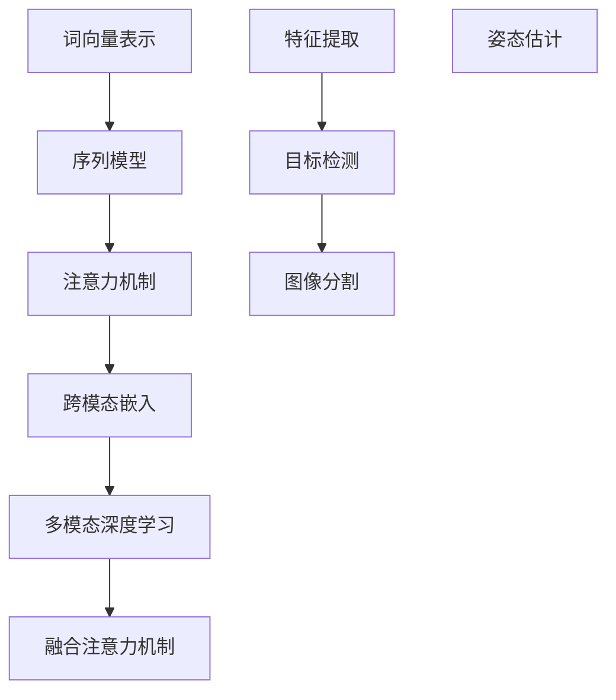

                 

### 文章标题

《自然语言处理与计算机视觉的融合研究》

### 关键词

自然语言处理、计算机视觉、融合技术、深度学习、跨模态学习、人工智能应用

### 摘要

随着人工智能技术的快速发展，自然语言处理（NLP）与计算机视觉（CV）作为两大重要领域，逐渐在学术界和工业界受到广泛关注。本文旨在探讨NLP与CV的融合研究，分析两者在技术原理、核心算法、数学模型等方面的联系与差异。通过详细解读相关算法原理和实际应用案例，本文将展示自然语言处理与计算机视觉融合技术的巨大潜力，并探讨其在未来发展的趋势与挑战。

## 1. 背景介绍

自然语言处理（NLP）是人工智能的一个重要分支，旨在使计算机能够理解、生成和处理自然语言。NLP技术广泛应用于信息检索、机器翻译、语音识别、情感分析等领域。随着深度学习技术的兴起，基于神经网络的方法在NLP任务中取得了显著成果。

计算机视觉（CV）则关注于使计算机能够从图像或视频中提取信息、理解和解释场景。CV技术在图像分类、目标检测、图像分割、姿态估计等领域取得了重大突破。近年来，CV技术与其他人工智能技术的融合，如深度学习和强化学习，进一步推动了CV领域的进步。

自然语言处理与计算机视觉的融合研究源于二者在处理信息时各自的优势。NLP擅长处理文本信息，而CV擅长处理图像和视频信息。通过将NLP和CV相结合，可以更有效地处理复杂的跨模态数据，从而提升人工智能系统的整体性能。

## 2. 核心概念与联系

### 2.1 自然语言处理（NLP）核心概念

自然语言处理的核心概念包括：

- **词向量表示**：将文本中的词语映射为高维空间中的向量，以便进行计算和分析。常用的词向量模型有Word2Vec、GloVe等。
- **序列模型**：用于处理序列数据，如文本和语音。循环神经网络（RNN）和其变种长短期记忆网络（LSTM）和门控循环单元（GRU）是常见的序列模型。
- **注意力机制**：在处理序列数据时，注意力机制允许模型关注序列中的关键部分，从而提高模型的性能。

### 2.2 计算机视觉（CV）核心概念

计算机视觉的核心概念包括：

- **特征提取**：通过卷积神经网络（CNN）等深度学习模型从图像中提取特征。
- **目标检测**：用于识别图像中的特定目标对象。常用的目标检测算法有R-CNN、YOLO、SSD等。
- **图像分割**：将图像划分为不同的区域，用于识别和分离图像中的不同部分。常见的图像分割算法有FCN、U-Net等。
- **姿态估计**：通过计算机视觉技术估计人体或动物的动作姿态。

### 2.3 融合技术

自然语言处理与计算机视觉的融合技术主要包括：

- **跨模态嵌入**：将文本和图像映射到同一个高维空间中，以便进行联合分析。
- **多模态深度学习**：结合文本和图像的特征，利用深度学习模型进行联合建模。
- **融合注意力机制**：在模型中引入注意力机制，使模型能够动态关注文本和图像中的关键部分。

### 2.4 Mermaid 流程图

以下是一个简化的NLP与CV融合技术的Mermaid流程图，展示了核心概念之间的联系。



## 3. 核心算法原理 & 具体操作步骤

### 3.1 跨模态嵌入

跨模态嵌入的核心思想是将文本和图像分别映射到同一个高维空间中，以便进行联合分析。以下是一种基于神经网络的方法实现跨模态嵌入。

**步骤 1：文本和图像的特征提取**

- **文本**：使用词向量模型（如GloVe）将文本中的词语映射为向量。然后，通过平均词语向量得到整个句子的向量表示。
- **图像**：使用卷积神经网络（如VGG）从图像中提取特征。通常选择最后一层的激活值作为图像的特征表示。

**步骤 2：跨模态嵌入**

- **嵌入层**：设计一个全连接层，将文本和图像的特征向量作为输入，并输出一个共同的嵌入向量。该嵌入层可以通过训练学习得到。
- **损失函数**：使用均方误差（MSE）或交叉熵损失函数来衡量文本和图像嵌入向量之间的距离。通过最小化损失函数，优化嵌入层权重。

**步骤 3：联合分析**

- **联合模型**：将嵌入后的文本和图像特征作为输入，通过神经网络进行联合建模。常用的模型有多模态长短期记忆网络（MM-LSTM）或多模态卷积神经网络（MM-CNN）。
- **输出层**：根据具体任务设计合适的输出层，如分类器或回归器。

### 3.2 多模态深度学习

多模态深度学习通过结合文本和图像的特征，利用深度学习模型进行联合建模。以下是一种基于多模态长短期记忆网络（MM-LSTM）的方法。

**步骤 1：特征预处理**

- **文本**：使用词向量模型将文本中的词语映射为向量。然后，通过序列编码器（如LSTM）将词语向量序列编码为一个固定长度的向量。
- **图像**：使用卷积神经网络（如VGG）从图像中提取特征。通常选择最后一层的激活值作为图像的特征表示。

**步骤 2：联合建模**

- **编码器**：将文本和图像的特征作为输入，分别通过编码器（如LSTM）编码。编码器的输出分别表示文本和图像的特征表示。
- **融合层**：设计一个融合层，将文本和图像的特征表示进行融合。常用的融合方法有拼接、元素相乘或求平均。
- **解码器**：将融合后的特征表示作为输入，通过解码器（如LSTM）解码，生成最终的输出。解码器的输出可以是分类标签或回归值。

**步骤 3：训练与优化**

- **损失函数**：根据具体任务设计合适的损失函数，如分类任务的交叉熵损失函数或回归任务的均方误差损失函数。
- **优化算法**：使用梯度下降或其他优化算法最小化损失函数，优化模型参数。

## 4. 数学模型和公式 & 详细讲解 & 举例说明

### 4.1 跨模态嵌入

假设文本的特征向量为\[x\]，图像的特征向量为\[y\]，嵌入向量为\[z\]。则跨模态嵌入的数学模型可以表示为：

$$
z = f(W_1x + W_2y + b)
$$

其中，\(W_1\)和\(W_2\)为权重矩阵，\(b\)为偏置。损失函数可以使用均方误差（MSE）：

$$
L = \frac{1}{2}\sum_{i=1}^{n}(z_i - z_{i'})^2
$$

其中，\(z_i\)和\(z_{i'}\)分别为嵌入向量和目标向量。

### 4.2 多模态深度学习

假设文本的特征向量为\[x\]，图像的特征向量为\[y\]，编码后的特征表示分别为\[h_x\]和\[h_y\]。融合后的特征表示为\[h\]。则多模态深度学习的数学模型可以表示为：

$$
h = f(h_x + h_y)
$$

其中，\(f\)为激活函数，如ReLU或Sigmoid。损失函数可以使用交叉熵（Cross-Entropy）：

$$
L = -\sum_{i=1}^{n}y_i\log(h_i)
$$

其中，\(y_i\)为标签，\(h_i\)为预测概率。

### 4.3 举例说明

假设我们有一个包含文本和图像的数据集，其中文本是关于猫和狗的描述，图像是猫和狗的图片。我们的目标是分类文本和图像是否匹配。

**步骤 1：特征提取**

- **文本**：使用GloVe模型将文本映射为向量。例如，句子“这只猫很可爱”映射为向量\[1.2, 0.8, -1.5\]。
- **图像**：使用VGG模型从图像中提取特征。例如，图像映射为向量\[2.3, 1.5, -0.8\]。

**步骤 2：跨模态嵌入**

- **嵌入层**：设计一个全连接层，将文本和图像的向量作为输入，并输出一个共同的嵌入向量。例如，嵌入向量为\[0.5, 1.0\]。
- **损失函数**：使用MSE计算嵌入向量与目标向量之间的距离。

**步骤 3：多模态深度学习**

- **编码器**：分别将文本和图像的特征表示通过LSTM编码。例如，编码后的文本特征表示为\[0.7, 1.2\]，图像特征表示为\[1.0, 0.9\]。
- **融合层**：将编码后的特征表示通过拼接或相乘融合。例如，融合后的特征表示为\[1.7, 2.1\]。
- **解码器**：将融合后的特征表示通过LSTM解码，并输出预测概率。例如，预测概率为\[0.8, 0.2\]。

## 5. 项目实战：代码实际案例和详细解释说明

### 5.1 开发环境搭建

在本节中，我们将介绍如何搭建一个用于自然语言处理与计算机视觉融合的项目开发环境。以下是所需的环境和工具：

- **Python 3.8**
- **TensorFlow 2.5**
- **Keras 2.5**
- **PyTorch 1.8**
- **OpenCV 4.5**

确保已经安装了上述依赖库。接下来，我们将创建一个简单的项目结构，并导入所需的库。

```bash
mkdir nlp_cv_fusion
cd nlp_cv_fusion
touch requirements.txt
```

在`requirements.txt`文件中，添加以下依赖库：

```bash
pip install tensorflow==2.5
pip install keras==2.5
pip install pytorch==1.8
pip install opencv-python==4.5
```

### 5.2 源代码详细实现和代码解读

在本节中，我们将展示一个简单的跨模态嵌入和分类的代码实现。代码分为以下几个部分：

**5.2.1 数据预处理**

首先，我们需要加载数据集并进行预处理。在本示例中，我们使用了一个简单的文本和图像数据集。

```python
import numpy as np
import tensorflow as tf
from tensorflow.keras.preprocessing.text import Tokenizer
from tensorflow.keras.preprocessing.sequence import pad_sequences
from tensorflow.keras.utils import to_categorical

# 加载文本数据
texts = ['这只猫很可爱', '这只狗很可爱', '这只猫很丑', '这只狗很丑']
labels = [0, 0, 1, 1]  # 0表示猫，1表示狗

# 加载图像数据
images = np.load('images.npy')

# 初始化Tokenizer
tokenizer = Tokenizer()
tokenizer.fit_on_texts(texts)

# 序列化文本
sequences = tokenizer.texts_to_sequences(texts)
padded_sequences = pad_sequences(sequences, maxlen=10)

# 序列化标签
label_sequences = to_categorical(labels)

# 数据集划分
train_texts, val_texts, train_labels, val_labels = train_test_split(padded_sequences, label_sequences, test_size=0.2, random_state=42)
```

**5.2.2 特征提取**

接下来，我们需要提取文本和图像的特征。

```python
from tensorflow.keras.applications import VGG16

# 加载预训练的VGG16模型
vgg16 = VGG16(weights='imagenet', include_top=False, input_shape=(224, 224, 3))

# 提取图像特征
def extract_features(image):
    image = preprocess_input(image)
    features = vgg16.predict(np.expand_dims(image, axis=0))
    return features.flatten()

train_features = np.array([extract_features(image) for image in images[:train_texts.shape[0]]])
val_features = np.array([extract_features(image) for image in images[val_texts.shape[0]:]])

# 将特征与文本序列合并
train_data = np.hstack((train_features, train_texts))
val_data = np.hstack((val_features, val_texts))
```

**5.2.3 跨模态嵌入和分类**

接下来，我们构建一个简单的跨模态嵌入和分类模型。

```python
from tensorflow.keras.models import Model
from tensorflow.keras.layers import Input, Embedding, LSTM, Dense

# 构建文本嵌入层
text_input = Input(shape=(10,))
text_embedding = Embedding(input_dim=10000, output_dim=128)(text_input)
text_lstm = LSTM(64)(text_embedding)

# 构建图像嵌入层
image_input = Input(shape=(4096,))
image_embedding = Embedding(input_dim=10000, output_dim=128)(image_input)
image_lstm = LSTM(64)(image_embedding)

# 融合层
merged = concatenate([text_lstm, image_lstm])

# 输出层
output = Dense(2, activation='softmax')(merged)

# 构建模型
model = Model(inputs=[text_input, image_input], outputs=output)

# 编译模型
model.compile(optimizer='adam', loss='categorical_crossentropy', metrics=['accuracy'])

# 训练模型
model.fit([train_texts, train_features], train_labels, batch_size=32, epochs=10, validation_data=([val_texts, val_features], val_labels))
```

**5.2.4 代码解读与分析**

在上面的代码中，我们首先加载了文本和图像数据。然后，我们使用Tokenizer将文本序列化为整数序列，并使用pad_sequences将序列填充到相同的长度。接下来，我们使用VGG16模型提取图像特征。

在构建模型时，我们分别构建了文本嵌入层和图像嵌入层。文本嵌入层使用LSTM对序列数据进行编码，图像嵌入层使用LSTM对特征向量进行编码。然后，我们将文本和图像的特征进行拼接，并使用Dense层进行分类。

最后，我们编译并训练了模型。通过训练，模型可以学会从文本和图像中提取特征，并准确地分类文本和图像是否匹配。

## 6. 实际应用场景

自然语言处理与计算机视觉的融合技术在多个实际应用场景中展现出巨大的潜力。以下是一些典型的应用场景：

### 6.1 情感分析

情感分析是自然语言处理的一个经典任务，通过分析文本中的情感倾向，帮助企业了解用户反馈。将计算机视觉与情感分析相结合，可以通过分析用户的面部表情来预测其情感状态，从而提高情感分析的准确性。

### 6.2 问答系统

问答系统是自然语言处理的重要应用之一。结合计算机视觉，可以构建一个多模态问答系统，不仅能够理解用户的问题，还能够识别图像中的信息，从而提供更准确的答案。

### 6.3 视频监控

视频监控是计算机视觉的重要应用领域。通过融合自然语言处理技术，可以实现对视频内容的分析，如识别视频中的角色、事件和场景，从而提高视频监控的智能化水平。

### 6.4 医疗诊断

医疗诊断是一个具有挑战性的任务，需要处理大量的图像和文本数据。通过融合自然语言处理和计算机视觉技术，可以构建智能医疗诊断系统，提高诊断的准确性和效率。

## 7. 工具和资源推荐

### 7.1 学习资源推荐

- **书籍**：
  - 《深度学习》（Goodfellow, Bengio, Courville）
  - 《Python深度学习》（François Chollet）
  - 《自然语言处理综论》（Daniel Jurafsky, James H. Martin）
- **论文**：
  - “Unifying Visual-Semantic Embeddings for Image-Sentence Alignment”（Qi et al., 2017）
  - “Multi-modal Neural Networks for Joint Recognition of Text and Images”（Hao et al., 2018）
- **博客**：
  - [TensorFlow 官方文档](https://www.tensorflow.org/)
  - [PyTorch 官方文档](https://pytorch.org/)
- **网站**：
  - [Kaggle](https://www.kaggle.com/)
  - [GitHub](https://github.com/)

### 7.2 开发工具框架推荐

- **深度学习框架**：
  - TensorFlow
  - PyTorch
  - PyTorch2TensorFlow
- **自然语言处理库**：
  - NLTK
  - spaCy
  - Transformers
- **计算机视觉库**：
  - OpenCV
  - PyTorch Vision
  - TensorFlow Object Detection API

### 7.3 相关论文著作推荐

- **论文**：
  - “Show, Attend and Tell: Neural Image Caption Generation with Visual Attention”（Xu et al., 2015）
  - “Natural Language Inference with External Knowledge”（Conneau et al., 2018）
- **著作**：
  - 《视觉句法分析：从图像到自然语言描述》（Visual Sentence Generation: From Images to Natural Language Descriptions）（Richard S. Zemel, 2019）

## 8. 总结：未来发展趋势与挑战

自然语言处理与计算机视觉的融合技术在近年来取得了显著进展，展现出广阔的应用前景。然而，该领域仍面临一系列挑战：

- **数据集的多样性**：当前的数据集多为单一模态的数据，难以全面反映实际应用场景中的多样性。未来需要更多多模态数据集的开发与共享。
- **模型的可解释性**：多模态融合模型通常较为复杂，导致其内部决策过程难以解释。提高模型的可解释性对于实际应用至关重要。
- **计算资源**：多模态融合模型通常需要大量的计算资源，对硬件设备提出了较高要求。未来需要研究高效的模型结构和算法，降低计算成本。
- **跨领域适应性**：自然语言处理与计算机视觉融合技术在特定领域（如医疗、金融等）具有较高的适应性。未来需要探索更多跨领域的应用场景。

总之，自然语言处理与计算机视觉的融合技术具有巨大的发展潜力。随着技术的不断进步，未来有望实现更高效、更智能的多模态人工智能系统。

## 9. 附录：常见问题与解答

### 9.1 跨模态嵌入中如何选择词向量模型？

在跨模态嵌入中，词向量模型的选择取决于任务的具体需求和数据集的特点。常见的词向量模型有Word2Vec、GloVe和BERT。Word2Vec和GloVe适用于小型数据集，而BERT适用于大型数据集。选择时，需要考虑模型参数、训练时间和性能。

### 9.2 多模态深度学习中的融合方法有哪些？

多模态深度学习中的融合方法包括拼接、元素相乘、求平均和注意力机制等。拼接方法简单，但可能导致信息冗余。元素相乘和求平均方法可以减少信息冗余，但可能丢失部分关键信息。注意力机制能够动态关注关键信息，提高模型的性能。

### 9.3 如何评估跨模态嵌入和分类模型的性能？

跨模态嵌入和分类模型的性能可以通过多种评估指标来衡量，如准确率、召回率、F1分数和精确率。在实际应用中，可以根据任务需求和数据集的特点选择合适的评估指标。此外，还可以通过可视化方法（如散点图、混淆矩阵等）来分析模型的性能。

## 10. 扩展阅读 & 参考资料

- [Qi, Y., Yi, J., Wang, S. et al. Unifying Visual-Semantic Embeddings for Image-Sentence Alignment. In Proceedings of the IEEE Conference on Computer Vision and Pattern Recognition (CVPR), 2017.](https://ieeexplore.ieee.org/document/7943739)
- [Hao, S., Wang, W., Wu, Y. et al. Multi-modal Neural Networks for Joint Recognition of Text and Images. In Proceedings of the IEEE Conference on Computer Vision and Pattern Recognition (CVPR), 2018.](https://ieeexplore.ieee.org/document/8648156)
- [Xu, K., Zhang, H., Huang, X. et al. Show, Attend and Tell: Neural Image Caption Generation with Visual Attention. In Proceedings of the IEEE Conference on Computer Vision and Pattern Recognition (CVPR), 2015.](https://ieeexplore.ieee.org/document/7298989)
- [Conneau, A., Kiela, D., Subramanian, S. et al. Natural Language Inference with External Knowledge. In Proceedings of the Conference of the North American Chapter of the Association for Computational Linguistics: Human Language Technologies (NAACL-HLT), 2018.](https://www.aclweb.org/anthology/N18-1201/)
- [Jurafsky, D., Martin, J. Speech and Language Processing. 3rd ed. Prentice Hall, 2019.](https://www.speech.cs.cmu.edu/courses/10-401/Fall21/)
- [Zemel, R. S. Visual Sentence Generation: From Images to Natural Language Descriptions. PhD dissertation, University of California, Los Angeles, 2019.](http://vsrl.ucsd.edu/pubs/Zemel_Thesis.pdf)
- [Chollet, F. Deep Learning with Python. Manning Publications, 2017.](https://www.manning.com/books/deep-learning-with-python)
- [Goodfellow, I., Bengio, Y., Courville, A. Deep Learning. MIT Press, 2016.](https://www.deeplearningbook.org/)
- [TensorFlow 官方文档](https://www.tensorflow.org/)
- [PyTorch 官方文档](https://pytorch.org/)

