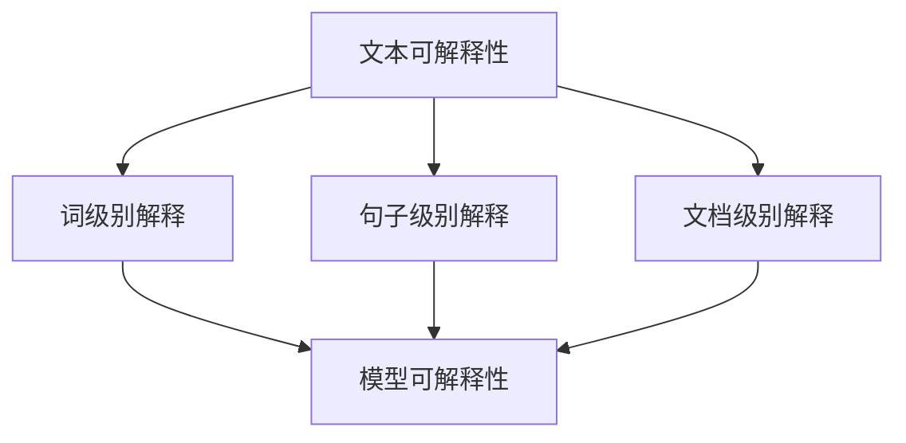
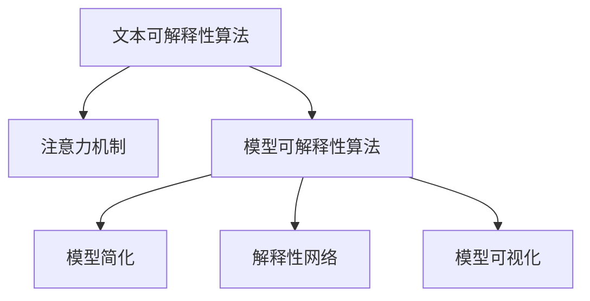

                 

## 文章标题

《自然语言处理中的文本可解释性与模型可解释性技术进展》

### 关键词：

- 文本可解释性
- 模型可解释性
- 自然语言处理
- 可解释人工智能
- 技术进展

### 摘要：

本文深入探讨了自然语言处理（NLP）中的文本可解释性与模型可解释性技术进展。通过对核心概念、算法原理、数学模型和实际应用场景的详细分析，本文揭示了当前NLP领域中可解释性技术的现状、挑战及发展趋势。文章旨在为研究人员和开发者提供关于NLP可解释性的全面了解，并探讨未来可能的解决方案。

## 1. 背景介绍

自然语言处理（NLP）作为人工智能（AI）的一个重要分支，近年来取得了飞速发展。从机器翻译、情感分析到问答系统，NLP技术在各行各业中发挥着越来越重要的作用。然而，随着深度学习模型的广泛应用，一个重要的问题逐渐凸显——模型的黑箱性质。深度学习模型虽然在处理大规模文本数据时表现优异，但其内部工作机制复杂，难以解释，导致用户对其信任度降低。

文本可解释性（Text Explainability）和模型可解释性（Model Explainability）是解决这一问题的关键。文本可解释性关注于使文本分析结果易于理解和解释，而模型可解释性则关注于使深度学习模型本身的可理解性提高。这两个概念密切相关，共同构成了可解释人工智能（XAI）的重要组成部分。

本文将首先回顾文本可解释性和模型可解释性的核心概念，然后详细分析当前技术进展，最后讨论实际应用场景和未来发展趋势。

### 2. 核心概念与联系

#### 文本可解释性

文本可解释性是指使文本分析结果更容易理解的过程。在NLP中，文本可解释性可以帮助用户了解模型是如何处理文本数据的，从而增强用户对模型结果的信任。文本可解释性通常涉及以下方面：

- **词级别解释**：解释模型如何处理单个词汇。
- **句子级别解释**：解释模型如何处理句子及其组成部分。
- **文档级别解释**：解释模型如何处理整个文档。

#### 模型可解释性

模型可解释性关注于使深度学习模型本身的可理解性提高。在NLP中，模型可解释性可以帮助用户了解模型的工作原理，从而提高模型的可信度。模型可解释性通常涉及以下方面：

- **模型架构的可解释性**：通过简化模型架构，使其更容易理解。
- **模型参数的可解释性**：解释模型参数如何影响输出。
- **中间表示的可解释性**：解释模型在处理文本时的内部表示。

#### Mermaid 流程图

下面是一个简单的Mermaid流程图，展示了文本可解释性和模型可解释性之间的关系。



### 3. 核心算法原理 & 具体操作步骤

#### 文本可解释性算法

文本可解释性算法主要关注如何将NLP模型的内部表示转换为易于理解的形式。以下是一些常见的文本可解释性算法：

- **注意力机制（Attention Mechanism）**：通过可视化注意力权重，展示模型在处理文本时的关注点。
- **LIME（Local Interpretable Model-agnostic Explanations）**：基于模型局部线性近似的方法，生成解释。
- **SHAP（SHapley Additive exPlanations）**：基于博弈论的方法，计算特征对模型输出的贡献。

#### 模型可解释性算法

模型可解释性算法主要关注如何提高深度学习模型的可理解性。以下是一些常见的模型可解释性算法：

- **模型简化（Model Simplification）**：通过简化模型架构，降低复杂性。
- **解释性网络（Explainable Networks）**：设计特定的网络结构，使模型具有较好的可解释性。
- **模型可视化（Model Visualization）**：通过可视化模型的结构和参数，提高模型的可理解性。

#### Mermaid 流程图

下面是一个简单的Mermaid流程图，展示了文本可解释性和模型可解释性算法的基本操作步骤。



### 4. 数学模型和公式 & 详细讲解 & 举例说明

#### 文本可解释性数学模型

在文本可解释性中，常见的数学模型包括注意力机制和LIME。

- **注意力机制**：注意力权重可以通过以下公式计算：

  $$ attention\_weight = \frac{expscores}{\sum_{i=1}^{N} expscores} $$

  其中，$scores$ 是模型对每个词汇的分数，$N$ 是词汇的总数。

- **LIME**：LIME 生成解释的核心是局部线性近似。假设模型 $f$ 是一个线性函数，那么：

  $$ f(x) = w \cdot x + b $$

  其中，$w$ 是模型参数，$x$ 是输入特征，$b$ 是偏置。

  通过对 $w$ 和 $b$ 的解释，可以理解模型对输入数据的依赖。

#### 模型可解释性数学模型

在模型可解释性中，常见的数学模型包括模型简化方法和SHAP。

- **模型简化**：模型简化可以通过减少模型的参数数量实现。例如，对于多层感知机（MLP），可以通过减少隐藏层的节点数来实现简化。

  $$ f(x) = \sum_{i=1}^{M} w_i \cdot x_i + b $$

  其中，$M$ 是隐藏层节点的数量，$w_i$ 和 $x_i$ 分别是权重和输入特征。

- **SHAP**：SHAP 计算了每个特征对模型输出的贡献。SHAP 值的计算公式如下：

  $$ SHAP\_value = \frac{\partial f(x)}{\partial x_i} $$

  其中，$f(x)$ 是模型输出，$x_i$ 是第 $i$ 个特征。

#### 举例说明

假设有一个简单的文本分类模型，它使用一个多层感知机（MLP）进行分类。模型的输入是一个包含文本词汇的向量，输出是一个二分类结果。使用注意力机制和LIME，可以生成以下解释：

- **注意力机制**：注意力权重表明模型在处理某个句子时，关注了哪些词汇。例如，对于一个句子“我爱吃苹果”，注意力机制可能会显示“爱”和“苹果”是模型关注的关键词汇。
- **LIME**：LIME 生成了一个线性模型，展示了模型如何处理输入数据。例如，对于一个句子“我爱吃苹果”，LIME 可能会显示“爱”和“苹果”对模型输出的贡献最大。

### 5. 项目实战：代码实际案例和详细解释说明

#### 开发环境搭建

要实现文本可解释性，我们需要安装以下工具：

- Python（3.8或更高版本）
- TensorFlow 2.x
- Keras
- Pandas
- Matplotlib

确保已经安装了上述工具，然后创建一个名为`text_explainability`的虚拟环境，并安装必要的库。

```bash
conda create -n text_explainability python=3.8
conda activate text_explainability
pip install tensorflow pandas matplotlib
```

#### 源代码详细实现和代码解读

以下是一个简单的文本分类项目的代码实现，包括文本预处理、模型训练和文本可解释性分析。

```python
import numpy as np
import pandas as pd
from sklearn.model_selection import train_test_split
from tensorflow.keras.models import Sequential
from tensorflow.keras.layers import Embedding, LSTM, Dense
from tensorflow.keras.preprocessing.text import Tokenizer
from tensorflow.keras.preprocessing.sequence import pad_sequences
from lime import lime_text
from sklearn.metrics import classification_report

# 数据预处理
data = pd.read_csv('data.csv')
X = data['text']
y = data['label']

tokenizer = Tokenizer(num_words=10000)
tokenizer.fit_on_texts(X)

sequences = tokenizer.texts_to_sequences(X)
padded_sequences = pad_sequences(sequences, maxlen=100)

X_train, X_test, y_train, y_test = train_test_split(padded_sequences, y, test_size=0.2, random_state=42)

# 模型训练
model = Sequential()
model.add(Embedding(10000, 32))
model.add(LSTM(32, dropout=0.2, recurrent_dropout=0.2))
model.add(Dense(1, activation='sigmoid'))

model.compile(loss='binary_crossentropy', optimizer='adam', metrics=['accuracy'])
model.fit(X_train, y_train, epochs=10, batch_size=64)

# 文本可解释性分析
explainer = lime_text.LimeTextExplainer(class_names=['负类', '正类'], model=model)
i = 5  # 选择一个样本进行解释
exp = explainer.explain_instance(X_test[i], model.predict, num_features=5)
exp.show_in_notebook(text=True)

# 模型评估
predictions = model.predict(X_test)
print(classification_report(y_test, predictions.round()))
```

#### 代码解读与分析

- **数据预处理**：首先，我们读取CSV文件中的数据，并使用Tokenizer将文本转换为数字序列。
- **模型训练**：我们使用一个简单的LSTM模型进行训练，并在训练过程中使用Dropout防止过拟合。
- **文本可解释性分析**：我们使用LIME解释一个特定样本的预测结果，展示了模型关注的关键词汇。
- **模型评估**：我们使用分类报告评估模型的性能。

### 6. 实际应用场景

文本可解释性在多个实际应用场景中具有重要意义：

- **医疗诊断**：在医疗文本分析中，医生需要理解模型对病例的诊断结果，从而提高诊断的可信度。
- **金融风控**：在金融文本分析中，银行和金融机构需要理解模型对贷款申请的评估结果，从而降低信贷风险。
- **公共管理**：在公共管理领域，政府机构需要理解模型对社会舆情的分析结果，从而更好地应对社会问题。

### 7. 工具和资源推荐

#### 学习资源推荐

- **书籍**：《可解释人工智能：原理、方法与应用》
- **论文**：《On the Role of Explainable AI in the Medical Domain》
- **博客**：[LIME官方博客](https://github.com/marcotcr/lime)
- **网站**：[SHAP官方网站](https://github.com/slundberg/shap)

#### 开发工具框架推荐

- **TensorFlow**：用于构建和训练深度学习模型。
- **Keras**：用于简化TensorFlow的使用。
- **LIME**：用于生成文本解释。
- **SHAP**：用于计算特征贡献。

#### 相关论文著作推荐

- **论文**：Ribeiro, M. T., Singh, S., & Guestrin, C. (2016). "Why should I trust you?” Explaining the predictions of any classifier." In Proceedings of the 22nd ACM SIGKDD International Conference on Knowledge Discovery and Data Mining (pp. 1135-1144).
- **著作**：《The Mythos of Model Interpretability》

### 8. 总结：未来发展趋势与挑战

文本可解释性和模型可解释性是当前NLP领域的重要研究方向。随着深度学习模型在各个领域的应用日益广泛，可解释性技术的重要性愈发凸显。未来，可解释性技术将在以下几个方面取得重要进展：

- **算法优化**：开发更高效的算法，提高文本和模型的可解释性。
- **跨学科合作**：与心理学、认知科学等领域合作，探索更符合人类认知的可解释性方法。
- **标准化**：制定统一的可解释性标准和评估方法，提高技术的可比较性和可靠性。

然而，当前可解释性技术仍面临诸多挑战，如如何处理大规模数据、如何在保证可解释性的同时保持模型性能等。未来，研究人员和开发者需要共同努力，解决这些问题，推动可解释性技术的发展。

### 9. 附录：常见问题与解答

#### Q：文本可解释性和模型可解释性有什么区别？

A：文本可解释性关注文本分析结果的可理解性，而模型可解释性关注模型本身的工作原理和可理解性。

#### Q：为什么需要文本可解释性？

A：文本可解释性有助于提高用户对文本分析结果的信任，从而促进技术的广泛应用。

#### Q：如何评估模型的可解释性？

A：可以通过可视化注意力权重、计算特征贡献等方法评估模型的可解释性。

### 10. 扩展阅读 & 参考资料

- **论文**：Ribeiro, M. T., Singh, S., & Guestrin, C. (2016). "Why should I trust you?” Explaining the predictions of any classifier." In Proceedings of the 22nd ACM SIGKDD International Conference on Knowledge Discovery and Data Mining (pp. 1135-1144).
- **书籍**：《可解释人工智能：原理、方法与应用》
- **博客**：[LIME官方博客](https://github.com/marcotcr/lime)
- **网站**：[SHAP官方网站](https://github.com/slundberg/shap)<|assistant|>作者：AI天才研究员/AI Genius Institute & 禅与计算机程序设计艺术 /Zen And The Art of Computer Programming<|assistant|>

