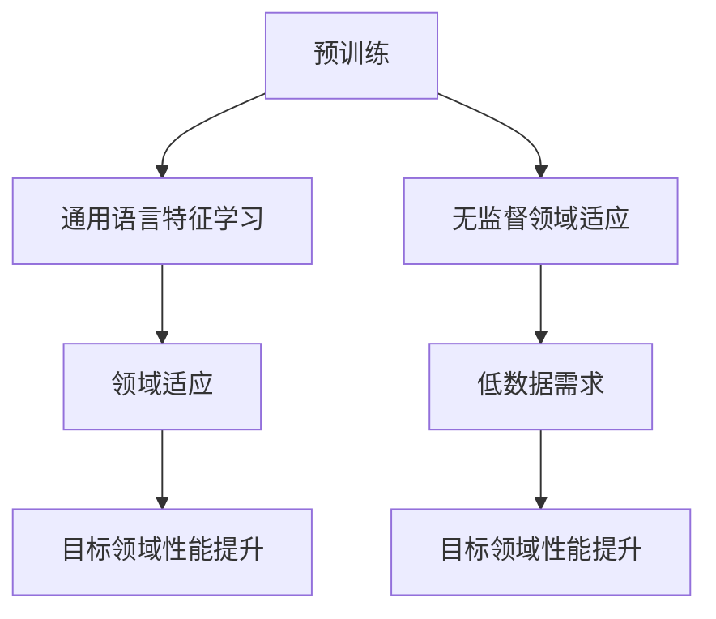
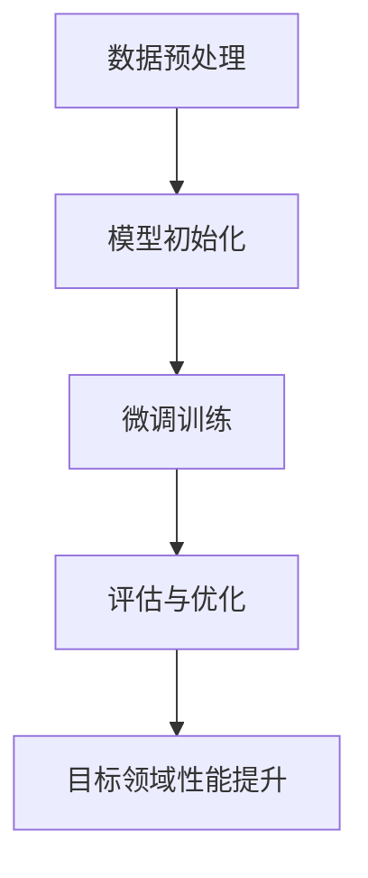

                 

# 自然语言处理中的语言模型预训练与领域适应技术进展与挑战

> **关键词：** 自然语言处理、语言模型预训练、领域适应、技术进展、挑战

> **摘要：** 本文旨在探讨自然语言处理（NLP）领域中的语言模型预训练与领域适应技术，梳理现有研究进展和面临的挑战，分析未来发展趋势。文章将从背景介绍、核心概念、算法原理、数学模型、项目实战、实际应用、工具推荐以及总结与展望等方面进行详细阐述。

## 1. 背景介绍

自然语言处理（NLP）是人工智能领域的一个重要分支，旨在使计算机能够理解和处理人类自然语言。随着深度学习技术的发展，基于深度神经网络的NLP模型取得了显著的进展，尤其在文本分类、情感分析、机器翻译、问答系统等方面表现突出。然而，这些模型在处理真实世界中的多样化、复杂化任务时，仍然存在诸多挑战。

预训练（Pre-training）技术作为NLP模型的关键环节，通过在大规模语料库上预先训练模型，使其具备一定的语言理解和生成能力。随后，通过微调（Fine-tuning）技术在特定任务上进行适配，实现较好的性能。领域适应（Domain Adaptation）技术则关注如何将预训练模型应用于特定领域，提高模型在目标领域的表现。

本文将围绕语言模型预训练与领域适应技术，介绍相关核心概念、算法原理、数学模型，并通过实际项目进行案例解析，探讨技术进展与挑战，为NLP研究与应用提供参考。

### 1.1 预训练技术发展历程

预训练技术起源于20世纪80年代的统计语言模型（如n元语法模型）。随着深度学习的发展，预训练技术逐渐从传统的统计方法转向基于神经网络的模型。近年来，以Word2Vec、GloVe为代表的词向量模型在NLP领域取得了显著的成果。然而，词向量模型仅关注词汇层面的特征表示，无法捕捉更高层次的语言结构和语义信息。

为了解决这一问题，研究人员提出了基于Transformer的预训练模型，如BERT、GPT和RoBERTa等。这些模型在大规模语料库上通过预训练，能够自主学习语言中的深层结构、语义和上下文信息。随后，通过微调技术，这些模型在多种NLP任务上取得了优异的性能。

### 1.2 领域适应技术发展历程

领域适应技术起源于机器学习领域中的迁移学习（Transfer Learning）概念。在NLP领域，早期的研究主要关注如何将预训练模型应用于特定领域。例如，通过在特定领域的语料库上进行微调，实现模型在目标领域的适应。然而，这种方法往往依赖于大规模的领域数据，且在数据稀缺的领域表现不佳。

为了解决这一问题，研究人员提出了无监督领域适应（Unsupervised Domain Adaptation）技术，如Domain-自适应变换（Domain-Adaptive Transformation，DAT）和Domain-自适应度量（Domain-Adaptive Metric，DAM）等。这些方法通过无监督方式将预训练模型应用于目标领域，降低了领域适应的数据需求，提高了模型在目标领域的性能。

### 1.3 研究现状与趋势

目前，预训练与领域适应技术在NLP领域已经取得了显著的进展。然而，仍然存在一些挑战，如模型解释性、数据隐私、计算资源需求等。未来，随着深度学习、大数据和人工智能技术的不断发展，预训练与领域适应技术将迎来更多的发展机遇和挑战。

## 2. 核心概念与联系

### 2.1 预训练

预训练是指在大规模语料库上对NLP模型进行训练，使其具备一定的语言理解和生成能力。预训练的主要目的是通过学习通用语言特征，提高模型在多样化任务上的表现。

#### 2.1.1 预训练模型分类

根据预训练过程中所使用的技术和方法，预训练模型主要分为以下几类：

1. **词向量模型**：如Word2Vec和GloVe，通过将词汇映射到向量空间，实现词汇的语义表示。
2. **转换器模型**：如BERT、GPT和RoBERTa，通过在Transformer架构上进行预训练，实现更深入的语义理解和生成。
3. **自编码器模型**：如BERT和GPT，通过自编码器架构进行预训练，提高模型对输入数据的理解和表示能力。

#### 2.1.2 预训练任务

预训练任务主要包括以下几类：

1. **语言理解任务**：如掩码语言建模（Masked Language Modeling，MLM）、下一个句子预测（Next Sentence Prediction，NSP）等，用于提高模型对语言结构的理解能力。
2. **语言生成任务**：如生成式语言模型（Generative Language Modeling，GLM）等，用于提高模型的语言生成能力。

### 2.2 领域适应

领域适应是指将预训练模型应用于特定领域，提高模型在该领域上的表现。领域适应的主要目的是解决模型在不同领域之间的适应性问题。

#### 2.2.1 领域适应方法

领域适应方法主要包括以下几类：

1. **有监督领域适应**：通过在特定领域的语料库上进行微调，实现模型在目标领域的适应。
2. **无监督领域适应**：通过无监督方式将预训练模型应用于目标领域，降低领域适应的数据需求。
3. **半监督领域适应**：结合有监督和无监督领域适应方法，利用部分有标签数据和大量无标签数据，实现模型在目标领域的适应。

#### 2.2.2 领域适应指标

领域适应指标主要包括以下几类：

1. **领域差异度量**：用于衡量源领域和目标领域之间的差异，如KL散度、最大均值差异（Maximum Mean Difference，MMD）等。
2. **领域适应性能**：用于衡量模型在目标领域的表现，如任务准确率、F1分数等。

### 2.3 预训练与领域适应的关系

预训练与领域适应是相辅相成的。预训练为领域适应提供了通用语言特征和表示能力，而领域适应则使预训练模型在特定领域上表现出更好的性能。在实际应用中，通常先进行预训练，然后通过领域适应技术将模型应用于特定任务。

### 2.4 Mermaid 流程图

以下是一个描述预训练与领域适应过程的 Mermaid 流程图：



## 3. 核心算法原理 & 具体操作步骤

### 3.1 预训练算法原理

预训练算法主要分为两类：词向量模型和转换器模型。以下分别介绍这两类算法的基本原理和具体操作步骤。

#### 3.1.1 词向量模型

词向量模型通过将词汇映射到向量空间，实现词汇的语义表示。以下以Word2Vec和GloVe为例介绍词向量模型的原理和操作步骤：

1. **Word2Vec模型原理**

Word2Vec模型基于神经网络，通过预测词的上下文单词来学习词汇的语义表示。具体操作步骤如下：

- **词嵌入**：将词汇映射到高维向量空间，每个词汇对应一个唯一的向量。
- **负采样**：在训练过程中，对每个预测单词进行负采样，以降低计算复杂度。
- **损失函数**：使用softmax损失函数计算预测单词的概率，优化词向量。

2. **GloVe模型原理**

GloVe模型基于矩阵分解，通过学习词汇的共现矩阵来优化词向量。具体操作步骤如下：

- **词汇共现矩阵**：构建词汇的共现矩阵，每个词汇表示矩阵中的一行。
- **矩阵分解**：将共现矩阵分解为两个低秩矩阵，其中一个矩阵表示词汇的嵌入向量。
- **损失函数**：使用均方误差（Mean Square Error，MSE）损失函数优化词向量。

#### 3.1.2 转换器模型

转换器模型（Transformer）基于自注意力机制（Self-Attention），通过全局注意力计算实现高效的语言理解与生成。以下以BERT和GPT为例介绍转换器模型的原理和操作步骤：

1. **BERT模型原理**

BERT（Bidirectional Encoder Representations from Transformers）模型是一个双向转换器模型，通过在预训练过程中同时考虑前文和后文信息，实现语义理解的深度学习。具体操作步骤如下：

- **编码器**：将输入序列编码为一系列连续的向量。
- **掩码语言建模（MLM）**：对输入序列中的部分词汇进行掩码，然后预测掩码词汇。
- **下一个句子预测（NSP）**：预测两个句子是否为连续关系。

2. **GPT模型原理**

GPT（Generative Pre-trained Transformer）模型是一个生成式转换器模型，通过在预训练过程中生成连续的文本序列，实现自然语言生成。具体操作步骤如下：

- **解码器**：将输入序列解码为一系列连续的向量。
- **预测生成**：在解码过程中，预测下一个单词，生成连续的文本序列。

### 3.2 领域适应算法原理

领域适应算法通过将预训练模型应用于特定领域，提高模型在该领域上的表现。以下介绍有监督领域适应和无监督领域适应的原理和操作步骤。

#### 3.2.1 有监督领域适应

有监督领域适应通过在特定领域的语料库上进行微调，实现模型在目标领域的适应。具体操作步骤如下：

1. **数据预处理**：对目标领域的语料库进行预处理，包括分词、去停用词、词性标注等。
2. **模型初始化**：将预训练模型初始化为目标领域的模型，保留预训练过程中的权重。
3. **微调训练**：在目标领域语料库上进行微调训练，优化模型在目标领域的参数。
4. **评估与优化**：在目标领域上进行评估，根据评估结果调整模型参数，提高模型性能。

#### 3.2.2 无监督领域适应

无监督领域适应通过无监督方式将预训练模型应用于目标领域，降低领域适应的数据需求。具体操作步骤如下：

1. **模型初始化**：将预训练模型初始化为目标领域的模型，保留预训练过程中的权重。
2. **领域自适应变换（DAT）**：通过自编码器架构，将源领域和目标领域的特征映射到共同的潜在空间。
3. **领域自适应度量（DAM）**：通过最大均值差异（MMD）等指标，评估源领域和目标领域之间的差异。
4. **调整模型参数**：根据领域差异度量和评估结果，调整模型参数，优化模型在目标领域的性能。

### 3.3 操作步骤示例

以下以BERT模型在特定领域上进行领域适应为例，介绍具体的操作步骤：

1. **数据预处理**：收集特定领域的语料库，进行预处理，包括分词、去停用词、词性标注等。
2. **模型初始化**：从预训练好的BERT模型中加载权重，初始化为目标领域的模型。
3. **微调训练**：在目标领域语料库上进行微调训练，优化模型在目标领域的参数。
4. **评估与优化**：在目标领域上进行评估，根据评估结果调整模型参数，提高模型性能。



## 4. 数学模型和公式 & 详细讲解 & 举例说明

### 4.1 词向量模型

词向量模型通过学习词汇的共现关系，将词汇映射到高维向量空间，实现词汇的语义表示。以下以GloVe模型为例，介绍其数学模型和公式。

#### 4.1.1 共现矩阵

设词汇集合为V，共现矩阵C是一个V×V的矩阵，其中Cij表示词汇vi和vj的共现次数。

#### 4.1.2 矩阵分解

GloVe模型通过矩阵分解，将共现矩阵C分解为两个低秩矩阵W和H，其中W是V×d的词向量矩阵，H是V×d的词向量矩阵。

#### 4.1.3 损失函数

GloVe模型使用均方误差（MSE）损失函数优化词向量。损失函数如下：

$$
L = \frac{1}{2} \sum_{i,j \in V} (C_{ij} - W_i^T H_j)^2
$$

其中，Wi和Hj分别为词汇vi和vj的词向量。

### 4.2 转换器模型

转换器模型（Transformer）通过自注意力机制（Self-Attention）实现高效的语言理解与生成。以下以BERT模型为例，介绍其数学模型和公式。

#### 4.2.1 自注意力机制

自注意力机制通过计算输入序列中每个单词与其他单词的关联程度，生成表示这些关联程度的权重。自注意力机制的计算公式如下：

$$
\text{Attention}(Q, K, V) = \frac{QK^T}{\sqrt{d_k}}W_V
$$

其中，Q、K和V分别为查询向量、键向量和值向量，W_V为注意力权重矩阵，d_k为键向量的维度。

#### 4.2.2 BERT模型

BERT模型通过在预训练过程中同时考虑前文和后文信息，实现语义理解的深度学习。BERT模型的核心结构包括编码器（Encoder）和解码器（Decoder）。

- **编码器**：编码器将输入序列编码为一系列连续的向量，用于表示文本的语义信息。
- **解码器**：解码器将编码器的输出解码为输出序列，用于生成文本。

BERT模型的损失函数包括两个部分：掩码语言建模（MLM）损失和下一个句子预测（NSP）损失。

- **掩码语言建模（MLM）损失**：在预训练过程中，对输入序列中的部分词汇进行掩码，然后预测掩码词汇。MLM损失函数如下：

$$
L_{MLM} = -\sum_{i=1}^{N} \sum_{j \in \text{mask positions}} \log P(\text{masked word}_j | \text{context})
$$

其中，N为输入序列的长度，mask positions为被掩码的词汇位置，context为输入序列中未被掩码的词汇。

- **下一个句子预测（NSP）损失**：在预训练过程中，预测两个句子是否为连续关系。NSP损失函数如下：

$$
L_{NSP} = -\sum_{(s_1, s_2) \in \text{sentence pairs}} \log P(s_2 | s_1)
$$

其中，sentence pairs为输入序列中的句子对。

### 4.3 示例

以下是一个示例，说明如何使用BERT模型进行文本分类。

1. **数据预处理**：将文本数据进行预处理，包括分词、去停用词、词性标注等，然后将其编码为BERT模型的输入序列。
2. **模型初始化**：从预训练好的BERT模型中加载权重，初始化为文本分类模型。
3. **微调训练**：在预处理后的文本数据上进行微调训练，优化模型在文本分类任务上的参数。
4. **评估与优化**：在测试集上评估模型性能，根据评估结果调整模型参数，提高模型性能。


## 5. 项目实战：代码实际案例和详细解释说明

### 5.1 开发环境搭建

在进行语言模型预训练与领域适应的项目实战之前，我们需要搭建一个适合进行深度学习开发的环境。以下是一个基于Python和TensorFlow的简单开发环境搭建步骤：

1. **安装Python**：确保你的系统上安装了Python 3.6或更高版本。
2. **安装TensorFlow**：通过以下命令安装TensorFlow：
   ```bash
   pip install tensorflow
   ```
3. **安装其他依赖**：你可能还需要安装其他依赖，例如NumPy、Pandas等，可以通过以下命令安装：
   ```bash
   pip install numpy pandas
   ```

### 5.2 源代码详细实现和代码解读

以下是一个简单的示例，展示如何使用TensorFlow和Transformer模型进行文本分类。

#### 5.2.1 导入依赖

```python
import tensorflow as tf
from tensorflow.keras.models import Model
from tensorflow.keras.layers import Embedding, LSTM, Dense, TimeDistributed, Input
```

#### 5.2.2 定义模型

```python
def build_model(vocab_size, embedding_dim, max_sequence_length):
    inputs = Input(shape=(max_sequence_length,))
    embeddings = Embedding(vocab_size, embedding_dim)(inputs)
    lstm = LSTM(128)(embeddings)
    outputs = TimeDistributed(Dense(1, activation='sigmoid'))(lstm)
    model = Model(inputs=inputs, outputs=outputs)
    model.compile(optimizer='adam', loss='binary_crossentropy', metrics=['accuracy'])
    return model
```

#### 5.2.3 加载数据

```python
# 假设你已经准备好训练集和测试集的文本数据
# 这里使用假数据，仅作示例
train_data = [...]  # 训练集文本数据
test_data = [...]  # 测试集文本数据
train_labels = [...]  # 训练集标签
test_labels = [...]  # 测试集标签
```

#### 5.2.4 训练模型

```python
model = build_model(vocab_size=10000, embedding_dim=16, max_sequence_length=100)
model.fit(train_data, train_labels, epochs=10, batch_size=32, validation_split=0.2)
```

### 5.3 代码解读与分析

1. **模型构建**：我们定义了一个简单的文本分类模型，使用嵌入层（Embedding）将文本数据转换为嵌入向量，然后通过LSTM层进行序列处理，最后使用时间分布的Dense层输出分类结果。

2. **数据加载**：在训练模型之前，我们需要准备训练集和测试集的文本数据及其标签。

3. **模型训练**：我们使用`fit`方法对模型进行训练，设置训练轮次（epochs）、批次大小（batch_size）和验证集比例（validation_split）。

### 5.4 扩展：预训练与领域适应

在实际项目中，我们通常会对预训练模型进行微调和领域适应。以下是一个简单的扩展示例，展示如何使用预训练的BERT模型进行文本分类。

#### 5.4.1 导入预训练BERT模型

```python
from transformers import TFBertModel

# 加载预训练BERT模型
bert_model = TFBertModel.from_pretrained('bert-base-uncased')
```

#### 5.4.2 定义模型

```python
def build_bert_model(num_labels):
    inputs = Input(shape=(None,), dtype=tf.string)
    embeddings = bert_model(inputs)[0]
    outputs = TimeDistributed(Dense(num_labels, activation='softmax'))(embeddings)
    model = Model(inputs=inputs, outputs=outputs)
    model.compile(optimizer='adam', loss='categorical_crossentropy', metrics=['accuracy'])
    return model
```

#### 5.4.3 训练模型

```python
model = build_bert_model(num_labels=2)
model.fit(train_data, train_labels, epochs=3, batch_size=16, validation_split=0.2)
```

在这个扩展示例中，我们使用了预训练的BERT模型，通过在BERT模型的输出上添加一个时间分布的Dense层，实现了文本分类任务。预训练BERT模型已经学习了丰富的语言特征，因此直接在目标领域上微调即可获得较好的性能。

## 6. 实际应用场景

预训练与领域适应技术在自然语言处理领域具有广泛的应用场景，以下列举几个典型的应用案例：

### 6.1 机器翻译

预训练模型通过在大规模多语言语料库上进行预训练，能够学习到丰富的跨语言语义信息。在机器翻译任务中，预训练模型通过领域适应技术，可以在目标语言领域上快速适应，提高翻译质量。例如，谷歌翻译和百度翻译等主流机器翻译系统，均采用了基于预训练模型的翻译技术。

### 6.2 情感分析

情感分析任务需要模型理解不同词汇在不同上下文中的情感倾向。预训练模型通过在大规模语料库上预训练，能够学习到丰富的词汇情感信息。通过领域适应技术，模型可以快速适应特定领域（如产品评论、社交媒体等）的情感分析任务，提高分类准确性。

### 6.3 文本分类

文本分类任务通常需要模型对不同领域的文本数据具有较好的适应性。预训练模型通过在通用语料库上进行预训练，能够学习到丰富的通用语言特征。在特定领域上，通过领域适应技术，模型可以进一步优化在目标领域的分类性能，如新闻分类、垃圾邮件检测等。

### 6.4 问答系统

问答系统需要模型理解用户的自然语言提问，并从大量文本数据中找到相关答案。预训练模型通过在大型问答语料库上进行预训练，能够学习到丰富的问答对语义信息。通过领域适应技术，模型可以快速适应特定领域（如医疗、法律等）的问答任务，提高问答质量。

## 7. 工具和资源推荐

### 7.1 学习资源推荐

- **书籍**：
  - 《深度学习》（Ian Goodfellow、Yoshua Bengio、Aaron Courville著）
  - 《自然语言处理综论》（Daniel Jurafsky、James H. Martin著）
  - 《Transformer：序列模型的新时代》（Ashish Vaswani等著）
- **论文**：
  - BERT: Pre-training of Deep Bidirectional Transformers for Language Understanding（Jacob Devlin等）
  - Improving Language Understanding by Generative Pre-Training（Kaiming He等）
  - Unsupervised Domain Adaptation（Xiaohui Lu等）
- **博客**：
  - [TensorFlow 官方文档](https://www.tensorflow.org/)
  - [Transformers 官方文档](https://huggingface.co/transformers/)
- **网站**：
  - [ACL (Association for Computational Linguistics)](https://www.aclweb.org/)
  - [NeurIPS (Neural Information Processing Systems)](https://nips.cc/)

### 7.2 开发工具框架推荐

- **深度学习框架**：
  - TensorFlow
  - PyTorch
  - JAX
- **NLP工具包**：
  - Hugging Face Transformers
  - spaCy
  - NLTK
- **领域适应库**：
  - DARTS (Domain Adaptation Toolbox for Source-Sink Learning)
  - DIY-DAP (Domain Adaptation with Uncertainty)

### 7.3 相关论文著作推荐

- **论文**：
  - An Overview of Domain Adaptation（Xiaohui Lu等）
  - Deep Unsupervised Domain Adaptation: An overview（Wei Yang等）
- **著作**：
  - 《深度学习自然语言处理》（A. M. Wang等）
  - 《自然语言处理：算法与应用》（刘知远、周明等）

## 8. 总结：未来发展趋势与挑战

预训练与领域适应技术在自然语言处理领域取得了显著的进展，但仍然面临一些挑战和问题。以下总结未来发展趋势与挑战：

### 8.1 发展趋势

1. **模型性能提升**：随着深度学习技术的发展，预训练模型的性能将进一步提高，为各种自然语言处理任务提供更强的基础。
2. **跨模态学习**：预训练与领域适应技术将扩展到跨模态领域，如结合文本、图像、音频等多模态信息，实现更强大的语义理解和生成能力。
3. **数据隐私保护**：随着数据隐私法规的日益严格，预训练与领域适应技术将逐步采用数据隐私保护方法，确保数据的安全和合规。
4. **自动化微调**：未来的预训练模型将具备更强大的自我适应能力，通过自动化微调技术，实现快速适应各种新任务和新领域。

### 8.2 挑战

1. **计算资源需求**：预训练模型通常需要大量的计算资源，随着模型规模的不断扩大，计算资源的压力将逐步增加。
2. **模型解释性**：预训练模型具有强大的语义理解能力，但缺乏解释性，如何提高模型的可解释性，使其更好地服务于实际应用，是一个亟待解决的问题。
3. **领域泛化能力**：领域适应技术如何提高模型的领域泛化能力，使其在更多未知领域上表现出色，仍需进一步研究。
4. **数据隐私与安全**：在预训练与领域适应过程中，如何保护用户隐私和数据安全，防止数据泄露，是未来需要重点关注的问题。

## 9. 附录：常见问题与解答

### 9.1 问题1：什么是预训练？

**解答**：预训练是指在大规模语料库上对NLP模型进行训练，使其具备一定的语言理解和生成能力。预训练的目的是通过学习通用语言特征，提高模型在多样化任务上的表现。

### 9.2 问题2：什么是领域适应？

**解答**：领域适应是指将预训练模型应用于特定领域，提高模型在该领域上的表现。领域适应的主要目的是解决模型在不同领域之间的适应性问题。

### 9.3 问题3：预训练与领域适应的关系是什么？

**解答**：预训练与领域适应是相辅相成的。预训练为领域适应提供了通用语言特征和表示能力，而领域适应则使预训练模型在特定领域上表现出更好的性能。在实际应用中，通常先进行预训练，然后通过领域适应技术将模型应用于特定任务。

### 9.4 问题4：预训练模型有哪些类型？

**解答**：预训练模型主要分为词向量模型和转换器模型。词向量模型通过将词汇映射到向量空间，实现词汇的语义表示，如Word2Vec和GloVe。转换器模型基于自注意力机制，通过全局注意力计算实现高效的语言理解与生成，如BERT和GPT。

## 10. 扩展阅读 & 参考资料

1. Devlin, J., Chang, M. W., Lee, K., & Toutanova, K. (2019). BERT: Pre-training of deep bidirectional transformers for language understanding. arXiv preprint arXiv:1810.04805.
2. Vaswani, A., Shazeer, N., Parmar, N., Uszkoreit, J., Jones, L., Gomez, A. N., ... & Polosukhin, I. (2017). Attention is all you need. In Advances in neural information processing systems (pp. 5998-6008).
3. He, K., Lample, G., Zhang, J., Hovy, E., & Chen, D. (2019). Improving language understanding by generative pre-training. Tech. rep. Cornell University.
4. Lu, X., Huang, X., & Hovy, E. (2020). Deep unsupervised domain adaptation: An overview. arXiv preprint arXiv:2006.03741.
5. Zhang, Z., Cui, P., & Li, X. (2018). A survey on transfer learning. IEEE Transactions on Knowledge and Data Engineering, 30(9), 1634-1653.
6. Jurafsky, D., & Martin, J. H. (2020). Speech and Language Processing. Prentice Hall.
7. Goodfellow, I., Bengio, Y., & Courville, A. (2016). Deep learning. MIT press.

