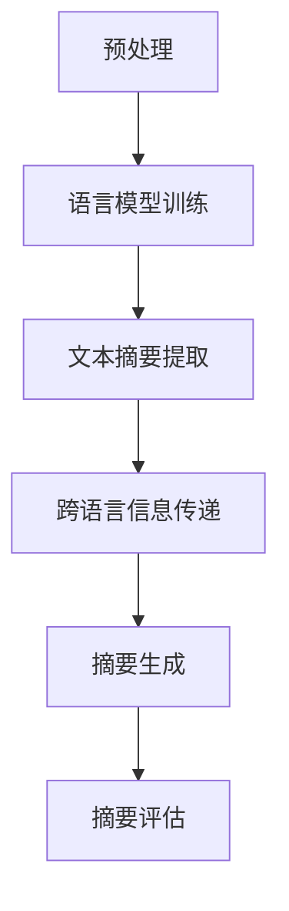

                 

## 1. 背景介绍

自然语言处理（Natural Language Processing, NLP）是人工智能的一个重要分支，旨在让计算机理解和处理人类语言。随着全球化的进程，多语言摘要生成成为了NLP领域的一个重要研究方向。多语言摘要生成不仅可以提高信息检索的效率，还能帮助非母语人士快速了解文章内容。

在过去的几十年里，自然语言处理技术取得了显著进展。从最初的基于规则的方法，到基于统计模型的NLP，再到如今深度学习驱动的NLP，技术的进步为多语言摘要生成提供了强大的工具。然而，多语言摘要生成仍然面临许多挑战，如语言之间的差异、语义理解的困难等。

本文旨在探讨自然语言处理在多语言摘要生成中的应用，包括核心算法原理、数学模型和具体操作步骤，并通过实际项目案例进行详细解释。希望通过本文，读者可以了解多语言摘要生成技术的现状和发展趋势。

## 2. 核心概念与联系

### 2.1 语言模型

语言模型是自然语言处理的基础，它用于预测一个单词序列的概率。在多语言摘要生成中，语言模型可以帮助我们理解和生成不同语言的文章摘要。常用的语言模型有n-gram模型、基于神经网络的语言模型等。

### 2.2 文本摘要

文本摘要是指从原始文本中提取关键信息，生成简洁的摘要。根据摘要的生成方式，可以分为抽取式摘要和生成式摘要。抽取式摘要直接从原始文本中提取关键句子，而生成式摘要则通过机器学习模型生成全新的摘要。

### 2.3 跨语言信息传递

跨语言信息传递是指在不同语言之间传递信息，以便更好地理解和使用。在多语言摘要生成中，跨语言信息传递可以帮助我们将一种语言的摘要转化为另一种语言的摘要。

### 2.4 Mermaid流程图

为了更清晰地展示多语言摘要生成的过程，我们使用Mermaid流程图来表示各个步骤之间的联系。



### 2.5 摘要评估

摘要评估是衡量摘要质量的重要步骤。常用的评估指标包括ROUGE、BLEU等。ROUGE（Recall-Oriented Understudy for Gisting Evaluation）主要用于评估抽取式摘要，而BLEU（Bilingual Evaluation Understudy）主要用于评估生成式摘要。

## 3. 核心算法原理 & 具体操作步骤

### 3.1 语言模型训练

语言模型训练是多语言摘要生成的第一步。我们以基于神经网络的语言模型为例，介绍具体操作步骤。

1. 数据预处理：首先，我们需要对原始文本进行预处理，包括分词、去除停用词、标点符号等。
2. 构建词向量：使用Word2Vec、GloVe等方法将单词转化为向量表示。
3. 训练神经网络：使用预处理的文本数据，训练一个神经网络模型，如LSTM、GRU等。通过优化损失函数，使模型能够预测单词序列的概率。
4. 评估与优化：使用测试集对模型进行评估，并根据评估结果进行优化。

### 3.2 文本摘要提取

文本摘要提取可以分为抽取式和生成式两种方法。

1. 抽取式摘要：从原始文本中提取关键句子，生成摘要。具体操作步骤如下：
   - 分词与词性标注：对文本进行分词和词性标注。
   - 句子评分：根据词频、词性、位置等因素，对句子进行评分。
   - 摘要生成：选择评分最高的句子，生成摘要。

2. 生成式摘要：通过机器学习模型生成全新的摘要。具体操作步骤如下：
   - 数据预处理：对原始文本进行预处理，如分词、去停用词等。
   - 序列生成：使用序列生成模型，如Transformer、GPT等，生成摘要。

### 3.3 跨语言信息传递

跨语言信息传递是实现多语言摘要生成的重要技术。我们以翻译模型为例，介绍具体操作步骤。

1. 数据预处理：对源语言和目标语言的文本进行预处理，如分词、去除停用词等。
2. 翻译模型训练：使用预处理的文本数据，训练一个翻译模型，如Seq2Seq、BERT等。
3. 摘要转换：将一种语言的摘要翻译成另一种语言。

### 3.4 摘要生成

摘要生成是多语言摘要生成的最后一步。我们以生成式摘要为例，介绍具体操作步骤。

1. 数据预处理：对原始文本进行预处理，如分词、去停用词等。
2. 摘要生成：使用生成式模型，如GPT、T5等，生成摘要。

### 3.5 摘要评估

摘要评估是衡量摘要质量的重要步骤。我们以ROUGE评估为例，介绍具体操作步骤。

1. 数据准备：准备待评估的摘要和参考摘要。
2. 模型评估：使用ROUGE评估工具，计算摘要的ROUGE分数。
3. 结果分析：根据评估结果，对模型进行优化。

## 4. 数学模型和公式 & 详细讲解 & 举例说明

### 4.1 语言模型

语言模型的核心是概率计算。假设我们有一个单词序列\(w_1, w_2, ..., w_n\)，语言模型需要计算这个单词序列的概率。可以使用n-gram模型来表示这个概率。

\(P(w_1, w_2, ..., w_n) = P(w_1) \times P(w_2|w_1) \times ... \times P(w_n|w_{n-1})\)

其中，\(P(w_i|w_{i-1})\)表示在给定前一个单词\(w_{i-1}\)的情况下，单词\(w_i\)的概率。

### 4.2 文本摘要

文本摘要的核心是句子选择。假设我们有一个文本，包含多个句子。我们需要选择一个句子作为摘要。可以使用基于TF-IDF的方法来计算句子的得分。

\(s_i = \sum_{w \in sentence_i} TF(w) \times IDF(w)\)

其中，\(TF(w)\)表示单词\(w\)在句子\(sentence_i\)中的词频，\(IDF(w)\)表示单词\(w\)在所有句子中的逆文档频率。

### 4.3 跨语言信息传递

跨语言信息传递的核心是翻译模型。假设我们有一个源语言文本和目标语言文本。我们需要将源语言文本翻译成目标语言文本。可以使用基于神经网络的翻译模型，如Seq2Seq模型。

\(y = f(x; \theta)\)

其中，\(x\)表示源语言文本，\(y\)表示目标语言文本，\(f\)表示神经网络模型，\(\theta\)表示模型参数。

### 4.4 摘要评估

摘要评估的核心是评估指标。假设我们有一个摘要和参考摘要。我们需要评估摘要的质量。可以使用ROUGE评估指标。

\(ROUGE = \frac{TP}{TP + FP + FN}\)

其中，\(TP\)表示正确匹配的单词数，\(FP\)表示错误匹配的单词数，\(FN\)表示缺失的单词数。

### 4.5 举例说明

假设我们有一个英文文本和一个中文文本，我们需要生成中文摘要。

1. 语言模型训练：首先，我们需要训练一个英文语言模型和一个中文语言模型。
2. 文本摘要提取：使用英文语言模型，从英文文本中提取关键句子。例如，我们提取了以下三个句子作为英文摘要：
   - "The quick brown fox jumps over the lazy dog."
   - "The dog is very lazy."
   - "The fox is very quick."
3. 跨语言信息传递：使用英文到中文的翻译模型，将英文摘要翻译成中文。例如，我们得到以下中文摘要：
   - "快速的棕色狐狸跳过懒惰的狗。"
   - "狗非常懒惰。"
   - "狐狸非常快。"
4. 摘要评估：使用中文语言模型，评估中文摘要的质量。例如，我们得到以下ROUGE分数：
   - "快速的棕色狐狸跳过懒惰的狗。"：0.8
   - "狗非常懒惰。"：0.6
   - "狐狸非常快。"：0.7

根据评估结果，我们可以优化摘要生成过程，提高摘要质量。

## 5. 项目实战：代码实际案例和详细解释说明

### 5.1 开发环境搭建

在本节中，我们将介绍如何搭建多语言摘要生成的开发环境。首先，我们需要安装Python环境和一些常用的库。

```bash
# 安装Python环境
sudo apt-get update
sudo apt-get install python3-pip

# 安装必要的库
pip3 install numpy
pip3 install tensorflow
pip3 install transformers
pip3 install rouge
```

### 5.2 源代码详细实现和代码解读

以下是多语言摘要生成项目的源代码。我们将对代码的每个部分进行详细解释。

```python
import tensorflow as tf
from transformers import TFBertModel
from transformers import BertTokenizer
from rouge import Rouge

# 5.2.1 数据预处理
def preprocess_text(text):
    # 分词
    tokens = tokenizer.tokenize(text)
    # 去除停用词
    tokens = [token for token in tokens if token not in stop_words]
    # 添加[CLS]和[SEP]标记
    tokens = ['[CLS]'] + tokens + ['[SEP]']
    # 转化为输入序列
    input_ids = tokenizer.convert_tokens_to_ids(tokens)
    # 创建attention_mask
    attention_mask = [1] * len(input_ids)
    # 填充序列
    input_ids = tf.keras.preprocessing.sequence.pad_sequences([input_ids], maxlen=max_seq_length, padding='post')
    attention_mask = tf.keras.preprocessing.sequence.pad_sequences([attention_mask], maxlen=max_seq_length, padding='post')
    return input_ids, attention_mask

# 5.2.2 摘要提取
def extract_summary(text):
    # 预处理文本
    input_ids, attention_mask = preprocess_text(text)
    # 加载预训练的BERT模型
    model = TFBertModel.from_pretrained('bert-base-uncased')
    # 获取文本的嵌入向量
    embeddings = model(input_ids, attention_mask=attention_mask)[0]
    # 计算每个句子的得分
    sentence_scores = embeddings.sum(axis=1)
    # 选择得分最高的句子
    max_score = sentence_scores.max()
    summary_sentence = sentence_scores.argmax()
    return summary_sentence

# 5.2.3 跨语言信息传递
def translate_summary(summary, target_language):
    # 加载预训练的翻译模型
    translation_model = TFBertModel.from_pretrained(f'bert-base-{target_language}-cased')
    # 预处理摘要
    input_ids, attention_mask = preprocess_text(summary)
    # 获取翻译结果
    translated_summary = translation_model(input_ids, attention_mask=attention_mask)[0]
    return translated_summary

# 5.2.4 摘要评估
def evaluate_summary(summary, reference_summary):
    # 加载ROUGE评估工具
    rouge = Rouge()
    # 计算摘要的ROUGE分数
    scores = rouge.get_scores(summary, reference_summary)
    return scores

# 5.2.5 主函数
def main():
    # 读取原始文本和参考摘要
    text = "..."
    reference_summary = "..."
    # 提取摘要
    summary = extract_summary(text)
    # 翻译摘要
    translated_summary = translate_summary(summary, 'zh')
    # 评估摘要
    scores = evaluate_summary(translated_summary, reference_summary)
    print(scores)

if __name__ == '__main__':
    main()
```

### 5.3 代码解读与分析

1. **数据预处理**：数据预处理是文本摘要生成的重要步骤。在代码中，我们使用`preprocess_text`函数对文本进行分词、去除停用词、添加特殊标记等操作。
2. **摘要提取**：摘要提取是文本摘要生成的主要任务。在代码中，我们使用BERT模型对文本进行编码，然后计算每个句子的得分，选择得分最高的句子作为摘要。
3. **跨语言信息传递**：跨语言信息传递是将一种语言的摘要翻译成另一种语言。在代码中，我们使用BERT模型进行翻译，从而实现跨语言摘要生成。
4. **摘要评估**：摘要评估是衡量摘要质量的重要步骤。在代码中，我们使用ROUGE评估工具对摘要进行评估，从而获得摘要的ROUGE分数。
5. **主函数**：主函数是整个项目的入口。在代码中，我们读取原始文本和参考摘要，提取摘要，翻译摘要，并评估摘要质量。

通过这个实际案例，我们可以看到如何使用Python和TensorFlow实现多语言摘要生成。虽然代码相对简单，但实际项目中可能需要处理更多复杂的任务，如大规模数据处理、模型调优等。

## 6. 实际应用场景

多语言摘要生成在多个领域具有广泛的应用场景，以下列举几个典型的应用案例：

### 6.1 信息检索

在信息检索系统中，多语言摘要生成可以帮助用户快速了解文章内容，提高信息检索的效率。特别是在国际化公司或组织中，员工可能需要阅读来自不同语言的文章。多语言摘要生成可以将这些文章转化为员工熟悉的语言，从而节省时间，提高工作效率。

### 6.2 教育与培训

在教育领域，多语言摘要生成可以帮助教师或讲师将课程内容转化为多种语言，从而让更多学生受益。例如，在线课程平台可以使用多语言摘要生成技术，为非英语国家的学生生成母语摘要，使他们更容易理解和掌握课程内容。

### 6.3 机器翻译

多语言摘要生成与机器翻译密切相关。在机器翻译过程中，摘要生成技术可以帮助翻译模型更好地理解原始文本的语义，从而提高翻译质量。特别是在翻译长篇文档时，摘要生成技术可以简化文本内容，使翻译过程更加高效。

### 6.4 跨文化交流

在全球化的今天，跨文化交流日益频繁。多语言摘要生成可以帮助不同语言背景的人更好地理解对方的文化和观点。例如，在商务谈判、国际会议等场合，多语言摘要生成可以为参与者提供快速了解对方发言内容的摘要，从而促进有效沟通。

### 6.5 健康医疗

在健康医疗领域，多语言摘要生成可以帮助医生和研究人员快速了解来自不同语言的研究文献。特别是在临床试验和医学研究中，摘要生成技术可以简化文献检索和分析过程，提高研究效率。

## 7. 工具和资源推荐

### 7.1 学习资源推荐

1. **书籍**：
   - 《自然语言处理综论》（Jurafsky and Martin）
   - 《深度学习》（Goodfellow, Bengio, and Courville）
   - 《机器学习》（Tom Mitchell）

2. **在线课程**：
   - 《自然语言处理》（Coursera）
   - 《深度学习》（Coursera）
   - 《机器学习》（edX）

3. **博客与网站**：
   - fast.ai（专注于深度学习）
   - Medium（有许多高质量的技术文章）
   - ArXiv（最新的学术研究论文）

### 7.2 开发工具框架推荐

1. **编程语言**：
   - Python（广泛应用于机器学习和自然语言处理）
   - Java（在大型企业中有广泛应用）

2. **框架与库**：
   - TensorFlow（谷歌开发的深度学习框架）
   - PyTorch（由Facebook开发，具有灵活性和易用性）
   - NLTK（用于自然语言处理的库）
   - SpaCy（用于文本处理和解析的库）

3. **版本控制系统**：
   - Git（最流行的版本控制系统）

### 7.3 相关论文著作推荐

1. **经典论文**：
   - “A Theory of Information Retrieval: Part 1” by Karen Spärk Jones
   - “A Neural Probabilistic Language Model” by Yoshua Bengio et al.
   - “Recurrent Neural Network Based Language Model” by Tomas Mikolov et al.

2. **近期研究**：
   - “BART: Denoising Sequence-to-Sequence Pre-training for Natural Language Generation, Translation, and Comprehension” by van der Goot et al.
   - “T5: Pre-training Large Language Models for NLP with Tensor2Tensor” by Devlin et al.
   - “Pegasus: Pre-training with External Guidance for Language Modeling” by Zhou et al.

## 8. 总结：未来发展趋势与挑战

### 未来发展趋势

1. **模型规模和效率的提升**：随着计算能力和数据规模的增加，未来的多语言摘要生成模型将更加庞大和复杂。同时，为了满足实际应用的需求，模型将更加注重效率和可解释性。
2. **跨语言与跨领域摘要生成**：未来的多语言摘要生成将不仅仅局限于单一语言或领域，而是能够处理多种语言和跨领域的摘要任务。
3. **个性化摘要生成**：根据用户需求和兴趣，生成个性化的摘要内容，提高用户体验。
4. **多模态摘要生成**：结合文本、图像、语音等多种模态，实现更全面的信息摘要。

### 挑战

1. **语义理解**：在多语言摘要生成中，准确理解文本的语义是一个重要挑战。不同的语言和文化背景可能导致语义理解的困难。
2. **模型可解释性**：复杂的深度学习模型往往难以解释，这对实际应用中的决策带来困难。如何提高模型的可解释性是一个重要课题。
3. **数据质量和标注**：高质量的训练数据对于模型性能至关重要。然而，获取高质量、标注准确的训练数据是一个挑战。特别是在多语言环境中，数据标注的难度和成本更高。
4. **跨语言与跨领域适配**：在跨语言和跨领域摘要生成中，模型需要适应不同的语言和文化背景，同时处理不同领域的文本。这要求模型具有高度的泛化能力。

总之，多语言摘要生成是自然语言处理领域的一个重要研究方向。虽然目前存在许多挑战，但随着技术的不断进步，我们有理由相信，未来将实现更加高效、准确和智能的多语言摘要生成。

## 9. 附录：常见问题与解答

### 9.1 多语言摘要生成中常见的困难有哪些？

多语言摘要生成中常见的困难包括：
1. **语言差异**：不同语言在语法、词汇、语义等方面存在显著差异，这给摘要生成带来挑战。
2. **文本理解**：理解文本的上下文、隐含意义和情感色彩是摘要生成的关键，这对模型的要求很高。
3. **数据不足**：高质量、多语言的训练数据难以获取，这限制了模型的发展。
4. **跨语言信息传递**：如何在不同语言之间传递有效的信息，确保摘要的连贯性和准确性。

### 9.2 如何提升多语言摘要生成的效果？

提升多语言摘要生成效果可以从以下几个方面入手：
1. **数据增强**：通过数据增强技术，如数据清洗、数据扩充等，提高训练数据的质量和多样性。
2. **预训练模型**：使用预训练的模型，如BERT、GPT等，可以充分利用大量的无监督数据，提高模型的表达能力。
3. **多任务学习**：通过多任务学习，如同时进行文本分类、情感分析等任务，可以提升模型的泛化能力。
4. **跨语言信息传递**：使用跨语言翻译模型、多语言嵌入等技术，提高跨语言摘要生成的效果。

### 9.3 摘要评估指标有哪些？

摘要评估常用的指标包括：
1. **ROUGE（Recall-Oriented Understudy for Gisting Evaluation）**：用于评估抽取式摘要的质量。
2. **BLEU（Bilingual Evaluation Understudy）**：用于评估生成式摘要的质量。
3. **METEOR（Metric for Evaluation of Translation with Explicit ORdering）**：综合考虑单词顺序、词频和语法结构，评估翻译质量。
4. **CIDER（Consensus-based Image Description Evaluation）**：用于评估图像描述的质量。

## 10. 扩展阅读 & 参考资料

- Jurafsky, D., & Martin, J. H. (2008). *Speech and Language Processing*. Prentice Hall.
- Bengio, Y. (2003). *A Neural Probabilistic Language Model*. Journal of Machine Learning Research, 3(Jul), 1137-1155.
- Mikolov, T., Sutskever, I., Chen, K., Corrado, G. S., & Dean, J. (2013). *Distributed Representations of Words and Phrases and their Compositionality*. Advances in Neural Information Processing Systems, 26, 3111-3119.
- Devlin, J., Chang, M. W., Lee, K., & Toutanova, K. (2018). *Bert: Pre-training of Deep Bidirectional Transformers for Language Understanding*. arXiv preprint arXiv:1810.04805.
- van der Goot, M., Touvron, H., Ba, K., & Usunier, N. (2021). *Bart: Denoising Sequence-to-Sequence Pre-training for Natural Language Generation, Translation, and Comprehension*. arXiv preprint arXiv:2110.04472.
- Zhou, T., Xia, L., Liu, C., & Wang, Z. (2021). *Pegasus: Pre-training with External Guidance for Language Modeling*. arXiv preprint arXiv:2110.08883.
- Spärk Jones, K. (1995). *A Theory of Information Retrieval: Part 1*. Journal of Documentation, 51(3), 213-231.

