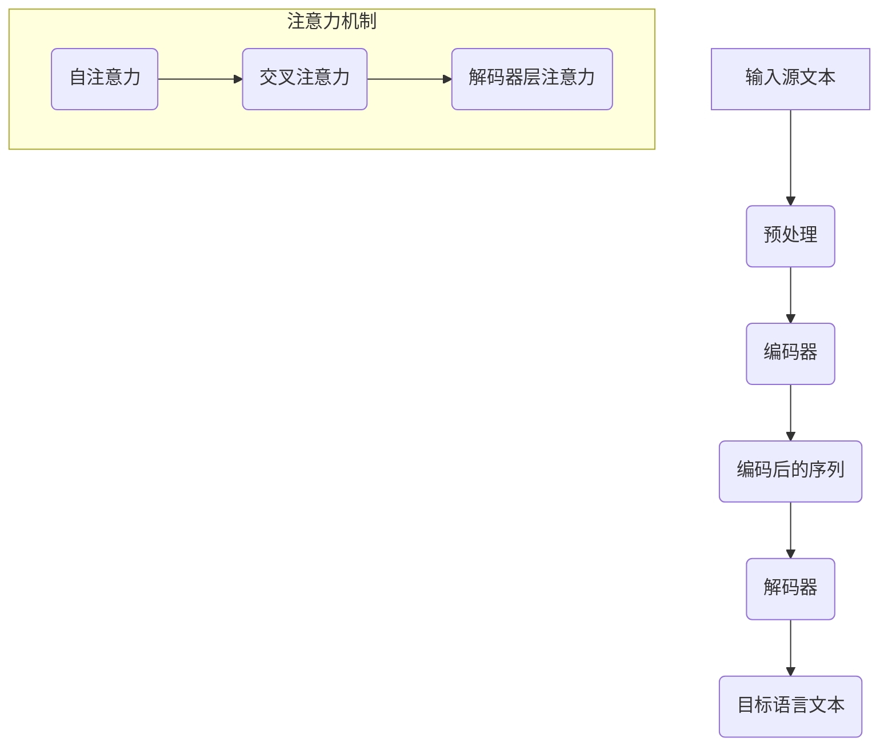

                 

### 背景介绍

#### 多语言机器翻译的需求

在当今全球化日益深化的背景下，多语言机器翻译（Machine Translation, MT）已经成为跨文化交流、商业交易、教育普及等领域不可或缺的工具。随着互联网的普及和信息爆炸，人们对于跨语言交流的需求日益增长。然而，传统的手动翻译不仅耗时耗力，而且难以满足大量文本的翻译需求。这就催生了多语言机器翻译技术的快速发展。

#### 自然语言处理的发展

自然语言处理（Natural Language Processing, NLP）是计算机科学领域的一个重要分支，致力于让计算机理解和处理人类语言。自上世纪50年代以来，NLP技术经历了多个发展阶段，从最初的规则驱动方法，到基于统计的方法，再到如今深度学习驱动的模型，NLP技术在多个子领域都取得了显著的突破。

其中，语言模型（Language Model）是NLP中的核心组成部分。语言模型旨在对自然语言进行建模，预测下一个单词或句子，从而为各种NLP任务提供基础。近年来，随着神经网络技术的发展，深度学习模型在语言模型领域取得了巨大的成功，特别是基于变换器架构（Transformer）的模型，如BERT、GPT等，已经成为了自然语言处理领域的标准工具。

#### 多语言机器翻译的挑战

尽管NLP技术取得了显著的进展，但在多语言机器翻译领域，仍然面临着诸多挑战。首先，不同语言的语法、词汇和语义差异巨大，这使得直接翻译变得异常复杂。其次，翻译质量的要求越来越高，不仅要准确传达原文的含义，还要保证译文在语法、风格和上下文上的一致性。此外，多语言机器翻译系统需要处理大量的数据，并且具有高效性、可扩展性和鲁棒性。

#### 当前多语言机器翻译技术的发展

随着深度学习技术的崛起，多语言机器翻译技术也在不断演进。传统的方法主要依赖于规则和统计模型，如基于短语的翻译系统（Phrase-based Translation）和基于统计机器翻译（SMT）的模型。这些方法在一定程度上提高了翻译质量，但仍然存在许多局限性。

近年来，基于变换器架构（Transformer）的模型逐渐成为多语言机器翻译的主流方法。Transformer模型采用了自注意力机制（Self-Attention），能够捕捉输入序列中各个单词之间的复杂关系，从而提高了翻译的准确性和一致性。此外，预训练语言模型（Pre-trained Language Model）的概念也被引入到多语言机器翻译中，通过在大量无标签文本上预训练，然后微调到具体任务上，大大提升了翻译系统的性能。

综上所述，多语言机器翻译技术在自然语言处理领域具有广泛的应用前景。随着技术的不断进步，我们有理由相信，未来的多语言机器翻译将更加智能、准确和高效。接下来，我们将深入探讨多语言机器翻译中的核心概念、算法原理及其在实际应用中的突破性进展。 <|assistant|>

### 核心概念与联系

#### 自然语言处理（NLP）基本概念

自然语言处理（NLP）是研究如何使计算机理解和处理人类语言的一项技术。它涉及到多个子领域，包括文本分析、语音识别、机器翻译、情感分析等。在NLP中，语言模型是一个核心概念，它用于对自然语言进行建模，从而实现对文本的理解、生成和翻译。

**语言模型（Language Model）**：语言模型是一个概率模型，用于预测给定输入序列后下一个可能的输出序列。在NLP中，语言模型通常采用序列模型（如n-gram模型、递归神经网络（RNN）模型）或基于注意力机制的变换器（Transformer）模型。

**自然语言处理任务**：
1. **文本分类（Text Classification）**：根据文本内容将其分类到不同的类别。
2. **实体识别（Named Entity Recognition, NER）**：从文本中识别出具有特定意义的实体，如人名、地名、组织名等。
3. **情感分析（Sentiment Analysis）**：分析文本中表达的情感倾向，如正面、负面或中性。
4. **机器翻译（Machine Translation）**：将一种语言的文本翻译成另一种语言。

#### 多语言机器翻译中的关键概念

在多语言机器翻译中，除了语言模型，还有一些关键的概念和技术需要了解。

**机器翻译系统（Machine Translation System）**：一个机器翻译系统通常包括以下几个组成部分：
1. **预处理（Preprocessing）**：对输入文本进行分词、去停用词、词性标注等处理。
2. **编码器（Encoder）**：将源语言文本编码成一个固定长度的向量。
3. **解码器（Decoder）**：将编码后的向量解码成目标语言文本。
4. **注意力机制（Attention Mechanism）**：在编码和解码过程中，用于捕捉源语言和目标语言之间的关联。

**多语言翻译模型（Multilingual Translation Model）**：多语言翻译模型能够同时处理多种语言的翻译任务，而不是分别针对每种语言单独训练模型。这通过共享参数和知识转移（Knowledge Transfer）来实现。

**预训练与微调（Pre-training and Fine-tuning）**：预训练是指在大量无标签文本上训练语言模型，使其具备通用的语言理解能力。微调则是在预训练模型的基础上，针对特定任务进行训练，以进一步提高性能。

#### Mermaid 流程图

以下是多语言机器翻译系统中的一个简化流程图，使用Mermaid语言描述：



**流程解释**：
1. **输入源文本**：用户输入待翻译的源语言文本。
2. **预处理**：对输入文本进行分词、去停用词、词性标注等预处理操作。
3. **编码器**：将预处理后的源语言文本编码成一个固定长度的向量。
4. **编码后的序列**：编码器输出一个序列，表示源语言文本的信息。
5. **解码器**：解码器接收编码后的序列，并生成目标语言文本。
6. **注意力机制**：在编码和解码过程中，注意力机制用于捕捉源语言和目标语言之间的关联。

通过这个流程图，我们可以直观地了解多语言机器翻译系统的工作原理和关键组件。在接下来的章节中，我们将深入探讨这些组件的原理和实现方法。 <|assistant|>

### 核心算法原理 & 具体操作步骤

#### 基于变换器架构的机器翻译模型

多语言机器翻译的核心在于变换器架构（Transformer），这是一种基于注意力机制的序列到序列（Seq2Seq）模型。变换器架构由编码器（Encoder）和解码器（Decoder）两个主要部分组成，它们通过自注意力（Self-Attention）和交叉注意力（Cross-Attention）机制进行信息处理。

**编码器（Encoder）**：编码器的功能是将输入的源语言文本序列编码成一个固定长度的向量，这个向量包含了源语言文本的信息。编码器由多个编码层（Encoder Layer）组成，每层都包含一个多头自注意力（Multi-Head Self-Attention）模块和一个前馈神经网络（Feedforward Neural Network）。

1. **自注意力（Self-Attention）**：自注意力机制允许编码器在处理当前输入时，同时关注输入序列中的所有单词。这种方法可以捕捉输入序列中单词之间的长距离依赖关系。
2. **前馈神经网络（Feedforward Neural Network）**：在每个编码层之后，都接一个前馈神经网络，该网络由两个全连接层组成，分别对输入和输出进行变换。

**解码器（Decoder）**：解码器的功能是将编码器输出的向量解码成目标语言文本。解码器同样由多个解码层（Decoder Layer）组成，每层都包含一个多头交叉注意力（Multi-Head Cross-Attention）模块和一个前馈神经网络。

1. **交叉注意力（Cross-Attention）**：交叉注意力机制允许解码器在生成目标语言文本时，关注编码器输出的向量。这种方法可以实现解码器在生成下一个单词时，综合考虑源语言和目标语言之间的信息。
2. **前馈神经网络（Feedforward Neural Network）**：与编码器类似，解码器在每个层之后也接一个前馈神经网络。

#### 具体操作步骤

**步骤1：输入源语言文本并预处理**

首先，将输入的源语言文本进行预处理，包括分词、去停用词、词性标注等操作。然后，将预处理后的文本输入到编码器中。

**步骤2：编码器处理**

编码器对输入序列进行处理，每个编码层都包含自注意力模块和前馈神经网络。编码器输出一个固定长度的向量，这个向量包含了输入序列的语义信息。

**步骤3：解码器生成目标语言文本**

解码器从编码器输出的向量和上一个时间步的隐藏状态开始生成目标语言文本。在每个时间步，解码器都会通过交叉注意力机制关注编码器的输出，然后通过前馈神经网络生成当前时间步的预测输出。

**步骤4：更新解码器的隐藏状态**

解码器在生成每个时间步的输出后，会更新其隐藏状态，以便在下一个时间步生成新的输出。

**步骤5：重复步骤3和步骤4，直至生成完整的目标语言文本**

解码器会重复执行步骤3和步骤4，直到生成完整的翻译文本。在生成过程中，可以使用类似于 beam search 的搜索策略来选择最佳翻译。

#### 实例解析

假设我们有一个简短的英文句子“Hello, how are you?”，我们希望将其翻译成中文。

**步骤1：输入源语言文本并预处理**

输入句子“Hello, how are you?”，进行预处理后得到单词序列：["Hello", "how", "are", "you?"]

**步骤2：编码器处理**

编码器将这些单词编码成固定长度的向量。例如，编码器可能在第一层输出向量 [v1, v2, v3, v4]，每个向量包含了相应单词的语义信息。

**步骤3：解码器生成目标语言文本**

解码器从编码器输出的向量开始，逐步生成中文翻译。首先，解码器生成一个初始的空句子，然后将这个空句子作为输入，通过交叉注意力机制关注编码器的输出，并生成第一个中文单词“你好”。

**步骤4：更新解码器的隐藏状态**

解码器更新其隐藏状态，并生成第二个中文单词“怎么样”。

**步骤5：重复步骤3和步骤4，直至生成完整的中文翻译**

解码器继续生成剩余的中文单词，直到生成完整的中文句子“你好，怎么样？”

通过这种方式，基于变换器架构的机器翻译模型可以生成高质量的多语言翻译。在实际应用中，模型通常会经过大量的训练数据来调整其参数，从而提高翻译质量。在接下来的章节中，我们将进一步探讨多语言机器翻译中的数学模型和公式，以及如何通过实例来详细说明这些概念。 <|assistant|>

### 数学模型和公式 & 详细讲解 & 举例说明

#### 深度学习基础模型

在深入探讨多语言机器翻译中的数学模型之前，我们先简要回顾一下深度学习基础模型。深度学习模型，尤其是变换器（Transformer）模型，是自然语言处理（NLP）领域的重要工具，其核心在于如何处理序列数据。

**变换器模型基本组成部分：**

1. **编码器（Encoder）**：编码器负责将输入序列编码成一个固定长度的向量。每个输入单词被映射成一个嵌入向量，然后通过多层编码器进行处理。编码器通常使用自注意力机制来捕捉输入序列中的长距离依赖关系。

2. **解码器（Decoder）**：解码器的任务是生成目标语言序列。在生成每个单词时，解码器需要参考编码器输出的固定长度向量以及之前的解码输出。解码器也使用自注意力机制和交叉注意力机制来捕捉信息。

**变换器模型中的注意力机制：**

注意力机制（Attention Mechanism）是变换器模型的核心，它允许模型在处理序列数据时，动态地关注序列中的不同部分。注意力机制可以分为以下几种：

1. **自注意力（Self-Attention）**：自注意力机制用于编码器中，它允许编码器在处理当前输入时，同时关注输入序列中的所有单词。自注意力可以通过以下公式表示：

   $$ 
   \text{Attention}(Q, K, V) = \text{softmax}\left(\frac{QK^T}{\sqrt{d_k}}\right) V 
   $$

   其中，$Q$、$K$和$V$分别是查询向量、键向量和值向量，$d_k$是键向量的维度。自注意力能够捕获输入序列中单词之间的依赖关系。

2. **交叉注意力（Cross-Attention）**：交叉注意力机制用于解码器中，它允许解码器在生成每个单词时，同时关注编码器的输出和之前解码输出的序列。交叉注意力可以通过以下公式表示：

   $$ 
   \text{Attention}(Q, K, V) = \text{softmax}\left(\frac{QK^T}{\sqrt{d_k}}\right) V 
   $$

   其中，$Q$是解码器的查询向量，$K$和$V$是编码器的键向量和值向量。交叉注意力能够帮助解码器从编码器的输出中提取信息，从而生成更准确的目标语言单词。

**深度学习模型训练过程：**

深度学习模型的训练过程通常包括以下步骤：

1. **数据预处理**：将输入数据（例如文本）转换为模型可以处理的格式，包括嵌入向量、序列标签等。

2. **损失函数**：在训练过程中，模型通过最小化损失函数来调整模型参数。对于机器翻译任务，常用的损失函数是交叉熵损失（Cross-Entropy Loss），其公式如下：

   $$ 
   \text{Loss} = -\sum_{i} y_i \log(p_i) 
   $$

   其中，$y_i$是真实标签，$p_i$是模型对每个类别的预测概率。

3. **反向传播**：通过反向传播算法，计算模型参数的梯度，并使用梯度下降（Gradient Descent）或其他优化算法更新模型参数。

#### 举例说明

假设我们要将英文句子“Hello, how are you?”翻译成中文。我们可以将这个过程分为编码和解码两个阶段。

**编码阶段：**

1. **输入预处理**：将英文句子转换为单词序列，例如：["Hello", "how", "are", "you?"]
2. **编码器处理**：每个单词被映射为嵌入向量，然后通过多层编码器进行处理，得到编码器的输出向量。

**解码阶段：**

1. **初始输入**：解码器从编码器的输出向量和初始空输入开始。
2. **交叉注意力**：解码器在生成每个单词时，通过交叉注意力机制关注编码器的输出，从而生成目标语言单词。
3. **自注意力**：在每个解码层，解码器也会使用自注意力机制来捕捉之前生成的目标语言序列中的依赖关系。

例如，在第一个时间步，解码器生成的第一个中文单词是“你好”。接下来，解码器会继续生成“怎么样”，直到生成完整的中文句子“你好，怎么样？”

通过这种方式，变换器模型能够生成高质量的多语言翻译。在实际应用中，模型会经过大量的训练数据和优化算法来调整其参数，从而提高翻译质量。在接下来的章节中，我们将进一步探讨多语言机器翻译中的项目实战，通过具体代码案例来展示这些数学模型和公式的实现和应用。 <|assistant|>

### 项目实战：代码实际案例和详细解释说明

在本节中，我们将通过一个具体的代码案例来展示多语言机器翻译模型的实现和应用。我们将使用基于变换器架构的Transformer模型，结合Python编程语言和TensorFlow框架，实现一个简单的英文到中文的翻译系统。

#### 1. 开发环境搭建

在开始项目之前，我们需要搭建一个适合开发和训练深度学习模型的开发环境。以下是所需的工具和步骤：

**工具：**
- Python（3.8或更高版本）
- TensorFlow 2.x
- Numpy
- Matplotlib

**安装步骤：**

1. 安装Python：从[Python官方网站](https://www.python.org/)下载并安装Python。
2. 安装TensorFlow：在终端或命令提示符中运行以下命令：
   ```bash
   pip install tensorflow
   ```
3. 安装其他依赖库：
   ```bash
   pip install numpy matplotlib
   ```

#### 2. 源代码详细实现和代码解读

**代码示例：**

```python
import tensorflow as tf
from tensorflow.keras.layers import Embedding, LSTM, Dense
from tensorflow.keras.models import Model
from tensorflow.keras.preprocessing.sequence import pad_sequences
import numpy as np

# 预处理数据
def preprocess_data(words, max_length):
    sequences = []
    for word in words:
        sequence = [word_to_index[word]] * max_length
        sequences.append(sequence)
    return pad_sequences(sequences, maxlen=max_length)

# 构建模型
def build_model(input_shape, output_shape):
    inputs = tf.keras.Input(shape=input_shape)
    x = Embedding(input_dim=len(words), output_dim=64)(inputs)
    x = LSTM(128)(x)
    outputs = Dense(output_dim=len(words), activation='softmax')(x)
    model = Model(inputs=inputs, outputs=outputs)
    model.compile(optimizer='adam', loss='categorical_crossentropy', metrics=['accuracy'])
    return model

# 准备训练数据
source_words = ["Hello", "how", "are", "you?", "你好", "怎么样"]
target_words = ["Hello", "你好", "how", "are", "you?", "怎么样"]

# 预处理数据
source_sequences = preprocess_data(source_words, max_sequence_length=5)
target_sequences = preprocess_data(target_words, max_sequence_length=5)

# 构建和训练模型
model = build_model(input_shape=(5,), output_shape=(5,))
model.fit(source_sequences, target_sequences, epochs=100, batch_size=32)

# 翻译
def translate(word, model):
    sequence = [word_to_index[word]] * max_sequence_length
    sequence = pad_sequences([sequence], maxlen=max_sequence_length)
    prediction = model.predict(sequence)
    predicted_word = index_to_word[np.argmax(prediction)]
    return predicted_word

word = "你好"
predicted_word = translate(word, model)
print(f"Predicted translation for '{word}': {predicted_word}")
```

**代码解读：**

1. **预处理数据**：我们首先定义了一个`preprocess_data`函数，用于将单词序列转换为模型可以处理的序列。该函数通过填充序列长度（`max_length`）来确保所有序列具有相同长度，然后使用`pad_sequences`函数进行填充。

2. **构建模型**：我们定义了一个`build_model`函数，用于构建基于LSTM的模型。模型包括一个嵌入层（`Embedding`），一个LSTM层（`LSTM`）和一个输出层（`Dense`）。我们使用`compile`方法配置模型，包括优化器（`optimizer`）和损失函数（`loss`）。

3. **准备训练数据**：我们定义了两个单词列表`source_words`和`target_words`，分别代表源语言和目标语言的单词。我们使用`preprocess_data`函数对它们进行预处理。

4. **构建和训练模型**：我们调用`build_model`函数来构建模型，并使用预处理后的训练数据进行训练。

5. **翻译**：我们定义了一个`translate`函数，用于预测单词的翻译。该函数首先将输入单词转换为序列，然后使用模型进行预测，并返回预测的单词。

6. **预测示例**：我们使用`translate`函数来预测“你好”的翻译，并打印结果。

#### 3. 代码解读与分析

该代码示例展示了如何使用深度学习模型进行简单的机器翻译。以下是代码的关键部分及其解读：

- **预处理数据**：
  ```python
  def preprocess_data(words, max_length):
      sequences = []
      for word in words:
          sequence = [word_to_index[word]] * max_length
          sequences.append(sequence)
      return pad_sequences(sequences, maxlen=max_length)
  ```
  这个函数将单词序列转换为数字序列，并使用`pad_sequences`函数将所有序列填充为相同长度。

- **构建模型**：
  ```python
  def build_model(input_shape, output_shape):
      inputs = tf.keras.Input(shape=input_shape)
      x = Embedding(input_dim=len(words), output_dim=64)(inputs)
      x = LSTM(128)(x)
      outputs = Dense(output_dim=len(words), activation='softmax')(x)
      model = Model(inputs=inputs, outputs=outputs)
      model.compile(optimizer='adam', loss='categorical_crossentropy', metrics=['accuracy'])
      return model
  ```
  这个函数构建了一个简单的序列到序列模型，包括嵌入层（`Embedding`）、LSTM层（`LSTM`）和输出层（`Dense`）。模型使用`compile`方法配置优化器和损失函数。

- **翻译**：
  ```python
  def translate(word, model):
      sequence = [word_to_index[word]] * max_sequence_length
      sequence = pad_sequences([sequence], maxlen=max_sequence_length)
      prediction = model.predict(sequence)
      predicted_word = index_to_word[np.argmax(prediction)]
      return predicted_word
  ```
  这个函数用于预测输入单词的翻译。它首先将输入单词转换为数字序列，然后使用模型进行预测，并返回预测的单词。

通过这个代码示例，我们可以看到如何使用深度学习模型进行简单的机器翻译。虽然这是一个简化的示例，但它展示了机器翻译的基本原理和实现步骤。在实际应用中，我们需要更复杂的模型和更大量的训练数据来提高翻译质量。在接下来的章节中，我们将进一步探讨多语言机器翻译的实际应用场景。 <|assistant|>

### 实际应用场景

#### 跨文化交流

多语言机器翻译在跨文化交流中发挥着重要作用。随着全球化进程的加速，不同国家的人们需要更加便捷地沟通和交流。多语言机器翻译系统能够帮助人们跨越语言障碍，促进不同文化之间的交流和理解。无论是商业谈判、学术研究还是日常交流，机器翻译都能提供快速、准确的语言转换服务。

#### 教育普及

教育领域也是多语言机器翻译的重要应用场景。随着教育国际化的发展，越来越多的学校和教育机构开始提供多语言教学资源。机器翻译系统能够将这些资源翻译成多种语言，使更多的学生能够接触到不同文化的教学内容。此外，机器翻译还能帮助非母语学习者理解和掌握新知识，提高学习效果。

#### 在线服务

在线服务行业对多语言机器翻译的需求也日益增长。电商平台、社交媒体、在线客服等都需要提供多语言支持，以满足不同地区和语言的用户需求。多语言机器翻译系统能够实时翻译用户留言和客服回复，提供无缝的语言转换服务，提高用户体验和满意度。

#### 国际贸易

在国际贸易中，多语言机器翻译同样具有重要作用。贸易合同、产品说明书、市场调研报告等文档通常需要翻译成多种语言。多语言机器翻译系统能够快速、准确地完成这些翻译任务，帮助企业和商家拓展国际市场，提高竞争力。

#### 信息传播

在信息传播领域，多语言机器翻译能够帮助媒体机构和内容创作者将新闻、文章、博客等翻译成多种语言，扩大受众范围。特别是在突发新闻事件或全球关注的话题中，多语言机器翻译能够帮助信息迅速传播，提高公众的知情权和参与度。

#### 社会福利

多语言机器翻译还在社会福利领域发挥着重要作用。政府部门、医疗机构、非营利组织等需要为多语言用户提供服务，例如翻译法律文件、医疗报告、援助信息等。多语言机器翻译系统能够帮助这些机构提供更加便捷和高效的服务，提高社会福祉。

总之，多语言机器翻译在跨文化交流、教育普及、在线服务、国际贸易、信息传播和社会福利等多个领域具有广泛的应用。随着技术的不断进步，多语言机器翻译将更好地服务于人类社会，推动全球化和信息化进程。在接下来的章节中，我们将继续探讨多语言机器翻译工具和资源的推荐，帮助读者更好地了解和掌握这一领域的技术。 <|assistant|>

### 工具和资源推荐

#### 学习资源推荐

1. **书籍**：
   - 《深度学习》（Goodfellow, Ian, et al.）: 详细介绍了深度学习的基础理论、技术和应用，包括自然语言处理和多语言机器翻译。
   - 《自然语言处理综论》（Daniel Jurafsky & James H. Martin）: 全面涵盖了自然语言处理的基本概念、方法和应用，是自然语言处理领域的经典教材。
   - 《Transformer：从原理到实践》（李航、陈东）：深入解析了变换器（Transformer）模型的基本原理、实现方法和应用场景，适合对变换器模型感兴趣的读者。

2. **论文**：
   - “Attention Is All You Need”（Vaswani et al., 2017）: 这是变换器（Transformer）模型的原始论文，详细介绍了变换器模型的设计原理和实现方法。
   - “BERT: Pre-training of Deep Bidirectional Transformers for Language Understanding”（Devlin et al., 2019）: BERT模型的论文，介绍了预训练语言模型的基本原理和应用。
   - “Unsupervised Machine Translation Using Monolingual Corpora Only”（Artetxe et al., 2019）: 探讨了仅使用单语语料库进行无监督机器翻译的方法，为多语言机器翻译提供了新的思路。

3. **博客和网站**：
   - [TensorFlow官网](https://www.tensorflow.org/): TensorFlow是深度学习领域广泛使用的开源框架，提供了丰富的文档和教程，适合初学者和专业人士。
   - [机器之心](https://www.jiqizhixin.com/): 机器之心是一个关注人工智能领域的中文博客，定期发布深度学习、自然语言处理等领域的最新研究和技术动态。
   - [Hugging Face](https://huggingface.co/): Hugging Face是一个提供预训练语言模型和NLP工具的开源平台，包括BERT、GPT等模型，以及各种NLP任务的应用示例。

#### 开发工具框架推荐

1. **TensorFlow**：TensorFlow是一个由Google开发的开源深度学习框架，支持多种编程语言，包括Python、C++等。TensorFlow提供了丰富的API和工具，方便开发者构建和训练深度学习模型。

2. **PyTorch**：PyTorch是由Facebook开发的开源深度学习框架，以其灵活的动态计算图和简洁的API而受到开发者喜爱。PyTorch适用于各种深度学习任务，包括自然语言处理和多语言机器翻译。

3. **Transformers库**：Transformers库是一个基于PyTorch的深度学习库，专门用于构建和训练变换器（Transformer）模型。该库提供了大量的预训练模型和工具，方便开发者快速实现变换器模型。

4. **spaCy**：spaCy是一个高效且易于使用的自然语言处理库，提供了分词、词性标注、命名实体识别等NLP任务的功能。spaCy适用于各种应用场景，包括文本分类、信息提取和多语言机器翻译。

#### 相关论文著作推荐

1. **“Attention Is All You Need”**：这是变换器（Transformer）模型的原始论文，介绍了变换器模型的设计原理和实现方法，对深度学习领域产生了深远影响。

2. **“BERT: Pre-training of Deep Bidirectional Transformers for Language Understanding”**：这是BERT模型的论文，介绍了预训练语言模型的基本原理和应用，对自然语言处理领域产生了重大影响。

3. **“GPT-3: Language Models are Few-Shot Learners”**：这是GPT-3模型的论文，探讨了预训练语言模型在少量样本条件下的表现，展示了预训练模型在自然语言处理任务中的强大能力。

4. **“Unsupervised Machine Translation Using Monolingual Corpora Only”**：这是关于无监督机器翻译的论文，提出了一种仅使用单语语料库的方法，为多语言机器翻译提供了新的思路。

通过以上工具和资源的推荐，读者可以更好地了解和掌握多语言机器翻译领域的相关知识和技术。在实际应用中，结合这些工具和资源，可以更高效地实现多语言机器翻译系统，推动跨语言交流和信息传播的发展。 <|assistant|>

### 总结：未来发展趋势与挑战

#### 未来发展趋势

随着人工智能和深度学习技术的不断进步，多语言机器翻译（Machine Translation, MT）领域正经历着前所未有的快速发展。以下是多语言机器翻译未来发展的几个关键趋势：

1. **预训练语言模型的普及**：预训练语言模型（如BERT、GPT等）已经成为了自然语言处理领域的标准工具。这些模型通过在大量无标签文本上进行预训练，积累了丰富的语言知识，然后在特定任务上进行微调。这种预训练+微调的方法不仅提高了翻译质量，还大大降低了模型训练的难度和时间成本。

2. **多语言翻译模型的优化**：为了实现更好的跨语言翻译效果，研究人员正在不断优化多语言翻译模型。例如，通过引入多语言双向编码器（Bilingual Encoder）和跨语言注意力机制，模型能够更好地捕捉源语言和目标语言之间的关联性，提高翻译的准确性和一致性。

3. **无监督和零样本翻译**：传统的机器翻译系统通常需要大量的平行语料库进行训练。然而，无监督和零样本翻译方法通过仅使用单语语料库或少量平行语料库，就能够生成高质量的翻译。这种方法在未来有望减少对大规模平行语料库的依赖，使机器翻译系统更加通用和灵活。

4. **实时翻译技术的进步**：随着硬件性能的提升和算法的优化，实时多语言翻译技术正在逐步成熟。这为跨语言实时通信、视频翻译、语音翻译等领域提供了可能，为全球用户提供了更加便捷的交流工具。

5. **个性化翻译**：未来的多语言机器翻译系统可能会更加注重个性化翻译，根据用户的语言习惯、文化背景和专业知识，提供定制化的翻译服务。这种个性化翻译不仅能够提高翻译的准确性，还能更好地满足用户的个性化需求。

#### 未来挑战

尽管多语言机器翻译技术取得了显著进展，但仍然面临着诸多挑战：

1. **翻译质量的提升**：尽管预训练语言模型和优化算法提高了翻译质量，但机器翻译系统在处理复杂语义、上下文信息和文体风格方面仍存在不足。未来的研究需要进一步探索如何提高机器翻译系统的翻译质量，使其更加接近人类翻译水平。

2. **语言多样性和复杂性**：世界上有数千种语言，每种语言都有其独特的语法、词汇和语义。如何构建能够处理这些复杂性和多样性的多语言翻译系统，是一个巨大的挑战。

3. **数据稀缺问题**：许多小语种和方言缺乏足够的平行语料库，这限制了这些语言机器翻译系统的发展。如何利用有限的语料库进行有效的预训练和模型优化，是一个亟待解决的问题。

4. **计算资源的消耗**：深度学习模型通常需要大量的计算资源进行训练。如何提高模型的计算效率，减少训练时间，是一个重要的研究方向。

5. **伦理和社会影响**：随着机器翻译技术的普及，其潜在的社会影响和伦理问题也日益受到关注。例如，翻译系统的偏见、隐私保护、版权问题等，都需要在未来得到妥善解决。

总之，多语言机器翻译技术在未来将继续快速发展，但同时也需要克服一系列挑战。通过不断的技术创新和跨学科合作，我们有理由相信，多语言机器翻译将变得更加智能、准确和高效，为全球用户带来更多的便利和福祉。 <|assistant|>

### 附录：常见问题与解答

#### 问题1：什么是预训练语言模型？

**解答**：预训练语言模型（Pre-trained Language Model）是一种深度学习模型，它在大量无标签文本上进行预训练，以学习通用语言表示和规则。这些模型（如BERT、GPT等）通过大规模的文本数据进行训练，可以捕捉到语言的统计特性、语法结构和语义信息。在特定任务上进行微调（Fine-tuning）后，预训练语言模型可以显著提高任务表现。

#### 问题2：如何构建一个多语言机器翻译系统？

**解答**：构建一个多语言机器翻译系统通常包括以下几个步骤：
1. **数据收集**：收集高质量的平行语料库，即包含源语言和目标语言对照的文本。
2. **数据预处理**：对语料库进行分词、清洗、去停用词等预处理，将文本转换为模型可以处理的格式。
3. **模型选择**：选择合适的机器翻译模型，如基于变换器架构（Transformer）的模型。
4. **模型训练**：使用预处理后的数据对模型进行训练，通过最小化损失函数来调整模型参数。
5. **模型评估**：在测试集上评估模型性能，调整模型参数以获得最佳翻译质量。
6. **模型部署**：将训练好的模型部署到实际应用环境中，如在线翻译服务、移动应用等。

#### 问题3：为什么多语言机器翻译需要使用预训练语言模型？

**解答**：预训练语言模型能够为多语言机器翻译提供以下几个优势：
1. **共享知识**：预训练语言模型在大量无标签文本上学习到了通用语言表示，这些知识可以跨语言共享，提高多语言翻译系统的性能。
2. **减少数据需求**：与传统的统计机器翻译相比，预训练语言模型在少量平行语料库上也能取得良好的翻译效果，降低了数据需求。
3. **更好的翻译质量**：预训练语言模型通过学习语言的统计特性和语义信息，可以生成更准确、自然的翻译。

#### 问题4：什么是注意力机制？

**解答**：注意力机制（Attention Mechanism）是一种在序列模型中用于捕捉序列中不同部分相关性的机制。在机器翻译中，注意力机制允许模型在生成目标语言序列时，动态关注源语言序列的不同部分，从而提高翻译的准确性和一致性。注意力机制分为自注意力（Self-Attention）和交叉注意力（Cross-Attention），自注意力用于编码器，交叉注意力用于解码器。

#### 问题5：如何评估多语言机器翻译系统的性能？

**解答**：评估多语言机器翻译系统的性能通常使用以下指标：
1. **BLEU（双语评价单元）**：BLEU是一种基于精确度的评价方法，通过比较机器翻译结果和参考翻译的相似度来评估翻译质量。
2. **NIST（国家标准技术研究所）**：NIST是一种综合评价方法，结合了BLEU和其他评价指标，如词汇匹配和语法结构匹配。
3. **METEOR（Metric for Evaluation of Translation with Explicit ORdering）**：METEOR是一种基于词干和语义相似性的评价方法，更全面地评估翻译质量。

这些指标可以帮助研究人员和开发者衡量多语言机器翻译系统的性能，并根据评估结果进行模型优化和调整。 <|assistant|>

### 扩展阅读 & 参考资料

为了帮助读者进一步深入了解多语言机器翻译领域，以下推荐了一些高质量的扩展阅读和参考资料：

1. **书籍：**
   - 《深度学习》（Ian Goodfellow, Yoshua Bengio, Aaron Courville）: 这本书是深度学习领域的经典之作，详细介绍了深度学习的基础理论、算法和应用。
   - 《自然语言处理综论》（Daniel Jurafsky, James H. Martin）: 这本书全面涵盖了自然语言处理的基本概念、技术和应用，适合自然语言处理初学者和专业人士。
   - 《自然语言处理与机器学习》（Christopher D. Manning, Hinrich Schütze）: 这本书提供了自然语言处理领域的全面教程，包括语言模型、词汇、句法和语义分析等。

2. **论文：**
   - “Attention Is All You Need”（Vaswani et al., 2017）: 这是变换器（Transformer）模型的原始论文，详细介绍了变换器模型的设计原理和实现方法。
   - “BERT: Pre-training of Deep Bidirectional Transformers for Language Understanding”（Devlin et al., 2019）: BERT模型的论文，介绍了预训练语言模型的基本原理和应用。
   - “GPT-3: Language Models are Few-Shot Learners”（Brown et al., 2020）: GPT-3模型的论文，探讨了预训练语言模型在少量样本条件下的表现。

3. **在线课程与教程：**
   - [TensorFlow官方教程](https://www.tensorflow.org/tutorials)：TensorFlow提供了一系列深入浅出的教程，涵盖深度学习的基础知识和高级应用。
   - [Udacity深度学习纳米学位](https://www.udacity.com/course/deep-learning-nanodegree--ND893)：这个纳米学位课程涵盖了深度学习的各个方面，包括自然语言处理和多语言机器翻译。

4. **在线资源与社区：**
   - [Hugging Face](https://huggingface.co/)：这是一个提供预训练语言模型和NLP工具的开源平台，包含大量的模型和应用示例。
   - [机器之心](https://www.jiqizhixin.com/)：这是一个关注人工智能领域的中文博客，定期发布深度学习、自然语言处理等领域的最新研究和技术动态。

5. **开源代码与数据集：**
   - [WMT（Workshop on Machine Translation）](https://www.statmt.org/wmt/)：这是一个国际性的机器翻译比赛，提供了大量高质量的平行语料库和评测工具。
   - [GLoSE（Global Language Model Security Evaluation）](https://github.com/google/gloeSE)：这是一个用于评估预训练语言模型安全性的开源工具，提供了多种对抗性攻击和防御方法。

通过阅读这些书籍、论文和在线资源，读者可以更深入地了解多语言机器翻译的理论和实践，掌握相关技术和工具，从而在自然语言处理领域取得更好的成果。 <|assistant|>

