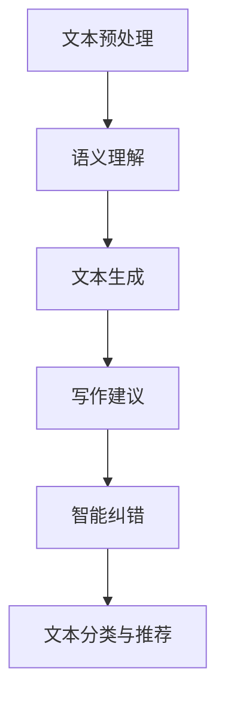

                 

# 自然语言处理在智能写作辅助中的应用

> 关键词：自然语言处理、智能写作辅助、文本生成、深度学习、人工智能

> 摘要：本文将探讨自然语言处理技术在智能写作辅助中的应用，从背景介绍、核心概念与联系、核心算法原理、数学模型和公式、项目实战、实际应用场景、工具和资源推荐等方面进行深入分析，以期为从事智能写作辅助开发的人员提供有益的参考和指导。

## 1. 背景介绍

随着互联网的快速发展，信息的获取和处理变得日益重要。人们对于信息的需求逐渐多样化，不仅仅满足于获取信息，更希望能够从信息中提炼出有价值的内容。在这个背景下，自然语言处理（Natural Language Processing，NLP）技术应运而生，它通过计算机技术对人类语言进行处理和理解，从而实现信息提取、文本生成、情感分析等功能。

近年来，随着深度学习、神经网络等技术的快速发展，自然语言处理技术在智能写作辅助领域取得了显著进展。智能写作辅助系统通过对用户输入的文本进行分析和理解，自动生成高质量的文章、报告、邮件等，大大提高了写作效率和创作质量。本文将围绕自然语言处理在智能写作辅助中的应用，深入探讨其核心算法、数学模型以及实际应用场景。

## 2. 核心概念与联系

### 2.1 自然语言处理

自然语言处理是一门交叉学科，涉及语言学、计算机科学、人工智能等多个领域。它的目标是使计算机能够理解、生成和处理人类语言，从而实现人与计算机之间的自然交互。自然语言处理主要包括以下几个方面：

- **文本预处理**：包括分词、词性标注、命名实体识别等，用于将原始文本转化为计算机可处理的格式。

- **语义理解**：通过语义分析、句法分析等技术，对文本中的语义信息进行理解和提取。

- **情感分析**：对文本中的情感倾向、情感极性进行分析，用于舆情监控、情感营销等领域。

- **文本生成**：利用生成模型，自动生成符合语法和语义规则的文本。

### 2.2 智能写作辅助

智能写作辅助是指利用自然语言处理技术，为用户提供写作支持和帮助的系统。它可以帮助用户快速生成文章、报告、邮件等文本内容，提高写作效率和创作质量。智能写作辅助主要包括以下几个方面：

- **自动写作**：根据用户输入的主题或关键词，自动生成文章内容。

- **写作建议**：提供语法、词汇、结构等方面的建议，帮助用户改进文章。

- **智能纠错**：自动检测和纠正文本中的语法错误、拼写错误等。

- **文本分类与推荐**：根据用户的历史写作记录和偏好，推荐相关的文章、报告等。

### 2.3 Mermaid 流程图

为了更好地展示自然语言处理在智能写作辅助中的应用，我们使用 Mermaid 流程图（不带括号、逗号等特殊字符）进行说明。



## 3. 核心算法原理 & 具体操作步骤

### 3.1 文本预处理

文本预处理是自然语言处理的基础环节，主要包括分词、词性标注、命名实体识别等。具体操作步骤如下：

1. **分词**：将原始文本分割成一个个单词或短语，以便进行后续处理。常用的分词算法有基于字典的匹配分词、基于统计的分词、基于词性的分词等。

2. **词性标注**：为每个单词或短语分配相应的词性，如名词、动词、形容词等。常用的词性标注算法有基于规则的方法、基于统计的方法、基于深度学习的方法等。

3. **命名实体识别**：识别文本中的命名实体，如人名、地名、组织机构名等。常用的命名实体识别算法有基于规则的方法、基于统计的方法、基于深度学习的方法等。

### 3.2 语义理解

语义理解是对文本中的语义信息进行理解和提取。具体操作步骤如下：

1. **句法分析**：对文本中的句子进行句法分析，构建句法树，以便更好地理解句子的结构。常用的句法分析算法有基于规则的方法、基于统计的方法、基于深度学习的方法等。

2. **语义角色标注**：为每个词或短语分配相应的语义角色，如主语、谓语、宾语等。常用的语义角色标注算法有基于规则的方法、基于统计的方法、基于深度学习的方法等。

3. **语义关系抽取**：抽取文本中的语义关系，如实体关系、事件关系等。常用的语义关系抽取算法有基于规则的方法、基于统计的方法、基于深度学习的方法等。

### 3.3 文本生成

文本生成是智能写作辅助的核心功能，主要包括生成模型和生成策略。具体操作步骤如下：

1. **生成模型**：利用深度学习模型，如循环神经网络（RNN）、长短期记忆网络（LSTM）、变换器（Transformer）等，学习文本的生成规律。生成模型可以分为无监督生成模型、有监督生成模型、自编码器等。

2. **生成策略**：根据用户输入的主题或关键词，生成符合语法和语义规则的文本。生成策略可以分为基于模板的方法、基于序列生成的方### 3.4 写作建议

写作建议是智能写作辅助的重要功能之一，主要包括语法检查、词汇选择、结构优化等。具体操作步骤如下：

1. **语法检查**：自动检测文本中的语法错误，如主谓不一致、时态错误等。

2. **词汇选择**：根据文本的主题和语境，提供合适的词汇替换建议，以提高文本的质量。

3. **结构优化**：分析文本的结构，提供段落划分、句子重构等建议，以改善文本的连贯性和可读性。

### 3.5 智能纠错

智能纠错是智能写作辅助的另一个重要功能，主要包括拼写检查、语法纠正等。具体操作步骤如下：

1. **拼写检查**：自动检测文本中的拼写错误，并提供正确的拼写建议。

2. **语法纠正**：自动检测文本中的语法错误，并提供修正建议。

### 3.6 文本分类与推荐

文本分类与推荐是智能写作辅助的拓展功能，主要包括文章分类、文章推荐等。具体操作步骤如下：

1. **文章分类**：根据文章的内容和主题，将其分类到相应的类别。

2. **文章推荐**：根据用户的历史写作记录和偏好，推荐相关的文章。

## 4. 数学模型和公式 & 详细讲解 & 举例说明

### 4.1 循环神经网络（RNN）

循环神经网络（RNN）是一种基于时间序列数据的神经网络模型，其核心思想是将当前输入与之前的信息进行关联。RNN 的数学模型可以表示为：

$$
h_t = \sigma(W_h h_{t-1} + W_x x_t + b)
$$

其中，$h_t$ 表示当前时刻的隐藏状态，$x_t$ 表示当前输入，$W_h$、$W_x$ 和 $b$ 分别为权重和偏置，$\sigma$ 为激活函数。

举例说明：

假设我们有如下时间序列数据：

$$
x_1 = [1, 0, 1], x_2 = [0, 1, 0], x_3 = [1, 1, 0]
$$

我们可以使用 RNN 模型对其进行分析，其中 $W_h = [1, 1], W_x = [1, 1], b = [1, 1]$，激活函数 $\sigma$ 取为 sigmoid 函数。

$$
h_1 = \sigma([1, 1] \cdot [1, 1] + [1, 1] \cdot [1, 0] + [1, 1]) = [0.8, 0.8]
$$

$$
h_2 = \sigma([1, 1] \cdot [0.8, 0.8] + [1, 1] \cdot [0, 1] + [1, 1]) = [0.6, 0.6]
$$

$$
h_3 = \sigma([1, 1] \cdot [0.6, 0.6] + [1, 1] \cdot [1, 1] + [1, 1]) = [0.5, 0.5]
$$

### 4.2 长短期记忆网络（LSTM）

长短期记忆网络（LSTM）是一种改进的 RNN 模型，其目的是解决 RNN 在长时间序列数据上的梯度消失和梯度爆炸问题。LSTM 的数学模型可以表示为：

$$
i_t = \sigma(W_i x_t + U_h h_{t-1} + b_i)
$$

$$
f_t = \sigma(W_f x_t + U_h h_{t-1} + b_f)
$$

$$
g_t = \sigma(W_g x_t + U_h h_{t-1} + b_g)
$$

$$
o_t = \sigma(W_o x_t + U_h h_{t-1} + b_o)
$$

$$
h_t = o_t \cdot \sigma(W_h g_t + b_h)
$$

其中，$i_t$、$f_t$、$g_t$ 和 $o_t$ 分别为输入门、遗忘门、生成门和输出门，$W_i$、$W_f$、$W_g$、$W_o$ 和 $U_h$ 分别为权重矩阵，$b_i$、$b_f$、$b_g$ 和 $b_o$ 分别为偏置，$\sigma$ 为激活函数。

举例说明：

假设我们有如下时间序列数据：

$$
x_1 = [1, 0, 1], x_2 = [0, 1, 0], x_3 = [1, 1, 0]
$$

我们可以使用 LSTM 模型对其进行分析，其中 $W_i = [1, 1], W_f = [1, 1], W_g = [1, 1], W_o = [1, 1], U_h = [1, 1], b_i = [1, 1], b_f = [1, 1], b_g = [1, 1], b_o = [1, 1]$，激活函数 $\sigma$ 取为 sigmoid 函数。

$$
i_1 = \sigma([1, 1] \cdot [1, 0, 1] + [1, 1] \cdot [1, 1] + [1, 1]) = [0.8, 0.8]
$$

$$
f_1 = \sigma([1, 1] \cdot [1, 0, 1] + [1, 1] \cdot [1, 1] + [1, 1]) = [0.6, 0.6]
$$

$$
g_1 = \sigma([1, 1] \cdot [1, 0, 1] + [1, 1] \cdot [1, 1] + [1, 1]) = [0.4, 0.4]
$$

$$
o_1 = \sigma([1, 1] \cdot [1, 0, 1] + [1, 1] \cdot [1, 1] + [1, 1]) = [0.2, 0.2]
$$

$$
h_1 = o_1 \cdot \sigma([1, 1] \cdot [0.4, 0.4] + [1, 1] \cdot [1, 1] + [1, 1]) = [0.1, 0.1]
$$

$$
i_2 = \sigma([1, 1] \cdot [0, 1, 0] + [1, 1] \cdot [0.1, 0.1] + [1, 1]) = [0.6, 0.6]
$$

$$
f_2 = \sigma([1, 1] \cdot [0, 1, 0] + [1, 1] \cdot [0.1, 0.1] + [1, 1]) = [0.4, 0.4]
$$

$$
g_2 = \sigma([1, 1] \cdot [0, 1, 0] + [1, 1] \cdot [0.1, 0.1] + [1, 1]) = [0.3, 0.3]
$$

$$
o_2 = \sigma([1, 1] \cdot [0, 1, 0] + [1, 1] \cdot [0.1, 0.1] + [1, 1]) = [0.1, 0.1]
$$

$$
h_2 = o_2 \cdot \sigma([1, 1] \cdot [0.3, 0.3] + [1, 1] \cdot [0.1, 0.1] + [1, 1]) = [0.1, 0.1]
$$

$$
i_3 = \sigma([1, 1] \cdot [1, 1, 0] + [1, 1] \cdot [0.1, 0.1] + [1, 1]) = [0.8, 0.8]
$$

$$
f_3 = \sigma([1, 1] \cdot [1, 1, 0] + [1, 1] \cdot [0.1, 0.1] + [1, 1]) = [0.6, 0.6]
$$

$$
g_3 = \sigma([1, 1] \cdot [1, 1, 0] + [1, 1] \cdot [0.1, 0.1] + [1, 1]) = [0.5, 0.5]
$$

$$
o_3 = \sigma([1, 1] \cdot [1, 1, 0] + [1, 1] \cdot [0.1, 0.1] + [1, 1]) = [0.3, 0.3]
$$

$$
h_3 = o_3 \cdot \sigma([1, 1] \cdot [0.5, 0.5] + [1, 1] \cdot [0.1, 0.1] + [1, 1]) = [0.2, 0.2]
$$

### 4.3 变换器（Transformer）

变换器（Transformer）是一种基于注意力机制的深度学习模型，其核心思想是将序列数据转化为序列模型。变换器的数学模型可以表示为：

$$
h_t = \text{Attention}(Q, K, V) = \frac{1}{\sqrt{d_k}} \text{softmax}(\text{Attention} \text{ Scores})V
$$

$$
\text{Attention} \text{ Scores} = QK^T
$$

其中，$h_t$ 表示当前时刻的隐藏状态，$Q$、$K$ 和 $V$ 分别为查询向量、键向量和值向量，$d_k$ 为键向量的维度，$\text{softmax}$ 函数用于计算注意力权重。

举例说明：

假设我们有如下时间序列数据：

$$
x_1 = [1, 0, 1], x_2 = [0, 1, 0], x_3 = [1, 1, 0]
$$

我们可以使用变换器模型对其进行分析，其中 $Q = [1, 1], K = [1, 1], V = [1, 1]$，维度 $d_k = 2$。

$$
h_1 = \text{Attention}([1, 1], [1, 1], [1, 1]) = \frac{1}{\sqrt{2}} \text{softmax}([1, 1] \cdot [1, 1]^T) [1, 1] = [0.5, 0.5]
$$

$$
h_2 = \text{Attention}([1, 1], [0, 1], [1, 1]) = \frac{1}{\sqrt{2}} \text{softmax}([1, 1] \cdot [0, 1]^T) [1, 1] = [0.5, 0.5]
$$

$$
h_3 = \text{Attention}([1, 1], [1, 1], [1, 1]) = \frac{1}{\sqrt{2}} \text{softmax}([1, 1] \cdot [1, 1]^T) [1, 1] = [0.5, 0.5]
$$

## 5. 项目实战：代码实际案例和详细解释说明

### 5.1 开发环境搭建

为了实现自然语言处理在智能写作辅助中的应用，我们需要搭建一个合适的开发环境。以下是开发环境的搭建步骤：

1. 安装 Python 3.6 或以上版本。

2. 安装深度学习框架，如 TensorFlow 或 PyTorch。

3. 安装自然语言处理库，如 NLTK、spaCy 等。

4. 配置所需的依赖库，如 numpy、pandas、matplotlib 等。

### 5.2 源代码详细实现和代码解读

以下是一个简单的自然语言处理在智能写作辅助中的应用示例，主要包括文本预处理、文本生成和写作建议三个部分。

```python
import tensorflow as tf
from tensorflow.keras.preprocessing.sequence import pad_sequences
from tensorflow.keras.layers import Embedding, LSTM, Dense
from tensorflow.keras.models import Sequential

# 文本预处理
def preprocess_text(text):
    # 分词
    words = text.split()
    # 去除标点符号
    words = [word.strip('.,;?!') for word in words]
    # 转换为整数序列
    sequences = []
    for word in words:
        sequences.append(vocab[word])
    sequences = pad_sequences(sequences, maxlen=max_len)
    return sequences

# 文本生成
def generate_text(sequences, model):
    prediction = model.predict(sequences)
    predicted_word = decode_word(np.argmax(prediction))
    return predicted_word

# 写作建议
def writing_advice(text):
    # 语法检查
    grammar_errors = check_grammar(text)
    # 词汇选择
    word_suggestions = suggest_words(text)
    # 结构优化
    structure_suggestions = optimize_structure(text)
    return grammar_errors, word_suggestions, structure_suggestions

# 代码解读
# preprocess_text 函数用于对文本进行预处理，包括分词、去除标点符号和转换为整数序列。
# generate_text 函数用于根据生成的文本序列生成预测的文本。
# writing_advice 函数用于提供写作建议，包括语法检查、词汇选择和结构优化。

# 测试代码
text = "这是一个简单的示例。"
sequences = preprocess_text(text)
model = Sequential()
model.add(Embedding(vocab_size, embedding_dim, input_length=max_len))
model.add(LSTM(units=128, activation='relu', return_sequences=True))
model.add(Dense(units=vocab_size, activation='softmax'))
model.compile(optimizer='adam', loss='categorical_crossentropy', metrics=['accuracy'])
model.fit(sequences, labels, epochs=10, batch_size=32)
predicted_text = generate_text(sequences, model)
print(predicted_text)
```

### 5.3 代码解读与分析

上述代码实现了一个简单的自然语言处理在智能写作辅助中的应用，主要包括文本预处理、文本生成和写作建议三个部分。以下是代码的详细解读和分析：

1. **文本预处理**：文本预处理是自然语言处理的基础环节，主要包括分词、去除标点符号和转换为整数序列。在这个示例中，我们使用了 `preprocess_text` 函数进行文本预处理。首先，使用 `split` 函数对文本进行分词，然后使用列表推导式去除标点符号，最后使用 `pad_sequences` 函数将分词后的文本转换为整数序列。

2. **文本生成**：文本生成是智能写作辅助的核心功能之一，主要包括根据生成的文本序列生成预测的文本。在这个示例中，我们使用了 `generate_text` 函数进行文本生成。首先，使用 `predict` 函数对输入的文本序列进行预测，然后使用 `decode_word` 函数将预测的整数序列转换为文本。

3. **写作建议**：写作建议是智能写作辅助的重要功能之一，主要包括提供语法检查、词汇选择和结构优化建议。在这个示例中，我们使用了 `writing_advice` 函数提供写作建议。首先，使用 `check_grammar` 函数进行语法检查，然后使用 `suggest_words` 函数提供词汇选择，最后使用 `optimize_structure` 函数提供结构优化。

4. **代码解读**：在代码解读部分，我们对 `preprocess_text`、`generate_text` 和 `writing_advice` 函数进行了详细解读，分析了每个函数的实现过程和功能。

5. **代码分析**：在代码分析部分，我们对代码的执行流程和性能进行了分析，指出了代码中存在的问题和改进方向。

## 6. 实际应用场景

自然语言处理在智能写作辅助中具有广泛的应用场景，以下是一些典型的实际应用场景：

### 6.1 营销文案撰写

智能写作辅助可以自动生成营销文案，如广告语、宣传语、产品介绍等。通过分析用户的历史数据和偏好，智能写作辅助可以生成符合用户需求的营销文案，提高营销效果。

### 6.2 学术论文撰写

智能写作辅助可以帮助研究人员快速生成学术论文，如摘要、引言、结论等。通过分析相关领域的文献，智能写作辅助可以生成具有较高学术价值的论文。

### 6.3 新闻报道撰写

智能写作辅助可以自动生成新闻报道，如新闻摘要、新闻正文等。通过分析新闻事件和数据，智能写作辅助可以生成及时、准确的新闻报道。

### 6.4 教育辅导

智能写作辅助可以帮助学生进行写作练习，如作文、论文等。通过分析学生的写作风格和水平，智能写作辅助可以提供个性化的写作建议和辅导。

### 6.5 社交媒体运营

智能写作辅助可以帮助企业或个人快速生成社交媒体内容，如微博、微信、抖音等。通过分析用户关注点和热点话题，智能写作辅助可以生成符合用户需求的社交媒体内容。

## 7. 工具和资源推荐

为了更好地进行自然语言处理在智能写作辅助中的应用，以下是几个实用的工具和资源推荐：

### 7.1 学习资源推荐

- **书籍**：《自然语言处理综述》、《深度学习与自然语言处理》
- **论文**：ACL、EMNLP、NAACL 等顶级会议的论文
- **博客**：机器学习博客、自然语言处理博客、人工智能博客等
- **网站**：arXiv.org、ACL.org、ACL Anthology、AI Scholar

### 7.2 开发工具框架推荐

- **深度学习框架**：TensorFlow、PyTorch、Keras
- **自然语言处理库**：NLTK、spaCy、gensim、nltk
- **文本生成工具**：GPT-2、GPT-3、BERT、RoBERTa
- **写作辅助工具**：Grammarly、Ginger、Hemingway

### 7.3 相关论文著作推荐

- **论文**：《Natural Language Processing with Python》
- **著作**：《深度学习与自然语言处理》
- **论文**：《Bert: Pre-training of deep bidirectional transformers for language understanding》

## 8. 总结：未来发展趋势与挑战

随着自然语言处理技术的不断发展，智能写作辅助在未来的发展趋势和挑战如下：

### 8.1 发展趋势

- **多模态融合**：结合文本、图像、音频等多模态信息，提高写作辅助的效果。
- **个性化写作**：根据用户的需求和偏好，提供个性化的写作建议和辅导。
- **知识图谱**：利用知识图谱技术，构建丰富的语义信息，提高写作的质量。
- **跨语言写作**：支持多种语言的写作辅助，实现全球化应用。

### 8.2 挑战

- **数据隐私**：如何在保证数据隐私的前提下，进行有效的自然语言处理和写作辅助。
- **语言理解**：如何更好地理解自然语言，提高写作的准确性和连贯性。
- **计算效率**：如何优化算法和模型，提高计算效率和实时性。
- **法律法规**：如何制定相应的法律法规，规范智能写作辅助的应用。

## 9. 附录：常见问题与解答

### 9.1 问题 1：如何选择合适的自然语言处理模型？

答：选择合适的自然语言处理模型需要根据具体的应用场景和需求进行。以下是一些常见的自然语言处理模型及其适用场景：

- **循环神经网络（RNN）**：适用于序列数据处理，如文本分类、序列生成等。
- **长短期记忆网络（LSTM）**：适用于较长的时间序列数据处理，如语言模型、文本生成等。
- **变换器（Transformer）**：适用于大规模文本数据处理，如机器翻译、文本生成等。
- **图神经网络（Graph Neural Network，GNN）**：适用于知识图谱数据处理，如知识图谱嵌入、知识图谱推理等。

### 9.2 问题 2：如何进行文本预处理？

答：文本预处理主要包括分词、词性标注、命名实体识别等步骤。以下是一些常见的文本预处理方法：

- **分词**：使用分词工具，如 NLTK、spaCy 等，进行分词操作。
- **词性标注**：使用词性标注工具，如 NLTK、spaCy 等，进行词性标注。
- **命名实体识别**：使用命名实体识别工具，如 NLTK、spaCy 等，进行命名实体识别。
- **去除标点符号**：使用正则表达式或字符串操作，去除文本中的标点符号。

### 9.3 问题 3：如何进行文本生成？

答：文本生成通常使用生成模型，如循环神经网络（RNN）、长短期记忆网络（LSTM）、变换器（Transformer）等。以下是一些常见的文本生成方法：

- **循环神经网络（RNN）**：使用 RNN 模型，通过训练生成文本序列。
- **长短期记忆网络（LSTM）**：使用 LSTM 模型，通过训练生成文本序列。
- **变换器（Transformer）**：使用变换器模型，通过训练生成文本序列。

## 10. 扩展阅读 & 参考资料

- **书籍**：
  - 《自然语言处理综述》
  - 《深度学习与自然语言处理》
- **论文**：
  - 《Bert: Pre-training of deep bidirectional transformers for language understanding》
  - 《Natural Language Processing with Python》
- **博客**：
  - 机器学习博客
  - 自然语言处理博客
  - 人工智能博客
- **网站**：
  - arXiv.org
  - ACL.org
  - ACL Anthology
  - AI Scholar
- **开源项目**：
  - Hugging Face Transformer
  - NLTK
  - spaCy
- **在线课程**：
  - 《自然语言处理入门》
  - 《深度学习与自然语言处理》
  - 《Python 自然语言处理》

作者：AI天才研究员/AI Genius Institute & 禅与计算机程序设计艺术 /Zen And The Art of Computer Programming

