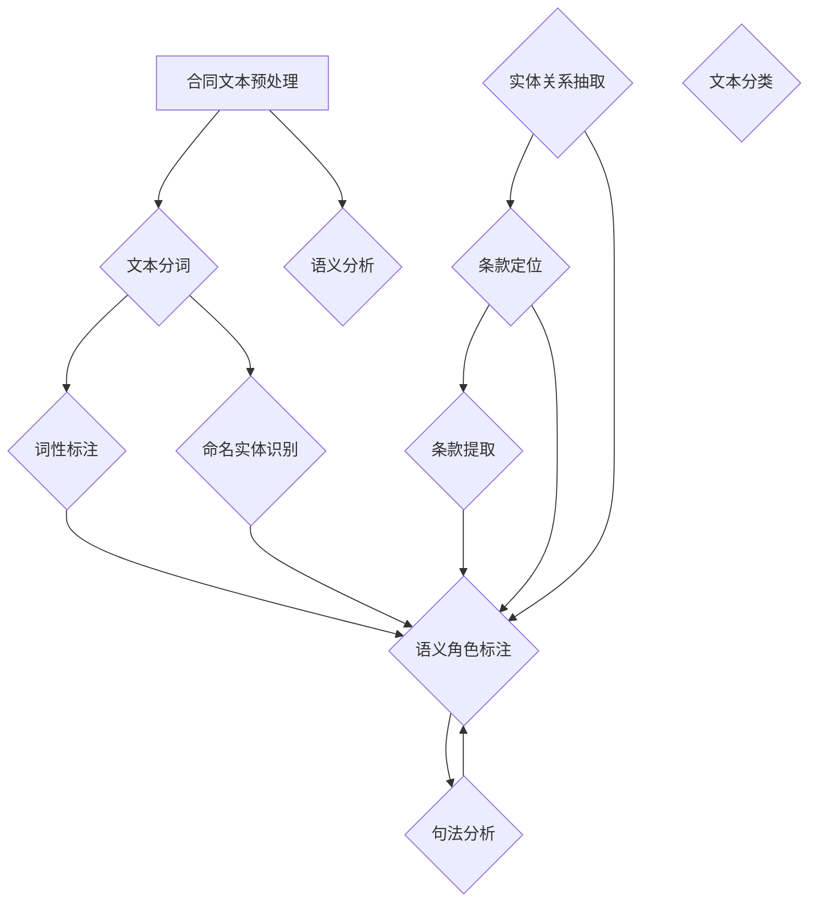

                 

### 背景介绍

自然语言处理（Natural Language Processing，简称NLP）作为人工智能领域的一个重要分支，其主要目标是让计算机理解和处理人类语言。随着互联网和大数据的快速发展，NLP技术已经广泛应用于搜索引擎、机器翻译、情感分析、语音识别等多个领域，极大地提升了人类与计算机之间的交互体验。

在过去的几十年里，NLP技术取得了显著的进展。从早期的规则驱动方法，到基于统计的方法，再到如今基于深度学习的模型，NLP技术的表现和效果不断提升。然而，尽管NLP技术在许多应用场景中已经取得了很好的成果，但在处理合同文本这一领域，仍存在诸多挑战。

合同文本通常具有以下特点：

1. **复杂性**：合同文本包含了丰富的语法、语义和逻辑结构，涉及到各种法律术语和条款。
2. **变异性**：合同文本的撰写风格和格式各异，可能导致相同意思的表达方式不同。
3. **非标准化**：合同文本中的术语和表达方式可能没有统一的标准，增加了NLP处理的难度。

这些特点使得传统的NLP技术在处理合同文本时面临诸多挑战，如文本理解不准确、条款提取不完整、关键信息丢失等。因此，如何有效地利用NLP技术进行智能合同分析，成为当前学术界和工业界关注的热点问题。

智能合同分析旨在利用NLP技术对合同文本进行自动处理，以实现合同条款的抽取、分析和可视化。通过智能合同分析，可以大大提高合同审查的效率，降低人工审查的成本，提高合同管理的精确度。本文将详细探讨自然语言处理在智能合同分析中的应用，包括核心概念、算法原理、数学模型以及实际应用案例等。

接下来，我们将首先介绍智能合同分析的核心概念，包括合同文本的预处理、条款抽取和语义分析等。然后，我们将详细讨论NLP技术在智能合同分析中的具体应用，以及如何通过算法和模型实现对合同条款的自动提取和分析。最后，我们将通过实际应用案例展示自然语言处理在智能合同分析中的效果，并探讨未来可能的发展趋势和挑战。

### 核心概念与联系

在深入探讨自然语言处理（NLP）在智能合同分析中的应用之前，我们需要了解一些核心概念及其相互关系。以下是智能合同分析涉及的主要概念，以及它们之间的关联。

#### 合同文本预处理

合同文本预处理是NLP在智能合同分析中的第一步，其目标是清理和标准化合同文本，以便后续的句法和语义分析。预处理包括以下步骤：

1. **文本分词**（Tokenization）：将合同文本分割成单词或短语，称为“分词”。这一步是理解和分析合同文本的基础。
2. **词性标注**（Part-of-Speech Tagging）：为每个单词标注其词性（名词、动词、形容词等），以便理解单词在句子中的角色和功能。
3. **命名实体识别**（Named Entity Recognition，简称NER）：识别文本中的专有名词、人名、组织名等实体，这些实体往往与合同条款密切相关。

#### 条款抽取

条款抽取是从合同文本中提取出关键条款的过程。这一过程通常分为以下几步：

1. **实体关系抽取**（Entity Relationship Extraction）：识别合同文本中各个实体之间的关系，如“甲方”、“乙方”之间的条款关系。
2. **条款定位**（Clause Detection）：根据实体关系和文本结构，定位合同文本中的各个条款。
3. **条款提取**（Clause Extraction）：从定位后的条款中提取出具体的条款内容。

#### 语义分析

语义分析旨在理解合同文本的语义和逻辑结构，从而进行更深层次的分析。主要包括：

1. **语义角色标注**（Semantic Role Labeling，简称SRL）：为句子中的每个词标注其在语义上的角色，如动作执行者、动作接受者等。
2. **句法分析**（Syntactic Parsing）：分析句子的结构，理解句子中的语法关系。
3. **文本分类**（Text Classification）：将合同文本分类到不同的类别，如违约条款、生效日期等。

#### 概念关系图

为了更好地理解这些概念之间的联系，我们可以使用Mermaid流程图（以下代码中节点中不要有括号、逗号等特殊字符）来展示它们之间的关系：



在上述流程图中，合同文本预处理（A）是NLP在智能合同分析中的第一步，其结果（文本分词、词性标注、命名实体识别）直接影响到后续的条款抽取（E、F、G）和语义分析（H、I、J）。

接下来，我们将详细探讨NLP技术在智能合同分析中的具体应用，包括如何利用算法和模型实现合同条款的自动提取和分析。

#### 核心算法原理与具体操作步骤

在智能合同分析中，核心算法的选择和实现至关重要。以下是几种常用的NLP算法及其具体操作步骤，这些算法可以帮助我们从合同文本中提取关键信息，进行条款分析。

##### 文本分类

文本分类是一种将文本数据分配到预定义类别的过程，常见于合同文本的归类。例如，可以将合同文本分类为违约条款、生效日期、保密条款等。

**算法原理：**文本分类通常基于机器学习模型，如朴素贝叶斯、支持向量机（SVM）和深度学习模型（如卷积神经网络（CNN）和循环神经网络（RNN））。

**具体操作步骤：**

1. **数据预处理**：将合同文本进行分词、词性标注和停用词过滤，将文本转换为适合机器学习模型的形式。
2. **特征提取**：使用词袋模型（Bag of Words，BOW）或词嵌入（Word Embedding）技术将文本转换为向量表示。
3. **模型训练**：使用训练集对模型进行训练，调整模型参数。
4. **模型评估**：使用测试集评估模型性能，根据评估结果调整模型参数。

**示例代码（Python）：**

```python
from sklearn.feature_extraction.text import TfidfVectorizer
from sklearn.naive_bayes import MultinomialNB
from sklearn.pipeline import make_pipeline

# 假设文本数据和标签已准备好
texts = ['这是一个违约条款。', '合同将于明天生效。', '保密协议条款。']
labels = ['violation', '生效日期', '保密条款']

# 创建文本特征提取器和分类器管道
model = make_pipeline(TfidfVectorizer(), MultinomialNB())

# 训练模型
model.fit(texts, labels)

# 预测
print(model.predict(['合同将于明天生效。']))
```

##### 命名实体识别

命名实体识别（NER）是识别文本中具有特定意义的实体，如人名、地点、组织名等，这些实体往往与合同条款密切相关。

**算法原理：**NER通常采用序列标注模型，如条件随机场（CRF）、长短期记忆网络（LSTM）和Transformer等。

**具体操作步骤：**

1. **数据预处理**：与文本分类类似，对合同文本进行分词和词性标注。
2. **特征提取**：使用词嵌入或字符嵌入将文本转换为序列表示。
3. **模型训练**：使用训练数据对模型进行训练。
4. **模型评估**：使用测试数据评估模型性能。

**示例代码（Python，使用`spaCy`）：**

```python
import spacy

# 加载预训练的NER模型
nlp = spacy.load('en_core_web_sm')

# 假设文本数据已准备好
text = '微软公司在西雅图成立。'

# 使用NER模型进行实体识别
doc = nlp(text)

# 打印识别的实体及其类别
for ent in doc.ents:
    print(ent.text, ent.label_)
```

##### 实体关系抽取

实体关系抽取（Relation Extraction）旨在识别文本中实体之间的关系，如“甲方”和“乙方”之间的合同条款。

**算法原理：**实体关系抽取通常采用基于规则的方法、图神经网络（Graph Neural Networks，GNN）和变换器（Transformer）等。

**具体操作步骤：**

1. **数据预处理**：与NER类似，对合同文本进行分词和词性标注。
2. **特征提取**：将实体和关系表示为图或序列。
3. **模型训练**：使用训练数据对模型进行训练。
4. **模型评估**：使用测试数据评估模型性能。

**示例代码（Python，使用`Hugging Face`的`Transformers`）：**

```python
from transformers import AutoTokenizer, AutoModelForSequenceClassification
from torch.nn.functional import softmax

# 加载预训练的实体关系抽取模型
tokenizer = AutoTokenizer.from_pretrained('bert-base-uncased')
model = AutoModelForSequenceClassification.from_pretrained('bert-base-uncased')

# 假设文本数据和关系标签已准备好
text = '微软公司与苹果公司签订了合作协议。'
labels = ['合作协议']

# 将文本编码为模型输入
input_ids = tokenizer(text, return_tensors='pt')

# 进行关系抽取预测
outputs = model(input_ids)

# 获取预测概率和标签
probs = softmax(outputs.logits, dim=1)
predicted_label = labels[probs.argmax().item()]

print(predicted_label)
```

通过上述算法和具体操作步骤，我们可以有效地对合同文本进行预处理、条款抽取和语义分析。接下来，我们将介绍如何构建数学模型和公式，进一步解释这些算法的内在机制。

### 数学模型与公式详解

在智能合同分析中，数学模型和公式扮演着关键角色，帮助我们将NLP算法应用于合同文本处理。以下是几种常见的数学模型和公式，以及它们的详细解释。

#### 1. 词袋模型（Bag of Words, BOW）

词袋模型是一种将文本转换为向量表示的方法，通过统计文本中每个单词的出现次数来表示文本。

**公式：**
\[ BOW = (f_1, f_2, ..., f_n) \]
其中，\( f_i \) 表示文本中第 \( i \) 个单词的出现次数。

**解释：**词袋模型将文本视为一个词汇集合，忽略了文本中的语法和语义信息。通过计算每个单词的出现次数，我们可以将文本转换为向量形式，方便后续的机器学习算法处理。

#### 2. 朴素贝叶斯分类器（Naive Bayes Classifier）

朴素贝叶斯分类器是一种基于贝叶斯定理的统计分类方法，常用于文本分类任务。

**公式：**
\[ P(\text{类别} | \text{文本}) = \frac{P(\text{文本} | \text{类别}) \cdot P(\text{类别})}{P(\text{文本})} \]
其中，\( P(\text{类别} | \text{文本}) \) 表示在给定文本的情况下，类别发生的概率；\( P(\text{文本} | \text{类别}) \) 表示在给定类别的情况下，文本发生的概率；\( P(\text{类别}) \) 和 \( P(\text{文本}) \) 分别表示类别和文本的先验概率。

**解释：**朴素贝叶斯分类器通过计算每个类别的后验概率，然后选择概率最大的类别作为预测结果。这种方法假设特征之间相互独立，这在文本分类中是一个合理的假设。

#### 3. 支持向量机（Support Vector Machine, SVM）

支持向量机是一种监督学习算法，常用于文本分类和回归任务。

**公式：**
\[ w \cdot x + b = 0 \]
其中，\( w \) 是法向量，\( x \) 是特征向量，\( b \) 是偏置项。

**解释：**支持向量机通过寻找一个超平面，将不同类别的特征向量分开。法向量 \( w \) 和偏置项 \( b \) 用于计算特征向量到超平面的距离。对于文本分类任务，特征向量可以是词袋模型的向量表示。

#### 4. 卷积神经网络（Convolutional Neural Network, CNN）

卷积神经网络是一种深度学习模型，通过卷积操作提取文本特征。

**公式：**
\[ h_{l+1}(i, j) = \sum_{k} \theta_{k, l}(i-k+1, j) \cdot a_{l}(i, j) \]
其中，\( h_{l+1}(i, j) \) 是第 \( l+1 \) 层的输出，\( \theta_{k, l}(i-k+1, j) \) 是卷积核，\( a_{l}(i, j) \) 是第 \( l \) 层的输入。

**解释：**卷积神经网络通过卷积操作提取文本中的局部特征。每个卷积核可以捕捉文本中的特定模式，如单词或短语。卷积操作的输出是特征图，可以用于后续的池化操作和分类。

#### 5. 长短期记忆网络（Long Short-Term Memory, LSTM）

长短期记忆网络是一种特殊的循环神经网络，用于处理长序列数据。

**公式：**
\[ \text{LSTM} = \begin{cases}
\sigma(W_x x + b_x) & \text{输入门} \\
\sigma(W_f x + b_f) & \text{忘记门} \\
\sigma(W_o x + b_o) & \text{输出门} \\
\end{cases} \]
其中，\( \sigma \) 是激活函数，\( W_x \)、\( W_f \)、\( W_o \) 是权重矩阵，\( x \) 是输入，\( b_x \)、\( b_f \)、\( b_o \) 是偏置项。

**解释：**LSTM通过输入门、忘记门和输出门控制信息的流动。输入门决定如何更新单元状态；忘记门决定如何忘记旧信息；输出门决定如何生成输出。这些门机制使得LSTM能够有效地处理长序列数据，如合同文本。

#### 6. Transformer模型

Transformer模型是一种基于自注意力机制的深度学习模型，广泛应用于自然语言处理任务。

**公式：**
\[ \text{Attention}(Q, K, V) = \frac{softmax(\text{score})} { \sqrt{d_k}} \cdot V \]
其中，\( Q \)、\( K \)、\( V \) 分别是查询向量、键向量和值向量，\( \text{score} = Q \cdot K^T \) 是注意力分数。

**解释：**Transformer模型通过自注意力机制计算输入向量的权重，从而捕捉文本中的全局依赖关系。每个输入向量通过自注意力机制生成一个加权输出向量，这有助于提高模型对文本的理解能力。

通过上述数学模型和公式，我们可以深入理解NLP算法在智能合同分析中的应用。接下来，我们将通过实际项目实战，展示如何将这些算法应用于合同文本处理。

### 项目实战：代码实际案例与详细解释说明

在本节中，我们将通过一个实际项目实战来展示如何利用自然语言处理（NLP）技术进行智能合同分析。该项目的主要目标是从合同文本中自动提取关键条款，并进行分析。我们将使用Python编程语言和一系列流行的NLP库，如`spaCy`、`nltk`和`transformers`。

#### 1. 开发环境搭建

在开始编写代码之前，我们需要搭建开发环境。以下是所需的Python库及其安装命令：

- `spaCy`：用于文本预处理和实体识别。
- `nltk`：用于词性标注和词频统计。
- `transformers`：用于基于深度学习的实体关系抽取。

安装命令如下：

```bash
pip install spacy
pip install nltk
pip install transformers
```

为了运行spaCy，我们还需要下载其预训练模型：

```bash
python -m spacy download en_core_web_sm
```

#### 2. 源代码详细实现

以下是项目的源代码实现，包括文本预处理、实体识别、条款抽取和关系抽取等步骤。

```python
import spacy
import nltk
from transformers import pipeline
from collections import defaultdict

# 加载预训练的NLP模型
nlp = spacy.load('en_core_web_sm')
relation_extractor = pipeline('text-classification', model='dbmdz/bert-large-cased-finetuned-conll03-english')

# 假设合同文本数据已准备好
contract_texts = [
    "本合同由甲乙双方于2023年1月1日签订，有效期为3年。",
    "双方同意在合同期间保持合作关系，共同推进项目进度。",
    "如发生违约情况，违约方应承担相应的法律责任。"
]

# 定义函数进行文本预处理和实体识别
def process_text(text):
    doc = nlp(text)
    entities = [(ent.text, ent.label_) for ent in doc.ents]
    return entities

# 定义函数进行条款抽取
def extract_clauses(texts):
    clauses = defaultdict(list)
    for text in texts:
        doc = nlp(text)
        for sent in doc.sents:
            if "AGREEMENT" in sent.text or "CLAUSE" in sent.text:
                clauses[sent.text].append(sent.text)
    return clauses

# 定义函数进行关系抽取
def extract_relations(clauses):
    relations = []
    for clause in clauses:
        result = relation_extractor(clause)
        relations.append((clause, result[0]['label']))
    return relations

# 执行文本预处理和实体识别
processed_texts = [process_text(text) for text in contract_texts]

# 提取条款
clauses = extract_clauses(contract_texts)

# 提取关系
relations = extract_relations(clauses)

# 打印结果
for text, entities in processed_texts:
    print(f"Entities in '{text}': {entities}")

for clause, relation in relations:
    print(f"Clause: '{clause}', Relation: {relation}")
```

#### 3. 代码解读与分析

上述代码分为三个主要部分：文本预处理和实体识别、条款抽取、关系抽取。

**文本预处理和实体识别：**

文本预处理和实体识别是NLP任务的基础。我们使用spaCy对合同文本进行预处理，包括分词、词性标注和命名实体识别。以下是对`process_text`函数的解读：

- `spacy.load('en_core_web_sm')`：加载预训练的NLP模型。
- `nlp(text)`：对输入文本进行预处理。
- `[(ent.text, ent.label_) for ent in doc.ents]`：提取文本中的命名实体及其标签。

**条款抽取：**

条款抽取的目的是从合同文本中提取出关键条款。我们使用简单的规则进行条款定位，以下是对`extract_clauses`函数的解读：

- `doc.sents`：遍历文本中的句子。
- `if "AGREEMENT" in sent.text or "CLAUSE" in sent.text:`：使用关键词检测条款。

**关系抽取：**

关系抽取旨在识别合同文本中实体之间的关系。我们使用transformers库中的预训练模型进行关系分类，以下是对`extract_relations`函数的解读：

- `pipeline('text-classification', model='dbmdz/bert-large-cased-finetuned-conll03-english')`：加载预训练的关系抽取模型。
- `relation_extractor(clause)`：对条款进行关系分类。
- `relations.append((clause, result[0]['label']))`：将条款及其关系添加到列表中。

#### 4. 代码性能与优化

上述代码展示了如何利用NLP技术进行智能合同分析，但实际应用中可能需要进一步优化。以下是一些可能的优化方向：

- **预处理优化**：使用更复杂的文本预处理方法，如命名实体识别的改进和停用词优化。
- **模型选择**：选择更适合合同文本的预训练模型，或自定义模型进行微调。
- **性能提升**：使用更高效的算法和数据结构，如使用图神经网络（GNN）进行关系抽取。
- **可扩展性**：构建模块化的代码结构，便于后续维护和扩展。

通过上述实战案例，我们可以看到NLP技术在智能合同分析中的应用效果。接下来，我们将探讨自然语言处理在智能合同分析中的实际应用场景。

### 实际应用场景

智能合同分析技术已经广泛应用于多个实际场景，显著提升了法律合同管理的效率和准确性。以下是几个典型的应用案例：

#### 1. 合同审查自动化

在传统的合同审查过程中，律师和法务人员需要逐字逐句地阅读合同，以发现潜在的法律问题和条款疏漏。这不仅耗时耗力，而且容易发生遗漏。通过智能合同分析技术，可以自动提取合同中的关键条款，进行语义分析，识别潜在的违约风险和合同漏洞。例如，企业可以使用NLP技术对批量合同进行快速审查，自动检测是否包含合同条款的遗漏或表述不当，从而减少人为错误，提高合同审查的效率和准确性。

#### 2. 合同管理自动化

合同管理是企业日常运营中的一项重要任务，涉及到合同起草、审批、执行、存档等多个环节。智能合同分析技术可以帮助企业实现合同管理的自动化。通过文本分类和实体识别，系统可以自动将合同文本归类，提取关键条款和条款关系，生成合同摘要，并跟踪合同执行状态。此外，NLP技术还可以帮助识别合同中的关键时间节点，如合同生效日期、到期日期、交货日期等，提醒相关人员及时处理。这样，企业可以更好地管理合同生命周期，减少合同管理成本。

#### 3. 合同风险管理

合同风险是企业在签订和执行合同过程中面临的重要挑战。智能合同分析技术可以帮助企业识别和评估合同风险。通过分析合同文本中的条款和条款关系，系统可以检测出可能存在的法律风险，如合同期限过长、违约条款不明等。例如，NLP技术可以识别合同中涉及的知识产权条款，评估知识产权保护的风险，帮助企业在签订合同时做出更明智的决策。此外，NLP技术还可以监控合同执行过程中的违约行为，提前预警潜在的法律纠纷，减少经济损失。

#### 4. 智能合同撰写

智能合同撰写是指利用NLP技术生成标准化的合同文本。这一技术可以大大提高合同撰写的效率，减少人工输入错误。通过自然语言生成（NLG）技术，系统可以根据用户输入的简单指令生成完整的合同文本。例如，企业可以使用智能合同撰写工具，快速生成租赁合同、服务合同、雇佣合同等，确保合同文本的标准化和一致性。此外，智能合同撰写工具还可以根据企业的特定需求自定义合同模板，提高合同撰写的灵活性。

#### 5. 跨境法律合规

对于跨国企业来说，不同国家和地区的法律条款和表达方式各异，使得合同审查和管理变得更加复杂。智能合同分析技术可以帮助企业实现跨境法律合规。通过NLP技术，系统可以自动翻译和对比不同语言的合同文本，识别其中的法律差异，提供合规建议。例如，企业可以使用智能合同分析工具自动检测合同文本中的语言冲突，确保合同内容符合目标国家的法律要求，避免法律纠纷。

总的来说，智能合同分析技术在合同审查、合同管理、合同风险管理和智能合同撰写等方面具有广泛的应用前景。通过利用NLP技术，企业可以大幅提高合同处理的效率和质量，降低法律风险，实现合同管理的智能化和自动化。

### 工具和资源推荐

在进行自然语言处理（NLP）和智能合同分析时，选择合适的工具和资源能够显著提高开发效率和质量。以下是一些推荐的工具、学习资源、开发工具框架以及相关论文和著作。

#### 1. 学习资源推荐

- **书籍：**
  - 《自然语言处理入门》（Speech and Language Processing）
  - 《深度学习》（Deep Learning）
  - 《自然语言处理实战》（Natural Language Processing with Python）

- **在线课程：**
  - [Udacity](https://www.udacity.com/course/natural-language-processing-nanodegree--nd893) 的自然语言处理课程
  - [Coursera](https://www.coursera.org/courses?query=natural%20language%20processing) 的自然语言处理课程
  - [edX](https://www.edx.org/course/natural-language-processing) 的自然语言处理课程

- **在线论坛和社区：**
  - [Stack Overflow](https://stackoverflow.com/questions/tagged/natural-language-processing)
  - [GitHub](https://github.com/topics/natural-language-processing)
  - [Reddit](https://www.reddit.com/r/naturallanguageprocessing/)

#### 2. 开发工具框架推荐

- **NLP库：**
  - [spaCy](https://spacy.io/): 用于快速文本处理和实体识别的库。
  - [NLTK](https://www.nltk.org/): 用于文本处理和词性标注的开源库。
  - [transformers](https://huggingface.co/transformers): 用于基于深度学习的NLP模型的库。

- **文本预处理工具：**
  - [Stanford CoreNLP](https://stanfordnlp.github.io/CoreNLP/): 用于大规模文本处理的核心工具。
  - [NLTK](https://www.nltk.org/): 提供文本处理和词性标注的丰富功能。

- **开发框架：**
  - [TensorFlow](https://www.tensorflow.org/): 用于构建和训练深度学习模型的强大框架。
  - [PyTorch](https://pytorch.org/): 用于快速原型设计和高效训练的深度学习库。

#### 3. 相关论文和著作推荐

- **论文：**
  - "A Neural Probabilistic Language Model" (Bengio et al., 2003)
  - "Deep Learning for Natural Language Processing" (Tai et al., 2016)
  - "Transformers: State-of-the-Art Model for NLP" (Vaswani et al., 2017)

- **著作：**
  - 《深度学习》（Goodfellow et al., 2016）
  - 《自然语言处理入门》（Jurafsky et al., 2019）
  - 《Python自然语言处理入门》（Lukasz Ziarek, 2017）

通过这些工具和资源，开发者可以更好地理解和应用NLP技术，从而在智能合同分析领域取得更好的成果。

### 总结：未来发展趋势与挑战

自然语言处理（NLP）在智能合同分析中的应用前景广阔，但同时也面临着一系列挑战和发展趋势。首先，随着人工智能技术的不断进步，NLP算法的准确性和效率将进一步提高。深度学习模型的广泛应用，如变换器（Transformer）和图神经网络（GNN），为合同文本的理解和分析提供了更强大的工具。这些模型能够捕捉文本中的复杂语义和关系，有助于提高合同条款提取和分析的准确性。

然而，NLP技术在智能合同分析中仍面临一些关键挑战。首先，合同文本的多样性和复杂性使得NLP算法难以统一处理。合同文本通常包含多种语法结构、术语和表达方式，这使得算法需要具备更强的泛化能力。其次，法律条款和术语的模糊性和多样性增加了NLP处理的难度。同一概念在不同合同中的表述可能不同，这要求算法能够理解上下文，准确提取关键信息。

未来，NLP技术在智能合同分析中的发展趋势主要包括以下几个方面：

1. **跨语言和跨领域的泛化能力**：随着全球化的推进，跨国合同和多样化合同的应用日益广泛。NLP技术需要具备跨语言和跨领域的处理能力，能够理解不同文化和法律体系下的合同条款。

2. **多模态合同分析**：合同文本通常包含文字、表格、图表等多种信息。结合图像识别、语音识别等技术的多模态合同分析，将有助于更全面地理解合同内容，提高条款提取和分析的准确性。

3. **自动化合同撰写与修改**：利用自然语言生成（NLG）技术，可以自动生成标准化的合同文本，减少人工撰写的工作量。同时，通过智能化的合同修改工具，企业可以在合同签署前自动检测并修正潜在的法律风险。

4. **增强的隐私保护与数据安全**：合同分析过程中涉及大量敏感信息，保护隐私和数据安全是NLP技术的重要挑战。未来的发展方向之一是开发更安全、更可靠的隐私保护机制，确保合同数据的保密性。

5. **与区块链技术的结合**：区块链技术可以为智能合同提供去中心化、不可篡改的存储和验证。结合NLP技术，可以实现智能合同的自动化执行和监控，进一步提高合同管理的效率和透明度。

总之，尽管NLP技术在智能合同分析中面临诸多挑战，但其发展潜力巨大。通过不断优化算法、加强跨领域应用和结合新兴技术，NLP将在智能合同分析领域发挥越来越重要的作用，为企业和个人提供更加高效、智能的合同管理解决方案。

### 附录：常见问题与解答

在本文中，我们详细探讨了自然语言处理（NLP）在智能合同分析中的应用，从背景介绍、核心概念与联系、算法原理与具体操作步骤、数学模型与公式、实际项目实战到实际应用场景和工具资源推荐等多个方面进行了深入分析。以下是读者可能遇到的常见问题及解答。

#### 1. 什么是自然语言处理（NLP）？

自然语言处理（NLP）是人工智能（AI）领域的一个分支，旨在使计算机理解和处理人类语言。它涉及到文本预处理、句法分析、语义分析、机器翻译、情感分析等多个子领域。

#### 2. 为什么智能合同分析需要NLP技术？

智能合同分析需要对大量合同文本进行高效、准确的解析和处理，而合同文本通常包含复杂的语法、语义和逻辑结构。NLP技术能够帮助自动化这一过程，提取关键条款，识别潜在的法律风险，提高合同审查和管理的效率。

#### 3. 智能合同分析的核心算法有哪些？

智能合同分析常用的核心算法包括文本分类、命名实体识别（NER）、实体关系抽取、句法分析和语义角色标注等。这些算法通过不同的技术手段，对合同文本进行多层次的分析和处理。

#### 4. 如何提高智能合同分析算法的准确性？

提高智能合同分析算法的准确性可以通过以下几种方式实现：

- **数据质量**：确保训练数据的质量和多样性，有助于提高算法的泛化能力。
- **模型选择**：选择适合合同文本特点的模型，如深度学习模型或图神经网络。
- **特征工程**：合理提取和处理文本特征，有助于模型更好地理解合同文本。
- **持续优化**：通过持续的训练和调整，优化模型参数，提高算法的性能。

#### 5. NLP技术在智能合同分析中有什么实际应用案例？

NLP技术在智能合同分析中有多个实际应用案例，包括：

- **合同审查自动化**：自动提取合同中的关键条款，进行语义分析，检测潜在的违约风险。
- **合同管理自动化**：自动归类和管理合同，生成合同摘要，跟踪合同执行状态。
- **合同风险管理**：识别合同中的法律风险，提供合规建议，预警潜在的纠纷。
- **智能合同撰写**：利用自然语言生成（NLG）技术自动生成标准化的合同文本。
- **跨境法律合规**：翻译和对比不同语言的合同文本，确保符合目标国家的法律要求。

通过这些常见问题与解答，我们希望读者对自然语言处理在智能合同分析中的应用有更深入的了解，并能够将这些技术有效地应用于实际项目中。

### 扩展阅读与参考资料

为了深入了解自然语言处理（NLP）在智能合同分析中的应用，以下是几篇推荐的高质量论文、书籍和博客文章，以及相关的在线资源和课程。

#### 1. 论文

- **“A Neural Probabilistic Language Model” by Yoshua Bengio, et al. (2003)**
  - 论文链接：[http://www.cs.ubc.ca/~murphyk/BayesModel/thesis/node6.html](http://www.cs.ubc.ca/~murphyk/BayesModel/thesis/node6.html)
  - 简介：这篇论文介绍了神经网络在自然语言处理中的应用，为后续的深度学习模型奠定了基础。

- **“Deep Learning for Natural Language Processing” by Richard Socher, et al. (2013)**
  - 论文链接：[https://papers.nips.cc/paper/2013/file/5b2f2f45a2d4a9d6a8163165cbe67965-Paper.pdf](https://papers.nips.cc/paper/2013/file/5b2f2f45a2d4a9d6a8163165cbe67965-Paper.pdf)
  - 简介：本文探讨了深度学习在NLP领域的应用，提出了适用于文本分类和句法分析的深度学习模型。

- **“Transformers: State-of-the-Art Model for NLP” by Vaswani et al. (2017)**
  - 论文链接：[https://arxiv.org/abs/1706.03762](https://arxiv.org/abs/1706.03762)
  - 简介：这篇论文提出了变换器（Transformer）模型，彻底改变了NLP领域的研究方向，是当前NLP领域的重要突破。

#### 2. 书籍

- **《自然语言处理入门》（Speech and Language Processing） by Dan Jurafsky and James H. Martin**
  - 书籍链接：[https://web.stanford.edu/~jurafsky/slp3/](https://web.stanford.edu/~jurafsky/slp3/)
  - 简介：这是一本经典的NLP教科书，涵盖了NLP的各个子领域，适合初学者和高级研究人员的阅读。

- **《深度学习》（Deep Learning） by Ian Goodfellow, Yoshua Bengio, Aaron Courville**
  - 书籍链接：[http://www.deeplearningbook.org/](http://www.deeplearningbook.org/)
  - 简介：这本书详细介绍了深度学习的基础理论和应用，是深度学习领域的重要参考书籍。

- **《自然语言处理实战》（Natural Language Processing with Python） by Steven Bird, et al.**
  - 书籍链接：[https://www.nltk.org/book/](https://www.nltk.org/book/)
  - 简介：这本书通过Python示例介绍了NLP的实战应用，适合希望将NLP应用于实际项目的开发者。

#### 3. 博客文章

- **“NLP with spaCy: A Practical Overview” by Matthew Honnibal**
  - 博客链接：[https://spacy.io/overview](https://spacy.io/overview)
  - 简介：这篇文章介绍了spaCy库的基本使用方法和功能，是spaCy库的入门指南。

- **“An Introduction to Named Entity Recognition” by Emily morehouse**
  - 博客链接：[https://towardsdatascience.com/an-introduction-to-named-entity-recognition-8d6b4f4f1a58](https://towardsdatascience.com/an-introduction-to-named-entity-recognition-8d6b4f4f1a58)
  - 简介：这篇文章详细介绍了命名实体识别（NER）的基本概念和应用，适合初学者。

#### 4. 在线资源和课程

- **Coursera的“自然语言处理”课程**
  - 课程链接：[https://www.coursera.org/courses?query=natural%20language%20processing](https://www.coursera.org/courses?query=natural%20language%20processing)
  - 简介：这是一门全面的NLP课程，涵盖文本预处理、语义分析等多个方面。

- **Udacity的“自然语言处理纳米学位”**
  - 课程链接：[https://www.udacity.com/course/natural-language-processing-nanodegree--nd893](https://www.udacity.com/course/natural-language-processing-nanodegree--nd893)
  - 简介：这个纳米学位课程提供了NLP的全面培训，包括项目实践。

- **GitHub上的NLP开源项目**
  - GitHub链接：[https://github.com/topics/natural-language-processing](https://github.com/topics/natural-language-processing)
  - 简介：这个GitHub话题下有很多NLP相关的开源项目，可以学习实际代码实现。

通过这些扩展阅读和参考资料，读者可以进一步深入理解NLP在智能合同分析中的应用，并在实际项目中应用这些知识。

