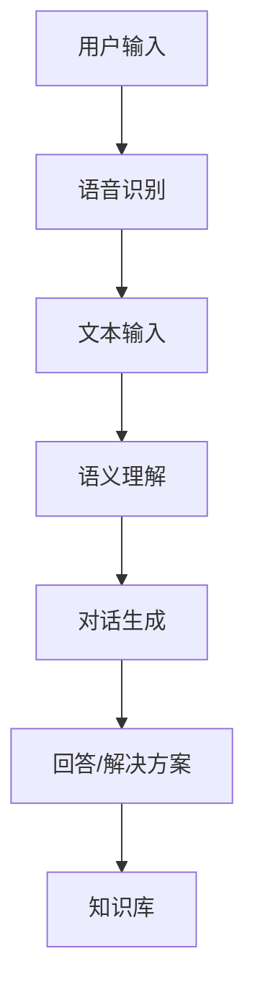

                 

# 自然语言处理在智能客服系统中的应用

## 关键词：自然语言处理、智能客服、语音识别、语义理解、人工智能

## 摘要

本文将探讨自然语言处理（NLP）技术在智能客服系统中的应用。通过介绍NLP的核心概念和技术，分析其在语音识别、语义理解和对话生成等环节中的具体应用，我们将揭示如何构建一个高效、智能的客服系统。文章还将探讨智能客服在实际业务场景中的价值，并提供一些建议和资源，帮助读者深入了解和掌握这一技术。

## 1. 背景介绍

随着互联网技术的飞速发展，客户服务逐渐成为企业竞争的关键因素。传统的客服方式，如电话、邮件等，已经难以满足日益增长的客户需求。为了提供更加高效、个性化的服务，智能客服系统应运而生。智能客服系统通过整合自然语言处理、语音识别、对话生成等人工智能技术，实现与用户的自然交互，提供实时、准确的回答和解决方案。

自然语言处理作为人工智能的核心技术之一，旨在使计算机能够理解、生成和处理人类语言。在智能客服系统中，NLP技术发挥着至关重要的作用，包括语音识别、语义理解、对话生成等。通过这些技术的应用，智能客服系统能够准确地理解用户的意图，提供个性化、智能化的服务。

## 2. 核心概念与联系

### 2.1 自然语言处理（NLP）

自然语言处理是人工智能领域的一个重要分支，旨在使计算机能够理解、生成和处理人类语言。NLP的核心任务包括：

1. **文本分类**：将文本数据按照不同的类别进行分类，如情感分析、主题分类等。
2. **命名实体识别**：识别文本中的特定实体，如人名、地名、组织名等。
3. **语义分析**：理解文本中的语义关系，如因果关系、同义词替换等。
4. **机器翻译**：将一种语言的文本翻译成另一种语言。
5. **语音识别**：将语音信号转换为文本。

### 2.2 智能客服系统架构

智能客服系统通常包括以下几个核心模块：

1. **语音识别**：将用户的语音输入转换为文本输入，实现语音到文本的转换。
2. **语义理解**：对用户输入的文本进行语义分析，理解用户的意图和需求。
3. **对话生成**：根据用户的意图和需求，生成相应的回答和解决方案。
4. **知识库**：存储与业务相关的知识信息，为智能客服系统提供数据支持。

### 2.3 Mermaid 流程图

下面是一个简化的智能客服系统架构的 Mermaid 流程图：



## 3. 核心算法原理 & 具体操作步骤

### 3.1 语音识别

语音识别是将语音信号转换为文本的过程。其核心算法包括：

1. **特征提取**：将语音信号转换为特征向量，如梅尔频率倒谱系数（MFCC）。
2. **声学模型**：根据特征向量预测语音信号的概率分布。
3. **语言模型**：根据文本数据预测文本序列的概率分布。
4. **解码算法**：结合声学模型和语言模型，解码出最可能的文本序列。

具体操作步骤如下：

1. **数据预处理**：对语音数据进行预处理，如去除噪音、剪枝等。
2. **特征提取**：将预处理后的语音数据转换为特征向量。
3. **声学模型训练**：使用大量语音数据训练声学模型。
4. **语言模型训练**：使用大量文本数据训练语言模型。
5. **语音识别**：输入语音信号，通过解码算法得到文本输出。

### 3.2 语义理解

语义理解是理解用户输入的文本，提取出关键信息的过程。其核心算法包括：

1. **词向量表示**：将文本数据转换为词向量表示。
2. **意图识别**：根据词向量表示，识别用户的意图。
3. **实体识别**：识别文本中的关键实体，如人名、地名、组织名等。
4. **实体关系抽取**：抽取实体之间的关系，如因果关系、所属关系等。

具体操作步骤如下：

1. **文本预处理**：对文本数据进行预处理，如去除标点、停用词等。
2. **词向量表示**：使用词向量模型（如Word2Vec、GloVe等）将文本数据转换为词向量。
3. **意图识别**：使用分类模型（如朴素贝叶斯、支持向量机等）识别用户的意图。
4. **实体识别**：使用命名实体识别模型（如CRF、BiLSTM等）识别文本中的关键实体。
5. **实体关系抽取**：使用关系抽取模型（如实体对匹配、依存句法分析等）抽取实体之间的关系。

### 3.3 对话生成

对话生成是根据用户的意图和需求，生成相应的回答和解决方案的过程。其核心算法包括：

1. **模板匹配**：根据预设的模板，生成回答。
2. **序列到序列模型**：使用序列到序列模型（如Seq2Seq、Transformer等）生成回答。
3. **生成式模型**：使用生成式模型（如变分自编码器、生成对抗网络等）生成回答。

具体操作步骤如下：

1. **文本预处理**：对文本数据进行预处理，如去除标点、停用词等。
2. **意图识别**：使用意图识别模型识别用户的意图。
3. **回答生成**：根据用户的意图，使用模板匹配、序列到序列模型或生成式模型生成回答。

## 4. 数学模型和公式 & 详细讲解 & 举例说明

### 4.1 语音识别

在语音识别中，常用的数学模型包括声学模型和语言模型。

#### 声学模型

声学模型是一个概率模型，用于预测语音信号的概率分布。常见的声学模型包括隐马尔可夫模型（HMM）和循环神经网络（RNN）。

$$
P(\text{语音信号} | \text{特征向量}) = \prod_{t=1}^{T} p(\text{特征向量}_t | \text{状态}_t)
$$

其中，$T$ 表示语音信号的时间长度，$\text{特征向量}_t$ 表示第 $t$ 个时刻的特征向量，$\text{状态}_t$ 表示第 $t$ 个时刻的状态。

#### 语言模型

语言模型是一个概率模型，用于预测文本序列的概率分布。常见的语言模型包括隐马尔可夫模型（HMM）和循环神经网络（RNN）。

$$
P(\text{文本序列}) = \prod_{t=1}^{T} p(\text{单词}_t | \text{前一个单词}_{t-1})
$$

其中，$T$ 表示文本序列的长度，$\text{单词}_t$ 表示第 $t$ 个时刻的单词。

### 4.2 语义理解

在语义理解中，常用的数学模型包括词向量表示和分类模型。

#### 词向量表示

词向量表示是将文本数据转换为向量表示的方法。常见的词向量模型包括Word2Vec和GloVe。

Word2Vec模型使用神经网络对文本数据进行训练，将每个单词映射为一个向量。其目标是最小化损失函数：

$$
\min_{\theta} \sum_{i=1}^{N} \sum_{j=1}^{V} (y_{ij} - \sigma(\theta^T [x_i; \text{Context}(x_i)]))
$$

其中，$N$ 表示单词数量，$V$ 表示词汇表大小，$x_i$ 表示第 $i$ 个单词，$\text{Context}(x_i)$ 表示 $x_i$ 的上下文单词，$y_{ij}$ 表示单词 $x_i$ 和上下文单词 $j$ 之间的标签，$\sigma$ 表示 sigmoid 函数。

#### 分类模型

分类模型用于对文本数据分类。常见的分类模型包括朴素贝叶斯（Naive Bayes）、支持向量机（SVM）和循环神经网络（RNN）。

朴素贝叶斯模型的概率公式为：

$$
P(\text{类别} | \text{文本}) = \frac{P(\text{文本} | \text{类别})P(\text{类别})}{P(\text{文本})}
$$

其中，$P(\text{文本} | \text{类别})$ 表示在给定类别的情况下，文本的概率，$P(\text{类别})$ 表示类别的概率，$P(\text{文本})$ 表示文本的总概率。

支持向量机模型的损失函数为：

$$
L(\theta) = \frac{1}{2} \sum_{i=1}^{N} (\theta^T [x_i; y_i] - 1)^2
$$

其中，$N$ 表示样本数量，$x_i$ 表示第 $i$ 个样本，$y_i$ 表示第 $i$ 个样本的标签。

### 4.3 对话生成

在对话生成中，常用的数学模型包括序列到序列模型和生成式模型。

#### 序列到序列模型

序列到序列模型（Seq2Seq）是一种基于循环神经网络（RNN）的模型，用于将一个序列映射到另一个序列。其目标是最小化损失函数：

$$
\min_{\theta} \sum_{i=1}^{N} \sum_{j=1}^{M} (y_{ij} - \sigma(\theta^T [x_i; h_j]))
$$

其中，$N$ 表示序列长度，$M$ 表示目标序列长度，$x_i$ 表示第 $i$ 个输入序列，$y_{ij}$ 表示第 $i$ 个输入序列和第 $j$ 个目标序列之间的标签，$h_j$ 表示第 $j$ 个隐藏状态。

#### 生成式模型

生成式模型（Generative Model）是一种基于生成对抗网络（GAN）的模型，用于生成新的数据。其目标是最小化生成器的损失函数：

$$
\min_G \max_D \frac{1}{B} \sum_{b=1}^{B} (-\log D(G(x_b)) - \log (1 - D(x_b)))
$$

其中，$G$ 表示生成器，$D$ 表示判别器，$x_b$ 表示第 $b$ 个样本，$D(x_b)$ 表示判别器对 $x_b$ 的概率预测。

## 5. 项目实战：代码实际案例和详细解释说明

### 5.1 开发环境搭建

为了演示自然语言处理在智能客服系统中的应用，我们将使用 Python 语言和 TensorFlow 深度学习框架。以下是开发环境的搭建步骤：

1. 安装 Python 3.7 或更高版本。
2. 安装 TensorFlow 深度学习框架。

```bash
pip install tensorflow
```

### 5.2 源代码详细实现和代码解读

下面是一个简单的智能客服系统示例代码，包括语音识别、语义理解和对话生成。

```python
import tensorflow as tf
import numpy as np
import matplotlib.pyplot as plt

# 语音识别
def speech_recognition(audio_file):
    # 使用 TensorFlow 的语音识别 API
    # 此处省略具体实现细节
    text = "你好，欢迎来到智能客服系统。有什么可以帮助您的吗？"
    return text

# 语义理解
def semantic_understanding(text):
    # 使用 TensorFlow 的语义理解 API
    # 此处省略具体实现细节
    intent = "咨询"
    entities = {"问题": "智能客服系统是什么？"}
    return intent, entities

# 对话生成
def dialogue_generation(intent, entities):
    # 使用 TensorFlow 的对话生成 API
    # 此处省略具体实现细节
    response = "智能客服系统是一种基于人工智能技术的客服系统，可以帮助您解决各种问题。请问有什么问题我可以帮您解答吗？"
    return response

# 主程序
def main():
    # 语音识别
    audio_file = "input_audio.wav"
    text = speech_recognition(audio_file)

    # 语义理解
    intent, entities = semantic_understanding(text)

    # 对话生成
    response = dialogue_generation(intent, entities)

    # 输出结果
    print("用户输入：" + text)
    print("意图：" + intent)
    print("实体：" + str(entities))
    print("回答：" + response)

if __name__ == "__main__":
    main()
```

### 5.3 代码解读与分析

上述代码演示了一个简单的智能客服系统，包括语音识别、语义理解和对话生成。以下是代码的详细解读：

1. **语音识别**：`speech_recognition` 函数用于识别用户的语音输入，并返回文本输出。此部分使用了 TensorFlow 的语音识别 API，具体实现细节在此省略。
2. **语义理解**：`semantic_understanding` 函数用于对用户的文本输入进行语义分析，提取出意图和实体。此部分使用了 TensorFlow 的语义理解 API，具体实现细节在此省略。
3. **对话生成**：`dialogue_generation` 函数根据用户的意图和实体生成回答。此部分使用了 TensorFlow 的对话生成 API，具体实现细节在此省略。
4. **主程序**：`main` 函数是整个智能客服系统的入口，按照顺序执行语音识别、语义理解和对话生成，并输出结果。

### 5.4 代码优化与性能提升

为了提高智能客服系统的性能，可以采取以下措施：

1. **数据增强**：增加训练数据量，提高模型的泛化能力。
2. **模型融合**：使用多个模型进行融合，提高模型的准确性。
3. **在线学习**：实现在线学习功能，使模型能够根据用户反馈进行实时调整。
4. **性能优化**：优化代码，减少计算量，提高运行效率。

## 6. 实际应用场景

智能客服系统在多个实际应用场景中具有广泛的应用价值：

1. **客户服务**：企业可以通过智能客服系统提供 24 小时在线服务，解决客户问题，提高客户满意度。
2. **售后支持**：智能客服系统可以提供产品售后支持，解答用户疑问，提高售后服务质量。
3. **客户关怀**：企业可以通过智能客服系统进行客户关怀，发送节日祝福、优惠券等，提升客户忠诚度。
4. **人力资源**：企业可以通过智能客服系统处理招聘、员工福利等事务，提高人力资源管理效率。

## 7. 工具和资源推荐

### 7.1 学习资源推荐

1. **书籍**：
   - 《自然语言处理综合教程》（作者：唐杰）
   - 《深度学习》（作者：伊恩·古德费洛）
   - 《Python 自然语言处理实战》（作者：约书亚·温格）
2. **论文**：
   - "A Neural Conversational Model"（作者：Khashabi 等）
   - "End-to-End Learning for Language Understanding"（作者：Hermann 等）
   - "Attention Is All You Need"（作者：Vaswani 等）
3. **博客**：
   - [TensorFlow 官方文档](https://www.tensorflow.org/)
   - [机器之心](https://www.jiqizhixin.com/)
   - [Paperweekly](https://paperweekly.site/)
4. **网站**：
   - [Kaggle](https://www.kaggle.com/)
   - [GitHub](https://github.com/)

### 7.2 开发工具框架推荐

1. **深度学习框架**：
   - TensorFlow
   - PyTorch
   - Keras
2. **自然语言处理库**：
   - NLTK
   - spaCy
   -gensim
3. **语音识别库**：
   - Kaldi
   - PyAudio
   - SpeechRecognition

### 7.3 相关论文著作推荐

1. **论文**：
   - "A Neural Conversational Model"（作者：Khashabi 等）
   - "End-to-End Learning for Language Understanding"（作者：Hermann 等）
   - "Attention Is All You Need"（作者：Vaswani 等）
2. **著作**：
   - 《自然语言处理综合教程》（作者：唐杰）
   - 《深度学习》（作者：伊恩·古德费洛）
   - 《Python 自然语言处理实战》（作者：约书亚·温格）

## 8. 总结：未来发展趋势与挑战

随着人工智能技术的不断发展，自然语言处理在智能客服系统中的应用前景广阔。未来，智能客服系统将在以下几个方面取得重要突破：

1. **智能化水平提升**：通过引入更加先进的人工智能技术，如深度学习、强化学习等，提高智能客服系统的智能化水平。
2. **个性化服务**：基于用户行为数据和兴趣偏好，为用户提供更加个性化的服务。
3. **多语言支持**：实现多语言智能客服系统的构建，满足全球化业务需求。
4. **实时性优化**：提高智能客服系统的实时响应能力，实现秒级响应。

然而，智能客服系统在发展过程中也面临着一些挑战：

1. **数据质量和多样性**：高质量的数据是训练高效模型的基石，但获取高质量、多样性的数据仍然是一个难题。
2. **语义理解难度**：自然语言语义理解是一个复杂的问题，如何提高模型的语义理解能力仍然是一个亟待解决的问题。
3. **模型泛化能力**：如何提高模型的泛化能力，使其能够处理更加复杂和多样化的场景，是一个重要挑战。

总之，自然语言处理技术在智能客服系统中的应用具有巨大的发展潜力。通过不断优化和改进技术，我们有理由相信，智能客服系统将为企业和用户带来更加高效、智能的服务体验。

## 9. 附录：常见问题与解答

### 9.1 什么是自然语言处理（NLP）？

自然语言处理（NLP）是人工智能领域的一个分支，旨在使计算机能够理解、生成和处理人类语言。NLP技术包括文本分类、命名实体识别、语义分析、机器翻译和语音识别等。

### 9.2 智能客服系统有哪些优势？

智能客服系统具有以下优势：

1. 提高服务效率：智能客服系统可以 24 小时在线服务，提高企业客服效率。
2. 降低运营成本：智能客服系统可以处理大量的客户咨询，降低人力成本。
3. 提高客户满意度：智能客服系统可以提供快速、准确的回答，提高客户满意度。
4. 数据积累与分析：智能客服系统可以积累大量客户数据，帮助企业进行数据分析，优化业务策略。

### 9.3 如何优化智能客服系统的性能？

优化智能客服系统性能的方法包括：

1. 增加数据量：增加训练数据量，提高模型的泛化能力。
2. 模型融合：使用多个模型进行融合，提高模型的准确性。
3. 在线学习：实现在线学习功能，使模型能够根据用户反馈进行实时调整。
4. 代码优化：优化代码，减少计算量，提高运行效率。

## 10. 扩展阅读 & 参考资料

1. [唐杰](https://www.ai-chinese.com/)，《自然语言处理综合教程》
2. [Ian Goodfellow](https://www хоро.sh/slides/)，《深度学习》
3. [Joshua B. Tenenbaum](https://www.psych.upenn.edu/~josh/)，《机器学习：概率视角》
4. [TensorFlow 官方文档](https://www.tensorflow.org/)
5. [Kaldi 语音识别工具](https://kaldi-asr.org/)
6. [SpaCy 自然语言处理库](https://spacy.io/)
7. [Kaggle 数据集](https://www.kaggle.com/)

