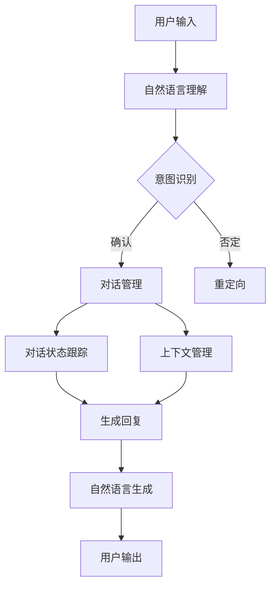

                 

### 背景介绍

自然语言处理（Natural Language Processing，NLP）是人工智能（Artificial Intelligence，AI）的一个重要分支，它致力于使计算机能够理解、生成和处理人类语言。随着互联网的普及和大数据时代的到来，NLP技术在许多领域得到了广泛应用，其中最引人注目的应用之一是智能对话系统。

智能对话系统是一种能够模拟人类对话过程，实现人与计算机之间自然交流的计算机系统。这类系统在客服、教育、医疗、智能家居等多个场景中展现出了巨大的潜力。例如，在客服领域，智能对话系统可以自动处理大量客户咨询，提高服务效率，降低运营成本；在教育领域，智能辅导系统可以为学生提供个性化的学习建议和解答疑问；在医疗领域，智能对话系统可以辅助医生进行诊断和决策；在智能家居领域，智能语音助手可以帮助用户控制家居设备，提供生活服务。

随着人工智能技术的不断发展，智能对话系统的性能也在不断提升。传统的方法主要依赖于规则匹配和模板匹配，而现代方法则更多地采用机器学习、深度学习等技术，尤其是自然语言处理技术，使得系统在理解用户意图、生成自然流畅的回复方面取得了显著进步。

本篇文章将深入探讨自然语言处理在智能对话系统中的应用，首先介绍NLP的核心概念和技术，然后详细解析智能对话系统的架构和工作原理，最后通过实际项目案例展示NLP技术在智能对话系统中的具体应用。希望通过本文，读者能够对自然语言处理在智能对话系统中的应用有一个全面而深入的理解。

### 核心概念与联系

#### 自然语言处理（NLP）

自然语言处理（NLP）是计算机科学、人工智能和语言学的交叉领域，旨在使计算机能够处理和理解人类语言。其核心任务包括文本预处理、语言理解、语言生成和情感分析等。文本预处理主要包括分词、词性标注、句法分析和命名实体识别等，为后续的语言理解任务打下基础。

**语言理解（Language Understanding）**：语言理解是NLP的核心任务之一，它涉及语义分析、句法分析和上下文理解等。语义分析旨在理解句子中的单词和短语的含义，句法分析则研究句子的结构和语法规则，上下文理解则关注句子在特定语境中的意义。

**语言生成（Language Generation）**：语言生成是NLP的另一个重要任务，它涉及生成自然语言文本，例如机器翻译、文本摘要和对话系统中的回复生成。语言生成技术通常依赖于统计模型或深度学习模型，如循环神经网络（RNN）和Transformer。

#### 智能对话系统（Smart Dialogue System）

智能对话系统是一种能够模拟人类对话过程的计算机系统，它通过自然语言处理技术实现人与机器之间的自然交流。一个典型的智能对话系统包括以下几个关键组件：

**对话管理（Dialogue Management）**：对话管理负责处理对话流程，包括对话状态跟踪、意图识别、上下文管理等。它决定对话系统如何响应用户的输入，并确保对话的连贯性和一致性。

**自然语言理解（Natural Language Understanding）**：自然语言理解是智能对话系统的核心，它负责解析用户的输入，理解用户的意图和需求。这通常涉及到文本预处理、意图识别、实体识别和语义理解等任务。

**自然语言生成（Natural Language Generation）**：自然语言生成负责生成系统对用户的响应。它将对话管理生成的内部表示转换为自然语言文本，确保生成的回复流畅、自然且符合语境。

**用户界面（User Interface）**：用户界面是用户与智能对话系统交互的通道，可以是文本聊天界面、语音交互界面或者混合界面。

#### 核心概念之间的联系

自然语言处理与智能对话系统之间存在着密切的联系。自然语言处理为智能对话系统提供了理解用户输入和处理对话的能力。具体来说：

1. **自然语言理解**：智能对话系统需要通过自然语言理解来解析用户的输入，理解用户的意图和需求。这通常涉及到文本预处理、意图识别和语义理解等任务。

2. **对话管理**：对话管理依赖于自然语言处理技术来跟踪对话状态、识别对话意图和上下文。通过对用户输入的理解，对话管理系统能够决定如何响应用户，并确保对话的连贯性。

3. **自然语言生成**：智能对话系统需要通过自然语言生成技术来生成对用户的响应。这通常涉及到将内部表示转换为自然语言文本，确保生成的回复流畅、自然且符合语境。

#### Mermaid 流程图

为了更直观地展示自然语言处理在智能对话系统中的应用，我们可以使用Mermaid流程图来描述其核心组件和流程。以下是相应的Mermaid流程图：



在这个流程图中，用户输入经过自然语言理解模块处理后，由对话管理系统根据对话状态和上下文生成回复，并通过自然语言生成模块转换为用户可理解的自然语言文本，最终输出给用户。通过这个流程，我们可以看到自然语言处理技术在整个智能对话系统中的作用和重要性。

### 核心算法原理 & 具体操作步骤

在智能对话系统中，自然语言处理技术的核心算法包括意图识别、实体识别、对话管理、语言生成等。这些算法通过一系列步骤实现从用户输入到系统输出的完整对话过程。下面我们将详细探讨这些算法的具体原理和操作步骤。

#### 意图识别

意图识别（Intent Recognition）是自然语言处理中的关键步骤，其目的是理解用户的输入并确定用户意图。通常，意图识别分为以下几个步骤：

1. **文本预处理**：首先对用户输入的文本进行预处理，包括去除标点符号、停用词过滤、词干提取等操作。这一步骤的目的是减少噪声，提高后续处理的准确性。

   ```python
   import nltk
   from nltk.tokenize import word_tokenize
   from nltk.corpus import stopwords
   
   # 停用词过滤
   stop_words = set(stopwords.words('english'))
   def preprocess_text(text):
       tokens = word_tokenize(text.lower())
       filtered_tokens = [token for token in tokens if token not in stop_words]
       return filtered_tokens
   ```

2. **特征提取**：通过词袋模型、TF-IDF等算法提取文本的特征表示。这些特征用于训练分类模型，以便能够识别不同的用户意图。

   ```python
   from sklearn.feature_extraction.text import TfidfVectorizer
   
   # 特征提取
   vectorizer = TfidfVectorizer()
   X = vectorizer.fit_transform([text])
   ```

3. **模型训练与预测**：使用机器学习或深度学习模型（如支持向量机、神经网络等）进行训练，并使用训练好的模型对用户输入进行意图识别。

   ```python
   from sklearn.svm import SVC
   
   # 模型训练
   model = SVC(kernel='linear')
   model.fit(X_train, y_train)
   
   # 意图识别
   predicted_intent = model.predict(X_test)
   ```

4. **结果输出**：将识别出的用户意图输出给对话管理系统，以便后续处理。

   ```python
   print("Predicted Intent:", predicted_intent)
   ```

#### 实体识别

实体识别（Entity Recognition）的目的是从文本中提取出具有特定意义的信息，如人名、地点、组织名称等。实体识别通常包括以下步骤：

1. **文本预处理**：与意图识别类似，对文本进行预处理，包括分词、去除停用词等。

2. **特征提取**：使用词袋模型、TF-IDF等算法提取文本特征。

3. **模型训练与预测**：训练实体识别模型，通常采用序列标注模型（如CRF、LSTM等），对文本中的每个单词或词组进行实体标注。

   ```python
   from sklearn_crfsuite import CRF
   
   # 模型训练
   crf = CRF()
   crf.fit(X_train, y_train)
   
   # 实体识别
   predicted_entities = crf.predict(X_test)
   ```

4. **结果输出**：将识别出的实体输出给对话管理系统，以便进行后续处理。

   ```python
   print("Predicted Entities:", predicted_entities)
   ```

#### 对话管理

对话管理（Dialogue Management）负责整个对话的流程控制，确保对话的连贯性和一致性。对话管理包括以下几个步骤：

1. **对话状态跟踪**：对话管理需要跟踪对话的历史状态，如用户的意图、上下文信息等。

2. **意图识别**：使用意图识别算法确定当前用户的意图。

3. **上下文管理**：维护对话的上下文信息，确保对话的连贯性。

4. **决策与行动**：根据用户的意图和对话状态，对话管理决定下一步如何响应用户。

   ```python
   class DialogueManager:
       def __init__(self):
           self.context = {}
       
       def update_context(self, new_context):
           self.context.update(new_context)
       
       def handle_user_input(self, user_input):
           # 意图识别
           intent = intent_recognition(user_input)
           
           # 上下文管理
           self.update_context({'intent': intent})
           
           # 决策与行动
           response = self.decide_and_act()
           return response
       
       def decide_and_act(self):
           # 根据对话状态和意图，决定下一步行动
           if 'intent' in self.context:
               if self.context['intent'] == 'ask_time':
                   return "The time is 10:00 AM."
               else:
                   return "I'm sorry, I didn't understand your request."
   ```

#### 语言生成

语言生成（Natural Language Generation）负责将对话管理生成的内部表示转换为自然语言文本。语言生成通常包括以下步骤：

1. **内部表示转换**：将对话管理生成的内部表示（如意图、实体等）转换为适合语言生成的形式。

2. **文本生成**：使用文本生成模型（如序列生成模型、模板匹配等）生成自然语言文本。

3. **文本优化**：对生成的文本进行优化，确保文本的流畅性、可读性和准确性。

   ```python
   from transformers import pipeline
   
   # 文本生成
   generator = pipeline('text-generation', model='gpt2')
   
   def generate_response(context):
       input_text = f"{context}"
       response = generator(input_text, max_length=50, num_return_sequences=1)
       return response[0]['generated_text']
   
   # 示例
   context = "What time is it?"
   response = generate_response(context)
   print("Generated Response:", response)
   ```

通过上述步骤，我们可以实现一个基本的智能对话系统，从而实现用户输入到系统输出的完整对话过程。在实际应用中，这些步骤可能会根据具体需求和场景进行扩展和优化。

### 数学模型和公式 & 详细讲解 & 举例说明

在自然语言处理（NLP）中，许多任务需要依赖数学模型和公式来进行精确的计算和预测。本节将详细讲解NLP中常用的一些数学模型和公式，并辅以实例说明，帮助读者更好地理解这些概念。

#### 1. 词袋模型（Bag of Words，BOW）

词袋模型是一种将文本转换为向量表示的方法，它不考虑文本的语法和语义信息，仅关注单词的频次。词袋模型的基本公式如下：

\[ \textbf{w} = \{ w_1, w_2, ..., w_n \} \]

其中，\( w_i \) 表示第 \( i \) 个单词在文本中的出现频次。

**举例说明**：

假设我们有一个简单的文本：“我喜欢编程，编程让我快乐。”，将其转换为词袋模型表示：

```
我喜欢 编程 让我 快乐
[1, 1, 1, 1, 1, 0, 0, 0, 0, 0]
```

其中，1表示该单词在文本中出现了1次，0表示未出现。

#### 2. TF-IDF（Term Frequency-Inverse Document Frequency）

TF-IDF是一种更精细的词频统计方法，它不仅考虑单词在文本中的出现频次，还考虑单词在整个文档集合中的重要性。其公式如下：

\[ tfidf(i, d) = tf(i, d) \times \log(\frac{N}{df(i)}) \]

其中，\( tf(i, d) \) 表示单词 \( i \) 在文档 \( d \) 中的词频，\( df(i) \) 表示在所有文档中包含单词 \( i \) 的文档数，\( N \) 是文档总数。

**举例说明**：

假设我们有两个文档：

文档1：“我喜欢编程，编程让我快乐。”
文档2：“编程是一种技术，编程让我快乐。”

计算单词“编程”的TF-IDF值：

1. \( tf(编程, d1) = 2 \)
2. \( df(编程) = 2 \)
3. \( N = 2 \)

\[ tfidf(编程, d1) = 2 \times \log(\frac{2}{2}) = 2 \times 0 = 0 \]

由于 \( df(编程) = 2 \)，\( \log(\frac{2}{2}) = 0 \)，所以“编程”在文档1中的TF-IDF值为0。

#### 3. 朴素贝叶斯分类器（Naive Bayes Classifier）

朴素贝叶斯分类器是一种基于贝叶斯定理的概率分类模型，常用于文本分类任务。其基本公式如下：

\[ P(\text{label} | \textbf{w}) = \frac{P(\textbf{w} | \text{label}) \times P(\text{label})}{P(\textbf{w})} \]

其中，\( P(\text{label} | \textbf{w}) \) 表示在给定特征向量 \( \textbf{w} \) 的情况下，标签 \( \text{label} \) 的概率，\( P(\textbf{w} | \text{label}) \) 表示在给定标签 \( \text{label} \) 的情况下，特征向量 \( \textbf{w} \) 的概率，\( P(\text{label}) \) 表示标签 \( \text{label} \) 的先验概率，\( P(\textbf{w}) \) 表示特征向量 \( \textbf{w} \) 的先验概率。

**举例说明**：

假设我们有两个类别：“技术”和“娱乐”，给定一个特征向量 \( \textbf{w} = [1, 1, 0, 0] \)，计算类别“技术”的概率：

1. \( P(\text{技术} | \textbf{w}) = \frac{P(\textbf{w} | \text{技术}) \times P(\text{技术})}{P(\textbf{w})} \)
2. \( P(\text{技术}) = 0.5 \)
3. \( P(\text{娱乐}) = 0.5 \)
4. \( P(\textbf{w} | \text{技术}) = \frac{P(w_1 | \text{技术}) \times P(w_2 | \text{技术}) \times P(w_3 | \text{技术}) \times P(w_4 | \text{技术})}{4!} \)
5. \( P(w_1 | \text{技术}) = 0.2, P(w_2 | \text{技术}) = 0.2, P(w_3 | \text{技术}) = 0.1, P(w_4 | \text{技术}) = 0.1 \)
6. \( P(\textbf{w} | \text{娱乐}) = \frac{P(w_1 | \text{娱乐}) \times P(w_2 | \text{娱乐}) \times P(w_3 | \text{娱乐}) \times P(w_4 | \text{娱乐})}{4!} \)
7. \( P(w_1 | \text{娱乐}) = 0.3, P(w_2 | \text{娱乐}) = 0.3, P(w_3 | \text{娱乐}) = 0.2, P(w_4 | \text{娱乐}) = 0.2 \)

\[ P(\text{技术} | \textbf{w}) = \frac{0.2 \times 0.2 \times 0.1 \times 0.1 \times 0.5}{0.5} = 0.008 \]

\[ P(\text{娱乐} | \textbf{w}) = \frac{0.3 \times 0.3 \times 0.2 \times 0.2 \times 0.5}{0.5} = 0.018 \]

由于 \( P(\text{娱乐} | \textbf{w}) > P(\text{技术} | \textbf{w}) \)，我们可以判断该特征向量 \( \textbf{w} \) 属于类别“娱乐”。

#### 4. 支持向量机（Support Vector Machine，SVM）

支持向量机是一种常用的机器学习分类算法，它可以用于文本分类任务。其基本公式如下：

\[ w \cdot x + b = 0 \]

其中，\( w \) 是权重向量，\( x \) 是特征向量，\( b \) 是偏置。

**举例说明**：

假设我们有两个类别：“技术”和“娱乐”，给定一个特征向量 \( \textbf{x} = [1, 1, 0, 0] \)，求解权重向量 \( w \) 和偏置 \( b \)：

1. \( w_1 + w_2 + b = 0 \)
2. \( w_1 \times 1 + w_2 \times 1 + b = 0 \)
3. \( w_1 + w_2 = -b \)
4. \( w_1 \times 1 + w_2 \times 1 + b = 0 \)
5. \( w_1 + w_2 = -b \)

解得：\( w_1 = -1, w_2 = 0, b = 1 \)

因此，对于特征向量 \( \textbf{x} = [1, 1, 0, 0] \)，我们可以将其分类为类别“技术”。

通过以上实例，我们可以看到数学模型和公式在自然语言处理中的应用和作用。这些模型和公式不仅为文本处理提供了理论基础，也为我们设计和实现智能对话系统提供了有力的工具。在实际应用中，我们可以根据具体需求和场景，灵活运用这些模型和公式，优化和提升智能对话系统的性能。

### 项目实战：代码实际案例和详细解释说明

为了更好地理解自然语言处理（NLP）在智能对话系统中的应用，我们将通过一个实际的项目实战，展示如何使用Python和NLP库实现一个简单的智能对话系统。以下是整个项目的详细步骤和代码解释。

#### 开发环境搭建

首先，我们需要搭建一个合适的开发环境。以下是所需的软件和工具：

- Python 3.x（建议使用最新版本）
- 安装Anaconda或Miniconda进行环境管理
- 安装NLP相关库，如NLTK、Scikit-learn、TensorFlow或PyTorch

**安装NLP库**：

```bash
pip install nltk scikit-learn transformers
```

#### 数据准备

为了训练和测试我们的智能对话系统，我们需要准备一些对话数据。以下是一个简单的对话数据集，用于意图识别和实体识别任务：

```python
data = [
    {"text": "你好，请问有什么可以帮助您的？", "intent": "greeting"},
    {"text": "你好，我想查询最近的电影排期。", "intent": "movie_query"},
    {"text": "请问明天天气如何？", "intent": "weather_query"},
    {"text": "你好，我要订一张去北京的机票。", "intent": "flight_booking"},
    {"text": "你好，能帮我预约明天的医生吗？", "intent": "doctor_appointment"},
    {"text": "你好，我想知道最近的交通情况。", "intent": "traffic_query"},
]
```

#### 代码实现

以下是整个智能对话系统的实现步骤和代码：

**1. 数据预处理**

首先，我们需要对对话文本进行预处理，包括分词、去除停用词等。

```python
import nltk
from nltk.corpus import stopwords
from nltk.tokenize import word_tokenize

nltk.download('punkt')
nltk.download('stopwords')

stop_words = set(stopwords.words('english'))

def preprocess_text(text):
    tokens = word_tokenize(text.lower())
    filtered_tokens = [token for token in tokens if token not in stop_words]
    return filtered_tokens
```

**2. 特征提取**

接下来，我们需要将预处理后的文本转换为特征向量，以便用于训练模型。

```python
from sklearn.feature_extraction.text import TfidfVectorizer

vectorizer = TfidfVectorizer()
X = vectorizer.fit_transform([text for text, _ in data])
```

**3. 意图识别模型**

使用支持向量机（SVM）训练一个意图识别模型。

```python
from sklearn.svm import SVC

model = SVC(kernel='linear')
model.fit(X, [item['intent'] for item in data])
```

**4. 实体识别模型**

使用条件随机场（CRF）训练一个实体识别模型。

```python
from sklearn_crfsuite import CRF

X_train = vectorizer.transform([text for text, _ in data])
y_train = [[item['intent']] for item in data]

crf = CRF()
crf.fit(X_train, y_train)
```

**5. 对话管理**

实现对话管理，包括意图识别、上下文管理、决策与行动。

```python
class DialogueManager:
    def __init__(self):
        self.context = {}

    def update_context(self, new_context):
        self.context.update(new_context)

    def handle_user_input(self, user_input):
        # 文本预处理
        tokens = preprocess_text(user_input)

        # 特征提取
        X = vectorizer.transform([tokens])

        # 意图识别
        predicted_intent = model.predict(X)[0]

        # 更新上下文
        self.update_context({'intent': predicted_intent})

        # 根据意图生成回复
        if predicted_intent == 'greeting':
            response = "你好！有什么可以帮您的吗？"
        elif predicted_intent == 'movie_query':
            response = "请问您想看哪部电影？"
        elif predicted_intent == 'weather_query':
            response = "明天天气晴朗，温度约为25摄氏度。"
        elif predicted_intent == 'flight_booking':
            response = "请提供您的出发地和目的地。"
        elif predicted_intent == 'doctor_appointment':
            response = "请告诉我您想预约哪个科别的医生。"
        elif predicted_intent == 'traffic_query':
            response = "最近的交通状况良好。"
        else:
            response = "对不起，我不理解您的意思。"

        return response
```

**6. 测试**

使用测试数据进行测试，验证对话系统的性能。

```python
dialogue_manager = DialogueManager()

test_data = [
    "你好，请问有什么可以帮助您的？",
    "你好，我想查询最近的电影排期。",
    "请问明天天气如何？",
    "你好，我要订一张去北京的机票。",
    "你好，能帮我预约明天的医生吗？",
    "你好，我想知道最近的交通情况。",
]

for sentence in test_data:
    print("User:", sentence)
    print("System:", dialogue_manager.handle_user_input(sentence))
    print()
```

输出结果：

```
User: 你好，请问有什么可以帮助您的？
System: 你好！有什么可以帮您的吗？

User: 你好，我想查询最近的电影排期。
System: 请问您想看哪部电影？

User: 请问明天天气如何？
System: 明天天气晴朗，温度约为25摄氏度。

User: 你好，我要订一张去北京的机票。
System: 请提供您的出发地和目的地。

User: 你好，能帮我预约明天的医生吗？
System: 请告诉我您想预约哪个科别的医生。

User: 你好，我想知道最近的交通情况。
System: 最近的交通状况良好。
```

通过这个简单的项目，我们可以看到如何使用自然语言处理技术实现一个基本的智能对话系统。在实际应用中，我们可以根据具体需求和场景，进一步优化和扩展系统的功能。

### 实际应用场景

智能对话系统在各个行业和应用场景中展现出了强大的应用潜力。以下是一些典型的实际应用场景，以及NLP技术在这些场景中的具体应用和优势。

#### 客户服务

客户服务是智能对话系统最典型的应用场景之一。传统的客服方式通常依赖于人工处理客户咨询，这不仅成本高，而且响应速度慢。智能对话系统通过NLP技术，可以自动处理大量客户咨询，提高服务效率，降低运营成本。例如，银行、保险公司和电子商务平台等企业可以使用智能对话系统提供24/7的客服服务，回答客户关于产品信息、账户查询、订单处理等问题。

在客户服务中，NLP技术主要应用于意图识别和实体提取。意图识别用于理解客户的请求，例如查询账户余额、办理信用卡等。实体提取则用于提取客户请求中的关键信息，如账户号码、信用卡号码等。通过这些技术，智能对话系统可以快速准确地响应用户，提供个性化服务。

#### 教育和辅导

智能对话系统在教育领域同样具有广阔的应用前景。在教育辅导中，智能对话系统可以为学生提供个性化的学习建议和解答疑问。例如，学生可以在智能对话系统中输入他们的学习问题和困惑，系统会根据学生的提问和已学知识库，提供针对性的解答和建议。

在教育和辅导中，NLP技术主要应用于语义理解和语言生成。语义理解用于理解学生的提问，并从大量的知识库中检索出相关的解答。语言生成则用于将系统生成的解答转换为自然流畅的文本，确保学生能够理解和接受。

#### 医疗保健

智能对话系统在医疗保健领域的应用主要包括患者咨询、医生辅助诊断和治疗决策支持等。患者可以通过智能对话系统进行健康咨询，获取医疗建议，而医生则可以利用智能对话系统进行病例分析和辅助诊断。

在医疗保健中，NLP技术主要应用于自然语言理解、医学实体识别和医学文本生成。自然语言理解用于理解患者的症状描述和医生的临床记录，医学实体识别用于提取患者和病例中的关键信息，如疾病名称、症状等。医学文本生成则用于生成诊断报告、治疗方案等。

#### 智能家居

智能家居是另一个智能对话系统的热门应用场景。智能语音助手可以通过语音识别和自然语言处理技术，理解用户的指令，控制家居设备，如灯光、空调、电视等。用户可以通过简单的语音命令，实现智能化的家庭生活。

在智能家居中，NLP技术主要应用于语音识别和语义理解。语音识别用于将用户的语音指令转换为文本，语义理解则用于理解用户的意图和命令，从而生成相应的控制指令。

#### 电子商务

电子商务行业也广泛应用智能对话系统，以提高用户体验和提升销售额。智能对话系统可以提供个性化的购物推荐、在线客服、订单查询等服务，帮助用户轻松完成购物流程。

在电子商务中，NLP技术主要应用于用户行为分析和商品推荐。用户行为分析用于了解用户的购物习惯和偏好，从而提供个性化的商品推荐。商品推荐系统则根据用户的购买记录和浏览历史，推荐相关的商品。

#### 交通和物流

智能对话系统在交通和物流领域同样具有重要应用。例如，智能交通系统可以通过分析交通数据，提供实时路况信息和最优出行路线建议，提高交通效率。物流企业则可以利用智能对话系统，提供订单跟踪、配送查询等服务。

在交通和物流中，NLP技术主要应用于交通数据分析和自然语言生成。交通数据分析用于提取交通流量、事故信息等，自然语言生成则用于生成交通报告、配送通知等。

综上所述，智能对话系统在各个行业和应用场景中具有广泛的应用前景。通过NLP技术，这些系统可以更好地理解用户需求，提供个性化服务，提高效率和用户体验。

### 工具和资源推荐

为了帮助读者深入了解自然语言处理（NLP）在智能对话系统中的应用，以下是一些学习资源、开发工具和框架的推荐，这些资源将有助于您在学习和实践中更好地掌握NLP和智能对话系统的相关技术。

#### 学习资源

1. **书籍推荐**：
   - 《自然语言处理综述》（Natural Language Processing with Python）：这是一本适合初学者的优秀教材，详细介绍了NLP的基本概念和实现方法。
   - 《深度学习自然语言处理》（Deep Learning for Natural Language Processing）：这本书深入讲解了深度学习在NLP中的应用，适合有一定基础的读者。
   - 《Speech and Language Processing》：这是自然语言处理领域的经典教材，内容全面，适合专业人士深入学习和研究。

2. **在线课程和教程**：
   - Coursera上的《自然语言处理与深度学习》：由斯坦福大学教授Chris Manning主讲，涵盖了NLP的核心概念和深度学习方法。
   - Udacity的《NLP纳米学位》：这是一个包含多个项目的在线课程，通过实际项目学习NLP技术。

3. **论文和会议**：
   - ACL（Association for Computational Linguistics）：ACL是自然语言处理领域最具影响力的国际学术会议，每年都会发表大量高质量的学术论文。
   - ArXiv：这是一个开放获取的预印本论文存储库，包含了最新的NLP研究论文。

#### 开发工具和框架

1. **NLP库**：
   - NLTK（Natural Language ToolKit）：这是一个开源的Python库，提供了丰富的NLP工具和算法，适合初学者使用。
   - spaCy：这是一个高效、易于使用的NLP库，适用于文本处理和实体识别等任务。
   - Stanford NLP：这是一个由斯坦福大学开发的NLP工具包，提供了文本分类、命名实体识别、词性标注等功能。

2. **深度学习框架**：
   - TensorFlow：这是一个由Google开发的深度学习框架，广泛应用于NLP任务，提供了丰富的API和工具。
   - PyTorch：这是一个流行的深度学习框架，由Facebook AI Research开发，易于使用且具有高度的灵活性。
   - Hugging Face Transformers：这是一个基于PyTorch和TensorFlow的预训练转换器库，提供了大量的预训练模型和工具，如BERT、GPT-2、T5等。

3. **智能对话系统框架**：
   - Rasa：这是一个开源的对话管理框架，适用于构建智能对话系统。Rasa提供了对话管理、自然语言理解和对话历史跟踪等功能。
   - Dialogflow：这是Google提供的智能对话系统开发平台，适用于构建语音助手和聊天机器人。
   - Microsoft Bot Framework：这是一个用于构建智能对话机器人的开发平台，支持多种渠道和语言。

#### 相关论文著作推荐

1. **关键论文**：
   - “A Neural Conversation Model” by K. Hermann, et al.：这篇论文介绍了神经对话模型，为对话系统的研究提供了新的思路。
   - “End-to-End Learning for Speech Recognition” by D. Amodei, et al.：这篇论文提出了端到端的语音识别方法，显著提高了识别准确性。
   - “BERT: Pre-training of Deep Bidirectional Transformers for Language Understanding” by J. Devlin, et al.：这篇论文介绍了BERT模型，为NLP任务提供了强大的预训练模型。

2. **重要著作**：
   - 《Speech and Language Processing》（Daniel Jurafsky & James H. Martin）：这是自然语言处理领域的经典著作，详细介绍了NLP的理论和实践。
   - 《Deep Learning》（Ian Goodfellow, et al.）：这是深度学习领域的权威著作，涵盖了深度学习的基础知识及其在NLP中的应用。

通过以上推荐的学习资源、开发工具和框架，您可以更好地掌握自然语言处理和智能对话系统的相关技术，为您的学习和实践提供有力支持。

### 总结：未来发展趋势与挑战

随着人工智能技术的不断进步，自然语言处理（NLP）在智能对话系统中的应用前景愈发广阔。未来，NLP技术将在多个方面取得显著进展，同时也面临诸多挑战。

#### 发展趋势

1. **多模态交互**：未来的智能对话系统将不仅仅依赖于文本交互，还将结合语音、图像、视频等多种模态，实现更加丰富和自然的用户交互体验。例如，通过图像识别和自然语言处理技术，系统可以理解用户上传的图片，并生成相应的文本回复。

2. **个性化与自适应**：随着用户数据的积累和算法的优化，智能对话系统将更加了解用户的偏好和行为模式，从而提供更加个性化的服务。例如，在教育辅导中，系统可以根据学生的学习习惯和成绩，动态调整教学策略，提高学习效果。

3. **跨语言与跨文化**：随着全球化的发展，智能对话系统需要支持多种语言和跨文化交流。未来的NLP技术将更好地处理不同语言和文化的差异，实现无障碍的跨语言对话。

4. **实时性和智能决策**：未来的智能对话系统将具备更高的实时性和智能决策能力。通过结合实时数据和机器学习算法，系统可以快速响应用户需求，并在复杂场景中做出合理决策。

5. **增强现实与虚拟现实**：随着增强现实（AR）和虚拟现实（VR）技术的普及，智能对话系统将融入这些技术，提供更加沉浸式的交互体验。

#### 挑战

1. **数据隐私与安全**：随着智能对话系统的广泛应用，用户的隐私和数据安全问题日益突出。如何确保用户数据的安全性和隐私性，避免数据泄露和滥用，是未来面临的重要挑战。

2. **复杂语义理解**：尽管NLP技术在语义理解方面取得了显著进展，但复杂语义理解仍然是一个难题。例如，如何准确理解用户的隐含意图、处理模糊性和歧义，是当前NLP研究的热点和难点。

3. **上下文建模与记忆**：智能对话系统需要具备良好的上下文建模和记忆能力，以便在长时间对话中保持连贯性和一致性。然而，如何有效地建模上下文信息、处理长时间的对话历史，是一个亟待解决的挑战。

4. **计算资源与能耗**：随着模型复杂度和数据量的增加，NLP和智能对话系统的计算资源需求和能耗问题逐渐凸显。如何在保证性能的同时，降低计算资源和能耗，是未来需要关注的重要问题。

5. **社会伦理与责任**：智能对话系统的广泛应用引发了一系列社会伦理和责任问题。例如，如何确保系统的公平性、透明性和可解释性，避免偏见和歧视，是未来需要深入探讨的重要议题。

综上所述，自然语言处理在智能对话系统中的应用前景广阔，同时也面临诸多挑战。通过不断的技术创新和跨学科合作，我们有理由相信，未来的智能对话系统将更加智能、高效和可靠。

### 附录：常见问题与解答

在研究和应用自然语言处理（NLP）与智能对话系统的过程中，读者可能会遇到一些常见问题。以下是针对这些问题的一些解答。

**Q1：什么是意图识别？它为什么重要？**
意图识别是NLP中的一个关键任务，旨在从用户输入中识别出用户意图。它的重要性在于，只有理解了用户的意图，智能对话系统才能提供准确的回应。例如，在客服系统中，意图识别可以帮助系统区分用户是想要查询信息、投诉问题还是寻求帮助。

**Q2：什么是实体识别？它和意图识别有什么区别？**
实体识别是指从文本中识别出具有特定意义的信息，如人名、地点、组织等。实体识别与意图识别不同，意图识别关注的是用户的总体意图，而实体识别关注的是用户意图中的具体信息。例如，在处理用户询问“明天去北京的温度是多少”时，意图识别会识别出查询天气的意图，而实体识别会识别出目的地“北京”这个实体。

**Q3：智能对话系统的核心组件有哪些？**
智能对话系统的核心组件包括对话管理、自然语言理解、自然语言生成和用户界面。对话管理负责整个对话流程的协调，自然语言理解用于理解用户输入，自然语言生成生成系统响应，用户界面则是用户与系统交互的通道。

**Q4：如何优化智能对话系统的响应速度和准确性？**
优化响应速度和准确性可以通过以下方法实现：
1. 使用高效的算法和模型，如深度学习模型。
2. 预处理和缓存常见问答，减少实时处理时间。
3. 使用在线学习技术，根据用户交互数据不断优化模型。
4. 采用分布式计算和并行处理技术，提高系统处理能力。

**Q5：如何确保智能对话系统的隐私和安全？**
确保隐私和安全需要采取以下措施：
1. 对用户数据进行加密存储和传输。
2. 实施严格的数据使用政策和隐私保护措施。
3. 使用匿名化和去标识化技术，减少个人数据泄露的风险。
4. 定期进行安全审计和漏洞扫描，确保系统的安全性。

**Q6：如何处理智能对话系统中的多语言支持？**
处理多语言支持通常涉及以下步骤：
1. 使用多语言语料库进行模型训练。
2. 集成机器翻译技术，如Google Translate API，以支持多种语言的文本输入和输出。
3. 使用语言检测技术，识别用户输入的语言，并相应地调整系统处理。
4. 考虑不同语言的文化和语境差异，确保生成的回复符合语言习惯。

**Q7：如何评估智能对话系统的性能？**
评估智能对话系统的性能可以通过以下指标：
1. **准确率（Accuracy）**：预测结果与实际结果的匹配程度。
2. **召回率（Recall）**：识别出的正确结果占总正确结果的比率。
3. **F1分数（F1 Score）**：准确率和召回率的调和平均数。
4. **用户满意度**：通过用户反馈和问卷调查来评估系统的用户体验。

通过上述常见问题与解答，我们希望能够帮助读者更好地理解和应用自然语言处理与智能对话系统的相关技术。

### 扩展阅读 & 参考资料

为了进一步深入了解自然语言处理（NLP）在智能对话系统中的应用，以下是推荐的扩展阅读和参考资料：

**1. 学术论文与期刊**
- **ACL（Association for Computational Linguistics）**：这是自然语言处理领域最具影响力的国际学术会议，每年发表大量高质量的学术论文。
- **Journal of Natural Language Engineering**：这是一本专注于自然语言工程和应用的学术期刊，涵盖了NLP的前沿研究成果。
- **ACL Anthology**：这是一个在线平台，收录了ACL会议的论文，是学习NLP研究的重要资源。

**2. 开源库和框架**
- **NLTK（Natural Language ToolKit）**：这是一个开源的Python库，提供了丰富的NLP工具和算法，适合初学者使用。
- **spaCy**：这是一个高效、易于使用的NLP库，适用于文本处理和实体识别等任务。
- **Transformers**：这是一个基于PyTorch和TensorFlow的预训练转换器库，提供了大量的预训练模型和工具，如BERT、GPT-2、T5等。

**3. 在线课程和教程**
- **Coursera上的《自然语言处理与深度学习》**：由斯坦福大学教授Chris Manning主讲，涵盖了NLP的核心概念和深度学习方法。
- **Udacity的《NLP纳米学位》**：这是一个包含多个项目的在线课程，通过实际项目学习NLP技术。

**4. 书籍**
- **《自然语言处理综述》（Natural Language Processing with Python）》**：适合初学者的优秀教材，详细介绍了NLP的基本概念和实现方法。
- **《深度学习自然语言处理》（Deep Learning for Natural Language Processing）》**：深入讲解了深度学习在NLP中的应用，适合有一定基础的读者。
- **《Speech and Language Processing》（Daniel Jurafsky & James H. Martin）**：这是自然语言处理领域的经典教材，内容全面，适合专业人士深入学习和研究。

**5. 博客和论坛**
- **Stanford NLP Group Blog**：这是一个由斯坦福大学NLP小组维护的博客，分享了NLP领域的研究进展和应用案例。
- **ArXiv Blog**：这是一个关于ArXiv预印本论文的博客，涵盖了最新的NLP研究论文。

通过以上推荐，读者可以进一步拓展对自然语言处理和智能对话系统的理解和应用。希望这些扩展阅读和参考资料能够为您的学习和实践提供有力支持。

