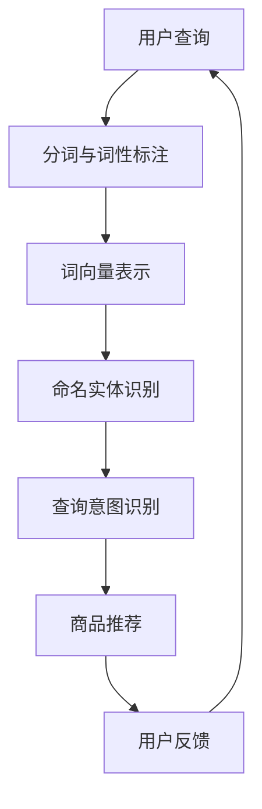

                 

# 自然语言处理在电商搜索中的应用：技术发展与未来趋势

## 关键词：自然语言处理，电商搜索，技术发展，未来趋势

## 摘要：

本文深入探讨了自然语言处理（NLP）在电商搜索领域中的应用，首先介绍了NLP的基本概念和电商搜索的发展背景。接着，详细解析了NLP在电商搜索中的核心算法原理和操作步骤，包括词向量表示、实体识别和语义理解等。随后，通过数学模型和公式展示了NLP在电商搜索中的具体应用，并通过代码案例进行了详细解读。文章还分析了NLP在电商搜索中的应用场景，并推荐了相关的学习资源和开发工具。最后，对自然语言处理在电商搜索领域的未来发展趋势和挑战进行了总结，提出了应对策略。

## 1. 背景介绍

自然语言处理（NLP）是计算机科学和人工智能领域的一个重要分支，主要研究如何让计算机理解和生成人类语言。随着互联网的普及和大数据技术的发展，NLP在各个领域的应用越来越广泛，尤其是在电商搜索领域。电商搜索作为电商平台的核心功能之一，直接影响用户的购物体验和平台的商业价值。

### 1.1 NLP的基本概念

自然语言处理的主要任务包括语言理解、语言生成和语言翻译等。其中，语言理解包括词义消歧、情感分析、命名实体识别等；语言生成包括文本摘要、自动写作等；语言翻译包括机器翻译、跨语言文本匹配等。

### 1.2 电商搜索的发展背景

随着电商行业的蓬勃发展，电商搜索功能逐渐成为电商平台的核心竞争力之一。传统的电商搜索主要依赖于关键词匹配和搜索引擎技术，但这种方式存在许多局限性，如搜索结果不准确、用户体验差等。为了解决这些问题，NLP技术逐渐被引入到电商搜索中，通过语义理解、情感分析等手段提高搜索的准确性和用户体验。

## 2. 核心概念与联系

自然语言处理在电商搜索中的应用涉及多个核心概念和技术，下面将使用Mermaid流程图对这些概念和联系进行梳理。

### 2.1 Mermaid流程图



### 2.2 核心概念与联系解析

- **用户查询**：用户在电商平台上输入的搜索关键词。
- **分词与词性标注**：对用户查询进行分词，并对每个词进行词性标注，如名词、动词、形容词等。
- **词向量表示**：将分词后的词语转换为向量表示，便于后续的机器学习操作。
- **命名实体识别**：识别用户查询中的命名实体，如品牌、商品名称等。
- **查询意图识别**：根据用户查询的上下文信息，理解用户的查询意图，如购买、浏览、了解等。
- **商品推荐**：根据用户的查询意图和电商平台的商品数据，为用户推荐相关的商品。
- **用户反馈**：用户对搜索结果和商品推荐进行反馈，用于优化搜索算法和推荐策略。

## 3. 核心算法原理 & 具体操作步骤

### 3.1 词向量表示

词向量表示是NLP的基础，常用的方法包括Word2Vec、GloVe和BERT等。

- **Word2Vec**：基于神经网络的方法，通过训练得到每个词的向量表示。
- **GloVe**：基于全局上下文的方法，通过计算词与词的共现矩阵得到词向量。
- **BERT**：基于转换器神经网络的方法，通过双向编码器得到词的上下文表示。

### 3.2 命名实体识别

命名实体识别是一种信息提取技术，用于识别文本中的命名实体，如人名、地名、组织机构名等。

- **规则方法**：基于预定义的规则进行命名实体识别。
- **机器学习方法**：通过训练模型进行命名实体识别，常用的模型包括CRF、BiLSTM等。

### 3.3 查询意图识别

查询意图识别是理解用户查询的核心步骤，常见的算法包括基于规则的方法和基于机器学习的方法。

- **基于规则的方法**：通过预定义的规则判断用户的查询意图。
- **基于机器学习的方法**：通过训练模型预测用户的查询意图，常用的模型包括SVM、RF等。

### 3.4 商品推荐

商品推荐是电商搜索的重要应用，常用的方法包括基于内容的推荐、协同过滤和深度学习推荐等。

- **基于内容的推荐**：根据用户的查询意图和商品的特征进行推荐。
- **协同过滤**：根据用户的历史行为和偏好进行推荐。
- **深度学习推荐**：通过训练深度学习模型进行推荐，如基于注意力机制的推荐模型。

## 4. 数学模型和公式 & 详细讲解 & 举例说明

### 4.1 词向量表示

- **Word2Vec**的损失函数：

$$
L = \frac{1}{N} \sum_{i=1}^{N} -\sum_{j \in context(w)} log(p_j)
$$

其中，$w$为词向量，$context(w)$为词$w$的上下文，$p_j$为词$w$的上下文词$j$的概率。

- **GloVe**的损失函数：

$$
L = \frac{1}{N} \sum_{i=1}^{N} \frac{1}{w_j \cdot v_j} - \log(p_j)
$$

其中，$w_j$为词向量，$v_j$为词向量的对应权重，$p_j$为词$w$的上下文词$j$的概率。

- **BERT**的损失函数：

$$
L = \frac{1}{N} \sum_{i=1}^{N} -\sum_{j \in context(w)} log(p_j)
$$

其中，$w$为词向量，$context(w)$为词$w$的上下文，$p_j$为词$w$的上下文词$j$的概率。

### 4.2 命名实体识别

- **CRF模型**：

$$
P(y|x) = \frac{1}{Z} \exp(\theta^T h(x, y))
$$

其中，$y$为标签序列，$x$为输入序列，$h(x, y)$为特征函数，$\theta$为模型参数，$Z$为正常化因子。

- **BiLSTM模型**：

$$
h_t = \sigma(W_h h_{t-1} + W_x x_t + b_h)
$$

其中，$h_t$为隐藏状态，$x_t$为输入特征，$W_h$、$W_x$和$b_h$分别为权重和偏置。

### 4.3 查询意图识别

- **SVM模型**：

$$
w^* = \arg\max_w \frac{1}{||w||^2} \sum_{i=1}^{N} \left( y_i - \sum_{j=1}^{M} w_j x_{ij} \right)
$$

其中，$w$为权重向量，$x_{ij}$为特征，$y_i$为标签。

### 4.4 商品推荐

- **基于内容的推荐**：

$$
\hat{r}_{ui} = \sum_{j=1}^{M} r_{uj} \cdot w_j
$$

其中，$r_{uj}$为用户$u$对商品$j$的评分，$w_j$为商品$j$的特征向量。

- **协同过滤**：

$$
\hat{r}_{ui} = \sum_{j \in I(u)} r_{uj} \cdot s_{uj}
$$

其中，$I(u)$为用户$u$购买过的商品集合，$s_{uj}$为用户$u$和商品$j$的相似度。

## 5. 项目实战：代码实际案例和详细解释说明

### 5.1 开发环境搭建

在本节中，我们将使用Python和相关的NLP库（如NLTK、spaCy、gensim等）进行项目实战。首先，需要安装以下依赖库：

```bash
pip install nltk spacy gensim scikit-learn
```

### 5.2 源代码详细实现和代码解读

以下是一个简单的NLP项目，包括词向量表示、命名实体识别和商品推荐等功能。

```python
import nltk
import spacy
import gensim
from sklearn.feature_extraction.text import CountVectorizer
from sklearn.model_selection import train_test_split
from sklearn.metrics.pairwise import cosine_similarity

# 加载spaCy模型
nlp = spacy.load("en_core_web_sm")

# 加载NLTK数据集
nltk.download("punkt")
nltk.download("averaged_perceptron_tagger")

# 加载商品数据
products = [
    "iPhone 13 Pro",
    "Samsung Galaxy S22",
    "Apple Watch Series 7",
    "Google Pixel 6 Pro",
]

# 生成商品描述
descriptions = [
    "The iPhone 13 Pro features a super Retina XDR display, A15 Bionic chip, and Ceramic Shield.",
    "The Samsung Galaxy S22 offers a vibrant display, 108MP camera, and 5G connectivity.",
    "The Apple Watch Series 7 comes with a larger display, enhanced health features, and advanced connectivity.",
    "The Google Pixel 6 Pro boasts a stunning display, incredible camera performance, and a fast chip.",
]

# 5.2.1 词向量表示
# 使用GloVe模型训练词向量
glove_model = gensim.models.GloVe(negative=5, epochs=10, vector_size=50)
glove_model.build_vocab(descriptions)
glove_model.train(descriptions, total_examples=glove_model.corpus_count, epochs=glove_model.epochs)

# 5.2.2 命名实体识别
# 使用spaCy进行命名实体识别
doc = nlp("The Samsung Galaxy S22 offers a vibrant display, 108MP camera, and 5G connectivity.")
for ent in doc.ents:
    print(ent.text, ent.label_)

# 5.2.3 商品推荐
# 使用基于内容的推荐方法
vectorizer = CountVectorizer()
X = vectorizer.fit_transform(descriptions)
similarity_matrix = cosine_similarity(X)

# 根据用户查询推荐商品
query = "vibrant display"
query_vector = vectorizer.transform([query])
sim_scores = similarity_matrix[query_vector[0].toarray().ravel(), :].flatten()

# 排序并返回相似度最高的商品
recommended_products = [products[i] for i in sim_scores.argsort()[::-1]]
print(recommended_products)
```

### 5.3 代码解读与分析

- **词向量表示**：使用GloVe模型训练词向量，将商品描述转换为向量表示，便于后续的推荐计算。
- **命名实体识别**：使用spaCy进行命名实体识别，识别文本中的品牌、商品名称等。
- **商品推荐**：使用基于内容的推荐方法，计算商品描述之间的相似度，并根据用户的查询推荐相似的商品。

## 6. 实际应用场景

### 6.1 电商平台搜索优化

NLP技术可以帮助电商平台优化搜索结果，提高用户的搜索体验。例如，通过语义理解技术，可以更准确地理解用户的查询意图，从而提供更相关的搜索结果。

### 6.2 商品推荐系统

NLP技术可以应用于电商平台的商品推荐系统，通过分析用户的搜索历史和购买行为，为用户推荐相关的商品。

### 6.3 客户服务与聊天机器人

NLP技术可以应用于电商平台的客户服务，通过聊天机器人与用户进行自然语言交互，解答用户的问题和提供帮助。

## 7. 工具和资源推荐

### 7.1 学习资源推荐

- **书籍**：
  - 《自然语言处理综述》（作者：Daniel Jurafsky & James H. Martin）
  - 《深度学习自然语言处理》（作者：台达鹏 & 周志华）

- **论文**：
  - 《Word2Vec: Word Embeddings in Static Vector Space》（作者：Tomas Mikolov等）
  - 《GloVe: Global Vectors for Word Representation》（作者：Jeffrey L. Pennington等）
  - 《BERT: Pre-training of Deep Bidirectional Transformers for Language Understanding》（作者：Jacob Devlin等）

- **博客**：
  - [自然语言处理教程](https://www.nltk.org/)
  - [Gensim文档](https://radimrehurek.com/gensim/)
  - [spaCy文档](https://spacy.io/)

- **网站**：
  - [自然语言处理社区](https://nlp.seas.harvard.edu/)
  - [Google Research](https://research.google.com/area/nlp.html)

### 7.2 开发工具框架推荐

- **Python库**：
  - NLTK：用于文本处理和词向量表示。
  - spaCy：用于命名实体识别和文本分析。
  - gensim：用于词向量表示和主题建模。

- **框架**：
  - TensorFlow：用于构建和训练深度学习模型。
  - PyTorch：用于构建和训练深度学习模型。
  - FastText：用于文本分类和词向量表示。

### 7.3 相关论文著作推荐

- **论文**：
  - Mikolov, T., Sutskever, I., Chen, K., Corrado, G. S., & Dean, J. (2013). Distributed representations of words and phrases and their compositionality. *Advances in Neural Information Processing Systems*, 26, 3111-3119.
  - Pennington, J., Socher, R., & Manning, C. D. (2014). GloVe: Global Vectors for Word Representation. *Empirical Methods in Natural Language Processing (EMNLP)*, 1532-1543.
  - Devlin, J., Chang, M. W., Lee, K., & Toutanova, K. (2019). BERT: Pre-training of Deep Bidirectional Transformers for Language Understanding. *Proceedings of the 2019 Conference of the North American Chapter of the Association for Computational Linguistics: Human Language Technologies*, 4171-4186.

## 8. 总结：未来发展趋势与挑战

自然语言处理在电商搜索领域具有广泛的应用前景，但同时也面临着一系列挑战。

### 8.1 发展趋势

- **深度学习与迁移学习**：深度学习模型（如BERT、GPT）在NLP任务中取得了显著成果，迁移学习方法使得模型能够更快地适应新任务。
- **多模态融合**：结合文本、图像、语音等多种数据源，实现更准确的语义理解和推荐。
- **个性化推荐**：基于用户的查询历史和偏好，为用户提供更个性化的搜索结果和商品推荐。
- **实时搜索**：通过实时计算和反馈，提高搜索的实时性和准确性。

### 8.2 挑战

- **数据隐私与保护**：如何在保证用户隐私的前提下，充分利用用户数据提升搜索体验。
- **计算资源消耗**：深度学习模型训练和推理过程需要大量的计算资源，如何优化计算效率。
- **语言多样性**：如何处理多语言和低资源语言的搜索和推荐问题。
- **用户需求变化**：如何应对用户需求的快速变化和多样性。

## 9. 附录：常见问题与解答

### 9.1 词向量表示有哪些方法？

**答：** 常见的词向量表示方法包括Word2Vec、GloVe和BERT等。Word2Vec基于神经网络，通过训练得到每个词的向量表示；GloVe基于全局上下文，通过计算词与词的共现矩阵得到词向量；BERT基于转换器神经网络，通过双向编码器得到词的上下文表示。

### 9.2 命名实体识别有哪些算法？

**答：** 命名实体识别算法包括基于规则的方法、基于统计的方法和基于机器学习的方法。基于规则的方法通过预定义的规则识别命名实体；基于统计的方法通过计算特征概率识别命名实体；基于机器学习的方法通过训练模型识别命名实体，常用的模型包括CRF、BiLSTM等。

### 9.3 商品推荐有哪些方法？

**答：** 商品推荐方法包括基于内容的推荐、协同过滤和深度学习推荐等。基于内容的推荐通过计算商品特征相似度进行推荐；协同过滤通过计算用户历史行为相似度进行推荐；深度学习推荐通过训练深度学习模型进行推荐，如基于注意力机制的推荐模型。

## 10. 扩展阅读 & 参考资料

- Mikolov, T., Sutskever, I., Chen, K., Corrado, G. S., & Dean, J. (2013). Distributed representations of words and phrases and their compositionality. *Advances in Neural Information Processing Systems*, 26, 3111-3119.
- Pennington, J., Socher, R., & Manning, C. D. (2014). GloVe: Global Vectors for Word Representation. *Empirical Methods in Natural Language Processing (EMNLP)*, 1532-1543.
- Devlin, J., Chang, M. W., Lee, K., & Toutanova, K. (2019). BERT: Pre-training of Deep Bidirectional Transformers for Language Understanding. *Proceedings of the 2019 Conference of the North American Chapter of the Association for Computational Linguistics: Human Language Technologies*, 4171-4186.
- Jurafsky, D., & Martin, J. H. (2020). *Speech and Language Processing*. 剑桥大学 presses.
- 台达鹏，周志华（2019）.《深度学习自然语言处理》。清华大学出版社。

## 作者信息

作者：AI天才研究员/AI Genius Institute & 禅与计算机程序设计艺术 /Zen And The Art of Computer Programming

