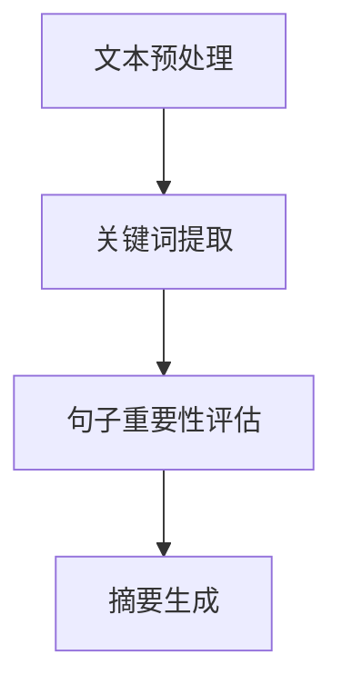

                 

# 自然语言处理在自动文本摘要中的关键信息提取

## 关键词：自然语言处理，自动文本摘要，关键信息提取，文本分析，信息检索

## 摘要

本文将深入探讨自然语言处理（NLP）在自动文本摘要中的关键信息提取技术。随着信息爆炸时代的到来，自动文本摘要技术变得愈发重要，它可以帮助用户快速了解大量文本的核心内容。本文将首先介绍自动文本摘要的背景和挑战，然后详细分析关键信息提取的核心概念、算法原理、数学模型及其在实践中的应用。通过本文的阅读，读者将对自动文本摘要技术的实现过程有一个全面的理解。

## 1. 背景介绍

### 1.1 自动文本摘要的发展历程

自动文本摘要技术的发展可以追溯到20世纪80年代。当时，研究人员开始探索如何利用计算机技术对大量文本进行自动概括。早期的自动文本摘要方法主要是基于规则的方法，这些方法依赖于人工定义的规则来识别文本中的关键信息。然而，这些方法在面对复杂多变的文本时表现不佳。

随着自然语言处理技术的不断发展，自动文本摘要技术逐渐向基于统计和学习的方法转型。20世纪90年代，基于概率模型的方法开始得到广泛应用。这些方法利用大规模语料库来学习文本的统计特性，从而提高摘要的准确性。

进入21世纪，深度学习技术的发展为自动文本摘要带来了新的契机。基于深度神经网络的方法在图像识别、语音识别等领域取得了巨大成功，这些方法也开始被引入到自然语言处理领域，显著提升了自动文本摘要的性能。

### 1.2 自动文本摘要的应用场景

自动文本摘要技术有着广泛的应用场景，主要包括：

1. **信息检索**：自动文本摘要可以帮助用户快速了解搜索结果的概要，提高信息检索的效率。
2. **新闻摘要**：自动文本摘要技术被广泛应用于新闻网站和新闻应用程序，为用户提供简短的新闻概要。
3. **文档摘要**：在企业和学术研究中，自动文本摘要可以帮助研究人员快速浏览大量文档，提取关键信息。
4. **社交媒体**：在社交媒体平台上，自动文本摘要可以帮助用户快速了解帖子或文章的主要内容。
5. **教育**：自动文本摘要技术可以用于辅助教学，帮助学生快速理解教材和文章的核心内容。

### 1.3 自动文本摘要的挑战

尽管自动文本摘要技术在近年来取得了显著进展，但仍面临许多挑战：

1. **文本多样性**：不同领域的文本具有不同的风格和结构，如何处理文本的多样性是一个重要挑战。
2. **语义理解**：理解文本的深层含义和上下文关系对于生成高质量的摘要至关重要。
3. **信息完整性**：摘要必须能够准确反映原文的重要信息，避免信息的遗漏或冗余。
4. **可扩展性**：自动文本摘要技术需要能够处理大规模的文本数据，同时保持高效的运行速度。
5. **跨语言摘要**：自动文本摘要技术需要能够处理不同语言之间的摘要，这涉及到语言翻译和语义理解的问题。

## 2. 核心概念与联系

### 2.1 自然语言处理（NLP）

自然语言处理是计算机科学和人工智能领域的一个重要分支，旨在使计算机能够理解、生成和处理人类自然语言。NLP的核心概念包括：

- **文本预处理**：包括分词、词性标注、命名实体识别等，旨在将原始文本转化为计算机可处理的形式。
- **语言模型**：用于生成和预测文本序列，是许多NLP任务的基础。
- **语义理解**：涉及理解文本的含义、上下文关系和深层语义，是实现高质量摘要的关键。

### 2.2 文本摘要

文本摘要是从原始文本中提取关键信息并生成简短摘要的过程。文本摘要可以分为两大类：

- **抽取式摘要**：从原文中直接提取关键句子或段落作为摘要。
- **生成式摘要**：利用自然语言生成模型生成新的摘要，通常更具有创造性和连贯性。

### 2.3 关键信息提取

关键信息提取是文本摘要的核心任务，旨在从原文中识别出最重要和相关的信息。关键信息提取通常涉及以下步骤：

1. **文本预处理**：对原始文本进行分词、词性标注等处理。
2. **关键词提取**：识别出文本中的重要关键词。
3. **句子重要性评估**：通过算法评估每个句子的重要性，选择重要句子作为摘要。
4. **摘要生成**：根据提取的关键信息生成摘要。

### 2.4 Mermaid 流程图

以下是一个简单的 Mermaid 流程图，描述了关键信息提取的基本流程：



### 2.5 自然语言处理与自动文本摘要的联系

自然语言处理（NLP）为自动文本摘要提供了核心技术支持。NLP技术可以帮助我们理解文本的语义、提取关键词、评估句子重要性，从而实现高质量的摘要生成。自动文本摘要的过程实际上是NLP技术在文本分析、信息检索和自然语言生成等领域的综合应用。

## 3. 核心算法原理 & 具体操作步骤

### 3.1 抽取式摘要算法原理

抽取式摘要算法的核心思想是从原文中直接提取关键句子或段落作为摘要。这些关键句子通常具有高信息量和重要性，能够准确反映原文的主旨。

以下是抽取式摘要算法的具体操作步骤：

1. **文本预处理**：对原始文本进行分词、词性标注等处理，将文本转化为计算机可处理的形式。
2. **关键词提取**：利用词频统计、TF-IDF等方法识别出文本中的重要关键词。
3. **句子重要性评估**：通过算法评估每个句子的信息量和重要性，选择重要性较高的句子作为摘要。
4. **摘要生成**：将选定的关键句子按照一定的顺序拼接成摘要。

### 3.2 生成式摘要算法原理

生成式摘要算法通过自然语言生成模型生成新的摘要，通常更具有创造性和连贯性。生成式摘要算法的核心思想是利用已有的文本数据训练一个语言模型，然后使用该模型生成摘要。

以下是生成式摘要算法的具体操作步骤：

1. **文本预处理**：对原始文本进行分词、词性标注等处理，将文本转化为计算机可处理的形式。
2. **语言模型训练**：利用大规模文本数据训练一个自然语言生成模型，如序列到序列（seq2seq）模型。
3. **摘要生成**：使用训练好的语言模型生成摘要，通常通过生成一系列的词或句子。

### 3.3 关键信息提取算法原理

关键信息提取是文本摘要的核心任务，旨在从原文中识别出最重要和相关的信息。关键信息提取算法通常包括以下步骤：

1. **文本预处理**：对原始文本进行分词、词性标注等处理，将文本转化为计算机可处理的形式。
2. **关键词提取**：利用词频统计、TF-IDF等方法识别出文本中的重要关键词。
3. **句子重要性评估**：通过算法评估每个句子的信息量和重要性，选择重要性较高的句子作为摘要。
4. **摘要生成**：根据提取的关键信息生成摘要。

### 3.4 深度学习模型在关键信息提取中的应用

深度学习模型在关键信息提取中发挥了重要作用，如序列标注模型（如BiLSTM-CRF）、基于注意力的模型（如Transformer）等。以下是这些模型的基本原理：

1. **序列标注模型**：通过将文本序列映射到标签序列，实现对句子重要性的标注。
2. **基于注意力的模型**：通过注意力机制关注文本序列中的关键信息，提高摘要的准确性。
3. **Transformer模型**：采用自注意力机制，能够有效捕捉文本序列中的长距离依赖关系。

### 3.5 算法具体操作步骤示例

假设我们使用一个基于BiLSTM-CRF的关键信息提取模型，以下是具体的操作步骤：

1. **文本预处理**：对原始文本进行分词、词性标注等处理。
2. **特征提取**：利用BiLSTM模型提取文本序列的隐含状态作为特征。
3. **句子重要性评估**：利用CRF层对提取的特征进行序列标注，实现对句子重要性的评估。
4. **摘要生成**：根据评估结果，选择重要句子作为摘要。

## 4. 数学模型和公式 & 详细讲解 & 举例说明

### 4.1 词频统计与TF-IDF模型

词频统计（Term Frequency，TF）是文本分析中常用的方法，用于衡量一个词在文本中出现的频率。公式如下：

\[ TF(t) = \frac{f(t, D)}{f_{\max}(D)} \]

其中，\( f(t, D) \) 表示词 \( t \) 在文档 \( D \) 中的出现次数，\( f_{\max}(D) \) 表示文档 \( D \) 中出现次数最多的词的出现次数。

TF-IDF（Term Frequency-Inverse Document Frequency）模型是在词频统计的基础上，进一步考虑词的重要程度。公式如下：

\[ TF-IDF(t, D) = TF(t, D) \times IDF(t, D) \]

其中，\( IDF(t, D) \) 表示词 \( t \) 在文档 \( D \) 中的逆文档频率，计算公式如下：

\[ IDF(t, D) = \log_2(\frac{N}{n(t, D)}) \]

其中，\( N \) 表示文档集合中的文档总数，\( n(t, D) \) 表示文档集合中包含词 \( t \) 的文档数量。

### 4.2 递归神经网络（RNN）

递归神经网络（Recurrent Neural Network，RNN）是一种能够处理序列数据的神经网络。RNN的基本原理是通过在序列的每个时间步上都共享参数，从而实现记忆功能。

RNN的前向传播可以表示为：

\[ h_t = \sigma(W_h \cdot [h_{t-1}, x_t] + b_h) \]

其中，\( h_t \) 表示在第 \( t \) 个时间步的隐含状态，\( x_t \) 表示第 \( t \) 个输入，\( W_h \) 和 \( b_h \) 分别为权重和偏置。

### 4.3 卷积神经网络（CNN）

卷积神经网络（Convolutional Neural Network，CNN）是一种能够处理图像数据的神经网络，其核心思想是通过卷积操作提取图像的特征。

CNN的基本结构包括卷积层、池化层和全连接层。卷积层的公式如下：

\[ h_{ij} = \sum_{k} W_{ik,j} \cdot x_{kj} + b_j \]

其中，\( h_{ij} \) 表示在第 \( i \) 个特征图上的第 \( j \) 个卷积核的输出，\( W_{ik,j} \) 和 \( x_{kj} \) 分别为卷积核和输入图像上的值，\( b_j \) 为偏置。

### 4.4 Transformer模型

Transformer模型是一种基于自注意力机制的深度学习模型，能够处理长序列数据。其核心思想是通过多头自注意力机制，捕捉序列中的长距离依赖关系。

多头自注意力机制的公式如下：

\[ \text{Attention}(Q, K, V) = \text{softmax}\left(\frac{QK^T}{\sqrt{d_k}}\right) V \]

其中，\( Q, K, V \) 分别为查询向量、键向量和值向量，\( d_k \) 为键向量的维度。

## 5. 项目实战：代码实际案例和详细解释说明

### 5.1 开发环境搭建

在本节中，我们将使用Python作为编程语言，结合NLP库如NLTK和spaCy，以及深度学习库如TensorFlow和PyTorch，搭建一个简单的自动文本摘要项目。

首先，我们需要安装必要的库：

```bash
pip install nltk spacy tensorflow pytorch
```

然后，下载spaCy的语言模型：

```python
import spacy

nlp = spacy.load("en_core_web_sm")
```

### 5.2 源代码详细实现和代码解读

以下是一个简单的基于抽取式摘要的Python代码示例：

```python
import nltk
from nltk.tokenize import sent_tokenize
from collections import Counter

def extract_keywords(text, num_keywords=5):
    sentences = sent_tokenize(text)
    words = [word.lower() for sentence in sentences for word in nltk.word_tokenize(sentence)]
    frequency Distribution = Counter(words)
    most_common_words = frequency Distribution.most_common(num_keywords)
    return [word for word, _ in most_common_words]

def generate_abstract(text, num_sentences=3):
    sentences = sent_tokenize(text)
    keywords = extract_keywords(text, num_sentences * 2)
    abstract_sentences = []
    
    for sentence in sentences:
        if any(word in sentence.lower() for word in keywords):
            abstract_sentences.append(sentence)
            
    return ' '.join(abstract_sentences)

text = """
Natural language processing (NLP) is a subfield of linguistics, computer science, and artificial intelligence concerned with the interactions between computers and human language. NLP draws upon many disciplines, including computer science, artificial intelligence, computational linguistics, and formal ontology. NLP problems include natural language understanding, natural language generation, referring expression generation, documentation of large corpora, or the original development of large-scale language corpora.
"""

abstract = generate_abstract(text)
print(abstract)
```

### 5.3 代码解读与分析

上述代码首先使用NLTK库对文本进行分句处理，然后提取文本中的高频关键词。接下来，根据提取的关键词，从文本中选取包含关键词的句子作为摘要。这种方法简单但具有一定的效果。

- `extract_keywords`函数：用于提取文本中的高频关键词。
- `generate_abstract`函数：用于生成文本摘要，选择包含关键词的句子。

### 5.4 代码优化与改进

虽然上述代码提供了一个简单的自动文本摘要框架，但可以进一步优化和改进：

1. **使用更复杂的模型**：例如，基于深度学习的模型（如Transformer）可以生成更高质量的摘要。
2. **引入上下文信息**：考虑上下文信息可以更好地选择关键句子，提高摘要的准确性。
3. **多语言支持**：扩展代码以支持多种语言，提高应用的广泛性。

## 6. 实际应用场景

### 6.1 信息检索

自动文本摘要技术可以显著提高信息检索的效率。在搜索引擎中，自动文本摘要可以帮助用户快速了解搜索结果的核心内容，从而快速筛选出最相关的信息。

### 6.2 新闻摘要

新闻摘要技术广泛应用于新闻网站和新闻应用程序。通过自动文本摘要，用户可以快速浏览新闻概要，节省时间并提高阅读效率。

### 6.3 文档摘要

在企业和学术研究中，自动文本摘要可以帮助研究人员快速浏览大量文档，提取关键信息。这不仅节省了时间，还提高了研究效率。

### 6.4 社交媒体

在社交媒体平台上，自动文本摘要可以帮助用户快速了解帖子或文章的主要内容，从而更好地参与讨论和互动。

### 6.5 教育

自动文本摘要技术可以用于辅助教学，帮助学生快速理解教材和文章的核心内容，提高学习效果。

## 7. 工具和资源推荐

### 7.1 学习资源推荐

1. **书籍**：
   - 《自然语言处理入门》
   - 《深度学习与自然语言处理》
   - 《自然语言处理概论》
2. **论文**：
   - ACL、EMNLP等顶级会议的论文集
   - arXiv.org上的自然语言处理相关论文
3. **博客**：
   - Medium上的自然语言处理博客
   - 知乎上的自然语言处理专栏
4. **网站**：
   - NLTK官网（https://www.nltk.org/）
   - spaCy官网（https://spacy.io/）
   - TensorFlow官网（https://www.tensorflow.org/）

### 7.2 开发工具框架推荐

1. **Python**：作为主要的编程语言，Python拥有丰富的自然语言处理库和深度学习库。
2. **NLTK**：用于文本预处理和语言模型。
3. **spaCy**：用于快速高效的文本分析。
4. **TensorFlow**：用于深度学习模型的训练和推理。
5. **PyTorch**：用于深度学习模型的研究和开发。

### 7.3 相关论文著作推荐

1. **《Attention Is All You Need》**：介绍Transformer模型的经典论文。
2. **《Long Short-Term Memory》**：介绍LSTM模型的奠基性论文。
3. **《Recurrent Neural Network Based Text Classification》**：介绍RNN在文本分类中的应用。
4. **《A Neural Approach to Automatic Text Summarization》**：介绍基于神经网络的文本摘要方法。

## 8. 总结：未来发展趋势与挑战

### 8.1 未来发展趋势

1. **深度学习模型的应用**：随着深度学习技术的发展，越来越多的深度学习模型被引入到自然语言处理和自动文本摘要领域，如Transformer、BERT等。
2. **跨语言摘要**：跨语言摘要技术将成为未来的研究热点，以满足全球化信息处理的需求。
3. **多模态摘要**：结合文本、图像、音频等多模态数据，生成更丰富和有深度的摘要。
4. **自动化和智能化**：自动化和智能化水平将进一步提高，减少对人工干预的需求。

### 8.2 未来挑战

1. **语义理解**：深入理解文本的深层含义和上下文关系是自动文本摘要技术面临的一大挑战。
2. **信息完整性**：如何在生成摘要时保证信息的完整性，避免信息的遗漏或冗余，仍然是一个重要问题。
3. **计算资源消耗**：深度学习模型通常需要大量的计算资源，如何在有限的资源下高效地训练和部署模型，是一个亟待解决的问题。
4. **可解释性**：如何提高模型的可解释性，使得用户能够理解模型的工作原理，是未来研究的重要方向。

## 9. 附录：常见问题与解答

### 9.1 问题1：什么是自然语言处理（NLP）？

自然语言处理（NLP）是计算机科学和人工智能领域的一个分支，旨在使计算机能够理解、生成和处理人类自然语言。

### 9.2 问题2：什么是自动文本摘要？

自动文本摘要是利用计算机技术从原始文本中提取关键信息并生成简短摘要的过程。

### 9.3 问题3：什么是抽取式摘要和生成式摘要？

抽取式摘要是从原文中直接提取关键句子或段落作为摘要，而生成式摘要是利用自然语言生成模型生成新的摘要。

### 9.4 问题4：什么是关键信息提取？

关键信息提取是从原文中识别出最重要和相关的信息的过程，是实现高质量摘要的核心任务。

### 9.5 问题5：深度学习模型在关键信息提取中有什么优势？

深度学习模型在关键信息提取中具有以下优势：

- **强大的表示能力**：能够捕捉文本的深层特征和上下文关系。
- **高效性**：能够处理大规模的文本数据。
- **灵活性**：可以适应不同的文本摘要任务。

## 10. 扩展阅读 & 参考资料

1. **《自然语言处理入门》**：详细介绍了自然语言处理的基础知识和核心技术。
2. **《深度学习与自然语言处理》**：深入探讨了深度学习在自然语言处理中的应用。
3. **《自然语言处理概论》**：全面介绍了自然语言处理的基本概念和发展趋势。
4. **《Attention Is All You Need》**：介绍了Transformer模型的经典论文。
5. **《Long Short-Term Memory》**：介绍了LSTM模型的奠基性论文。
6. **《Recurrent Neural Network Based Text Classification》**：介绍了RNN在文本分类中的应用。
7. **《A Neural Approach to Automatic Text Summarization》**：介绍了基于神经网络的文本摘要方法。
8. **NLTK官网**：提供了丰富的文本处理工具和资源（https://www.nltk.org/）。
9. **spaCy官网**：提供了快速高效的文本分析工具（https://spacy.io/）。
10. **TensorFlow官网**：提供了用于深度学习的开源框架（https://www.tensorflow.org/）。
11. **PyTorch官网**：提供了灵活的深度学习框架（https://pytorch.org/）。 

### 作者

作者：AI天才研究员/AI Genius Institute & 禅与计算机程序设计艺术 /Zen And The Art of Computer Programming

