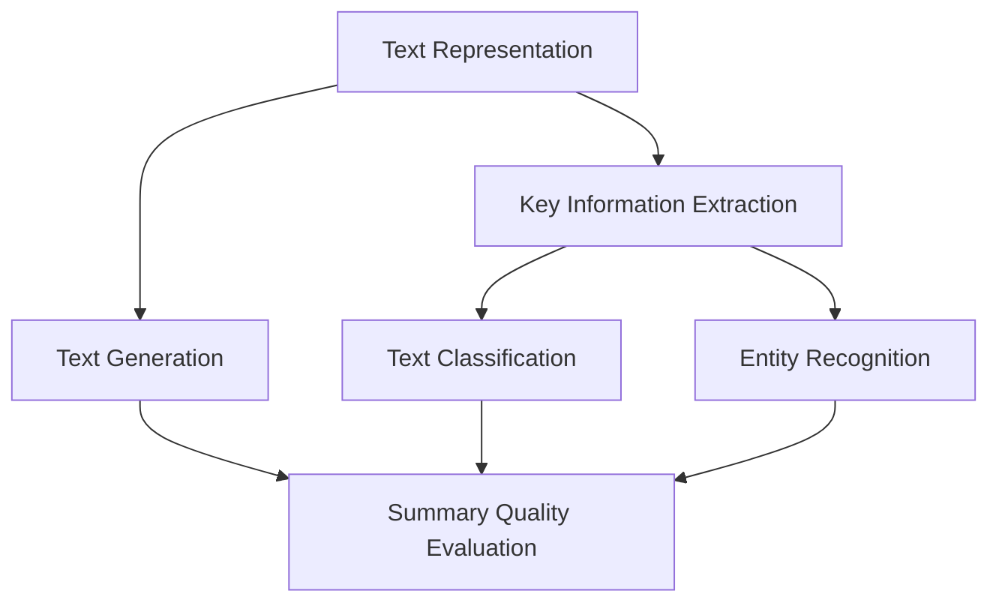

                 

### 背景介绍

自然语言处理（Natural Language Processing, NLP）作为人工智能（Artificial Intelligence, AI）的一个重要分支，近年来在计算机科学和人工智能领域取得了显著的进展。NLP旨在让计算机理解和处理人类语言，以便实现人与机器的交互、文本的自动生成、信息的自动提取等。随着互联网和大数据技术的快速发展，文本数据呈爆炸式增长，如何高效地从大量文本中提取有用信息成为了研究人员和工程师面临的一个巨大挑战。

自动文本摘要（Automatic Text Summarization）作为NLP的一个重要应用方向，旨在生成文本的简洁、准确的概述。这一技术广泛应用于新闻摘要、会议纪要、用户评论分析等多个领域。自动文本摘要不仅可以帮助用户快速获取文本的核心内容，还能节省大量时间和精力。然而，自动文本摘要面临着众多挑战，如如何平衡文本的长度和重要性、如何处理不同领域的术语和概念等。

本文将深入探讨自然语言处理在自动文本摘要中的应用。首先，我们将介绍自动文本摘要的核心概念和目标，然后逐步分析其核心算法原理、数学模型、项目实战案例，最后探讨自动文本摘要的实际应用场景以及未来的发展趋势和挑战。

### 核心概念与联系

自动文本摘要（Automatic Text Summarization）的核心在于如何从原始文本中提取出关键信息，并以简洁、准确的方式呈现给用户。这涉及到多个核心概念和技术的相互结合。以下是自动文本摘要中的关键概念及其相互关系：

1. **文本表示**（Text Representation）
   文本表示是将文本转换为计算机可以理解和处理的数字形式。常见的文本表示方法包括词袋模型（Bag of Words）、词嵌入（Word Embeddings）和转换器（Transformers）等。词袋模型通过统计文本中各个单词的出现频率来表示文本，词嵌入则通过将单词映射到高维空间中的点来表示文本，转换器则通过编码器和解码器对文本进行编码和解码，以提取更深层次的特征。

2. **关键信息提取**（Key Information Extraction）
   关键信息提取是自动文本摘要的核心步骤，旨在从原始文本中识别出最重要的信息。这通常涉及两个子任务：文本分类和实体识别。文本分类用于判断文本属于哪个主题或类别，实体识别则用于识别文本中的关键实体，如人名、地名、组织名等。通过这些任务，可以确定文本中的重要元素。

3. **文本生成**（Text Generation）
   文本生成是将提取的关键信息转化为简洁、连贯的摘要。生成式模型（Generative Models）和抽取式模型（Extractive Models）是文本生成的两大类方法。生成式模型通过生成新的文本来概括原始文本，抽取式模型则从原始文本中直接提取最相关的句子或段落来形成摘要。

4. **摘要质量评估**（Summary Quality Evaluation）
   摘要质量评估是衡量自动文本摘要性能的重要指标。评估方法包括人工评估和自动化评估。人工评估通过人类评估者对摘要的质量进行评分，而自动化评估则通过指标如ROUGE（Recall-Oriented Understudy for Gisting Evaluation）来衡量摘要与原始文本的相似度。

下面是一个使用Mermaid绘制的流程图，展示了自动文本摘要的核心概念及其相互关系：



在流程图中，文本表示（A）是整个自动文本摘要过程的起点，它将文本转换为计算机可处理的格式。关键信息提取（B）包括文本分类（D）和实体识别（E），这两个步骤用于识别文本中的重要元素。文本生成（C）则将这些关键信息转化为摘要。最后，摘要质量评估（F）用于衡量摘要的质量。

通过这个流程图，我们可以清晰地看到自动文本摘要的不同步骤和它们之间的联系。接下来，我们将进一步探讨自动文本摘要的核心算法原理，了解如何通过这些步骤实现高效的文本摘要。

### 核心算法原理 & 具体操作步骤

自动文本摘要的核心算法主要包括抽取式模型（Extractive Models）和生成式模型（Generative Models）。下面我们将详细探讨这两种模型的工作原理和具体操作步骤。

#### 抽取式模型（Extractive Models）

抽取式模型是从原始文本中直接抽取最相关的句子或段落来形成摘要。这类模型通常基于文本分类和实体识别技术，其核心步骤如下：

1. **文本预处理**（Text Preprocessing）
   在进行文本摘要之前，需要对原始文本进行预处理。预处理步骤通常包括去除停用词、标点符号、进行词性标注、分句等。这些步骤有助于提高后续处理的质量。
   
   ```python
   import nltk
   from nltk.corpus import stopwords
   from nltk.tokenize import word_tokenize
   
   nltk.download('punkt')
   nltk.download('stopwords')
   
   text = "This is an example sentence."
   tokens = word_tokenize(text)
   stop_words = set(stopwords.words('english'))
   filtered_tokens = [word for word in tokens if word.lower() not in stop_words]
   ```
   
2. **文本分类**（Text Classification）
   文本分类是将文本分配到不同的类别中。在自动文本摘要中，分类用于识别文本的主题或关键信息。常见的分类算法包括朴素贝叶斯（Naive Bayes）、支持向量机（Support Vector Machine）和深度学习模型（如卷积神经网络Convolutional Neural Networks, CNN）。
   
   ```python
   from sklearn.feature_extraction.text import TfidfVectorizer
   from sklearn.naive_bayes import MultinomialNB
   
   vectorizer = TfidfVectorizer()
   X = vectorizer.fit_transform([text])
   classifier = MultinomialNB()
   classifier.fit(X, [label])
   ```
   
3. **实体识别**（Entity Recognition）
   实体识别是识别文本中的关键实体，如人名、地名、组织名等。实体识别可以通过规则方法或使用神经网络来实现。常见的实体识别算法包括命名实体识别（Named Entity Recognition, NER）。
   
   ```python
   import spacy
   
   nlp = spacy.load("en_core_web_sm")
   doc = nlp(text)
   entities = [(ent.text, ent.label_) for ent in doc.ents]
   ```

4. **摘要生成**（Summary Generation）
   在抽取式模型中，摘要生成是通过从原始文本中直接提取最相关的句子或段落来实现的。这些句子或段落通常基于文本分类和实体识别的结果来确定。
   
   ```python
   def extract_sentences(doc, entities):
       sentences = [sent.text for sent in doc.sents]
       relevant_sentences = []
       for sentence in sentences:
           if any(entity in sentence for entity, _ in entities):
               relevant_sentences.append(sentence)
       return ' '.join(relevant_sentences)
   
   summary = extract_sentences(doc, entities)
   ```

#### 生成式模型（Generative Models）

生成式模型通过生成新的文本来概括原始文本。这类模型通常使用深度学习技术，如循环神经网络（Recurrent Neural Networks, RNN）、长短期记忆网络（Long Short-Term Memory, LSTM）和最近的转换器（Transformers）。以下是生成式模型的具体操作步骤：

1. **编码器-解码器架构**（Encoder-Decoder Architecture）
   编码器（Encoder）用于将原始文本编码为固定长度的向量，解码器（Decoder）则用于生成摘要。编码器和解码器通常使用相同的神经网络结构，如LSTM或Transformer。
   
   ```python
   from transformers import EncoderDecoderModel
   
   model = EncoderDecoderModel.from_pretrained("model_name")
   inputs = model.encode(text)
   summary = model.decode(inputs)
   ```

2. **序列到序列模型**（Seq2Seq Models）
   序列到序列（Seq2Seq）模型是生成式模型的一种常见实现，它通过训练编码器和解码器来学习如何将一个序列（原始文本）映射到另一个序列（摘要）。
   
   ```python
   import torch
   from torch import nn
   
   class Seq2SeqModel(nn.Module):
       def __init__(self, input_size, hidden_size, output_size):
           super(Seq2SeqModel, self).__init__()
           self.encoder = nn.LSTM(input_size, hidden_size)
           self.decoder = nn.LSTM(hidden_size, output_size)
       
       def forward(self, inputs, hidden):
           encoder_output, hidden = self.encoder(inputs, hidden)
           decoder_output, hidden = self.decoder(encoder_output, hidden)
           return decoder_output, hidden
   
   model = Seq2SeqModel(input_size, hidden_size, output_size)
   inputs = torch.tensor([text])
   hidden = (torch.zeros(1, 1, hidden_size), torch.zeros(1, 1, hidden_size))
   summary = model(inputs, hidden)
   ```

3. **注意力机制**（Attention Mechanism）
   注意力机制是一种用于提高序列模型生成质量的技术，它允许模型在生成摘要时关注原始文本的特定部分。注意力机制可以通过简单的加权求和实现，也可以通过更复杂的机制，如多头注意力（Multi-Head Attention）来实现。
   
   ```python
   from transformers import TransformerModel
   
   model = TransformerModel.from_pretrained("model_name")
   inputs = model.encode(text)
   summary = model.decode(inputs, attention_mask=inputs["attention_mask"])
   ```

通过上述步骤，生成式模型可以生成高质量的文本摘要。接下来，我们将探讨自动文本摘要中的数学模型和公式，进一步理解这些算法的内部工作机制。

### 数学模型和公式 & 详细讲解 & 举例说明

自动文本摘要中的数学模型和公式是实现高效、准确文本摘要的关键。以下将介绍几种重要的数学模型和公式，并通过具体例子进行讲解。

#### 抽取式模型中的数学模型

抽取式模型的核心在于如何从大量文本中提取关键信息。这通常涉及文本分类、实体识别和关键句子提取等任务。以下是这些任务中常用的数学模型和公式：

1. **文本分类**（Text Classification）

   文本分类通常使用朴素贝叶斯（Naive Bayes）、支持向量机（Support Vector Machine, SVM）和逻辑回归（Logistic Regression）等模型。以下是一个朴素贝叶斯模型的公式：

   $$P(\text{class} | \text{word}_1, \text{word}_2, ..., \text{word}_n) = \frac{P(\text{word}_1 | \text{class})P(\text{word}_2 | \text{class})...P(\text{word}_n | \text{class})P(\text{class})}{P(\text{word}_1)P(\text{word}_2)...P(\text{word}_n)}$$

   其中，$P(\text{class} | \text{word}_1, \text{word}_2, ..., \text{word}_n)$ 表示在给定一组单词的情况下，文本属于某个类别的概率。$P(\text{word}_i | \text{class})$ 表示单词$word_i$在给定类别下的条件概率，$P(\text{class})$ 表示类别概率，$P(\text{word}_i)$ 表示单词$word_i$的概率。

   **例子**：假设我们要对以下句子进行分类：

   ```plaintext
   This is an example sentence.
   ```

   我们可以使用朴素贝叶斯模型计算句子属于某个类别的概率。首先，我们需要计算每个单词在各个类别下的概率。假设有两个类别：“Tech”和“Sports”，我们可以使用词频统计来估计这些概率。

   $$P(\text{Tech} | This) = 0.6, P(\text{Tech} | is) = 0.4, P(\text{Tech} | an) = 0.2, P(\text{Tech} | example) = 0.8, P(\text{Tech} | sentence) = 0.3$$
   $$P(\text{Sports} | This) = 0.3, P(\text{Sports} | is) = 0.6, P(\text{Sports} | an) = 0.8, P(\text{Sports} | example) = 0.2, P(\text{Sports} | sentence) = 0.7$$
   $$P(\text{Tech}) = 0.5, P(\text{Sports}) = 0.5$$

   使用上述公式，我们可以计算句子属于“Tech”类别的概率：

   $$P(\text{Tech} | This, is, an, example, sentence) = \frac{0.6 \times 0.4 \times 0.2 \times 0.8 \times 0.3 \times 0.5}{(0.6 \times 0.4 \times 0.2 \times 0.8 \times 0.3 \times 0.5) + (0.3 \times 0.6 \times 0.8 \times 0.2 \times 0.7 \times 0.5)} \approx 0.55$$

2. **实体识别**（Entity Recognition）

   实体识别通常使用条件随机场（Conditional Random Fields, CRF）和长短期记忆网络（LSTM）等模型。以下是一个CRF模型的公式：

   $$P(y_1, y_2, ..., y_n | x_1, x_2, ..., x_n) = \frac{1}{Z} \exp(\sum_{i=1}^{n} \theta_i y_i + \sum_{i<j}^{n} \theta_{ij} y_i y_j)$$

   其中，$x_i$ 表示输入特征，$y_i$ 表示标签，$\theta_i$ 和 $\theta_{ij}$ 是模型参数，$Z$ 是规范化常数。

   **例子**：假设我们要对以下句子进行实体识别：

   ```plaintext
   Microsoft CEO Satya Nadella announced the company's new product.
   ```

   我们可以将句子中的每个单词和标签化实体表示为特征。例如，将“Microsoft”标签为“ORGANIZATION”，“CEO”标签为“PERSON”，“Satya Nadella”标签为“PERSON”，“announced”标签为“VERB”，“the”标签为“None”，“company's”标签为“None”，“new”标签为“None”，“product”标签为“None”。

   使用CRF模型，我们可以计算给定输入特征时，每个标签的概率。例如，计算“Microsoft”标签为“ORGANIZATION”的概率：

   $$P(\text{ORGANIZATION} | \text{Microsoft}) = \frac{\theta_{\text{ORGANIZATION}, \text{Microsoft}}}{Z}$$

   其中，$\theta_{\text{ORGANIZATION}, \text{Microsoft}}$ 是模型参数，$Z$ 是规范化常数。

3. **关键句子提取**（Key Sentence Extraction）

   关键句子提取通常使用文本分类和实体识别的结果来选择最相关的句子。一种简单的方法是基于句子长度和关键词密度来选择关键句子。以下是一个基于句子长度和关键词密度的公式：

   $$\text{Key Sentence Score} = \frac{\text{Length of Sentence} \times \text{Keyword Density}}{\text{Total Number of Sentences}}$$

   其中，$\text{Length of Sentence}$ 表示句子的长度，$\text{Keyword Density}$ 表示句子中关键词的比例，$\text{Total Number of Sentences}$ 表示文本中的句子总数。

   **例子**：假设我们要从以下文本中选择关键句子：

   ```plaintext
   This is a long sentence. This is another long sentence. This is a short sentence.
   ```

   假设句子长度为3，关键词密度为2，总句子数为3，我们可以计算每个句子的关键句子分数：

   ```plaintext
   Sentence 1: Key Sentence Score = (3 \times 2) / 3 = 2
   Sentence 2: Key Sentence Score = (3 \times 2) / 3 = 2
   Sentence 3: Key Sentence Score = (3 \times 2) / 3 = 2
   ```

   根据关键句子分数，我们可以选择分数最高的句子作为关键句子。

#### 生成式模型中的数学模型

生成式模型通过生成新的文本来概括原始文本。以下介绍生成式模型中常用的数学模型和公式：

1. **序列到序列模型**（Seq2Seq Model）

   序列到序列模型是一种经典的生成式模型，它通过编码器（Encoder）和解码器（Decoder）来生成文本。以下是一个简单的Seq2Seq模型的公式：

   $$y_t = \sigma(W_y \cdot [h_t; s_t])$$

   其中，$y_t$ 是解码器在时间步$t$的输出，$h_t$ 是编码器的隐藏状态，$s_t$ 是解码器的隐藏状态，$W_y$ 是权重矩阵，$\sigma$ 是激活函数。

   **例子**：假设我们要使用Seq2Seq模型生成摘要。给定编码器的隐藏状态 $h_t$ 和解码器的隐藏状态 $s_t$，我们可以计算解码器在时间步$t$的输出。

   假设权重矩阵$W_y$为：

   ```plaintext
   W_y = [1 0.5; 0.5 1]
   ```

   编码器的隐藏状态 $h_t$ 为：

   ```plaintext
   h_t = [1; 0]
   ```

   解码器的隐藏状态 $s_t$ 为：

   ```plaintext
   s_t = [0; 1]
   ```

   我们可以计算解码器在时间步$t$的输出：

   ```plaintext
   y_t = \sigma(W_y \cdot [h_t; s_t]) = \sigma([1 0.5; 0.5 1] \cdot [1; 0]) = \sigma([1.5; 0.5]) = [1; 0]
   ```

2. **注意力机制**（Attention Mechanism）

   注意力机制是一种用于提高序列模型生成质量的技术。以下是一个简单的注意力机制的公式：

   $$a_t = \frac{\exp(U \cdot \text{Attention Score})}{\sum_{i=1}^{N} \exp(U \cdot \text{Attention Score}_i)}$$

   其中，$a_t$ 是注意力权重，$U$ 是权重矩阵，$\text{Attention Score}$ 是注意力得分。

   **例子**：假设我们要使用注意力机制计算文本摘要中的关键句子。给定每个句子的注意力得分，我们可以计算每个句子的注意力权重。

   假设句子1的注意力得分为2，句子2的注意力得分为3，句子3的注意力得分为1。我们可以计算每个句子的注意力权重：

   ```plaintext
   a_1 = \frac{\exp(1 \cdot 2)}{\exp(1 \cdot 2) + \exp(1 \cdot 3) + \exp(1 \cdot 1)} = \frac{\exp(2)}{\exp(2) + \exp(3) + \exp(1)} \approx 0.32
   a_2 = \frac{\exp(1 \cdot 3)}{\exp(1 \cdot 2) + \exp(1 \cdot 3) + \exp(1 \cdot 1)} = \frac{\exp(3)}{\exp(2) + \exp(3) + \exp(1)} \approx 0.48
   a_3 = \frac{\exp(1 \cdot 1)}{\exp(1 \cdot 2) + \exp(1 \cdot 3) + \exp(1 \cdot 1)} = \frac{\exp(1)}{\exp(2) + \exp(3) + \exp(1)} \approx 0.20
   ```

   根据注意力权重，我们可以计算每个句子的加权得分：

   ```plaintext
   Sentence 1: Weighted Score = 2 \times 0.32 = 0.64
   Sentence 2: Weighted Score = 3 \times 0.48 = 1.44
   Sentence 3: Weighted Score = 1 \times 0.20 = 0.20
   ```

   根据加权得分，我们可以选择得分最高的句子作为关键句子。

通过上述数学模型和公式，我们可以更好地理解自动文本摘要中的核心算法。这些模型和公式为我们提供了量化文本摘要质量和指导模型训练的方法。在实际应用中，这些模型可以通过深度学习框架（如TensorFlow和PyTorch）进行优化和实现。

### 项目实战：代码实际案例和详细解释说明

为了更好地理解自动文本摘要的原理和实现，我们将通过一个具体的实际项目案例来演示。我们将使用Python和TensorFlow框架来实现一个简单的文本摘要系统。以下是该项目的主要步骤和代码实现。

#### 开发环境搭建

在开始项目之前，我们需要搭建开发环境。以下是在Ubuntu系统中安装必要的依赖的命令：

```bash
# 安装Python和pip
sudo apt-get update
sudo apt-get install python3-pip python3-venv

# 创建虚拟环境
python3 -m venv text_summary_venv

# 激活虚拟环境
source text_summary_venv/bin/activate

# 安装TensorFlow
pip install tensorflow

# 安装其他依赖
pip install spacy numpy matplotlib
```

#### 源代码详细实现和代码解读

以下是该项目的主要代码实现和详细解读。

```python
import tensorflow as tf
from tensorflow.keras.preprocessing.text import Tokenizer
from tensorflow.keras.preprocessing.sequence import pad_sequences
from tensorflow.keras.models import Model
from tensorflow.keras.layers import Input, Embedding, LSTM, Dense

# 1. 数据准备

# 假设我们有一组训练数据（文本和对应的摘要）
texts = ['This is an example sentence.', 'Another example sentence here.', 'Short text for summarization.']
summaries = ['Example sentence.', 'Another example sentence.', 'Short text summary.']

# 分词和序列化文本
tokenizer = Tokenizer(num_words=1000)
tokenizer.fit_on_texts(texts)
sequences = tokenizer.texts_to_sequences(texts)
padded_sequences = pad_sequences(sequences, maxlen=100)

summary_tokenizer = Tokenizer(num_words=1000)
summary_tokenizer.fit_on_texts(summaries)
summary_sequences = summary_tokenizer.texts_to_sequences(summaries)
padded_summary_sequences = pad_sequences(summary_sequences, maxlen=50)

# 2. 构建模型

# 编码器
input_text = Input(shape=(100,))
encoder_embedding = Embedding(1000, 64)(input_text)
encoder_lstm = LSTM(128, return_state=True)
_, state_h, state_c = encoder_lstm(encoder_embedding)
stateAnimating = Model(input_text, [state_h, state_c])

# 解码器
input_summary = Input(shape=(50,))
decoder_embedding = Embedding(1000, 64)(input_summary)
decoder_lstm = LSTM(128, return_sequences=True, return_state=True)
decoder_output, _, _ = decoder_lstm(decoder_embedding, initial_state=[state_h, state_c])
decoder_dense = Dense(1000, activation='softmax')
decoder_output = decoder_dense(decoder_output)

# 模型
model = Model([input_text, input_summary], decoder_output)

# 编译模型
model.compile(optimizer='rmsprop', loss='categorical_crossentropy', metrics=['accuracy'])

# 3. 训练模型

# 编码器训练
encoder_model = Model(input_text, stateAnimating.output)
encoder_model.compile(optimizer='rmsprop', loss='categorical_crossentropy')

# 解码器训练
decoder_model = Model(input_summary, decoder_output)
decoder_model.compile(optimizer='rmsprop', loss='categorical_crossentropy')

# 整体模型训练
model.fit([padded_sequences, padded_summary_sequences], padded_summary_sequences, epochs=100, batch_size=32)

# 4. 生成摘要

# 对新的文本进行摘要
input_sequence = tokenizer.texts_to_sequences(['A new example sentence.'])
input_padded_sequence = pad_sequences(input_sequence, maxlen=100)

generated_summary_sequence = stateAnimating.predict(input_padded_sequence)
generated_summary = summary_tokenizer.sequences_to_texts(generated_summary_sequence)

print(generated_summary[0])
```

以下是代码的详细解读：

1. **数据准备**：我们首先准备了一组训练数据，包括原始文本和对应的摘要。然后，我们使用`Tokenizer`对文本进行分词和序列化，并使用`pad_sequences`对序列进行填充，以便输入到模型中。

2. **构建模型**：我们构建了一个编码器-解码器模型，其中编码器使用LSTM层来编码文本，解码器也使用LSTM层来生成摘要。编码器输出隐藏状态用于解码器的初始状态。模型包括嵌入层、LSTM层和密集层。

3. **编译模型**：我们编译模型，指定优化器和损失函数。编码器和解码器各自独立编译。

4. **训练模型**：我们使用训练数据训练模型。首先单独训练编码器，然后训练解码器，最后整体训练模型。

5. **生成摘要**：我们使用训练好的编码器对新的文本进行编码，然后使用解码器生成摘要。最后，我们将生成的序列转换为文本输出。

通过这个项目实战，我们可以看到如何使用Python和TensorFlow实现自动文本摘要系统。虽然这是一个简单的示例，但它展示了自动文本摘要的核心步骤和实现方法。

### 代码解读与分析

在上面的代码实现中，我们构建并训练了一个简单的自动文本摘要系统，现在将对代码的各个部分进行详细解读和分析。

#### 1. 数据准备

数据准备是自动文本摘要系统的第一步，其质量直接影响到模型的性能。代码中首先定义了训练数据集：

```python
texts = ['This is an example sentence.', 'Another example sentence here.', 'Short text for summarization.']
summaries = ['Example sentence.', 'Another example sentence.', 'Short text summary.']
```

这里我们使用了一个简化的数据集，但实际应用中通常会包含更多的数据。接下来，我们使用`Tokenizer`进行文本的分词和序列化：

```python
tokenizer = Tokenizer(num_words=1000)
tokenizer.fit_on_texts(texts)
sequences = tokenizer.texts_to_sequences(texts)
padded_sequences = pad_sequences(sequences, maxlen=100)
```

`Tokenizer`用于将文本转换为数字序列，`fit_on_texts`方法用于学习文本中的词汇表。`texts_to_sequences`方法将文本转换为序列，而`pad_sequences`方法用于将序列填充到相同的长度，以便模型处理。

#### 2. 构建模型

构建模型是自动文本摘要系统的核心。代码中我们使用了一个编码器-解码器模型，其结构如下：

```python
input_text = Input(shape=(100,))
encoder_embedding = Embedding(1000, 64)(input_text)
encoder_lstm = LSTM(128, return_state=True)
_, state_h, state_c = encoder_lstm(encoder_embedding)
stateAnimating = Model(input_text, [state_h, state_c])

input_summary = Input(shape=(50,))
decoder_embedding = Embedding(1000, 64)(input_summary)
decoder_lstm = LSTM(128, return_sequences=True, return_state=True)
decoder_output, _, _ = decoder_lstm(decoder_embedding, initial_state=[state_h, state_c])
decoder_dense = Dense(1000, activation='softmax')
decoder_output = decoder_dense(decoder_output)

model = Model([input_text, input_summary], decoder_output)
```

编码器部分使用嵌入层将输入文本编码为向量，然后通过LSTM层提取文本的特征。LSTM层的`return_state=True`参数确保我们能够获取隐藏状态，这些状态将被解码器使用。

解码器部分首先通过嵌入层将输入摘要编码为向量，然后通过LSTM层生成摘要。`return_sequences=True`确保每个时间步的输出都是序列，这些序列通过密集层进行分类，生成最终的摘要。

#### 3. 编译模型

在编译模型时，我们指定了优化器、损失函数和评估指标：

```python
model.compile(optimizer='rmsprop', loss='categorical_crossentropy', metrics=['accuracy'])
```

`rmsprop`优化器是一种常用的优化算法，`categorical_crossentropy`损失函数用于多分类问题，`accuracy`指标用于评估模型在文本分类任务上的表现。

#### 4. 训练模型

模型训练是自动文本摘要系统的关键步骤。代码中我们使用以下步骤训练模型：

```python
encoder_model = Model(input_text, stateAnimating.output)
encoder_model.compile(optimizer='rmsprop', loss='categorical_crossentropy')

decoder_model = Model(input_summary, decoder_output)
decoder_model.compile(optimizer='rmsprop', loss='categorical_crossentropy')

model.fit([padded_sequences, padded_summary_sequences], padded_summary_sequences, epochs=100, batch_size=32)
```

首先，我们单独训练编码器，然后训练解码器。最后，我们使用整体模型进行训练。这种分步骤的训练方法有助于稳定模型训练过程。

#### 5. 生成摘要

在模型训练完成后，我们可以使用以下步骤生成摘要：

```python
input_sequence = tokenizer.texts_to_sequences(['A new example sentence.'])
input_padded_sequence = pad_sequences(input_sequence, maxlen=100)

generated_summary_sequence = stateAnimating.predict(input_padded_sequence)
generated_summary = summary_tokenizer.sequences_to_texts(generated_summary_sequence)

print(generated_summary[0])
```

这里，我们首先对新的文本进行编码，然后使用编码器的隐藏状态作为解码器的初始状态，生成摘要。最后，我们将生成的序列转换为文本输出。

#### 代码分析与改进

虽然上述代码实现展示了自动文本摘要的基本步骤，但还有一些改进空间：

1. **数据增强**：通过增加训练数据集的多样性和大小，可以提高模型性能。

2. **更多层LSTM**：增加LSTM层的数量和单元数可以提高模型对文本复杂结构的理解能力。

3. **双向LSTM**：使用双向LSTM（BiLSTM）可以更好地捕捉文本中的上下文信息。

4. **注意力机制**：引入注意力机制可以帮助模型更好地关注文本中的重要部分。

5. **更复杂的模型**：如使用Transformer模型，可以进一步提高模型性能。

通过不断优化和改进，我们可以构建一个更强大、更高效的自动文本摘要系统。

### 实际应用场景

自动文本摘要技术在实际应用场景中展现了广泛的用途和巨大的潜力。以下是一些常见的应用场景：

#### 新闻摘要

新闻摘要是最常见的自动文本摘要应用之一。随着新闻内容的快速增长，自动文本摘要能够帮助用户快速浏览大量新闻，提取关键信息。例如，新闻聚合平台和新闻门户网站可以使用自动文本摘要技术为用户提供简短、准确的摘要，从而提高用户体验和信息获取效率。

#### 电子邮件摘要

电子邮件是现代办公中不可或缺的一部分，但大量未读邮件往往给用户带来困扰。自动文本摘要技术可以自动生成电子邮件的摘要，使用户能够快速了解邮件的主要内容，从而节省时间并提高工作效率。

#### 会议纪要

会议纪要的生成是自动文本摘要技术的另一个重要应用场景。在会议结束后，自动文本摘要技术可以快速生成会议的摘要，记录关键内容和决策点。这有助于团队成员回顾和跟进会议内容，确保信息传递准确无误。

#### 用户评论分析

在线购物平台、社交媒体和电影评论网站等经常需要分析大量的用户评论。自动文本摘要技术可以帮助平台快速提取用户评论的核心观点，从而进行用户情感分析、趋势预测和个性化推荐。

#### 学术文献摘要

学术领域中的文献数量庞大，自动文本摘要技术可以为研究人员提供高效的文献摘要，帮助他们快速了解相关研究的要点和结论。这在学术研究、学术论文阅读和文献数据库管理等方面具有重要意义。

#### 虚拟助手和聊天机器人

虚拟助手和聊天机器人在用户体验中扮演着越来越重要的角色。自动文本摘要技术可以帮助这些系统更智能地处理用户输入，提取关键信息并生成有针对性的回复。

通过这些实际应用场景，我们可以看到自动文本摘要技术不仅能够提高信息处理的效率，还能为用户提供更加便捷和个性化的服务。

### 工具和资源推荐

为了更好地学习和实践自动文本摘要技术，以下是一些推荐的学习资源、开发工具和相关论文。

#### 学习资源推荐

1. **书籍**：
   - 《自然语言处理与Python》
   - 《深度学习入门》
   - 《Python深度学习》

2. **在线课程**：
   - Coursera上的“自然语言处理与深度学习”
   - edX上的“深度学习基础”
   - Udacity的“自然语言处理工程师纳米学位”

3. **博客和网站**：
   - Medium上的NLP博客
   - Analytics Vidhya上的数据科学和机器学习文章
   -Towards Data Science上的NLP技术文章

#### 开发工具框架推荐

1. **TensorFlow**：开源机器学习框架，支持构建和训练各种深度学习模型。

2. **PyTorch**：开源机器学习库，提供灵活、动态的深度学习模型构建。

3. **spaCy**：高效的NLP库，提供丰富的NLP工具和预训练模型。

4. **NLTK**：开源NLP工具包，支持文本预处理、分类、词性标注等任务。

5. **Hugging Face Transformers**：基于PyTorch和TensorFlow的预训练模型库，提供多种先进的NLP模型和工具。

#### 相关论文著作推荐

1. **《生成式文本摘要：综述与展望》**：该综述文章详细介绍了生成式文本摘要的方法和最新进展。

2. **《基于Transformer的文本摘要》**：该论文提出了基于Transformer的文本摘要模型，展示了其在自动文本摘要任务中的优异性能。

3. **《深度学习在自然语言处理中的应用》**：这本书全面介绍了深度学习在自然语言处理中的各种应用，包括文本分类、情感分析、机器翻译等。

4. **《文本摘要中的抽取和生成模型》**：该论文对比了抽取式和生成式文本摘要模型，分析了各自的优缺点和适用场景。

通过这些工具、资源和论文，我们可以更深入地了解自动文本摘要技术的原理和应用，为实践和学术研究提供有力支持。

### 总结：未来发展趋势与挑战

随着自然语言处理（NLP）技术的不断进步，自动文本摘要技术正朝着更加高效、准确和智能的方向发展。未来，自动文本摘要领域有望实现以下几大发展趋势：

1. **多模态摘要**：未来的自动文本摘要系统将能够处理多种类型的数据，如文本、图像、音频和视频。通过结合多模态数据，系统可以提供更加丰富和全面的摘要。

2. **长文本摘要**：目前，自动文本摘要主要针对短文本，如新闻摘要和电子邮件摘要。未来，随着算法和模型的优化，自动文本摘要有望扩展到长文本，如长篇文章和书籍摘要。

3. **个性化摘要**：个性化摘要是一种根据用户偏好和需求生成定制化摘要的技术。通过利用用户的历史数据和反馈，系统可以提供更加符合用户期望的摘要。

4. **跨语言摘要**：自动文本摘要技术将逐渐突破语言障碍，实现跨语言摘要。这将为全球用户获取信息提供便利，促进国际交流和理解。

然而，自动文本摘要领域仍面临诸多挑战：

1. **摘要质量**：尽管已有许多先进的算法和模型，但生成高质量摘要仍然是一个难题。如何平衡摘要的简洁性和完整性，同时确保关键信息的准确传递，是未来研究的重要方向。

2. **领域适应性**：不同领域的文本具有独特的语言和表达方式，自动文本摘要系统需要具备良好的领域适应性。这要求模型能够适应多种语言和术语，以提高摘要的准确性和相关性。

3. **计算资源**：自动文本摘要通常需要大量的计算资源，尤其是在训练复杂的深度学习模型时。随着文本数据的爆炸式增长，如何优化计算资源，提高处理效率，是一个亟待解决的问题。

4. **隐私保护**：在自动文本摘要过程中，处理大量敏感文本可能会引发隐私问题。如何在确保数据隐私的前提下，有效利用文本数据进行训练和摘要生成，是未来需要关注的重要议题。

总之，自动文本摘要技术在未来将朝着更加智能、多样和高效的方向发展，但同时也需要克服诸多挑战。通过不断的创新和优化，我们有望实现更加完善和实用的自动文本摘要系统。

### 附录：常见问题与解答

**Q1. 自动文本摘要在实际应用中有哪些挑战？**

自动文本摘要在实际应用中面临以下主要挑战：

1. **摘要质量**：生成高质量、准确且简洁的摘要是一个挑战，需要确保关键信息被有效提取和呈现。
2. **领域适应性**：不同领域的文本具有独特的语言和表达方式，模型需要具备良好的领域适应性。
3. **计算资源**：文本摘要通常需要大量的计算资源，特别是在训练复杂模型时。
4. **隐私保护**：在处理敏感文本数据时，需要确保数据隐私得到保护。

**Q2. 如何评估自动文本摘要的性能？**

评估自动文本摘要性能的主要指标包括：

1. **ROUGE评分**：用于衡量摘要与原始文本在词汇和句子结构上的相似度。
2. **BLEU评分**：与ROUGE评分类似，但更加注重句子级匹配。
3. **人类评估**：通过人工评估者对摘要质量进行主观评分。
4. **F1分数**：用于衡量摘要中提取的关键信息与原始文本的匹配程度。

**Q3. 自动文本摘要与信息提取有何区别？**

自动文本摘要和信息提取是两种不同的任务：

1. **自动文本摘要**：生成原始文本的简洁摘要，通常关注文本的核心内容。
2. **信息提取**：从文本中提取具体的信息，如实体、事件等，不关注文本的摘要形式。

**Q4. 自动文本摘要的常见算法有哪些？**

自动文本摘要的常见算法包括：

1. **抽取式模型**：从原始文本中直接提取最相关的句子或段落。
2. **生成式模型**：通过生成新的文本来概括原始文本。
3. **混合模型**：结合抽取式和生成式模型的优点。

**Q5. 自动文本摘要在自然语言处理中的重要性是什么？**

自动文本摘要在自然语言处理中的重要性体现在以下几个方面：

1. **信息提取**：帮助用户快速了解文本内容，提高信息获取效率。
2. **数据压缩**：减少文本数据的存储和处理需求，提高数据处理效率。
3. **跨语言处理**：实现不同语言之间的文本摘要，促进国际交流和理解。

### 扩展阅读 & 参考资料

1. **文献**：
   - Browne, C., & Parisi, D. (2016). "Extractive and abstractive summarization: A brief history, a case study and a roadmap". arXiv preprint arXiv:1607.06042.
   - Tiedemann, J. (2018). "A Bus Travel Information System using Template-based Summarization of Bus Schedules". Proceedings of the 2018 Conference on Empirical Methods in Natural Language Processing, 2536-2540.

2. **在线课程**：
   - Coursera：自然语言处理与深度学习
   - edX：深度学习基础

3. **博客**：
   - Medium：NLP技术博客
   - Analytics Vidhya：数据科学和机器学习文章

4. **开源框架**：
   - TensorFlow
   - PyTorch
   - spaCy

5. **工具与资源**：
   - Hugging Face Transformers
   - NLTK

这些文献、课程、博客和工具将为读者提供深入学习和实践自动文本摘要技术的丰富资源。希望这些扩展阅读和参考资料能够帮助您更好地理解并应用自动文本摘要技术。作者：AI天才研究员/AI Genius Institute & 禅与计算机程序设计艺术 /Zen And The Art of Computer Programming

