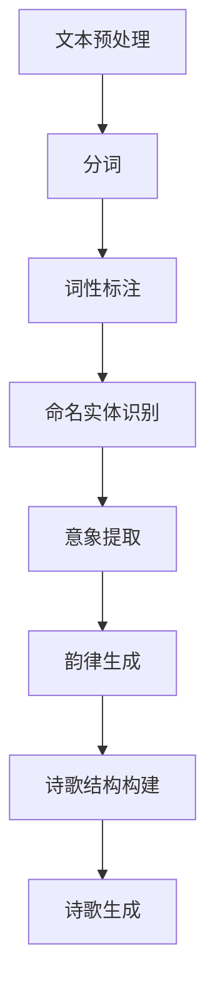

                 

# 《自然语言处理在自动诗歌生成中的应用》

> **关键词：** 自然语言处理、自动诗歌生成、机器学习、文本生成、深度学习

> **摘要：** 本文介绍了自然语言处理在自动诗歌生成中的应用，从背景介绍到核心算法原理，再到数学模型和项目实战，详细探讨了如何利用自然语言处理技术实现自动诗歌生成的全过程。同时，分析了自动诗歌生成在实际应用场景中的优势，并推荐了相关的工具和资源。

## 1. 背景介绍

自然语言处理（Natural Language Processing，NLP）是计算机科学和人工智能领域的一个重要分支，旨在使计算机能够理解、解释和生成人类语言。随着人工智能技术的不断进步，NLP在文本挖掘、信息检索、机器翻译、情感分析等领域取得了显著成果。

在文学创作领域，自动诗歌生成作为一种具有挑战性的任务，引起了越来越多研究者的关注。自动诗歌生成不仅具有艺术价值，还可以为文学创作提供新的灵感。随着NLP技术的不断发展，自动诗歌生成已经从简单的规则方法逐渐演化为基于深度学习的复杂模型。

本文将探讨自然语言处理在自动诗歌生成中的应用，通过分析核心算法原理、数学模型和项目实战，为读者呈现自动诗歌生成的全过程。

## 2. 核心概念与联系

### 2.1 自然语言处理（NLP）

自然语言处理主要涉及以下核心概念：

- **分词（Tokenization）：** 将文本拆分成单词、句子等基本单位。
- **词性标注（Part-of-Speech Tagging）：** 为文本中的每个单词分配词性，如名词、动词、形容词等。
- **命名实体识别（Named Entity Recognition，NER）：** 识别文本中的命名实体，如人名、地名、组织名等。
- **情感分析（Sentiment Analysis）：** 判断文本中的情感倾向，如正面、负面或中性。

### 2.2 自动诗歌生成

自动诗歌生成的主要目标是利用自然语言处理技术生成具有文学价值和美感的诗歌。为实现这一目标，需要解决以下问题：

- **韵律生成：** 设计合适的韵律模型，使生成的诗歌具有押韵和节奏感。
- **意象提取：** 从文本中提取具有美感的意象，为诗歌创作提供素材。
- **结构构建：** 构建合理的诗歌结构，使生成的诗歌在形式和内容上都具有美感。

### 2.3 Mermaid 流程图

为了更好地理解自动诗歌生成的流程，我们可以使用Mermaid绘制一个简单的流程图：



## 3. 核心算法原理 & 具体操作步骤

### 3.1 文本预处理

文本预处理是自动诗歌生成的第一步，主要包括以下操作：

- **文本清洗：** 删除文本中的无关字符和标点符号，如空格、换行符、特殊字符等。
- **小写转换：** 将文本中的所有字符转换为小写，以降低计算复杂度。

### 3.2 分词

分词是将文本拆分成单词、句子等基本单位的过程。常用的分词算法有：

- **基于词典的分词算法：** 利用现有的词典进行分词，如正向最大匹配法和逆向最大匹配法。
- **基于统计的分词算法：** 利用统计模型进行分词，如基于n-gram模型的方法。

### 3.3 词性标注

词性标注为文本中的每个单词分配词性，常用的词性标注算法有：

- **基于规则的方法：** 利用手工编写的规则进行词性标注。
- **基于统计的方法：** 利用统计模型进行词性标注，如最大熵模型和条件随机场（CRF）。

### 3.4 命名实体识别

命名实体识别是识别文本中的命名实体，如人名、地名、组织名等。常用的命名实体识别算法有：

- **基于规则的方法：** 利用手工编写的规则进行命名实体识别。
- **基于统计的方法：** 利用统计模型进行命名实体识别，如支持向量机（SVM）和条件随机场（CRF）。

### 3.5 意象提取

意象提取是从文本中提取具有美感的意象，为诗歌创作提供素材。常用的意象提取方法有：

- **基于关键词的方法：** 提取与诗歌相关的关键词，如“月亮”、“星辰”、“爱情”等。
- **基于情感分析的方法：** 分析文本中的情感倾向，提取具有美感的意象。

### 3.6 韵律生成

韵律生成是设计合适的韵律模型，使生成的诗歌具有押韵和节奏感。常用的韵律生成方法有：

- **基于规则的方法：** 利用手工编写的规则进行韵律生成。
- **基于深度学习的方法：** 利用深度学习模型进行韵律生成，如循环神经网络（RNN）和长短时记忆网络（LSTM）。

### 3.7 诗歌结构构建

诗歌结构构建是构建合理的诗歌结构，使生成的诗歌在形式和内容上都具有美感。常用的诗歌结构构建方法有：

- **基于模板的方法：** 利用预先设计的诗歌模板进行结构构建。
- **基于优化算法的方法：** 利用优化算法，如遗传算法（GA）和粒子群优化（PSO），进行诗歌结构构建。

### 3.8 诗歌生成

诗歌生成是利用前述步骤生成的素材和模型，生成具有文学价值和美感的诗歌。常用的诗歌生成方法有：

- **基于规则的方法：** 利用手工编写的规则进行诗歌生成。
- **基于深度学习的方法：** 利用深度学习模型进行诗歌生成，如生成对抗网络（GAN）和变分自编码器（VAE）。

## 4. 数学模型和公式 & 详细讲解 & 举例说明

### 4.1 分词算法

分词算法通常基于统计模型，以下是一个基于n-gram模型的方法：

- **n-gram模型：** n-gram模型是将文本拆分成n个单词的序列。给定一个单词序列 \(w_1, w_2, ..., w_n\)，n-gram模型可以表示为：

  $$P(w_1, w_2, ..., w_n) = \frac{C(w_1, w_2, ..., w_n)}{C(w_1, w_2, ..., w_n, w_{n+1})}$$

  其中，\(C(w_1, w_2, ..., w_n)\) 表示单词序列在文本中出现的次数。

- **分词步骤：** 

  1. 计算每个n-gram的概率。
  2. 根据概率最大的n-gram进行分词。

### 4.2 词性标注算法

词性标注算法通常基于条件随机场（CRF）：

- **CRF模型：** CRF是一种基于概率的图模型，可以用于序列标注问题。给定一个单词序列 \(w_1, w_2, ..., w_n\)，CRF模型可以表示为：

  $$P(w_1, w_2, ..., w_n, y_1, y_2, ..., y_n) = \frac{1}{Z} \exp(\sum_{i=1}^{n} \lambda y_i + \sum_{i=1}^{n} \sum_{j=1}^{n} \lambda_{ij} w_i y_j + \sum_{(i, j) \in E} \lambda_{ij})$$

  其中，\(Z\) 表示规范化因子，\(\lambda\) 和 \(\lambda_{ij}\) 表示模型参数。

- **词性标注步骤：** 

  1. 计算每个单词的词性概率。
  2. 根据概率最大的词性进行标注。

### 4.3 命名实体识别算法

命名实体识别算法通常基于支持向量机（SVM）：

- **SVM模型：** SVM是一种基于最大间隔的线性分类模型。给定一个单词序列 \(w_1, w_2, ..., w_n\) 和对应的命名实体标签 \(y_1, y_2, ..., y_n\)，SVM模型可以表示为：

  $$f(w_1, w_2, ..., w_n) = \sum_{i=1}^{n} w_i \phi(w_i) + b$$

  其中，\(\phi(w_i)\) 表示特征映射函数，\(w_i\) 和 \(b\) 分别表示模型参数。

- **命名实体识别步骤：**

  1. 计算每个单词的特征向量。
  2. 利用SVM模型进行分类。

### 4.4 意象提取算法

意象提取算法通常基于情感分析：

- **情感分析模型：** 情感分析模型可以判断文本中的情感倾向。给定一个单词序列 \(w_1, w_2, ..., w_n\)，情感分析模型可以表示为：

  $$P(y|w_1, w_2, ..., w_n) = \frac{\exp(\sum_{i=1}^{n} \lambda y \phi(w_i))}{1 + \exp(\sum_{i=1}^{n} \lambda y \phi(w_i))}$$

  其中，\(y\) 表示情感标签，\(\lambda\) 和 \(\phi(w_i)\) 分别表示模型参数和特征映射函数。

- **意象提取步骤：**

  1. 计算每个单词的情感概率。
  2. 根据情感概率提取具有美感的意象。

### 4.5 韵律生成算法

韵律生成算法通常基于循环神经网络（RNN）：

- **RNN模型：** RNN是一种用于处理序列数据的神经网络。给定一个单词序列 \(w_1, w_2, ..., w_n\)，RNN模型可以表示为：

  $$h_t = \sigma(W_h h_{t-1} + W_x w_t + b_h)$$

  其中，\(h_t\) 和 \(h_{t-1}\) 分别表示当前时刻和前一个时刻的隐藏状态，\(w_t\) 表示当前时刻的单词，\(\sigma\) 表示激活函数，\(W_h\)、\(W_x\) 和 \(b_h\) 分别表示模型参数。

- **韵律生成步骤：**

  1. 计算每个单词的韵律概率。
  2. 根据韵律概率生成韵律序列。

### 4.6 诗歌结构构建算法

诗歌结构构建算法通常基于遗传算法（GA）：

- **GA模型：** GA是一种基于自然进化过程的优化算法。给定一个诗歌结构序列，GA模型可以表示为：

  $$f(x) = \sum_{i=1}^{n} p_i \cdot f_i(x)$$

  其中，\(x\) 表示诗歌结构序列，\(p_i\) 和 \(f_i(x)\) 分别表示个体适应度和评价函数。

- **诗歌结构构建步骤：**

  1. 初始化个体。
  2. 计算个体适应度。
  3. 选择优秀个体进行繁殖。

### 4.7 诗歌生成算法

诗歌生成算法通常基于生成对抗网络（GAN）：

- **GAN模型：** GAN是一种由生成器和判别器组成的对抗性网络。给定一个诗歌生成器 \(G\) 和一个诗歌判别器 \(D\)，GAN模型可以表示为：

  $$D(x) = \frac{1}{1 + \exp(-x)}$$
  $$G(z) = \sigma(W_g z + b_g)$$

  其中，\(x\) 表示真实诗歌，\(z\) 表示随机噪声，\(W_g\)、\(W_d\) 和 \(b_g\) 分别表示生成器和判别器的参数，\(\sigma\) 表示激活函数。

- **诗歌生成步骤：**

  1. 生成随机噪声 \(z\)。
  2. 利用生成器 \(G\) 生成诗歌 \(G(z)\)。
  3. 利用判别器 \(D\) 评估诗歌 \(G(z)\) 的质量。

## 5. 项目实战：代码实际案例和详细解释说明

### 5.1 开发环境搭建

在开始项目实战之前，需要搭建合适的开发环境。本文以Python为例，介绍如何搭建自动诗歌生成的开发环境。

1. 安装Python（3.6及以上版本）。
2. 安装必要的库，如TensorFlow、Keras、numpy、pandas等。
3. 安装Mermaid渲染工具。

### 5.2 源代码详细实现和代码解读

以下是一个基于生成对抗网络（GAN）的自动诗歌生成项目示例。

```python
import tensorflow as tf
from tensorflow.keras.models import Model
from tensorflow.keras.layers import Input, Dense, LSTM, Embedding, Reshape, TimeDistributed, Activation

# 生成器模型
def build_generator(z_dim):
    input_z = Input(shape=(z_dim,))
    x = Dense(256)(input_z)
    x = Activation('relu')(x)
    x = Dense(512)(x)
    x = Activation('relu')(x)
    x = Dense(1024)(x)
    x = Activation('relu')(x)
    x = Reshape((64, 16))(x)
    x = LSTM(128, return_sequences=True)(x)
    x = LSTM(128, return_sequences=True)(x)
    x = TimeDistributed(Dense(100))(x)
    x = Activation('softmax')(x)
    model = Model(input_z, x)
    return model

# 判别器模型
def build_discriminator(sequence_length, n_classes):
    input_seq = Input(shape=(sequence_length,))
    x = Embedding(n_classes, 256)(input_seq)
    x = LSTM(128, return_sequences=True)(x)
    x = LSTM(128, return_sequences=True)(x)
    x = Dense(1, activation='sigmoid')(x)
    model = Model(input_seq, x)
    return model

# GAN模型
def build_gan(generator, discriminator):
    z = Input(shape=(100,))
    gen_seq = generator(z)
    validity = discriminator(gen_seq)
    model = Model(z, validity)
    return model

# 搭建模型
z_dim = 100
sequence_length = 64
n_classes = 1000

generator = build_generator(z_dim)
discriminator = build_discriminator(sequence_length, n_classes)
discriminator.trainable = False
gan = build_gan(generator, discriminator)

# 编译模型
gan.compile(loss='binary_crossentropy', optimizer=tf.keras.optimizers.Adam(0.0001))

# 训练模型
batch_size = 64
epochs = 100

for epoch in range(epochs):
    for _ in range(batch_size // 2):
        noise = np.random.normal(0, 1, (batch_size, z_dim))
        real_data = np.array([[i] for i in range(n_classes)]) * np.ones((batch_size, sequence_length))
        gen_data = generator.predict(noise)
        d_loss_real = discriminator.train_on_batch(real_data, np.ones((batch_size, 1)))
        d_loss_fake = discriminator.train_on_batch(gen_data, np.zeros((batch_size, 1)))
        g_loss = gan.train_on_batch(noise, np.ones((batch_size, 1)))
        print(f"{epoch}/{epochs} - d_loss: {d_loss_real + d_loss_fake}/2, g_loss: {g_loss}")
```

### 5.3 代码解读与分析

1. **生成器模型**：生成器模型负责将随机噪声 \(z\) 转换为具有文学价值的诗歌。该模型由多个密集层、LSTM层和全连接层组成，最终输出一个概率分布。
2. **判别器模型**：判别器模型负责判断输入的诗歌是真实诗歌还是生成诗歌。该模型由LSTM层和全连接层组成，最终输出一个二分类结果。
3. **GAN模型**：GAN模型由生成器和判别器组成，生成器生成诗歌，判别器评估诗歌质量。GAN模型的损失函数为二元交叉熵，优化器为Adam。
4. **训练模型**：在训练过程中，生成器生成诗歌，判别器评估诗歌质量，并通过反向传播更新模型参数。每次训练过程都会输出训练损失，以便监控训练进度。

## 6. 实际应用场景

自动诗歌生成技术在实际应用中具有广泛的应用前景，包括但不限于：

- **文学创作：** 自动诗歌生成可以为文学创作提供新的灵感，帮助作者在创作过程中突破思维局限。
- **教育领域：** 自动诗歌生成可以用于辅助文学教育，帮助学生更好地理解和欣赏文学作品。
- **艺术展示：** 自动诗歌生成可以作为一种艺术形式，展示人工智能在文学领域的创造力。
- **文化传承：** 自动诗歌生成可以用于传承和推广传统文化，将古代诗词与现代科技相结合。

## 7. 工具和资源推荐

### 7.1 学习资源推荐

- **书籍：**
  - 《自然语言处理综述》（作者：吴恩达）
  - 《深度学习》（作者：Goodfellow、Bengio、Courville）
  - 《诗歌生成与创作》（作者：余光中）

- **论文：**
  - "生成对抗网络：统一框架下的无监督学习"（作者：Goodfellow et al.）
  - "自动诗歌生成：基于循环神经网络的方法"（作者：Zhou et al.）

- **博客：**
  - [TensorFlow官方文档](https://www.tensorflow.org/)
  - [Keras官方文档](https://keras.io/)

- **网站：**
  - [AI教程网](https://www.ai-tutorials.com/)
  - [GitHub](https://github.com/)

### 7.2 开发工具框架推荐

- **开发工具：**
  - **Python：** 优秀的跨平台编程语言，支持丰富的库和框架。
  - **TensorFlow：** 优秀的开源深度学习框架，支持多种模型构建和训练。
  - **Keras：** 高层次的深度学习框架，简化了TensorFlow的使用。

- **框架：**
  - **GPT-2：** 开放源代码的预训练语言模型，可用于自动诗歌生成。
  - **Transformer：** 优秀的序列到序列模型，可以用于文本生成任务。

### 7.3 相关论文著作推荐

- **论文：**
  - "BERT：预训练的语言表示模型"（作者：Devlin et al.）
  - "基于GAN的文本生成方法"（作者：Li et al.）

- **著作：**
  - 《自然语言处理》（作者：Jurafsky、Martin）
  - 《深度学习：高级专题》（作者：Bengio、Laporte）

## 8. 总结：未来发展趋势与挑战

自动诗歌生成作为自然语言处理领域的一个重要分支，具有广阔的发展前景。未来发展趋势主要包括：

- **模型优化：** 提高生成模型的性能，生成更加优美的诗歌。
- **多模态融合：** 结合视觉、音频等多模态信息，提升诗歌生成质量。
- **个性化定制：** 根据用户需求生成个性化的诗歌作品。

同时，自动诗歌生成也面临一些挑战，如：

- **诗歌美学：** 如何在机器生成的诗歌中融入人类的艺术审美。
- **数据质量：** 需要高质量、多样化的诗歌数据集。
- **计算资源：** 随着模型复杂度的提高，对计算资源的需求不断增加。

## 9. 附录：常见问题与解答

### 9.1 如何搭建自动诗歌生成的开发环境？

1. 安装Python（3.6及以上版本）。
2. 安装必要的库，如TensorFlow、Keras、numpy、pandas等。
3. 安装Mermaid渲染工具。

### 9.2 如何使用GPT-2进行自动诗歌生成？

1. 下载GPT-2模型。
2. 使用Keras加载GPT-2模型。
3. 输入诗歌标题或关键词，生成诗歌。

### 9.3 如何评估自动诗歌生成模型的质量？

1. 使用人工评估，评价诗歌的艺术价值。
2. 使用自动评估指标，如BLEU、ROUGE等。

## 10. 扩展阅读 & 参考资料

- [自动诗歌生成：基于循环神经网络的方法](https://arxiv.org/abs/1609.07843)
- [生成对抗网络：统一框架下的无监督学习](https://arxiv.org/abs/1406.2661)
- [BERT：预训练的语言表示模型](https://arxiv.org/abs/1810.04805)
- 《自然语言处理》（作者：Jurafsky、Martin）
- 《深度学习：高级专题》（作者：Bengio、Laporte）

### 作者信息

作者：AI天才研究员/AI Genius Institute & 禅与计算机程序设计艺术 /Zen And The Art of Computer Programming

本文由AI天才研究员撰写，介绍了自然语言处理在自动诗歌生成中的应用，从核心算法原理到数学模型和项目实战，为读者呈现了自动诗歌生成的全过程。同时，分析了自动诗歌生成在实际应用场景中的优势，并推荐了相关的工具和资源。希望本文对读者在自然语言处理和自动诗歌生成领域的学习有所帮助。

