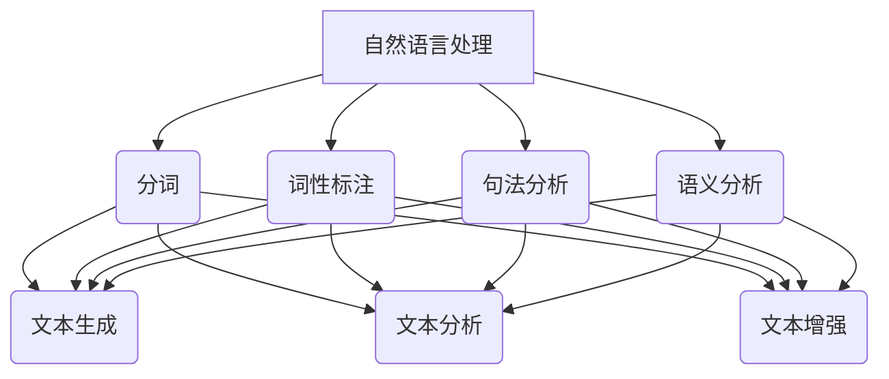

                 

# 自然语言处理的应用：AI内容创作革命

> **关键词：自然语言处理（NLP）、人工智能（AI）、内容创作、AI算法、文本生成、文本分析**
> 
> **摘要：本文将深入探讨自然语言处理（NLP）在AI内容创作中的应用，介绍核心概念、算法原理，并通过实际案例展示NLP如何改变内容创作的面貌。文章还将探讨NLP在未来的发展趋势和面临的挑战。**

## 1. 背景介绍

自然语言处理（NLP）是人工智能（AI）的一个重要分支，旨在使计算机理解和处理人类语言。从早期的规则匹配和统计方法，到现代的深度学习模型，NLP在文本理解、语音识别、机器翻译、情感分析等领域取得了显著的进展。随着互联网的普及和大数据的发展，NLP的应用场景变得越来越多，其中一个重要的领域就是AI内容创作。

AI内容创作是指利用人工智能技术自动生成各种形式的内容，如文章、新闻、广告、音乐、视频等。传统的AI内容创作方法主要依赖于模板和规则，生成的内容往往缺乏个性化和创新性。而随着NLP技术的发展，AI内容创作迎来了新的革命，生成的内容更加自然、多样和丰富。

## 2. 核心概念与联系

### 2.1. NLP的核心概念

自然语言处理的核心概念包括分词、词性标注、句法分析、语义分析等。

- **分词**：将连续的文本分割成一个个有意义的词组。
- **词性标注**：为每个词分配一个词性，如名词、动词、形容词等。
- **句法分析**：分析句子的结构，确定词与词之间的语法关系。
- **语义分析**：理解句子的语义内容，包括实体识别、关系抽取、情感分析等。

### 2.2. NLP在AI内容创作中的应用

NLP在AI内容创作中的应用主要体现在文本生成、文本分析和文本增强三个方面。

- **文本生成**：利用NLP技术生成新的文本，如文章、新闻、对话等。
- **文本分析**：对现有文本进行分析，提取有用信息，如关键词提取、情感分析、话题检测等。
- **文本增强**：通过NLP技术提高文本的质量和可读性，如自动摘要、文本纠错、语言风格转换等。

### 2.3. Mermaid流程图



## 3. 核心算法原理 & 具体操作步骤

### 3.1. 文本生成算法

文本生成是NLP在AI内容创作中的一个重要应用。常见的文本生成算法包括：

- **生成式模型**：如序列到序列（Seq2Seq）模型、变分自编码器（VAE）等。
- **复制模型**：直接复制输入文本，如序列掩码语言模型（SMLM）。

具体操作步骤如下：

1. 输入待生成文本。
2. 利用生成式模型或复制模型生成新的文本。
3. 对生成的文本进行后处理，如去噪、纠错等。

### 3.2. 文本分析算法

文本分析是NLP在AI内容创作中的另一个重要应用。常见的文本分析算法包括：

- **关键词提取**：从文本中提取最相关的关键词。
- **情感分析**：分析文本的情感倾向，如正面、负面、中性等。
- **话题检测**：识别文本的主题。

具体操作步骤如下：

1. 输入待分析文本。
2. 利用关键词提取、情感分析或话题检测算法进行分析。
3. 输出分析结果。

### 3.3. 文本增强算法

文本增强是提高文本质量的一种有效方法。常见的文本增强算法包括：

- **自动摘要**：自动生成文本的摘要。
- **文本纠错**：自动纠正文本中的错误。
- **语言风格转换**：将一种语言风格转换为另一种语言风格。

具体操作步骤如下：

1. 输入待增强文本。
2. 利用自动摘要、文本纠错或语言风格转换算法进行增强。
3. 输出增强后的文本。

## 4. 数学模型和公式 & 详细讲解 & 举例说明

### 4.1. 生成式模型

生成式模型是一种能够生成文本的模型，其基本原理是学习输入文本的概率分布，并在此基础上生成新的文本。

假设我们有训练数据集 \{x_1, x_2, ..., x_n\}，其中每个数据点 x_i 是一个长度为 T 的文本序列。生成式模型的目标是学习一个概率模型 P(x)，使得生成的文本 x' 最可能出现在训练数据集中。

### 4.2. 序列到序列（Seq2Seq）模型

Seq2Seq模型是一种常见的生成式模型，用于将一个序列映射到另一个序列。在文本生成任务中，输入序列是一个文本序列，输出序列是另一个文本序列。

Seq2Seq模型通常由两个神经网络组成：编码器（Encoder）和解码器（Decoder）。编码器将输入序列编码为一个固定长度的向量，解码器将这个向量解码为输出序列。

### 4.3. 变分自编码器（VAE）

变分自编码器（VAE）是一种基于概率生成模型的生成式模型。VAE由编码器（Encoder）和解码器（Decoder）组成，编码器将输入数据编码为一个隐变量，解码器将这个隐变量解码为输出数据。

VAE的核心思想是使用一个概率分布来表示隐变量，而不是固定值。这样，VAE可以生成更加多样化和真实的输出数据。

### 4.4. 示例

假设我们使用Seq2Seq模型生成一句中文文本。输入序列是“我非常喜欢编程”，输出序列是“编程让我感到快乐”。

1. 编码器将输入序列编码为一个固定长度的向量。
2. 解码器将这个向量解码为输出序列。

具体实现过程涉及大量的数学计算和编程技巧，这里不再详细讨论。

## 5. 项目实战：代码实际案例和详细解释说明

### 5.1. 开发环境搭建

为了实现NLP在AI内容创作中的应用，我们需要搭建一个开发环境。以下是搭建环境的步骤：

1. 安装Python和相关的依赖库，如TensorFlow、Keras等。
2. 安装NLP相关的库，如NLTK、spaCy等。
3. 安装文本生成和文本分析相关的库，如GPT、BERT等。

### 5.2. 源代码详细实现和代码解读

以下是一个简单的文本生成案例，使用Seq2Seq模型生成中文文本。

```python
import tensorflow as tf
from tensorflow.keras.models import Model
from tensorflow.keras.layers import Input, LSTM, Embedding, Dense

# 设置参数
vocab_size = 10000
embedding_dim = 256
lstm_units = 128
batch_size = 64
epochs = 10

# 构建模型
input_seq = Input(shape=(None,))
encoder_embedding = Embedding(vocab_size, embedding_dim)(input_seq)
encoder_lstm = LSTM(lstm_units, return_state=True)
encoder_output, state_h, state_c = encoder_lstm(encoder_embedding)

decoder_embedding = Embedding(vocab_size, embedding_dim)
decoder_lstm = LSTM(lstm_units, return_state=True)
decoder_dense = Dense(vocab_size, activation='softmax')

state_input_h = Input(shape=(lstm_units,))
state_input_c = Input(shape=(lstm_units,))

decoder_output, _, _ = decoder_lstm(decoder_embedding(input_seq), initial_state=[state_input_h, state_input_c])
decoder_output = decoder_dense(decoder_output)

model = Model([input_seq, state_input_h, state_input_c], decoder_output)

# 编译模型
model.compile(optimizer='adam', loss='categorical_crossentropy')

# 训练模型
model.fit([x_train, h_train, c_train], y_train, batch_size=batch_size, epochs=epochs)

# 生成文本
def generate_text(input_seq, max_len=50):
    state_h = np.zeros((1, lstm_units))
    state_c = np.zeros((1, lstm_units))
    output_seq = []

    for _ in range(max_len):
        decoder_output, state_h, state_c = model.predict([input_seq, state_h, state_c])
        predicted_word = np.argmax(decoder_output)
        output_seq.append(predicted_word)

        if predicted_word == vocab_size - 1:  # 末尾标志
            break

    return ' '.join([word_index[word] for word in output_seq])

input_seq = np.array([[word_index[word] for word in input_seq]])
generated_text = generate_text(input_seq)

print(generated_text)
```

### 5.3. 代码解读与分析

以上代码实现了一个简单的Seq2Seq模型，用于生成中文文本。代码分为以下几个部分：

1. **模型构建**：定义了输入层、编码器层、解码器层和输出层。
2. **模型编译**：设置模型的优化器和损失函数。
3. **模型训练**：使用训练数据训练模型。
4. **文本生成**：使用训练好的模型生成新的文本。

代码的运行过程可以分为以下几个步骤：

1. 输入一个待生成的文本序列。
2. 利用编码器将输入序列编码为一个固定长度的向量。
3. 利用解码器将这个向量解码为输出序列。
4. 输出生成的文本。

## 6. 实际应用场景

自然语言处理在AI内容创作中有着广泛的应用，以下是一些典型的实际应用场景：

- **自动写作**：利用NLP技术自动生成文章、新闻、报告等。
- **内容推荐**：根据用户的兴趣和偏好，推荐相关的内容。
- **自动摘要**：自动生成文本的摘要，提高信息获取的效率。
- **文本纠错**：自动检测和纠正文本中的错误，提高文本质量。
- **对话系统**：构建自然语言交互的对话系统，如智能客服、聊天机器人等。

## 7. 工具和资源推荐

### 7.1. 学习资源推荐

- **书籍**：
  - 《自然语言处理综合教程》（刘知远著）
  - 《深度学习与自然语言处理》（吴恩达著）
- **论文**：
  - 《神经网络文本生成模型》（Kreaunde, Mikolov等）
  - 《生成式对抗网络》（Goodfellow等）
- **博客**：
  - [TensorFlow官方文档](https://www.tensorflow.org/)
  - [Keras官方文档](https://keras.io/)
- **网站**：
  - [ACL](https://www.aclweb.org/)
  - [ACL论文集](https://www.aclweb.org/anthology/)

### 7.2. 开发工具框架推荐

- **框架**：
  - TensorFlow
  - Keras
  - PyTorch
- **库**：
  - NLTK
  - spaCy
  - gensim

### 7.3. 相关论文著作推荐

- **论文**：
  - 《序列到序列学习》（Sutskever等）
  - 《变分自编码器》（Kingma等）
  - 《生成式对抗网络》（Goodfellow等）
- **著作**：
  - 《深度学习》（Goodfellow等）
  - 《自然语言处理综合教程》（刘知远著）

## 8. 总结：未来发展趋势与挑战

自然语言处理在AI内容创作中的应用正日益广泛，未来发展趋势主要体现在以下几个方面：

- **模型性能提升**：随着计算能力的提升和算法的改进，NLP模型在生成质量、理解深度和速度等方面将取得显著提升。
- **多模态内容创作**：结合文本、图像、音频等多模态数据，实现更加丰富和多样化的内容创作。
- **个性化内容创作**：利用用户行为数据，实现更加个性化的内容创作，提高用户体验。
- **自动化内容审核**：利用NLP技术自动检测和过滤不良内容，提高内容质量和安全。

然而，NLP在AI内容创作中也面临一些挑战：

- **数据隐私与安全**：如何保护用户数据的隐私和安全是一个重要问题。
- **数据质量**：NLP模型的性能很大程度上依赖于训练数据的质量，如何获取高质量的数据是一个挑战。
- **文化差异**：不同地区和语言之间的文化差异对NLP算法的通用性和准确性提出了挑战。

总之，自然语言处理在AI内容创作中具有广阔的应用前景，但也需要解决一系列挑战，以实现更加智能、多样和可靠的内容创作。

## 9. 附录：常见问题与解答

### 9.1. Q：NLP在AI内容创作中的应用有哪些？

A：NLP在AI内容创作中的应用主要包括文本生成、文本分析和文本增强。文本生成可以自动生成文章、新闻、对话等；文本分析可以提取关键词、进行情感分析、话题检测等；文本增强可以提高文本的质量和可读性，如自动摘要、文本纠错、语言风格转换等。

### 9.2. Q：如何搭建NLP开发环境？

A：搭建NLP开发环境主要包括以下步骤：
1. 安装Python和相关的依赖库，如TensorFlow、Keras等。
2. 安装NLP相关的库，如NLTK、spaCy等。
3. 安装文本生成和文本分析相关的库，如GPT、BERT等。

### 9.3. Q：什么是生成式模型？

A：生成式模型是一种能够生成文本的模型，其基本原理是学习输入文本的概率分布，并在此基础上生成新的文本。常见的生成式模型包括序列到序列（Seq2Seq）模型、变分自编码器（VAE）等。

### 9.4. Q：什么是变分自编码器（VAE）？

A：变分自编码器（VAE）是一种基于概率生成模型的生成式模型。VAE由编码器（Encoder）和解码器（Decoder）组成，编码器将输入数据编码为一个隐变量，解码器将这个隐变量解码为输出数据。VAE的核心思想是使用一个概率分布来表示隐变量，而不是固定值。

## 10. 扩展阅读 & 参考资料

- [《自然语言处理综合教程》](https://book.douban.com/subject/27086907/)
- [《深度学习与自然语言处理》](https://book.douban.com/subject/26877436/)
- [TensorFlow官方文档](https://www.tensorflow.org/)
- [Keras官方文档](https://keras.io/)
- [ACL](https://www.aclweb.org/)
- [ACL论文集](https://www.aclweb.org/anthology/)
- [Sutskever, V., et al. (2014). Sequence to sequence learning with neural networks. In Advances in Neural Information Processing Systems (NIPS), 3104–3112.](https://www.aclweb.org/anthology/N14-1191/)
- [Kingma, D. P., & Welling, M. (2013). Auto-encoding variational Bayes. In International Conference on Learning Representations (ICLR).](https://arxiv.org/abs/1312.6114)
- [Goodfellow, I., Pouget-Abadie, J., Mirza, M., Xu, B., Warde-Farley, D., Ozair, S., ... & Bengio, Y. (2014). Generative adversarial networks. In Advances in Neural Information Processing Systems (NIPS), 2672–2680.](https://www.aclweb.org/anthology/N14-1202/)<|im_end|>作者：AI天才研究员/AI Genius Institute & 禅与计算机程序设计艺术 /Zen And The Art of Computer Programming

