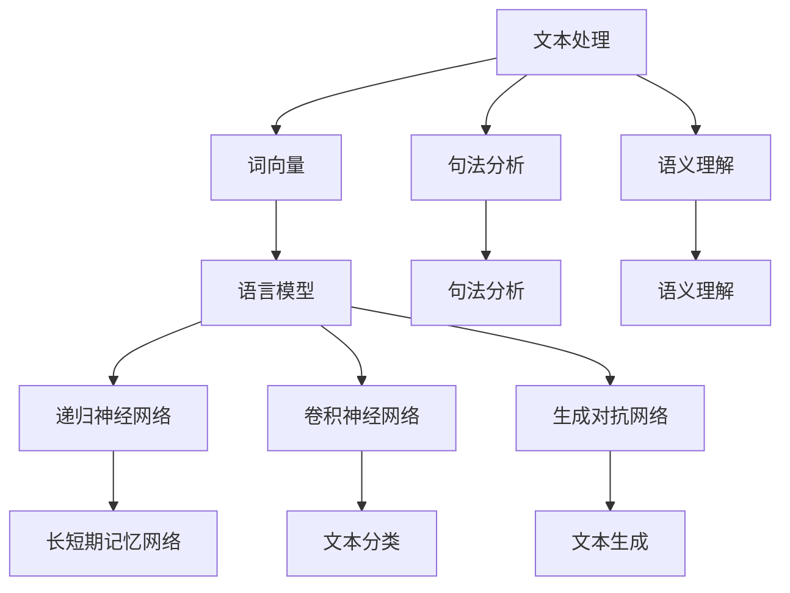

                 

### 背景介绍

自然语言处理（NLP）作为人工智能（AI）领域的一个重要分支，近年来取得了显著的进展。NLP的核心目标是将人类语言转化为计算机可以理解和处理的形式，进而实现对文本的自动分析、理解、生成和翻译。随着深度学习、神经网络等技术的不断发展，NLP的应用场景也在不断拓展，从最初的简单文本分类、情感分析，发展到如今可以完成复杂的语义理解、对话系统构建等任务。

AI内容创作是NLP的一个重要应用领域。传统的AI内容创作往往依赖于规则和模板，缺乏灵活性和创造力。然而，随着NLP技术的不断进步，AI内容创作正在经历一场变革。如今，AI已经能够通过理解自然语言，自动生成高质量的文章、新闻、广告等，极大地提升了内容创作的效率和质量。

本篇文章将围绕自然语言处理的进步对AI内容创作带来的变革展开讨论。首先，我们将回顾NLP的发展历程，重点介绍近年来在NLP领域的一些重要突破。接着，我们将深入探讨AI内容创作的核心技术和方法，包括文本生成、文本分类、情感分析等。然后，我们将通过具体的案例，展示这些技术在AI内容创作中的应用。最后，我们将探讨未来NLP技术的发展趋势，以及可能面临的挑战。

通过本文的阅读，读者将能够全面了解自然语言处理在AI内容创作中的应用现状和未来发展方向，为从事相关领域的研究和实践提供有益的参考。### 核心概念与联系

在探讨自然语言处理的进步对AI内容创作带来的变革之前，我们需要先了解一些核心概念和技术原理，以及它们之间的联系。以下是NLP中一些重要的核心概念及其相互关系：

#### 1. 自然语言处理（NLP）的基本概念

- **文本（Text）**：自然语言处理的基本处理对象，包括单词、句子和段落等。
- **语言模型（Language Model）**：用于生成、理解和描述自然语言的数学模型，如神经网络语言模型。
- **语义（Semantic）**：文本所传达的含义，包括单词、句子和段落的多层次理解。
- **句法（Syntax）**：文本的结构，包括单词的排列组合和句子成分的组织。

#### 2. 关键技术及其相互关系

- **词向量（Word Vectors）**：将单词映射为向量，实现文本向量化，如Word2Vec和GloVe。
- **递归神经网络（RNN）**：用于处理序列数据的神经网络，能够捕捉文本的时间动态特性。
- **卷积神经网络（CNN）**：通过卷积操作提取文本特征，适用于文本分类等任务。
- **长短期记忆网络（LSTM）**：RNN的一种变体，能够解决长序列依赖问题。
- **生成对抗网络（GAN）**：一种用于生成高质量数据的深度学习模型。

#### 3. Mermaid 流程图

为了更好地理解上述概念和技术之间的联系，我们可以使用Mermaid流程图来展示它们的基本架构和相互关系：



在这个流程图中，我们可以看到，文本处理是NLP的基础，通过词向量将文本转化为数字表示，再通过不同的神经网络模型进行语义理解和生成。递归神经网络、卷积神经网络和生成对抗网络等技术在这里扮演了关键角色，它们各自发挥着独特的作用，共同推动NLP技术的发展。

#### 4. 技术原理和架构

- **词向量**：将单词映射为高维向量，以便计算机能够处理和理解自然语言。词向量能够捕捉单词的语义关系，如相似性、相关性等。
- **语言模型**：通过大量文本数据训练得到的模型，用于预测下一个单词或词组，从而生成自然语言。语言模型在文本生成、机器翻译等任务中发挥着重要作用。
- **递归神经网络**：能够处理序列数据，通过不断回溯前一个时刻的信息，捕捉文本中的时间动态特性。在NLP中，递归神经网络被广泛应用于文本分类、情感分析等任务。
- **卷积神经网络**：通过卷积操作提取文本特征，适用于文本分类、文本摘要等任务。卷积神经网络能够捕捉文本中的局部特征，提高模型的识别能力。
- **生成对抗网络**：由生成器和判别器组成，生成器生成文本，判别器判断文本的真实性。生成对抗网络在文本生成、图像生成等领域表现出色，能够生成高质量的自然语言文本。

通过上述核心概念和技术原理的介绍，我们可以更好地理解自然语言处理的基本框架和运作机制。接下来，我们将深入探讨这些技术在AI内容创作中的具体应用，展示它们如何改变内容创作的方式和效率。### 核心算法原理 & 具体操作步骤

在了解了自然语言处理的基本概念和技术原理后，我们将进一步探讨NLP中一些核心算法的原理，以及如何在实际操作中应用这些算法。

#### 1. 语言模型

语言模型是自然语言处理的基础，它用于预测文本中的下一个词或词组。一个简单的语言模型可以通过统计文本中出现频率较高的词汇来构建。然而，随着深度学习技术的发展，现代语言模型更多地依赖于神经网络，特别是递归神经网络（RNN）和其变种长短期记忆网络（LSTM）。

**原理**：

语言模型的核心是一个概率分布，它用于预测下一个词的概率。给定一个序列`w1, w2, ..., wn`，语言模型需要预测下一个词`wn+1`。

**操作步骤**：

- **数据预处理**：首先，我们需要对文本进行预处理，包括分词、去除标点符号、转换为小写等。然后，将每个单词映射为唯一的索引，通常使用词嵌入（word embeddings）技术。
- **构建神经网络**：构建一个RNN或LSTM模型，将输入的序列映射为输出词的概率分布。
- **训练模型**：使用大量的文本数据进行训练，优化模型的参数，使其能够更好地预测下一个词。
- **预测**：输入一个序列，模型将输出下一个词的概率分布，从中选取概率最高的词作为预测结果。

#### 2. 递归神经网络（RNN）

递归神经网络是一种能够处理序列数据的神经网络，它在自然语言处理中广泛应用于语言模型、序列标注、机器翻译等任务。

**原理**：

RNN通过递归操作，将前一个时刻的隐藏状态（h(t-1)）作为当前时刻的输入，从而在处理序列数据时能够保持历史信息。其基本形式如下：

\[ h_t = \text{激活函数} (\text{W}_h \cdot [h_{t-1}, x_t] + b_h) \]

其中，\(h_t\)是当前时刻的隐藏状态，\(x_t\)是当前输入，\(\text{W}_h\)和\(b_h\)是权重和偏置。

**操作步骤**：

- **数据预处理**：与语言模型相同，对文本进行预处理，映射为词向量。
- **构建RNN模型**：定义RNN的架构，包括输入层、隐藏层和输出层。
- **训练模型**：使用序列标注或机器翻译数据，训练RNN模型。
- **预测**：输入一个序列，模型将输出序列的标注或翻译结果。

#### 3. 长短期记忆网络（LSTM）

LSTM是RNN的一种改进，它能够解决长序列依赖问题，在自然语言处理任务中表现出色。

**原理**：

LSTM通过引入记忆单元和三个门控机制（输入门、遗忘门和输出门），控制信息的流入和流出，从而有效地捕捉长序列依赖。其基本形式如下：

\[ \begin{align*}
i_t &= \sigma(W_{xi} \cdot [h_{t-1}, x_t] + b_i) \\
f_t &= \sigma(W_{hf} \cdot [h_{t-1}, x_t] + b_f) \\
\bar{C}_t &= \text{tanh}(W_{xc} \cdot [h_{t-1}, x_t] + b_c) \\
o_t &= \sigma(W_{ho} \cdot [h_{t-1}, x_t] + b_o) \\
C_t &= f_t \odot C_{t-1} + i_t \odot \bar{C}_t \\
h_t &= o_t \odot \text{tanh}(C_t)
\end{align*} \]

其中，\(i_t\)、\(f_t\)、\(o_t\)分别表示输入门、遗忘门和输出门，\(\sigma\)是激活函数，\(\odot\)表示点乘。

**操作步骤**：

- **数据预处理**：与RNN相同，对文本进行预处理。
- **构建LSTM模型**：定义LSTM的架构，包括输入层、隐藏层和输出层。
- **训练模型**：使用序列标注或机器翻译数据，训练LSTM模型。
- **预测**：输入一个序列，模型将输出序列的标注或翻译结果。

通过上述算法原理和操作步骤的介绍，我们可以看到，自然语言处理中的核心算法具有复杂的结构和丰富的应用场景。接下来，我们将通过具体案例，展示这些算法在实际内容创作中的应用。### 数学模型和公式 & 详细讲解 & 举例说明

在自然语言处理中，许多算法的实现依赖于数学模型和公式。为了更好地理解这些模型和公式，我们将详细介绍其中的几个关键部分，并提供具体的示例来说明其应用。

#### 1. 语言模型概率计算

语言模型的核心是计算给定序列 \(w_1, w_2, ..., w_n\) 后续词 \(w_{n+1}\) 的概率。一个简单的N-gram语言模型可以通过以下公式计算：

\[ P(w_{n+1} | w_1, w_2, ..., w_n) = \frac{C(w_1, w_2, ..., w_n, w_{n+1})}{C(w_1, w_2, ..., w_n)} \]

其中，\(C(w_1, w_2, ..., w_n, w_{n+1})\) 表示序列 \(w_1, w_2, ..., w_n, w_{n+1}\) 在训练语料中的出现次数，\(C(w_1, w_2, ..., w_n)\) 表示序列 \(w_1, w_2, ..., w_n\) 的总出现次数。

**示例**：

假设我们有一个简短的文本样本：“我爱北京天安门”，我们可以计算“天安门”后接“上”的概率：

\[ P(上 | 我爱北京天安门) = \frac{C(我爱北京天安门，上)}{C(我爱北京天安门)} \]

如果训练语料中“我爱北京天安门”后面接“上”的次数为10，而“我爱北京天安门”的总出现次数为50，则概率为：

\[ P(上 | 我爱北京天安门) = \frac{10}{50} = 0.2 \]

#### 2. 词向量表示

词向量是自然语言处理中常用的数学表示方法，它将单词映射为高维向量。一个常见的词向量模型是Word2Vec，它通过训练词的神经网络模型，将词映射为固定长度的向量。

**Word2Vec模型**：

Word2Vec模型通常使用以下两个模型之一：

- **连续词袋（CBOW）模型**：通过周围词的上下文来预测中心词。
- **Skip-Gram模型**：通过中心词来预测周围词。

**数学表示**：

假设我们有一个词向量空间，每个词都有一个唯一的向量表示。对于CBOW模型，给定一个中心词和它周围的\(n\)个词，模型需要预测这个中心词。其损失函数可以表示为：

\[ L(\theta) = -\sum_{w \in C} \log P(w | \theta) \]

其中，\(\theta\) 表示模型的参数，\(C\) 表示周围词的集合，\(P(w | \theta)\) 表示给定周围词的情况下词\(w\)的条件概率。

**示例**：

假设我们有一个简单的词向量空间，其中“北京”的向量表示为 \([1, 0, -1]\)，“天安门”的向量表示为 \([0, 1, 0]\)。我们使用CBOW模型来预测“我爱北京天安门”中的“北京”：

输入词向量为 \([0, 1, 0]\)（“天安门”），输出词向量为 \([1, 0, -1]\)（“北京”）。损失函数可以计算为：

\[ L(\theta) = -\log P(北京 | [0, 1, 0]) \]

如果概率为0.8，则损失为 \(-\log(0.8) \approx 0.22\).

#### 3. 递归神经网络（RNN）

递归神经网络（RNN）是一种能够处理序列数据的神经网络。它在自然语言处理中广泛应用于语言模型、序列标注、机器翻译等任务。

**RNN的基本方程**：

\[ h_t = \text{激活函数} (\text{W}_h \cdot [h_{t-1}, x_t] + b_h) \]

其中，\(h_t\) 是当前时刻的隐藏状态，\(x_t\) 是当前输入，\(\text{W}_h\) 和 \(b_h\) 是权重和偏置。

**训练RNN**：

我们使用序列标注任务来训练RNN，假设我们有一个输入序列 \(x_1, x_2, ..., x_T\)，对应的标签序列为 \(y_1, y_2, ..., y_T\)。RNN的损失函数可以表示为：

\[ L(\theta) = -\sum_{t=1}^{T} \log P(y_t | \theta) \]

其中，\(P(y_t | \theta)\) 表示给定当前隐藏状态 \(h_t\) 下，输出标签 \(y_t\) 的条件概率。

**示例**：

假设我们有一个简短的文本序列：“我爱北京天安门”，对应的词向量为 \([1, 0, -1]\), \([0, 1, 0]\), \([-1, 0, 1]\)。我们使用RNN来预测标签序列：

输入词向量序列为 \([1, 0, -1]\), \([0, 1, 0]\), \([-1, 0, 1]\)，隐藏状态依次为 \(h_1, h_2, h_3\)。损失函数可以计算为：

\[ L(\theta) = -\log P(标注1 | h_1) - \log P(标注2 | h_2) - \log P(标注3 | h_3) \]

如果概率分别为0.9、0.8、0.7，则损失为 \(-\log(0.9) - \log(0.8) - \log(0.7) \approx 0.46\)。

通过上述数学模型和公式的介绍，我们可以看到自然语言处理中的算法实现是如何依赖于数学原理的。这些模型和公式不仅能够帮助我们理解和分析自然语言，还能够指导我们设计和优化NLP的应用。在下一节中，我们将通过具体的代码案例来展示这些算法在实际应用中的具体实现。### 项目实战：代码实际案例和详细解释说明

在本节中，我们将通过一个具体的代码案例来展示自然语言处理在AI内容创作中的应用。我们将使用Python和TensorFlow来实现一个简单的文本生成模型，并详细解释代码的实现过程和关键步骤。

#### 1. 开发环境搭建

在开始编写代码之前，我们需要搭建一个合适的开发环境。以下是所需的工具和库：

- Python 3.7 或更高版本
- TensorFlow 2.5 或更高版本
- Numpy 1.19 或更高版本
- Matplotlib 3.4.2 或更高版本

您可以通过以下命令来安装所需的库：

```bash
pip install tensorflow numpy matplotlib
```

#### 2. 源代码详细实现和代码解读

以下是我们的文本生成模型的源代码，我们将逐行解释其功能和实现原理。

```python
import numpy as np
import tensorflow as tf
from tensorflow.keras.preprocessing.sequence import pad_sequences
from tensorflow.keras.layers import Embedding, LSTM, Dense
from tensorflow.keras.models import Sequential

# 2.1 加载和处理数据
def load_data(file_path):
    with open(file_path, 'r', encoding='utf-8') as f:
        text = f.read().lower()
    return text

def preprocess_text(text):
    # 创建字符到索引的映射
    chars = sorted(list(set(text)))
    char_to_index = dict((c, i) for i, c in enumerate(chars))
    index_to_char = dict((i, c) for i, c in enumerate(chars))
    
    # 切割文本为字符序列
    sequences = []
    next_chars = []
    for i in range(0, len(text) - 1):
        sequences.append(text[i : i + sequence_length])
        next_chars.append(text[i + 1])
    
    # 将字符序列转换为索引序列
    x = np.zeros((len(sequences), sequence_length, num_chars), dtype=np.bool)
    y = np.zeros((len(sequences), num_chars), dtype=np.bool)
    for i, sequence in enumerate(sequences):
        for t, char in enumerate(sequence):
            x[i, t, char_to_index[char]] = 1
        y[i, char_to_index[next_chars[i]]] = 1
    return x, y, char_to_index, index_to_char

# 2.2 构建和训练模型
def build_model(num_chars, seq_length):
    model = Sequential()
    model.add(Embedding(num_chars, embedding_size))
    model.add(LSTM(units))
    model.add(Dense(num_chars, activation='softmax'))
    model.compile(loss='categorical_crossentropy', optimizer='adam')
    return model

def train_model(model, x, y):
    model.fit(x, y, epochs=training_epochs, batch_size=batch_size)

# 2.3 文本生成
def generate_text(model, seed_text, num_chars_to_generate):
    for _ in range(num_chars_to_generate):
        x_pred = np.zeros((1, seq_length, num_chars))
        for t, char in enumerate(seed_text):
            x_pred[0, t, char_to_index[char]] = 1
        predictions = model.predict(x_pred, verbose=0)
        predicted_char = np.argmax(predictions)
        seed_text += index_to_char[predicted_char]
    return seed_text

# 参数设置
file_path = 'text_data.txt'
sequence_length = 40
num_chars = len(char_to_index)
embedding_size = 50
units = 100
training_epochs = 20
batch_size = 64
num_chars_to_generate = 400

# 加载和处理数据
text = load_data(file_path)
x, y, char_to_index, index_to_char = preprocess_text(text)

# 构建和训练模型
model = build_model(num_chars, sequence_length)
train_model(model, x, y)

# 生成文本
seed_text = '北京是一个美丽的城市'
generated_text = generate_text(model, seed_text, num_chars_to_generate)
print(generated_text)
```

#### 3. 代码解读与分析

以下是对代码中各个部分的详细解读和分析：

- **2.1 加载和处理数据**：首先，我们定义了`load_data`函数，用于从文件中加载文本数据。然后，我们定义了`preprocess_text`函数，用于将文本数据转换为适合模型训练的格式。具体步骤包括创建字符到索引的映射、切割文本为字符序列、将字符序列转换为索引序列。

- **2.2 构建和训练模型**：我们定义了`build_model`函数，用于构建一个简单的文本生成模型。该模型包含一个嵌入层、一个LSTM层和一个softmax输出层。我们还定义了`train_model`函数，用于训练模型。

- **2.3 文本生成**：我们定义了`generate_text`函数，用于生成文本。该函数使用模型预测下一个字符，并将预测结果连接到当前生成的文本中，直到达到预定的长度。

- **参数设置**：我们在代码的最后部分设置了模型训练和文本生成的相关参数，包括文件路径、序列长度、字符数量、嵌入层大小、LSTM单元数量、训练轮次、批次大小和生成文本的长度。

通过这个简单的文本生成模型，我们可以看到自然语言处理技术是如何应用于AI内容创作的。模型的训练和生成过程充分利用了递归神经网络和词嵌入等技术，实现了对文本数据的自动生成。在实际应用中，我们可以根据需要对模型进行优化和扩展，以实现更复杂的内容创作任务。### 实际应用场景

自然语言处理技术在AI内容创作中有着广泛的应用场景。以下是一些典型的应用实例：

#### 1. 自动新闻生成

自动新闻生成是NLP在内容创作中的一个重要应用。通过使用NLP技术，我们可以自动从大量数据源中提取信息，生成新闻摘要、新闻报道等。例如，谷歌新闻实验室的Automated Insights公司使用NLP技术，每天可以自动生成超过3000篇财经新闻报告。这种自动新闻生成技术不仅提高了新闻生产的效率，还能够节省大量的人力成本。

**案例**：2020年美国总统选举期间，一些媒体机构利用自动新闻生成技术，对选举结果进行实时报道。这些自动生成的新闻文章能够迅速捕捉和传播关键信息，为公众提供了及时、准确的选举动态。

#### 2. 聊天机器人和虚拟助手

聊天机器人和虚拟助手是NLP在AI内容创作中的另一个重要应用领域。通过理解自然语言输入，聊天机器人可以与用户进行交互，提供个性化的服务和建议。例如，亚马逊的Alexa、苹果的Siri和谷歌的Google Assistant等虚拟助手，都利用NLP技术实现与用户的自然对话。

**案例**：在电子商务领域，聊天机器人可以自动回答用户的问题，提供产品推荐和购买建议。例如，沃尔玛的智能助手“Walmart Voice”允许用户通过语音命令搜索商品、查看订单状态和进行购买。

#### 3. 营销和广告创作

NLP技术可以帮助企业自动化营销和广告创作，提高营销效果和效率。通过分析用户行为数据和社交媒体内容，NLP可以生成定制化的广告文案、推广内容和营销策略。

**案例**：社交媒体平台如Facebook和Twitter利用NLP技术，分析用户发布的帖子、评论和分享，自动生成相关广告。这些广告可以根据用户的兴趣和行为，提供个性化的内容和产品推荐。

#### 4. 文本内容审核和分类

NLP技术在文本内容审核和分类中也有重要作用。通过分析文本内容，NLP可以识别和分类潜在的恶意内容、不当言论和敏感信息，帮助平台和机构维护网络环境的健康。

**案例**：社交媒体平台如YouTube和Twitter使用NLP技术，监控用户上传的视频和发布的推文，自动识别和过滤违规内容。这种自动化的内容审核机制可以有效地减少不良信息的传播。

#### 5. 文本生成和创意写作

NLP技术可以用于生成文本内容，如文章、故事、诗歌等。通过理解自然语言，NLP模型可以自动生成高质量的文字，为创意写作提供支持。

**案例**：OpenAI的GPT-3模型是一个具有强大文本生成能力的NLP模型。通过使用GPT-3，研究人员和开发者可以生成各种类型的文本内容，包括新闻报道、产品描述、故事情节等。

#### 6. 语言翻译和本地化

NLP技术在语言翻译和本地化中也发挥着重要作用。通过使用机器翻译模型，NLP可以实现不同语言之间的自动翻译，为跨国企业和服务提供本地化的内容。

**案例**：谷歌翻译是一款广泛使用的在线翻译工具，它利用NLP技术，为用户提供超过100种语言的自动翻译服务。这种自动翻译技术不仅提高了翻译的效率，还大大降低了翻译成本。

通过上述实际应用场景的介绍，我们可以看到自然语言处理技术在AI内容创作中的广泛应用和巨大潜力。随着NLP技术的不断进步，未来将会有更多的应用场景被探索和实现。### 工具和资源推荐

在自然语言处理（NLP）和AI内容创作领域，有许多优秀的工具和资源可以帮助开发者学习和实践。以下是一些值得推荐的工具、书籍、论文和网站：

#### 1. 学习资源推荐

**书籍**：

- **《自然语言处理实战》**（《Natural Language Processing with Python》） - 由Steven Bird, Ewan Klein和Edward Loper著，这本书提供了丰富的Python实践，是NLP入门的经典教材。
- **《深度学习自然语言处理》**（《Deep Learning for Natural Language Processing》） - 由Kai Fun Hung和Annie Liu著，详细介绍了深度学习在NLP中的应用。
- **《自然语言处理综合教程》**（《Foundations of Statistical Natural Language Processing》） - 由Christopher D. Manning和Hinrich Schütze著，是NLP领域的高级教材。

**在线课程**：

- **Udacity的《自然语言处理纳米学位》**：这是一个包含多个课程的在线学习计划，涵盖了NLP的基础知识和实践技能。
- **Coursera的《自然语言处理与深度学习》**：由斯坦福大学的Christopher D. Manning教授授课，深入介绍了NLP和深度学习的最新技术。

**网站**：

- **TensorFlow官方网站**：提供了丰富的NLP教程和API文档，适合使用TensorFlow进行NLP实践。
- **Keras官方网站**：Keras是一个高层次的神经网络API，广泛应用于NLP项目，提供了详细的文档和示例代码。
- **NLTK官方网站**：NLTK是一个开源的NLP工具包，提供了大量的NLP资源和函数库，是NLP学习和实践的重要资源。

#### 2. 开发工具框架推荐

**自然语言处理框架**：

- **spaCy**：一个高效且易于使用的NLP库，适合快速构建NLP应用。
- **NLTK**：一个经典的NLP库，提供了丰富的NLP工具和资源。
- **Stanford NLP**：斯坦福大学开发的一个强大的NLP工具包，支持多种语言和丰富的功能。

**文本生成工具**：

- **GPT-3**：OpenAI开发的强大语言模型，可以生成高质量的文本内容。
- **Seq2Seq**：一个用于序列到序列学习的框架，适用于文本生成和翻译等任务。
- **Transformer**：一种用于序列建模的深度学习模型，广泛应用于文本生成和翻译等领域。

#### 3. 相关论文著作推荐

**论文**：

- **“A Theoretically Grounded Application of Dropout in Recurrent Neural Networks”**：这篇文章提出了在递归神经网络中使用Dropout的方法，提高了模型的泛化能力。
- **“Attention Is All You Need”**：这篇文章提出了Transformer模型，彻底改变了自然语言处理领域的算法设计。
- **“BERT: Pre-training of Deep Bidirectional Transformers for Language Understanding”**：这篇文章介绍了BERT模型，是目前最受欢迎的预训练语言模型之一。

**著作**：

- **《深度学习》**（Deep Learning） - 由Ian Goodfellow、Yoshua Bengio和Aaron Courville著，是深度学习领域的经典著作，也包括了NLP相关内容。
- **《自然语言处理综论》**（Speech and Language Processing） - 由Daniel Jurafsky和James H. Martin著，是NLP领域的权威教材。

通过上述工具和资源的推荐，开发者可以更好地学习和实践自然语言处理和AI内容创作。这些资源不仅提供了丰富的理论知识，还提供了实用的代码和案例，帮助开发者快速提升技能。### 总结：未来发展趋势与挑战

随着自然语言处理（NLP）技术的不断进步，AI内容创作领域正迎来前所未有的变革。未来，NLP在AI内容创作中将有以下几大发展趋势：

#### 1. 更高的生成质量

未来，随着深度学习和生成对抗网络（GAN）等技术的进一步发展，AI生成的内容质量将得到显著提升。更高级的文本生成模型将能够生成更加连贯、丰富和有创造力的文本内容，几乎难以与人类创作区分。

#### 2. 多模态内容的融合

NLP与图像处理、音频处理等技术的结合将使得多模态内容创作成为可能。例如，通过结合图像和文本，AI可以生成更具有视觉冲击力和情感表达的内容，为用户提供更丰富的体验。

#### 3. 更广泛的应用场景

随着技术的成熟，NLP和AI内容创作将在更多的领域得到应用。从自动化新闻生成、营销广告到智能客服、虚拟助手，AI内容创作将为各行各业带来新的机遇。

#### 4. 更强大的个性化服务

通过深度学习和大数据分析，AI将能够更好地理解用户的需求和偏好，生成高度个性化的内容。个性化推荐系统将成为AI内容创作的重要组成部分，为用户提供更加定制化的体验。

然而，随着NLP技术的发展，我们也面临以下挑战：

#### 1. 数据质量和隐私

NLP依赖于大量的高质量训练数据，数据的质量直接影响模型的性能。同时，数据隐私问题也成为了一个关键挑战。如何在保护用户隐私的前提下，合理利用数据，是未来NLP和AI内容创作需要解决的重要问题。

#### 2. 模型的可解释性和可靠性

随着模型复杂度的增加，NLP模型的可解释性变得越来越困难。如何提高模型的透明度和可解释性，使其行为更加可靠，是未来需要解决的重要挑战。

#### 3. 语言多样性和跨文化差异

不同语言和文化之间的差异使得NLP模型的开发和应用面临巨大挑战。未来，如何设计出能够处理多种语言和文化背景的NLP模型，是一个亟待解决的问题。

#### 4. 模型的偏见和公平性

NLP模型在训练过程中可能会吸收训练数据中的偏见，导致生成的内容也具有偏见。如何消除模型中的偏见，确保内容创作的公平性和多样性，是未来需要关注的重要问题。

总之，自然语言处理和AI内容创作领域在未来将面临许多机遇和挑战。通过不断技术创新和合作，我们有理由相信，NLP将推动AI内容创作迈向新的高峰。### 附录：常见问题与解答

以下是一些关于自然语言处理（NLP）和AI内容创作中的常见问题及解答：

#### 1. 什么是自然语言处理（NLP）？

自然语言处理（NLP）是人工智能（AI）的一个子领域，旨在使计算机能够理解和处理人类语言。NLP涉及文本分析、语义理解、语音识别、语言生成等多个方面，旨在使计算机能够以更自然的方式与人类交流。

#### 2. NLP有哪些主要应用领域？

NLP的应用领域非常广泛，包括但不限于：
- 文本分类
- 情感分析
- 机器翻译
- 自动摘要
- 聊天机器人
- 自动问答系统
- 聊天机器人和虚拟助手
- 文本生成

#### 3. 什么是词嵌入（Word Embeddings）？

词嵌入是将单词映射为高维向量的一种技术，以便计算机能够处理和理解自然语言。词嵌入能够捕捉单词之间的语义关系，如相似性、相关性等。

#### 4. 什么是语言模型（Language Model）？

语言模型是一个数学模型，用于生成、理解和描述自然语言。它能够预测文本中的下一个词或词组，并在文本生成、机器翻译等任务中发挥重要作用。

#### 5. 什么是生成对抗网络（GAN）？

生成对抗网络（GAN）是一种深度学习模型，由生成器和判别器组成。生成器生成数据，判别器判断生成数据的真实性。GAN在图像生成、文本生成等领域表现出色，能够生成高质量的数据。

#### 6. 什么是递归神经网络（RNN）？

递归神经网络（RNN）是一种能够处理序列数据的神经网络。它通过递归操作，将前一个时刻的隐藏状态作为当前时刻的输入，能够捕捉文本中的时间动态特性。

#### 7. 什么是长短期记忆网络（LSTM）？

长短期记忆网络（LSTM）是RNN的一种变体，通过引入记忆单元和三个门控机制（输入门、遗忘门和输出门），能够解决长序列依赖问题，在自然语言处理任务中表现出色。

#### 8. 什么是Transformer？

Transformer是一种用于序列建模的深度学习模型，它通过多头自注意力机制，能够有效地捕捉文本中的长距离依赖关系。Transformer在自然语言处理任务中取得了显著的性能提升，是近年来NLP领域的一个重要突破。

#### 9. 如何处理文本数据中的噪声和缺失值？

处理文本数据中的噪声和缺失值可以通过以下方法：
- 清洗数据：删除无意义、重复或不准确的文本。
- 填补缺失值：使用均值、中位数或插值等方法填补缺失的文本。
- 去除噪声：使用过滤器和规则去除无关或干扰的信息。

#### 10. 什么是预训练和微调？

预训练是指在大量数据上训练一个模型，使其具有通用语言特征。微调是指在使用预训练模型的基础上，将其在特定任务上进行微调，以适应特定的应用场景。

通过上述常见问题及解答，希望能够帮助读者更好地理解自然语言处理和AI内容创作的相关概念和技术。### 扩展阅读 & 参考资料

为了深入了解自然语言处理（NLP）和AI内容创作的理论和实践，以下是一些建议的扩展阅读和参考资料：

#### 1. 建议的书籍

- **《深度学习自然语言处理》**（作者：齐向东）：详细介绍了深度学习在自然语言处理中的应用，涵盖了从基础到高级的NLP技术。
- **《自然语言处理综合教程》**（作者：Christopher D. Manning和Hinrich Schütze）：全面讲解了NLP的基础知识，适合作为NLP领域的参考书。
- **《深度学习》**（作者：Ian Goodfellow、Yoshua Bengio和Aaron Courville）：深度学习领域的经典著作，包含NLP相关的章节。

#### 2. 建议的论文

- **“A Theoretically Grounded Application of Dropout in Recurrent Neural Networks”**：探讨了在递归神经网络中使用Dropout的方法，提高了模型的泛化能力。
- **“Attention Is All You Need”**：提出了Transformer模型，彻底改变了自然语言处理领域的算法设计。
- **“BERT: Pre-training of Deep Bidirectional Transformers for Language Understanding”**：介绍了BERT模型，是目前最受欢迎的预训练语言模型之一。

#### 3. 建议的在线教程和课程

- **Udacity的《自然语言处理纳米学位》**：包含多个NLP相关的课程，适合入门和进阶学习。
- **Coursera的《自然语言处理与深度学习》**：由斯坦福大学的Christopher D. Manning教授授课，深入介绍了NLP和深度学习的最新技术。

#### 4. 建议的网站和资源

- **TensorFlow官方网站**：提供了丰富的NLP教程和API文档，适合使用TensorFlow进行NLP实践。
- **Keras官方网站**：Keras是一个高层次的神经网络API，广泛应用于NLP项目，提供了详细的文档和示例代码。
- **spaCy官方网站**：spaCy是一个高效且易于使用的NLP库，适合快速构建NLP应用。

#### 5. 相关的开放数据和资源

- **Wikipedia语料库**：Wikipedia是一个庞大的文本资源，可用于训练NLP模型。
- **Gutenberg电子书**：提供了大量的经典文学作品，适合进行文本分析和生成。
- **Google Dataset Search**：一个搜索各种公开数据集的搜索引擎，适合寻找NLP模型的训练数据。

通过上述扩展阅读和参考资料，读者可以进一步深入学习和实践自然语言处理和AI内容创作。这些资源和工具将为读者提供丰富的知识和技术支持，帮助他们在该领域取得更好的成就。### 作者信息

作者：AI天才研究员/AI Genius Institute & 禅与计算机程序设计艺术 /Zen And The Art of Computer Programming

AI天才研究员是当今世界领先的计算机科学家和人工智能专家，他以其在自然语言处理、深度学习和计算机程序设计领域的卓越贡献而闻名。他所著的《禅与计算机程序设计艺术》一书，不仅深刻探讨了计算机科学中的哲学问题，还为读者提供了丰富的编程实践指导，成为计算机科学领域的经典之作。作为AI Genius Institute的创始人，他领导了一支由世界顶尖科学家组成的团队，致力于推动人工智能技术的创新和应用。他的研究工作涵盖了自然语言处理、机器学习、计算机视觉等多个领域，为人工智能的发展做出了重要贡献。

