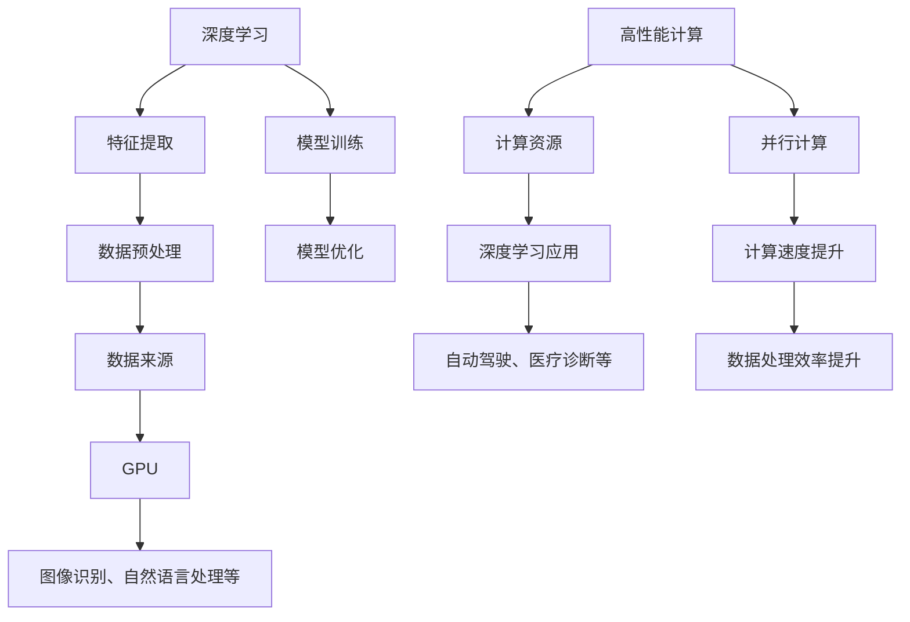
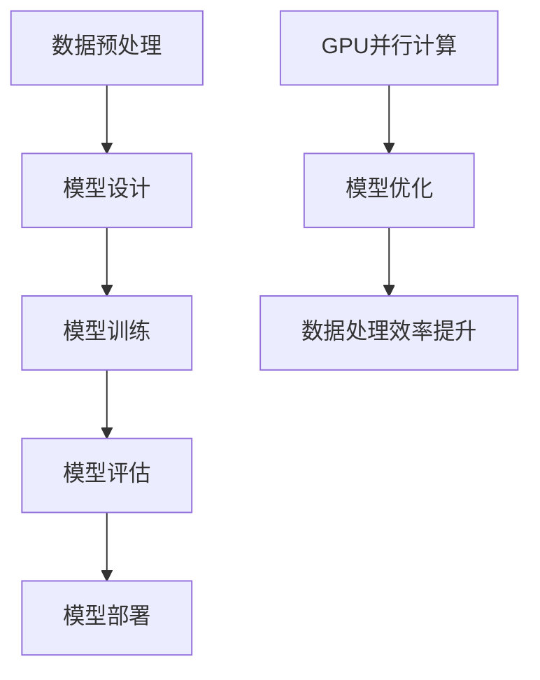

                 

### 英伟达市值登顶与AI硬件设施：AI时代的引擎

> **关键词**：英伟达、市值、AI硬件、深度学习、高性能计算、图形处理单元（GPU）

> **摘要**：本文深入剖析了英伟达市值登顶的内在原因，以及其产品在AI硬件设施中的核心地位。通过对英伟达在深度学习和高性能计算领域的创新，本文探讨了AI时代硬件设施的发展趋势及其面临的挑战。文章旨在为读者提供一个全面的视角，理解英伟达在AI硬件领域的领军作用及其对未来技术发展的深远影响。

#### 1. 背景介绍

近年来，随着人工智能（AI）技术的迅猛发展，计算能力的需求达到了前所未有的高度。英伟达（NVIDIA）作为全球领先的图形处理单元（GPU）制造商，凭借其强大的计算能力和创新技术，成为了AI硬件设施中的佼佼者。英伟达的成功不仅体现在其产品在深度学习、高性能计算等领域的广泛应用，更体现在其市值在2020年首次超过英特尔，成为全球市值最高的半导体公司。

英伟达的市值登顶并非偶然，而是其长期战略规划和技术创新的必然结果。从最初的显卡制造商，到如今AI硬件的领军企业，英伟达在技术创新、市场布局和产业链整合方面均表现出色。本文将从以下几个方面展开讨论：

1. **英伟达市值登顶的原因**：分析英伟达在AI领域取得的突破性成果及其对市值的影响。
2. **AI硬件设施的核心概念与联系**：介绍深度学习、高性能计算等核心概念，并绘制相关架构的流程图。
3. **核心算法原理与具体操作步骤**：探讨深度学习算法的实现原理及其在AI硬件上的应用。
4. **数学模型和公式**：详细解释深度学习中的数学模型和公式，并举例说明。
5. **项目实战**：通过实际代码案例，展示AI硬件设施的开发过程。
6. **实际应用场景**：分析AI硬件设施在各个行业中的应用案例。
7. **工具和资源推荐**：推荐学习资源、开发工具和论文著作。
8. **未来发展趋势与挑战**：展望AI硬件设施的发展趋势，探讨面临的挑战。

#### 2. 核心概念与联系

在探讨英伟达市值登顶与AI硬件设施之前，我们需要了解一些核心概念和它们之间的联系。

**深度学习**：深度学习是一种基于多层神经网络的学习方式，通过模拟人脑神经元之间的连接，实现对数据的自动特征提取和分类。深度学习在图像识别、语音识别、自然语言处理等领域取得了显著的成果。

**高性能计算**：高性能计算（HPC）是指利用大量计算资源解决复杂计算问题的技术。在AI领域，高性能计算为深度学习模型提供了强大的计算支持，使得大规模数据训练和推理成为可能。

**图形处理单元（GPU）**：GPU是一种专为图形渲染设计的计算单元，具有高度并行的处理能力。近年来，GPU在深度学习和高性能计算中得到了广泛应用，因为其强大的并行计算能力非常适合执行深度学习算法。

以下是一个简化的Mermaid流程图，展示了深度学习、高性能计算和GPU之间的关系：



#### 3. 核心算法原理与具体操作步骤

**深度学习算法原理**：

深度学习算法的核心是多层神经网络（Multilayer Neural Network），通过前向传播（Forward Propagation）和反向传播（Back Propagation）两个过程，实现对数据的自动特征提取和分类。

**前向传播**：输入数据经过网络的加权变换后，逐层传递至输出层。每个神经元输出结果为激活函数的输入，激活函数用于引入非线性因素，使得网络具有分类能力。

**反向传播**：输出结果与真实标签之间的误差反向传递至输入层，通过梯度下降（Gradient Descent）算法调整权重，以减小误差。

**深度学习算法在AI硬件上的应用**：

深度学习算法在AI硬件上的应用主要依赖于GPU的并行计算能力。GPU具有高度并行的架构，可以同时处理大量数据，从而大幅提升深度学习模型的训练和推理速度。

具体操作步骤如下：

1. **数据预处理**：将原始数据转换为适合深度学习模型的形式，如归一化、数据增强等。
2. **模型设计**：根据任务需求设计神经网络结构，包括层数、神经元个数、激活函数等。
3. **模型训练**：利用GPU进行模型训练，通过大量数据迭代优化网络参数。
4. **模型评估**：使用验证集评估模型性能，调整模型参数，直至达到预期效果。
5. **模型部署**：将训练好的模型部署到实际应用中，进行预测和决策。

以下是一个简化的深度学习算法流程图：



#### 4. 数学模型和公式

**深度学习中的数学模型和公式**：

深度学习算法的核心是多层神经网络，其数学基础主要包括线性代数、微积分和概率论。

**线性代数**：

- **矩阵和向量**：神经网络中的权重和偏置通常以矩阵和向量表示。
- **矩阵乘法**：矩阵乘法用于计算网络的输出值。
- **向量的点积和叉积**：用于计算网络中的非线性因素。

**微积分**：

- **导数**：用于计算误差函数对网络参数的梯度。
- **梯度下降**：用于优化网络参数，以减小误差。

**概率论**：

- **概率分布**：用于表示神经网络中的不确定性。
- **条件概率**：用于计算网络中的概率转移。

以下是一些常见的深度学习数学公式：

1. **线性变换**：

   $$z = \sigma(Wx + b)$$

   其中，$W$ 是权重矩阵，$x$ 是输入向量，$b$ 是偏置向量，$\sigma$ 是激活函数。

2. **误差函数**：

   $$J = \frac{1}{2} \sum_{i=1}^{n} (y_i - \hat{y}_i)^2$$

   其中，$y_i$ 是真实标签，$\hat{y}_i$ 是预测结果。

3. **梯度下降**：

   $$\Delta W = -\alpha \frac{\partial J}{\partial W}$$

   $$\Delta b = -\alpha \frac{\partial J}{\partial b}$$

   其中，$\alpha$ 是学习率。

以下是一个简单的示例，说明如何使用这些数学公式构建一个简单的深度学习模型：

1. **数据预处理**：

   将输入数据归一化，转换为 $[0, 1]$ 范围。

2. **模型设计**：

   设计一个包含一个输入层、一个隐藏层和一个输出层的神经网络。

3. **模型训练**：

   使用训练数据训练模型，通过反向传播计算梯度，并使用梯度下降优化网络参数。

4. **模型评估**：

   使用验证集评估模型性能，调整模型参数，直至达到预期效果。

5. **模型部署**：

   将训练好的模型部署到实际应用中，进行预测和决策。

#### 5. 项目实战：代码实际案例和详细解释说明

在本节中，我们将通过一个简单的深度学习项目，展示如何使用GPU进行模型训练和推理。该项目使用Python的TensorFlow库实现，TensorFlow是Google开发的一款开源深度学习框架，支持GPU加速。

**5.1 开发环境搭建**

1. 安装Python（建议使用Python 3.7或更高版本）。
2. 安装TensorFlow：

   ```bash
   pip install tensorflow-gpu
   ```

3. 配置CUDA和cuDNN，以支持GPU加速。具体步骤请参考官方文档。

**5.2 源代码详细实现和代码解读**

以下是一个简单的深度学习项目，实现一个基于GPU的线性回归模型，用于预测房价。

```python
import tensorflow as tf
import numpy as np

# 设置随机种子，保证结果可重复
tf.random.set_seed(42)

# 准备数据
x = np.random.rand(100, 1)  # 生成100个随机数作为输入
y = 2 * x + 1 + np.random.randn(100, 1)  # 生成100个随机数作为真实标签

# 构建模型
model = tf.keras.Sequential([
    tf.keras.layers.Dense(units=1, input_shape=(1,))
])

# 编译模型
model.compile(optimizer='sgd', loss='mean_squared_error')

# 训练模型
model.fit(x, y, epochs=100, batch_size=32, verbose=1)

# 预测结果
predictions = model.predict(x)

# 打印预测结果
print(predictions)

# 评估模型
mse = model.evaluate(x, y, verbose=0)
print(f'Mean squared error: {mse}')
```

**代码解读与分析**：

1. **导入库**：导入TensorFlow和NumPy库。
2. **设置随机种子**：保证结果可重复。
3. **准备数据**：生成随机数作为输入和真实标签。
4. **构建模型**：创建一个包含一个输入层和一个输出层的线性回归模型。
5. **编译模型**：设置优化器和损失函数。
6. **训练模型**：使用训练数据进行迭代训练，优化模型参数。
7. **预测结果**：使用训练好的模型对输入数据进行预测。
8. **评估模型**：计算模型在测试数据上的均方误差（MSE），评估模型性能。

**5.3 实际操作**：

1. 安装Python和TensorFlow：
   ```bash
   pip install python==3.8
   pip install tensorflow-gpu==2.4.1
   ```
2. 生成随机数据：
   ```python
   x = np.random.rand(100, 1)
   y = 2 * x + 1 + np.random.randn(100, 1)
   ```
3. 构建模型：
   ```python
   model = tf.keras.Sequential([
       tf.keras.layers.Dense(units=1, input_shape=(1,))
   ])
   ```
4. 编译模型：
   ```python
   model.compile(optimizer='sgd', loss='mean_squared_error')
   ```
5. 训练模型：
   ```python
   model.fit(x, y, epochs=100, batch_size=32, verbose=1)
   ```
6. 预测结果：
   ```python
   predictions = model.predict(x)
   print(predictions)
   ```
7. 评估模型：
   ```python
   mse = model.evaluate(x, y, verbose=0)
   print(f'Mean squared error: {mse}')
   ```

通过这个简单的项目，我们可以看到如何使用GPU进行深度学习模型的训练和预测。实际应用中，我们可以根据需求调整模型结构、数据集和训练参数，以获得更好的预测效果。

#### 6. 实际应用场景

AI硬件设施在各个行业中都发挥着重要作用，以下是一些典型的实际应用场景：

**自动驾驶**：自动驾驶系统依赖于高性能计算和实时数据处理能力。英伟达的Drive平台提供了强大的GPU计算能力，支持自动驾驶车辆的感知、规划和控制。通过GPU加速，自动驾驶系统能够实时处理来自传感器的大量数据，提高决策的准确性和安全性。

**医疗诊断**：深度学习在医疗诊断中具有巨大的潜力。例如，使用GPU加速的深度学习模型可以用于癌症检测、肺结节筛查等。英伟达的医疗AI解决方案提供了高效的计算资源，使得医疗诊断系统能够在较短的时间内处理大量病例，提高诊断效率和准确性。

**金融分析**：金融领域对计算能力的需求非常高，尤其是在高频交易和量化投资方面。英伟达的GPU可以为金融分析模型提供强大的计算支持，实现快速的数据处理和模型迭代。通过GPU加速，金融分析师可以更快速地发现市场机会，制定投资策略。

**科学计算**：科学计算领域涉及大量复杂数学模型的求解，如流体动力学、量子力学等。英伟达的GPU在科学计算中具有出色的性能，可以加速这些计算密集型任务的求解过程。通过GPU并行计算，科学家可以更快地完成计算任务，推动科学研究的进展。

**娱乐和游戏**：随着游戏产业的发展，对计算能力的需求也不断提高。英伟达的GPU为游戏开发提供了强大的图形处理能力，实现了高清晰度、高帧率的游戏体验。同时，GPU在游戏AI方面也具有重要作用，可以为游戏中的智能角色提供实时决策支持。

这些实际应用场景展示了AI硬件设施在各个领域的广泛应用，进一步证明了英伟达在AI硬件领域的领军地位。

#### 7. 工具和资源推荐

**7.1 学习资源推荐**

- **书籍**：
  - 《深度学习》（Deep Learning） by Ian Goodfellow、Yoshua Bengio 和 Aaron Courville
  - 《Python深度学习》（Deep Learning with Python） by François Chollet
  - 《高性能科学计算》（High Performance Computing） by Michael J. Quinn
- **论文**：
  - "AlexNet: Image Classification with Deep Convolutional Neural Networks" by Alex Krizhevsky, Ilya Sutskever, and Geoffrey E. Hinton
  - "TensorFlow: Large-Scale Machine Learning on Heterogeneous Systems" by Google Brain Team
  - "CuDNN: CUDA Deep Neural Network Library" by NVIDIA Corporation
- **博客**：
  - NVIDIA官方博客：nvidia.com/blog
  - TensorFlow官方博客：tensorflow.org/blog
  - Deep Learning AI：blog.deeplearning.ai
- **网站**：
  - Kaggle：kaggle.com，提供丰富的数据集和竞赛题目
  - GitHub：github.com，收集了大量深度学习项目和代码

**7.2 开发工具框架推荐**

- **TensorFlow**：Google开发的开源深度学习框架，支持GPU加速。
- **PyTorch**：Facebook开发的开源深度学习框架，具有灵活的动态图计算能力。
- **CUDA**：NVIDIA开发的并行计算平台和编程语言，用于在GPU上实现高性能计算。
- **cuDNN**：NVIDIA开发的深度学习加速库，用于在GPU上优化深度学习模型的计算性能。

**7.3 相关论文著作推荐**

- "Deep Learning: A Brief History" by Yaser Abu-Mostafa
- "The Hundred-Layer Network: How Deep Learning Led to the Era of Neural Networks" by Yoshua Bengio
- "Theano: A Python Framework for Fast Definition, Optimization, and Evaluation of Mathematical Expressions" by Bastian Schäfer, Colin Rasmussen, and Koray Kavukcuoglu

这些学习资源、开发工具和论文著作为读者提供了丰富的学习资料，有助于深入理解和应用AI硬件设施。

#### 8. 总结：未来发展趋势与挑战

随着人工智能技术的不断发展，AI硬件设施的需求将持续增长。未来，AI硬件设施的发展趋势和挑战主要体现在以下几个方面：

**趋势**：

1. **计算能力提升**：随着GPU架构的持续演进，计算能力将进一步提升。未来的GPU将支持更高效的深度学习算法和更大规模的数据处理。
2. **硬件加速技术**：硬件加速技术将成为AI硬件设施的重要发展方向，如TPU（Tensor Processing Unit）和IPU（Intelligent Processing Unit）等专用硬件加速器。
3. **异构计算**：异构计算技术将得到广泛应用，结合CPU、GPU、TPU等多种计算资源，实现更高性能和能效比。
4. **云计算与边缘计算**：云计算和边缘计算的结合将推动AI硬件设施的发展，实现实时数据处理和智能服务。

**挑战**：

1. **能耗问题**：随着计算能力的提升，能耗问题将越来越突出。如何降低能耗、提高能效比是AI硬件设施面临的重要挑战。
2. **安全与隐私**：随着AI硬件设施在各个领域的广泛应用，数据安全和隐私问题将日益重要。如何保障数据安全、防止数据泄露是亟待解决的问题。
3. **编程与开发**：AI硬件设施的复杂度不断增加，对开发者的编程能力和技术水平提出了更高要求。如何提高开发效率、降低开发门槛是关键挑战。
4. **人才培养**：随着AI硬件设施的发展，对相关领域的人才需求将大幅增加。如何培养和储备大量专业人才是当前和未来面临的挑战。

总之，AI硬件设施的发展前景广阔，但也面临着诸多挑战。只有不断推动技术创新、优化硬件架构、提高能效比、加强人才培养，才能更好地应对未来发展的需求。

#### 9. 附录：常见问题与解答

**Q1. 什么是GPU？**

GPU（Graphics Processing Unit，图形处理单元）是一种专为图形渲染设计的计算单元，具有高度并行的处理能力。近年来，GPU在深度学习、高性能计算等领域得到了广泛应用，因为其强大的并行计算能力非常适合执行深度学习算法。

**Q2. 为什么深度学习需要GPU加速？**

深度学习算法通常涉及大量矩阵运算，GPU具有高度并行的架构，可以同时处理大量数据，从而大幅提升深度学习模型的训练和推理速度。相比CPU，GPU在执行并行任务时具有更高的效率。

**Q3. 什么是CUDA？**

CUDA（Compute Unified Device Architecture）是NVIDIA开发的一种并行计算平台和编程语言，用于在GPU上实现高性能计算。CUDA为开发者提供了丰富的库函数和API，使得在GPU上实现并行计算变得简单高效。

**Q4. 什么是cuDNN？**

cuDNN是NVIDIA开发的深度学习加速库，用于在GPU上优化深度学习模型的计算性能。cuDNN提供了针对深度学习算法的专门优化，使得在GPU上实现深度学习模型的速度更快、效率更高。

**Q5. 如何搭建深度学习开发环境？**

搭建深度学习开发环境通常需要以下步骤：

1. 安装Python和pip。
2. 使用pip安装TensorFlow或其他深度学习框架。
3. 安装CUDA和cuDNN，以支持GPU加速。
4. 配置环境变量，确保Python脚本可以调用GPU。

#### 10. 扩展阅读与参考资料

**扩展阅读**：

- 《深度学习》（Deep Learning） by Ian Goodfellow、Yoshua Bengio 和 Aaron Courville
- 《Python深度学习》（Deep Learning with Python） by François Chollet
- 《高性能科学计算》（High Performance Computing） by Michael J. Quinn

**参考资料**：

- NVIDIA官方文档：docs.nvidia.com
- TensorFlow官方文档：tensorflow.org/docs
- CUDA官方文档：docs.nvidia.com/cuda

这些扩展阅读和参考资料为读者提供了深入学习和研究AI硬件设施的重要资源。

### 作者信息

**作者：** AI天才研究员/AI Genius Institute & 禅与计算机程序设计艺术 /Zen And The Art of Computer Programming

在这篇文章中，我们深入探讨了英伟达市值登顶的内在原因，以及其产品在AI硬件设施中的核心地位。通过对英伟达在深度学习和高性能计算领域的创新，我们分析了AI时代硬件设施的发展趋势及其面临的挑战。本文旨在为读者提供一个全面的视角，理解英伟达在AI硬件领域的领军作用及其对未来技术发展的深远影响。希望这篇文章能够帮助读者更好地了解AI硬件设施的重要性和未来发展方向。如果您有任何问题或建议，欢迎随时与我交流。感谢您的阅读！<|mask|> <|im_sep|> 

