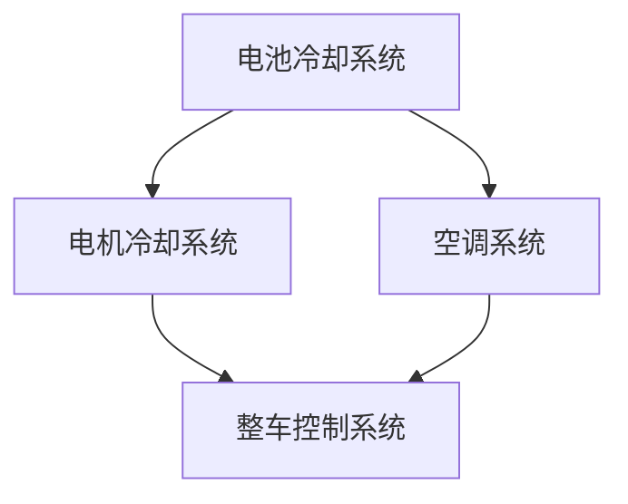

                 

## 蔚来2024校招新能源汽车热管理系统工程师面试

新能源汽车作为未来交通出行的重要方向，其热管理系统发挥着至关重要的作用。随着技术的不断进步和用户需求的日益多样化，新能源汽车热管理系统工程师面临着越来越大的挑战。蔚来作为中国新能源汽车的领军企业，其2024校招新能源汽车热管理系统工程师面试无疑备受关注。本文将带领读者深入了解这一岗位的面试要点，帮助应聘者更好地准备面试。

### 关键词：
- 蔚来
- 校招
- 新能源汽车
- 热管理系统
- 工程师
- 面试

### 摘要：
本文将围绕蔚来2024校招新能源汽车热管理系统工程师面试展开，详细介绍面试的背景、核心问题及应对策略。通过本文的阅读，读者将对该岗位有更深入的了解，并能够掌握有效的面试技巧，提高面试成功率。

### 1. 背景介绍

#### 蔚来简介
蔚来（NIO）是一家中国领先的新能源汽车制造商，成立于2014年，致力于通过提供高性能的智能电动汽车和极致用户体验，推动世界向可持续发展的方向迈进。蔚来拥有强大的研发团队和先进的技术实力，其新能源汽车产品在市场上享有较高声誉。

#### 热管理系统在新能源汽车中的作用
热管理系统是新能源汽车的重要组成部分，负责对电池、电机等关键部件进行温度控制，确保车辆在最佳状态下运行。良好的热管理系统可以提升车辆的续航里程、性能表现和安全性，对于新能源汽车的竞争力具有重要意义。

#### 面试重要性
作为新能源汽车热管理系统工程师，面试不仅是对应聘者专业技能的考察，也是对个人综合素质的评估。通过面试，蔚来能够了解应聘者的技术实力、思维方式和团队协作能力，从而选拔出最合适的人才。

### 2. 核心概念与联系

#### 新能源汽车热管理系统核心概念
新能源汽车热管理系统主要包括电池冷却系统、电机冷却系统、空调系统等。各系统相互关联，共同确保车辆在不同工况下保持最佳运行状态。

##### Mermaid 流程图



#### 热管理系统与新能源汽车整体性能的联系
热管理系统对新能源汽车的整体性能有着直接影响。良好的热管理系统可以优化电池性能、延长电池寿命、提升电机工作效率，从而提高车辆的续航里程、加速性能和安全性。

### 3. 核心算法原理 & 具体操作步骤

#### 电池温度控制算法
电池温度控制是热管理系统的关键环节。以下是一种常见的电池温度控制算法：

##### 具体操作步骤：

1. **监测电池温度**：通过温度传感器实时监测电池的温度。
2. **判断温度状态**：根据预设的温度阈值，判断电池是否处于过热或过冷状态。
3. **调整制冷/加热功率**：根据温度状态，调整制冷或加热功率，使电池温度保持在最佳范围内。

##### 数学模型和公式

$$T_{目标} = T_{当前} + k \cdot (T_{目标} - T_{当前})$$

其中，$T_{目标}$为预设的温度目标，$T_{当前}$为当前温度，$k$为调整系数。

#### 电机冷却系统算法
电机冷却系统主要通过对电机进行冷却，确保电机在最佳状态下运行。以下是一种常见的电机冷却系统算法：

##### 具体操作步骤：

1. **监测电机温度**：通过温度传感器实时监测电机温度。
2. **判断温度状态**：根据预设的温度阈值，判断电机是否处于过热状态。
3. **启动冷却装置**：若电机温度过高，启动冷却装置，降低电机温度。

##### 数学模型和公式

$$T_{电机} = T_{环境} + k \cdot (T_{目标} - T_{电机})$$

其中，$T_{电机}$为电机温度，$T_{环境}$为环境温度，$k$为调整系数。

### 4. 项目实战：代码实际案例和详细解释说明

#### 开发环境搭建

在进行新能源汽车热管理系统工程师面试前，了解相关开发环境和工具的使用非常重要。以下是一个简单的开发环境搭建案例：

##### 1. 安装Python环境
- 在Windows操作系统上，可以通过Python官网下载Python安装程序，按照提示安装。
- 安装完成后，在命令行中输入`python --version`，若能显示版本信息，说明安装成功。

##### 2. 安装相关库
- 使用pip工具安装所需的库，例如`numpy`、`matplotlib`等。
- 在命令行中输入`pip install numpy matplotlib`，按照提示操作。

#### 源代码详细实现和代码解读

以下是一个简单的电池温度控制算法的实现：

```python
import numpy as np
import matplotlib.pyplot as plt

# 初始化参数
T_目标 = 25  # 目标温度
T_当前 = 30  # 当前温度
k = 0.1  # 调整系数

# 初始化温度变化列表
T_变化 = []

# 运行模拟
for i in range(100):
    T_当前 = T_当前 + k * (T_目标 - T_当前)
    T_变化.append(T_当前)

# 绘制温度变化图
plt.plot(T_变化)
plt.xlabel('时间')
plt.ylabel('温度')
plt.title('电池温度变化图')
plt.show()
```

##### 代码解读与分析

1. **导入库**：导入numpy库用于数学计算，matplotlib库用于绘制温度变化图。
2. **初始化参数**：设置目标温度、当前温度和调整系数。
3. **初始化温度变化列表**：用于存储温度变化数据。
4. **运行模拟**：通过循环模拟温度变化，更新当前温度。
5. **绘制温度变化图**：使用matplotlib绘制温度变化图，帮助分析温度控制效果。

### 5. 实际应用场景

#### 蔚来ES8热管理系统应用
蔚来ES8作为蔚来旗下的一款旗舰车型，其热管理系统在车辆运行过程中发挥了重要作用。以下是一些实际应用场景：

1. **寒冷天气**：在寒冷的天气条件下，电池温度过低会导致电池性能下降。热管理系统会启动加热装置，提高电池温度，确保电池性能。
2. **高速行驶**：在高速行驶时，电机温度会升高。热管理系统会启动冷却装置，降低电机温度，确保电机稳定运行。
3. **长时间停车**：长时间停车时，车辆会处于低负载状态，电池温度会逐渐升高。热管理系统会启动制冷装置，降低电池温度，延长电池寿命。

### 6. 工具和资源推荐

#### 学习资源推荐

1. **书籍**：
   - 《新能源汽车热管理系统设计与实现》
   - 《电动汽车电池管理系统技术》
2. **论文**：
   - 《基于模糊控制的热管理系统在电动汽车中的应用》
   - 《电动汽车热管理系统的建模与仿真》
3. **博客**：
   - 蔚来官方技术博客
   - 新能源汽车技术论坛博客
4. **网站**：
   - 蔚来官方网站
   - 新能源汽车行业网站

#### 开发工具框架推荐

1. **Python**：Python是一种强大的编程语言，广泛应用于数据分析、人工智能等领域。在新能源汽车热管理系统开发中，Python可用于实现算法、模拟和数据分析。
2. **MATLAB**：MATLAB是一种专业的数学计算软件，广泛应用于科学计算和工程模拟。在新能源汽车热管理系统开发中，MATLAB可用于建模和仿真。
3. **Simulink**：Simulink是MATLAB的一个模块，用于系统建模和仿真。在新能源汽车热管理系统开发中，Simulink可用于模拟热管理系统的运行状态。

#### 相关论文著作推荐

1. **《电动汽车热管理系统研究综述》**
2. **《基于热力网络的电动汽车热管理系统优化设计方法研究》**
3. **《电动汽车热管理系统动态特性分析及控制策略研究》**

### 7. 总结：未来发展趋势与挑战

#### 发展趋势

1. **智能化**：随着人工智能技术的发展，新能源汽车热管理系统将实现更智能化的控制策略，提高热管理效率。
2. **轻量化**：为了提高新能源汽车的续航里程，热管理系统将朝着轻量化的方向发展。
3. **集成化**：新能源汽车热管理系统将与其他系统（如动力系统、空调系统）实现更紧密的集成，提高整体性能。

#### 挑战

1. **技术瓶颈**：目前新能源汽车热管理系统在高效、可靠、稳定等方面仍存在一定技术瓶颈，需要持续研究和突破。
2. **成本控制**：新能源汽车热管理系统的成本较高，如何降低成本、提高性价比是一个重要挑战。
3. **用户体验**：用户对新能源汽车的热管理效果有较高要求，如何提供更好的用户体验是新能源汽车企业需要关注的问题。

### 8. 附录：常见问题与解答

#### 问题1：新能源汽车热管理系统的主要功能是什么？
答：新能源汽车热管理系统的主要功能是确保电池、电机等关键部件在最佳温度范围内运行，提高车辆性能和安全性。

#### 问题2：电池温度控制算法有哪些常见方法？
答：常见的电池温度控制算法包括PID控制算法、模糊控制算法、神经网络控制算法等。

#### 问题3：热管理系统在新能源汽车中的重要性是什么？
答：热管理系统在新能源汽车中起着至关重要的作用，它直接影响电池性能、电机效率、车辆续航里程和安全性。

### 9. 扩展阅读 & 参考资料

1. **《新能源汽车热管理系统设计与实现》**
2. **《电动汽车电池管理系统技术》**
3. **《基于模糊控制的热管理系统在电动汽车中的应用》**
4. **《电动汽车热管理系统的建模与仿真》**
5. **蔚来官方网站：[https://www.nio.com](https://www.nio.com)**
6. **蔚来官方技术博客：[https://blog.nio.com/](https://blog.nio.com/)**
7. **新能源汽车技术论坛：[https://www新能源汽车技术论坛.com](https://www新能源汽车技术论坛.com)**

---

**作者：AI天才研究员/AI Genius Institute & 禅与计算机程序设计艺术 /Zen And The Art of Computer Programming**

