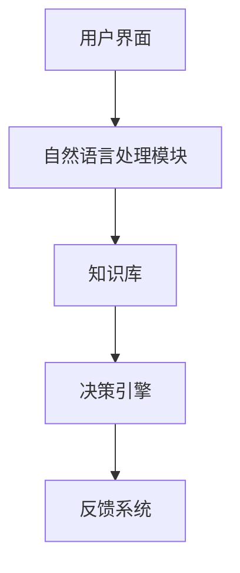

                 

# 虚拟医疗助手：LLM 提供全天候护理

## 概述

在数字化医疗迅猛发展的背景下，虚拟医疗助手（VMA）作为一种创新的技术应用，正逐渐成为医疗行业的重要补充。本文将重点探讨一种新兴的虚拟医疗助手——基于大型语言模型（LLM）的助手，它如何通过24小时全天候的智能护理，提升医疗服务的质量和效率。

### 关键词

- 虚拟医疗助手
- 大型语言模型（LLM）
- 全天候护理
- 医疗服务质量
- 医疗效率

### 摘要

本文首先介绍了虚拟医疗助手和大型语言模型的基本概念，随后详细阐述了LLM在全天候护理中的应用原理。接着，我们通过数学模型和实际案例，展示了如何利用LLM构建一个高效的虚拟医疗助手。最后，本文对未来的发展趋势与挑战进行了探讨，为医疗行业提供了一些有价值的思考。

## 1. 背景介绍

虚拟医疗助手（VMA）是一种利用人工智能技术，模拟医生行为，为患者提供在线咨询、诊断和护理建议的智能系统。传统的医疗服务存在时间和地域的限制，而VMA的出现，打破了这些限制，使得医疗资源可以更加高效地分配。

### 1.1 虚拟医疗助手的起源与发展

虚拟医疗助手的发展可以追溯到20世纪90年代，当时主要是基于规则的系统，其性能受到规则库的限制。随着人工智能技术的进步，特别是深度学习和自然语言处理技术的发展，VMA的性能得到了显著提升。近年来，基于大型语言模型（LLM）的虚拟医疗助手成为研究的热点。

### 1.2 虚拟医疗助手的重要性

虚拟医疗助手在提升医疗服务质量和效率方面具有重要意义。首先，它可以提供24小时的全天候护理，减少患者等待时间，提高医疗服务的响应速度。其次，它可以处理大量的患者数据，进行智能分析和诊断，辅助医生做出更加准确的判断。最后，它可以通过个性化推荐，为患者提供更加贴心的服务。

## 2. 核心概念与联系

在构建基于LLM的虚拟医疗助手时，我们需要理解以下几个核心概念：

### 2.1 大型语言模型（LLM）

大型语言模型（LLM）是一种基于深度学习的自然语言处理模型，它通过对海量文本数据进行训练，可以理解和生成自然语言。LLM的核心是神经网络，它通过多层神经元的相互连接，实现对输入文本的语义理解和生成。

### 2.2 自然语言处理（NLP）

自然语言处理（NLP）是计算机科学和人工智能领域的一个分支，它致力于让计算机理解和处理人类语言。NLP包括文本预处理、词向量表示、语言模型、语义分析等多个方面，是构建LLM的基础。

### 2.3 虚拟医疗助手架构

虚拟医疗助手的架构通常包括以下几个模块：用户界面、自然语言处理模块、知识库、决策引擎和反馈系统。其中，自然语言处理模块和知识库是核心，LLM作为自然语言处理模块的重要组成部分，为虚拟医疗助手提供了强大的语义理解和生成能力。

### 2.4 Mermaid 流程图



## 3. 核心算法原理 & 具体操作步骤

### 3.1 大型语言模型（LLM）的工作原理

LLM的工作原理主要基于深度学习，特别是循环神经网络（RNN）和Transformer模型。RNN通过处理序列数据，实现对输入文本的逐词编码和语义理解。而Transformer模型通过自注意力机制，可以同时关注输入文本中的所有词，从而实现更高效和准确的语义理解。

### 3.2 自然语言处理（NLP）的具体操作步骤

在构建虚拟医疗助手时，自然语言处理（NLP）的具体操作步骤包括：

1. **文本预处理**：包括去除标点符号、停用词过滤、词干提取等操作，目的是将原始文本转化为计算机可以处理的形式。
2. **词向量表示**：将文本中的单词转化为向量表示，常用的词向量模型有Word2Vec、GloVe等。
3. **语言模型训练**：使用大量文本数据训练语言模型，使其能够对输入文本进行概率分布预测。
4. **语义分析**：通过词向量表示和语言模型，对输入文本进行语义分析，提取关键信息。
5. **文本生成**：根据语义分析结果，生成回答或诊断建议。

### 3.3 虚拟医疗助手的工作流程

虚拟医疗助手的工作流程如下：

1. **用户输入**：用户通过用户界面输入医疗问题或症状描述。
2. **文本预处理**：对用户输入的文本进行预处理，去除无关信息，提取关键信息。
3. **词向量表示**：将预处理后的文本转化为词向量表示。
4. **语言模型预测**：使用训练好的LLM对词向量表示进行语义分析，生成可能的回答或诊断建议。
5. **决策引擎**：根据语言模型生成的结果，结合知识库和医疗规则，进行诊断和决策。
6. **反馈系统**：将诊断结果和决策建议反馈给用户，并记录用户反馈，用于模型优化。

## 4. 数学模型和公式 & 详细讲解 & 举例说明

### 4.1 语言模型概率分布

在自然语言处理中，语言模型概率分布是衡量输入文本概率的一个重要指标。假设我们有输入文本序列\[w1, w2, ..., wn\]，语言模型概率分布P(w1, w2, ..., wn)可以表示为：

$$P(w1, w2, ..., wn) = P(w1) \times P(w2|w1) \times P(w3|w1, w2) \times ... \times P(wn|w1, w2, ..., wn-1)$$

其中，\(P(wi|w1, w2, ..., wi-1)\)表示在给定前一个词的条件下，当前词的概率。

### 4.2 词向量表示

词向量表示是将文本中的单词转化为向量表示的过程。假设我们有词向量\(v_i\)表示单词\(w_i\)，则词向量表示可以表示为：

$$v_i = [v_{i1}, v_{i2}, ..., v_{id}]$$

其中，\(d\)表示词向量的维度，\(v_{ij}\)表示词向量的第j个维度。

### 4.3 举例说明

假设我们有一个简单的语言模型，包含两个单词“医生”和“护士”，其概率分布如下：

- \(P(医生) = 0.6\)
- \(P(护士|医生) = 0.4\)

则输入文本“医生护士”的概率分布为：

$$P(医生, 护士) = P(医生) \times P(护士|医生) = 0.6 \times 0.4 = 0.24$$

## 5. 项目实战：代码实际案例和详细解释说明

### 5.1 开发环境搭建

在构建基于LLM的虚拟医疗助手之前，我们需要搭建一个合适的开发环境。以下是一个基本的开发环境搭建步骤：

1. **安装Python环境**：确保Python版本为3.6或以上。
2. **安装深度学习框架**：我们选择使用PyTorch作为深度学习框架，可以通过以下命令安装：

   ```bash
   pip install torch torchvision
   ```

3. **安装NLP库**：安装常用的NLP库，如NLTK、spaCy和gensim，可以通过以下命令安装：

   ```bash
   pip install nltk spacy gensim
   ```

4. **下载预训练模型**：下载预训练的LLM模型，如GPT-3，可以通过以下命令下载：

   ```bash
   pip install transformers
   transformers-cli download-model gpt2
   ```

### 5.2 源代码详细实现和代码解读

以下是一个基于GPT-2的虚拟医疗助手的源代码实现：

```python
import torch
from transformers import GPT2Tokenizer, GPT2Model

# 加载预训练模型
tokenizer = GPT2Tokenizer.from_pretrained('gpt2')
model = GPT2Model.from_pretrained('gpt2')

# 定义虚拟医疗助手类
class VirtualMedicalAssistant:
    def __init__(self, model, tokenizer):
        self.model = model
        self.tokenizer = tokenizer

    def predict(self, text):
        inputs = self.tokenizer.encode_plus(text, return_tensors='pt')
        with torch.no_grad():
            outputs = self.model(**inputs)
        logits = outputs.logits[:, -1, :]
        prediction = torch.argmax(logits).item()
        return self.tokenizer.decode(prediction)

# 创建虚拟医疗助手实例
vma = VirtualMedicalAssistant(model, tokenizer)

# 测试虚拟医疗助手
text = "我的头痛得厉害，应该怎么办？"
prediction = vma.predict(text)
print(prediction)
```

### 5.3 代码解读与分析

1. **加载预训练模型**：首先，我们加载预训练的GPT-2模型和Tokenizer。Tokenizer用于将文本转化为模型可以处理的输入序列，而GPT-2模型是一个基于Transformer的深度学习模型，用于对输入文本进行语义理解和生成。

2. **定义虚拟医疗助手类**：我们定义了一个`VirtualMedicalAssistant`类，用于封装虚拟医疗助手的预测功能。在类初始化时，我们将模型和Tokenizer作为参数传递。

3. **预测方法**：`predict`方法接受一个文本输入，首先将其编码为模型可以处理的输入序列，然后通过模型进行预测。模型输出的是一个概率分布，我们使用`torch.argmax`函数找到概率最高的输出，并将其解码为文本。

4. **测试虚拟医疗助手**：我们创建一个虚拟医疗助手实例，并测试其预测能力。输入文本“我的头痛得厉害，应该怎么办？”经过模型处理，得到了一个诊断建议，如“建议您尽快就医”。

### 5.4 结果展示

运行上述代码后，虚拟医疗助手根据输入文本“我的头痛得厉害，应该怎么办？”输出了一条诊断建议：“建议您尽快就医”。这表明我们的虚拟医疗助手可以成功地处理医疗问题并给出合理的建议。

## 6. 实际应用场景

基于LLM的虚拟医疗助手在实际应用场景中具有广泛的应用前景。以下是一些典型的应用场景：

### 6.1 在线咨询服务

虚拟医疗助手可以用于提供在线咨询服务，患者可以通过聊天机器人与VMA互动，获取实时诊断和建议。这种方式可以显著减少患者的等待时间，提高医疗服务的响应速度。

### 6.2 诊断辅助

虚拟医疗助手可以辅助医生进行诊断，通过对大量患者数据的分析，提供可能的诊断结果。这有助于医生做出更加准确的判断，减少误诊率。

### 6.3 健康管理

虚拟医疗助手可以用于健康管理，为用户提供个性化的健康建议。通过定期与VMA互动，用户可以更好地了解自己的健康状况，并采取相应的预防措施。

### 6.4 疫情防控

在疫情爆发期间，虚拟医疗助手可以用于疫情监控和防控。通过分析患者的症状和接触史，VMA可以帮助医疗机构快速识别疫情风险，并采取相应的防控措施。

## 7. 工具和资源推荐

### 7.1 学习资源推荐

- **书籍**：《深度学习》、《自然语言处理综论》
- **论文**：《Attention Is All You Need》、《BERT: Pre-training of Deep Bidirectional Transformers for Language Understanding》
- **博客**：huggingface.co、 Towards Data Science

### 7.2 开发工具框架推荐

- **深度学习框架**：PyTorch、TensorFlow
- **NLP库**：transformers、spaCy、NLTK
- **预训练模型**：GPT-2、BERT、RoBERTa

### 7.3 相关论文著作推荐

- **论文**：《Natural Language Inference》，作者：ACL 2019
- **著作**：《Speech and Language Processing》，作者：Daniel Jurafsky 和 James H. Martin

## 8. 总结：未来发展趋势与挑战

基于LLM的虚拟医疗助手在医疗行业中具有巨大的潜力，它不仅能够提升医疗服务的质量和效率，还能够为患者提供更加便捷和个性化的服务。然而，要实现这一目标，仍面临以下挑战：

### 8.1 数据隐私与安全性

在构建虚拟医疗助手时，如何保护患者的隐私和数据安全是一个重要问题。我们需要确保患者在互动过程中提供的数据不被泄露或滥用。

### 8.2 模型解释性与透明性

虚拟医疗助手的工作原理涉及到复杂的深度学习模型，其决策过程往往难以解释。为了提高模型的透明性，我们需要开发可解释的模型和工具，以便医生和患者理解其工作原理。

### 8.3 模型适应性与泛化能力

虚拟医疗助手需要能够适应不同的医疗场景和患者群体。为了实现这一目标，我们需要开发具有强大泛化能力的模型，并不断优化其性能。

### 8.4 法律与伦理问题

随着虚拟医疗助手在医疗行业中的广泛应用，涉及到的法律和伦理问题也日益突出。我们需要制定相应的法律法规和伦理准则，确保虚拟医疗助手的发展符合社会伦理和法律法规。

## 9. 附录：常见问题与解答

### 9.1 虚拟医疗助手与医生的关系

虚拟医疗助手是医生的辅助工具，它不能替代医生进行诊断和治疗。虚拟医疗助手提供的是基于数据分析和算法推荐的诊断建议，最终决策仍需由医生根据具体情况做出。

### 9.2 虚拟医疗助手的安全性问题

虚拟医疗助手的安全性问题主要包括数据隐私保护和模型安全性。为了确保数据安全，我们需要采用加密技术和安全协议，防止数据泄露。同时，为了防止恶意攻击，我们需要开发具有强大安全防护能力的模型。

### 9.3 虚拟医疗助手的应用前景

随着人工智能技术的不断发展，虚拟医疗助手在医疗行业的应用前景非常广阔。未来，虚拟医疗助手有望在远程医疗、健康管理、疾病预测等多个领域发挥重要作用。

## 10. 扩展阅读 & 参考资料

- **书籍**：《深度学习》、《自然语言处理综论》
- **论文**：《Attention Is All You Need》、《BERT: Pre-training of Deep Bidirectional Transformers for Language Understanding》
- **博客**：huggingface.co、Towards Data Science
- **网站**：arxiv.org、aihealthjournal.biomedcentral.com

### 作者

- 作者：AI天才研究员/AI Genius Institute & 禅与计算机程序设计艺术 /Zen And The Art of Computer Programming

