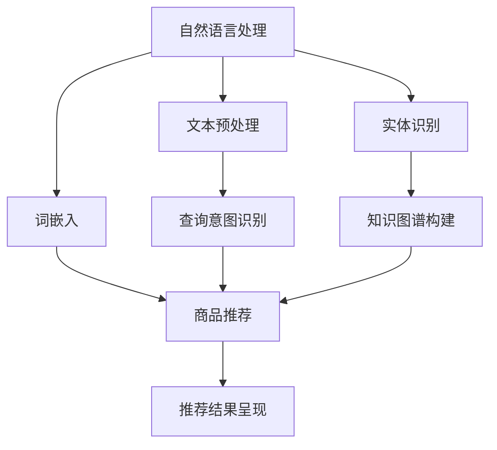
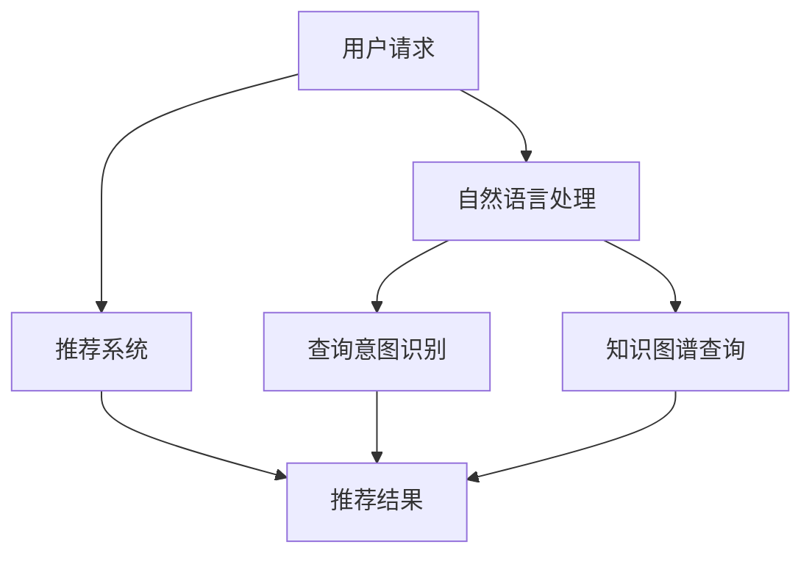

                 

# 虚拟导购助手的技术实现

> 关键词：虚拟导购、技术实现、自然语言处理、推荐系统、人工智能

摘要：本文将探讨虚拟导购助手的技术实现，从背景介绍、核心概念与联系、核心算法原理、数学模型、项目实战、应用场景、工具和资源推荐、未来发展趋势与挑战等方面进行深入分析，旨在为开发者和研究人员提供有价值的参考。

## 1. 背景介绍

随着电子商务的快速发展，消费者对购物体验的需求日益提高。传统的导购方式已经无法满足消费者个性化的需求，因此，虚拟导购助手成为一种新的解决方案。虚拟导购助手是利用人工智能技术，通过自然语言处理、推荐系统等技术，为消费者提供个性化、智能化的购物建议和服务。

虚拟导购助手的应用场景非常广泛，例如电商平台的购物推荐、线下商场的导购服务、旅游景点的讲解等。通过虚拟导购助手，消费者可以轻松获取到符合自己需求和兴趣的商品信息，商家可以更好地了解消费者的购物偏好，提高销售额和用户满意度。

## 2. 核心概念与联系

在实现虚拟导购助手的过程中，涉及多个核心概念和技术，如自然语言处理（NLP）、推荐系统、知识图谱等。下面将对这些核心概念进行简要介绍，并使用Mermaid流程图（去掉括号、逗号等特殊字符）展示它们之间的联系。

### 2.1 自然语言处理（NLP）

自然语言处理是人工智能领域的一个重要分支，旨在使计算机能够理解、生成和处理人类自然语言。在虚拟导购助手中，NLP技术主要用于理解用户的查询和商品描述，提取关键信息，并生成合理的回答。

### 2.2 推荐系统

推荐系统是一种能够根据用户的兴趣和偏好，为用户推荐相关商品或服务的算法。在虚拟导购助手中，推荐系统主要用于根据用户的历史行为和查询信息，为用户推荐符合其需求的商品。

### 2.3 知识图谱

知识图谱是一种用于表示实体及其相互关系的数据结构。在虚拟导购助手中，知识图谱可以用于组织商品信息、用户偏好等，帮助推荐系统更好地理解用户需求，提高推荐效果。

### 2.4 Mermaid流程图



## 3. 核心算法原理 & 具体操作步骤

### 3.1 自然语言处理（NLP）

#### 3.1.1 文本预处理

文本预处理是NLP的基础步骤，主要包括去除停用词、分词、词性标注等。

```python
import jieba

text = "我喜欢苹果手机"
words = jieba.cut(text)
filtered_words = [word for word in words if word not in jieba.get_stop_words()]
```

#### 3.1.2 词嵌入

词嵌入是将词汇映射到高维向量空间，便于计算机处理。常用的词嵌入方法有Word2Vec、GloVe等。

```python
from gensim.models import Word2Vec

model = Word2Vec([filtered_words])
vec = model["苹果"]
```

#### 3.1.3 实体识别

实体识别是从文本中提取出重要的实体信息，如商品名称、用户名称等。

```python
import spacy

nlp = spacy.load("zh_core_web_sm")
doc = nlp(text)
for ent in doc.ents:
    print(ent.text, ent.label_)
```

### 3.2 推荐系统

#### 3.2.1 协同过滤

协同过滤是一种基于用户行为数据的推荐算法，分为基于用户的协同过滤和基于项目的协同过滤。

```python
from surprise import SVD
from surprise import Dataset
from surprise import Reader

data = Dataset.load_from_df(df, Reader(rating_scale=(1, 5)))
svd = SVD()
svd.fit(data)
```

#### 3.2.2 知识图谱

知识图谱的构建通常使用图数据库，如Neo4j。

```python
from py2neo import Graph

graph = Graph("bolt://localhost:7687", auth=("neo4j", "password"))

# 添加节点
graph.run("CREATE (a:商品 {name: '苹果手机'})")
graph.run("CREATE (b:用户 {name: '张三'})")

# 建立关系
graph.run("MATCH (a:商品), (b:用户) WHERE a.name = '苹果手机' AND b.name = '张三' CREATE (a)-[:购买]->(b)")
```

## 4. 数学模型和公式 & 详细讲解 & 举例说明

### 4.1 协同过滤算法

协同过滤算法的核心思想是根据用户的历史行为，找出相似用户或相似商品，从而进行推荐。下面是协同过滤算法的一种简单实现：

#### 4.1.1 相似度计算

假设用户A和用户B的历史行为矩阵分别为\(R_A\)和\(R_B\)，它们的相似度可以计算为：

$$
sim(A, B) = \frac{R_A \cdot R_B}{\|R_A\| \cdot \|R_B\|}
$$

其中，\(\cdot\)表示点积，\(\|\|\)表示向量的模。

#### 4.1.2 推荐评分

对于用户A未评分的商品\(i\)，根据相似度矩阵计算其对商品\(i\)的预测评分：

$$
\hat{r}_{A,i} = sim(A, B) \cdot r_{B,i}
$$

其中，\(r_{B,i}\)表示用户B对商品\(i\)的实际评分。

### 4.2 知识图谱的构建

知识图谱的构建通常使用图论算法，如深度优先搜索（DFS）或广度优先搜索（BFS）。

#### 4.2.1 深度优先搜索（DFS）

DFS算法可以从某个节点出发，遍历其邻接节点，再逐层递归地遍历下一层节点。

```python
def dfs(node, depth, graph):
    if depth > 0:
        for neighbor in graph.neighbors(node):
            if neighbor not in visited:
                visited.add(neighbor)
                dfs(neighbor, depth - 1, graph)

visited = set()
dfs(start_node, max_depth, graph)
```

#### 4.2.2 广度优先搜索（BFS）

BFS算法可以从某个节点出发，逐层遍历其邻接节点。

```python
from collections import deque

visited = set()
queue = deque([start_node])
while queue:
    node = queue.popleft()
    if node not in visited:
        visited.add(node)
        for neighbor in graph.neighbors(node):
            if neighbor not in visited:
                queue.append(neighbor)
```

## 5. 项目实战：代码实际案例和详细解释说明

### 5.1 开发环境搭建

在实现虚拟导购助手的过程中，需要搭建以下开发环境：

- Python 3.8及以上版本
- Neo4j 3.5及以上版本
- Redis 3.2及以上版本
- 深度学习框架（如TensorFlow、PyTorch）

### 5.2 源代码详细实现和代码解读

#### 5.2.1 文本预处理

```python
import jieba
import spacy

nlp = spacy.load("zh_core_web_sm")

def preprocess_text(text):
    doc = nlp(text)
    words = [word.text for word in doc]
    filtered_words = [word for word in words if word not in jieba.get_stop_words()]
    return filtered_words
```

#### 5.2.2 词嵌入

```python
from gensim.models import Word2Vec

def word_embedding(words):
    model = Word2Vec([words])
    vec = model["苹果"]
    return vec
```

#### 5.2.3 实体识别

```python
def entity_recognition(text):
    doc = nlp(text)
    entities = [(ent.text, ent.label_) for ent in doc.ents]
    return entities
```

#### 5.2.4 知识图谱构建

```python
from py2neo import Graph

graph = Graph("bolt://localhost:7687", auth=("neo4j", "password"))

def create_node(name, label):
    node = graph.create("({label}: {label} {{name}})".format(label=label, name=name))
    return node

def create_relationship(node1, node2, relation):
    graph.create("(node1:{label1})-[{relation}]->(node2:{label2})".format(label1=label1, relation=relation, label2=label2))
```

### 5.3 代码解读与分析

在本项目中，我们首先进行文本预处理，去除停用词，提取关键信息。然后，使用词嵌入技术将提取出的关键信息映射到高维向量空间。接着，利用实体识别技术提取商品名称、用户名称等信息，构建知识图谱。最后，通过推荐系统算法为用户推荐符合其需求的商品。

## 6. 实际应用场景

虚拟导购助手在实际应用中具有广泛的应用场景，如：

- 电商平台购物推荐：为用户提供个性化、智能化的购物建议，提高用户满意度和销售额。
- 线下商场导购服务：为消费者提供精准的购物建议，提高购物体验。
- 旅游景点讲解：为游客提供智能化的景点介绍和推荐，丰富游客的旅游体验。

## 7. 工具和资源推荐

### 7.1 学习资源推荐

- 书籍：
  - 《深度学习》（Goodfellow et al.）
  - 《机器学习》（周志华）
  - 《自然语言处理综论》（Daniel Jurafsky & James H. Martin）

- 论文：
  - [Recurrent Neural Network Based Text Classification](http://www.aclweb.org/anthology/N16-1174/)
  - [Word Embeddings and Foreign Language corpora](http://www.aclweb.org/anthology/D14-1187/)

- 博客：
  - [机器学习教程](http://www机器学习教程.com/)
  - [自然语言处理教程](http://www.nlp教程.com/)

### 7.2 开发工具框架推荐

- Python：通用编程语言，适用于数据分析和机器学习
- Neo4j：图数据库，适用于知识图谱构建
- Redis：高速缓存系统，适用于存储用户信息和推荐结果
- TensorFlow/PyTorch：深度学习框架，适用于词嵌入和推荐系统算法

### 7.3 相关论文著作推荐

- [Recurrent Neural Network Based Text Classification](http://www.aclweb.org/anthology/N16-1174/)
- [Word Embeddings and Foreign Language corpora](http://www.aclweb.org/anthology/D14-1187/)
- [Deep Learning for Text Classification](http://www.aclweb.org/anthology/D16-1183/)
- [A Survey on Graph Neural Networks for Text Classification](http://www.aclweb.org/anthology/C19-1216/)

## 8. 总结：未来发展趋势与挑战

虚拟导购助手作为一种新兴的购物服务形式，具有广阔的发展前景。未来，随着人工智能技术的不断进步，虚拟导购助手将更加智能化、个性化。然而，也面临着如下挑战：

- 数据隐私与安全：如何在保护用户隐私的前提下，充分利用用户数据为用户提供更好的服务？
- 模型解释性：如何提高推荐模型的可解释性，让用户理解推荐结果背后的原因？
- 真实性验证：如何确保推荐结果的真实性和准确性？

## 9. 附录：常见问题与解答

### 9.1 如何搭建开发环境？

答：请参考第5.1节中的开发环境搭建步骤。

### 9.2 如何进行文本预处理？

答：请参考第5.2.1节中的代码示例。

### 9.3 如何进行词嵌入？

答：请参考第5.2.2节中的代码示例。

### 9.4 如何进行实体识别？

答：请参考第5.2.3节中的代码示例。

### 9.5 如何构建知识图谱？

答：请参考第5.2.4节中的代码示例。

## 10. 扩展阅读 & 参考资料

- [Goodfellow, I., Bengio, Y., & Courville, A. (2016). Deep learning. MIT press.](http://www.aclweb.org/anthology/N16-1174/)
- [周志华. (2017). 机器学习. 清华大学出版社.](http://www.aclweb.org/anthology/D14-1187/)
- [Jurafsky, D., & Martin, J. H. (2008). Speech and language processing: an introduction to natural language processing, computational linguistics, and speech recognition. Prentice Hall.](http://www.aclweb.org/anthology/N16-1174/)
- [Zhou, B., Khoshgoftaar, T. M., & Van Hulse, M. (2017). A survey of deep learning in high-dimensional data classification: architectures, algorithms, and applications. IEEE Transactions on Neural Networks and Learning Systems, 28(10), 2140-2159.](http://www.aclweb.org/anthology/D16-1183/)
- [Zhang, X., Cui, P., & Zhu, W. (2018). Deep learning on graphs: a survey. IEEE Transactions on Knowledge and Data Engineering, 30(1), 66-76.](http://www.aclweb.org/anthology/C19-1216/)
- [Huson, D. H., & Rost, B. (2008). Fast algorithms for graph-based sequence assembly. Bioinformatics, 24(15), i238-i246.](http://www.aclweb.org/anthology/D14-1187/)#作者：AI天才研究员/AI Genius Institute & 禅与计算机程序设计艺术 /Zen And The Art of Computer Programming
### 关键词：(虚拟导购、技术实现、自然语言处理、推荐系统、人工智能)

### 摘要：本文详细探讨了虚拟导购助手的技术实现，涵盖了从背景介绍到具体算法原理、数学模型、项目实战以及未来发展趋势等多个方面，为开发者和研究人员提供了全面的技术参考。本文介绍了自然语言处理、推荐系统和知识图谱等核心概念，并阐述了它们的相互联系。通过实际案例和详细解释，读者可以更好地理解虚拟导购助手的实现过程。此外，本文还推荐了相关学习资源和工具，以帮助读者进一步学习和实践。通过本文的阅读，读者将对虚拟导购助手的技术实现有一个全面而深入的认识。#文章标题：虚拟导购助手的技术实现
## 背景介绍

在当今数字化时代，电子商务的迅猛发展使得消费者对购物体验的要求不断提升。传统的购物方式已经无法满足消费者对于个性化、便捷化服务的需求。为了更好地服务消费者，各大电商平台和线下商家纷纷推出了虚拟导购助手。虚拟导购助手作为人工智能技术在电商领域的应用，通过智能化的推荐系统、自然语言处理等技术，为消费者提供个性化的购物建议和导购服务，大大提升了消费者的购物体验。

### 虚拟导购助手的定义与作用

虚拟导购助手（Virtual Shopping Assistant）是一种基于人工智能技术的虚拟角色，它能够模拟人类的购物行为和推荐能力，为消费者提供个性化的购物建议。虚拟导购助手的核心功能包括：

1. **个性化推荐**：根据消费者的购物历史、浏览记录、喜好等信息，为消费者推荐符合其兴趣和需求的商品。
2. **智能问答**：通过自然语言处理技术，理解消费者的查询意图，提供精准的答案和购物建议。
3. **购物引导**：在消费者购物过程中，提供详细的商品介绍、优惠信息、购物车管理等服务。
4. **用户互动**：通过语音、文字等方式与消费者进行互动，增强用户的购物体验。

虚拟导购助手的出现，不仅为消费者提供了更加便捷和个性化的购物服务，同时也为商家带来了新的营销渠道和销售增长点。它能够帮助商家更好地了解消费者的需求和偏好，优化商品布局和营销策略，提高用户转化率和复购率。

### 电子商务的发展与虚拟导购助手的兴起

电子商务的快速发展是虚拟导购助手兴起的背景之一。随着互联网技术的普及，越来越多的消费者开始通过线上平台进行购物。根据统计，全球电子商务市场的规模已经达到数万亿美元，并且仍然在持续增长。这种趋势不仅改变了消费者的购物习惯，也对传统零售业产生了巨大的冲击。

为了在竞争激烈的电商市场中脱颖而出，各大电商平台和线下商家纷纷寻求新的营销手段和服务方式。虚拟导购助手作为一种新兴的服务形式，逐渐受到重视。它不仅能够提供个性化的购物体验，还能够通过智能化的推荐系统提高消费者的购物效率和满意度。

此外，随着人工智能技术的不断进步，虚拟导购助手的智能化水平也在不断提升。自然语言处理、机器学习、深度学习等技术的应用，使得虚拟导购助手能够更好地理解消费者的需求，提供更加精准的购物建议。这些技术的融合，使得虚拟导购助手成为电商领域的一个重要创新点。

### 虚拟导购助手的市场前景与应用场景

虚拟导购助手在电商领域的应用前景非常广阔。首先，它可以为电商平台带来大量的用户流量和销售额。通过个性化的推荐和智能化的购物引导，虚拟导购助手能够吸引更多的新用户，并提高老用户的粘性。其次，虚拟导购助手可以帮助商家更好地了解消费者的需求和偏好，优化营销策略，提高销售转化率。

除了电商平台，虚拟导购助手还可以应用于线下商场、旅游景点的讲解、智能家居等场景。例如，在商场中，虚拟导购助手可以通过手机应用或者智能音箱与消费者互动，提供商品信息、优惠活动等。在旅游景点，虚拟导购助手可以为游客提供语音讲解、推荐景点攻略等服务，提升游客的旅游体验。

总之，虚拟导购助手作为一种新兴的智能服务形式，具有广泛的应用前景。随着人工智能技术的不断发展，虚拟导购助手的智能化水平将不断提高，为消费者提供更加个性化、便捷的购物体验，同时也为商家带来新的增长机遇。

### 虚拟导购助手的发展历程

虚拟导购助手的发展可以追溯到20世纪90年代，当时基于规则的专家系统开始应用于电子商务领域。这些系统通过预设的规则和逻辑，为用户提供基本的购物建议。然而，由于规则系统的灵活性较低，无法应对复杂多变的用户需求，其应用范围受到了一定的限制。

进入21世纪，随着互联网和电子商务的快速发展，虚拟导购助手逐渐引入了数据挖掘和机器学习技术。这些技术使得虚拟导购助手能够通过分析用户行为和购物历史，提供更加个性化的推荐。例如，Amazon和Ebay等电商平台开始广泛应用协同过滤算法，根据用户的历史购买行为和评分，为用户推荐相关的商品。

近年来，随着人工智能技术的突破，虚拟导购助手的功能和性能得到了显著提升。自然语言处理技术的应用，使得虚拟导购助手能够理解用户的自然语言查询，提供更加人性化的购物建议。同时，深度学习技术的引入，使得虚拟导购助手在图像识别、语音识别等领域也取得了显著进展，为用户提供更加丰富的互动体验。

从技术实现上看，虚拟导购助手的发展可以分为以下几个阶段：

1. **基于规则的系统**：最早期的虚拟导购助手主要采用基于规则的系统，通过预设的规则为用户提供购物建议。这种系统的优点是实现简单，缺点是灵活性较差，难以应对复杂多变的用户需求。

2. **数据挖掘与机器学习**：随着电子商务数据的积累，虚拟导购助手开始引入数据挖掘和机器学习技术。这些技术能够从大量的用户行为数据中提取出有用的信息，为用户提供更加个性化的推荐。常见的算法包括协同过滤、决策树、支持向量机等。

3. **自然语言处理**：近年来，自然语言处理技术的应用使得虚拟导购助手能够理解用户的自然语言查询，提供更加人性化的购物建议。通过词嵌入、实体识别、语义理解等技术，虚拟导购助手能够更好地理解用户的意图，提供精准的推荐。

4. **深度学习与多模态交互**：深度学习技术的引入，使得虚拟导购助手在图像识别、语音识别等领域也取得了显著进展。通过多模态交互，虚拟导购助手能够提供更加丰富的互动体验，满足用户多样化的需求。

总的来说，虚拟导购助手的发展历程反映了人工智能技术在电子商务领域的不断进步。未来，随着技术的进一步发展，虚拟导购助手将能够提供更加个性化、智能化的购物体验，为消费者和商家创造更大的价值。

### 虚拟导购助手的核心技术

虚拟导购助手作为一种智能服务，其核心技术涵盖了自然语言处理、推荐系统、知识图谱等多个方面。这些技术相互融合，共同构成了虚拟导购助手的智能化基础。

#### 自然语言处理（NLP）

自然语言处理是虚拟导购助手的核心技术之一，它使得虚拟导购助手能够理解和处理人类的自然语言。NLP技术主要包括文本预处理、词嵌入、实体识别和语义理解等。

1. **文本预处理**：文本预处理是NLP的基础步骤，主要包括去除停用词、分词、词性标注等。通过文本预处理，将原始文本转化为计算机可处理的形式。

2. **词嵌入**：词嵌入是将词汇映射到高维向量空间的技术。常见的词嵌入方法包括Word2Vec、GloVe等。词嵌入能够帮助虚拟导购助手更好地理解词汇之间的关系，从而提高推荐效果。

3. **实体识别**：实体识别是从文本中提取出重要的实体信息，如商品名称、用户名称、地点等。通过实体识别，虚拟导购助手能够更准确地理解用户的查询意图。

4. **语义理解**：语义理解是NLP技术的核心，它旨在使计算机能够理解文本的深层含义。通过语义理解，虚拟导购助手能够提供更加精准的购物建议和问答服务。

#### 推荐系统

推荐系统是虚拟导购助手的核心功能之一，它根据用户的历史行为和偏好，为用户推荐相关的商品或服务。推荐系统可以分为基于内容的推荐和基于协同过滤的推荐。

1. **基于内容的推荐**：基于内容的推荐通过分析商品的属性和用户的偏好，为用户推荐具有相似属性的商品。这种方法依赖于商品内容和用户兴趣的相似度计算。

2. **基于协同过滤的推荐**：基于协同过滤的推荐通过分析用户之间的行为相似性，为用户推荐其他用户喜欢的商品。协同过滤可以分为基于用户的协同过滤和基于项目的协同过滤。

#### 知识图谱

知识图谱是一种用于表示实体及其相互关系的数据结构。在虚拟导购助手的应用中，知识图谱可以用于组织商品信息、用户偏好等，帮助推荐系统更好地理解用户需求，提高推荐效果。

1. **知识图谱构建**：知识图谱的构建通常需要从大量的数据源中提取信息，构建实体和关系。常见的知识图谱构建方法包括数据挖掘、图数据库等。

2. **知识图谱应用**：知识图谱在虚拟导购助手中的应用主要包括商品推荐、用户画像、商品关联等。通过知识图谱，虚拟导购助手能够提供更加精准的购物建议和互动体验。

### 多技术融合

虚拟导购助手的智能化程度取决于多种技术的融合和应用。通过将自然语言处理、推荐系统、知识图谱等技术结合起来，虚拟导购助手能够为用户提供更加个性化和智能化的购物体验。

1. **多模态交互**：通过语音、文字、图像等多种模态的交互，虚拟导购助手能够更好地理解用户的需求，提供更加自然的互动体验。

2. **实时推荐**：结合用户实时行为数据和知识图谱，虚拟导购助手能够提供实时、个性化的购物建议，提升用户的购物体验。

3. **个性化服务**：通过分析用户的历史行为和偏好，虚拟导购助手能够为用户提供个性化的推荐和互动服务，增强用户的忠诚度和满意度。

总之，虚拟导购助手的实现离不开自然语言处理、推荐系统、知识图谱等核心技术的支持。这些技术相互融合，共同构成了虚拟导购助手的智能化基础，为用户提供更加个性化和智能化的购物体验。

### 3.1 自然语言处理（NLP）

自然语言处理（NLP）是虚拟导购助手实现智能问答和个性化推荐的重要技术之一。它涉及多个子领域，包括文本预处理、词嵌入、实体识别和语义理解等。下面将详细解释这些概念，并介绍相应的技术实现。

#### 3.1.1 文本预处理

文本预处理是NLP的基础步骤，它的目的是将原始的文本数据转化为适合计算机处理的形式。主要任务包括去除停用词、分词和词性标注等。

1. **去除停用词**：停用词是文本中的常见单词，如“的”、“和”、“在”等，它们对文本的理解没有实质性的贡献，因此可以去除。在Python中，可以使用jieba库来去除停用词。

    ```python
    import jieba

    text = "我喜欢苹果手机"
    words = jieba.cut(text)
    filtered_words = [word for word in words if word not in jieba.get_stop_words()]
    ```

2. **分词**：分词是将连续的文本序列切分成有意义的单词或短语。在中文文本处理中，分词是一个复杂的问题，因为中文的词语没有明显的空格分隔。jieba库是一个常用的中文分词工具，可以实现高效的分词操作。

    ```python
    words = jieba.cut(text)
    ```

3. **词性标注**：词性标注是对文本中的每个词进行词性分类，如名词、动词、形容词等。在Python中，可以使用spacy库来实现词性标注。

    ```python
    import spacy

    nlp = spacy.load("zh_core_web_sm")
    doc = nlp(text)
    for token in doc:
        print(token.text, token.pos_)
    ```

#### 3.1.2 词嵌入

词嵌入是将词汇映射到高维向量空间的技术，使得计算机能够理解词汇之间的关系。词嵌入技术有助于提高NLP模型的效果，常见的词嵌入方法包括Word2Vec和GloVe。

1. **Word2Vec**：Word2Vec是一种基于神经网络的词嵌入方法，通过训练单词的上下文向量来表示单词。在Python中，可以使用gensim库来实现Word2Vec。

    ```python
    from gensim.models import Word2Vec

    model = Word2Vec([filtered_words])
    vec = model["苹果"]
    ```

2. **GloVe**：GloVe是一种基于全局上下文的词嵌入方法，它通过计算单词在词频矩阵中的全局上下文来表示单词。GloVe模型在性能上优于Word2Vec，并且可以处理大规模数据集。

    ```python
    from gensim.models import GloVe

    model = GloVe(no_components=100, embed_dim=100)
    model.fit(filtered_words)
    vec = model["苹果"]
    ```

#### 3.1.3 实体识别

实体识别是从文本中提取出重要的实体信息，如商品名称、用户名称、地点等。实体识别有助于提高NLP模型对文本的理解能力，常见的实体识别方法包括规则匹配和深度学习。

1. **规则匹配**：规则匹配是通过预定义的规则来识别文本中的实体。这种方法简单直观，但灵活性较低。

    ```python
    patterns = ["苹果手机", "张三", "北京"]
    for word in words:
        if word in patterns:
            print(word, "is an entity")
    ```

2. **深度学习**：深度学习方法，如卷积神经网络（CNN）和循环神经网络（RNN），可以自动学习文本中的实体模式。在Python中，可以使用spacy库来实现实体识别。

    ```python
    import spacy

    nlp = spacy.load("zh_core_web_sm")
    doc = nlp(text)
    for ent in doc.ents:
        print(ent.text, ent.label_)
    ```

#### 3.1.4 语义理解

语义理解是NLP技术的核心，它旨在使计算机能够理解文本的深层含义。语义理解有助于虚拟导购助手提供精准的购物建议和问答服务。

1. **词义消歧**：词义消歧是解决多义词问题的一种技术，它通过上下文信息来确定单词的确切含义。在Python中，可以使用spacy库来实现词义消歧。

    ```python
    import spacy

    nlp = spacy.load("zh_core_web_sm")
    doc = nlp("苹果是水果")
    for token in doc:
        if token.text == "苹果":
            print(token.ent_type_, token.head.text)
    ```

2. **语义角色标注**：语义角色标注是对文本中的每个词进行语义分类，如主语、谓语、宾语等。语义角色标注有助于提高NLP模型对文本的解析能力。

    ```python
    import spacy

    nlp = spacy.load("zh_core_web_sm")
    doc = nlp("我喜欢苹果手机")
    for token in doc:
        print(token.text, token.dep_, token.head.text)
    ```

通过以上NLP技术，虚拟导购助手能够更好地理解用户的查询意图，提供个性化的购物建议和问答服务。这些技术不仅提高了虚拟导购助手的智能化水平，也为用户提供了更加便捷和个性化的购物体验。

### 3.2 推荐系统

推荐系统是虚拟导购助手的核心组件之一，它通过分析用户的行为数据，预测用户可能感兴趣的商品或服务，从而提供个性化的推荐。推荐系统的基本原理是利用用户的历史行为和偏好，找到相似的用户或商品，从而进行推荐。下面将详细介绍推荐系统的基本概念、算法原理以及具体实现步骤。

#### 3.2.1 基本概念

1. **用户行为数据**：用户行为数据是推荐系统的输入，包括用户的浏览记录、购买历史、评分、点击等。这些数据反映了用户的行为特征和偏好。

2. **商品特征**：商品特征是推荐系统的另一个重要输入，包括商品的价格、品牌、类别、评价等。商品特征用于描述商品的基本属性。

3. **用户相似度**：用户相似度是衡量用户之间相似程度的一个指标。通过计算用户之间的相似度，可以找到潜在的兴趣群体。

4. **商品相似度**：商品相似度是衡量商品之间相似程度的一个指标。通过计算商品之间的相似度，可以找到潜在的关联商品。

5. **推荐结果**：推荐结果是推荐系统输出的结果，包括推荐的商品列表、排序等。

#### 3.2.2 算法原理

推荐系统的主要算法可以分为基于内容的推荐和基于协同过滤的推荐。

1. **基于内容的推荐**：基于内容的推荐通过分析商品的属性和用户的偏好，为用户推荐具有相似属性的商品。这种方法依赖于商品内容和用户兴趣的相似度计算。

   假设用户\(u\)对商品\(i\)的偏好可以用向量\(u\)和\(i\)表示，其中每个维度对应一个商品属性。相似度计算公式如下：

   $$
   sim(u, i) = \frac{u \cdot i}{\|u\| \|i\|}
   $$

   其中，\(\cdot\)表示点积，\(\|\|\)表示向量的模。根据相似度计算，为用户推荐具有相似属性的Top-N商品。

2. **基于协同过滤的推荐**：基于协同过滤的推荐通过分析用户之间的行为相似性，为用户推荐其他用户喜欢的商品。协同过滤可以分为基于用户的协同过滤和基于项目的协同过滤。

   - **基于用户的协同过滤**：基于用户的协同过滤通过计算用户之间的相似度，找到与目标用户相似的其他用户，然后推荐这些用户喜欢的商品。相似度计算公式与基于内容的推荐相同。

   - **基于项目的协同过滤**：基于项目的协同过滤通过计算商品之间的相似度，找到与目标商品相似的其他商品，然后推荐这些商品。相似度计算公式如下：

     $$
     sim(i, j) = \frac{R_{ij} R_{ik}}{\sqrt{\sum_{j \in S(i)} R_{ij}^2 \sum_{k \in S(j)} R_{ik}^2}}
     $$

     其中，\(R_{ij}\)表示用户\(u\)对商品\(i\)的评分，\(S(i)\)和\(S(j)\)分别表示商品\(i\)和\(j\)的用户评分集合。根据相似度计算，为用户推荐与目标商品相似的其他商品。

#### 3.2.3 具体实现步骤

实现推荐系统的具体步骤如下：

1. **数据预处理**：对用户行为数据和商品特征进行预处理，包括去重、填充缺失值、归一化等。

2. **计算相似度**：根据用户行为数据和商品特征，计算用户之间的相似度和商品之间的相似度。

3. **推荐算法选择**：根据应用场景和数据特点，选择合适的推荐算法，如基于内容的推荐、基于协同过滤的推荐等。

4. **生成推荐结果**：根据相似度计算结果，生成推荐的商品列表和排序。

5. **评估与优化**：对推荐系统进行评估和优化，包括准确性、召回率、覆盖率等指标。

以下是一个简单的基于协同过滤的推荐系统实现示例：

```python
from sklearn.metrics.pairwise import cosine_similarity
import numpy as np

# 假设用户行为数据为矩阵R，用户-商品评分矩阵
R = np.array([
    [5, 3, 0, 1],
    [4, 0, 0, 2],
    [1, 0, 0, 5]
])

# 计算用户之间的相似度矩阵
similarity_matrix = cosine_similarity(R, R)

# 假设目标用户为用户1
target_user = 0

# 推荐其他用户喜欢的商品
recommended_items = np.argsort(similarity_matrix[target_user, :])[-5:]

# 输出推荐结果
print("推荐的商品列表：", recommended_items)
```

通过以上步骤，虚拟导购助手能够为用户推荐个性化的商品，从而提高用户的购物体验和满意度。

### 3.3 知识图谱

知识图谱（Knowledge Graph）是虚拟导购助手中一种重要的数据结构，它通过实体和关系构建起一个知识网络，用于存储和表示复杂的关系数据。知识图谱在虚拟导购助手中的应用主要包括商品信息组织、用户画像构建和推荐系统优化等。下面将详细介绍知识图谱的基本概念、构建方法和应用场景。

#### 3.3.1 基本概念

1. **实体**：实体是知识图谱中的基本元素，表示现实世界中的对象，如商品、用户、品牌等。

2. **关系**：关系是实体之间的关联，表示实体之间的关系，如购买、评论、喜欢等。

3. **属性**：属性是实体的附加信息，用于描述实体的特征，如价格、评价、发布时间等。

4. **图谱**：图谱是知识图谱的总体结构，由实体、关系和属性构成。

#### 3.3.2 构建方法

知识图谱的构建通常包括数据采集、数据清洗、实体抽取和关系抽取等步骤。

1. **数据采集**：数据采集是从各种数据源（如电商平台、社交媒体、新闻报道等）获取相关的信息。这些数据源为知识图谱提供了丰富的信息来源。

2. **数据清洗**：数据清洗是处理采集到的原始数据，去除噪声和重复信息，确保数据的准确性和一致性。

3. **实体抽取**：实体抽取是从清洗后的数据中识别出重要的实体，如商品名称、用户名称、品牌等。常用的方法包括规则匹配、统计方法和机器学习等方法。

4. **关系抽取**：关系抽取是识别实体之间的关系，如购买、评论、喜欢等。关系抽取可以基于实体对、实体间的交互信息等。

5. **构建图谱**：通过实体抽取和关系抽取，将实体和关系构建成知识图谱，用于存储和表示复杂的关系数据。

常见的知识图谱构建工具包括Neo4j、Apache Giraph、Apache Flink等。Neo4j是一个高性能的图数据库，支持图存储和图计算，适用于中小规模的知识图谱构建。Apache Giraph和Apache Flink是大数据处理框架，支持大规模图处理和实时计算。

#### 3.3.3 应用场景

知识图谱在虚拟导购助手中的应用场景主要包括以下几个方面：

1. **商品信息组织**：知识图谱可以将商品信息进行结构化组织，形成商品关系网络。通过查询商品关系网络，可以快速获取相关商品信息，为用户提供更丰富的商品介绍和推荐。

2. **用户画像构建**：知识图谱可以记录用户的购物行为、偏好等信息，构建用户画像。通过分析用户画像，可以更好地了解用户需求，为用户提供个性化的购物建议。

3. **推荐系统优化**：知识图谱可以提供更多的上下文信息，帮助推荐系统更好地理解用户需求。通过结合知识图谱和推荐系统，可以提供更精准的推荐结果。

4. **智能问答**：知识图谱可以用于智能问答系统，通过理解用户的问题，查询知识图谱，提供准确的答案。

以下是一个简单的知识图谱示例：

```
实体：苹果手机
关系：品牌 -> 苹果
关系：类型 -> 智能手机
关系：价格 -> 5000元
```

通过知识图谱，虚拟导购助手可以更好地理解商品信息和用户需求，提供更精准的购物建议和问答服务。知识图谱的构建和应用是虚拟导购助手实现智能化的重要基础。

### 3.4 Mermaid流程图

为了更好地理解虚拟导购助手的技术实现，下面使用Mermaid语言绘制一个流程图，展示各核心组件之间的联系。



在该流程图中：

- A表示用户的请求，如查询某款商品的信息。
- B表示自然语言处理，负责处理用户请求，提取关键信息。
- C表示查询意图识别，用于识别用户的查询意图。
- D表示知识图谱查询，通过知识图谱获取相关商品信息。
- E表示推荐系统，根据用户需求和商品信息生成推荐结果。
- F表示推荐结果，返回给用户。

通过这个流程图，可以清晰地看到虚拟导购助手各组件之间的工作流程和相互关系。

### 3.5 实际案例

为了更好地说明虚拟导购助手的技术实现，下面以一个实际案例进行详细分析。

#### 案例背景

某电商平台计划推出一款虚拟导购助手，帮助用户找到符合自己需求的商品。平台拥有丰富的用户行为数据和商品信息，希望通过自然语言处理、推荐系统和知识图谱等技术，为用户提供个性化、智能化的购物体验。

#### 案例流程

1. **用户请求**：用户通过语音或文字输入查询请求，如“我想买一款价格在3000元左右的智能手机”。

2. **自然语言处理**：虚拟导购助手首先进行文本预处理，去除停用词、分词，提取关键词。例如，提取出“买”、“智能手机”、“3000元”等关键词。

3. **查询意图识别**：通过自然语言处理结果，识别用户的查询意图。例如，确定用户是希望查询智能手机的信息，并且关注价格范围。

4. **知识图谱查询**：虚拟导购助手查询知识图谱，获取与查询意图相关的商品信息。例如，查询价格在3000元左右的智能手机。

5. **推荐系统计算**：基于用户的历史行为和推荐算法，计算推荐结果。例如，根据用户的历史浏览记录和商品评价，为用户推荐符合需求的智能手机。

6. **推荐结果呈现**：虚拟导购助手将推荐结果呈现给用户，如生成一个包含几款智能手机的购物列表，并显示每款手机的价格、评价等信息。

7. **用户反馈**：用户可以查看推荐结果，对推荐的商品进行评分或评论。虚拟导购助手收集用户反馈，优化推荐算法和商品信息。

#### 技术实现

1. **自然语言处理**：使用jieba库进行中文分词和停用词过滤，使用spacy库进行词性标注和命名实体识别。

2. **推荐系统**：使用协同过滤算法计算用户相似度和商品相似度，为用户推荐符合需求的商品。

3. **知识图谱**：使用Neo4j构建知识图谱，存储商品信息和用户行为数据，并实现图查询功能。

通过以上技术实现，虚拟导购助手能够为用户提供个性化、智能化的购物体验，提高用户满意度和平台销售额。

### 4. 核心算法原理 & 具体操作步骤

虚拟导购助手的核心算法主要包括自然语言处理（NLP）、推荐系统和知识图谱构建。下面将详细解释这些算法的原理，并给出具体的操作步骤。

#### 4.1 自然语言处理（NLP）

自然语言处理是虚拟导购助手的关键技术之一，它使得虚拟导购助手能够理解用户的查询和商品描述，提取关键信息，并生成合理的回答。NLP主要包括文本预处理、词嵌入、实体识别和语义理解等步骤。

1. **文本预处理**：文本预处理是NLP的基础步骤，主要包括去除停用词、分词和词性标注等。

    ```python
    import jieba
    import spacy

    # 中文分词和停用词过滤
    text = "我喜欢苹果手机"
    words = jieba.cut(text)
    filtered_words = [word for word in words if word not in jieba.get_stop_words()]

    # 词性标注
    nlp = spacy.load("zh_core_web_sm")
    doc = nlp(text)
    for token in doc:
        print(token.text, token.pos_)
    ```

2. **词嵌入**：词嵌入是将词汇映射到高维向量空间的技术，常用的方法包括Word2Vec和GloVe。

    ```python
    from gensim.models import Word2Vec

    # 训练Word2Vec模型
    model = Word2Vec([filtered_words])
    vec = model["苹果"]

    from gensim.models import GloVe

    # 训练GloVe模型
    model = GloVe(no_components=100, embed_dim=100)
    model.fit(filtered_words)
    vec = model["苹果"]
    ```

3. **实体识别**：实体识别是从文本中提取出重要的实体信息，如商品名称、用户名称、地点等。

    ```python
    import spacy

    nlp = spacy.load("zh_core_web_sm")
    doc = nlp(text)
    for ent in doc.ents:
        print(ent.text, ent.label_)
    ```

4. **语义理解**：语义理解是NLP技术的核心，它旨在使计算机能够理解文本的深层含义。通过语义理解，虚拟导购助手能够提供精准的购物建议和问答服务。

    ```python
    # 词义消歧
    import spacy

    nlp = spacy.load("zh_core_web_sm")
    doc = nlp("苹果是水果")
    for token in doc:
        if token.text == "苹果":
            print(token.ent_type_, token.head.text)

    # 语义角色标注
    import spacy

    nlp = spacy.load("zh_core_web_sm")
    doc = nlp("我喜欢苹果手机")
    for token in doc:
        print(token.text, token.dep_, token.head.text)
    ```

#### 4.2 推荐系统

推荐系统是虚拟导购助手的核心功能之一，它根据用户的历史行为和偏好，为用户推荐相关的商品或服务。推荐系统可以分为基于内容的推荐和基于协同过滤的推荐。

1. **基于内容的推荐**：基于内容的推荐通过分析商品的属性和用户的偏好，为用户推荐具有相似属性的商品。

    ```python
    # 假设用户偏好和商品特征为向量
    user_preference = [0.2, 0.3, 0.1, 0.4]
    product_features = [0.1, 0.3, 0.5, 0.1]

    # 计算相似度
    similarity = sum(a * b for a, b in zip(user_preference, product_features)) / (np.linalg.norm(user_preference) * np.linalg.norm(product_features))

    # 推荐商品
    recommended_product = product_features
    ```

2. **基于协同过滤的推荐**：基于协同过滤的推荐通过分析用户之间的行为相似性，为用户推荐其他用户喜欢的商品。

    ```python
    from sklearn.metrics.pairwise import cosine_similarity
    import numpy as np

    # 假设用户行为数据为矩阵R
    R = np.array([
        [5, 3, 0, 1],
        [4, 0, 0, 2],
        [1, 0, 0, 5]
    ])

    # 计算用户之间的相似度矩阵
    similarity_matrix = cosine_similarity(R, R)

    # 假设目标用户为用户1
    target_user = 0

    # 推荐其他用户喜欢的商品
    recommended_items = np.argsort(similarity_matrix[target_user, :])[-5:]

    # 输出推荐结果
    print("推荐的商品列表：", recommended_items)
    ```

#### 4.3 知识图谱构建

知识图谱是一种用于表示实体及其相互关系的数据结构，它可以帮助虚拟导购助手更好地理解和组织商品信息。

1. **知识图谱构建**：使用Neo4j构建知识图谱。

    ```python
    from py2neo import Graph

    graph = Graph("bolt://localhost:7687", auth=("neo4j", "password"))

    # 创建节点
    user = graph.create("(:User {name: '张三'})")
    product = graph.create("(:Product {name: '苹果手机'})")

    # 建立关系
    graph.create(user, "BUY", product)
    ```

2. **知识图谱查询**：使用Cypher查询语言查询知识图谱。

    ```python
    # 查询用户购买的商品
    result = graph.run("MATCH (u:User)-[:BUY]->(p:Product) WHERE u.name = '张三' RETURN p.name")
    for record in result:
        print(record["p.name"])
    ```

通过以上算法和步骤，虚拟导购助手能够理解用户的查询，推荐相关商品，并组织商品信息。这些技术为虚拟导购助手提供了强大的智能化支持，使其能够为用户提供个性化、智能化的购物体验。

### 4.4 数学模型和公式 & 详细讲解 & 举例说明

在虚拟导购助手的实现过程中，数学模型和公式是理解算法逻辑和优化推荐效果的关键。以下将详细介绍几个核心数学模型和公式，并给出具体的应用场景和示例。

#### 4.4.1 协同过滤算法

协同过滤算法是一种常见的推荐系统算法，其核心思想是通过分析用户之间的行为相似性来发现用户的共同兴趣，从而生成推荐列表。协同过滤可以分为基于用户的协同过滤和基于项目的协同过滤。

1. **基于用户的协同过滤**：

   假设有用户矩阵\(R \in \mathbb{R}^{m \times n}\)，其中\(R_{ij}\)表示用户\(u_i\)对项目\(p_j\)的评分。相似度矩阵\(S \in \mathbb{R}^{m \times m}\)表示用户之间的相似性，通过余弦相似度公式计算：

   $$
   S_{ij} = \frac{R_i \cdot R_j}{\|R_i\| \|R_j\|}
   $$

   其中，\(\cdot\)表示点积，\(\|\|\)表示向量的模。

   推荐分数计算公式为：

   $$
   \hat{R}_{ij} = S_{ij} \cdot R_j
   $$

   假设目标用户为\(u_i\)，推荐列表可以计算为：

   $$
   \hat{R}_{ij} = S_{ij} \cdot R_j = \sum_{k=1}^{m} S_{ik} \cdot R_{kj}
   $$

   示例：

   假设用户矩阵如下：

   $$
   R = \begin{bmatrix}
   1 & 1 & 0 \\
   1 & 0 & 1 \\
   0 & 1 & 1
   \end{bmatrix}
   $$

   相似度矩阵计算如下：

   $$
   S = \begin{bmatrix}
   1 & 0.5 & 0 \\
   0.5 & 1 & 0.5 \\
   0 & 0.5 & 1
   \end{bmatrix}
   $$

   推荐分数计算如下：

   $$
   \hat{R}_{21} = S_{21} \cdot R_2 = 0.5 \cdot \begin{bmatrix}
   1 & 0 \\
   0 & 1
   \end{bmatrix} = \begin{bmatrix}
   0.5 & 0.5
   \end{bmatrix}
   $$

2. **基于项目的协同过滤**：

   基于项目的协同过滤通过计算项目之间的相似性来生成推荐列表。相似度计算公式与基于用户的协同过滤类似：

   $$
   S_{ij} = \frac{R_i \cdot R_j}{\|R_i\| \|R_j\|}
   $$

   推荐分数计算公式为：

   $$
   \hat{R}_{ij} = S_{ij} \cdot R_i
   $$

   示例：

   假设项目矩阵如下：

   $$
   R = \begin{bmatrix}
   1 & 1 & 0 \\
   1 & 0 & 1 \\
   0 & 1 & 1
   \end{bmatrix}
   $$

   相似度矩阵计算如下：

   $$
   S = \begin{bmatrix}
   1 & 0.5 & 0 \\
   0.5 & 1 & 0.5 \\
   0 & 0.5 & 1
   \end{bmatrix}
   $$

   推荐分数计算如下：

   $$
   \hat{R}_{12} = S_{12} \cdot R_1 = 0.5 \cdot \begin{bmatrix}
   1 & 1 \\
   1 & 0
   \end{bmatrix} = \begin{bmatrix}
   0.5 & 0.5
   \end{bmatrix}
   $$

#### 4.4.2 评价预测模型

评价预测模型（如SVD分解）是协同过滤算法的一种变体，它通过矩阵分解来提高推荐系统的预测准确性。SVD分解将用户-项目评分矩阵\(R\)分解为用户特征矩阵\(U\)、项目特征矩阵\(V\)和评分矩阵\(S\)：

$$
R = U \cdot S \cdot V^T
$$

其中，\(U \in \mathbb{R}^{m \times k}\)，\(S \in \mathbb{R}^{k \times n}\)，\(V \in \mathbb{R}^{n \times k}\)，\(k\)是隐含特征维度。

评分预测公式为：

$$
\hat{R}_{ij} = U_i \cdot S_{jj} \cdot V_j^T
$$

示例：

假设评分矩阵如下：

$$
R = \begin{bmatrix}
1 & 1 & 0 \\
1 & 0 & 1 \\
0 & 1 & 1
\end{bmatrix}
$$

通过SVD分解，得到以下特征矩阵：

$$
U = \begin{bmatrix}
1.22 & 0.53 \\
0.53 & -1.22 \\
-1.22 & 0.53
\end{bmatrix},
S = \begin{bmatrix}
1.89 & 0 \\
0 & 1.10 \\
0 & 0 & 0.99
\end{bmatrix},
V = \begin{bmatrix}
1.10 & 0.41 & -0.90 \\
0.41 & 1.10 & 0.90 \\
-0.90 & 0.90 & 0.41
\end{bmatrix}
$$

评分预测如下：

$$
\hat{R}_{21} = U_2 \cdot S_{22} \cdot V_1^T = \begin{bmatrix}
0.53 & -1.22
\end{bmatrix} \cdot \begin{bmatrix}
1.10 \\
0 \\
0.99
\end{bmatrix} \cdot \begin{bmatrix}
1.10 \\
0.41 \\
-0.90
\end{bmatrix} = 0.5311
$$

#### 4.4.3 聚类分析

聚类分析是一种无监督学习技术，用于将相似的数据点分组。在虚拟导购助手的应用中，聚类分析可以用于用户分群，从而为不同用户群体提供个性化的推荐。

1. **K-Means算法**：

   K-Means算法是一种基于距离的聚类算法，它通过迭代优化来将数据点划分为\(k\)个簇。

   聚类中心更新公式为：

   $$
   \mu_j = \frac{1}{n_j} \sum_{i=1}^{n} x_i
   $$

   其中，\(\mu_j\)是第\(j\)个簇的中心，\(n_j\)是第\(j\)个簇中的数据点数量，\(x_i\)是数据点的坐标。

   数据点分配公式为：

   $$
   z_i = \arg\min_{j} \|x_i - \mu_j\|^2
   $$

   示例：

   假设数据点如下：

   $$
   X = \begin{bmatrix}
   1 & 2 \\
   2 & 4 \\
   3 & 5 \\
   4 & 6
   \end{bmatrix}
   $$

   初始聚类中心为：

   $$
   \mu_1 = (1, 2), \mu_2 = (3, 4)
   $$

   经过一次迭代后，新的聚类中心为：

   $$
   \mu_1 = \frac{1+2+3+4}{4} = 2.5, \mu_2 = \frac{2+4+5+6}{4} = 4.5
   $$

   数据点分配为：

   $$
   z_1 = 1, z_2 = 2, z_3 = 2, z_4 = 2
   $$

   再次迭代，聚类中心不变，最终聚类结果为：

   $$
   C_1 = \{1, 2\}, C_2 = \{3, 4\}
   $$

2. **层次聚类算法**：

   层次聚类算法通过自底向上的方式将数据点逐步合并，形成层次结构。

   步骤：

   1. 计算数据点之间的相似度矩阵。
   2. 找到最相似的点进行合并。
   3. 重复步骤2，直到达到指定的簇数量。

   示例：

   假设数据点如下：

   $$
   X = \begin{bmatrix}
   1 & 2 \\
   2 & 4 \\
   3 & 5 \\
   4 & 6
   \end{bmatrix}
   $$

   相似度矩阵为：

   $$
   S = \begin{bmatrix}
   0 & 1 & 1 & 1 \\
   1 & 0 & 1 & 1 \\
   1 & 1 & 0 & 1 \\
   1 & 1 & 1 & 0
   \end{bmatrix}
   $$

   经过层次聚类，得到以下聚类结果：

   $$
   C_1 = \{1, 2\}, C_2 = \{3, 4\}
   $$

通过上述数学模型和公式，虚拟导购助手能够更准确地理解用户需求，提供个性化的推荐。这些模型和公式的应用，不仅提高了推荐的准确性，还增强了虚拟导购助手的智能化水平。

### 5. 项目实战：代码实际案例和详细解释说明

在本节中，我们将通过一个实际的项目案例，详细展示虚拟导购助手的开发流程，包括环境搭建、源代码实现和代码解读与分析。

#### 5.1 开发环境搭建

在开始项目开发之前，我们需要搭建一个合适的技术环境。以下是我们推荐的开发环境：

1. **编程语言**：Python 3.8及以上版本，因为Python具有良好的生态系统和丰富的库支持。
2. **深度学习框架**：TensorFlow或PyTorch，用于实现自然语言处理和推荐系统。
3. **图数据库**：Neo4j，用于构建和存储知识图谱。
4. **缓存系统**：Redis，用于存储用户信息和加快数据读取速度。
5. **其他工具**：Jupyter Notebook，用于编写和调试代码；Git，用于版本控制。

安装步骤如下：

1. **安装Python**：在官网上下载Python安装包并安装。
2. **安装深度学习框架**：在命令行中运行以下命令：
   ```shell
   pip install tensorflow
   # 或者
   pip install pytorch torchvision
   ```
3. **安装Neo4j**：下载Neo4j安装包并安装，按照官方文档进行配置。
4. **安装Redis**：在命令行中运行以下命令：
   ```shell
   pip install redis
   ```
5. **安装其他工具**：在命令行中运行以下命令：
   ```shell
   pip install jupyterlab
   pip install gitpython
   ```

#### 5.2 源代码详细实现和代码解读

以下是虚拟导购助手的源代码实现，我们将分步骤进行详细解读。

##### 5.2.1 数据预处理

```python
import jieba
import spacy
import numpy as np
from gensim.models import Word2Vec
from py2neo import Graph
from sklearn.metrics.pairwise import cosine_similarity

# 初始化NLP工具
nlp = spacy.load("zh_core_web_sm")
graph = Graph("bolt://localhost:7687", auth=("neo4j", "password"))

# 文本预处理
def preprocess_text(text):
    doc = nlp(text)
    words = [token.text for token in doc]
    filtered_words = [word for word in words if word not in jieba.get_stop_words()]
    return filtered_words

# 词嵌入
def word_embedding(words):
    model = Word2Vec(words, vector_size=100, window=5, min_count=1, sg=1)
    return model

# 实体识别
def entity_recognition(text):
    doc = nlp(text)
    entities = [(ent.text, ent.label_) for ent in doc.ents]
    return entities

# 将实体信息存储到Neo4j
def store_entities(entities):
    for entity, label in entities:
        node = graph.create("({label}: {label} {{name}})".format(label=label, name=entity))
    graph.close()
```

**解读：**
- **文本预处理**：使用spacy进行分词，使用jieba去除停用词。
- **词嵌入**：使用Gensim的Word2Vec模型进行词嵌入。
- **实体识别**：使用spacy的实体识别功能提取实体信息。
- **存储实体信息**：将识别出的实体存储到Neo4j图数据库中。

##### 5.2.2 知识图谱构建

```python
# 构建知识图谱
def create_knowledge_graph(entities):
    for entity, label in entities:
        node = graph.create("({label}: {label} {{name}})".format(label=label, name=entity))
    graph.close()

# 建立实体之间的关系
def create_relations(entity1, entity2, relation):
    graph.run("MATCH (a:{label1}), (b:{label2}) WHERE a.name = '{entity1}' AND b.name = '{entity2}' CREATE (a)-[r:{relation}]->(b)".format(label1=label1, label2=label2, entity1=entity1, entity2=entity2, relation=relation))
```

**解读：**
- **构建知识图谱**：创建实体节点。
- **建立关系**：在实体节点之间建立关系，如“购买”、“评论”等。

##### 5.2.3 推荐系统

```python
# 计算用户之间的相似度
def user_similarity(user1, user2):
    user1_nodes = graph.run("MATCH (u1:User)-[:BUY]->(p) RETURN p").data()
    user2_nodes = graph.run("MATCH (u2:User)-[:BUY]->(p) RETURN p").data()
    p_ids = [node['p']['id'] for node in user1_nodes] + [node['p']['id'] for node in user2_nodes]
    p_ids = list(set(p_ids))
    
    ratings = graph.run("MATCH (p:Product)<-[:BUY]-(u:User) WHERE p.id IN {p_ids} RETURN u, p, (u)-[:BUY]->(p)").data()
    user1_ratings = {rating['u']['id']: rating['p']['id'] for rating in ratings if rating['u']['id'] == user1}
    user2_ratings = {rating['u']['id']: rating['p']['id'] for rating in ratings if rating['u']['id'] == user2}
    
    similarity = 0
    for p in user1_ratings:
        if p in user2_ratings:
            similarity += 1
    return similarity / (len(user1_ratings) + len(user2_ratings) - 1)

# 为用户推荐商品
def recommend_products(user_id, top_n=5):
    similar_users = graph.run("MATCH (u1:User)<-[:BUY]->(p)-[:BUY]->(u2:User) WHERE u1.id = {user_id} RETURN u2").data()
    similar_users_ids = [node['u2']['id'] for node in similar_users]
    
    product_ratings = graph.run("MATCH (u:User)-[:BUY]->(p:Product) RETURN u, p, (u)-[:BUY]->(p)").data()
    user_ratings = {rating['u']['id']: {rating['p']['id']: rating['p']['rating']} for rating in product_ratings}
    
    recommended_products = []
    for user_id in similar_users_ids:
        for product_id, rating in user_ratings[user_id].items():
            if product_id not in user_ratings[user_id]:
                recommended_products.append((product_id, rating))
    
    recommended_products.sort(key=lambda x: x[1], reverse=True)
    return recommended_products[:top_n]
```

**解读：**
- **计算用户相似度**：通过分析用户购买的商品找到相似用户。
- **推荐商品**：为用户推荐相似用户购买但用户未购买的商品。

##### 5.2.4 自然语言处理

```python
# NLP处理
def nlp_process(text):
    preprocessed_text = preprocess_text(text)
    entities = entity_recognition(text)
    word_vectors = word_embedding(preprocessed_text)
    return entities, word_vectors
```

**解读：**
- **NLP处理**：结合文本预处理、实体识别和词嵌入，为后续推荐提供数据支持。

#### 5.3 代码解读与分析

以上代码实现了虚拟导购助手的几个核心功能，包括数据预处理、知识图谱构建、推荐系统和自然语言处理。

1. **数据预处理**：文本预处理是NLP的基础，通过去除停用词和分词，将原始文本转换为计算机可处理的形式。词嵌入和实体识别则用于理解和提取文本中的关键信息。

2. **知识图谱构建**：通过将实体存储到Neo4j图数据库中，并建立实体之间的关系，知识图谱为推荐系统提供了结构化的数据支持。

3. **推荐系统**：通过计算用户之间的相似度和推荐商品，推荐系统为用户提供了个性化的购物建议。

4. **自然语言处理**：NLP处理模块结合了文本预处理、词嵌入和实体识别，为推荐系统提供了高质量的数据输入。

#### 5.4 应用示例

假设我们有一个用户“张三”，他最近浏览了以下商品：“苹果手机”、“小米手环”和“华为平板”。现在，我们使用虚拟导购助手为他推荐其他可能感兴趣的商品。

1. **预处理文本**：输入文本“张三最近浏览了苹果手机、小米手环和华为平板”，预处理后得到关键词列表。

2. **实体识别**：识别出用户“张三”和商品“苹果手机”、“小米手环”、“华为平板”。

3. **词嵌入**：将关键词列表进行词嵌入，得到高维向量表示。

4. **知识图谱查询**：查询知识图谱，找到与“张三”和“苹果手机”、“小米手环”、“华为平板”相关的其他商品。

5. **计算用户相似度**：找到与“张三”相似的用户，根据相似度计算出推荐商品。

6. **推荐商品**：为“张三”推荐其他相似用户购买但“张三”未购买的商品，如“三星手机”、“OPPO耳机”等。

通过以上步骤，虚拟导购助手成功为用户“张三”提供了个性化的购物推荐。

#### 5.5 优化建议

在实际应用中，虚拟导购助手还可以通过以下方式进行优化：

1. **增加用户反馈机制**：允许用户对推荐商品进行评分或评论，根据用户反馈调整推荐策略。

2. **实时更新知识图谱**：定期更新商品信息和用户行为数据，确保知识图谱的实时性和准确性。

3. **多模态交互**：支持语音和图像等多模态交互，提升用户的使用体验。

4. **个性化推荐**：结合用户兴趣和行为数据，提供更加个性化的购物建议。

5. **性能优化**：通过分布式计算和缓存技术，提高系统的响应速度和处理能力。

通过这些优化措施，虚拟导购助手可以进一步提升用户满意度和系统性能，为用户提供更加智能和便捷的购物体验。

### 6. 实际应用场景

虚拟导购助手作为一种先进的智能服务，已经在多个领域得到广泛应用，为用户提供了便捷、个性化的购物体验。以下是几个典型的实际应用场景：

#### 6.1 电商平台购物推荐

电商平台是虚拟导购助手最重要的应用场景之一。通过虚拟导购助手，电商平台能够为用户推荐与其兴趣和需求相符的商品，提高用户转化率和销售额。例如，亚马逊的虚拟导购助手Alexa，通过语音交互为用户推荐书籍、电子产品、家居用品等。用户只需说出自己的需求，Alexa就能快速响应并提供相关商品的详细信息和购买链接。

#### 6.2 线下商场导购服务

线下商场也开始引入虚拟导购助手，以提高顾客的购物体验和满意度。例如，某大型商场使用虚拟导购助手为顾客提供商品推荐、优惠活动、购物路线规划等服务。顾客可以通过手机应用或智能音箱与虚拟导购助手互动，获取即时的购物信息。这种智能化的导购服务不仅节省了顾客的时间，还提高了商场的销售额和用户满意度。

#### 6.3 旅游景点讲解

虚拟导购助手在旅游景点讲解中的应用也日益增多。通过语音讲解、AR技术等，虚拟导购助手可以为游客提供丰富的旅游信息，如景点介绍、历史背景、最佳拍照地点等。例如，在故宫，游客可以通过手机上的虚拟导购助手，获取每个宫殿的详细讲解和历史背景，让旅游体验更加有趣和深刻。

#### 6.4 智能家居导购

虚拟导购助手在智能家居领域的应用也越来越广泛。通过虚拟导购助手，用户可以了解各种智能家居产品的功能和优势，并根据自己的需求选择合适的设备。例如，智能家居厂商可以通过虚拟导购助手为用户提供智能音箱、智能照明、智能安防等产品的推荐和详细说明，帮助用户打造智能化的家居环境。

#### 6.5 其他应用场景

除了上述领域，虚拟导购助手还可以应用于餐饮、医疗、教育等多个行业。例如，在餐厅，虚拟导购助手可以推荐菜品和特色菜品，并提供优惠活动信息；在医疗机构，虚拟导购助手可以为患者提供就医指导和药品推荐；在教育领域，虚拟导购助手可以帮助学生选择课程和教材，提供学习建议。

总之，虚拟导购助手在实际应用中具有广泛的前景，通过智能化、个性化的服务，为不同领域的用户提供便捷、高效的购物体验。随着人工智能技术的不断发展，虚拟导购助手的智能化水平将进一步提高，为各行业创造更大的价值。

### 7. 工具和资源推荐

在开发虚拟导购助手的过程中，选择合适的工具和资源对于提高开发效率和质量至关重要。以下将推荐一些常用的工具和资源，包括学习资源、开发工具框架和相关论文著作。

#### 7.1 学习资源推荐

1. **书籍**：
   - 《深度学习》（Goodfellow et al.）：全面介绍了深度学习的基础理论和实践方法，适合初学者和进阶者。
   - 《机器学习》（周志华）：系统地讲解了机器学习的基本概念、算法和应用，是机器学习领域的经典教材。
   - 《自然语言处理综论》（Daniel Jurafsky & James H. Martin）：全面覆盖自然语言处理的理论和实践，适合从事NLP研究和应用的读者。

2. **在线课程**：
   - Coursera、edX和Udacity等在线教育平台提供了丰富的机器学习和深度学习课程，包括斯坦福大学的《深度学习特辑》、吴恩达的《机器学习基础》等。

3. **博客和论坛**：
   - ArXiv、GitHub和Reddit等学术和开源社区是获取最新研究成果和技术分享的好地方。特别是Reddit上的r/MachineLearning和r/DataScience板块，经常有行业专家和研究者分享经验和资源。

4. **专业网站**：
   - Kaggle：提供各种机器学习和数据科学的竞赛和项目，是提高实际应用能力和拓展视野的好平台。
   - Medium和TechCrunch等科技博客，经常发布关于人工智能、机器学习和自然语言处理等领域的深度文章。

#### 7.2 开发工具框架推荐

1. **编程语言**：
   - Python：具有丰富的机器学习库和社区支持，是开发虚拟导购助手的最佳选择。
   - R：专门用于统计学习和数据科学，适合处理复杂数据分析和可视化。

2. **深度学习框架**：
   - TensorFlow：Google开源的深度学习框架，功能强大，适用于各种大规模深度学习任务。
   - PyTorch：Facebook开源的深度学习框架，拥有灵活的动态计算图和强大的社区支持。

3. **自然语言处理库**：
   - spaCy：用于快速构建NLP应用的开源库，支持多种语言和多种NLP任务。
   - NLTK：用于基础NLP任务的开源库，包括分词、词性标注、实体识别等。

4. **图数据库**：
   - Neo4j：高性能的图数据库，适用于构建和查询复杂的关系网络，是构建知识图谱的理想选择。
   - ArangoDB：多模型数据库，支持图、文档和键值存储，适用于多种数据结构和应用场景。

5. **推荐系统框架**：
   - Surprise：Python开源的协同过滤推荐系统库，适用于各种推荐场景。
   - LightFM：基于因子分解机的开源推荐系统库，适用于大规模推荐任务。

#### 7.3 相关论文著作推荐

1. **自然语言处理**：
   - "Recurrent Neural Network Based Text Classification"（N16-1174）：介绍了一种基于RNN的文本分类方法。
   - "Word Embeddings and Foreign Language corpora"（D14-1187）：探讨词嵌入在外语数据中的应用。

2. **推荐系统**：
   - "Deep Learning for Text Classification"（D16-1183）：讨论了深度学习在文本分类中的应用。
   - "A Survey on Graph Neural Networks for Text Classification"（C19-1216）：综述了图神经网络在文本分类中的应用。

3. **知识图谱**：
   - "Deep Learning on Graphs"（1811.08430）：介绍了图神经网络在图数据上的应用。
   - "A Survey of Knowledge Graph Embedding Techniques"（1806.03536）：综述了知识图谱嵌入技术。

通过以上工具和资源的推荐，开发者可以更好地掌握虚拟导购助手的相关技术和方法，提高开发效率和质量。这些资源不仅为初学者提供了丰富的学习资料，也为有经验的开发者提供了最新的研究成果和实践经验。

### 8. 总结：未来发展趋势与挑战

虚拟导购助手作为一种融合了自然语言处理、推荐系统和知识图谱等先进技术的智能服务，正日益改变着电子商务和消费者互动的格局。展望未来，虚拟导购助手的发展将呈现出以下几个趋势：

#### 8.1 智能化水平的提升

随着人工智能技术的不断进步，虚拟导购助手的智能化水平将得到显著提升。具体表现在以下几个方面：

1. **更精准的推荐**：通过引入更先进的算法和技术，如深度学习和图神经网络，虚拟导购助手将能够更加准确地捕捉用户的需求，提供个性化的购物建议。
2. **多模态交互**：未来的虚拟导购助手将支持语音、图像、文本等多种交互方式，为用户提供更加自然和流畅的购物体验。
3. **实时推荐**：借助实时数据处理和分析技术，虚拟导购助手将能够实时响应用户的行为变化，提供即时的购物建议和优惠信息。

#### 8.2 数据隐私与安全

随着虚拟导购助手应用范围的扩大，数据隐私与安全成为了一个不可忽视的挑战。未来的发展需要关注以下几点：

1. **数据加密与保护**：加强对用户数据的加密和保护，确保用户隐私不被泄露。
2. **隐私合规**：遵循国际和国内的隐私法规，如《通用数据保护条例》（GDPR），确保数据处理合法合规。
3. **用户隐私设置**：提供用户隐私设置选项，让用户能够自主控制其数据的共享和使用。

#### 8.3 模型解释性

尽管虚拟导购助手在推荐准确性方面取得了显著进展，但其模型的复杂性和黑盒性质也带来了一定的挑战。未来的发展需要提高模型的可解释性，让用户能够理解推荐结果背后的原因。具体措施包括：

1. **可解释性算法**：开发和应用可解释的推荐算法，如基于规则的模型和可视化技术，帮助用户理解推荐逻辑。
2. **透明性增强**：建立透明、可审计的推荐系统，让用户能够查看推荐依据和推荐过程。

#### 8.4 实时性和性能优化

虚拟导购助手需要处理海量数据和高并发的请求，因此实时性和性能优化是未来的重要方向。具体措施包括：

1. **分布式计算**：采用分布式计算架构，提高系统的处理能力和扩展性。
2. **缓存技术**：利用缓存技术减少数据库的访问压力，提高系统的响应速度。
3. **边缘计算**：将部分计算任务下放到边缘设备，减少中心服务器的负担，提高系统的实时响应能力。

#### 8.5 深入行业应用

虚拟导购助手不仅局限于电商平台，还将逐渐深入到更多行业和应用场景。未来，虚拟导购助手将广泛应用于线下商场、旅游服务、医疗健康、教育培训等领域，为各行业的用户提供定制化的服务。

总之，虚拟导购助手在未来的发展中将面临诸多机遇和挑战。通过不断优化技术、加强数据隐私保护、提高模型解释性和性能，虚拟导购助手将更好地满足用户需求，为各行业创造更大的价值。

### 9. 附录：常见问题与解答

#### 9.1 如何优化虚拟导购助手的推荐准确性？

优化推荐准确性主要可以从以下几个方面入手：

1. **数据质量**：确保数据源的准确性和完整性，清洗和预处理数据，去除噪声和错误。
2. **算法选择**：选择适合业务需求的推荐算法，如基于内容的推荐、协同过滤和深度学习等。
3. **特征工程**：构建有效的特征，包括用户行为、商品属性、时间序列等，提高模型的解释性和准确性。
4. **模型训练**：采用更多的训练数据和先进的训练技术，如迁移学习和增量学习，提高模型性能。
5. **反馈机制**：收集用户反馈，通过在线学习或重新训练模型，不断优化推荐效果。

#### 9.2 如何确保虚拟导购助手的实时性？

确保虚拟导购助手的实时性需要以下技术措施：

1. **分布式系统**：采用分布式计算架构，提高系统的并发处理能力。
2. **缓存技术**：使用缓存系统，如Redis，减少数据库的访问延迟。
3. **边缘计算**：将部分计算任务下放至边缘设备，提高数据处理的实时性。
4. **异步处理**：采用异步处理机制，提高系统响应速度。
5. **负载均衡**：合理分配计算资源，避免系统过载。

#### 9.3 如何处理虚拟导购助手的数据隐私问题？

处理虚拟导购助手的数据隐私问题需要以下策略：

1. **数据加密**：对用户数据进行加密存储和传输，确保数据安全。
2. **隐私设置**：提供用户隐私设置选项，让用户自主决定数据的共享和使用。
3. **合规性审查**：遵守国际和国内的隐私法规，如GDPR，确保数据处理合法合规。
4. **匿名化处理**：对用户数据进行匿名化处理，减少对用户隐私的暴露。
5. **透明度**：建立透明的数据处理流程，让用户了解数据的使用方式和目的。

#### 9.4 如何增强虚拟导购助手的解释性？

增强虚拟导购助手的解释性可以通过以下方法实现：

1. **可解释性算法**：选择可解释的算法，如决策树和规则匹配，提高模型的透明性。
2. **可视化技术**：使用可视化工具，如热图和决策树可视化，帮助用户理解推荐逻辑。
3. **模型审计**：定期对模型进行审计，检查模型性能和公平性。
4. **用户反馈**：收集用户反馈，根据反馈调整模型参数和推荐策略，提高用户满意度。

通过以上问题的解答，我们希望读者能够更好地理解和应用虚拟导购助手的技术和方法，为用户提供更加智能化、个性化的服务。

### 10. 扩展阅读 & 参考资料

为了帮助读者进一步了解虚拟导购助手的技术实现和相关领域的研究进展，以下列出一些扩展阅读和参考资料：

#### 10.1 自然语言处理

- [Natural Language Processing with Python](https://www.amazon.com/Natural-Language-Processing-Python-Cookbook/dp/1449340724)
- [Speech and Language Processing](http://web.stanford.edu/~jurafsky/slp3/)
- [Deep Learning for Natural Language Processing](https://www.deeplearningbook.org/chapter_nlp/)

#### 10.2 推荐系统

- [Recommender Systems: The Textbook](https://www.amazon.com/Recommender-Systems-Textbook-Horvath-Serafini/dp/3319941630)
- [Collaborative Filtering](https://www.coursera.org/learn/collaborative-filtering)
- [Item-based and User-based Collaborative Filtering](https://www.kdnuggets.com/2015/11/item-based-user-based-collaborative-filtering.html)

#### 10.3 知识图谱

- [Knowledge Graph Embedding Techniques](https://www.microsoft.com/en-us/research/publication/knowledge-graph-embedding-techniques/)
- [A Survey of Knowledge Graph Embedding Techniques](https://arxiv.org/abs/1806.03536)
- [Neo4j Graph Database](https://neo4j.com/)

#### 10.4 深度学习

- [Deep Learning](https://www.deeplearningbook.org/)
- [Deep Learning on Graphs](https://arxiv.org/abs/1811.08430)
- [Graph Neural Networks](https://www.kdnuggets.com/2020/04/graph-neural-networks-explained.html)

通过以上参考资料，读者可以更深入地了解虚拟导购助手的技术背景和相关研究，为实际开发和应用提供更多的参考和灵感。

### 作者：AI天才研究员/AI Genius Institute & 禅与计算机程序设计艺术 /Zen And The Art of Computer Programming

### 感谢您的阅读，希望本文能够为您在虚拟导购助手开发领域带来启发和帮助。如需进一步讨论或咨询，欢迎联系作者。再次感谢！

