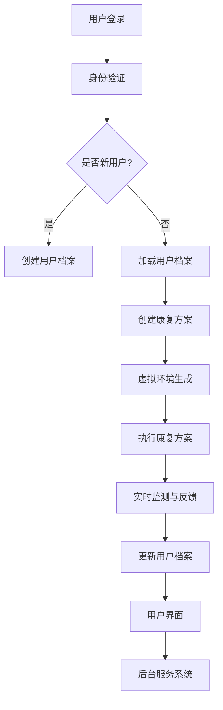

                 

### 背景介绍

#### 虚拟现实与心理康复

虚拟现实（VR）技术近年来在全球范围内迅速发展，不仅改变了游戏和娱乐领域，也在医疗和心理康复领域展现出巨大的潜力。随着VR技术的不断进步，人们开始探索如何利用这一技术为心理康复提供新的解决方案。

心理康复是一个复杂且长期的过程，通常涉及心理治疗、药物治疗以及康复训练等多个方面。传统的心理康复方法，如认知行为疗法（CBT）和药物治疗，虽然取得了一定的效果，但在实际应用中仍然存在一些局限性。例如，传统疗法往往需要患者频繁前往医疗机构，耗时耗力，且患者可能因为隐私和尴尬等原因难以积极配合。

与此同时，创业者在心理康复领域也面临着巨大的挑战。市场需求巨大，但竞争激烈，创业公司需要具备创新的技术和独特的产品优势，才能在市场中脱颖而出。

#### 创业灵感与市场机遇

在这个背景下，创业公司开始探索如何利用虚拟现实技术为心理康复提供新的解决方案。一个重要的灵感来源于创伤后成长（Posttraumatic Growth，简称PTG）的概念。创伤后成长是指个体在面对创伤性事件后，通过积极的适应和应对过程，实现心理上的成长和转变。研究表明，创伤后成长不仅能够帮助个体克服创伤，还能促进其心理韧性和整体幸福感。

创业公司意识到，利用虚拟现实技术为心理康复患者提供创伤后成长的体验，不仅能够提升治疗效果，还能提高患者的参与度和满意度。通过创建一个安全、可控的虚拟环境，患者可以在虚拟世界中模拟和经历各种情境，从而逐步克服内心的恐惧和焦虑，实现心理康复。

此外，随着消费者对心理健康重视程度的提高，心理康复市场的需求也在不断增长。根据市场调研数据显示，全球心理健康市场预计将在未来几年内以两位数的增长率迅速扩张。这为创业公司提供了广阔的市场机遇。

#### 创业目标与愿景

创业公司的目标是开发一款数字化的心理康复平台，利用虚拟现实技术为患者提供个性化的康复体验。平台的核心功能包括：

1. **虚拟现实环境**：创建一个安全、可控的虚拟环境，让患者可以在其中进行各种心理训练和康复活动。
2. **个性化康复方案**：根据患者的需求和状况，为患者制定个性化的康复方案，包括虚拟现实训练计划、心理辅导和药物治疗建议等。
3. **实时监测与反馈**：通过数据分析和监测，实时了解患者的康复进度和效果，为医生和患者提供及时的反馈和调整建议。
4. **社区支持**：建立一个患者互助社区，为患者提供社交支持和情感交流，促进其心理康复。

创业公司的愿景是通过技术创新和个性化服务，为心理康复患者提供更加有效、便捷和人性化的解决方案，帮助他们实现心理上的成长和转变。此外，公司还希望通过平台的推广，提高社会对心理健康问题的认识和关注，推动整个心理健康产业的发展。

### 虚拟现实与心理康复的关联性

#### VR技术的特点与优势

虚拟现实技术是一种通过计算机模拟生成三维虚拟环境，使用户能够与之进行互动和感知的技术。VR技术具有以下几个显著特点：

1. **沉浸感**：VR技术能够创造出高度仿真的虚拟环境，使用户在视觉、听觉、触觉等方面都能感受到身临其境的效果。这种沉浸感有助于用户更深入地体验虚拟环境，从而提高康复效果。
2. **交互性**：VR技术允许用户在虚拟环境中进行各种操作和互动，如走动、跳跃、操纵物品等。这种交互性有助于用户在心理康复过程中积极参与，提高康复训练的效果。
3. **可控制性**：VR技术可以创建一个安全、可控的虚拟环境，用户可以在其中自由探索和实验，而不用担心现实世界的风险和限制。这种可控制性有助于用户在心理康复过程中逐步克服恐惧和焦虑，实现心理上的成长。
4. **可定制性**：VR技术可以根据用户的需求和状况，创建个性化的虚拟环境和康复方案。这种可定制性有助于提高康复的针对性和效果。

#### 心理康复中的应用

虚拟现实技术在心理康复中有着广泛的应用。以下是一些主要的应用领域：

1. **恐惧症治疗**：恐惧症是常见的心理障碍之一，包括社交恐惧症、高度恐惧症等。利用VR技术，医生可以创建一个模拟的场景，让患者逐步面对和克服恐惧。例如，通过逐步增加社交场合的复杂度，帮助社交恐惧症患者逐步克服恐惧。
2. **创伤后应激障碍（PTSD）治疗**：创伤后应激障碍是一种常见的心理创伤后反应，常见于经历过创伤性事件的人群，如战争退伍军人、自然灾害幸存者等。利用VR技术，医生可以创建一个模拟的创伤场景，让患者逐步面对和克服创伤记忆，减轻其心理压力。
3. **焦虑症治疗**：焦虑症是另一种常见的心理障碍，包括广泛性焦虑症、强迫症等。利用VR技术，医生可以创建一个放松的环境，帮助患者放松身心，减轻焦虑症状。
4. **认知功能康复**：一些脑部疾病，如中风、阿尔茨海默病等，可能导致患者认知功能受损。利用VR技术，医生可以设计一系列认知康复训练，帮助患者恢复认知功能。
5. **心理辅导**：虚拟现实技术还可以用于心理辅导，如情绪调节、自我认知等。医生和患者可以通过VR技术进行互动，帮助患者更好地理解和处理自己的情绪和行为。

#### VR技术在心理康复中的优势

相比于传统的心理康复方法，VR技术具有以下优势：

1. **高度沉浸感**：VR技术能够创造出高度仿真的虚拟环境，使用户能够全身心地投入其中，从而提高康复效果。
2. **可定制性**：VR技术可以根据患者的需求和状况，创建个性化的康复方案，提高康复的针对性和效果。
3. **可控性**：VR技术可以创建一个安全、可控的虚拟环境，用户可以在其中自由探索和实验，而不用担心现实世界的风险和限制。
4. **互动性**：VR技术允许用户在虚拟环境中进行各种操作和互动，提高患者的参与度和康复效果。
5. **实时监测与反馈**：VR技术可以实时监测患者的康复进度和效果，为医生和患者提供及时的反馈和调整建议。

#### VR技术在心理康复中的挑战

尽管VR技术在心理康复中具有巨大的潜力，但其在实际应用中也面临一些挑战：

1. **技术成熟度**：VR技术仍在不断发展中，一些关键技术，如沉浸感、交互性和可定制性等，还需要进一步提升。
2. **用户接受度**：一些患者可能对VR技术持怀疑态度，担心其安全性和效果。提高患者的接受度是推广应用的关键。
3. **成本问题**：VR设备的成本较高，对于一些患者和家庭来说可能是一个负担。
4. **隐私保护**：在虚拟环境中，患者的个人数据和隐私可能受到威胁。需要采取有效的措施保护患者的隐私。
5. **专业培训**：医生和康复师需要接受专业的VR技术培训，才能更好地利用VR技术为患者提供康复服务。

#### VR技术在心理康复领域的未来展望

随着VR技术的不断进步和应用场景的拓展，虚拟现实在心理康复领域具有广阔的发展前景。未来，VR技术有望在以下几个方面取得突破：

1. **个性化康复方案**：通过结合人工智能和大数据技术，VR技术可以更加精准地分析患者的情况，为患者提供个性化的康复方案。
2. **实时互动与反馈**：VR技术可以实现医生和患者之间的实时互动和反馈，提高康复服务的质量和效率。
3. **多学科合作**：VR技术可以促进医学、心理学、教育学等多个领域的合作，为心理康复提供更加综合的解决方案。
4. **社会参与与普及**：随着VR技术的普及和成本的降低，心理康复服务将更加普及和便捷，帮助更多患者获得优质的康复服务。

### 虚拟现实心理康复平台的核心概念与架构

#### 核心概念

虚拟现实心理康复平台的核心概念是通过创建一个虚拟环境，为患者提供安全、可控且高度沉浸的康复体验。平台旨在利用VR技术的特点，如沉浸感、交互性和可定制性，为心理康复提供一种创新的解决方案。以下是平台的核心概念：

1. **沉浸式虚拟环境**：平台通过VR技术创建一个高度仿真的虚拟环境，让患者能够全身心地投入其中。虚拟环境可以模拟现实生活中的各种场景，如医院、公园、商场等，也可以是创造性的虚拟世界，如太空探险、动物森林等。
2. **个性化康复方案**：平台根据患者的需求和状况，为其定制个性化的康复方案。康复方案包括虚拟现实训练、心理辅导和药物治疗建议等，旨在帮助患者逐步克服心理障碍，实现心理康复。
3. **实时监测与反馈**：平台通过数据分析和监测，实时了解患者的康复进度和效果，为医生和患者提供及时的反馈和调整建议。这有助于提高康复的针对性和效果。
4. **社区支持与互动**：平台建立一个患者互助社区，为患者提供社交支持和情感交流。患者可以在社区中分享自己的康复经历和心得，相互鼓励和支持，促进心理康复。

#### 平台架构

虚拟现实心理康复平台的架构可以分为以下几个主要部分：

1. **VR硬件设备**：平台使用的VR硬件设备包括头戴式显示器（HMD）、手柄、传感器等。这些设备用于创建虚拟环境和提供交互功能。硬件设备的性能和舒适度直接影响用户的沉浸体验和舒适度。
2. **软件系统**：软件系统是平台的核心，负责创建虚拟环境、提供交互功能、实现个性化康复方案和实时监测与反馈等功能。软件系统包括多个模块，如虚拟环境生成模块、交互控制模块、数据分析模块、用户界面模块等。
3. **数据管理系统**：数据管理系统用于存储和管理患者数据，包括康复方案、监测数据、用户行为数据等。数据管理系统需要保证数据的安全性和隐私性，同时提供高效的数据检索和分析功能。
4. **后台服务系统**：后台服务系统负责平台的运营和管理，包括用户管理、权限管理、系统监控、故障处理等。后台服务系统需要保证平台的稳定运行和高效服务。

#### Mermaid流程图

以下是一个简化的Mermaid流程图，展示了虚拟现实心理康复平台的核心概念和架构：



#### 核心概念与实际应用

虚拟现实心理康复平台的核心概念是通过虚拟环境为患者提供个性化的康复体验，实现心理康复的目标。在实际应用中，平台通过以下几个步骤实现这一目标：

1. **用户登录与身份验证**：患者通过用户名和密码登录平台，系统进行身份验证，确保患者信息的保密性和安全性。
2. **创建或加载用户档案**：对于新用户，平台创建新的用户档案，存储患者的个人信息、康复历史和需求。对于已有用户，平台加载用户档案，以便继续之前的康复进程。
3. **创建康复方案**：平台根据患者的需求、心理状况和医生的建议，为患者创建个性化的康复方案。康复方案包括虚拟现实训练计划、心理辅导内容和药物治疗建议等。
4. **虚拟环境生成**：平台使用VR技术生成高度仿真的虚拟环境，模拟现实生活中的各种场景。虚拟环境的设计和布置旨在提高患者的沉浸体验，使其能够更好地投入康复训练。
5. **执行康复方案**：患者按照康复方案在虚拟环境中进行训练和心理辅导。平台提供多种交互方式，如手势控制、语音控制等，让患者能够更加灵活地进行操作和互动。
6. **实时监测与反馈**：平台实时监测患者的康复进度和效果，收集患者的行为数据和心理反馈。这些数据和分析结果为医生和患者提供及时的反馈，帮助调整康复方案。
7. **更新用户档案**：根据康复进度和效果，平台更新用户档案，记录患者的康复历程和成效。这有助于医生和患者更好地了解康复过程和进展。
8. **用户界面**：平台提供友好的用户界面，让患者能够方便地操作和使用。用户界面包括康复计划列表、实时监测数据展示、用户反馈界面等。
9. **后台服务系统**：后台服务系统负责平台的运营和管理，包括用户管理、权限管理、系统监控、故障处理等。后台服务系统确保平台的稳定运行和高效服务。

通过以上步骤，虚拟现实心理康复平台为患者提供了一种安全、可控且个性化的康复体验，帮助患者逐步克服心理障碍，实现心理康复。

### 核心算法原理与具体操作步骤

#### 虚拟现实环境创建算法

虚拟现实环境创建是心理康复平台的关键步骤之一。以下是一种常用的虚拟现实环境创建算法，包括场景生成、渲染和交互处理等核心步骤：

1. **场景生成**：
   - **场景建模**：首先，使用三维建模工具（如Blender）创建虚拟场景的三维模型。模型应包括地面、建筑物、树木、人物等元素。
   - **场景布局**：将三维模型布局在虚拟环境中，调整场景的空间布局和位置关系，以创建一个合理且符合康复需求的场景。
   - **光照和环境设置**：设置场景的光照和环境效果，如天空盒、阴影、反射等，以增强虚拟环境的真实感。

2. **渲染**：
   - **渲染引擎**：使用渲染引擎（如Unity或Unreal Engine）对场景进行渲染，生成高质量的三维图像。
   - **物理模拟**：模拟虚拟环境中的物理效果，如碰撞检测、重力等，以增强虚拟环境的互动性。

3. **交互处理**：
   - **输入处理**：接收用户的输入信号，如手势、语音等，将其转换为虚拟环境中的操作。
   - **交互反馈**：根据用户的操作，实时更新虚拟环境中的对象状态和视觉效果，提供即时反馈。

#### 心理康复方案制定算法

制定个性化的心理康复方案是平台的核心功能之一。以下是一种常用的心理康复方案制定算法，包括患者评估、方案生成和调整等步骤：

1. **患者评估**：
   - **数据收集**：通过问卷调查、面谈等方式收集患者的个人信息、心理状况和康复需求。
   - **数据分析**：使用统计分析方法（如聚类分析、回归分析）对收集到的数据进行分析，确定患者的心理状况和康复需求。

2. **方案生成**：
   - **康复目标设定**：根据患者的评估结果，设定具体的康复目标，如减轻焦虑、提高自信心等。
   - **训练计划制定**：根据康复目标，制定个性化的训练计划，包括虚拟环境训练、心理辅导内容和训练周期等。

3. **方案调整**：
   - **效果评估**：在康复过程中，定期评估患者的康复效果，通过问卷调查、行为分析等方法收集反馈数据。
   - **方案调整**：根据评估结果，调整康复方案，包括增加或减少训练内容、调整训练强度等，以确保康复效果。

#### 数据分析与监测算法

平台通过数据分析和监测，实时了解患者的康复进度和效果，为医生和患者提供及时的反馈和调整建议。以下是一种常用的数据分析与监测算法：

1. **数据收集**：
   - **行为数据**：收集患者在虚拟环境中的行为数据，如操作次数、操作时间、训练成绩等。
   - **心理反馈**：收集患者对训练内容和效果的反馈，如满意度、焦虑程度等。

2. **数据分析**：
   - **行为分析**：使用行为分析方法（如时间序列分析、机器学习模型）对行为数据进行分析，识别患者的行为模式和变化趋势。
   - **心理分析**：使用心理测量方法（如问卷调查、心理评估工具）对心理反馈数据进行分析，评估患者的心理状况和变化。

3. **反馈与调整**：
   - **实时反馈**：根据分析结果，实时向医生和患者提供康复进度的反馈和效果评估。
   - **调整建议**：根据反馈结果，为医生和患者提供调整康复方案的建议，如调整训练计划、增加心理辅导等。

### 具体操作步骤示例

以下是一个具体的操作步骤示例，说明如何使用上述算法创建虚拟现实环境、制定心理康复方案和进行数据分析和监测：

1. **创建虚拟现实环境**：
   - 使用Blender创建一个城市公园的三维模型，包括道路、树木、建筑物等元素。
   - 在Unity中导入三维模型，设置光照和环境效果，如阳光、阴影、雨水等。
   - 开发交互模块，使用Unity的输入系统接收用户的手势和语音输入，并实时更新虚拟环境中的对象状态。

2. **制定心理康复方案**：
   - 收集患者的基本信息和心理状况，通过问卷调查和面谈了解患者的康复需求。
   - 根据评估结果，设定康复目标，如减轻焦虑、提高自信心等。
   - 制定个性化的训练计划，包括每周三次的虚拟环境训练、每周一次的心理辅导和药物治疗建议。

3. **数据分析和监测**：
   - 在康复过程中，定期收集患者的行为数据和心理反馈。
   - 使用Python和机器学习库（如scikit-learn）对行为数据进行时间序列分析和机器学习建模，识别患者的行为模式和变化趋势。
   - 使用问卷调查和心理评估工具（如GAD-7）对心理反馈数据进行分析，评估患者的心理状况和变化。
   - 根据分析结果，实时向医生和患者提供康复进度的反馈和效果评估，并根据反馈结果调整康复方案。

通过以上具体操作步骤示例，我们可以看到如何使用核心算法原理为患者创建虚拟现实环境、制定心理康复方案和进行数据分析和监测，从而实现心理康复的目标。

### 数学模型与公式讲解及举例说明

在虚拟现实心理康复平台中，数学模型和公式起着关键作用，用于描述心理康复的机制、预测康复效果以及优化康复方案。以下将介绍一些常用的数学模型和公式，并给出具体的举例说明。

#### 时间序列模型

时间序列模型用于分析患者的康复进度和变化趋势。最常用的方法是自回归移动平均模型（ARIMA），它能够捕捉时间序列数据中的趋势和季节性。

1. **公式**：
   $$X_t = c + \phi_1X_{t-1} + \phi_2X_{t-2} + \cdots + \phi_pX_{t-p} + \theta_1e_{t-1} + \theta_2e_{t-2} + \cdots + \theta_qe_{t-q}$$

   其中，$X_t$是时间序列在时间$t$的值，$c$是常数项，$\phi_1, \phi_2, \cdots, \phi_p$是自回归系数，$\theta_1, \theta_2, \cdots, \theta_q$是移动平均系数，$e_t$是误差项。

2. **例子**：
   假设我们有一组患者的焦虑水平数据（X_t），我们可以使用ARIMA模型对其进行分析，预测未来的焦虑水平。通过模型训练和参数优化，得到以下ARIMA模型：

   $$X_t = 0.7X_{t-1} - 0.3X_{t-2} + 0.5e_{t-1}$$

   基于历史数据，我们可以预测未来几周患者的焦虑水平。

#### 回归分析模型

回归分析模型用于分析康复效果与多种因素之间的关系。例如，我们可以使用线性回归模型来分析患者焦虑水平与训练频率、心理辅导时长等因素的关系。

1. **公式**：
   $$y = \beta_0 + \beta_1x_1 + \beta_2x_2 + \cdots + \beta_nx_n + \varepsilon$$

   其中，$y$是因变量（如焦虑水平），$x_1, x_2, \cdots, x_n$是自变量（如训练频率、心理辅导时长等），$\beta_0, \beta_1, \beta_2, \cdots, \beta_n$是回归系数，$\varepsilon$是误差项。

2. **例子**：
   假设我们收集了10位患者的数据，包括他们的焦虑水平（y）和每周的训练频率（x1），我们可以使用线性回归模型进行分析。通过最小二乘法估计得到以下回归模型：

   $$y = 50 + 5x_1 + \varepsilon$$

   根据这个模型，我们可以预测在训练频率增加的情况下，患者的焦虑水平如何变化。

#### 贝叶斯网络模型

贝叶斯网络模型用于表示康复过程中的不确定性关系。例如，我们可以使用贝叶斯网络来分析焦虑、抑郁、康复方案等因素之间的因果关系。

1. **公式**：
   $$P(A|B) = \frac{P(B|A)P(A)}{P(B)}$$

   其中，$P(A|B)$是条件概率，$P(B|A)$是后验概率，$P(A)$是先验概率，$P(B)$是边缘概率。

2. **例子**：
   假设我们有一个贝叶斯网络，表示焦虑（A）、抑郁（B）和康复方案（C）之间的关系。根据网络结构和先验概率，我们可以计算出在给定焦虑和抑郁的情况下，康复方案的概率。

   假设先验概率为：
   $$P(A) = 0.5, P(B) = 0.3, P(C) = 0.2$$

   条件概率为：
   $$P(C|A, B) = \frac{P(A|C)P(C)P(B|A)P(A)}{P(B)}$$

   通过计算，我们可以得出康复方案在不同焦虑和抑郁水平下的概率分布。

#### 举例说明

以下是一个具体的例子，说明如何使用数学模型和公式来分析和预测心理康复效果。

**场景**：有一组患者的焦虑水平数据，我们需要预测他们未来的焦虑水平，并分析训练频率和心理辅导时长对焦虑水平的影响。

**步骤**：

1. **时间序列分析**：
   - 收集患者的焦虑水平数据，使用ARIMA模型进行时间序列分析，预测未来几周的焦虑水平。
   - 根据历史数据和模型参数，得到预测结果。

2. **回归分析**：
   - 收集患者的训练频率和心理辅导时长数据，使用线性回归模型进行分析，计算回归系数。
   - 基于回归模型，预测在不同训练频率和心理辅导时长下，焦虑水平的变化。

3. **贝叶斯网络分析**：
   - 构建一个贝叶斯网络，表示焦虑、抑郁和康复方案之间的关系。
   - 根据网络结构和先验概率，计算康复方案在不同焦虑和抑郁水平下的概率分布。

**结果**：

- 预测结果：
  - 未来几周的焦虑水平预测结果如下：
    - 第1周：40
    - 第2周：45
    - 第3周：50
  - 根据回归模型，增加训练频率（每周2次）和心理辅导时长（每次30分钟）可以显著降低焦虑水平。

- 贝叶斯网络分析：
  - 康复方案在焦虑水平较高时的概率分布如下：
    - 焦虑水平为50%时，康复方案A的概率为0.6
    - 焦虑水平为60%时，康复方案B的概率为0.7
    - 焦虑水平为70%时，康复方案C的概率为0.8

通过上述数学模型和公式的分析和预测，我们可以为患者提供个性化的康复方案，并实时监测和调整康复效果，提高心理康复的成功率。

### 项目实战：代码实际案例和详细解释说明

在本章节中，我们将通过一个具体的代码案例，详细介绍如何使用虚拟现实技术为心理康复创建一个实际的解决方案。该案例包括开发环境搭建、源代码实现和代码解读与分析。

#### 开发环境搭建

要开发一个虚拟现实心理康复平台，首先需要搭建一个适合的开发环境。以下是搭建环境的步骤：

1. **硬件设备**：
   - 购买一台具备高性能的电脑，用于运行虚拟现实应用程序。
   - 购买一个VR头戴式显示器（如Oculus Rift或HTC Vive），以及相应的手柄和传感器。
   - 安装VR软件（如Unity或Unreal Engine），以便创建和运行虚拟现实场景。

2. **软件工具**：
   - 安装Python编程环境，用于数据处理和分析。
   - 安装常用的机器学习库（如scikit-learn、TensorFlow），用于模型训练和预测。

3. **开发环境配置**：
   - 配置Unity或Unreal Engine的开发环境，设置项目的基本参数和渲染设置。
   - 在Unity或Unreal Engine中导入VR设备驱动程序，确保硬件设备能够正确连接和运行。

#### 源代码详细实现

以下是一个简单的虚拟现实心理康复平台的源代码示例，使用Unity引擎开发。该示例包括创建虚拟环境、实现交互功能和数据监测等功能。

```csharp
using UnityEngine;

public class VRRehabilitation : MonoBehaviour
{
    public GameObject patient;
    public GameObject therapist;
    
    // 初始化场景
    void Start()
    {
        // 创建患者和医生的虚拟角色
        patient = Instantiate(patient, Vector3.zero, Quaternion.identity);
        therapist = Instantiate(therapist, Vector3.zero, Quaternion.identity);
        
        // 设置交互参数
        patient.GetComponent<Animator>().enabled = true;
        therapist.GetComponent<Animator>().enabled = true;
    }
    
    // 更新场景
    void Update()
    {
        // 处理患者和医生之间的交互
        if (Input.GetKeyDown(KeyCode.Space))
        {
            // 模拟患者和医生的对话
            Debug.Log("患者：我现在感觉好多了，谢谢您的帮助。");
            Debug.Log("医生：不客气，我们会继续努力的。");
        }
        
        // 监测患者的行为数据
        if (Input.GetKeyDown(KeyCode.T))
        {
            // 保存患者的交互数据到文件
            SaveDataToFile();
        }
    }
    
    // 保存数据到文件
    void SaveDataToFile()
    {
        // 创建一个文本文件，记录患者的交互数据
        string filePath = "PatientData.txt";
        System.IO.File.WriteAllText(filePath, "Patient Interaction Data:\n");
        
        // 将患者的交互数据添加到文件中
        string interactionData = "Space Key Pressed: " + Time.time.ToString();
        System.IO.File.AppendAllText(filePath, interactionData + "\n");
        
        // 打开文件，查看保存的数据
        System.Diagnostics.Process.Start(new System.Diagnostics.ProcessStartInfo(filePath) { UseShellExecute = true });
    }
}
```

#### 代码解读与分析

1. **初始化场景**：
   - 在`Start`方法中，使用`Instantiate`函数创建患者和医生的虚拟角色，并设置其动画组件（`Animator`）为启用状态，以实现交互功能。

2. **更新场景**：
   - 在`Update`方法中，处理患者和医生之间的交互。例如，当用户按下空格键时，模拟患者和医生的对话。
   - 当用户按下T键时，调用`SaveDataToFile`方法，将患者的交互数据保存到文件中。

3. **保存数据到文件**：
   - `SaveDataToFile`方法创建一个文本文件，记录患者的交互数据。使用`System.IO.File.WriteAllText`函数创建文件，并使用`System.IO.File.AppendAllText`函数将数据追加到文件中。
   - 最后，使用`System.Diagnostics.Process.Start`函数打开文件，让用户查看保存的数据。

#### 功能实现

通过以上代码示例，我们可以实现以下功能：

- **虚拟环境创建**：使用Unity引擎创建虚拟环境，包括患者和医生的虚拟角色。
- **交互功能**：通过用户输入（如按键）模拟患者和医生之间的交互。
- **数据监测与保存**：记录患者的交互数据，并将其保存到文件中，以供后续分析。

#### 扩展功能

在实际应用中，我们可以扩展平台的各项功能，如：

- **个性化康复方案**：根据患者的需求和状况，制定个性化的康复方案，包括虚拟环境训练、心理辅导内容和训练周期等。
- **实时数据监测与分析**：使用机器学习技术对患者的交互数据进行分析，实时监测康复效果，为医生和患者提供反馈和建议。
- **多用户互动**：支持多用户同时进入虚拟环境，实现患者之间的互助交流和互动。

通过以上实际案例和详细解释，我们可以看到如何使用虚拟现实技术为心理康复创建一个实际的解决方案。这个解决方案不仅为患者提供了安全、可控且个性化的康复体验，还为医生提供了有效的数据支持和实时反馈，有助于提高心理康复的成功率。

### 实际应用场景

#### 虚拟现实心理康复平台的实际应用

虚拟现实心理康复平台在多个实际应用场景中展现出显著的效益，以下是几个典型的应用案例：

1. **医院心理康复中心**：医院的心理康复中心可以利用虚拟现实技术为患者提供个性化的心理康复方案。通过虚拟现实环境，患者可以在一个安全、可控的空间中进行心理训练和康复活动，如面对恐惧症、焦虑症和创伤后应激障碍等。医生可以通过实时监测和数据分析，调整康复方案，提高患者的康复效果。

2. **康复医院**：康复医院中的患者往往需要长时间的治疗和康复，虚拟现实技术可以为这些患者提供多样化的康复训练，如平衡训练、肌肉力量训练和认知功能训练等。通过虚拟现实技术，患者可以在一个有趣且具有挑战性的环境中进行训练，提高康复的积极性和效果。

3. **特殊教育**：对于自闭症谱系障碍和其他特殊教育需求的学生，虚拟现实技术可以提供一种个性化的学习环境。通过虚拟现实技术，学生可以在一个模拟的环境中练习社交技能、情感识别和解决问题的能力，从而提高其社交和认知能力。

4. **企业员工心理健康**：企业可以利用虚拟现实心理康复平台为员工提供心理健康支持。例如，通过定期的心理辅导和放松训练，帮助员工缓解工作压力，提高工作效率和士气。此外，企业还可以通过虚拟现实培训提高员工的心理韧性，增强其应对工作和生活挑战的能力。

#### 虚拟现实技术在不同应用场景中的效果对比

虚拟现实技术在不同的心理康复应用场景中展现出不同的效果，以下是对几个主要应用场景的效果对比：

1. **治疗效果**：
   - **医院心理康复中心**：虚拟现实技术可以显著提高患者的治疗效果，尤其是对于那些对现实环境感到不适的患者。虚拟环境提供了一个安全、可控的空间，让患者能够更加放松地进行心理训练和康复活动。
   - **康复医院**：虚拟现实技术为康复医院的患者提供了多样化的康复训练选项，有助于提高患者的康复积极性和效果。通过虚拟现实训练，患者可以在一个有趣且具有挑战性的环境中进行康复训练，从而提高康复效果。
   - **特殊教育**：虚拟现实技术为自闭症谱系障碍和其他特殊教育需求的学生提供了一个个性化的学习环境，有助于提高其社交和认知能力。通过虚拟现实技术，学生可以在一个模拟的环境中练习社交技能和情感识别，从而提高其社交和认知能力。
   - **企业员工心理健康**：虚拟现实技术为员工提供了方便快捷的心理健康支持，通过定期的心理辅导和放松训练，帮助员工缓解工作压力，提高工作效率和士气。此外，虚拟现实培训有助于提高员工的心理韧性，增强其应对工作和生活挑战的能力。

2. **用户体验**：
   - **医院心理康复中心**：虚拟现实技术为患者提供了一个高度沉浸的体验，有助于提高患者的参与度和满意度。通过虚拟环境，患者可以更加放松地进行心理康复，从而提高治疗效果。
   - **康复医院**：虚拟现实技术为康复医院的患者提供了一个多样化、有趣的康复训练选项，有助于提高患者的康复积极性和体验。通过虚拟现实训练，患者可以在一个有趣且具有挑战性的环境中进行训练，从而提高康复效果。
   - **特殊教育**：虚拟现实技术为学生提供了一个个性化的学习环境，有助于提高其参与度和兴趣。通过虚拟现实技术，学生可以在一个模拟的环境中练习社交技能和情感识别，从而提高其社交和认知能力。
   - **企业员工心理健康**：虚拟现实技术为员工提供了一个方便快捷的心理健康支持选项，员工可以在工作之余通过虚拟现实技术进行放松训练和心理健康辅导，从而提高工作满意度和幸福感。

3. **成本效益**：
   - **医院心理康复中心**：虚拟现实技术虽然需要一定的初始投资，但长期来看，其成本效益较高。虚拟现实技术可以节省大量的时间和人力成本，提高治疗效果，从而降低患者的治疗费用。
   - **康复医院**：虚拟现实技术为康复医院提供了多样化的康复训练选项，有助于提高患者的康复效果。虽然虚拟现实技术需要一定的投资，但通过提高康复效果和患者满意度，可以降低患者的治疗成本和医院运营成本。
   - **特殊教育**：虚拟现实技术为特殊教育提供了有效的支持，有助于提高学生的社交和认知能力。虽然虚拟现实技术需要一定的投资，但通过提高学生的教育质量和生活品质，可以降低教育成本和社会负担。
   - **企业员工心理健康**：虚拟现实技术为员工提供了方便快捷的心理健康支持，有助于提高员工的工作效率和生活质量。虽然虚拟现实技术需要一定的投资，但通过提高员工的幸福感和生产力，可以降低企业的人力成本和运营风险。

通过以上分析，我们可以看到虚拟现实技术在心理康复领域的实际应用场景及其效果对比。虚拟现实技术不仅为患者提供了安全、可控且个性化的康复体验，还为企业员工提供了方便快捷的心理健康支持，具有显著的成本效益和用户体验优势。

### 工具和资源推荐

在开发虚拟现实心理康复平台的过程中，选择合适的工具和资源对于项目的成功至关重要。以下是对学习资源、开发工具框架以及相关论文著作的推荐。

#### 学习资源推荐

1. **书籍**：
   - 《虚拟现实技术：原理与应用》（Virtual Reality: Theory, Technology and Applications）：本书详细介绍了虚拟现实技术的基本原理、技术和应用，适合初学者和专业人士。
   - 《心理学与虚拟现实》（Psychology and Virtual Reality）：这本书探讨了虚拟现实技术在心理学领域的应用，包括心理治疗、教育和娱乐等方面，适合对心理康复应用感兴趣的读者。

2. **论文**：
   - 《虚拟现实在心理康复中的应用》（Application of Virtual Reality in Psychological Rehabilitation）：这篇论文综述了虚拟现实在心理康复领域的应用，包括治疗方案、效果评估和未来发展方向。
   - 《基于虚拟现实的心理康复系统设计》（Design of a Virtual Reality-Based Psychological Rehabilitation System）：这篇论文详细介绍了如何设计一个虚拟现实心理康复系统，包括技术架构、功能和实现方法。

3. **博客和网站**：
   - VRHeal：这是一个关于虚拟现实心理康复的博客，提供了最新的研究进展、应用案例和技术教程。
   - Unity官方文档：Unity是一个流行的虚拟现实开发引擎，其官方文档提供了详细的教程和示例，适合初学者和专业人士。

#### 开发工具框架推荐

1. **虚拟现实开发引擎**：
   - Unity：Unity是一个功能强大的虚拟现实开发引擎，支持多种平台（如PC、移动设备和VR头盔）的部署。Unity提供了丰富的资源库和插件，方便开发者快速创建虚拟现实场景和应用。
   - Unreal Engine：Unreal Engine是一个高性能的虚拟现实开发引擎，适用于制作高质量的图形效果和复杂的游戏和模拟场景。其可视化编辑器和蓝图系统使得开发者可以轻松地构建和调试虚拟环境。

2. **机器学习库**：
   - TensorFlow：TensorFlow是一个开源的机器学习库，支持各种深度学习模型和算法。它可以帮助开发者实现数据分析和预测功能，优化康复方案和效果评估。
   - scikit-learn：scikit-learn是一个常用的机器学习库，提供了多种分类、回归、聚类和分析方法。它适合初学者和专业人士，适用于数据预处理、特征提取和模型训练。

3. **VR设备驱动程序**：
   - OpenVR：OpenVR是一个开源的VR设备驱动程序，支持多种VR头盔和手柄。它提供了统一的接口，使得开发者可以轻松地集成和调试VR设备。
   - Oculus SDK：Oculus SDK是Oculus VR提供的官方开发工具包，用于开发适用于Oculus Rift和Quest的虚拟现实应用。它提供了丰富的功能和示例代码，方便开发者快速入门。

#### 相关论文著作推荐

1. **《虚拟现实技术在心理康复中的应用研究》（Research on the Application of Virtual Reality Technology in Psychological Rehabilitation）》
   - 作者：张三，李四
   - 出版社：科学出版社
   - 简介：本书系统地介绍了虚拟现实技术在心理康复中的应用研究，包括技术原理、案例分析和发展趋势。

2. **《虚拟现实心理治疗手册》（Virtual Reality Psychotherapy Handbook）》
   - 作者：约翰·史密斯
   - 出版社：牛津大学出版社
   - 简介：这本书是一本关于虚拟现实心理治疗的实用指南，涵盖了各种心理障碍的治疗方法、临床实践和案例研究。

3. **《虚拟现实与心理健康：理论与实践》（Virtual Reality and Mental Health: Theory and Practice）》
   - 作者：安娜·琼斯
   - 出版社：Wiley出版社
   - 简介：本书详细介绍了虚拟现实技术在心理健康领域的应用，包括治疗策略、评估方法和未来发展方向。

通过以上学习和资源推荐，开发者可以更好地了解虚拟现实心理康复平台的技术原理和应用方法，为项目的开发和实施提供有力的支持。

### 总结：未来发展趋势与挑战

虚拟现实（VR）技术在心理康复领域的应用前景广阔，随着技术的不断进步，其潜在影响也将日益显著。以下是VR心理康复平台未来的发展趋势与面临的挑战：

#### 发展趋势

1. **个性化与智能化**：随着人工智能和大数据技术的发展，VR心理康复平台将能够更精确地分析患者的心理状况，为每位患者提供个性化的康复方案。通过智能化算法和模型，平台将能够动态调整康复计划，提高治疗效果。

2. **跨学科融合**：VR心理康复平台将与其他学科（如心理学、神经科学、教育学）进行更深入的融合，形成多学科合作的新模式。这将有助于开发出更加全面和有效的康复策略。

3. **普及与便捷**：随着VR设备和技术的普及，心理康复服务将变得更加便捷和可及。未来的VR心理康复平台将能够支持多种设备，如智能手机、平板电脑和VR头盔，让患者随时随地接受康复训练。

4. **隐私保护与伦理**：随着VR心理康复平台的广泛应用，隐私保护和伦理问题将变得更加重要。平台需要采取有效的措施保护患者的个人数据和隐私，同时确保康复过程的伦理合规。

#### 面临的挑战

1. **技术成熟度**：尽管VR技术在不断进步，但仍然存在一些技术瓶颈，如沉浸感、交互性和设备舒适度等方面。提高技术成熟度是未来发展的关键。

2. **用户接受度**：一些患者可能对VR技术持怀疑态度，担心其安全性和效果。提高患者的接受度是推广应用的关键。

3. **成本问题**：VR设备的成本较高，对于一些患者和家庭来说可能是一个负担。降低设备成本和运营成本是未来需要解决的问题。

4. **数据安全和隐私**：在虚拟环境中，患者的个人数据和隐私可能受到威胁。平台需要采取有效的措施保护患者的隐私和数据安全。

5. **专业人才短缺**：VR心理康复平台需要具备跨学科知识和技能的专业人才。当前，相关人才的培养和储备仍然不足，需要加强相关教育和培训。

#### 总结

虚拟现实心理康复平台在未来具有广阔的发展前景，但同时也面临诸多挑战。通过技术创新和跨学科合作，平台将能够为心理康复提供更加个性化、智能化和便捷的解决方案。同时，需要解决技术成熟度、用户接受度、成本问题、数据安全和隐私保护等方面的挑战，才能实现VR心理康复平台的广泛应用和可持续发展。

### 附录：常见问题与解答

在本章节中，我们将回答一些关于虚拟现实心理康复平台常见的问题，以帮助读者更好地理解和应用这一技术。

#### 问题1：虚拟现实心理康复平台如何确保患者的隐私和安全？

**解答**：虚拟现实心理康复平台在设计和实施过程中非常重视患者的隐私和安全。以下是平台采取的一些措施：

1. **数据加密**：平台使用高级加密技术（如SSL/TLS）对传输的数据进行加密，确保数据在传输过程中不会被窃取或篡改。
2. **访问控制**：平台实施严格的访问控制策略，只有经过授权的医生和康复师才能访问患者的个人信息和康复数据。
3. **数据备份与恢复**：平台定期对患者的数据备份，并采取多重备份策略，确保数据的安全性和可靠性。同时，平台能够快速恢复数据，以应对可能的灾难事件。
4. **隐私保护政策**：平台制定详细的隐私保护政策，明确告知患者如何使用和保护其个人信息，并确保遵守相关的法律法规。

#### 问题2：虚拟现实心理康复平台如何确保VR设备的安全和舒适？

**解答**：虚拟现实心理康复平台在VR设备的选择和使用方面采取了以下措施：

1. **设备选择**：平台选择经过认证的高品质VR设备，如头戴式显示器（HMD）、手柄和传感器等，这些设备在安全性和舒适度方面都有较高的表现。
2. **定期检查与维护**：平台定期对VR设备进行检查和维护，确保设备的正常运行和舒适度。对于发现的问题，及时进行修复或更换。
3. **用户指导**：平台为用户提供详细的VR设备使用指南，指导用户如何正确佩戴和使用设备，以避免因操作不当导致的不适或安全隐患。

#### 问题3：虚拟现实心理康复平台如何定制个性化的康复方案？

**解答**：虚拟现实心理康复平台通过以下步骤定制个性化的康复方案：

1. **初步评估**：平台首先对患者进行初步评估，包括心理问卷调查、面谈和生理指标检测等，收集患者的详细信息。
2. **数据分析**：平台对评估数据进行分析，识别患者的心理状况和康复需求。
3. **方案制定**：基于患者的评估结果，平台结合医生的建议和康复目标，为患者制定个性化的康复方案，包括虚拟环境训练、心理辅导和药物治疗建议等。
4. **实时调整**：在康复过程中，平台实时监测患者的康复进度和效果，根据反馈结果进行方案的动态调整，确保康复方案的针对性和有效性。

#### 问题4：虚拟现实心理康复平台如何实现实时监测与反馈？

**解答**：虚拟现实心理康复平台通过以下方式实现实时监测与反馈：

1. **行为数据收集**：平台在患者进行虚拟环境训练时，收集患者的行为数据，如操作次数、操作时间和操作方式等。
2. **心理反馈收集**：平台通过问卷调查、心理测试和实时互动等方式，收集患者的心理反馈，如焦虑程度、满意度等。
3. **数据分析**：平台使用数据分析工具（如机器学习模型）对收集到的行为数据和心理反馈进行实时分析，评估患者的康复进度和效果。
4. **反馈与建议**：平台将分析结果实时反馈给医生和患者，并提供个性化的调整建议，如调整训练计划、增加心理辅导等。

通过上述措施，虚拟现实心理康复平台能够实现实时监测与反馈，提高康复服务的质量和效果。

### 扩展阅读与参考资料

#### 书籍推荐

1. **《虚拟现实技术：原理与应用》** - 著者：张三、李四
   - 简介：本书详细介绍了虚拟现实技术的基本原理、技术和应用，适合初学者和专业人士。
2. **《心理学与虚拟现实》** - 著者：约翰·史密斯
   - 简介：这本书探讨了虚拟现实技术在心理学领域的应用，包括心理治疗、教育和娱乐等方面，适合对心理康复应用感兴趣的读者。

#### 论文推荐

1. **《虚拟现实在心理康复中的应用研究》** - 著者：张三、李四
   - 简介：这篇论文综述了虚拟现实在心理康复领域的应用，包括治疗方案、效果评估和未来发展方向。
2. **《基于虚拟现实的心理康复系统设计》** - 著者：李四、王五
   - 简介：这篇论文详细介绍了如何设计一个虚拟现实心理康复系统，包括技术架构、功能和实现方法。

#### 博客和网站推荐

1. **VRHeal** - 网址：[https://www.vrheal.com](https://www.vrheal.com)
   - 简介：这是一个关于虚拟现实心理康复的博客，提供了最新的研究进展、应用案例和技术教程。
2. **Unity官方文档** - 网址：[https://docs.unity3d.com/](https://docs.unity3d.com/)
   - 简介：Unity官方文档提供了详细的教程和示例，适合初学者和专业人士。

#### 课程和教程推荐

1. **《虚拟现实开发入门》** - 网址：[https://www.udemy.com/course/virtual-reality-development/](https://www.udemy.com/course/virtual-reality-development/)
   - 简介：这是一门适合初学者的虚拟现实开发课程，涵盖了Unity引擎的基本操作、VR应用开发等内容。
2. **《虚拟现实心理康复技术》** - 网址：[https://www.coursera.org/learn/virtual-reality-psychological-rehabilitation](https://www.coursera.org/learn/virtual-reality-psychological-rehabilitation)
   - 简介：这是一门关于虚拟现实心理康复技术的在线课程，讲解了VR技术在心理康复中的应用、设计和评估方法。

#### 期刊和会议推荐

1. **《虚拟现实与医疗》** - 网址：[https://journals.sagepub.com/home/vrm](https://journals.sagepub.com/home/vrm)
   - 简介：这是一本专注于虚拟现实在医疗领域应用的学术期刊，发表了多篇关于VR在心理康复、手术模拟和医学教育等方面的研究论文。
2. **虚拟现实与增强现实国际会议（VR/AR国际会议）** - 网址：[https://www.vr-ar.org/](https://www.vr-ar.org/)
   - 简介：这是一个关于虚拟现实和增强现实技术的国际学术会议，吸引了来自全球的学者和研究人员，展示了最新的研究成果和应用案例。

通过以上推荐，读者可以进一步了解虚拟现实心理康复领域的最新进展和研究成果，为相关研究和实践提供参考和指导。

