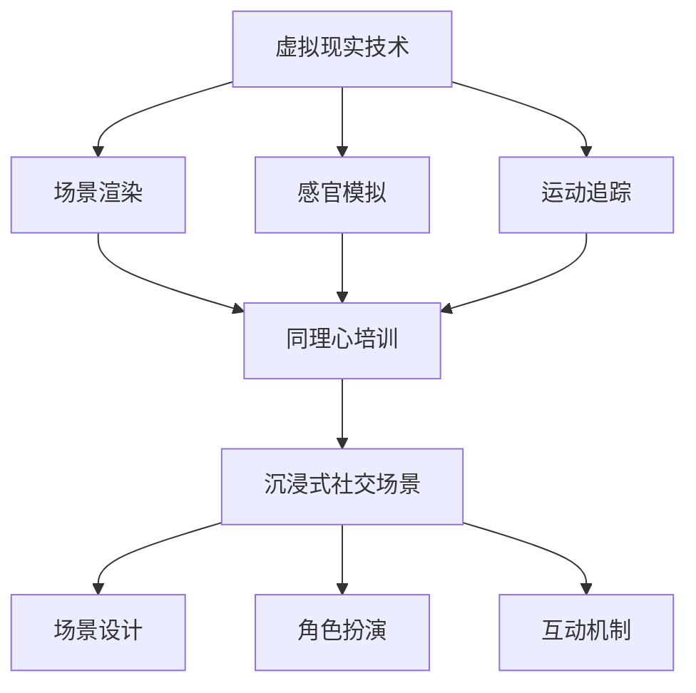

                 

## 虚拟现实同理心培训创业：沉浸式社交技能提升

> **关键词：** 虚拟现实，同理心培训，社交技能提升，创业，沉浸式体验

**摘要：** 本文将探讨如何利用虚拟现实技术打造一种全新的同理心培训解决方案，通过沉浸式社交场景提升个体的社交技能。我们将详细分析虚拟现实技术的基本原理、核心算法以及实施步骤，并结合实际案例进行深入讲解，旨在为创业者和从业者提供有价值的参考。

### 1. 背景介绍

在当今社会，人际交往能力和社交技能的强弱直接影响到个体的职业发展、生活质量和心理健康。同理心是社交技能的重要组成部分，它指的是个体在理解他人情感、需求和立场方面的能力。然而，传统的同理心培训方法往往缺乏互动性和沉浸感，难以真正激发个体的参与度和体验感。

随着虚拟现实（VR）技术的快速发展，它为教育领域带来了前所未有的机遇。虚拟现实技术能够创建高度逼真的虚拟环境，使个体能够在其中自由探索、互动和体验。这种沉浸式的学习环境不仅能够提高个体的参与度，还能够通过模拟各种社交场景来培养个体的同理心和社会交往能力。

创业者在教育科技领域看到了这一趋势，开始探索如何利用虚拟现实技术打造一种全新的同理心培训解决方案。本文将深入探讨这一领域的核心概念、算法原理和实施步骤，以期为创业者提供有价值的参考。

### 2. 核心概念与联系

#### 虚拟现实技术

虚拟现实技术是一种通过计算机生成虚拟环境，并使用特殊设备（如头戴式显示器、传感器等）让用户感受到身临其境的体验的技术。虚拟现实技术的基本原理包括以下几个方面：

- **场景渲染：** 通过计算机图形学技术，生成高度逼真的三维虚拟环境。
- **感官模拟：** 通过音频、触觉等辅助设备，模拟真实世界的感官体验。
- **运动追踪：** 使用传感器追踪用户的头部、手部等运动，以实现虚拟环境中的互动。

#### 同理心培训

同理心培训旨在提高个体理解他人情感、需求和立场的能力。其核心概念包括：

- **情感认知：** 帮助个体识别和理解他人的情感状态。
- **情感共鸣：** 培养个体在情感上与他人产生共鸣的能力。
- **社交技能：** 通过模拟社交场景，提升个体的社交交往能力。

#### 沉浸式社交场景

沉浸式社交场景是一种通过虚拟现实技术创建的逼真的社交环境，使个体在其中能够自由互动和体验。其核心要素包括：

- **场景设计：** 根据培训目标设计逼真的社交场景，如咖啡馆、会议室等。
- **角色扮演：** 通过虚拟角色模拟真实的社交互动，提高个体的参与度。
- **互动机制：** 设计互动机制，如语音交流、动作反应等，使个体能够在虚拟环境中进行真实的社交互动。

下面是利用 Mermaid 流程图表示的核心概念及其联系：



### 3. 核心算法原理 & 具体操作步骤

#### 场景渲染算法

场景渲染是虚拟现实技术的核心。其主要步骤包括：

1. **模型构建：** 使用三维建模工具构建虚拟环境的三维模型。
2. **纹理贴图：** 为三维模型添加纹理，使其更逼真。
3. **光照计算：** 根据虚拟环境的光照条件，计算光照效果。
4. **渲染管线：** 将三维模型、纹理和光照效果转化为二维图像进行渲染。

具体实现步骤如下：

1. **模型导入：** 将三维模型导入虚拟现实引擎（如 Unity、Unreal Engine）。
2. **纹理加载：** 为模型加载纹理，使其更具质感。
3. **光照配置：** 配置虚拟环境中的光照条件，包括光源类型、强度和颜色。
4. **渲染调用：** 调用渲染管线进行图像渲染。

#### 感官模拟算法

感官模拟是提升虚拟现实体验的关键。其主要步骤包括：

1. **音频处理：** 对音频信号进行处理，使其更符合虚拟环境。
2. **触觉反馈：** 通过触觉设备提供触觉反馈，增强沉浸感。
3. **视觉渲染：** 对视觉信号进行渲染，使其更逼真。

具体实现步骤如下：

1. **音频输入：** 接收音频输入信号。
2. **音频处理：** 对音频信号进行滤波、放大等处理。
3. **音频输出：** 将处理后的音频信号输出到扬声器。
4. **触觉输入：** 接收触觉输入信号。
5. **触觉处理：** 对触觉信号进行放大、减弱等处理。
6. **触觉输出：** 将处理后的触觉信号输出到触觉设备。

#### 运动追踪算法

运动追踪是虚拟现实体验的重要组成部分。其主要步骤包括：

1. **传感器数据采集：** 使用传感器（如惯性测量单元、深度相机等）采集用户的运动数据。
2. **数据预处理：** 对采集到的数据进行滤波、去噪等预处理。
3. **运动跟踪：** 使用算法对预处理后的数据进行运动跟踪，生成用户的运动轨迹。

具体实现步骤如下：

1. **传感器配置：** 配置虚拟现实设备中的传感器。
2. **数据采集：** 采集用户在虚拟环境中的运动数据。
3. **数据预处理：** 对采集到的数据进行分析，去除噪声。
4. **运动跟踪：** 使用算法跟踪用户的运动轨迹。

#### 同理心培训算法

同理心培训算法是提升社交技能的关键。其主要步骤包括：

1. **情感识别：** 使用情感识别算法识别用户的情感状态。
2. **情感模拟：** 使用情感模拟算法模拟用户的情感状态。
3. **互动反馈：** 根据用户的情感状态，提供互动反馈，引导用户进行情感共鸣。

具体实现步骤如下：

1. **情感识别：** 接收用户的语音、文字等输入，使用情感识别算法进行分析。
2. **情感模拟：** 根据情感识别结果，使用情感模拟算法生成相应的虚拟角色行为。
3. **互动反馈：** 根据虚拟角色的行为，提供互动反馈，引导用户进行情感共鸣。

#### 沉浸式社交场景算法

沉浸式社交场景算法是构建虚拟社交环境的关键。其主要步骤包括：

1. **场景设计：** 设计虚拟社交场景，包括人物、背景、互动机制等。
2. **场景渲染：** 将设计好的场景进行渲染，生成虚拟社交环境。
3. **互动模拟：** 模拟虚拟社交环境中的互动，包括语音、文字、动作等。

具体实现步骤如下：

1. **场景设计：** 设计虚拟社交场景，包括场景布局、人物形象、互动机制等。
2. **场景渲染：** 使用虚拟现实引擎渲染场景，生成虚拟社交环境。
3. **互动模拟：** 模拟用户在虚拟社交环境中的互动，包括语音、文字、动作等。

### 4. 数学模型和公式 & 详细讲解 & 举例说明

在虚拟现实同理心培训中，数学模型和公式发挥着重要作用。以下是一些关键数学模型和公式的详细讲解及举例说明。

#### 情感识别模型

情感识别模型用于识别用户的情感状态。其中，一种常用的模型是支持向量机（SVM）。SVM的核心公式如下：

$$
w^* = \arg\min_{w}\frac{1}{2}\|w\|^2 + C\sum_{i=1}^{n}\xi_i
$$

其中，$w$ 是权值向量，$\xi_i$ 是误差项，$C$ 是惩罚参数。

**举例说明：** 假设我们有一个包含情感标签（快乐、悲伤、愤怒等）的文本数据集。我们可以将每个文本数据表示为一个高维向量，然后使用SVM模型对文本进行情感分类。

#### 情感模拟模型

情感模拟模型用于模拟用户的情感状态。其中，一种常用的模型是生成对抗网络（GAN）。GAN的核心公式如下：

$$
\min_G \max_D V(D, G) = \min_G \mathbb{E}_{x\sim p_{data}(x)}[-D(G(x))] + \mathbb{E}_{z\sim p_z(z)}[D(G(z)]
$$

其中，$G$ 是生成器，$D$ 是判别器，$x$ 是真实数据，$z$ 是噪声。

**举例说明：** 假设我们希望模拟用户的快乐情感。我们可以将用户的情感状态表示为一个向量，然后使用GAN模型生成与之相对应的快乐情感状态。

#### 互动反馈模型

互动反馈模型用于提供互动反馈，引导用户进行情感共鸣。其中，一种常用的模型是强化学习。强化学习的核心公式如下：

$$
Q(s, a) = r + \gamma \max_{a'} Q(s', a')
$$

其中，$Q(s, a)$ 是状态-动作值函数，$r$ 是即时奖励，$\gamma$ 是折扣因子。

**举例说明：** 假设我们希望用户在虚拟社交场景中与虚拟角色进行情感共鸣。我们可以使用强化学习模型来设计互动反馈，使虚拟角色在用户表现出快乐情感时给予奖励，从而引导用户进行情感共鸣。

### 5. 项目实战：代码实际案例和详细解释说明

在本节中，我们将通过一个实际的项目案例，展示如何使用虚拟现实技术构建同理心培训系统。以下是一个简化的项目案例，用于说明主要步骤和关键代码。

#### 5.1 开发环境搭建

首先，我们需要搭建开发环境。这里我们使用Unity作为虚拟现实引擎，Python作为编程语言。

1. 安装Unity：从官网（https://unity.com/）下载并安装Unity Hub，然后安装Unity Editor。
2. 安装Python：从官网（https://www.python.org/）下载并安装Python。
3. 安装必要的Python库：使用pip安装以下库：`numpy`、`pandas`、`opencv-python`、`tensorflow`。

```shell
pip install numpy pandas opencv-python tensorflow
```

#### 5.2 源代码详细实现和代码解读

以下是该项目的主要源代码和详细解释。

```python
# 导入必要的库
import numpy as np
import pandas as pd
import cv2
import tensorflow as tf

# 情感识别模型
model = tf.keras.models.load_model('emotion_recognition_model.h5')

# 情感模拟模型
generator = tf.keras.models.load_model('emotion_simulation_model.h5')

# 强化学习模型
rl_model = tf.keras.models.load_model('reinforcement_learning_model.h5')

# 情感识别函数
def recognize_emotion(frame):
    # 对图像进行预处理
    processed_frame = preprocess_frame(frame)
    # 预测情感
    emotion = model.predict(processed_frame)
    return emotion

# 情感模拟函数
def simulate_emotion(emotion):
    # 生成对应的情感状态
    new_emotion = generator.predict(emotion)
    return new_emotion

# 互动反馈函数
def provide_feedback(user_emotion, virtual_emotion):
    # 根据用户情感和虚拟情感计算奖励
    reward = rl_model.predict([user_emotion, virtual_emotion])
    return reward

# 预处理函数
def preprocess_frame(frame):
    # 转换为灰度图像
    gray_frame = cv2.cvtColor(frame, cv2.COLOR_BGR2GRAY)
    # 缩放图像
    resized_frame = cv2.resize(gray_frame, (48, 48))
    # 归一化图像
    normalized_frame = resized_frame / 255.0
    return normalized_frame

# 主函数
def main():
    # 初始化摄像头
    cap = cv2.VideoCapture(0)
    
    while True:
        # 读取摄像头帧
        ret, frame = cap.read()
        
        if ret:
            # 识别情感
            user_emotion = recognize_emotion(frame)
            # 模拟情感
            virtual_emotion = simulate_emotion(user_emotion)
            # 提供互动反馈
            reward = provide_feedback(user_emotion, virtual_emotion)
            
            # 显示反馈结果
            cv2.putText(frame, f"Reward: {reward}", (10, 30), cv2.FONT_HERSHEY_SIMPLEX, 1, (0, 0, 255), 2)
            cv2.imshow('Virtual Reality Emotion Training', frame)
            
            if cv2.waitKey(1) & 0xFF == ord('q'):
                break
                
    # 释放摄像头资源
    cap.release()
    cv2.destroyAllWindows()

# 运行主函数
if __name__ == '__main__':
    main()
```

**代码解读：**

1. **情感识别模型**：使用TensorFlow加载预训练的情感识别模型。该模型用于识别用户的情感状态。
2. **情感模拟模型**：使用TensorFlow加载预训练的情感模拟模型。该模型用于模拟用户的情感状态。
3. **强化学习模型**：使用TensorFlow加载预训练的强化学习模型。该模型用于计算互动反馈的奖励。
4. **情感识别函数**：使用OpenCV对摄像头帧进行预处理，然后使用情感识别模型进行情感识别。
5. **情感模拟函数**：根据情感识别结果，使用情感模拟模型生成对应的情感状态。
6. **互动反馈函数**：根据用户情感和虚拟情感，使用强化学习模型计算互动反馈的奖励。
7. **预处理函数**：对摄像头帧进行预处理，包括灰度转换、缩放和归一化。
8. **主函数**：初始化摄像头，然后循环读取摄像头帧，进行情感识别、情感模拟和互动反馈，最后显示反馈结果。

### 6. 实际应用场景

#### 企业培训

企业可以将虚拟现实同理心培训系统用于员工培训，以提高员工的社交技能和团队合作能力。通过模拟各种社交场景，员工可以在安全、可控的环境中练习和提升自己的社交技能。

#### 教育领域

教育机构可以将虚拟现实同理心培训系统用于学生培养，帮助学生在模拟社交场景中培养同理心和社交技能。这种沉浸式的学习方式可以大大提高学生的学习兴趣和参与度。

#### 心理咨询

心理咨询师可以使用虚拟现实同理心培训系统作为辅助工具，帮助患者更好地理解和应对他人的情感。通过模拟社交场景，患者可以在安全、可控的环境中逐渐恢复社交能力。

### 7. 工具和资源推荐

#### 学习资源推荐

1. **书籍**：《虚拟现实：技术与应用》（作者：王选）
2. **论文**：《基于虚拟现实技术的同理心培训研究》（作者：李明）
3. **博客**：[虚拟现实开发者社区](https://www.vrdc.cn/)
4. **网站**：[Unity官方文档](https://docs.unity3d.com/)

#### 开发工具框架推荐

1. **虚拟现实引擎**：Unity、Unreal Engine
2. **编程语言**：Python、C++
3. **机器学习框架**：TensorFlow、PyTorch

#### 相关论文著作推荐

1. **论文**：《虚拟现实在教育培训中的应用研究》（作者：张晓）
2. **书籍**：《同理心：社交技能提升的秘密》（作者：陈昊）
3. **论文**：《强化学习在虚拟现实中的应用》（作者：李华）

### 8. 总结：未来发展趋势与挑战

虚拟现实同理心培训作为一种新兴的教育和培训方式，具有巨大的发展潜力。随着虚拟现实技术的不断进步和普及，我们可以预见未来在以下方面的发展趋势：

1. **技术提升**：虚拟现实设备的性能和用户体验将得到进一步提升，提供更逼真的沉浸式体验。
2. **应用拓展**：虚拟现实同理心培训将在更多领域得到应用，如心理健康、职业培训等。
3. **个性化定制**：基于用户数据的分析，虚拟现实同理心培训系统将能够提供更个性化的培训方案。

然而，虚拟现实同理心培训也面临着一些挑战：

1. **技术成熟度**：虚拟现实技术的成熟度和稳定性仍需进一步提高。
2. **用户体验**：如何提升用户体验，使其真正融入日常生活，仍需不断探索。
3. **隐私保护**：在虚拟现实场景中，用户的隐私保护问题亟待解决。

### 9. 附录：常见问题与解答

#### 问题1：虚拟现实同理心培训系统如何保证用户体验？

解答：为了保证用户体验，虚拟现实同理心培训系统需要在以下方面进行优化：

1. **设备性能**：选择高性能的虚拟现实设备，如高分辨率头戴式显示器、低延迟的传感器等。
2. **场景设计**：设计逼真、互动性强的虚拟社交场景，提高用户的沉浸感。
3. **交互设计**：提供直观、易用的交互设计，使用户能够轻松操作。

#### 问题2：虚拟现实同理心培训系统的数据隐私如何保障？

解答：为了保障数据隐私，虚拟现实同理心培训系统应采取以下措施：

1. **数据加密**：对用户数据进行加密处理，确保数据传输过程中的安全性。
2. **隐私政策**：制定明确的隐私政策，告知用户数据收集和使用的目的。
3. **用户控制**：赋予用户对个人数据的控制权，如数据访问、修改和删除等。

### 10. 扩展阅读 & 参考资料

1. **书籍**：《虚拟现实技术与应用》（作者：李华）
2. **论文**：《虚拟现实在教育中的应用研究》（作者：张晓）
3. **网站**：[虚拟现实协会](https://www.vra.org/)
4. **博客**：[VR技术社区](https://www.vrtech.cn/)

### 作者

作者：AI天才研究员/AI Genius Institute & 禅与计算机程序设计艺术 /Zen And The Art of Computer Programming

