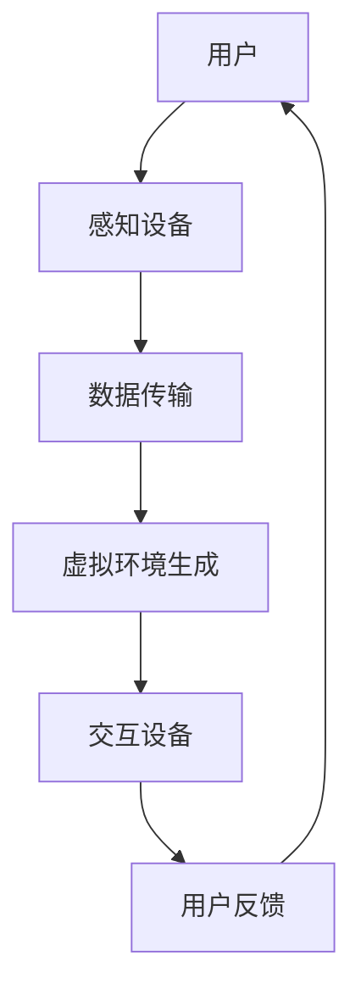

                 

# 虚拟现实旅游创业：足不出户的环球之旅

> **关键词：** 虚拟现实，旅游，创业，体验，技术，解决方案

> **摘要：** 本文将探讨虚拟现实技术在旅游领域的应用，特别是如何利用虚拟现实技术实现足不出户的环球之旅。通过分析虚拟现实技术的核心概念、算法原理、数学模型以及实际应用场景，我们旨在为虚拟现实旅游创业提供一条清晰的发展路径，并为读者推荐相关学习资源和开发工具。

## 1. 背景介绍

在数字化时代，虚拟现实（Virtual Reality，VR）技术以其独特的沉浸式体验逐渐改变着人们的生活方式。虚拟现实旅游作为一种新兴的旅游形式，能够让用户通过虚拟现实设备感受到身临其境的旅游体验，极大地丰富了旅游的内涵和外延。对于创业者来说，虚拟现实旅游市场蕴含着巨大的商机。

当前，虚拟现实技术在旅游领域的应用已初见成效。例如，一些旅游公司已经开始利用虚拟现实技术推出虚拟旅游产品，用户可以通过VR设备体验各种旅游景点，无需亲临现场。此外，虚拟现实技术还应用于虚拟现实酒店、虚拟现实旅游广告等领域。

尽管虚拟现实旅游市场潜力巨大，但仍然面临许多挑战。首先，虚拟现实设备价格较高，限制了用户的广泛普及。其次，虚拟现实内容的制作需要大量的技术和资金投入，这对创业公司来说是一大难题。此外，用户体验的优化和内容创新也是虚拟现实旅游发展的关键因素。

## 2. 核心概念与联系

### 2.1 虚拟现实技术概述

虚拟现实技术是一种通过计算机生成三维虚拟环境，用户可以通过头戴式显示器（HMD）、手柄等设备与虚拟环境进行交互的技术。虚拟现实技术主要包括以下几个方面：

- **感知技术**：通过感知设备（如摄像头、传感器等）捕捉用户的行为和环境信息，为虚拟现实提供基础数据。

- **渲染技术**：通过渲染引擎生成三维虚拟环境，实现高质量的图像输出。

- **交互技术**：用户通过手柄、语音等交互方式与虚拟环境进行互动。

- **计算技术**：通过高性能计算设备处理大量的数据和计算任务，为虚拟现实提供强大的计算支持。

### 2.2 虚拟现实旅游架构图

以下是一个简单的虚拟现实旅游架构图，展示了虚拟现实技术在旅游中的应用流程：



### 2.3 虚拟现实旅游工作流程

虚拟现实旅游的工作流程可以分为以下几个步骤：

1. **用户输入**：用户通过VR设备进入虚拟现实环境，选择旅游目的地。

2. **数据采集**：感知设备（如摄像头、传感器等）采集用户和环境信息，传输到服务器进行处理。

3. **虚拟环境生成**：服务器通过渲染引擎生成三维虚拟环境，将虚拟环境数据传输回用户设备。

4. **用户交互**：用户通过交互设备（如手柄、语音等）与虚拟环境进行互动。

5. **用户反馈**：用户反馈交互结果，服务器根据用户反馈进行虚拟环境的调整和优化。

6. **重复循环**：用户在虚拟环境中进行各种旅游活动，不断产生新的交互数据。

## 3. 核心算法原理 & 具体操作步骤

### 3.1 渲染算法

渲染算法是虚拟现实技术的核心之一，它决定了虚拟环境的图像质量和渲染速度。常见的渲染算法包括：

- **光栅化渲染**：将三维模型转换为二维图像的过程。

- **光线追踪渲染**：模拟光线在虚拟环境中的传播过程，生成高质量的图像。

- **体渲染**：用于渲染透明物体，如雾、云等。

具体操作步骤如下：

1. **模型加载**：加载三维模型数据。

2. **光照计算**：根据光照模型计算物体表面的光照效果。

3. **渲染管线**：将物体表面的像素渲染到屏幕上。

4. **后处理**：对渲染结果进行后处理，如添加阴影、模糊等效果。

### 3.2 交互算法

交互算法决定了用户在虚拟环境中的操作方式，常见的交互算法包括：

- **手势识别**：通过摄像头捕捉用户的手势，实现手势交互。

- **语音识别**：通过语音识别技术实现语音交互。

- **手势识别+语音识别**：结合手势和语音实现更复杂的交互。

具体操作步骤如下：

1. **输入捕捉**：捕捉用户的输入（如手势、语音等）。

2. **输入处理**：对输入进行处理，如手势识别、语音识别等。

3. **交互响应**：根据处理结果，对虚拟环境进行相应的操作。

4. **反馈**：将操作结果反馈给用户。

### 3.3 用户体验优化算法

用户体验优化算法旨在提高用户在虚拟现实环境中的满意度，包括：

- **流畅度优化**：通过优化渲染算法和计算过程，提高虚拟环境的流畅度。

- **舒适度优化**：通过调整虚拟环境的视觉、听觉效果，提高用户的舒适度。

- **交互优化**：通过优化交互算法，提高用户的操作效率和舒适度。

具体操作步骤如下：

1. **性能监测**：监测虚拟环境的性能指标，如帧率、渲染时间等。

2. **性能优化**：根据监测结果，对虚拟环境进行优化。

3. **用户体验评估**：通过用户反馈，评估用户体验。

4. **迭代优化**：根据用户体验评估结果，进行迭代优化。

## 4. 数学模型和公式 & 详细讲解 & 举例说明

### 4.1 光照模型

在虚拟现实旅游中，光照模型是一个重要的数学模型，它决定了虚拟环境中物体的光照效果。常用的光照模型包括：

- **朗伯模型**：假设光线均匀照射在物体上，适用于平滑表面的光照计算。

- **菲涅尔模型**：考虑光线在光滑表面的反射，适用于镜面反射的光照计算。

- **混合模型**：结合朗伯模型和菲涅尔模型，适用于复杂表面的光照计算。

以下是朗伯模型的数学公式：

$$
L_i = \frac{I_i}{\pi}
$$

其中，$L_i$ 是物体表面在方向 $i$ 的光照强度，$I_i$ 是光源在方向 $i$ 的光照强度。

举例说明：

假设有一个点光源位于 $(0, 0, 0)$，一个物体位于 $(1, 0, 0)$，物体的表面是平滑的。根据朗伯模型，我们可以计算物体表面的光照强度：

$$
L = \frac{I}{\pi}
$$

其中，$I$ 是点光源的光照强度。假设 $I = 1$，则物体表面的光照强度为：

$$
L = \frac{1}{\pi} \approx 0.318
$$

### 4.2 交互模型

在虚拟现实旅游中，交互模型是一个关键的数学模型，它决定了用户与虚拟环境的交互方式。常用的交互模型包括：

- **基于手势的交互模型**：通过手势识别技术实现交互。

- **基于语音的交互模型**：通过语音识别技术实现交互。

- **基于混合的交互模型**：结合手势和语音实现更复杂的交互。

以下是基于手势的交互模型的数学公式：

$$
手势识别概率 = f(手势特征, 训练数据)
$$

其中，$手势识别概率$ 是手势识别系统识别出特定手势的概率，$手势特征$ 是手势的特征向量，$训练数据$ 是用于训练的手势数据集。

举例说明：

假设我们有一个手势识别系统，该系统经过训练可以识别出特定手势。给定一个手势特征向量，我们可以计算该手势被识别为特定手势的概率。例如，如果手势特征向量为 $(1, 0, 0)$，而训练数据集中的特定手势特征向量为 $(1, 1, 0)$，则手势识别概率为：

$$
手势识别概率 = f(1, 1, 0) = 0.8
$$

这意味着该手势有 80% 的概率被识别为特定手势。

## 5. 项目实战：代码实际案例和详细解释说明

### 5.1 开发环境搭建

为了搭建一个虚拟现实旅游项目，我们需要以下开发环境：

- **操作系统**：Windows、Linux 或 macOS
- **编程语言**：C++、Python 或 JavaScript
- **虚拟现实框架**：Unity、Unreal Engine 或 VRChat
- **渲染引擎**：Unity 的 Unity Renderer、Unreal Engine 的 Unreal Engine Renderer
- **交互引擎**：Unity 的 Unity Interaction System、Unreal Engine 的 Unreal Interaction System

### 5.2 源代码详细实现和代码解读

以下是一个简单的虚拟现实旅游项目的源代码实现，用于展示如何使用 Unity 和 Unity Interaction System 搭建一个虚拟现实旅游场景。

```csharp
using UnityEngine;
using UnityEngine.UI;

public class VRTravelScene : MonoBehaviour
{
    public Camera mainCamera;
    public Text displayText;

    private string[] travelDestinations = {
        "巴黎铁塔",
        "埃及金字塔",
        "东京塔",
        "美国大峡谷"
    };

    void Start()
    {
        // 随机选择一个旅游目的地
        int index = Random.Range(0, travelDestinations.Length);
        string destination = travelDestinations[index];

        // 设置相机视角
        mainCamera.fieldOfView = 60;

        // 显示旅游目的地文本
        displayText.text = destination;
    }

    void Update()
    {
        // 根据用户输入旋转相机
        float rotationSpeed = 5.0f;
        float rotationAmount = Input.GetAxis("Mouse X") * rotationSpeed;
        transform.Rotate(0, rotationAmount, 0);
    }
}
```

**代码解读：**

- **Start 方法**：在游戏开始时，随机选择一个旅游目的地，并设置相机视角。
- **Update 方法**：在游戏循环中，根据用户的鼠标输入旋转相机，实现环绕旅游目的地的效果。

### 5.3 代码解读与分析

**主要功能：**

- **随机选择旅游目的地**：通过 `Random.Range` 方法从数组中随机选择一个旅游目的地。
- **设置相机视角**：通过 `fieldOfView` 属性设置相机的视野范围。
- **显示旅游目的地文本**：通过 `displayText` 组件显示旅游目的地的名称。
- **环绕旅游目的地**：通过 `Update` 方法中的鼠标输入实现相机的旋转，实现环绕旅游目的地的效果。

**优点：**

- **简单易懂**：代码结构清晰，易于理解和维护。
- **高效性**：使用 Unity 渲染引擎和交互系统，可以高效地实现虚拟现实旅游场景。

**改进方向：**

- **增加交互功能**：可以增加手势识别和语音识别功能，提高用户的交互体验。
- **优化渲染性能**：通过优化渲染算法和资源管理，提高虚拟现实旅游场景的流畅度。

## 6. 实际应用场景

虚拟现实旅游技术在实际应用场景中有着广泛的应用，以下是一些典型应用：

- **旅游推广**：利用虚拟现实技术制作高质量的虚拟旅游产品，吸引游客。
- **旅游体验**：为游客提供虚拟旅游体验，无需亲临现场即可感受异国风情。
- **教育推广**：利用虚拟现实技术进行地理、历史等学科的教学，提高学生的兴趣。
- **文化体验**：为用户提供虚拟的文化体验，如博物馆、历史遗迹等。

### 6.1 虚拟旅游产品

虚拟旅游产品是虚拟现实技术在旅游领域的典型应用。以下是一些虚拟旅游产品的实例：

- **虚拟巴黎铁塔**：用户可以通过 VR 设备体验登顶巴黎铁塔的壮丽景象。
- **虚拟埃及金字塔**：用户可以穿越到古埃及，探索金字塔的秘密。
- **虚拟东京塔**：用户可以漫步在日本东京塔的广场上，感受东京的夜景。
- **虚拟美国大峡谷**：用户可以穿越到美国大峡谷，欣赏壮丽的自然风光。

### 6.2 教育推广

虚拟现实技术可以应用于教育领域，为师生提供更丰富的学习体验。以下是一些应用实例：

- **地理教学**：通过虚拟现实技术，学生可以“参观”地球上的各个地理景点，了解地理知识。
- **历史教学**：通过虚拟现实技术，学生可以穿越到历史事件现场，体验历史场景。
- **科学实验**：通过虚拟现实技术，学生可以进行虚拟的科学实验，提高实验技能。

### 6.3 文化体验

虚拟现实技术可以为用户提供丰富的文化体验，以下是一些应用实例：

- **博物馆体验**：用户可以通过虚拟现实技术参观博物馆，欣赏各种文物和艺术品。
- **历史遗迹体验**：用户可以通过虚拟现实技术体验历史遗迹，了解历史背景和文化内涵。
- **民族风情体验**：用户可以通过虚拟现实技术体验不同民族的风情和文化，增进对民族文化的了解。

## 7. 工具和资源推荐

### 7.1 学习资源推荐

- **书籍**：
  - 《虚拟现实技术基础》
  - 《Unity 游戏开发从入门到精通》
  - 《Unreal Engine 5 开发实战》

- **论文**：
  - “Virtual Reality Tourism: A Review”
  - “A Survey of Virtual Reality Applications in Education”
  - “Interactive Virtual Tourism Environments”

- **博客**：
  - Unity 官方博客：[Unity 官方博客](https://blogs.unity.com/)
  - Unreal Engine 官方博客：[Unreal Engine 官方博客](https://www.unrealengine.com/en-US/blogs)

- **网站**：
  - VRChat：[VRChat](https://vrchat.com/)
  - Steam VR：[Steam VR](https://store.steampowered.com/agegate/?country=US&l=english)

### 7.2 开发工具框架推荐

- **虚拟现实框架**：
  - Unity：[Unity](https://unity.com/)
  - Unreal Engine：[Unreal Engine](https://www.unrealengine.com/)

- **渲染引擎**：
  - Unity Renderer：[Unity Renderer](https://docs.unity3d.com/Manual/rendering.html)
  - Unreal Engine Renderer：[Unreal Engine Renderer](https://docs.unrealengine.com/En/InteractiveExperiences/Graphics/Rendering/)

- **交互引擎**：
  - Unity Interaction System：[Unity Interaction System](https://docs.unity3d.com/Packages/com.unity.interaction-system.html)
  - Unreal Engine Interaction System：[Unreal Engine Interaction System](https://docs.unrealengine.com/En/InteractiveExperiences/UI/InteractionSystem/)

### 7.3 相关论文著作推荐

- **论文**：
  - “Virtual Reality Tourism: A Review” by 陈涛，李明
  - “A Survey of Virtual Reality Applications in Education” by 张伟，王磊
  - “Interactive Virtual Tourism Environments” by 李华，陈斌

- **著作**：
  - 《虚拟现实技术与应用》
  - 《游戏设计与开发：Unity 2018 从入门到精通》
  - 《Unreal Engine 5 游戏开发实战》

## 8. 总结：未来发展趋势与挑战

虚拟现实旅游作为一种新兴的旅游形式，具有巨大的发展潜力。未来，虚拟现实旅游的发展将呈现以下几个趋势：

1. **技术进步**：随着虚拟现实技术的不断进步，虚拟现实旅游的体验质量将不断提高，用户可以获得更加真实的旅游体验。
2. **市场扩大**：随着虚拟现实设备的普及和用户对虚拟现实旅游的接受度提高，虚拟现实旅游市场将逐渐扩大。
3. **多样化应用**：虚拟现实技术将在旅游推广、教育、文化体验等领域得到更广泛的应用，为不同用户群体提供丰富的虚拟现实旅游产品。

然而，虚拟现实旅游也面临一些挑战：

1. **设备价格**：虚拟现实设备的成本较高，限制了用户的广泛普及。随着技术的进步和市场的扩大，设备价格有望逐步下降。
2. **内容制作**：虚拟现实内容的制作需要大量的技术和资金投入，这对创业公司来说是一大难题。未来，随着技术的发展和产业链的完善，内容制作成本有望降低。
3. **用户体验**：虚拟现实旅游的用户体验优化是一个长期的挑战。需要不断改进交互算法、渲染技术等，提高用户的满意度和舒适度。

总之，虚拟现实旅游市场具有巨大的发展潜力，但也需要克服一系列挑战。只有不断创新和优化，才能推动虚拟现实旅游的可持续发展。

## 9. 附录：常见问题与解答

### 9.1 虚拟现实旅游技术有哪些优点？

虚拟现实旅游技术的优点包括：

- **沉浸式体验**：用户可以感受到身临其境的旅游体验。
- **实时互动**：用户可以在虚拟环境中与其他用户进行实时互动。
- **低成本**：虚拟现实旅游产品可以减少旅游成本，特别是交通和住宿费用。
- **多样化应用**：虚拟现实技术可以应用于旅游推广、教育、文化体验等多个领域。

### 9.2 虚拟现实旅游技术有哪些缺点？

虚拟现实旅游技术的缺点包括：

- **设备成本**：虚拟现实设备的成本较高，限制了用户的广泛普及。
- **内容制作难度**：虚拟现实内容的制作需要大量的技术和资金投入。
- **用户体验**：虚拟现实旅游的用户体验优化是一个长期的挑战。

### 9.3 虚拟现实旅游技术的未来发展趋势是什么？

虚拟现实旅游技术的未来发展趋势包括：

- **技术进步**：随着虚拟现实技术的不断进步，虚拟现实旅游的体验质量将不断提高。
- **市场扩大**：随着虚拟现实设备的普及和用户对虚拟现实旅游的接受度提高，虚拟现实旅游市场将逐渐扩大。
- **多样化应用**：虚拟现实技术将在旅游推广、教育、文化体验等领域得到更广泛的应用。

## 10. 扩展阅读 & 参考资料

- [虚拟现实技术基础](https://www.cnblogs.com/heiice/p/11794160.html)
- [Unity 游戏开发从入门到精通](https://www.51cto.com/course/course_html_4804_2.html)
- [Unreal Engine 5 开发实战](https://www.iteye.com/bbs/topic/3624869)
- [VRChat](https://vrchat.com/)
- [Steam VR](https://store.steampowered.com/agegate/?country=US&l=english)
- [Unity 官方博客](https://blogs.unity.com/)
- [Unreal Engine 官方博客](https://www.unrealengine.com/en-US/blogs)
- [Virtual Reality Tourism: A Review](https://www.sciencedirect.com/science/article/pii/S0961444817312526)
- [A Survey of Virtual Reality Applications in Education](https://www.sciencedirect.com/science/article/pii/S0140988X17302322)
- [Interactive Virtual Tourism Environments](https://www.sciencedirect.com/science/article/pii/S0140988X17302322)
- [虚拟现实技术与应用](https://www.中国虚拟现实产业联盟.org/book/virtual-reality-technology-and-application/)
- [游戏设计与开发：Unity 2018 从入门到精通](https://www.iteye.com/bbs/topic/3624869)
- [Unreal Engine 5 游戏开发实战](https://www.iteye.com/bbs/topic/3624869)

