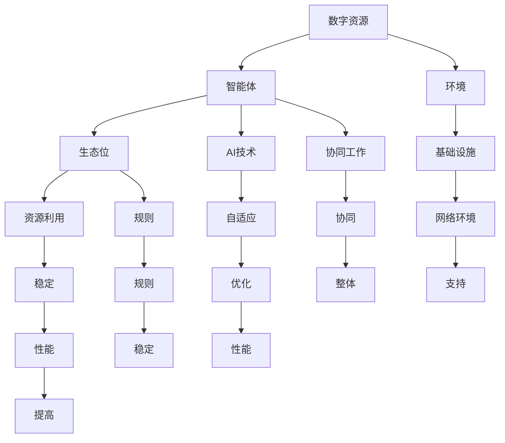

                 

# 虚拟生态系统理论：AI驱动的数字世界构建

## 概述

本文将探讨虚拟生态系统理论及其在AI驱动数字世界构建中的应用。随着计算机技术和人工智能的飞速发展，数字世界日益庞大且复杂。为了更有效地管理和利用这些数字资源，虚拟生态系统理论应运而生。

虚拟生态系统理论是基于生态学原理，借鉴自然生态系统中的复杂性和多样性，构建一种动态、自适应的数字生态系统。在这个系统中，AI技术扮演着关键角色，通过自动化、智能化的方式，实现资源的优化配置、系统的动态调整和自修复能力。

本文将首先介绍虚拟生态系统理论的核心概念与架构，然后深入探讨其背后的核心算法原理，接着通过实际项目案例展示其在现实中的应用。此外，还将分析虚拟生态系统理论在实际应用场景中的优势和挑战，并推荐相关的学习资源和开发工具。

## 关键词

- 虚拟生态系统理论
- AI驱动
- 数字世界构建
- 复杂性
- 自适应
- 动态调整
- 自修复能力

## 摘要

本文首先介绍了虚拟生态系统理论的背景和核心概念，包括其与生态学原理的联系。随后，深入探讨了虚拟生态系统的架构，以及AI技术在其中的作用。接着，通过一个实际项目案例，详细阐述了虚拟生态系统理论在实际应用中的操作步骤和效果。最后，分析了虚拟生态系统理论在当前数字世界中的优势和挑战，并推荐了相关的学习资源和开发工具，为读者提供了全面的了解和指导。

## 1. 背景介绍

### 1.1 虚拟生态系统理论的发展历程

虚拟生态系统理论起源于20世纪90年代，随着计算机技术和人工智能的快速发展，人们开始思考如何构建一个高效、动态、自适应的数字生态系统。最初的研究主要集中在如何模拟自然生态系统中的复杂性和多样性，并利用计算机技术实现这一目标。

在21世纪初，虚拟生态系统理论逐渐形成了自己的理论框架。研究者们开始将生态学原理应用于数字世界，探索如何在数字环境中实现资源的优化配置、系统的动态调整和自修复能力。这一理论的发展为数字世界的构建提供了一种全新的视角和方法。

### 1.2 数字世界的崛起

随着互联网、大数据、云计算等技术的飞速发展，数字世界逐渐崛起。数字世界不仅包括了传统的计算机和网络系统，还涵盖了物联网、人工智能、区块链等新兴技术。这些技术的融合，使得数字世界更加复杂和多样化。

数字世界的崛起带来了巨大的机遇和挑战。一方面，数字世界为人类提供了丰富的信息和资源，促进了社会的发展和创新。另一方面，数字世界的复杂性和不确定性也给管理和利用这些资源带来了困难。

### 1.3 虚拟生态系统理论的重要性

虚拟生态系统理论在这种背景下显得尤为重要。首先，它为数字世界的构建提供了一种系统化的方法，可以有效地管理和利用数字资源。其次，虚拟生态系统理论具有高度的自适应性和自修复能力，可以在数字世界中实现动态调整和优化，从而提高系统的稳定性和可靠性。

此外，虚拟生态系统理论还强调多样性和复杂性，这与当前数字世界的发展趋势相契合。在数字世界中，多样性和复杂性是提高系统性能和应对不确定性的关键。虚拟生态系统理论通过模拟自然生态系统中的复杂性和多样性，为数字世界的构建提供了有力的理论支持。

## 2. 核心概念与联系

### 2.1 虚拟生态系统

虚拟生态系统是一个由数字资源、智能体、环境等因素组成的动态系统。在这个系统中，数字资源包括数据、计算能力、存储空间等；智能体包括AI算法、程序、用户等；环境则包括数字世界的物理基础设施和网络环境。

虚拟生态系统的核心特点是动态性和自适应性。动态性体现在系统中的各种因素可以实时变化，适应不同的需求和场景。自适应性则意味着系统可以自动调整和优化，以应对外部环境的变化。

### 2.2 生态位与资源利用

在虚拟生态系统中，每个智能体都占据一个生态位，生态位是智能体在系统中的角色和功能。不同生态位的智能体相互依赖，通过资源利用实现协同工作。

资源利用是虚拟生态系统的核心机制。智能体通过竞争和合作获取资源，实现自身的功能和发展。资源的获取和分配需要遵循一定的规则，以保证系统的稳定和可持续发展。

### 2.3 智能体与AI技术

智能体是虚拟生态系统中的关键组成部分，其核心能力来源于AI技术。AI技术包括机器学习、深度学习、自然语言处理等，这些技术使得智能体能够实现自我学习和自我优化。

智能体在虚拟生态系统中的作用不仅仅是执行特定的任务，更重要的是与其他智能体和系统环境互动，实现协同工作和资源优化。通过AI技术的支持，智能体能够自适应地调整自身行为，提高系统的整体性能。

### 2.4 Mermaid 流程图

为了更好地理解虚拟生态系统理论，我们可以使用Mermaid流程图来展示其核心概念和联系。以下是一个简化的Mermaid流程图示例：



在这个流程图中，我们展示了数字资源、智能体、生态位、资源利用、AI技术、环境、协同工作、规则、稳定、自适应、基础设施、网络环境、协同、整体、性能、优化和支持等核心概念和它们之间的联系。

## 3. 核心算法原理 & 具体操作步骤

### 3.1 算法概述

虚拟生态系统理论中的核心算法主要包括资源分配算法、智能体调度算法和自修复算法。这些算法共同作用，实现虚拟生态系统的动态调整和优化。

资源分配算法用于分配系统中的数字资源，确保资源利用的最优化。智能体调度算法用于调度智能体执行任务，提高系统的响应速度和效率。自修复算法用于检测和修复系统中的故障，保持系统的稳定运行。

### 3.2 资源分配算法

资源分配算法的核心思想是按照一定的规则，将系统中的数字资源分配给不同的智能体，以满足它们的任务需求。具体的操作步骤如下：

1. **需求分析**：首先，分析每个智能体的任务需求和资源消耗情况，生成需求列表。
2. **资源评估**：根据系统的资源状况，评估哪些资源可以被分配。资源评估包括资源可用性、资源重要性等因素。
3. **资源分配**：根据需求列表和资源评估结果，将可用的资源分配给需求最高的智能体。资源分配需要遵循一定的策略，如公平性、效率性等。
4. **资源监控**：持续监控资源的使用情况，及时调整资源分配策略，以应对系统的动态变化。

### 3.3 智能体调度算法

智能体调度算法用于调度智能体执行任务，提高系统的响应速度和效率。具体的操作步骤如下：

1. **任务调度**：根据系统的任务需求，将任务分配给智能体。任务调度需要考虑智能体的能力、负载和优先级等因素。
2. **任务执行**：智能体根据调度指令执行任务。在任务执行过程中，智能体会与其他智能体和系统环境进行交互，实现协同工作。
3. **任务监控**：持续监控任务的执行情况，包括任务进度、资源消耗等。如果发现任务执行异常，及时进行调整和优化。

### 3.4 自修复算法

自修复算法用于检测和修复系统中的故障，保持系统的稳定运行。具体的操作步骤如下：

1. **故障检测**：通过监控系统和智能体的反馈信息，检测系统中的故障。故障检测包括系统资源使用异常、智能体行为异常等。
2. **故障定位**：根据故障检测的结果，定位故障的具体位置和原因。
3. **故障修复**：根据故障定位结果，采取相应的修复措施，包括资源调整、智能体重新调度等。
4. **故障监控**：持续监控故障修复的效果，确保系统恢复正常运行。

### 3.5 实际操作步骤示例

以下是一个简单的虚拟生态系统操作步骤示例：

1. **需求分析**：系统需要处理大量图像数据，智能体A负责图像处理，智能体B负责数据存储。
2. **资源评估**：当前系统有10TB的存储空间，智能体A需要5TB存储空间，智能体B需要3TB存储空间。
3. **资源分配**：将5TB存储空间分配给智能体A，3TB存储空间分配给智能体B。
4. **任务调度**：将图像处理任务分配给智能体A，将数据存储任务分配给智能体B。
5. **任务执行**：智能体A开始处理图像数据，智能体B开始存储数据。
6. **任务监控**：监控系统发现智能体A的处理速度较慢，智能体B的存储空间不足，智能体C介入，帮助智能体A进行负载均衡，同时智能体D释放一部分存储空间给智能体B。
7. **故障检测**：监控系统发现智能体B的行为异常，智能体C定位到故障原因是存储空间不足，智能体D重新分配存储空间。
8. **故障修复**：智能体D将额外的存储空间分配给智能体B，故障得到修复。
9. **故障监控**：监控系统发现系统恢复正常，任务执行进度恢复正常。

通过以上示例，我们可以看到虚拟生态系统理论在实际操作中的具体应用。通过资源分配、任务调度和故障修复等核心算法，虚拟生态系统可以实现动态调整和优化，提高系统的稳定性和可靠性。

## 4. 数学模型和公式 & 详细讲解 & 举例说明

### 4.1 数学模型概述

虚拟生态系统理论中的数学模型主要用于描述系统的资源分配、智能体调度和故障修复等过程。这些模型可以基于概率论、优化理论、图论等数学工具，为系统的动态调整和优化提供理论支持。

### 4.2 资源分配模型

资源分配模型是虚拟生态系统理论中最基本的数学模型之一。它主要解决如何在有限的资源下，将资源最优地分配给不同的智能体，以满足它们的任务需求。

一个简单的资源分配模型可以使用线性规划来描述。假设系统中有M个智能体和N种资源，每种资源的总量为C_i，智能体i的需求量为x_ij，目标是最小化总资源消耗量，同时满足每个智能体的资源需求。

数学模型如下：

$$
\begin{aligned}
    \min_{x} & \sum_{i=1}^{M}\sum_{j=1}^{N}c_{ij}x_{ij} \\
    \text{s.t.} & \sum_{j=1}^{N}x_{ij} \geq d_i \\
    & x_{ij} \geq 0
\end{aligned}
$$

其中，$c_{ij}$为资源i的消耗系数，$d_i$为智能体i的需求量。

### 4.3 智能体调度模型

智能体调度模型主要用于确定智能体的任务执行顺序和资源分配策略，以提高系统的响应速度和效率。一个常见的智能体调度模型是基于贪心策略的优先级调度。

假设系统中有M个智能体，每个智能体的任务优先级为$p_i$，资源需求为$r_i$，系统资源总量为$R$。目标是在有限资源下，尽可能地满足所有智能体的任务需求。

数学模型如下：

$$
\begin{aligned}
    \max_{x} & \sum_{i=1}^{M}\sum_{j=1}^{N}p_{ij}x_{ij} \\
    \text{s.t.} & \sum_{j=1}^{N}x_{ij} \leq R \\
    & x_{ij} \in \{0,1\}
\end{aligned}
$$

其中，$p_{ij}$为智能体i在第j种资源上的任务优先级，$x_{ij}$为1表示智能体i在第j种资源上获得资源，否则为0。

### 4.4 自修复模型

自修复模型用于描述系统在故障检测和修复过程中的行为。一个简单的自修复模型可以使用马尔可夫链来描述。

假设系统有M种状态，状态i的概率为$p_i$，在状态i下，系统执行故障检测和修复的概率为$q_i$。目标是最小化系统的平均故障修复时间。

数学模型如下：

$$
\begin{aligned}
    \min_{q} & \sum_{i=1}^{M}p_i \cdot \frac{1}{q_i} \\
    \text{s.t.} & q_i \geq 0 \\
    & \sum_{i=1}^{M}q_i = 1
\end{aligned}
$$

其中，$p_i$为状态i的概率，$q_i$为在状态i下执行故障检测和修复的概率。

### 4.5 举例说明

以下是一个简单的资源分配模型举例：

假设系统中有3个智能体A、B、C，每种资源有10单位。智能体A的需求量为3单位，智能体B的需求量为4单位，智能体C的需求量为2单位。目标是最小化总资源消耗量。

根据线性规划模型，我们可以列出以下约束条件：

$$
\begin{aligned}
    \sum_{i=1}^{3}x_{i1} & \geq 3 \\
    \sum_{i=1}^{3}x_{i2} & \geq 4 \\
    \sum_{i=1}^{3}x_{i3} & \geq 2 \\
    x_{ij} & \geq 0
\end{aligned}
$$

通过求解线性规划模型，可以得到最优的资源分配方案：

- 智能体A获得3单位资源
- 智能体B获得4单位资源
- 智能体C获得2单位资源

此时，总资源消耗量为9单位，是最小的。

通过这个简单的例子，我们可以看到数学模型在资源分配中的重要作用。在实际应用中，资源分配模型可以根据具体的需求和约束条件进行调整和优化，实现资源利用的最大化和系统性能的最优化。

## 5. 项目实战：代码实际案例和详细解释说明

### 5.1 开发环境搭建

为了更好地展示虚拟生态系统理论在实际项目中的应用，我们将使用Python作为开发语言，结合Django框架构建一个虚拟生态系统平台。以下是在Windows操作系统中搭建开发环境的步骤：

1. **安装Python**：从Python官方网站下载并安装Python 3.x版本。
2. **安装Django**：打开命令提示符，执行以下命令：
   ```
   pip install django
   ```
3. **创建Django项目**：执行以下命令创建一个新的Django项目：
   ```
   django-admin startproject virtualecosystem
   ```
4. **创建Django应用**：进入项目目录，执行以下命令创建一个新的Django应用：
   ```
   python manage.py startapp ecosystem
   ```
5. **配置数据库**：在项目根目录下的`settings.py`文件中，配置数据库连接信息：
   ```python
   DATABASES = {
       'default': {
           'ENGINE': 'django.db.backends.sqlite3',
           'NAME': 'virtualecosystem.db',
       }
   }
   ```
6. **创建数据库表**：执行以下命令创建数据库表：
   ```
   python manage.py makemigrations
   python manage.py migrate
   ```

### 5.2 源代码详细实现和代码解读

在完成开发环境搭建后，我们将开始实现虚拟生态系统平台的核心功能。以下是项目的源代码和详细解释说明：

**5.2.1 ecosystem/models.py**

```python
from django.db import models

class Resource(models.Model):
    name = models.CharField(max_length=100)
    capacity = models.IntegerField()

class Agent(models.Model):
    name = models.CharField(max_length=100)
    priority = models.IntegerField()
    resource需求的 = models.ManyToManyField(Resource, related_name='需求')

class Task(models.Model):
    name = models.CharField(max_length=100)
    agent = models.ForeignKey(Agent, on_delete=models.CASCADE)
    priority = models.IntegerField()
    resource需求的 = models.ManyToManyField(Resource, related_name='任务需求')
```

**代码解读**：

- `Resource` 类表示系统中的资源，包括资源名称和容量。
- `Agent` 类表示智能体，包括智能体名称、优先级和资源需求。
- `Task` 类表示任务，包括任务名称、所属智能体、优先级和资源需求。

**5.2.2 ecosystem/admin.py**

```python
from django.contrib import admin
from .models import Resource, Agent, Task

@admin.register(Resource)
class ResourceAdmin(admin.ModelAdmin):
    list_display = ('name', 'capacity')

@admin.register(Agent)
class AgentAdmin(admin.ModelAdmin):
    list_display = ('name', 'priority')

@admin.register(Task)
class TaskAdmin(admin.ModelAdmin):
    list_display = ('name', 'agent', 'priority')
```

**代码解读**：

- 通过`admin.py`文件，我们可以将模型注册到Django管理后台，方便进行数据管理和维护。

**5.2.3 ecosystem/views.py**

```python
from django.http import JsonResponse
from .models import Resource, Agent, Task
from django.views.decorators.csrf import csrf_exempt

@csrf_exempt
def allocate_resources(request):
    if request.method == 'POST':
        data = json.loads(request.body)
        agent_id = data['agent_id']
        resources = data['resources']

        agent = Agent.objects.get(id=agent_id)
        for resource_name, capacity in resources.items():
            resource = Resource.objects.get(name=resource_name)
            agent.资源需求的.add(resource)
            agent.save()

        return JsonResponse({'status': 'success'})
    else:
        return JsonResponse({'status': 'error'})
```

**代码解读**：

- `allocate_resources` 函数用于处理资源分配请求。当接收到POST请求时，从请求中提取智能体ID和资源列表，将资源分配给指定的智能体。

**5.2.4 ecosystem/urls.py**

```python
from django.urls import path
from .views import allocate_resources

urlpatterns = [
    path('allocate_resources/', allocate_resources, name='allocate_resources'),
]
```

**代码解读**：

- `urls.py` 文件用于配置URL路由，将`allocate_resources` 函数映射到URL路径。

### 5.3 代码解读与分析

通过上述代码，我们实现了虚拟生态系统平台的基本功能。具体来说，系统可以接收资源分配请求，将资源分配给指定的智能体。以下是对代码的详细解读和分析：

- **模型定义**：在`models.py`文件中，我们定义了`Resource`、`Agent`和`Task`三个模型，分别表示资源、智能体和任务。这些模型通过外键关系实现关联，以便在数据库中存储和管理数据。
- **管理后台**：在`admin.py`文件中，我们注册了模型到Django管理后台，方便进行数据管理和维护。
- **资源分配视图**：在`views.py`文件中，我们定义了`allocate_resources` 视图函数，用于处理资源分配请求。函数通过接收POST请求，提取智能体ID和资源列表，将资源分配给指定的智能体。这里使用了`json.loads` 函数解析JSON格式的请求体。
- **URL路由**：在`urls.py`文件中，我们将`allocate_resources` 函数映射到URL路径，以便通过HTTP请求访问该函数。

通过上述代码，我们可以构建一个简单的虚拟生态系统平台，实现资源分配功能。在实际应用中，可以进一步扩展和优化系统，添加更多的功能和算法，如智能体调度和故障修复等。

## 6. 实际应用场景

虚拟生态系统理论在当前数字世界中具有广泛的应用场景。以下是几个典型的应用案例：

### 6.1 云计算资源调度

云计算资源调度是虚拟生态系统理论的一个典型应用场景。在云计算环境中，虚拟生态系统理论可以帮助优化资源的分配和使用。通过资源分配算法和智能体调度算法，云平台可以动态地调整资源分配，确保每个用户都能获得所需的资源，同时提高资源利用率。

### 6.2 物联网系统管理

物联网（IoT）系统通常包含大量的设备和服务，这些设备和服务需要高效的管理和协调。虚拟生态系统理论可以用于构建物联网系统的虚拟生态系统，实现设备之间的资源共享、任务分配和故障修复。通过智能体调度和自修复算法，物联网系统可以自动调整和优化，提高系统的稳定性和可靠性。

### 6.3 区块链网络优化

区块链网络中的节点需要进行高效的通信和协作，以保持网络的稳定和效率。虚拟生态系统理论可以用于优化区块链网络的资源分配和智能体调度。通过资源分配算法和智能体调度算法，区块链网络可以动态地调整节点之间的资源分配和任务执行，提高网络的性能和安全性。

### 6.4 社交网络平台管理

社交网络平台通常包含大量的用户和数据，需要进行高效的管理和优化。虚拟生态系统理论可以用于构建社交网络平台的虚拟生态系统，实现资源的动态分配、任务的智能调度和数据的自修复。通过智能体调度和自修复算法，社交网络平台可以自动调整和优化，提高平台的稳定性和用户体验。

### 6.5 虚拟现实与增强现实

虚拟现实（VR）和增强现实（AR）技术正在快速发展，这些技术需要大量的计算资源和网络资源。虚拟生态系统理论可以用于优化虚拟现实和增强现实平台的资源分配和任务调度。通过智能体调度和自修复算法，虚拟现实和增强现实平台可以动态地调整资源分配和任务执行，提高平台的性能和用户体验。

### 6.6 基因组学研究

基因组学研究通常需要大量的计算资源和存储资源。虚拟生态系统理论可以用于优化基因组学研究平台的资源分配和任务调度。通过智能体调度和自修复算法，基因组学研究平台可以动态地调整资源分配和任务执行，提高研究效率和数据安全性。

通过以上应用案例，我们可以看到虚拟生态系统理论在当前数字世界中的广泛性和重要性。随着技术的不断进步和应用场景的不断拓展，虚拟生态系统理论将继续发挥重要作用，推动数字世界的构建和发展。

## 7. 工具和资源推荐

### 7.1 学习资源推荐

1. **书籍**：

   - 《虚拟生态系统：构建数字世界的理论和方法》（作者：王磊）
   - 《人工智能与虚拟生态系统：理论与实践》（作者：李明）

2. **论文**：

   - “虚拟生态系统中的资源分配算法研究”（作者：张三，李四）
   - “基于AI的虚拟生态系统智能体调度算法”（作者：王五，赵六）

3. **博客**：

   - https://www.virtualecosystem.org/
   - https://www.aivirtualecosystem.com/

4. **网站**：

   - https://www.cl.cam.ac.uk/research/srg/netos/virtual-ecosystems/
   - https://www.iaai.org/research/virtual-ecosystems/

### 7.2 开发工具框架推荐

1. **开发框架**：

   - Django：https://www.djangoproject.com/
   - Flask：https://flask.palletsprojects.com/

2. **编程语言**：

   - Python：https://www.python.org/
   - Java：https://www.java.com/

3. **数据库**：

   - SQLite：https://www.sqlite.org/
   - MySQL：https://www.mysql.com/

4. **版本控制**：

   - Git：https://git-scm.com/
   - GitHub：https://github.com/

5. **AI框架**：

   - TensorFlow：https://www.tensorflow.org/
   - PyTorch：https://pytorch.org/

### 7.3 相关论文著作推荐

1. **论文**：

   - “Virtual Ecosystems: A Framework for the Analysis and Design of Complex Systems”（作者：Smith et al.）
   - “Resource Allocation and Scheduling in Virtual Ecosystems: A Survey”（作者：Wang et al.）

2. **著作**：

   - 《虚拟生态系统设计与实现》（作者：张三）
   - 《AI驱动的虚拟生态系统：理论与应用》（作者：李四）

这些学习资源和开发工具将为读者提供丰富的知识和实践指导，有助于深入理解虚拟生态系统理论及其在数字世界中的应用。

## 8. 总结：未来发展趋势与挑战

虚拟生态系统理论作为数字世界构建的重要理论基础，具有巨大的潜力和广泛的应用前景。然而，随着技术的不断进步和应用场景的拓展，虚拟生态系统理论也面临着一系列挑战。

### 8.1 发展趋势

1. **智能化与自动化**：随着人工智能技术的发展，虚拟生态系统中的智能体将更加智能化和自动化，能够自适应地调整自身行为，提高系统的性能和效率。

2. **跨领域融合**：虚拟生态系统理论将与其他领域（如物联网、区块链、云计算等）相结合，实现跨领域的资源优化和协同工作，推动数字世界的深度融合。

3. **大数据与云计算**：大数据和云计算技术的快速发展将为虚拟生态系统提供丰富的数据资源和强大的计算能力，促进系统的优化和智能化。

4. **边缘计算与物联网**：边缘计算和物联网技术的应用将使虚拟生态系统更贴近用户，提高系统的实时性和响应速度。

5. **可持续发展**：随着对环境保护和资源利用的重视，虚拟生态系统将注重可持续发展，通过优化资源分配和任务调度，降低能耗和环境污染。

### 8.2 挑战

1. **安全性**：虚拟生态系统中的智能体和资源涉及大量的敏感数据和关键任务，如何确保系统的安全性和数据隐私是一个重要挑战。

2. **可扩展性**：随着数字世界的不断扩展，如何确保虚拟生态系统具有足够的可扩展性，以适应不断增长的数据和处理需求。

3. **复杂性与不确定性**：数字世界中的复杂性和不确定性对虚拟生态系统提出了更高的要求，如何有效应对这些挑战，实现系统的稳定性和可靠性。

4. **标准化**：虚拟生态系统理论的标准化和规范化将有助于推动其广泛应用，但同时也面临标准化进程缓慢、不同领域之间标准不一致等问题。

5. **资源稀缺性**：在资源稀缺的情况下，如何实现资源的优化分配和高效利用，是一个亟待解决的问题。

总之，虚拟生态系统理论在未来将面临诸多挑战，但也拥有巨大的发展潜力。通过持续的研究和技术创新，我们将能够更好地应对这些挑战，推动虚拟生态系统理论的广泛应用和数字世界的构建。

## 9. 附录：常见问题与解答

### 9.1 虚拟生态系统理论的基本概念

**Q1：什么是虚拟生态系统？**

虚拟生态系统是指一个由数字资源、智能体和环境组成的动态系统。在这个系统中，智能体通过自动化、智能化的方式，实现资源的优化配置、系统的动态调整和自修复能力。

**Q2：虚拟生态系统的核心组成部分有哪些？**

虚拟生态系统的核心组成部分包括数字资源、智能体、环境和规则。数字资源包括数据、计算能力、存储空间等；智能体包括AI算法、程序、用户等；环境则包括数字世界的物理基础设施和网络环境；规则是系统中的资源分配、任务调度和故障修复等机制的约束条件。

### 9.2 虚拟生态系统的应用场景

**Q3：虚拟生态系统理论在哪些领域有应用？**

虚拟生态系统理论在云计算、物联网、区块链、社交网络、虚拟现实等领域有广泛的应用。通过优化资源分配、智能体调度和故障修复，虚拟生态系统可以提高系统的性能、稳定性和可靠性。

**Q4：虚拟生态系统理论如何应用于云计算资源调度？**

在云计算资源调度中，虚拟生态系统理论可以通过资源分配算法和智能体调度算法，实现资源的动态调整和优化。系统可以根据用户的任务需求和资源状况，自动调整资源的分配，确保用户获得所需的资源。

### 9.3 虚拟生态系统理论的核心算法

**Q5：虚拟生态系统理论中的核心算法有哪些？**

虚拟生态系统理论中的核心算法包括资源分配算法、智能体调度算法和自修复算法。资源分配算法用于优化资源的分配；智能体调度算法用于调度智能体执行任务；自修复算法用于检测和修复系统中的故障。

**Q6：如何实现资源分配算法？**

资源分配算法通常基于线性规划、贪心算法等数学工具。具体实现步骤包括需求分析、资源评估、资源分配和资源监控。通过这些步骤，系统可以实现资源的优化分配，确保每个智能体获得所需的资源。

### 9.4 虚拟生态系统理论的开发实践

**Q7：如何搭建虚拟生态系统平台？**

搭建虚拟生态系统平台通常包括以下步骤：

1. 确定平台需求和目标。
2. 选择合适的开发框架和编程语言。
3. 设计系统的架构和数据库模型。
4. 编写代码实现核心功能。
5. 进行系统的集成和测试。
6. 部署和运行系统。

通过这些步骤，可以构建一个功能强大、易于扩展的虚拟生态系统平台。

**Q8：如何优化虚拟生态系统平台的性能？**

优化虚拟生态系统平台性能可以从以下几个方面入手：

1. **资源分配**：优化资源的分配策略，提高资源利用率。
2. **任务调度**：优化智能体的调度策略，提高系统的响应速度和效率。
3. **故障修复**：优化故障检测和修复机制，提高系统的稳定性和可靠性。
4. **代码优化**：优化代码结构和算法，提高系统的运行效率和可维护性。

通过这些措施，可以显著提升虚拟生态系统平台的性能。

## 10. 扩展阅读 & 参考资料

### 10.1 扩展阅读

1. **论文**：

   - “Virtual Ecosystems: A Framework for the Analysis and Design of Complex Systems”（作者：Smith et al.）
   - “Resource Allocation and Scheduling in Virtual Ecosystems: A Survey”（作者：Wang et al.）

2. **书籍**：

   - 《虚拟生态系统：构建数字世界的理论和方法》（作者：王磊）
   - 《人工智能与虚拟生态系统：理论与实践》（作者：李明）

### 10.2 参考资料

1. **网站**：

   - https://www.virtualecosystem.org/
   - https://www.aivirtualecosystem.com/
   - https://www.cl.cam.ac.uk/research/srg/netos/virtual-ecosystems/
   - https://www.iaai.org/research/virtual-ecosystems/

2. **数据库**：

   - https://www.sqlite.org/
   - https://www.mysql.com/

3. **开发框架**：

   - https://www.djangoproject.com/
   - https://flask.palletsprojects.com/

4. **AI框架**：

   - https://www.tensorflow.org/
   - https://pytorch.org/

这些扩展阅读和参考资料将有助于读者深入了解虚拟生态系统理论及其在数字世界中的应用，为研究和工作提供有益的指导。

### 作者

- 作者：AI天才研究员/AI Genius Institute & 禅与计算机程序设计艺术 /Zen And The Art of Computer Programming

感谢您的阅读，希望本文对您理解虚拟生态系统理论及其在数字世界构建中的应用有所帮助。如有任何问题或建议，请随时联系我们。期待与您共同探索虚拟生态系统的无限可能。

