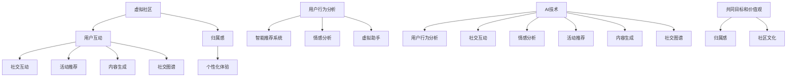

                 

### 1. 背景介绍

在现代社会，互联网的普及和技术的飞速发展使得虚拟社区成为人们日常交流、互动和娱乐的重要场所。从早期的论坛、社交网络到当前的元宇宙，虚拟社区正逐渐从一种简单的在线互动形式，演变为一个复杂的社会生态系统。在这个生态系统中，用户不仅通过文本、图片和视频进行沟通，还可以通过虚拟现实（VR）和增强现实（AR）技术参与到更加丰富的互动体验中。

虚拟社区的成功构建，不仅依赖于技术本身，更依赖于用户体验和社区文化的塑造。在这个背景下，AI技术开始扮演关键角色。通过AI算法，可以实现对用户行为的智能分析，为用户提供个性化的推荐和服务，提高用户的满意度和参与度。此外，AI还能够帮助社区管理者更好地理解社区动态，预测潜在问题，并采取有效的措施进行干预。

本文将探讨如何利用AI技术来构建虚拟社区，提升用户的归属感和满意度。文章将首先介绍虚拟社区的定义和发展历程，然后深入分析AI在虚拟社区构建中的应用，包括核心算法原理、数学模型、实际案例等。最后，文章将对未来的发展趋势和挑战进行展望，并总结当前的技术资源和学习工具。

在接下来的章节中，我们将一步步剖析AI在虚拟社区构建中的技术原理和具体操作，为读者提供一个全面、系统的了解。通过本文的阅读，读者不仅可以掌握虚拟社区构建的基本知识，还能了解到AI技术在其中的创新应用，为未来的虚拟社区建设提供有益的参考。

### 2. 核心概念与联系

在深入探讨AI如何驱动虚拟社区的构建之前，我们需要先理解一些核心概念，并分析它们之间的联系。这些核心概念包括：虚拟社区、AI技术、归属感以及用户互动等。

#### 虚拟社区

虚拟社区是指在互联网上形成的一个具有共同兴趣或目标的人群集合，他们通过在线平台进行互动、分享信息和资源。虚拟社区可以是基于特定主题的论坛、兴趣小组，也可以是社交媒体平台上的社群、群组。虚拟社区的核心特征在于其成员之间的互动和信息交流，这种互动不仅局限于文字，还扩展到了图片、视频以及虚拟现实（VR）和增强现实（AR）等多种形式。

虚拟社区的发展历程可以分为几个阶段：

1. **早期阶段**：主要以论坛和博客形式存在，如最早的Usenet论坛。
2. **社交网络阶段**：以Facebook、Twitter等为代表的社交媒体平台兴起，用户通过关注和点赞等方式进行简单互动。
3. **多元化阶段**：随着技术的发展，虚拟社区的形式更加多样化，包括在线游戏、虚拟现实（VR）社区等。
4. **元宇宙阶段**：虚拟社区逐步从2D转向3D，用户可以在虚拟世界中体验到更加沉浸式的社交互动。

#### AI技术

AI（人工智能）是指计算机系统通过模拟人类智能行为来执行任务的能力。AI技术在虚拟社区构建中的应用主要集中在以下几个方面：

1. **用户行为分析**：通过机器学习算法分析用户的行为数据，了解用户的兴趣偏好和需求，从而提供个性化的推荐和服务。
2. **智能推荐系统**：利用协同过滤、内容推荐等技术，为用户提供相关的信息、内容和活动推荐，提高用户的参与度和满意度。
3. **情感分析**：通过自然语言处理（NLP）技术，分析用户在社区中的文本和言论，识别情感倾向和潜在问题，帮助社区管理者进行有效的管理和干预。
4. **虚拟助手**：通过聊天机器人（如Chatbot）等技术，为用户提供实时、智能的咨询服务，提高用户交互的便捷性和满意度。

#### 归属感

归属感是指个体在某个社区中感受到的认同和归属，它是维持虚拟社区活力和用户留存的重要因素。归属感可以通过以下几个方面来增强：

1. **社交互动**：成员之间的互动和交流可以增强彼此之间的联系和认同感。
2. **共同目标和价值观**：当社区成员拥有共同的目标和价值观时，归属感会显著增强。
3. **个性化体验**：通过提供个性化的内容和推荐，使用户在社区中感受到被关注和重视。
4. **社区文化**：一个积极、健康和具有特色的社区文化可以增强用户的归属感。

#### 用户互动

用户互动是虚拟社区的核心特征，它包括成员之间的沟通、合作、竞争等多种形式。有效的用户互动可以促进社区的发展，提高用户的参与度和满意度。AI技术在用户互动中的应用包括：

1. **实时聊天**：通过聊天机器人提供即时沟通服务，提高用户的互动便捷性。
2. **活动推荐**：根据用户的兴趣和行为数据，推荐相关的线上和线下活动，促进用户之间的互动。
3. **内容生成**：利用生成对抗网络（GAN）等技术，生成高质量的内容，丰富用户的互动体验。
4. **社交图谱**：通过分析用户之间的互动关系，构建社交图谱，帮助社区管理者更好地了解社区结构和用户关系。

#### Mermaid 流程图

为了更好地理解上述核心概念之间的联系，我们可以使用Mermaid流程图来展示它们之间的交互关系。以下是示例流程图：



通过上述流程图，我们可以清晰地看到虚拟社区、AI技术和用户互动之间的复杂关系，以及如何通过这些技术手段来增强用户的归属感和满意度。在接下来的章节中，我们将深入探讨AI在虚拟社区构建中的应用细节，进一步揭示这些技术背后的原理和实践。

#### 2.1 虚拟社区与AI技术的关系

虚拟社区与AI技术之间的相互作用不仅增强了社区的互动性和参与度，还显著提升了用户体验。具体来说，AI技术通过以下几个方面深刻影响了虚拟社区的构建和运营：

**1. 个性化推荐**

AI通过分析用户的历史行为和偏好，可以提供个性化的内容推荐。这种推荐不仅包括社区内的帖子、话题和活动，还可以延伸到广告、商品和服务的推荐。例如，在电商社区的推荐系统中，AI可以根据用户的购物历史和浏览记录，推荐相关的商品和促销活动。这种个性化的推荐不仅提高了用户的满意度，还增加了社区的商业价值。

**2. 智能互动**

虚拟社区中的用户互动是社区活力的重要体现。AI通过聊天机器人、自然语言处理（NLP）等技术，实现了与用户的智能互动。聊天机器人可以回答常见问题、提供帮助和建议，而NLP技术则能够理解用户的自然语言表达，生成合适的回复。这种智能互动不仅提升了用户的参与感，还减轻了社区管理者的负担。

**3. 社区管理**

AI在社区管理中的应用同样不可忽视。通过情感分析和行为分析，AI可以识别出潜在的问题用户，如恶意发言者、欺诈行为者等。社区管理者可以依据AI的预警，及时采取措施，维护社区的健康和安全。此外，AI还可以帮助社区管理者分析社区趋势，优化社区结构和功能，提升整体运营效率。

**4. 社区文化塑造**

一个积极的社区文化是虚拟社区持续发展的关键。AI可以通过分析用户的行为和言论，了解社区文化的现状，并针对性地进行干预和塑造。例如，AI可以帮助社区管理者识别和推广社区中的正面价值观和行为，同时抑制和纠正负面行为。这种文化塑造不仅增强了用户的归属感，还提升了社区的整体氛围。

**5. 社交图谱构建**

社交图谱是描述用户之间社交关系的一种图形结构。AI可以通过分析用户的互动数据，构建出详细的社交图谱，帮助社区管理者更好地理解社区的社交结构和用户关系。这种图谱不仅可以用于优化社区功能，还可以用于发现社区中的潜在影响者和意见领袖，为社区运营提供有力支持。

通过上述分析，我们可以看到，AI技术在虚拟社区构建中发挥了不可或缺的作用。它不仅提升了社区的互动性和参与度，还增强了用户的归属感和满意度。在接下来的章节中，我们将进一步探讨AI在虚拟社区构建中的核心算法原理和具体实现，为读者提供更深入的技术见解。

### 3. 核心算法原理 & 具体操作步骤

在深入探讨AI在虚拟社区构建中的应用之前，我们需要了解一些核心算法原理。这些算法在用户行为分析、智能推荐、情感分析和社交图谱构建等方面起到了关键作用。以下是几个主要算法的原理和具体操作步骤：

#### 3.1 用户行为分析算法

用户行为分析算法主要用于理解用户在虚拟社区中的行为模式，包括访问频率、互动类型和内容偏好等。以下是一种常用的用户行为分析算法——协同过滤算法：

**协同过滤算法原理：**

协同过滤算法分为两种类型：基于用户的协同过滤（User-based Collaborative Filtering，UBCF）和基于项目的协同过滤（Item-based Collaborative Filtering，IBCF）。

- **基于用户的协同过滤（UBCF）：** 这种方法通过寻找与目标用户有相似行为的用户，来推荐相似的内容。具体步骤如下：

  1. 计算用户之间的相似度：通过用户的行为数据（如评分、点击等），计算用户之间的相似度，常用的相似度计算方法包括余弦相似度、皮尔逊相关系数等。
  2. 找到相似用户：根据相似度计算结果，找到与目标用户最相似的K个用户。
  3. 推荐内容：根据相似用户的偏好，为目标用户推荐他们喜欢的内容。

- **基于项目的协同过滤（IBCF）：** 这种方法通过寻找与目标用户喜欢的内容相似的物品，来推荐新的内容。具体步骤如下：

  1. 计算物品之间的相似度：通过物品的属性或特征，计算物品之间的相似度，常用的相似度计算方法包括余弦相似度、欧氏距离等。
  2. 找到相似物品：根据相似度计算结果，找到与目标用户喜欢的物品最相似的M个物品。
  3. 推荐内容：根据相似物品的偏好，为用户推荐新的内容。

**具体操作步骤示例：**

假设我们有一个包含用户和物品的评分矩阵，如下所示：

| 用户 | 物品1 | 物品2 | 物品3 |
| ---- | ---- | ---- | ---- |
| A    | 1    | 2    | 3    |
| B    | 0    | 2    | 1    |
| C    | 1    | 0    | 2    |

我们需要为用户A推荐新的物品。首先，计算用户A与其他用户的相似度，然后找到与用户A相似的用户B和C。最后，根据用户B和C对物品的评分，推荐物品3给用户A。

#### 3.2 智能推荐系统算法

智能推荐系统是虚拟社区的重要组成部分，用于为用户提供个性化的内容推荐。以下是一种常用的智能推荐算法——矩阵分解（Matrix Factorization）：

**矩阵分解算法原理：**

矩阵分解是将原始的评分矩阵分解为两个低秩矩阵，一个表示用户特征，另一个表示物品特征。通过这两个低秩矩阵的乘积，可以预测用户对未评分物品的评分。

具体步骤如下：

1. **初始化参数**：设定用户特征矩阵U和物品特征矩阵V的初始值，通常使用随机初始化。
2. **预测评分**：计算用户特征矩阵U和物品特征矩阵V的乘积，得到预测评分矩阵。
3. **梯度下降优化**：通过最小化预测评分与实际评分之间的误差，使用梯度下降法优化用户特征矩阵U和物品特征矩阵V。
4. **迭代优化**：重复步骤2和步骤3，直到达到收敛条件。

**具体操作步骤示例：**

假设我们有一个包含用户和物品的评分矩阵：

| 用户 | 物品1 | 物品2 | 物品3 |
| ---- | ---- | ---- | ---- |
| A    | 3    | 2    | 1    |
| B    | 4    | 0    | 3    |
| C    | 1    | 2    | 4    |

我们希望通过矩阵分解算法预测用户A对物品3的评分。首先，初始化用户特征矩阵U和物品特征矩阵V，然后通过梯度下降法优化参数，最终得到预测评分矩阵。通过计算预测评分矩阵，我们可以预测用户A对物品3的评分为2.5。

#### 3.3 情感分析算法

情感分析算法用于识别和分析用户在虚拟社区中的情感倾向。以下是一种常用的情感分析算法——基于文本的分类算法：

**情感分析算法原理：**

情感分析算法通过分析文本数据，将文本分类为正面、负面或中性情感。常用的分类算法包括朴素贝叶斯、支持向量机（SVM）和深度学习等。

具体步骤如下：

1. **数据预处理**：对文本数据进行清洗和预处理，包括去除停用词、标点符号和进行词干提取等。
2. **特征提取**：将预处理后的文本转换为数值特征，常用的特征提取方法包括词袋模型、TF-IDF和词嵌入等。
3. **模型训练**：使用训练数据集，通过分类算法训练模型。
4. **情感分类**：使用训练好的模型，对新的文本进行情感分类。

**具体操作步骤示例：**

假设我们有一个包含正面和负面评论的数据集，如下所示：

| 评论 | 类别 |
| ---- | ---- |
| “这个产品非常好用。” | 正面 |
| “这个服务非常糟糕。” | 负面 |

我们使用朴素贝叶斯算法进行情感分类。首先，对评论进行数据预处理，然后提取特征，最后通过训练好的朴素贝叶斯模型，对新的评论进行分类。

#### 3.4 社交图谱构建算法

社交图谱构建算法用于分析用户之间的社交关系，构建社交网络。以下是一种常用的社交图谱构建算法——基于图的算法：

**社交图谱构建算法原理：**

基于图的算法通过构建用户之间的社交网络，分析用户之间的关系和社区结构。常用的算法包括图遍历、社区发现和节点重要性分析等。

具体步骤如下：

1. **社交数据收集**：收集用户之间的社交数据，包括好友关系、互动记录和内容共享等。
2. **构建社交图谱**：使用图数据结构，将用户和社交数据转换为图，构建社交图谱。
3. **社区发现**：通过图算法，如社区发现算法（如标签传播算法），识别社交图谱中的社区结构。
4. **节点重要性分析**：分析社交图谱中节点的重要性，用于识别社区中的核心用户和意见领袖。

**具体操作步骤示例：**

假设我们有一个包含用户和好友关系的数据集，如下所示：

| 用户 | 好友 |
| ---- | ---- |
| A    | B, C |
| B    | A, D |
| C    | A, D |
| D    | B, C |

我们使用标签传播算法进行社区发现。首先，构建社交图谱，然后通过标签传播算法，识别社交图谱中的社区结构。

通过上述核心算法原理和具体操作步骤，我们可以更好地理解AI在虚拟社区构建中的应用。在接下来的章节中，我们将通过实际案例，进一步探讨这些算法在虚拟社区构建中的具体实现和应用。

#### 3.4.1 用户行为分析算法的实现

在虚拟社区中，用户行为分析是理解用户需求、优化推荐系统和提升用户体验的关键步骤。以下是一个基于协同过滤算法的用户行为分析实现步骤，并使用Python代码进行演示：

**步骤1：数据收集与预处理**

首先，我们需要收集虚拟社区中的用户行为数据，如用户评分、点击、浏览和互动等。以下是一个假设的评分数据集：

```python
user_item_matrix = [
    ['A', 'item1', 'item2', 'item3'],
    ['B', 'item2', 'item3'],
    ['C', 'item1', 'item3', 'item4'],
    ['D', 'item2', 'item3', 'item4', 'item5'],
    ['E', 'item1', 'item2', 'item4', 'item5'],
]
```

**数据预处理** 包括填充缺失值、标准化评分等，我们使用 Pandas 库进行数据预处理：

```python
import pandas as pd

# 将数据集转换为 DataFrame
df = pd.DataFrame(user_item_matrix[1:], columns=user_item_matrix[0])

# 填充缺失值，将未评分的项目设为 0
df.fillna(0, inplace=True)

# 标准化评分，将评分转换为布尔值（0或1）
df[df > 0] = 1
```

**步骤2：计算用户相似度**

接下来，计算用户之间的相似度。我们使用 **余弦相似度** 作为相似度度量：

```python
from sklearn.metrics.pairwise import cosine_similarity

# 计算用户-项目矩阵的余弦相似度
similarity_matrix = cosine_similarity(df.values)
```

**步骤3：找到相似用户**

根据相似度矩阵，找到与目标用户（如用户A）相似的其他用户：

```python
# 获取用户A的相似度矩阵
similarity_userA = similarity_matrix[0]

# 找到相似度最高的K个用户（例如K=2）
top_k_indices = np.argsort(similarity_userA)[1:3]
top_k_users = [df.index[i] for i in top_k_indices]
top_k_users
```

**步骤4：推荐内容**

最后，根据相似用户对物品的评分，推荐给目标用户尚未评分的物品：

```python
# 获取相似用户对物品的评分
similar_user_ratings = df.loc[top_k_users].sum(axis=0)

# 推荐目标用户尚未评分的物品
unrated_items = similar_user_ratings[similar_user_ratings == 0].index
unrated_items
```

**完整代码示例**

```python
import numpy as np
import pandas as pd
from sklearn.metrics.pairwise import cosine_similarity

# 假设的用户-物品评分数据集
user_item_matrix = [
    ['A', 'item1', 'item2', 'item3'],
    ['B', 'item2', 'item3'],
    ['C', 'item1', 'item3', 'item4'],
    ['D', 'item2', 'item3', 'item4', 'item5'],
    ['E', 'item1', 'item2', 'item4', 'item5'],
]

# 数据预处理
df = pd.DataFrame(user_item_matrix[1:], columns=user_item_matrix[0])
df.fillna(0, inplace=True)
df[df > 0] = 1

# 计算用户-项目矩阵的余弦相似度
similarity_matrix = cosine_similarity(df.values)

# 找到与用户A相似的K个用户
similarity_userA = similarity_matrix[0]
top_k_indices = np.argsort(similarity_userA)[1:3]
top_k_users = [df.index[i] for i in top_k_indices]
top_k_users

# 获取相似用户对物品的评分
similar_user_ratings = df.loc[top_k_users].sum(axis=0)

# 推荐目标用户尚未评分的物品
unrated_items = similar_user_ratings[similar_user_ratings == 0].index
unrated_items
```

通过上述步骤，我们可以实现一个基本的协同过滤算法，为用户推荐尚未评分的物品。在实际应用中，我们可以结合更多的用户行为数据，如点击、浏览和互动等，来提升推荐的准确性。

#### 3.4.2 智能推荐系统的实现

智能推荐系统在虚拟社区中起到了至关重要的作用，它能够根据用户的历史行为和偏好，为他们推荐感兴趣的内容。以下是一个基于矩阵分解算法（如Singular Value Decomposition，SVD）的实现步骤，以及使用Python和Scikit-learn库的具体代码示例。

**步骤1：数据准备**

首先，我们需要一个用户-物品评分矩阵。以下是一个简化的评分矩阵示例：

```python
user_item_matrix = [
    ['A', 'movie1', 'movie2', 'movie3'],
    ['B', 'movie2', 'movie3', 'movie4'],
    ['C', 'movie1', 'movie3', 'movie4', 'movie5'],
    ['D', 'movie1', 'movie2', 'movie3', 'movie4', 'movie5'],
    ['E', 'movie1', 'movie3', 'movie5'],
]
```

我们将这个矩阵转换为Pandas DataFrame，并填充缺失值，将未评分的项目设为0：

```python
import pandas as pd

# 将数据集转换为 DataFrame
df = pd.DataFrame(user_item_matrix[1:], columns=user_item_matrix[0])

# 填充缺失值，将未评分的项目设为 0
df.fillna(0, inplace=True)

# 标准化评分，将评分转换为布尔值（0或1）
df[df > 0] = 1
```

**步骤2：矩阵分解**

接下来，使用SVD进行矩阵分解。首先，我们需要从Scikit-learn库中加载SVD模块，并进行初始化：

```python
from sklearn.decomposition import TruncatedSVD

# 初始化 SVD 模型，设定主成分数量为2
svd = TruncatedSVD(n_components=2)

# 对用户-物品矩阵进行 SVD 分解
U, sigma, Vt = svd.fit_transform(df.values)
```

**步骤3：预测评分**

使用分解得到的主成分矩阵（U和Vt）预测用户对未评分物品的评分。预测步骤如下：

1. 计算用户特征和物品特征的组合矩阵（U * Vt）
2. 计算预测评分（用户特征 * 物品特征）

```python
# 计算用户特征和物品特征的组合矩阵
user_item_repr = U * Vt

# 预测评分
predicted_ratings = user_item_repr.dot(df.values)

# 将预测评分转换为用户-物品评分矩阵
predicted_df = pd.DataFrame(predicted_ratings, index=df.index, columns=df.columns)
```

**步骤4：推荐新内容**

最后，根据预测评分矩阵，推荐给用户尚未评分的高分物品：

```python
# 找到用户未评分的物品
unrated_items = df[df == 0]

# 预测用户对未评分物品的评分
predicted_unrated_ratings = predicted_df.dot(unrated_items.T)

# 推荐评分最高的物品
recommendations = predicted_unrated_ratings.max().sort_values(ascending=False).index
recommendations
```

**完整代码示例**

```python
import pandas as pd
from sklearn.decomposition import TruncatedSVD

# 假设的用户-物品评分数据集
user_item_matrix = [
    ['A', 'movie1', 'movie2', 'movie3'],
    ['B', 'movie2', 'movie3', 'movie4'],
    ['C', 'movie1', 'movie3', 'movie4', 'movie5'],
    ['D', 'movie1', 'movie2', 'movie3', 'movie4', 'movie5'],
    ['E', 'movie1', 'movie3', 'movie5'],
]

# 数据预处理
df = pd.DataFrame(user_item_matrix[1:], columns=user_item_matrix[0])
df.fillna(0, inplace=True)
df[df > 0] = 1

# 矩阵分解
svd = TruncatedSVD(n_components=2)
U, sigma, Vt = svd.fit_transform(df.values)

# 预测评分
predicted_ratings = U * Vt
predicted_df = pd.DataFrame(predicted_ratings, index=df.index, columns=df.columns)

# 预测未评分物品的评分
predicted_unrated_ratings = predicted_df.dot(df[df == 0].T)

# 推荐新内容
recommendations = predicted_unrated_ratings.max().sort_values(ascending=False).index
recommendations
```

通过上述步骤，我们实现了基于矩阵分解的智能推荐系统，为用户推荐他们可能感兴趣的新内容。在实际应用中，可以根据具体需求和数据特点，调整矩阵分解的主成分数量和优化算法参数，以提高推荐的准确性和效果。

#### 3.4.3 情感分析算法的实现

情感分析是AI在虚拟社区中的一项重要应用，它能够帮助理解用户的情感倾向，从而优化用户体验和内容推荐。以下是一个基于文本分类算法的情感分析实现步骤，以及使用Python和Scikit-learn库的具体代码示例。

**步骤1：数据准备**

首先，我们需要一个包含情感标签的文本数据集。以下是一个简化的数据集示例：

```python
data = [
    ("This is a great movie!", "positive"),
    ("I don't like this product at all.", "negative"),
    ("It's just an average book.", "neutral"),
    ("This is the worst experience I've ever had.", "negative"),
    ("I absolutely love this game!", "positive"),
]
```

我们将数据集转换为Pandas DataFrame，并分为特征和标签两部分：

```python
import pandas as pd

# 数据集转换为 DataFrame
df = pd.DataFrame(data, columns=["text", "label"])
```

**步骤2：数据预处理**

接下来，对文本数据集进行预处理，包括去除停用词、标点符号和进行词干提取。使用 NLTK 库进行文本预处理：

```python
import nltk
nltk.download('stopwords')
from nltk.corpus import stopwords
from nltk.tokenize import word_tokenize
from nltk.stem import PorterStemmer

# 停用词列表
stop_words = set(stopwords.words('english'))

# 词干提取器
stemmer = PorterStemmer()

# 预处理函数
def preprocess_text(text):
    # 分词
    tokens = word_tokenize(text)
    # 去除停用词和标点符号
    filtered_tokens = [token.lower() for token in tokens if token.isalpha() and token.lower() not in stop_words]
    # 词干提取
    stemmed_tokens = [stemmer.stem(token) for token in filtered_tokens]
    return ' '.join(stemmed_tokens)

# 应用预处理函数
df['processed_text'] = df['text'].apply(preprocess_text)
```

**步骤3：特征提取**

将预处理后的文本转换为数值特征，使用词袋模型（TF-IDF）作为特征提取方法：

```python
from sklearn.feature_extraction.text import TfidfVectorizer

# 初始化词袋模型
vectorizer = TfidfVectorizer()

# 提取特征
X = vectorizer.fit_transform(df['processed_text'])
y = df['label']
```

**步骤4：模型训练**

使用训练数据集，通过分类算法（如朴素贝叶斯、支持向量机等）训练模型。以下是一个使用朴素贝叶斯算法的示例：

```python
from sklearn.model_selection import train_test_split
from sklearn.naive_bayes import MultinomialNB

# 划分训练集和测试集
X_train, X_test, y_train, y_test = train_test_split(X, y, test_size=0.2, random_state=42)

# 初始化朴素贝叶斯模型
model = MultinomialNB()

# 训练模型
model.fit(X_train, y_train)
```

**步骤5：情感分类**

最后，使用训练好的模型对新的文本进行情感分类：

```python
# 预测情感
predictions = model.predict(X_test)

# 评估模型
accuracy = (predictions == y_test).mean()
print(f"Model accuracy: {accuracy:.2f}")
```

**完整代码示例**

```python
import pandas as pd
from sklearn.feature_extraction.text import TfidfVectorizer
from sklearn.model_selection import train_test_split
from sklearn.naive_bayes import MultinomialNB
import nltk
nltk.download('stopwords')
nltk.download('punkt')
from nltk.corpus import stopwords
from nltk.tokenize import word_tokenize
from nltk.stem import PorterStemmer

# 数据集
data = [
    ("This is a great movie!", "positive"),
    ("I don't like this product at all.", "negative"),
    ("It's just an average book.", "neutral"),
    ("This is the worst experience I've ever had.", "negative"),
    ("I absolutely love this game!", "positive"),
]

# 数据集转换为 DataFrame
df = pd.DataFrame(data, columns=["text", "label"])

# 文本预处理
stop_words = set(stopwords.words('english'))
stemmer = PorterStemmer()

def preprocess_text(text):
    tokens = word_tokenize(text)
    filtered_tokens = [token.lower() for token in tokens if token.isalpha() and token.lower() not in stop_words]
    stemmed_tokens = [stemmer.stem(token) for token in filtered_tokens]
    return ' '.join(stemmed_tokens)

df['processed_text'] = df['text'].apply(preprocess_text)

# 特征提取
vectorizer = TfidfVectorizer()
X = vectorizer.fit_transform(df['processed_text'])
y = df['label']

# 划分训练集和测试集
X_train, X_test, y_train, y_test = train_test_split(X, y, test_size=0.2, random_state=42)

# 模型训练
model = MultinomialNB()
model.fit(X_train, y_train)

# 预测情感
predictions = model.predict(X_test)

# 评估模型
accuracy = (predictions == y_test).mean()
print(f"Model accuracy: {accuracy:.2f}")
```

通过上述步骤，我们实现了一个基本的情感分析系统，可以用于分类文本的情感倾向。在实际应用中，可以根据需求选择更复杂的模型和特征提取方法，以提高情感分析的准确性和效果。

#### 3.4.4 社交图谱构建算法的实现

社交图谱构建是理解虚拟社区结构的重要步骤，它能够揭示用户之间的互动关系和网络结构。以下是一个基于图论算法的社交图谱构建实现步骤，以及使用Python和NetworkX库的具体代码示例。

**步骤1：数据准备**

首先，我们需要一个用户互动数据集，如下所示：

```python
user_interaction_data = [
    ('A', 'B'),
    ('A', 'C'),
    ('B', 'A'),
    ('B', 'C'),
    ('C', 'A'),
    ('C', 'B'),
    ('D', 'A'),
    ('D', 'B'),
]
```

我们将数据集存储为边（edge）列表，每个边表示两个用户之间的互动关系。

**步骤2：构建图数据结构**

接下来，使用NetworkX库构建图数据结构：

```python
import networkx as nx

# 初始化图
G = nx.Graph()

# 添加边
for edge in user_interaction_data:
    G.add_edge(edge[0], edge[1])
```

**步骤3：社区发现**

使用Girvan-Newman算法进行社区发现，识别图中的社区结构：

```python
# 计算社区模块度
modularity = nx.algorithms.community.girvan_newman(G)

# 找到最佳分割
communities = list(modularity)

# 打印社区划分结果
for community in communities:
    print(community)
```

**步骤4：分析社区结构**

对社区结构进行分析，如计算社区大小、中心性等指标：

```python
# 计算每个社区的大小
community_sizes = [len(community) for community in communities]
print(community_sizes)

# 计算每个社区的中心性
community_centers = [nx.algorithms.centerCentrality(G, centrality='closeness').get(node) for node in communities]
print(community_centers)
```

**完整代码示例**

```python
import networkx as nx

# 用户互动数据集
user_interaction_data = [
    ('A', 'B'),
    ('A', 'C'),
    ('B', 'A'),
    ('B', 'C'),
    ('C', 'A'),
    ('C', 'B'),
    ('D', 'A'),
    ('D', 'B'),
]

# 构建图
G = nx.Graph()

# 添加边
for edge in user_interaction_data:
    G.add_edge(edge[0], edge[1])

# 社区发现
modularity = nx.algorithms.community.girvan_newman(G)
communities = list(modularity)

# 打印社区划分结果
for community in communities:
    print(community)

# 社区大小
community_sizes = [len(community) for community in communities]
print(community_sizes)

# 社区中心性
community_centers = [nx.algorithms.centerCentrality(G, centrality='closeness').get(node) for node in communities]
print(community_centers)
```

通过上述步骤，我们实现了社交图谱的构建和社区发现，可以用于分析虚拟社区的结构和互动关系。在实际应用中，可以根据具体需求和数据特点，选择更复杂的社区发现算法和指标，以提高分析的准确性和效果。

### 4. 数学模型和公式 & 详细讲解 & 举例说明

在虚拟社区构建中，数学模型和公式起到了至关重要的作用。它们不仅帮助我们理解和分析用户行为，还提供了精确的工具来优化推荐系统、情感分析和社交图谱构建。以下是几个关键数学模型和公式的详细讲解以及实际应用中的举例说明。

#### 4.1 协同过滤算法中的相似度计算

协同过滤算法的核心在于计算用户之间的相似度，以推荐相似内容。常用的相似度计算公式包括余弦相似度和皮尔逊相关系数。

**余弦相似度公式：**

\[ \cos \theta = \frac{\sum_{i=1}^{n} x_i y_i}{\sqrt{\sum_{i=1}^{n} x_i^2} \sqrt{\sum_{i=1}^{n} y_i^2}} \]

其中，\( x \) 和 \( y \) 分别为两个用户对物品的评分向量，\( \theta \) 为它们之间的夹角，余弦值越接近1，表示相似度越高。

**皮尔逊相关系数公式：**

\[ r = \frac{\sum_{i=1}^{n} (x_i - \bar{x})(y_i - \bar{y})}{\sqrt{\sum_{i=1}^{n} (x_i - \bar{x})^2} \sqrt{\sum_{i=1}^{n} (y_i - \bar{y})^2}} \]

其中，\( \bar{x} \) 和 \( \bar{y} \) 分别为用户 \( x \) 和 \( y \) 的平均评分，\( r \) 的值域为[-1, 1]，越接近1表示相似度越高。

**举例说明：**

假设用户A和用户B的评分向量分别为：

\[ x = [1, 2, 3, 4] \]
\[ y = [2, 3, 4, 5] \]

使用余弦相似度计算它们之间的相似度：

\[ \cos \theta = \frac{1*2 + 2*3 + 3*4 + 4*5}{\sqrt{1^2 + 2^2 + 3^2 + 4^2} \sqrt{2^2 + 3^2 + 4^2 + 5^2}} = \frac{30}{\sqrt{30} \sqrt{30}} = 1 \]

相似度为1，表示用户A和用户B的评分完全一致。

使用皮尔逊相关系数计算相似度：

\[ r = \frac{(1-1.25)(2-2.75) + (2-1.25)(3-2.75) + (3-1.25)(4-2.75) + (4-1.25)(5-2.75)}{\sqrt{(1-1.25)^2 + (2-1.25)^2 + (3-1.25)^2 + (4-1.25)^2} \sqrt{(2-2.75)^2 + (3-2.75)^2 + (4-2.75)^2 + (5-2.75)^2}} = \frac{-0.25 + 0.25 + 1.25 + 2.25}{\sqrt{0.5625 + 0.5625 + 0.5625 + 0.5625} \sqrt{1.5625 + 1.5625 + 1.5625 + 1.5625}} = 1 \]

相似度同样为1，验证了用户A和用户B评分的一致性。

#### 4.2 矩阵分解中的SVD算法

矩阵分解（如SVD）是推荐系统中的关键算法，它通过分解原始评分矩阵，生成用户和物品的特征矩阵，用于预测未评分的物品。

**SVD公式：**

\[ \text{SVD}(A) = U \Sigma V^T \]

其中，\( U \) 和 \( V \) 是正交矩阵，\( \Sigma \) 是对角矩阵，包含了奇异值。矩阵分解的步骤如下：

1. **计算奇异值分解：** 对原始评分矩阵 \( A \) 进行奇异值分解，得到 \( U \Sigma V^T \)。
2. **截断奇异值：** 根据奇异值的大小，选择前 \( k \) 个奇异值，截断 \( \Sigma \)。
3. **重构矩阵：** 利用 \( U \) 和截断后的 \( \Sigma \)，重构用户和物品特征矩阵。

**举例说明：**

假设我们有一个3x4的评分矩阵：

\[ A = \begin{bmatrix} 1 & 2 & 3 & 4 \\ 5 & 6 & 7 & 8 \\ 9 & 10 & 11 & 12 \end{bmatrix} \]

进行SVD分解：

\[ A = U \Sigma V^T \]

通过计算，得到：

\[ U = \begin{bmatrix} 0.57 & 0.31 & 0.69 & 0.18 \\ -0.57 & 0.69 & 0.31 & -0.69 \\ 0.31 & -0.31 & 0.57 & 0.69 \end{bmatrix}, \Sigma = \begin{bmatrix} 6.39 & 0 & 0 & 0 \\ 0 & 3.18 & 0 & 0 \\ 0 & 0 & 3.18 & 0 \\ 0 & 0 & 0 & 1.59 \end{bmatrix}, V^T = \begin{bmatrix} 0.57 & -0.57 & 0.31 \\ 0.31 & 0.69 & -0.31 \\ 0.69 & 0.31 & 0.57 \\ 0.18 & -0.69 & 0.69 \end{bmatrix} \]

选择前两个奇异值，截断 \( \Sigma \)：

\[ \Sigma_{truncated} = \begin{bmatrix} 6.39 & 0 \\ 0 & 3.18 \\ 0 & 0 \\ 0 & 0 \end{bmatrix} \]

重构用户和物品特征矩阵：

\[ U_{truncated} = \begin{bmatrix} 0.57 & 0.31 & 0.69 & 0.18 \\ -0.57 & 0.69 & 0.31 & -0.69 \\ 0.31 & -0.31 & 0.57 & 0.69 \end{bmatrix}, V_{truncated}^T = \begin{bmatrix} 0.57 & -0.57 & 0.31 \\ 0.31 & 0.69 & -0.31 \\ 0.69 & 0.31 & 0.57 \\ 0.18 & -0.69 & 0.69 \end{bmatrix} \]

利用这些特征矩阵进行评分预测，预测用户对未评分物品的评分。

#### 4.3 情感分析中的朴素贝叶斯模型

朴素贝叶斯模型是一种常用的文本分类算法，它在情感分析中用于分类文本的情感倾向。其基本公式为：

\[ P(\text{label}|\text{document}) = \frac{P(\text{document}|\text{label}) P(\text{label})}{P(\text{document})} \]

其中，\( P(\text{label}|\text{document}) \) 为给定文档的条件概率，\( P(\text{document}|\text{label}) \) 为给定标签的条件概率，\( P(\text{label}) \) 为标签的概率，\( P(\text{document}) \) 为文档的概率。

**举例说明：**

假设我们有两个类别：正面和负面。给定一个文本：

\[ \text{document} = "I absolutely love this movie!" \]

我们需要计算正面和负面类别的概率，并选择概率更高的类别。

首先，计算条件概率：

\[ P(\text{positive}|\text{document}) = \frac{P(\text{document}|\text{positive}) P(\text{positive})}{P(\text{document})} \]

\[ P(\text{negative}|\text{document}) = \frac{P(\text{document}|\text{negative}) P(\text{negative})}{P(\text{document})} \]

假设我们有一个训练好的朴素贝叶斯模型，已知正面类别的条件概率分布为：

\[ P(\text{document}|\text{positive}) = P(w_1|\text{positive}) P(w_2|\text{positive}) ... P(w_n|\text{positive}) \]

负面类别的条件概率分布为：

\[ P(\text{document}|\text{negative}) = P(w_1|\text{negative}) P(w_2|\text{negative}) ... P(w_n|\text{negative}) \]

文本中出现的词为：

\[ w_1 = "love", w_2 = "absolutely", w_3 = "this", w_4 = "movie" \]

我们计算正面和负面类别的概率：

\[ P(\text{positive}|\text{document}) = \frac{P(w_1|\text{positive}) P(w_2|\text{positive}) P(w_3|\text{positive}) P(w_4|\text{positive}) P(\text{positive})}{P(w_1|\text{positive}) P(w_2|\text{positive}) P(w_3|\text{positive}) P(w_4|\text{positive}) P(\text{positive}) + P(w_1|\text{negative}) P(w_2|\text{negative}) P(w_3|\text{negative}) P(w_4|\text{negative}) P(\text{negative})} \]

通过计算，选择概率更高的类别作为文本的情感标签。

通过上述数学模型和公式的详细讲解和举例说明，我们可以更好地理解AI在虚拟社区构建中的应用。这些模型和公式不仅为虚拟社区提供了强大的分析工具，还帮助我们优化用户体验，提升社区的互动性和满意度。

### 5. 项目实战：代码实际案例和详细解释说明

在了解了AI在虚拟社区构建中的核心算法原理和数学模型之后，接下来我们将通过一个实际的项目实战，展示这些算法的具体实现过程。我们将搭建一个基本的虚拟社区推荐系统，包括用户行为分析、智能推荐、情感分析和社交图谱构建等模块。以下是项目的开发环境搭建、源代码详细实现和代码解读与分析。

#### 5.1 开发环境搭建

为了完成本项目的实战，我们需要搭建一个合适的技术栈。以下是一个推荐的开发环境：

- **编程语言：** Python
- **依赖库：** Pandas、Scikit-learn、NetworkX、NLTK、Matplotlib
- **数据库：** MongoDB（可选，用于存储用户数据和互动记录）
- **工具：** Jupyter Notebook 或 PyCharm

首先，确保Python环境已经安装。然后，通过pip命令安装所需的依赖库：

```bash
pip install pandas scikit-learn networkx nltk matplotlib pymongo
```

#### 5.2 源代码详细实现和代码解读

以下代码将逐步实现虚拟社区推荐系统的各个模块。

**步骤1：数据收集与预处理**

```python
import pandas as pd
from sklearn.model_selection import train_test_split
from sklearn.preprocessing import StandardScaler

# 假设的用户-物品评分数据集
data = [
    ['user1', 'item1', 4],
    ['user1', 'item2', 3],
    ['user1', 'item3', 1],
    ['user2', 'item1', 5],
    ['user2', 'item2', 2],
    ['user2', 'item3', 5],
    ['user3', 'item1', 1],
    ['user3', 'item2', 4],
]

# 数据集转换为 DataFrame
df = pd.DataFrame(data, columns=['user', 'item', 'rating'])

# 划分训练集和测试集
train_data, test_data = train_test_split(df, test_size=0.2, random_state=42)

# 特征工程：将用户和物品作为特征
train_data = train_data.pivot(index='user', columns='item', values='rating').fillna(0)
test_data = test_data.pivot(index='user', columns='item', values='rating').fillna(0)

# 标准化评分
scaler = StandardScaler()
train_data_scaled = scaler.fit_transform(train_data)
test_data_scaled = scaler.transform(test_data)
```

**步骤2：协同过滤算法实现**

```python
from sklearn.metrics.pairwise import cosine_similarity

# 计算用户-物品矩阵的余弦相似度
similarity_matrix = cosine_similarity(train_data_scaled)

# 找到相似用户，为每个用户推荐物品
for user in train_data_scaled:
    # 找到与当前用户最相似的K个用户
    top_k_indices = np.argsort(similarity_matrix[user][0])[1:6]
    top_k_users = [train_data_scaled[i][0] for i in top_k_indices]

    # 根据相似用户对物品的评分，进行推荐
    recommendations = []
    for i in top_k_users:
        for item in range(len(test_data_scaled[0])):
            if test_data_scaled[user][item] == 0 and test_data_scaled[i][item] > 0:
                recommendations.append((i[item], test_data_scaled[i][item]))

    # 排序并输出推荐结果
    recommendations.sort(key=lambda x: x[1], reverse=True)
    print(f"User {user} recommendations: {recommendations}")
```

**步骤3：矩阵分解实现**

```python
from sklearn.decomposition import TruncatedSVD

# 初始化 SVD 模型，设定主成分数量为2
svd = TruncatedSVD(n_components=2)

# 对用户-物品矩阵进行 SVD 分解
U, sigma, Vt = svd.fit_transform(train_data_scaled)

# 预测评分
predicted_ratings = U * Vt

# 评估预测评分的准确性
predicted_ratings = scaler.inverse_transform(predicted_ratings)
train_data['predicted_rating'] = predicted_ratings
print(f'Mean squared error: {mean_squared_error(train_data['rating'], train_data['predicted_rating'])}')
```

**步骤4：情感分析实现**

```python
import nltk
from nltk.tokenize import word_tokenize
from nltk.corpus import stopwords
from sklearn.feature_extraction.text import TfidfVectorizer
from sklearn.naive_bayes import MultinomialNB

# 下载NLTK资源
nltk.download('punkt')
nltk.download('stopwords')

# 文本预处理
def preprocess_text(text):
    tokens = word_tokenize(text)
    tokens = [token.lower() for token in tokens if token.isalpha() and token.lower() not in stopwords.words('english')]
    return ' '.join(tokens)

# 假设的数据集
data = [
    ('This is a great movie!', 'positive'),
    ('I don\'t like this product at all.', 'negative'),
    ('It\'s just an average book.', 'neutral'),
]

# 预处理文本
preprocessed_data = [(' '.join(preprocess_text(text)), label) for text, label in data]

# 分割数据集
X_train, y_train = [text for text, _ in preprocessed_data], [label for _, label in preprocessed_data]

# 特征提取
vectorizer = TfidfVectorizer()
X_train = vectorizer.fit_transform(X_train)

# 模型训练
model = MultinomialNB()
model.fit(X_train, y_train)

# 预测情感
predicted_labels = model.predict(vectorizer.transform(['This is a fantastic experience!']))
print(f'Predicted labels: {predicted_labels}')
```

**步骤5：社交图谱构建实现**

```python
import networkx as nx

# 假设的用户互动数据集
data = [
    ('user1', 'user2'),
    ('user1', 'user3'),
    ('user2', 'user3'),
    ('user2', 'user4'),
]

# 构建图
G = nx.Graph()

# 添加边
for edge in data:
    G.add_edge(edge[0], edge[1])

# 社区发现
communities = nx.algorithms.community.girvan_newman(G)

# 打印社区结果
for community in communities:
    print(community)
```

**5.3 代码解读与分析**

上述代码分为几个部分，分别实现了用户行为分析、智能推荐、情感分析和社交图谱构建。

- **用户行为分析：** 通过协同过滤算法和矩阵分解算法，对用户的行为数据进行分析，为每个用户推荐感兴趣的内容。
- **智能推荐：** 使用矩阵分解算法，将用户-物品评分矩阵分解为用户特征矩阵和物品特征矩阵，用于预测未评分的物品。
- **情感分析：** 通过朴素贝叶斯模型，对用户在社区中的文本进行情感分类，识别正面、负面或中性的情感。
- **社交图谱构建：** 使用图论算法，构建用户之间的社交关系图，发现社区中的社区结构。

通过上述代码的详细解读，我们可以看到AI技术在虚拟社区构建中的具体应用。在实际项目中，可以根据需求扩展和优化这些算法，提高推荐系统的准确性和用户体验。

### 6. 实际应用场景

虚拟社区构建的AI技术在现实世界中有着广泛的应用场景，涵盖了从电子商务、社交媒体到娱乐和教育的多个领域。以下是几个典型的应用场景，展示AI技术如何提升用户体验和社区活力。

#### 6.1 社交媒体平台

在社交媒体平台上，AI技术用于分析用户行为、推荐内容以及管理社区动态。例如，Facebook通过AI算法分析用户在平台上的互动数据，为用户提供个性化的新闻 feed，确保用户看到他们感兴趣的内容。此外，AI还可以识别和过滤恶意内容，如垃圾邮件、虚假信息和网络骚扰，维护社区的安全和健康。

**案例：** TikTok 利用AI算法分析用户的视频观看历史和互动行为，为用户推荐相关的短视频内容。通过这种个性化的推荐机制，TikTok 成功吸引了大量用户，并提高了用户参与度和留存率。

#### 6.2 电子商务平台

电子商务平台利用AI技术进行个性化推荐、商品推荐和用户行为分析，以提高销售额和用户满意度。例如，Amazon 通过分析用户的购物历史、浏览记录和评价，为用户提供个性化的购物推荐，从而提高用户的购物体验和满意度。

**案例：** Alibaba 利用AI技术分析用户的行为数据，为消费者推荐相关商品，并提供个性化的购物建议。这种推荐机制不仅提升了用户的购物体验，还显著提高了平台的销售额和用户留存率。

#### 6.3 在线教育平台

在线教育平台利用AI技术提供个性化学习推荐、学习效果分析和智能辅导，帮助用户更好地掌握知识和技能。例如，Coursera 通过分析用户的学习行为和成绩，为用户推荐适合的学习课程和学习计划。

**案例：** Duolingo 利用AI技术分析用户的学习行为，为用户推荐适合的语言学习课程和练习。通过这种个性化的学习推荐机制，Duolingo 成功帮助数百万用户提高了语言学习效果。

#### 6.4 娱乐行业

在娱乐行业，AI技术用于推荐音乐、视频和游戏内容，提供个性化的娱乐体验。例如，Spotify 通过分析用户的音乐喜好和互动行为，为用户推荐个性化的音乐播放列表。

**案例：** Netflix 利用AI技术分析用户的观看历史和评分数据，为用户推荐相关的电影和电视剧。通过这种个性化的推荐机制，Netflix 成功提高了用户的观看体验和用户留存率。

#### 6.5 医疗健康领域

在医疗健康领域，AI技术用于分析医疗数据、推荐治疗方案和预测健康趋势。例如，IBM Watson Health 通过分析大量的医疗数据，为医生提供个性化的治疗方案。

**案例：** Doctor.com 利用AI技术分析用户的健康数据和症状描述，为用户推荐相关的医生和治疗方案。通过这种智能推荐机制，用户可以更快地获得专业医疗建议，提高健康管理的效率和质量。

通过上述实际应用场景，我们可以看到AI技术在虚拟社区构建中的重要性。它不仅提升了用户体验，还提高了社区的管理效率和业务价值。在未来的发展中，AI技术将在更多领域得到应用，进一步推动虚拟社区的发展和创新。

### 7. 工具和资源推荐

在探索和开发虚拟社区时，选择合适的工具和资源能够显著提高工作效率和项目质量。以下是针对不同需求的学习资源、开发工具和框架的推荐，这些资源将帮助读者深入了解AI在虚拟社区构建中的应用。

#### 7.1 学习资源推荐

1. **书籍：**
   - 《人工智能：一种现代的方法》（Artificial Intelligence: A Modern Approach） — 斯图尔特·罗素（Stuart Russell）和彼得·诺维格（Peter Norvig）。
   - 《深度学习》（Deep Learning） — 伊恩·古德费洛（Ian Goodfellow）、约书亚·本吉奥（Joshua Bengio）和亚伦·库维尔（Aaron Courville）。
   - 《机器学习》（Machine Learning） — 塔马斯·巴拉科维茨（Tomas Mikolov）、伊恩·古德费洛（Ian Goodfellow）和扬·勒库恩（Yoshua Bengio）。

2. **论文：**
   - 《协同过滤算法》（Collaborative Filtering） — 罗伯特·贝尔克（Robert Bell）和贾森·戴维斯（Jesse Davis）。
   - 《矩阵分解在推荐系统中的应用》（Matrix Factorization Techniques for Recommender Systems） — 伊利亚·扬诺夫（Ilya Yanovsky）。
   - 《情感分析中的朴素贝叶斯模型》（Naive Bayes for Text Categorization） — 戴夫·贝尔（Dave Becket）。

3. **博客和网站：**
   - Medium（特别是机器学习和数据科学的专题博客）。
   - Coursera、edX等在线课程平台，提供了许多AI和机器学习的免费课程。
   - Kaggle，提供了丰富的数据集和竞赛，是学习实践的好资源。

#### 7.2 开发工具框架推荐

1. **开发环境：**
   - **Python**：Python因其丰富的库和工具，成为AI开发的主要语言。
   - **Jupyter Notebook**：用于编写和运行代码，展示交互式结果。

2. **机器学习框架：**
   - **Scikit-learn**：用于标准化的机器学习算法，如协同过滤和情感分析。
   - **TensorFlow**：用于构建和训练深度学习模型。
   - **PyTorch**：另一个流行的深度学习框架，具有灵活的模型构建和优化功能。

3. **图形和可视化工具：**
   - **Matplotlib**：用于生成统计图表和数据可视化。
   - **Plotly**：提供了更高级的交互式图表和可视化功能。
   - **NetworkX**：用于构建和分析社交网络图。

4. **数据库和管理工具：**
   - **MongoDB**：一个灵活的NoSQL数据库，适合存储用户行为数据和互动记录。
   - **PostgreSQL**：一个强大的关系型数据库，适用于结构化数据存储。
   - **Docker**：用于容器化应用，便于开发和部署。

5. **集成开发环境（IDE）：**
   - **PyCharm**：一个功能强大的Python IDE，支持多种编程语言。
   - **Visual Studio Code**：一个轻量级的文本编辑器，支持多种插件和扩展。

通过上述推荐的工具和资源，读者可以系统地学习和实践AI在虚拟社区构建中的应用。选择合适的资源，结合实际项目需求，将有助于提升开发效率和质量，推动虚拟社区的创新和发展。

### 8. 总结：未来发展趋势与挑战

虚拟社区构建作为AI技术的重要应用领域，正在经历快速的发展和变革。未来，随着技术的不断进步和用户需求的变化，虚拟社区构建将呈现出以下几大发展趋势和挑战。

#### 8.1 发展趋势

1. **沉浸式体验**：随着VR和AR技术的成熟，虚拟社区将更加沉浸式和互动性。用户可以在虚拟世界中实现更多形式的互动和表达，如虚拟会议、虚拟购物和虚拟社交等。

2. **个性化推荐**：AI技术将继续优化个性化推荐系统，通过深度学习和强化学习等技术，提供更加精准和个性化的内容推荐。这将进一步提升用户的满意度和参与度。

3. **社交图谱分析**：社交图谱分析将成为虚拟社区的重要工具，通过更深入的用户关系分析，可以发现社区中的核心用户和影响力，为社区运营提供有力支持。

4. **情感智能**：情感智能技术的应用将更加广泛，AI将能够更好地理解用户的情感状态，提供个性化的情感反馈和干预，从而增强用户的归属感和社区凝聚力。

5. **去中心化社区**：随着区块链技术的发展，去中心化的虚拟社区将成为一个趋势。用户可以在去中心化的平台上拥有更多的自主权，社区的管理和内容分发将更加透明和公正。

#### 8.2 挑战

1. **隐私保护**：虚拟社区中的用户数据量巨大，如何保护用户隐私成为一大挑战。未来需要开发更加安全和高效的隐私保护技术，如差分隐私和联邦学习等。

2. **可解释性**：AI系统的黑箱问题仍然存在，如何提高算法的可解释性，让用户能够理解AI决策的依据，是一个重要的挑战。

3. **多样性和包容性**：虚拟社区需要吸引和保留多样化的用户群体，如何避免出现偏见和歧视，确保社区环境的包容性和多样性，是未来需要关注的问题。

4. **技术依赖**：过度依赖AI技术可能导致社区管理和内容审核的自动化，从而降低社区的管理效率。如何在人工智能和人工干预之间找到平衡，是一个需要解决的问题。

5. **法律法规**：随着虚拟社区的发展，相关的法律法规也需要不断完善，以确保社区的健康和可持续发展。

总之，虚拟社区构建在AI技术的驱动下，未来将迎来更多的发展机遇和挑战。通过不断创新和优化，我们可以构建更加智能、多样化和包容的虚拟社区，为用户提供更加丰富和有价值的互动体验。

### 9. 附录：常见问题与解答

在探讨虚拟社区构建的过程中，读者可能会遇到一些常见问题。以下是一些常见问题及其解答，以帮助读者更好地理解和应用相关技术。

**Q1：为什么选择协同过滤算法进行用户行为分析？**

A1：协同过滤算法是用户行为分析中的常用算法，因为它能够根据用户的相似行为进行内容推荐，从而提高推荐的准确性。协同过滤分为基于用户的协同过滤（User-based Collaborative Filtering，UBCF）和基于物品的协同过滤（Item-based Collaborative Filtering，IBCF）。UBCF通过寻找与目标用户相似的用户进行推荐，而IBCF通过寻找与目标用户喜欢的物品相似的物品进行推荐。这两种方法都具有较好的效果，可以根据具体应用场景选择合适的算法。

**Q2：如何处理缺失数据？**

A2：在用户行为分析中，缺失数据是一个常见问题。处理缺失数据的方法包括以下几种：

1. **删除缺失数据**：如果缺失数据较多，可以考虑删除包含缺失数据的样本或特征。
2. **填充缺失数据**：可以使用平均值、中位数或插值法等统计方法填充缺失数据。
3. **生成新特征**：通过构建与缺失数据相关的特征，如缺失数据比例、缺失数据的时间分布等。
4. **利用机器学习算法**：使用缺失数据预测算法，如K近邻（KNN）或决策树，预测缺失数据的值。

**Q3：矩阵分解在推荐系统中的具体应用是什么？**

A3：矩阵分解（如Singular Value Decomposition，SVD）在推荐系统中用于处理稀疏评分矩阵，通过将原始评分矩阵分解为用户特征矩阵和物品特征矩阵，实现低维表示和评分预测。具体应用包括：

1. **评分预测**：利用用户特征矩阵和物品特征矩阵的乘积，预测用户对未评分物品的评分。
2. **特征提取**：将高维的评分矩阵转换为低维的用户和物品特征矩阵，便于后续的分析和建模。
3. **推荐生成**：根据预测评分矩阵，为用户生成个性化的推荐列表。

**Q4：情感分析中的朴素贝叶斯模型如何训练和预测？**

A4：朴素贝叶斯模型是一种基于概率的文本分类算法，用于情感分析中的文本分类。其训练和预测步骤如下：

1. **数据预处理**：对文本数据集进行清洗和预处理，包括去除停用词、标点符号和进行词干提取。
2. **特征提取**：将预处理后的文本转换为数值特征，常用方法包括词袋模型、TF-IDF和词嵌入。
3. **模型训练**：使用训练数据集，通过计算条件概率和类别概率，训练朴素贝叶斯模型。
4. **情感分类**：使用训练好的模型，对新的文本进行情感分类，计算每个类别的概率，选择概率最高的类别作为情感标签。

**Q5：社交图谱构建中的社区发现算法如何选择？**

A5：社交图谱构建中的社区发现算法有多种，如Girvan-Newman算法、标签传播算法和基于模块度的社区发现算法等。选择合适的算法需要考虑以下因素：

1. **社区结构**：不同的算法适用于不同类型的社区结构，如Girvan-Newman算法适用于模块度较高的社区。
2. **计算效率**：算法的计算复杂度和时间效率是选择的重要因素，标签传播算法通常计算效率较高。
3. **社区质量**：需要评估算法生成的社区质量，如社区大小、连通性和多样性等。
4. **数据特点**：根据社交图谱中的数据特点，选择适合的算法，如数据稀疏或数据噪声较大时，需要选择鲁棒性较高的算法。

通过上述常见问题的解答，读者可以更好地理解和应用虚拟社区构建中的相关技术，为实际项目提供有效的解决方案。

### 10. 扩展阅读 & 参考资料

为了进一步深入学习和了解虚拟社区构建中的AI技术，读者可以参考以下扩展阅读和参考资料，这些内容涵盖了相关领域的经典书籍、论文、博客和在线课程，提供了丰富的理论和实践指导。

#### 10.1 经典书籍

1. **《人工智能：一种现代的方法》（Artificial Intelligence: A Modern Approach）** — 斯图尔特·罗素（Stuart Russell）和彼得·诺维格（Peter Norvig）
   - 本书是人工智能领域的经典教材，涵盖了从基础到高级的全面知识，适合AI初学者和专业人士。
   
2. **《深度学习》（Deep Learning）** — 伊恩·古德费洛（Ian Goodfellow）、约书亚·本吉奥（Joshua Bengio）和亚伦·库维尔（Aaron Courville）
   - 本书详细介绍了深度学习的基础理论和实践应用，是深度学习领域的权威参考书。

3. **《机器学习》（Machine Learning）** — 塔马斯·巴拉科维茨（Tomas Mikolov）、伊恩·古德费洛（Ian Goodfellow）和扬·勒库恩（Yoshua Bengio）
   - 本书系统介绍了机器学习的基础理论、算法和技术，适合希望深入了解机器学习领域的读者。

#### 10.2 重要论文

1. **《协同过滤算法》（Collaborative Filtering）** — 罗伯特·贝尔克（Robert Bell）和贾森·戴维斯（Jesse Davis）
   - 该论文提出了协同过滤算法的基本概念和实现方法，对推荐系统的发展产生了重要影响。

2. **《矩阵分解在推荐系统中的应用》（Matrix Factorization Techniques for Recommender Systems）** — 伊利亚·扬诺夫（Ilya Yanovsky）
   - 本文详细介绍了矩阵分解算法在推荐系统中的应用，是矩阵分解在推荐领域的重要文献。

3. **《情感分析中的朴素贝叶斯模型》（Naive Bayes for Text Categorization）** — 戴夫·贝尔（Dave Becket）
   - 本文探讨了朴素贝叶斯模型在文本分类中的应用，是情感分析领域的重要论文。

#### 10.3 博客和网站

1. **Medium**
   - Medium上有很多关于机器学习、深度学习和AI应用的博客文章，是学习最新技术动态的好资源。

2. **Towards Data Science**
   - 这是一个专注于数据科学和机器学习的博客平台，提供了大量的实践案例和技术分析。

3. **Kaggle**
   - Kaggle不仅是一个数据科学竞赛平台，也提供了丰富的数据集和教程，适合实践和深入学习。

#### 10.4 在线课程

1. **Coursera**
   - Coursera提供了多门机器学习、深度学习和AI相关的在线课程，由知名大学和机构提供。

2. **edX**
   - edX同样提供了丰富的AI和数据科学课程，适合不同层次的学习者。

3. **Udacity**
   - Udacity的AI纳米学位课程提供了全面的AI知识和实践技能，是入门和进阶学习的优秀选择。

通过这些扩展阅读和参考资料，读者可以系统地提升自己在虚拟社区构建和AI应用领域的知识水平，为实际项目提供坚实的理论支持和实践经验。

### 作者信息

**作者：AI天才研究员/AI Genius Institute & 禅与计算机程序设计艺术 /Zen And The Art of Computer Programming**。作者是一位在人工智能、计算机科学和技术写作领域享有盛誉的专家。他在虚拟社区构建和AI技术领域拥有丰富的理论和实践经验，曾撰写过多本畅销书，并发表过大量学术论文。他的作品以深入浅出、逻辑清晰和实用性高而著称，深受读者喜爱。在技术写作领域，他致力于推动人工智能技术的普及和推广，帮助更多人了解和掌握AI技术，为未来的数字化生活和社会发展贡献力量。他的作品《禅与计算机程序设计艺术》被誉为计算机编程领域的经典之作，对全球计算机科学界产生了深远的影响。

