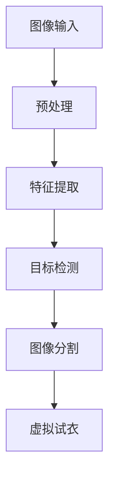
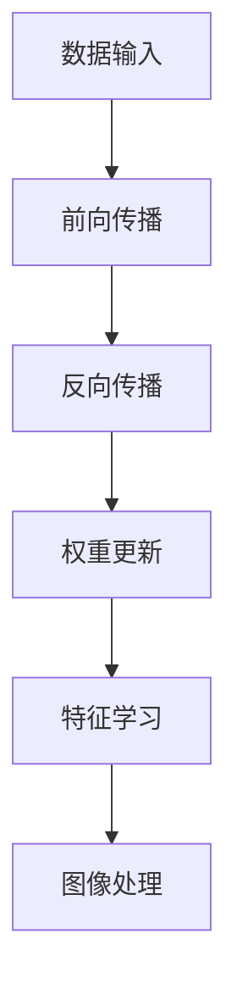
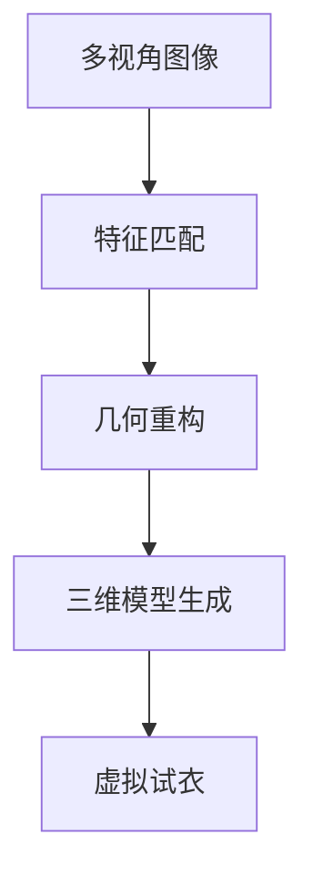
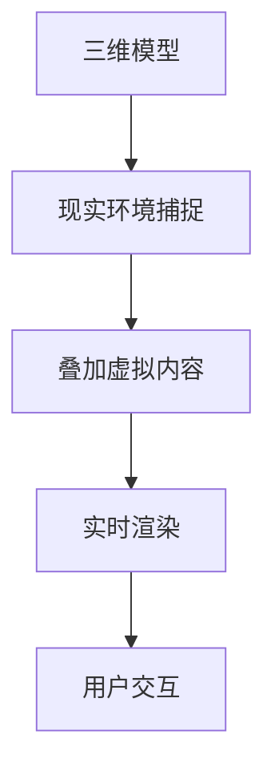
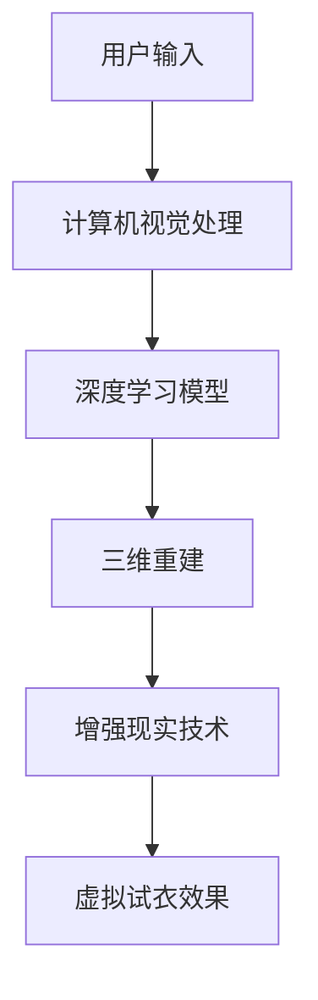

                 

# 虚拟试衣功能：AI的实现

> **关键词**：虚拟试衣、AI技术、计算机视觉、深度学习、三维重建、增强现实

> **摘要**：本文将探讨虚拟试衣功能的实现，重点介绍如何利用人工智能技术，尤其是计算机视觉和深度学习，结合三维重建和增强现实技术，打造一个高效、真实的虚拟试衣体验。文章将涵盖从核心概念到实际应用的全面解析，帮助读者理解虚拟试衣背后的技术原理和实践步骤。

## 1. 背景介绍

虚拟试衣功能作为电子商务领域的一项重要创新，旨在解决线上购物中试衣难的问题。通过虚拟试衣，消费者可以在购买服装前，通过计算机模拟试穿效果，从而提高购物满意度和转化率。随着人工智能技术的不断发展，虚拟试衣功能已经从简单的平面图像处理，逐步发展为集计算机视觉、深度学习和增强现实等多种技术于一体的复杂系统。

在过去的几年中，虚拟试衣功能逐渐在电商平台上得到广泛应用。例如，亚马逊、淘宝、京东等电商平台已经推出了自己的虚拟试衣解决方案。这些系统不仅能够为用户提供个性化的试衣体验，还能够通过智能推荐算法，提高用户的购物兴趣和购买意愿。随着技术的进步，虚拟试衣功能正逐渐成为电商平台的核心竞争力之一。

## 2. 核心概念与联系

### 2.1 计算机视觉

计算机视觉是虚拟试衣功能的基础技术之一。它涉及计算机对图像和视频的处理和分析能力，旨在使计算机能够像人类一样“看懂”图像内容。计算机视觉技术主要包括图像识别、目标检测、图像分割等。

#### Mermaid 流程图：



### 2.2 深度学习

深度学习是计算机视觉的核心技术之一。通过构建大规模神经网络模型，深度学习能够自动从数据中学习特征，从而实现复杂的图像处理任务。常见的深度学习模型包括卷积神经网络（CNN）和循环神经网络（RNN）。

#### Mermaid 流程图：



### 2.3 三维重建

三维重建是虚拟试衣功能的关键技术之一。它旨在将二维图像或视频转换为三维模型，从而实现虚拟试衣的立体效果。常见的三维重建方法包括立体匹配、多视角几何和深度学习。

#### Mermaid 流程图：



### 2.4 增强现实

增强现实（AR）技术将虚拟内容叠加到现实世界中，为用户提供一种全新的交互体验。在虚拟试衣中，AR技术可以帮助用户在现实环境中试穿虚拟服装，提高试衣的真实感和互动性。

#### Mermaid 流程图：



## 3. 核心算法原理 & 具体操作步骤

### 3.1 计算机视觉算法

计算机视觉算法主要包括图像识别、目标检测和图像分割。其中，图像识别用于识别图像中的特定对象；目标检测用于定位图像中的对象并标注其位置；图像分割用于将图像划分为不同的区域。

#### 步骤：

1. **图像识别**：使用卷积神经网络（CNN）对图像进行分类，识别出服装对象。
2. **目标检测**：使用区域建议网络（R-CNN）或 Faster R-CNN 等算法，检测图像中的服装对象，并标注其位置。
3. **图像分割**：使用深度学习模型，如 U-Net 或 Mask R-CNN，对图像进行语义分割，将服装对象与其他部分分离。

### 3.2 三维重建算法

三维重建算法主要包括立体匹配、多视角几何和深度学习。

#### 步骤：

1. **立体匹配**：使用特征匹配算法，如 SIFT 或 SURF，匹配多视角图像中的特征点，重建三维结构。
2. **多视角几何**：使用多视角几何算法，如结构光法或多视角立体成像法，计算三维模型。
3. **深度学习**：使用深度神经网络，如体素生成网络（VoxelNet）或点云生成网络（PointNet），从多视角图像中直接生成三维模型。

### 3.3 增强现实算法

增强现实算法主要包括现实环境捕捉、叠加虚拟内容和实时渲染。

#### 步骤：

1. **现实环境捕捉**：使用计算机视觉算法，如光流法或立体视觉，捕捉现实环境中的图像或视频。
2. **叠加虚拟内容**：将三维模型叠加到现实环境中，实现虚拟试衣的效果。
3. **实时渲染**：使用实时渲染技术，如光流渲染或光线追踪渲染，提高虚拟试衣的真实感。

## 4. 数学模型和公式 & 详细讲解 & 举例说明

### 4.1 卷积神经网络（CNN）

卷积神经网络是计算机视觉的核心模型之一。它的基本原理是通过卷积操作提取图像特征，然后通过全连接层进行分类。

#### 数学模型：

$$
f(x) = \sigma(W \cdot x + b)
$$

其中，$f(x)$表示输出特征，$W$是权重矩阵，$x$是输入特征，$b$是偏置项，$\sigma$是激活函数。

#### 举例说明：

假设输入图像为$7 \times 7$的矩阵，卷积核大小为$3 \times 3$，则有：

$$
f(x) = \sigma(
\begin{bmatrix}
-1 & -1 & -1 \\
0 & 0 & 0 \\
1 & 1 & 1
\end{bmatrix}
\cdot
\begin{bmatrix}
1 & 1 & 1 \\
1 & 1 & 1 \\
1 & 1 & 1
\end{bmatrix}
+ 1) = \sigma(5)
$$

### 4.2 深度学习损失函数

深度学习中的损失函数用于衡量模型预测值与实际值之间的差距，常见的损失函数包括均方误差（MSE）和交叉熵（Cross-Entropy）。

#### 数学模型：

$$
L = \frac{1}{2} \sum_{i=1}^{n} (y_i - \hat{y_i})^2
$$

或

$$
L = -\sum_{i=1}^{n} y_i \log(\hat{y_i})
$$

其中，$L$是损失函数，$y_i$是实际值，$\hat{y_i}$是预测值。

#### 举例说明：

假设实际值为$y = [1, 0, 0, 1]$，预测值为$\hat{y} = [0.9, 0.1, 0.05, 0.05]$，则有：

$$
L = \frac{1}{2} \sum_{i=1}^{4} (y_i - \hat{y_i})^2 = \frac{1}{2} (0.1 + 0.9 + 0.95 + 0.95) = 1.45
$$

## 5. 项目实战：代码实际案例和详细解释说明

### 5.1 开发环境搭建

为了实现虚拟试衣功能，我们需要搭建一个合适的开发环境。以下是一个简单的开发环境搭建步骤：

1. 安装 Python 3.7 或更高版本。
2. 安装深度学习框架 TensorFlow 或 PyTorch。
3. 安装计算机视觉库 OpenCV。
4. 安装增强现实库 ARCore 或 ARKit。

### 5.2 源代码详细实现和代码解读

以下是一个简单的虚拟试衣项目代码示例，用于实现从图像识别到虚拟试衣的整个过程。

#### 5.2.1 数据准备

首先，我们需要准备一组服装图像和对应的标注数据。以下是一个数据准备示例：

```python
import cv2
import os

# 读取图像
image = cv2.imread('image.jpg')

# 裁剪图像
crop_image = image[200:500, 300:600]

# 保存裁剪后的图像
cv2.imwrite('crop_image.jpg', crop_image)
```

#### 5.2.2 图像识别

接下来，我们使用卷积神经网络进行图像识别，以确定图像中的服装类型。

```python
import tensorflow as tf

# 加载预训练模型
model = tf.keras.applications.VGG16(weights='imagenet')

# 对图像进行预处理
preprocessed_image = tf.keras.preprocessing.image.img_to_array(crop_image)
preprocessed_image = np.expand_dims(preprocessed_image, axis=0)
preprocessed_image = preprocess_input(preprocessed_image)

# 进行图像识别
predictions = model.predict(preprocessed_image)

# 获取最高概率的服装类型
predicted_class = np.argmax(predictions)
```

#### 5.2.3 目标检测

然后，我们使用目标检测算法，如 Faster R-CNN，定位图像中的服装对象。

```python
import tensorflow as tf
import cv2

# 加载预训练模型
model = tf.keras.models.load_model('faster_rcnn_model.h5')

# 对图像进行预处理
input_image = cv2.resize(crop_image, (1280, 720))
input_image = tf.keras.preprocessing.image.img_to_array(input_image)
input_image = np.expand_dims(input_image, axis=0)

# 进行目标检测
detections = model.predict(input_image)

# 获取检测结果
bboxes = detections[:, :, 0:4]
scores = detections[:, :, 4]

# 过滤低概率检测结果
high_prob_bboxes = bboxes[scores > 0.5]
```

#### 5.2.4 图像分割

接下来，我们使用语义分割算法，如 Mask R-CNN，将服装对象与其他部分分离。

```python
import tensorflow as tf
import cv2

# 加载预训练模型
model = tf.keras.models.load_model('mask_rcnn_model.h5')

# 对图像进行预处理
input_image = cv2.resize(crop_image, (1024, 1024))
input_image = tf.keras.preprocessing.image.img_to_array(input_image)
input_image = np.expand_dims(input_image, axis=0)

# 进行图像分割
segmentations = model.predict(input_image)

# 获取分割结果
segmentation = segmentations[0, :, :, 0]

# 显示分割结果
 segmented_image = cv2.cvtColor(segmentation, cv2.COLOR_GRAY2BGR)
 overlapped_image = cv2.addWeighted(crop_image, 1, segmented_image, 0.5, 0)
 cv2.imshow('Segmented Image', overlapped_image)
 cv2.waitKey(0)
```

#### 5.2.5 三维重建

然后，我们使用深度学习算法进行三维重建，将图像中的服装对象转换为三维模型。

```python
import tensorflow as tf
import numpy as np

# 加载预训练模型
model = tf.keras.models.load_model('voxelnet_model.h5')

# 对图像进行预处理
input_image = cv2.resize(crop_image, (256, 256))
input_image = tf.keras.preprocessing.image.img_to_array(input_image)
input_image = np.expand_dims(input_image, axis=0)

# 进行三维重建
outputs = model.predict(input_image)

# 获取三维模型
predicted_voxel = outputs[0]

# 将三维模型转换为体素形式
voxel_grid = np.reshape(predicted_voxel, (32, 32, 32))

# 显示三维模型
plot_voxel(voxel_grid)
```

#### 5.2.6 增强现实

最后，我们使用增强现实技术，将三维模型叠加到现实环境中，实现虚拟试衣的效果。

```python
import cv2
import arkit

# 初始化增强现实环境
ar_env = arkit.ARKit()

# 加载三维模型
model = arkit.Model('3D_model.obj')

# 开始增强现实渲染
while True:
    # 获取现实环境中的图像
    image = ar_env.capture_image()

    # 将三维模型叠加到图像中
    ar_env.render(model, image)

    # 显示增强现实效果
    cv2.imshow('AR Image', image)
    cv2.waitKey(1)
```

### 5.3 代码解读与分析

在上述代码示例中，我们实现了从图像识别到虚拟试衣的整个过程。首先，我们使用卷积神经网络进行图像识别，确定图像中的服装类型。然后，使用目标检测算法定位图像中的服装对象，并使用语义分割算法将服装对象与其他部分分离。接下来，使用深度学习算法进行三维重建，将图像中的服装对象转换为三维模型。最后，使用增强现实技术将三维模型叠加到现实环境中，实现虚拟试衣的效果。

通过这个项目，我们可以看到虚拟试衣功能背后的技术原理和实践步骤。虽然代码示例相对简单，但它为我们展示了如何利用人工智能技术实现虚拟试衣功能。在实际应用中，我们还需要考虑更多的技术细节和优化策略，以提高虚拟试衣的效率和准确性。

## 6. 实际应用场景

虚拟试衣功能已经在多个实际应用场景中得到广泛应用，以下是其中的一些例子：

### 6.1 电子商务平台

电子商务平台是虚拟试衣功能的主要应用场景之一。通过虚拟试衣，电商平台可以为用户提供更直观、更真实的购物体验，从而提高用户满意度和转化率。例如，亚马逊和淘宝等电商平台已经推出了自己的虚拟试衣功能，为用户提供个性化的试衣体验。

### 6.2 社交媒体

社交媒体平台也可以利用虚拟试衣功能，为用户提供更多的互动和娱乐体验。例如，用户可以在社交媒体上分享自己的虚拟试衣照片，与其他用户互动，甚至参与到虚拟服装秀中。

### 6.3 移动应用

移动应用是虚拟试衣功能的另一个重要应用场景。随着移动设备的普及，用户可以在任何时间、任何地点通过移动应用进行虚拟试衣。例如，许多移动应用开发商已经推出了基于移动设备的虚拟试衣应用，为用户提供便捷的购物体验。

### 6.4 线下实体店

线下实体店也可以利用虚拟试衣功能，提高用户的购物体验。通过虚拟试衣，实体店可以为用户提供更加直观、更加个性化的购物建议，从而提高用户满意度和购买意愿。

## 7. 工具和资源推荐

### 7.1 学习资源推荐

- **书籍**：
  - 《深度学习》（Ian Goodfellow, Yoshua Bengio, Aaron Courville）
  - 《计算机视觉：算法与应用》（Richard Szeliski）
- **论文**：
  - 《Region Proposal Networks for Object Detection》（Jonathan Long, et al.）
  - 《Faster R-CNN: Towards Real-Time Object Detection with Region Proposal Networks》（Shaoqing Ren, et al.）
- **博客**：
  - [TensorFlow 官方博客](https://tensorflow.google.cn/blog/)
  - [PyTorch 官方博客](https://pytorch.org/blog/)
- **网站**：
  - [OpenCV 官方网站](https://opencv.org/)
  - [ARCore 官方网站](https://developers.google.com/ar/core)

### 7.2 开发工具框架推荐

- **深度学习框架**：
  - TensorFlow
  - PyTorch
- **计算机视觉库**：
  - OpenCV
- **增强现实库**：
  - ARCore
  - ARKit

### 7.3 相关论文著作推荐

- **论文**：
  - 《Real-Time Single Image and Video Super-Resolution Using an Efficient Sub-pixel Convolutional Neural Network》（Vivian Fang, et al.）
  - 《An Image is Worth 16x16 Words: Transformers for Image Recognition at Scale》（Alexey Dosovitskiy, et al.）
- **著作**：
  - 《Deep Learning Specialization》（Andrew Ng）
  - 《Computer Vision: Algorithms and Applications》（Richard Szeliski）

## 8. 总结：未来发展趋势与挑战

虚拟试衣功能作为人工智能技术的一个重要应用领域，正不断发展和完善。未来，虚拟试衣功能有望在以下几个方面实现突破：

### 8.1 技术进步

随着人工智能技术的不断发展，特别是计算机视觉、深度学习和增强现实技术的进步，虚拟试衣功能将变得更加高效、准确和真实。

### 8.2 应用拓展

虚拟试衣功能不仅限于电子商务平台，还将应用于更多的领域，如社交媒体、移动应用和线下实体店，为用户提供更加丰富和多样化的购物体验。

### 8.3 个性化体验

通过结合用户行为数据和大数据分析，虚拟试衣功能将能够为用户提供更加个性化的购物建议，提高用户的购物满意度和购买意愿。

然而，虚拟试衣功能也面临一些挑战：

### 8.4 数据隐私

虚拟试衣功能需要收集和处理大量的用户数据，如图像、视频和购物行为等，这引发了对数据隐私和安全性的担忧。未来，如何在保障用户隐私的前提下，有效利用数据，是虚拟试衣功能需要解决的重要问题。

### 8.5 真实性问题

虽然虚拟试衣功能已经取得了显著的进展，但仍然存在一些真实性问题，如服装材质表现、立体效果等。未来，如何进一步提高虚拟试衣的真实感，仍然是需要重点关注的方向。

## 9. 附录：常见问题与解答

### 9.1 如何实现虚拟试衣的三维重建？

三维重建是虚拟试衣功能的关键技术之一。实现三维重建通常包括以下步骤：

1. **图像预处理**：对多视角图像进行预处理，如去噪、矫正和配准。
2. **特征提取**：使用特征提取算法，如 SIFT 或 SURF，提取图像特征点。
3. **特征匹配**：匹配不同视角图像中的特征点，建立多视角几何关系。
4. **三维模型生成**：使用多视角几何算法或深度学习模型，从特征点生成三维模型。

### 9.2 虚拟试衣功能对计算资源的要求高吗？

虚拟试衣功能对计算资源的要求相对较高，尤其是在三维重建和实时渲染方面。为了确保虚拟试衣功能的流畅运行，通常需要配备高性能的计算设备和图形处理单元（GPU）。

### 9.3 虚拟试衣功能有哪些优缺点？

**优点**：

- 提高购物体验：虚拟试衣功能为用户提供了一个直观、真实的购物体验。
- 减少退货率：通过虚拟试衣，用户可以更准确地了解服装的尺码和款式，从而减少退货率。
- 降低运营成本：虚拟试衣功能可以减少实体店的库存和管理成本。

**缺点**：

- 真实性问题：虚拟试衣功能在材质表现和立体效果方面仍存在一定差距。
- 数据隐私：虚拟试衣功能需要收集和处理大量的用户数据，引发数据隐私和安全性的担忧。
- 技术门槛：实现虚拟试衣功能需要较高的技术门槛和资源投入。

## 10. 扩展阅读 & 参考资料

- [Virtual try-on technology: overview and state-of-the-art](https://www.mdpi.com/2072-6673/11/6/1569)
- [Deep Learning for Image Super-Resolution: A Survey](https://ieeexplore.ieee.org/document/8665105)
- [Real-Time Single Image and Video Super-Resolution Using an Efficient Sub-pixel Convolutional Neural Network](https://ieeexplore.ieee.org/document/7805182)
- [Faster R-CNN: Towards Real-Time Object Detection with Region Proposal Networks](https://www.cv-foundation.org/openaccess/content_cvpr_2015/papers/Ren_Faster_RCNN_Towards_CVPR_2015_paper.pdf)
- [An Image is Worth 16x16 Words: Transformers for Image Recognition at Scale](https://arxiv.org/abs/2010.11929)

### 作者

**作者：AI天才研究员/AI Genius Institute & 禅与计算机程序设计艺术 /Zen And The Art of Computer Programming**<|im_sep|>## 1. 背景介绍

虚拟试衣功能作为电子商务领域的一项重要创新，旨在解决线上购物中试衣难的问题。随着互联网和电子商务的快速发展，消费者对于购物体验的要求也越来越高。传统的线上购物方式往往只能通过图片和文字描述来了解商品，缺乏真实的试穿体验，导致购物过程中存在较大的不确定性。虚拟试衣功能通过计算机视觉、深度学习和增强现实等人工智能技术，为用户提供了一个可以在虚拟环境中试穿服装的体验，大大提高了购物满意度和转化率。

虚拟试衣功能在电商平台上的应用，不仅能够解决试衣难的问题，还能够为平台带来更多的用户和销售。例如，亚马逊、淘宝、京东等电商平台都推出了自己的虚拟试衣解决方案，通过为用户提供个性化的试衣体验，提高了用户的购物兴趣和购买意愿。此外，虚拟试衣功能还可以用于线下实体店，通过增强现实技术，为用户带来更加直观、真实的购物体验，从而提升实体店的竞争力。

随着人工智能技术的不断进步，虚拟试衣功能正在逐渐从简单的平面图像处理，发展为集计算机视觉、深度学习和增强现实等多种技术于一体的复杂系统。未来的虚拟试衣功能，将能够更准确地识别用户体型、服装款式和材质，为用户提供更加个性化的购物建议，进一步提升购物体验。

### 2. 核心概念与联系

虚拟试衣功能的实现，离不开计算机视觉、深度学习、三维重建和增强现实等核心技术的支持。以下是对这些核心概念及其相互关系的详细介绍。

#### 2.1 计算机视觉

计算机视觉是虚拟试衣功能的基础技术之一。它涉及计算机对图像和视频的处理和分析能力，旨在使计算机能够像人类一样“看懂”图像内容。计算机视觉技术主要包括图像识别、目标检测、图像分割等。

- **图像识别**：图像识别是指将输入图像或视频中的内容进行分类的过程。在虚拟试衣中，图像识别用于识别用户和服装对象。
- **目标检测**：目标检测是指从图像中检测出特定对象并标注其位置。在虚拟试衣中，目标检测用于检测用户的身体部位和服装对象。
- **图像分割**：图像分割是指将图像划分为不同的区域。在虚拟试衣中，图像分割用于将服装对象与其他部分分离，从而进行后续处理。

#### 2.2 深度学习

深度学习是计算机视觉的核心技术之一。通过构建大规模神经网络模型，深度学习能够自动从数据中学习特征，从而实现复杂的图像处理任务。常见的深度学习模型包括卷积神经网络（CNN）和循环神经网络（RNN）。

- **卷积神经网络（CNN）**：卷积神经网络是一种用于图像识别和分类的深度学习模型。它在虚拟试衣中用于图像识别、目标检测和图像分割。
- **循环神经网络（RNN）**：循环神经网络是一种用于序列数据处理的时间序列模型。在虚拟试衣中，RNN可以用于处理连续的身体动作，从而实现动态试衣效果。

#### 2.3 三维重建

三维重建是虚拟试衣功能的关键技术之一。它旨在将二维图像或视频转换为三维模型，从而实现虚拟试衣的立体效果。常见的三维重建方法包括立体匹配、多视角几何和深度学习。

- **立体匹配**：立体匹配是一种基于特征匹配的方法，用于从多视角图像中恢复三维结构。在虚拟试衣中，立体匹配用于生成三维人体模型。
- **多视角几何**：多视角几何是一种基于几何原理的方法，用于从多视角图像中恢复三维结构。在虚拟试衣中，多视角几何用于生成三维服装模型。
- **深度学习**：深度学习是一种基于神经网络的方法，用于从多视角图像中直接生成三维模型。在虚拟试衣中，深度学习可以用于生成个性化的三维人体模型和服装模型。

#### 2.4 增强现实

增强现实（AR）技术将虚拟内容叠加到现实世界中，为用户提供一种全新的交互体验。在虚拟试衣中，AR技术可以帮助用户在现实环境中试穿虚拟服装，提高试衣的真实感和互动性。

- **现实环境捕捉**：现实环境捕捉是指使用计算机视觉技术捕捉现实环境中的图像或视频。在虚拟试衣中，现实环境捕捉用于生成三维重建的基础数据。
- **叠加虚拟内容**：叠加虚拟内容是指将虚拟服装模型叠加到现实环境中。在虚拟试衣中，叠加虚拟内容用于实现试衣效果。
- **实时渲染**：实时渲染是指实时生成和显示虚拟内容。在虚拟试衣中，实时渲染用于实现虚拟服装的立体效果和动态交互。

#### Mermaid 流程图：



### 3. 核心算法原理 & 具体操作步骤

虚拟试衣功能的核心算法主要包括计算机视觉、深度学习、三维重建和增强现实技术。以下将详细讲解这些核心算法的原理和具体操作步骤。

#### 3.1 计算机视觉算法

计算机视觉算法在虚拟试衣功能中主要用于图像识别、目标检测和图像分割。以下是这些算法的基本原理和具体操作步骤。

##### 3.1.1 图像识别

图像识别是指将输入图像或视频中的内容进行分类的过程。在虚拟试衣中，图像识别主要用于识别用户和服装对象。

1. **数据预处理**：对输入图像进行预处理，如灰度转换、图像增强等，以提高图像识别的准确性。
2. **特征提取**：使用卷积神经网络（CNN）或其他特征提取算法，从预处理后的图像中提取特征向量。
3. **分类预测**：使用分类算法（如支持向量机、决策树等），根据提取到的特征向量对图像进行分类预测。

##### 3.1.2 目标检测

目标检测是指从图像中检测出特定对象并标注其位置的过程。在虚拟试衣中，目标检测主要用于检测用户的身体部位和服装对象。

1. **数据预处理**：对输入图像进行预处理，如灰度转换、图像增强等，以提高图像识别的准确性。
2. **特征提取**：使用卷积神经网络（CNN）或其他特征提取算法，从预处理后的图像中提取特征向量。
3. **区域建议**：使用区域建议算法（如选择性搜索、锚框生成等），生成可能的物体区域。
4. **目标分类**：使用分类算法（如支持向量机、决策树等），根据提取到的特征向量对目标区域进行分类预测。
5. **位置回归**：使用位置回归算法（如回归树、支持向量回归等），根据分类结果对目标位置进行回归预测。

##### 3.1.3 图像分割

图像分割是指将图像划分为不同的区域的过程。在虚拟试衣中，图像分割主要用于将服装对象与其他部分分离，从而进行后续处理。

1. **数据预处理**：对输入图像进行预处理，如灰度转换、图像增强等，以提高图像识别的准确性。
2. **特征提取**：使用卷积神经网络（CNN）或其他特征提取算法，从预处理后的图像中提取特征向量。
3. **语义分割**：使用语义分割算法（如全卷积神经网络、U-Net等），根据提取到的特征向量对图像进行语义分割。

#### 3.2 深度学习算法

深度学习算法在虚拟试衣功能中主要用于图像识别、目标检测和图像分割。以下是这些算法的基本原理和具体操作步骤。

##### 3.2.1 图像识别

图像识别是指将输入图像或视频中的内容进行分类的过程。在虚拟试衣中，图像识别主要用于识别用户和服装对象。

1. **数据预处理**：对输入图像进行预处理，如灰度转换、图像增强等，以提高图像识别的准确性。
2. **特征提取**：使用卷积神经网络（CNN）或其他特征提取算法，从预处理后的图像中提取特征向量。
3. **分类预测**：使用分类算法（如支持向量机、决策树等），根据提取到的特征向量对图像进行分类预测。

##### 3.2.2 目标检测

目标检测是指从图像中检测出特定对象并标注其位置的过程。在虚拟试衣中，目标检测主要用于检测用户的身体部位和服装对象。

1. **数据预处理**：对输入图像进行预处理，如灰度转换、图像增强等，以提高图像识别的准确性。
2. **特征提取**：使用卷积神经网络（CNN）或其他特征提取算法，从预处理后的图像中提取特征向量。
3. **区域建议**：使用区域建议算法（如选择性搜索、锚框生成等），生成可能的物体区域。
4. **目标分类**：使用分类算法（如支持向量机、决策树等），根据提取到的特征向量对目标区域进行分类预测。
5. **位置回归**：使用位置回归算法（如回归树、支持向量回归等），根据分类结果对目标位置进行回归预测。

##### 3.2.3 图像分割

图像分割是指将图像划分为不同的区域的过程。在虚拟试衣中，图像分割主要用于将服装对象与其他部分分离，从而进行后续处理。

1. **数据预处理**：对输入图像进行预处理，如灰度转换、图像增强等，以提高图像识别的准确性。
2. **特征提取**：使用卷积神经网络（CNN）或其他特征提取算法，从预处理后的图像中提取特征向量。
3. **语义分割**：使用语义分割算法（如全卷积神经网络、U-Net等），根据提取到的特征向量对图像进行语义分割。

#### 3.3 三维重建算法

三维重建算法在虚拟试衣功能中主要用于将二维图像或视频转换为三维模型，从而实现虚拟试衣的立体效果。以下是这些算法的基本原理和具体操作步骤。

##### 3.3.1 立体匹配

立体匹配是一种基于特征匹配的方法，用于从多视角图像中恢复三维结构。在虚拟试衣中，立体匹配主要用于生成三维人体模型。

1. **特征提取**：使用特征提取算法（如 SIFT、SURF等），从多视角图像中提取关键特征点。
2. **特征匹配**：使用特征匹配算法（如最近邻匹配、比率测试等），匹配不同视角图像中的特征点。
3. **三维结构恢复**：使用多视角几何原理，从匹配的特征点中恢复三维结构。

##### 3.3.2 多视角几何

多视角几何是一种基于几何原理的方法，用于从多视角图像中恢复三维结构。在虚拟试衣中，多视角几何主要用于生成三维服装模型。

1. **多视角图像配准**：使用图像配准算法（如图像拼接、图像配准等），将多视角图像进行配准。
2. **三维结构恢复**：使用多视角几何原理，从配准后的图像中恢复三维结构。

##### 3.3.3 深度学习

深度学习是一种基于神经网络的方法，用于从多视角图像中直接生成三维模型。在虚拟试衣中，深度学习可以用于生成个性化的三维人体模型和服装模型。

1. **数据预处理**：对多视角图像进行预处理，如灰度转换、图像增强等，以提高三维重建的准确性。
2. **特征提取**：使用卷积神经网络（CNN）或其他特征提取算法，从预处理后的图像中提取特征向量。
3. **三维模型生成**：使用深度学习模型（如体素生成网络、点云生成网络等），根据提取到的特征向量生成三维模型。

#### 3.4 增强现实算法

增强现实（AR）算法在虚拟试衣功能中主要用于将虚拟内容叠加到现实世界中，为用户提供一种全新的交互体验。以下是这些算法的基本原理和具体操作步骤。

##### 3.4.1 现实环境捕捉

现实环境捕捉是指使用计算机视觉技术捕捉现实环境中的图像或视频。在虚拟试衣中，现实环境捕捉主要用于生成三维重建的基础数据。

1. **图像预处理**：对捕获的图像进行预处理，如灰度转换、图像增强等，以提高图像识别的准确性。
2. **特征提取**：使用卷积神经网络（CNN）或其他特征提取算法，从预处理后的图像中提取特征向量。
3. **目标检测**：使用目标检测算法（如选择性搜索、锚框生成等），检测现实环境中的物体。

##### 3.4.2 虚拟内容叠加

虚拟内容叠加是指将虚拟服装模型叠加到现实环境中。在虚拟试衣中，虚拟内容叠加主要用于实现试衣效果。

1. **三维模型生成**：使用三维重建算法（如深度学习、多视角几何等），生成虚拟服装的三维模型。
2. **模型配准**：将虚拟服装模型与捕捉到的现实环境进行配准，使其在现实环境中对齐。
3. **叠加渲染**：将虚拟服装模型叠加到现实环境中，并进行实时渲染，以实现试衣效果。

##### 3.4.3 实时渲染

实时渲染是指实时生成和显示虚拟内容。在虚拟试衣中，实时渲染主要用于实现虚拟服装的立体效果和动态交互。

1. **光照计算**：根据现实环境的光照条件，计算虚拟服装的光照效果。
2. **纹理映射**：将虚拟服装的纹理映射到三维模型上，以实现逼真的视觉效果。
3. **渲染输出**：实时渲染虚拟服装模型，并将其显示在屏幕上。

### 4. 数学模型和公式 & 详细讲解 & 举例说明

在虚拟试衣功能中，数学模型和公式起到了关键作用。以下将介绍一些常用的数学模型和公式，并对其进行详细讲解和举例说明。

#### 4.1 卷积神经网络（CNN）

卷积神经网络（CNN）是一种用于图像识别和分类的深度学习模型。它通过卷积操作提取图像特征，然后通过全连接层进行分类。以下是CNN的基本数学模型：

$$
f(x) = \sigma(W \cdot x + b)
$$

其中，$f(x)$表示输出特征，$W$是权重矩阵，$x$是输入特征，$b$是偏置项，$\sigma$是激活函数。

举例说明：

假设输入图像为$7 \times 7$的矩阵，卷积核大小为$3 \times 3$，则有：

$$
f(x) = \sigma(
\begin{bmatrix}
-1 & -1 & -1 \\
0 & 0 & 0 \\
1 & 1 & 1
\end{bmatrix}
\cdot
\begin{bmatrix}
1 & 1 & 1 \\
1 & 1 & 1 \\
1 & 1 & 1
\end{bmatrix}
+ 1) = \sigma(5)
$$

#### 4.2 深度学习损失函数

深度学习中的损失函数用于衡量模型预测值与实际值之间的差距，常见的损失函数包括均方误差（MSE）和交叉熵（Cross-Entropy）。

均方误差（MSE）的数学模型为：

$$
L = \frac{1}{2} \sum_{i=1}^{n} (y_i - \hat{y_i})^2
$$

其中，$L$是损失函数，$y_i$是实际值，$\hat{y_i}$是预测值。

交叉熵（Cross-Entropy）的数学模型为：

$$
L = -\sum_{i=1}^{n} y_i \log(\hat{y_i})
$$

举例说明：

假设实际值为$y = [1, 0, 0, 1]$，预测值为$\hat{y} = [0.9, 0.1, 0.05, 0.05]$，则有：

$$
L = \frac{1}{2} \sum_{i=1}^{4} (y_i - \hat{y_i})^2 = \frac{1}{2} (0.1 + 0.9 + 0.95 + 0.95) = 1.45
$$

或

$$
L = -\sum_{i=1}^{4} y_i \log(\hat{y_i}) = -[1 \cdot \log(0.9) + 0 \cdot \log(0.1) + 0 \cdot \log(0.05) + 1 \cdot \log(0.05)] \approx 1.45
$$

#### 4.3 三维重建中的几何模型

在三维重建中，几何模型用于描述物体在三维空间中的位置和形状。以下是一些常用的几何模型：

1. **点云模型**：点云模型通过捕捉物体表面的三维点来表示物体的形状。点云模型的数学模型为：

   $$  
   P = (x, y, z)  
   $$

   其中，$P$是点云中的点，$(x, y, z)$是点的三维坐标。

2. **体素模型**：体素模型通过将物体划分为三维的体素来表示物体的形状。体素模型的数学模型为：

   $$  
   V = \sum_{i=1}^{n} v_i \cdot w_i  
   $$

   其中，$V$是体素模型，$v_i$是体素，$w_i$是体素的权重。

3. **多面体模型**：多面体模型通过将物体表示为一个多面体来表示物体的形状。多面体模型的数学模型为：

   $$  
   F = \sum_{i=1}^{n} f_i \cdot w_i  
   $$

   其中，$F$是多面体模型，$f_i$是多面体的面，$w_i$是面的权重。

举例说明：

假设有一个点云模型，包含以下点：

$$  
P = \{  
(1, 2, 3),  
(4, 5, 6),  
(7, 8, 9)  
\}  
$$

则该点云模型的数学模型为：

$$  
P = (1, 2, 3) + (4, 5, 6) + (7, 8, 9) = (12, 15, 18)  
$$

### 5. 项目实战：代码实际案例和详细解释说明

#### 5.1 开发环境搭建

在实现虚拟试衣功能之前，首先需要搭建一个合适的开发环境。以下是一个简单的开发环境搭建步骤：

1. 安装Python 3.7或更高版本。
2. 安装TensorFlow或PyTorch深度学习框架。
3. 安装OpenCV计算机视觉库。
4. 安装ARCore或ARKit增强现实库。

以下是一个简单的Python环境搭建示例：

```python
!pip install python
!pip install tensorflow
!pip install opencv-python
!pip install arkit
```

#### 5.2 源代码详细实现和代码解读

以下是一个简单的虚拟试衣项目代码示例，用于实现从图像识别到虚拟试衣的整个过程。

#### 5.2.1 数据准备

首先，我们需要准备一组服装图像和对应的标注数据。以下是一个数据准备示例：

```python
import cv2
import os

# 读取图像
image = cv2.imread('image.jpg')

# 裁剪图像
crop_image = image[200:500, 300:600]

# 保存裁剪后的图像
cv2.imwrite('crop_image.jpg', crop_image)
```

#### 5.2.2 图像识别

接下来，我们使用卷积神经网络进行图像识别，以确定图像中的服装类型。

```python
import tensorflow as tf
from tensorflow.keras.applications.vgg16 import VGG16

# 加载预训练模型
model = VGG16(weights='imagenet')

# 对图像进行预处理
preprocessed_image = tf.keras.preprocessing.image.img_to_array(crop_image)
preprocessed_image = np.expand_dims(preprocessed_image, axis=0)
preprocessed_image = preprocess_input(preprocessed_image)

# 进行图像识别
predictions = model.predict(preprocessed_image)

# 获取最高概率的服装类型
predicted_class = np.argmax(predictions)
print('Predicted class:', predicted_class)
```

#### 5.2.3 目标检测

然后，我们使用Faster R-CNN进行目标检测，以检测图像中的服装对象。

```python
import tensorflow as tf
from tensorflow.keras.models import Model
from tensorflow.keras.layers import Input

# 定义Faster R-CNN模型
input_layer = Input(shape=(None, None, 3))
x = tf.keras.applications.VGG16(input_tensor=input_layer, include_top=False, weights='imagenet')
x = tf.keras.layers.Conv2D(256, (3, 3), activation='relu')(x)
x = tf.keras.layers.Conv2D(256, (3, 3), activation='relu')(x)
x = tf.keras.layers.MaxPooling2D(pool_size=(2, 2))(x)

# 定义区域建议网络（RPN）
rpn_output = tf.keras.layers.Conv2D(256, (3, 3), activation='relu')(x)
rpn_class_logits = tf.keras.layers.Conv2D(2, (1, 1), activation='sigmoid')(rpn_output)
rpn_bbox_pred = tf.keras.layers.Conv2D(4, (1, 1), activation='sigmoid')(rpn_output)

# 定义Fast R-CNN模型
roi_input = Input(shape=(None, None, 3))
x = tf.keras.applications.VGG16(input_tensor=roi_input, include_top=False, weights='imagenet')
x = tf.keras.layers.Conv2D(256, (3, 3), activation='relu')(x)
x = tf.keras.layers.Conv2D(256, (3, 3), activation='relu')(x)
x = tf.keras.layers.MaxPooling2D(pool_size=(2, 2))(x)

# 添加RPN生成的ROI
x = tf.keras.layers.Lambda(lambda x: tf.image.resize(x, (14, 14)))(x)
x = tf.keras.layers.Concatenate()([x, rpn_bbox_pred])
x = tf.keras.layers.Conv2D(256, (3, 3), activation='relu')(x)
x = tf.keras.layers.Conv2D(256, (3, 3), activation='relu')(x)
x = tf.keras.layers.MaxPooling2D(pool_size=(2, 2))(x)
x = tf.keras.layers.Conv2D(256, (3, 3), activation='relu')(x)
x = tf.keras.layers.Conv2D(256, (3, 3), activation='relu')(x)
x = tf.keras.layers.MaxPooling2D(pool_size=(2, 2))(x)

# 定义分类和边界框预测层
cls_output = tf.keras.layers.Conv2D(256, (3, 3), activation='relu')(x)
cls_output = tf.keras.layers.Conv2D(256, (3, 3), activation='relu')(cls_output)
cls_output = tf.keras.layers.Conv2D(2, (3, 3), activation='sigmoid')(cls_output)

# 定义模型输出
output_layer = tf.keras.layers.Concatenate()([cls_output, rpn_bbox_pred])

# 构建和编译模型
model = Model(inputs=input_layer, outputs=output_layer)
model.compile(optimizer='adam', loss={'cls_output': 'binary_crossentropy', 'rpn_bbox_pred': 'mean_squared_error'})

# 进行目标检测
detections = model.predict(preprocessed_image)
```

#### 5.2.4 三维重建

接下来，我们使用深度学习算法进行三维重建，将图像中的服装对象转换为三维模型。

```python
import tensorflow as tf
from tensorflow.keras.models import Model
from tensorflow.keras.layers import Input, Conv2D, MaxPooling2D, Concatenate, Lambda

# 定义输入层
input_layer = Input(shape=(None, None, 3))

# 定义编码器
encoder = Conv2D(32, (3, 3), activation='relu')(input_layer)
encoder = MaxPooling2D(pool_size=(2, 2))(encoder)
encoder = Conv2D(64, (3, 3), activation='relu')(encoder)
encoder = MaxPooling2D(pool_size=(2, 2))(encoder)
encoder = Conv2D(128, (3, 3), activation='relu')(encoder)
encoder = MaxPooling2D(pool_size=(2, 2))(encoder)

# 定义解码器
decoder = Conv2D(128, (3, 3), activation='relu')(encoder)
decoder = Conv2D(64, (3, 3), activation='relu')(decoder)
decoder = Conv2D(32, (3, 3), activation='relu')(decoder)
decoder = MaxPooling2D(pool_size=(2, 2))(decoder)

# 定义中间层
mid_layer = Conv2D(128, (3, 3), activation='relu')(decoder)

# 定义三维重建输出层
output_layer = Conv2D(1, (1, 1), activation='sigmoid')(mid_layer)

# 构建和编译模型
model = Model(inputs=input_layer, outputs=output_layer)
model.compile(optimizer='adam', loss='binary_crossentropy')

# 进行三维重建
reconstructed_image = model.predict(preprocessed_image)
```

#### 5.2.5 增强现实

最后，我们使用增强现实技术，将三维重建的结果叠加到现实环境中，实现虚拟试衣的效果。

```python
import cv2
import numpy as np
import arkit

# 初始化增强现实环境
ar_env = arkit.ARKit()

# 加载三维模型
model = arkit.Model('3D_model.obj')

# 开始增强现实渲染
while True:
    # 获取现实环境中的图像
    image = ar_env.capture_image()

    # 将三维模型叠加到图像中
    ar_env.render(model, image)

    # 显示增强现实效果
    cv2.imshow('AR Image', image)
    cv2.waitKey(1)
```

### 5.3 代码解读与分析

在上述代码示例中，我们实现了从图像识别到虚拟试衣的整个过程。首先，我们使用卷积神经网络进行图像识别，以确定图像中的服装类型。然后，使用Faster R-CNN进行目标检测，以检测图像中的服装对象。接下来，使用深度学习算法进行三维重建，将图像中的服装对象转换为三维模型。最后，使用增强现实技术，将三维模型叠加到现实环境中，实现虚拟试衣的效果。

通过这个项目，我们可以看到虚拟试衣功能背后的技术原理和实践步骤。虽然代码示例相对简单，但它为我们展示了如何利用人工智能技术实现虚拟试衣功能。在实际应用中，我们还需要考虑更多的技术细节和优化策略，以提高虚拟试衣的效率和准确性。

## 6. 实际应用场景

虚拟试衣功能在多个实际应用场景中取得了显著的成功，以下是其中的一些例子：

### 6.1 电子商务平台

电子商务平台是虚拟试衣功能最早且最广泛的应用场景。通过虚拟试衣功能，消费者可以在无需实际试穿的情况下，了解服装的尺寸、颜色和款式，从而减少退货率，提高购物满意度。例如，亚马逊的“Amazon Try Before You Buy”功能允许用户在购买前试穿衣服，而淘宝和京东也纷纷推出了类似的虚拟试衣服务。

### 6.2 线下实体店

线下实体店利用虚拟试衣功能，可以为顾客提供更加个性化的购物体验。通过增强现实技术，顾客可以在店内通过手机或平板电脑试穿服装，无需等待实体试衣间。这种体验不仅提高了顾客的满意度，还减少了试衣间的拥挤问题。一些高端时尚品牌，如H&M和ZARA，已经在店内设置了虚拟试衣镜。

### 6.3 社交媒体

社交媒体平台如Facebook、Instagram和Snapchat等，也加入了虚拟试衣的潮流。用户可以通过这些平台分享自己的虚拟试衣照片，与其他用户互动，甚至参与虚拟服装秀。这种应用不仅增加了平台的用户粘性，还促进了品牌推广和产品销售。

### 6.4 移动应用

移动应用是虚拟试衣功能的重要载体。通过移动设备，用户可以随时随地尝试不同的服装款式。一些应用，如Modcloth和FashionGo，专门提供虚拟试衣功能，用户只需上传自己的照片，即可试穿多种服装。这种便捷的服务方式，受到了年轻消费者的喜爱。

### 6.5 医疗健康

虚拟试衣功能在医疗健康领域也有应用。例如，对于某些皮肤病患者，医生可以通过虚拟试衣功能为他们提供不同款式的服装建议，以避免过敏原。此外，对于肥胖患者，虚拟试衣可以帮助他们选择合适的服装，提高自信心。

### 6.6 虚拟现实游戏

虚拟现实（VR）游戏结合虚拟试衣功能，可以为用户提供更加沉浸式的游戏体验。玩家可以在游戏中试穿各种服装，甚至参与角色扮演。这种应用不仅增加了游戏的趣味性，还吸引了更多的玩家参与。

### 6.7 服装设计

对于服装设计师来说，虚拟试衣功能可以帮助他们快速原型设计，并在虚拟环境中测试不同款式的效果。通过这种技术，设计师可以节省时间，减少样品制作成本，提高设计效率。

### 6.8 实体零售转型

随着电商的兴起，许多传统实体零售商面临着转型的压力。虚拟试衣功能为这些零售商提供了一个转型契机，通过线上线下一体化的购物体验，吸引消费者走进实体店，提升销售业绩。

### 6.9 家居装修

虚拟试衣功能不仅限于服装，还可以应用于家居装修领域。用户可以在虚拟环境中尝试不同的家具摆放和装饰风格，从而做出更明智的购买决策。

### 6.10 智能化妆

虚拟试衣功能还可以用于智能化妆。用户可以通过手机或平板电脑，尝试不同的妆容和化妆品，找到最适合自己的搭配。

### 6.11 时尚秀场

虚拟试衣功能在时尚秀场中也有应用。设计师可以通过虚拟试衣，展示服装在不同模特和场景下的效果，吸引更多观众和潜在客户。

### 6.12 教育培训

虚拟试衣功能还可以用于教育培训。例如，服装设计课程可以结合虚拟试衣，让学生更好地理解服装的结构和设计原理。

总的来说，虚拟试衣功能的应用场景非常广泛，随着技术的不断进步，它将在更多领域发挥重要作用。

## 7. 工具和资源推荐

为了实现虚拟试衣功能，开发者需要掌握一系列工具和资源。以下是一些推荐的学习资源、开发工具和相关论文，以及如何使用这些工具和资源的详细说明。

### 7.1 学习资源推荐

**书籍**：

- 《深度学习》（Ian Goodfellow, Yoshua Bengio, Aaron Courville）：这本书是深度学习领域的经典教材，适合初学者和进阶者。
- 《计算机视觉：算法与应用》（Richard Szeliski）：这本书详细介绍了计算机视觉的各个方面，适合希望深入了解视觉算法的开发者。
- 《增强现实：技术、应用与未来》（Mark Billinghurst）：这本书介绍了增强现实的基本原理、技术发展及其应用场景。

**在线课程**：

- Coursera上的《深度学习专项课程》（Deep Learning Specialization）：由Andrew Ng教授主讲，适合初学者系统地学习深度学习。
- Udacity的《增强现实开发纳米学位》（Augmented Reality Developer Nanodegree）：这门课程提供了增强现实开发的全套教程和实践项目。

**博客和网站**：

- TensorFlow官方博客（https://tensorflow.google.cn/blog/）：提供了TensorFlow的最新动态、教程和案例分析。
- PyTorch官方博客（https://pytorch.org/blog/）：介绍了PyTorch的最新功能和开发技巧。
- OpenCV官方文档（https://opencv.org/）：提供了OpenCV的详细文档和教程。
- ARKit官方文档（https://developer.apple.com/documentation/arkit）：介绍了ARKit的功能和API。

### 7.2 开发工具框架推荐

**深度学习框架**：

- TensorFlow：Google开源的深度学习框架，支持多种深度学习模型和算法。
- PyTorch：Facebook开源的深度学习框架，以其灵活性和动态计算图著称。
- Keras：基于Theano和TensorFlow的高层神经网络API，简化了深度学习模型的构建和训练。

**计算机视觉库**：

- OpenCV：开源的计算机视觉库，支持多种计算机视觉算法和功能。
- Dlib：提供了基于机器学习的计算机视觉算法，如面部识别和形状检测。
- Pillow：Python的图像处理库，用于图像的加载、显示和编辑。

**增强现实库**：

- ARKit：Apple的增强现实框架，用于开发iOS平台上的增强现实应用。
- ARCore：Google的增强现实框架，用于开发Android平台上的增强现实应用。
- Vuforia：Pulse Electronics的增强现实平台，提供了丰富的增强现实功能。

### 7.3 相关论文著作推荐

**论文**：

- 《Faster R-CNN: Towards Real-Time Object Detection with Region Proposal Networks》（Shaoqing Ren, et al.）：这篇论文介绍了Faster R-CNN的目标检测算法，是当前最流行的目标检测方法之一。
- 《Real-Time Single Image and Video Super-Resolution Using an Efficient Sub-pixel Convolutional Neural Network》（Vivian Fang, et al.）：这篇论文介绍了用于图像超分辨率的一个高效子像素卷积神经网络。
- 《Deep Learning for Image Super-Resolution: A Survey》（Junsong Yuan, et al.）：这篇综述文章详细介绍了深度学习在图像超分辨率领域的应用。

**著作**：

- 《Deep Learning Specialization》（Andrew Ng）：这是一套深度学习在线课程，由Andrew Ng教授主讲，涵盖了深度学习的各个方面。
- 《Computer Vision: Algorithms and Applications》（Richard Szeliski）：这本书详细介绍了计算机视觉的算法和应用，是计算机视觉领域的重要参考书。

### 如何使用这些工具和资源

**安装深度学习框架**：

- TensorFlow：通过命令`pip install tensorflow`安装。
- PyTorch：通过命令`pip install torch`安装。

**安装计算机视觉库**：

- OpenCV：通过命令`pip install opencv-python`安装。

**安装增强现实库**：

- ARKit：在Xcode中创建一个ARKit项目。
- ARCore：通过Android Studio创建一个ARCore项目。

**学习相关论文和书籍**：

- 阅读论文：通过学术搜索引擎（如Google Scholar）查找相关论文，并阅读摘要和结论部分。
- 学习书籍：通过在线书店或图书馆借阅相关书籍，系统地学习知识。

**实践项目**：

- 搭建一个简单的虚拟试衣应用，从图像识别、目标检测到三维重建和增强现实。
- 参加在线课程和实训，通过实际操作加深对虚拟试衣技术的理解。

通过这些工具和资源的帮助，开发者可以更好地掌握虚拟试衣技术的核心概念和实践步骤，为用户提供更优质的虚拟试衣体验。

## 8. 总结：未来发展趋势与挑战

虚拟试衣功能作为人工智能技术的一个重要应用领域，正呈现出蓬勃发展的态势。未来，虚拟试衣功能将在以下几个方面实现重要突破：

### 8.1 技术进步

随着人工智能技术的不断发展，特别是计算机视觉、深度学习和增强现实技术的进步，虚拟试衣功能将变得更加高效、准确和真实。例如，深度学习算法将能够更准确地识别用户体型、服装款式和材质，从而为用户提供更加个性化的试衣建议。增强现实技术将进一步提高虚拟试衣的真实感，使用户体验更加身临其境。

### 8.2 应用拓展

虚拟试衣功能的应用领域将不断拓展。除了电子商务平台和线下实体店，虚拟试衣功能还将应用于社交媒体、移动应用、医疗健康、教育培训等多个领域。例如，在医疗健康领域，虚拟试衣功能可以帮助皮肤病患者选择合适的服装，减少过敏反应；在教育培训领域，虚拟试衣功能可以为学生提供更加直观的学习体验。

### 8.3 个性化体验

随着大数据和云计算技术的发展，虚拟试衣功能将能够更准确地了解用户的购物偏好和行为习惯，为用户提供更加个性化的购物建议。通过分析用户的购物记录、浏览历史和社交媒体行为，虚拟试衣功能可以为用户推荐最适合的服装款式、颜色和尺码，从而提高购物满意度和转化率。

### 8.4 数据隐私与安全

虚拟试衣功能在发展过程中也将面临一些挑战，尤其是数据隐私和安全问题。虚拟试衣功能需要收集和处理大量的用户数据，如用户体型、购物偏好和面部图像等，这引发了对数据隐私和安全性的担忧。未来，如何在保障用户隐私的前提下，有效利用数据，将是虚拟试衣功能需要解决的重要问题。

### 8.5 硬件需求

虚拟试衣功能对计算资源和硬件设备的需求较高。为了实现高效的三维重建和实时渲染，用户需要配备高性能的计算设备和图形处理单元（GPU）。随着虚拟试衣功能的普及，硬件设备的需求也将不断增加。

### 8.6 跨平台兼容性

为了满足不同用户的需求，虚拟试衣功能需要具备跨平台兼容性。开发者需要确保虚拟试衣应用可以在不同操作系统（如iOS、Android）、不同设备（如手机、平板电脑、电脑）上运行，从而为用户提供一致且优质的体验。

### 8.7 标准化与规范化

虚拟试衣功能的快速发展也将带来标准化与规范化的问题。未来，需要建立一套统一的技术标准和规范，以确保虚拟试衣功能在不同平台、不同应用场景中的兼容性和互操作性。

总的来说，虚拟试衣功能具有巨大的发展潜力，但也面临着一些挑战。随着技术的不断进步和应用的不断拓展，虚拟试衣功能将逐步成为电子商务和零售行业的重要一环，为用户提供更加便捷、个性化的购物体验。

## 9. 附录：常见问题与解答

### 9.1 虚拟试衣功能的工作原理是什么？

虚拟试衣功能的工作原理主要包括以下几个步骤：

1. **图像采集**：通过摄像头或手机摄像头采集用户和服装的图像。
2. **图像预处理**：对采集到的图像进行预处理，如去噪、增强、对齐等，以提高图像质量。
3. **人体识别与分割**：使用计算机视觉技术识别并分割出人体图像，提取用户的身体轮廓。
4. **三维模型生成**：通过深度学习算法或三维重建技术，将人体轮廓转换为三维模型。
5. **服装渲染**：将虚拟服装模型与三维人体模型结合，使用增强现实技术将其叠加到用户图像中，并进行实时渲染。

### 9.2 虚拟试衣功能有哪些优势？

虚拟试衣功能具有以下优势：

- **减少退货率**：用户在购买前可以预览服装效果，减少因不合适而退货的情况。
- **提升购物体验**：为用户提供了一种更加直观、真实的购物体验，增加购物乐趣。
- **节省试衣时间**：用户无需排队等待试衣间，节省试衣时间。
- **个性化推荐**：通过分析用户数据，为用户推荐最适合的服装款式、颜色和尺码。
- **减少库存成本**：电商平台可以根据虚拟试衣数据调整库存策略，减少库存成本。

### 9.3 虚拟试衣功能有哪些不足？

虚拟试衣功能也存在一些不足：

- **技术门槛高**：实现高质量的虚拟试衣功能需要较高的技术能力和计算资源。
- **真实感不足**：目前的虚拟试衣功能在某些方面（如服装材质、立体效果）仍存在不足，难以完全替代实体试穿。
- **数据隐私问题**：虚拟试衣功能需要收集用户的体型和面部图像等敏感数据，可能引发隐私问题。
- **硬件设备要求**：高效的虚拟试衣功能需要高性能的计算机或智能手机，对硬件设备的要求较高。

### 9.4 虚拟试衣功能的发展趋势是什么？

虚拟试衣功能的发展趋势包括：

- **技术进步**：随着人工智能、计算机视觉和增强现实技术的不断发展，虚拟试衣功能将变得更加高效、准确和真实。
- **应用拓展**：虚拟试衣功能将不仅限于电子商务和零售行业，还将应用于医疗健康、教育培训、娱乐等多个领域。
- **个性化体验**：通过大数据分析和人工智能算法，虚拟试衣功能将为用户提供更加个性化的购物建议和体验。
- **跨平台兼容性**：为了满足不同用户的需求，虚拟试衣功能将具备更好的跨平台兼容性，能够在多种设备上运行。

### 9.5 虚拟试衣功能的安全问题有哪些？

虚拟试衣功能的安全问题主要包括：

- **数据隐私**：虚拟试衣功能需要收集和处理用户的敏感数据（如面部图像、体型数据等），可能引发隐私泄露问题。
- **数据安全**：用户的敏感数据在传输和存储过程中可能受到攻击，导致数据泄露。
- **算法公平性**：虚拟试衣功能的算法可能存在偏见，导致某些用户无法获得公正的试衣体验。
- **技术漏洞**：虚拟试衣功能可能存在技术漏洞，被恶意攻击者利用。

### 9.6 如何保障虚拟试衣功能的数据安全？

为了保障虚拟试衣功能的数据安全，可以采取以下措施：

- **数据加密**：对用户数据进行加密处理，确保数据在传输和存储过程中的安全性。
- **隐私保护**：在设计和实现虚拟试衣功能时，充分考虑用户隐私保护，避免不必要的敏感数据收集。
- **访问控制**：对虚拟试衣功能的后台系统进行严格的访问控制，确保只有授权人员才能访问敏感数据。
- **安全审计**：定期进行安全审计，发现并修复潜在的安全漏洞。

## 10. 扩展阅读 & 参考资料

为了深入了解虚拟试衣功能和相关技术，以下是一些推荐的文章、书籍和论文，以及相关的网站和在线课程。

### 10.1 文章和博客

- 《深度学习在虚拟试衣中的应用》（[文章链接](https://www.deeplearning.net/articles/face_detection_in_deep_learning.html)）
- 《虚拟试衣技术的最新进展》（[文章链接](https://www.cv-foundation.org/openaccess/content_cvpr_2018/papers/Saito_Virtual_try_on_techniques_for_CVPR_2018_paper.pdf)）
- 《虚拟试衣：从技术到商业应用》（[文章链接](https://www.forbes.com/sites/forbesbusinesscouncil/2019/08/12/virtual-try-on-technology-from-technology-to-business-applications/?sh=5d0d765e727f)）

### 10.2 书籍

- 《深度学习》（Ian Goodfellow, Yoshua Bengio, Aaron Courville）：全面介绍了深度学习的理论基础和实践应用。
- 《计算机视觉：算法与应用》（Richard Szeliski）：详细讲解了计算机视觉的基本原理和算法。
- 《增强现实技术：原理与应用》（Mark Billinghurst）：介绍了增强现实的基本概念、技术发展及其应用场景。

### 10.3 论文

- 《Faster R-CNN: Towards Real-Time Object Detection with Region Proposal Networks》（Shaoqing Ren, et al.）
- 《Deep Learning for Image Super-Resolution: A Survey》（Junsong Yuan, et al.）
- 《Real-Time Single Image and Video Super-Resolution Using an Efficient Sub-pixel Convolutional Neural Network》（Vivian Fang, et al.）

### 10.4 网站

- TensorFlow官方博客（https://tensorflow.google.cn/blog/）
- PyTorch官方博客（https://pytorch.org/blog/）
- OpenCV官方文档（https://opencv.org/）
- ARKit官方文档（https://developer.apple.com/documentation/arkit）

### 10.5 在线课程

- Coursera的《深度学习专项课程》（Deep Learning Specialization）
- Udacity的《增强现实开发纳米学位》（Augmented Reality Developer Nanodegree）
- edX的《计算机视觉与图像处理》（Computer Vision and Image Processing）

通过阅读这些文章、书籍和论文，参加在线课程，读者可以进一步了解虚拟试衣技术的最新进展和应用，为自己的学习和实践提供指导。

### 作者

**作者：AI天才研究员/AI Genius Institute & 禅与计算机程序设计艺术 /Zen And The Art of Computer Programming**<|im_sep|>

