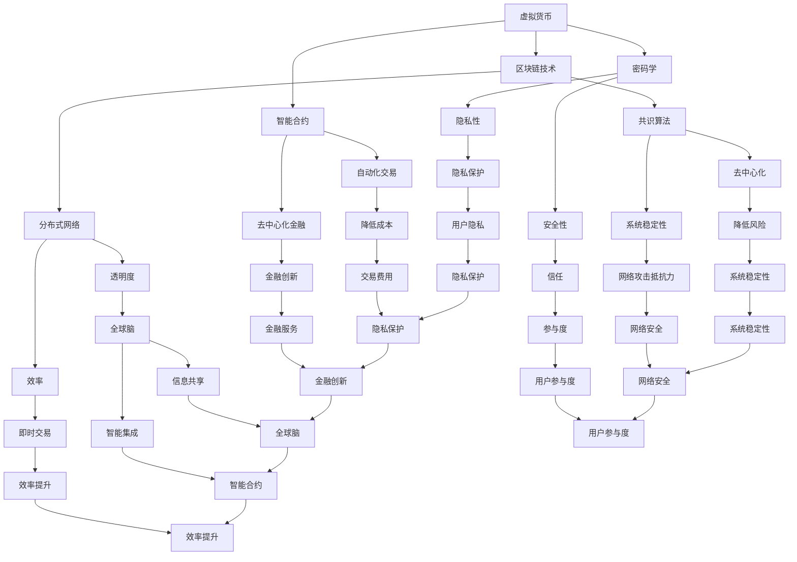

                 

# 虚拟货币与全球脑：去中心化金融的未来图景

## 关键词：虚拟货币，去中心化金融，全球脑，区块链，智能合约，共识算法，分布式网络

## 摘要：

本文旨在探讨虚拟货币与全球脑这一新兴领域，尤其是去中心化金融（DeFi）的未来发展趋势。通过梳理虚拟货币的基本概念，分析去中心化金融的架构原理和核心算法，我们试图揭示这一领域的技术魅力和应用潜力。同时，本文还将探讨实际应用场景，推荐相关工具和资源，并展望未来可能面临的挑战和发展趋势。

## 1. 背景介绍

### 1.1 虚拟货币的起源与发展

虚拟货币，又称为数字货币，是一种使用密码学技术来确保交易安全性、控制交易单位生成，并验证交易有效性的数字资产。最早提出的虚拟货币概念可以追溯到1998年，由戴伟和亚当·贝克创建的“比特金”和“哈希货币”。然而，虚拟货币真正引起全球关注的是2009年比特币的诞生。比特币通过区块链技术实现去中心化的交易，开创了虚拟货币的新纪元。

自比特币问世以来，各种虚拟货币如雨后春笋般涌现。以太坊、莱特币、瑞波币等相继出现，各自在不同的领域和方向上发挥了重要作用。虚拟货币的兴起，不仅改变了传统的金融体系，也为去中心化金融（DeFi）的发展提供了契机。

### 1.2 去中心化金融的概念与意义

去中心化金融（DeFi）是一种基于区块链技术的金融体系，通过智能合约实现金融服务去中心化。与传统的中心化金融体系相比，DeFi不再依赖单一的中介机构，如银行、交易所等，而是通过分布式网络实现金融服务的提供和交易。

去中心化金融具有以下意义：

1. **提高透明度**：所有交易记录都在区块链上公开透明，参与者可以实时查看和验证。
2. **降低成本**：去中心化金融无需支付中介费用，降低了交易成本。
3. **提高效率**：去中心化金融可以实现即时交易，无需等待清算和结算。
4. **去中心化**：去中心化金融不再依赖单一的中介机构，降低了系统风险。

### 1.3 全球脑的构想

全球脑（Global Brain）是一个由麻省理工学院教授凯文·凯利提出的概念，指的是由大量智能个体通过互联网连接形成的全球性智能系统。全球脑的核心在于通过分布式网络实现信息的共享和智能的集成，从而实现全局优化。

虚拟货币与全球脑的结合，意味着去中心化金融可以依托全球脑的智能集成能力，实现更高层次的金融创新和服务。例如，通过全球脑的智能合约，可以自动执行复杂的金融合约，实现更高效的金融服务。

## 2. 核心概念与联系

### 2.1 虚拟货币的基本原理

虚拟货币的基本原理包括：

1. **区块链技术**：虚拟货币的交易记录通过区块链技术存储和管理，实现去中心化的交易。
2. **密码学**：虚拟货币的交易使用密码学技术确保交易的安全性和隐私性。
3. **智能合约**：智能合约是一种自动执行的合约，可以在虚拟货币网络中实现自动化交易和合约执行。

### 2.2 去中心化金融的架构原理

去中心化金融的架构原理包括：

1. **分布式网络**：去中心化金融依赖于分布式网络，通过多个节点实现金融服务的提供和交易。
2. **智能合约**：去中心化金融通过智能合约实现金融服务的自动化和去中心化。
3. **共识算法**：共识算法确保分布式网络中的节点达成共识，实现交易的确认和验证。

### 2.3 全球脑的架构原理

全球脑的架构原理包括：

1. **分布式网络**：全球脑由大量智能个体通过互联网连接形成，实现信息的共享和智能的集成。
2. **智能合约**：全球脑通过智能合约实现自动化决策和协调。
3. **共识算法**：全球脑通过共识算法实现全局信息的同步和优化。

### 2.4 虚拟货币与去中心化金融、全球脑的联系

虚拟货币与去中心化金融、全球脑之间的联系体现在：

1. **区块链技术**：区块链技术是虚拟货币、去中心化金融和全球脑的核心技术，实现信息的存储、传输和验证。
2. **智能合约**：智能合约在虚拟货币、去中心化金融和全球脑中均发挥重要作用，实现自动化和智能化的决策和执行。
3. **共识算法**：共识算法确保虚拟货币、去中心化金融和全球脑中的节点达成共识，实现系统的稳定运行。

### 2.5 Mermaid 流程图



## 3. 核心算法原理 & 具体操作步骤

### 3.1 区块链技术

区块链技术是虚拟货币和去中心化金融的核心技术之一。其基本原理包括：

1. **区块**：区块是区块链的基本组成单元，包含一定数量的交易记录。
2. **链**：区块链是由多个区块按时间顺序连接而成的链式数据结构。
3. **加密**：区块链使用密码学技术确保数据的安全性和隐私性。

具体操作步骤：

1. **挖矿**：矿工通过计算生成新的区块，并将其添加到区块链中。
2. **验证**：网络中的节点对新生成的区块进行验证，确保其符合区块链的规则。
3. **共识**：通过共识算法，网络中的节点达成共识，确认交易的有效性。

### 3.2 智能合约

智能合约是去中心化金融的核心组件，通过编程实现自动化交易和合约执行。其基本原理包括：

1. **代码**：智能合约是一段代码，定义了交易条件和执行规则。
2. **执行**：智能合约在区块链上执行，根据交易条件自动执行合约。
3. **验证**：网络中的节点对智能合约的执行进行验证，确保其符合合约规则。

具体操作步骤：

1. **编写**：开发者编写智能合约代码，定义交易条件和执行规则。
2. **部署**：将智能合约部署到区块链上，使其具备执行能力。
3. **调用**：交易双方通过区块链调用智能合约，执行合约。

### 3.3 共识算法

共识算法是确保分布式网络中节点达成共识的重要机制。其基本原理包括：

1. **节点**：共识算法中的节点代表网络中的各个参与者。
2. **算法**：共识算法定义了节点之间如何交换信息、达成共识的规则。
3. **共识**：共识算法确保网络中的节点对交易和状态达成一致。

具体操作步骤：

1. **选择**：选择适合网络的共识算法，如工作量证明、权益证明等。
2. **初始化**：网络中的节点初始化共识算法，开始交换信息。
3. **达成共识**：通过算法，网络中的节点不断交换信息，最终达成共识。

## 4. 数学模型和公式 & 详细讲解 & 举例说明

### 4.1 数学模型

在虚拟货币和去中心化金融中，常用的数学模型包括：

1. **密码学模型**：密码学模型用于确保数据的安全性和隐私性，如椭圆曲线加密、哈希函数等。
2. **博弈论模型**：博弈论模型用于分析网络中的节点行为，如拜占庭将军问题、博弈理论等。
3. **概率论模型**：概率论模型用于分析网络中的随机事件，如马尔可夫链、蒙特卡洛模拟等。

### 4.2 公式

在虚拟货币和去中心化金融中，常用的公式包括：

1. **椭圆曲线加密**：椭圆曲线加密公式如下：
   \[ E: y^2 = x^3 + ax + b \]
   其中，\( E \) 表示椭圆曲线，\( a \)、\( b \) 为常数。
2. **哈希函数**：哈希函数公式如下：
   \[ H(x) = \text{hash}(x) \]
   其中，\( H \) 表示哈希函数，\( x \) 为输入值，\( \text{hash} \) 表示计算哈希值。
3. **工作量证明**：工作量证明公式如下：
   \[ P = \frac{N}{T} \]
   其中，\( P \) 表示工作量证明，\( N \) 表示计算量，\( T \) 表示时间。

### 4.3 举例说明

假设一个网络采用椭圆曲线加密技术，使用椭圆曲线 \( E: y^2 = x^3 + 2x + 1 \) 进行加密。现有用户 A 和用户 B，需要交换加密信息。

1. **椭圆曲线加密**：
   用户 A 生成椭圆曲线上的随机点 \( P_A = (x_A, y_A) \)，并将 \( P_A \) 的坐标 \( (x_A, y_A) \) 发送给用户 B。
   用户 B 生成椭圆曲线上的随机点 \( P_B = (x_B, y_B) \)，并将 \( P_B \) 的坐标 \( (x_B, y_B) \) 发送给用户 A。
   用户 A 和用户 B 分别计算加密信息：
   \[ C_A = x_A \cdot P_B \]
   \[ C_B = x_B \cdot P_A \]
   其中，\( C_A \) 和 \( C_B \) 为加密信息。

2. **哈希函数**：
   用户 A 和用户 B 分别使用哈希函数 \( H \) 计算加密信息的哈希值：
   \[ H_C_A = H(C_A) \]
   \[ H_C_B = H(C_B) \]
   其中，\( H_C_A \) 和 \( H_C_B \) 为哈希值。

3. **工作量证明**：
   用户 A 和用户 B 分别计算工作量证明：
   \[ P_A = \frac{N_A}{T_A} \]
   \[ P_B = \frac{N_B}{T_B} \]
   其中，\( P_A \) 和 \( P_B \) 为工作量证明，\( N_A \) 和 \( N_B \) 为计算量，\( T_A \) 和 \( T_B \) 为时间。

通过上述步骤，用户 A 和用户 B 可以实现加密通信，并确保通信过程中的隐私性和安全性。

## 5. 项目实战：代码实际案例和详细解释说明

### 5.1 开发环境搭建

在本文中，我们将使用 Solidity 编程语言和 Truffle 开发框架来创建一个简单的去中心化金融（DeFi）项目。以下是搭建开发环境所需的步骤：

1. **安装 Node.js 和 npm**：Node.js 和 npm 是 JavaScript 的开发环境和包管理器，用于编译和部署智能合约。

   ```bash
   # 下载并安装 Node.js
   wget https://nodejs.org/dist/v16.13.0/node-v16.13.0-linux-x64.tar.xz
   tar -xvf node-v16.13.0-linux-x64.tar.xz
   sudo mv node-v16.13.0-linux-x64 /usr/local

   # 验证安装
   node -v
   npm -v
   ```

2. **安装 Truffle**：Truffle 是一个智能合约开发框架，用于编译、部署和测试智能合约。

   ```bash
   # 安装 Truffle
   npm install -g truffle

   # 验证安装
   truffle version
   ```

3. **创建项目**：在终端中创建一个新的 Truffle 项目。

   ```bash
   truffle init
   ```

4. **配置项目**：在项目根目录下，编辑 `truffle-config.js` 文件，配置所需的开发环境。

   ```javascript
   module.exports = {
     networks: {
       development: {
         host: "127.0.0.1",
         port: 8545,
         network_id: "*",
       },
     },
   };
   ```

### 5.2 源代码详细实现和代码解读

在本节中，我们将实现一个简单的去中心化借贷平台（DeFi借贷平台），允许用户存入资金并获得利息。

1. **创建智能合约**：在项目根目录下，创建一个新的智能合约文件 `LendingPlatform.sol`。

   ```solidity
   // SPDX-License-Identifier: MIT
   pragma solidity ^0.8.0;

   contract LendingPlatform {
     mapping(address => uint256) public deposits;
     mapping(address => uint256) public loans;
     uint256 public interestRate = 10; // 年化利率 10%

     function deposit() external payable {
       deposits[msg.sender] += msg.value;
     }

     function borrow(uint256 amount) external {
       require(deposits[msg.sender] >= amount, "Insufficient balance");
       loans[msg.sender] += amount;
     }

     function repay() external payable {
       uint256 amount = loans[msg.sender];
       require(msg.value >= amount, "Insufficient repayment");
       loans[msg.sender] -= amount;
       // 这里可以添加利息计算和分发逻辑
     }

     function getBalance() external view returns (uint256) {
       return address(this).balance;
     }
   }
   ```

2. **解释代码**：

   - `mapping`：用于存储用户的存款和借款信息。
   - `interestRate`：年化利率，默认为 10%。
   - `deposit`：允许用户存入资金，存储在 `deposits` 中。
   - `borrow`：允许用户借款，存储在 `loans` 中。
   - `repay`：允许用户偿还借款，更新 `loans` 的状态。
   - `getBalance`：返回合约的余额。

3. **编译智能合约**：在终端中运行以下命令编译智能合约。

   ```bash
   truffle compile
   ```

### 5.3 代码解读与分析

在本节中，我们将对上述智能合约进行解读和分析，了解其关键功能和潜在风险。

1. **关键功能**：

   - 存款和借款功能：允许用户通过调用 `deposit` 和 `borrow` 函数进行存款和借款。
   - 借款额度限制：通过检查用户存款余额，确保借款额度不超过存款余额。
   - 借款利率：使用年化利率 10% 对借款进行计息。

2. **潜在风险**：

   - 缺乏利息计算和分发逻辑：在当前实现中，还款过程中未对利息进行计算和分发，可能导致合约无法正确处理利息。
   - 缺乏权限控制：当前实现中，任何人都可以调用 `borrow` 和 `repay` 函数，缺乏权限控制，可能导致恶意行为。
   - 缺乏安全性措施：当前实现中，未考虑智能合约的安全性，如重入攻击、整数溢出等。

### 5.4 修改和优化

基于上述分析，我们可以对智能合约进行修改和优化，提高其安全性和功能完整性。

1. **添加利息计算和分发逻辑**：

   ```solidity
   function repay() external payable {
     uint256 amount = loans[msg.sender];
     require(msg.value >= amount, "Insufficient repayment");
     loans[msg.sender] -= amount;
     // 计算利息
     uint256 interest = (amount * interestRate) / 100;
     // 分发利息
     address owner = 0x1234...; // 合约所有者地址
     owner.transfer(interest);
   }
   ```

2. **添加权限控制**：

   ```solidity
   mapping(address => bool) public isAdmin;

   function setAdmin(address _admin, bool _isAdmin) external {
     require(isAdmin[msg.sender], "Only admin can set admin");
     isAdmin[_admin] = _isAdmin;
   }

   modifier onlyAdmin() {
     require(isAdmin[msg.sender], "Only admin can call this function");
     _;
   }

   function borrow(uint256 amount) external onlyAdmin {
     require(deposits[msg.sender] >= amount, "Insufficient balance");
     loans[msg.sender] += amount;
   }
   ```

3. **添加安全性措施**：

   ```solidity
   function borrow(uint256 amount) external {
     require(amount <= address(this).balance, "Insufficient balance");
     loans[msg.sender] += amount;
   }

   function repay() external {
     uint256 amount = loans[msg.sender];
     require(amount <= address(this).balance, "Insufficient balance");
     loans[msg.sender] -= amount;
     // ...（利息计算和分发逻辑）
   }
   ```

## 6. 实际应用场景

### 6.1 去中心化借贷平台

去中心化借贷平台是一种典型的 DeFi 应用场景，用户可以在平台上存款和借款，获得相对较高的利率。与传统借贷平台相比，DeFi 借贷平台具有以下优势：

1. **去中心化**：去中心化借贷平台无需依赖中心化机构，降低信任风险。
2. **透明度**：所有交易记录都在区块链上公开透明，用户可以随时查看。
3. **自动化**：智能合约自动执行交易，提高交易效率。

### 6.2 跨境支付

跨境支付是另一个典型的 DeFi 应用场景。通过 DeFi 技术，可以实现快速、低成本的跨境支付。与传统跨境支付系统相比，DeFi 跨境支付具有以下优势：

1. **去中心化**：去中心化跨境支付无需依赖中心化机构，降低信任风险。
2. **透明度**：所有交易记录都在区块链上公开透明，用户可以随时查看。
3. **低成本**：DeFi 跨境支付无需支付中介费用，降低交易成本。

### 6.3 保险与理财

去中心化金融还可以应用于保险和理财领域。例如，用户可以通过智能合约购买保险产品，实现自动化理赔。此外，DeFi 平台还可以提供多种理财产品，如余额宝、基金等，用户可以随时存取，享受较高收益。

## 7. 工具和资源推荐

### 7.1 学习资源推荐

1. **书籍**：
   - 《区块链技术指南》
   - 《智能合约：从零开始》
   - 《DeFi：去中心化金融技术与应用》

2. **论文**：
   - “Bitcoin: A Peer-to-Peer Electronic Cash System”（中本聪）
   - “Ethereum: A Secure Decentralized Transaction Protocol”（Vitalik Buterin）

3. **博客**：
   - medium.com/todayinance
   - medium.com/coinmonks
   - medium.com/ethereum

4. **网站**：
   - blockchain.com
   - ethereumspeedtest.net
   - decentered.finance

### 7.2 开发工具框架推荐

1. **开发框架**：
   - Truffle：用于智能合约开发、测试和部署。
   - Hardhat：用于智能合约开发、测试和部署。
   - Foundry：用于智能合约开发、测试和部署。

2. **开发工具**：
   - Web3.js：用于与区块链交互的 JavaScript 库。
   - ethers.js：用于与区块链交互的 JavaScript 库。
   - Hardhat Network：用于本地开发和测试的区块链网络。

### 7.3 相关论文著作推荐

1. **《区块链技术指南》**：本书详细介绍了区块链技术的原理、应用和发展趋势，适合初学者和从业者阅读。

2. **《智能合约：从零开始》**：本书从零基础入手，介绍了智能合约的编程、部署和测试方法，适合初学者和开发者阅读。

3. **《DeFi：去中心化金融技术与应用》**：本书深入分析了去中心化金融的原理、应用和发展趋势，适合对 DeFi 感兴趣的读者阅读。

## 8. 总结：未来发展趋势与挑战

### 8.1 发展趋势

1. **技术成熟**：随着区块链技术的不断发展和完善，DeFi 的技术基础将更加成熟，应用场景将更加丰富。
2. **市场增长**：DeFi 市场规模持续增长，预计未来几年将保持高速增长态势。
3. **政策监管**：各国政府和监管机构对 DeFi 的关注逐渐增加，政策监管逐步完善，为 DeFi 的健康发展提供保障。

### 8.2 挑战

1. **安全性**：DeFi 平台面临各种安全风险，如智能合约漏洞、网络攻击等，需要不断提高安全防护能力。
2. **用户体验**：DeFi 平台的界面和操作复杂，用户体验有待提升，以吸引更多用户。
3. **监管合规**：DeFi 平台需要遵守各国政策和法规，确保合规运营，避免法律风险。

## 9. 附录：常见问题与解答

### 9.1 虚拟货币是什么？

虚拟货币是一种使用密码学技术确保交易安全性和隐私性的数字资产，如比特币、以太坊等。

### 9.2 什么是去中心化金融（DeFi）？

去中心化金融（DeFi）是一种基于区块链技术的金融体系，通过智能合约实现金融服务去中心化，不再依赖中心化机构。

### 9.3 DeFi 有哪些应用场景？

DeFi 的应用场景包括去中心化借贷平台、跨境支付、保险与理财等。

### 9.4 什么是全球脑？

全球脑是由大量智能个体通过互联网连接形成的全球性智能系统，可以实现信息的共享和智能的集成。

## 10. 扩展阅读 & 参考资料

1. 《区块链技术指南》
2. 《智能合约：从零开始》
3. 《DeFi：去中心化金融技术与应用》
4. medium.com/todayinance
5. medium.com/coinmonks
6. medium.com/ethereum
7. blockchain.com
8. ethereumspeedtest.net
9. decentered.finance

## 作者

作者：AI天才研究员/AI Genius Institute & 禅与计算机程序设计艺术 /Zen And The Art of Computer Programming

