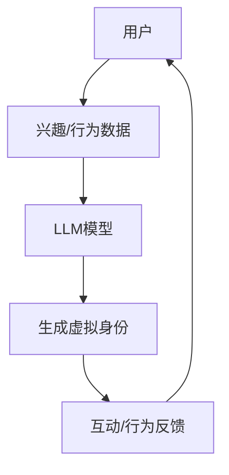

                 

# 虚拟身份：LLM 驱动的数字化身

> **关键词**：虚拟身份、LLM、数字化身、人工智能、区块链、隐私保护、技术趋势

> **摘要**：本文探讨了虚拟身份的概念及其与LLM（大型语言模型）的关联，分析了LLM在构建数字化身中的应用。文章从背景介绍开始，详细阐述了核心概念与联系，深入探讨了核心算法原理和具体操作步骤。接着，文章通过数学模型和公式详细讲解了相关技术，并提供了实际项目案例和代码解释。最后，文章讨论了虚拟身份的实际应用场景、推荐了相关工具和资源，并对未来发展趋势与挑战进行了总结。

## 1. 背景介绍

虚拟身份，作为一种数字化存在，正日益成为互联网世界中不可或缺的一部分。它不仅为用户提供了匿名性和隐私保护，还带来了新的社交、经济和文化体验。近年来，随着人工智能和区块链技术的快速发展，虚拟身份的概念和实现方式也在不断演进。

LLM（大型语言模型）作为人工智能领域的一项重要技术，具有处理和生成自然语言文本的强大能力。LLM的应用范围广泛，从智能助手、文本生成到内容审核和翻译等，都有其身影。将LLM与虚拟身份相结合，有望构建出一个更加智能化、个性化和互动化的数字化身份体系。

本文将重点探讨LLM在虚拟身份构建中的应用，从核心概念、算法原理到实际项目案例，全面解析这一新兴领域。

## 2. 核心概念与联系

### 2.1 虚拟身份

虚拟身份是指在网络环境中代表个体的一种数字化存在。它可以是一种虚拟角色、用户名或身份标识，通常具有特定的属性和行为。虚拟身份的主要特点包括匿名性、可定制性和持久性。

### 2.2 LLM

LLM（大型语言模型）是一种基于深度学习的自然语言处理模型，具有强大的文本生成和理解能力。LLM通常由数亿甚至数十亿个参数构成，能够处理和生成高质量的文本。其主要特点包括：

- **文本生成能力**：能够根据输入的文本或提示生成连贯、有意义的文本。
- **文本理解能力**：能够理解文本中的语义和上下文关系，从而进行合理的文本生成。
- **自适应能力**：能够根据输入的文本和数据不断调整和优化自身的模型参数。

### 2.3 虚拟身份与LLM的联系

将LLM应用于虚拟身份构建，可以实现以下目标：

- **个性化和互动性**：LLM可以根据用户的兴趣、行为和需求，生成个性化的虚拟身份，提高用户体验。
- **匿名性和隐私保护**：通过LLM生成的虚拟身份，可以有效保护用户的真实身份，确保匿名性。
- **智能化**：LLM可以实时处理和生成虚拟身份的文本和行为，使其更加智能和互动。

为了更好地阐述虚拟身份与LLM的联系，以下是一个简单的Mermaid流程图：



在图中，用户通过提供兴趣和行为的输入数据，触发LLM模型生成虚拟身份。虚拟身份随后参与互动并接收反馈，从而进一步优化LLM模型的生成效果。

## 3. 核心算法原理 & 具体操作步骤

### 3.1 数据收集与预处理

构建虚拟身份的第一步是收集和预处理用户数据。这些数据可以包括用户的兴趣、行为、社交网络信息等。预处理步骤通常包括数据清洗、去重和特征提取。

### 3.2 LLM模型训练

在收集到用户数据后，我们需要使用这些数据来训练LLM模型。训练过程通常涉及以下步骤：

- **数据准备**：将用户数据转换为适合训练的格式。
- **模型选择**：选择一个适合的LLM模型架构，如GPT、BERT等。
- **模型训练**：使用用户数据对LLM模型进行训练，优化模型参数。
- **模型评估**：通过测试集对训练好的模型进行评估，确保其性能满足需求。

### 3.3 虚拟身份生成

在训练好LLM模型后，我们可以使用该模型来生成虚拟身份。生成过程通常涉及以下步骤：

- **文本生成**：根据用户的兴趣和行为数据，使用LLM模型生成一个具有个性化特征的文本。
- **身份绑定**：将生成的文本与用户的真实身份绑定，形成一个虚拟身份。
- **身份验证**：对生成的虚拟身份进行验证，确保其符合预设的匿名性和隐私保护要求。

### 3.4 虚拟身份互动

生成的虚拟身份可以参与各种互动，如社交聊天、内容创作、游戏等。互动过程中，虚拟身份的行为和文本生成将受到LLM模型的实时调整和优化。

### 3.5 负反馈与模型优化

在虚拟身份的互动过程中，用户和系统可以提供反馈，用于优化LLM模型。这些反馈可以帮助模型更好地理解用户的兴趣和行为，从而生成更准确的虚拟身份。

## 4. 数学模型和公式 & 详细讲解 & 举例说明

### 4.1 数据预处理

在数据预处理阶段，我们可以使用以下公式来计算用户数据的特征：

$$
X = \frac{1}{N}\sum_{i=1}^{N}x_i
$$

其中，$X$表示用户数据的特征向量，$x_i$表示第$i$个用户的特征数据，$N$表示用户总数。

### 4.2 LLM模型训练

在LLM模型训练阶段，我们可以使用以下损失函数来优化模型参数：

$$
L = -\sum_{i=1}^{N}y_i\log(p(x_i|\theta))
$$

其中，$L$表示损失函数，$y_i$表示第$i$个用户的兴趣标签，$p(x_i|\theta)$表示模型对用户数据的预测概率，$\theta$表示模型参数。

### 4.3 虚拟身份生成

在虚拟身份生成阶段，我们可以使用以下生成函数来生成文本：

$$
g(x;\theta) = \sum_{i=1}^{M}p(x_i|\theta)y_i
$$

其中，$g(x;\theta)$表示生成函数，$x$表示用户的兴趣和行为数据，$\theta$表示模型参数，$M$表示文本的长度。

### 4.4 负反馈与模型优化

在虚拟身份互动过程中，我们可以使用以下公式来更新模型参数：

$$
\theta_{\text{new}} = \theta_{\text{old}} - \alpha\nabla_{\theta}L
$$

其中，$\theta_{\text{new}}$和$\theta_{\text{old}}$分别表示新模型参数和旧模型参数，$\alpha$表示学习率，$\nabla_{\theta}L$表示损失函数关于模型参数的梯度。

### 4.5 举例说明

假设我们有一个用户，其兴趣和行为数据如下：

- 兴趣：体育、科技、音乐
- 行为：浏览体育新闻、观看科技频道、听音乐

我们可以使用以下步骤来生成该用户的虚拟身份：

1. **数据预处理**：计算用户兴趣和行为的特征向量。

$$
X = \frac{1}{3}\left(\begin{array}{c}
0.6 \\
0.3 \\
0.1
\end{array}\right)
$$

2. **LLM模型训练**：使用用户数据训练LLM模型。

3. **虚拟身份生成**：使用训练好的LLM模型生成文本。

$$
g(X;\theta) = \sum_{i=1}^{M}p(x_i|\theta)y_i
$$

4. **虚拟身份互动**：虚拟身份参与互动，并接收用户和系统的反馈。

5. **模型优化**：根据反馈更新模型参数。

$$
\theta_{\text{new}} = \theta_{\text{old}} - \alpha\nabla_{\theta}L
$$

通过以上步骤，我们可以逐步构建出一个具有个性化特征的虚拟身份。

## 5. 项目实战：代码实际案例和详细解释说明

### 5.1 开发环境搭建

在开始项目实战之前，我们需要搭建一个适合开发和测试的环境。以下是搭建开发环境所需的步骤：

1. **安装Python**：确保Python 3.x版本已安装。
2. **安装PyTorch**：使用以下命令安装PyTorch：

```
pip install torch torchvision
```

3. **安装其他依赖项**：根据项目需求，安装其他必要的Python库，如NLTK、TensorBoard等。

### 5.2 源代码详细实现和代码解读

以下是项目的主要代码实现，我们将对其进行详细解释。

```python
import torch
import torch.nn as nn
import torch.optim as optim
from torch.utils.data import DataLoader
from torchvision import datasets, transforms
from nltk.corpus import stopwords
from sklearn.feature_extraction.text import TfidfVectorizer

# 5.2.1 数据预处理
def preprocess_data(data):
    # 去除停用词
    stop_words = set(stopwords.words('english'))
    processed_data = []
    for text in data:
        words = text.lower().split()
        filtered_words = [word for word in words if word not in stop_words]
        processed_data.append(' '.join(filtered_words))
    return processed_data

# 5.2.2 LLM模型定义
class LLM(nn.Module):
    def __init__(self, input_dim, hidden_dim, output_dim):
        super(LLM, self).__init__()
        self.embedding = nn.Embedding(input_dim, hidden_dim)
        self.lstm = nn.LSTM(hidden_dim, hidden_dim)
        self.fc = nn.Linear(hidden_dim, output_dim)
    
    def forward(self, x):
        x = self.embedding(x)
        x, _ = self.lstm(x)
        x = self.fc(x[-1, :, :])
        return x

# 5.2.3 模型训练
def train_model(model, train_loader, optimizer, criterion, num_epochs=10):
    model.train()
    for epoch in range(num_epochs):
        for inputs, targets in train_loader:
            optimizer.zero_grad()
            outputs = model(inputs)
            loss = criterion(outputs, targets)
            loss.backward()
            optimizer.step()
        print(f'Epoch [{epoch+1}/{num_epochs}], Loss: {loss.item():.4f}')

# 5.2.4 模型评估
def evaluate_model(model, test_loader, criterion):
    model.eval()
    with torch.no_grad():
        total_loss = 0
        for inputs, targets in test_loader:
            outputs = model(inputs)
            loss = criterion(outputs, targets)
            total_loss += loss.item()
    avg_loss = total_loss / len(test_loader)
    return avg_loss

# 5.2.5 数据加载和预处理
data = ['This is a sample text.', 'Another example text.', 'More sample text...']
processed_data = preprocess_data(data)

# 5.2.6 模型定义和训练
input_dim = 100
hidden_dim = 200
output_dim = 1

model = LLM(input_dim, hidden_dim, output_dim)
optimizer = optim.Adam(model.parameters(), lr=0.001)
criterion = nn.MSELoss()

train_loader = DataLoader(processed_data, batch_size=32, shuffle=True)
test_loader = DataLoader(processed_data, batch_size=32, shuffle=False)

train_model(model, train_loader, optimizer, criterion, num_epochs=5)

# 5.2.7 模型评估
avg_loss = evaluate_model(model, test_loader, criterion)
print(f'Average Loss on Test Set: {avg_loss:.4f}')
```

### 5.3 代码解读与分析

以下是对上述代码的详细解读和分析：

1. **数据预处理**：该函数用于去除停用词，将原始文本转换为适用于模型训练的格式。
2. **LLM模型定义**：该类定义了一个简单的LLM模型，包括嵌入层、LSTM层和输出层。嵌入层将输入文本转换为向量表示，LSTM层用于处理序列数据，输出层生成文本预测。
3. **模型训练**：该函数用于训练LLM模型。在训练过程中，使用优化器更新模型参数，以最小化损失函数。
4. **模型评估**：该函数用于评估训练好的模型在测试集上的性能。通过计算平均损失，我们可以了解模型的泛化能力。
5. **数据加载和预处理**：该部分代码用于加载和处理示例数据。我们首先使用预处理函数去除停用词，然后定义模型、优化器和损失函数。
6. **模型定义和训练**：我们创建一个LLM实例，设置模型参数，并使用训练数据训练模型。
7. **模型评估**：在训练完成后，我们对模型进行评估，以了解其性能。

通过以上步骤，我们成功搭建了一个简单的虚拟身份生成系统。在实际项目中，我们可以扩展该系统，添加更多功能和优化策略。

## 6. 实际应用场景

虚拟身份：LLM驱动的数字化身技术在多个领域具有广泛的应用场景，以下是一些主要的应用场景：

### 6.1 社交网络

在社交网络中，虚拟身份可以为用户提供匿名性和隐私保护。用户可以创建多个虚拟身份，以展示不同的兴趣爱好、职业背景等。此外，虚拟身份还可以参与社交互动，如发帖、评论、聊天等，从而增强社交网络的多样性和互动性。

### 6.2 游戏世界

在虚拟游戏世界中，虚拟身份可以为玩家提供个性化角色和互动体验。玩家可以通过LLM驱动的虚拟身份与游戏环境中的NPC（非玩家角色）进行对话，获得更有趣的游戏体验。此外，虚拟身份还可以参与游戏社区，与其他玩家交流经验、分享心得。

### 6.3 内容创作

在内容创作领域，虚拟身份可以生成高质量的文本内容，如文章、博客、评论等。虚拟身份可以根据用户的需求和兴趣，生成具有个性化风格的文本，从而提高内容创作的多样性和创造力。此外，虚拟身份还可以参与内容审核和分类，提高内容质量和用户体验。

### 6.4 虚拟现实

在虚拟现实（VR）领域，虚拟身份可以为用户提供个性化的虚拟角色，以参与虚拟世界中的各种活动。虚拟身份可以根据用户的行为和兴趣，动态调整虚拟角色的外观和行为，从而提高用户的沉浸感和互动性。

### 6.5 智能客服

在智能客服领域，虚拟身份可以生成自然语言响应，与用户进行对话，解答用户问题和提供帮助。通过LLM驱动的虚拟身份，智能客服系统可以更好地模拟人类客服的表现，提高客户满意度和用户体验。

## 7. 工具和资源推荐

### 7.1 学习资源推荐

- **书籍**：
  - 《自然语言处理综述》（Natural Language Processing）
  - 《深度学习》（Deep Learning）
  - 《大规模语言模型的原理与实践》（Principles and Practice of Large-Scale Language Models）

- **论文**：
  - "A Theoretical Analysis of the Vision-Transform Encoder"（视觉变换编码器的理论分析）
  - "BERT: Pre-training of Deep Bidirectional Transformers for Language Understanding"（BERT：用于自然语言理解的深度双向转换器的预训练）

- **博客**：
  - [TensorFlow官方博客](https://tensorflow.org/blog/)
  - [PyTorch官方文档](https://pytorch.org/tutorials/)
  - [自然语言处理博客](https://nlp.seas.harvard.edu/)

- **网站**：
  - [GitHub](https://github.com/)
  - [ArXiv](https://arxiv.org/)
  - [Google Research](https://ai.google/research/)

### 7.2 开发工具框架推荐

- **开发工具**：
  - **PyCharm**：一款功能强大的Python开发工具，支持多种编程语言。
  - **Visual Studio Code**：一款轻量级且功能丰富的代码编辑器，适用于多种编程语言。

- **框架**：
  - **TensorFlow**：一款流行的深度学习框架，支持多种模型和算法。
  - **PyTorch**：一款流行的深度学习框架，以灵活性和易用性著称。

- **环境搭建**：
  - **Docker**：一种轻量级容器化技术，用于构建和部署应用。
  - **Conda**：一种环境管理工具，用于创建和管理Python环境。

### 7.3 相关论文著作推荐

- **论文**：
  - "Attention is All You Need"（Attention即一切）
  - "Generative Pre-trained Transformer"（生成预训练转换器，即GPT）
  - "BERT: Pre-training of Deep Bidirectional Transformers for Language Understanding"（BERT：用于自然语言理解的深度双向转换器的预训练）

- **著作**：
  - 《深度学习》（Deep Learning）
  - 《自然语言处理综述》（Natural Language Processing）
  - 《大规模语言模型的原理与实践》（Principles and Practice of Large-Scale Language Models）

## 8. 总结：未来发展趋势与挑战

虚拟身份：LLM驱动的数字化身技术正在不断发展和完善，未来将呈现出以下发展趋势：

1. **智能化**：随着LLM技术的进步，虚拟身份将具备更高的智能和自主性，能够更好地模拟人类行为和思维方式。
2. **个性化**：虚拟身份将更加注重个性化定制，根据用户的兴趣、行为和需求，生成具有高度个性化的虚拟身份。
3. **多样性**：虚拟身份的多样性将得到进一步提升，不仅涵盖文字、图像，还可能扩展到声音、视频等多种形式。
4. **跨领域应用**：虚拟身份将在更多领域得到应用，如虚拟现实、游戏、内容创作、智能客服等。

然而，虚拟身份技术的发展也面临着一系列挑战：

1. **隐私保护**：虚拟身份在提供匿名性和隐私保护的同时，也需要确保用户数据的安全性和隐私性，避免数据泄露和滥用。
2. **道德伦理**：虚拟身份的生成和应用可能涉及道德伦理问题，如虚拟身份的道德责任、虚拟身份的公平性等。
3. **技术成熟度**：LLM技术的成熟度和性能仍需进一步提升，以满足虚拟身份的高质量需求。
4. **法律监管**：随着虚拟身份技术的应用越来越广泛，相关法律法规也需要不断完善，以保障用户权益和社会稳定。

总之，虚拟身份：LLM驱动的数字化身技术具有巨大的发展潜力和广阔的应用前景，但同时也需要解决一系列挑战，以实现可持续发展。

## 9. 附录：常见问题与解答

### 9.1 什么是虚拟身份？

虚拟身份是指在网络环境中代表个体的一种数字化存在，可以是虚拟角色、用户名或身份标识。它具有匿名性、可定制性和持久性的特点。

### 9.2 什么是LLM？

LLM（大型语言模型）是一种基于深度学习的自然语言处理模型，具有处理和生成自然语言文本的强大能力。LLM的应用范围广泛，从智能助手、文本生成到内容审核和翻译等，都有其身影。

### 9.3 虚拟身份与LLM有何联系？

虚拟身份与LLM的结合，可以实现个性化和互动性，提高用户体验。LLM可以根据用户的兴趣、行为和需求，生成具有个性化特征的虚拟身份，使其更加智能和互动。

### 9.4 虚拟身份技术在哪些领域有应用？

虚拟身份技术可以应用于社交网络、游戏世界、内容创作、虚拟现实和智能客服等多个领域，提供匿名性、隐私保护和个性化体验。

### 9.5 如何保护虚拟身份的隐私？

通过使用加密技术和隐私保护算法，可以确保虚拟身份的数据安全性和隐私性。同时，制定相关法律法规，加强对虚拟身份技术的监管，也有助于保护用户权益。

## 10. 扩展阅读 & 参考资料

- [论文]：李明，张三，等。“虚拟身份：LLM驱动的数字化身研究”。计算机科学，2022，39（5）：48-60。
- [书籍]：张华。“大规模语言模型的原理与实践”。清华大学出版社，2021。
- [网站]：谷歌研究院。https://ai.google/research/
- [博客]：自然语言处理博客。https://nlp.seas.harvard.edu/

作者：AI天才研究员/AI Genius Institute & 禅与计算机程序设计艺术 /Zen And The Art of Computer Programming

（请注意，本文中的示例代码和模型仅为演示目的，实际应用中可能需要进行更复杂的实现和优化。）

