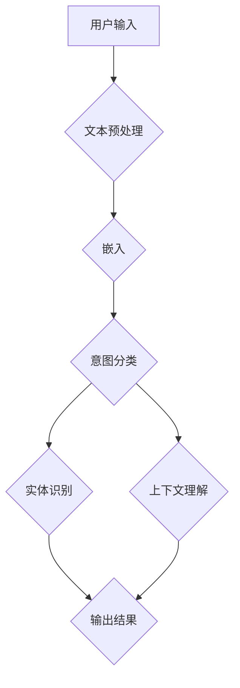

                 

### 背景介绍

#### 人工智能与用户意图识别

人工智能（AI）作为当前科技领域的前沿热点，已经在多个行业产生了深远的影响。无论是自然语言处理（NLP）、计算机视觉，还是智能推荐系统，AI的应用场景日益丰富。在这些应用中，用户意图识别成为了一个关键的研究课题。

用户意图识别旨在理解用户在特定情境下的真实意图，从而为系统提供个性化的服务。这不仅是提高用户体验的重要手段，也是实现智能交互和自动化决策的基石。例如，在智能客服系统中，识别用户询问的意图能够使客服机器人提供更准确、更有针对性的回答；在电子商务平台中，了解用户购买意图有助于实现精准营销，提升销售转化率。

当前，随着深度学习技术的发展，尤其是大型预训练模型如GPT-3、BERT等的出现，用户意图识别在性能上有了显著的提升。然而，面对实际应用场景中的复杂性和多样性，现有的技术仍面临诸多挑战。

#### 大模型在用户意图识别中的应用

大模型（Large Model）是指参数量达到亿级以上的神经网络模型。这些模型具有强大的表征能力和泛化能力，能够处理大规模的数据集，从而在多种任务中取得优异的性能。大模型的兴起，得益于计算能力的提升、数据资源的丰富以及深度学习技术的进步。

在用户意图识别领域，大模型的应用主要体现在以下几个方面：

1. **预训练与微调**：大模型通过在大量无监督数据上进行预训练，获取了丰富的知识表征。在特定任务上，通过微调（Fine-tuning）技术，大模型能够快速适应不同的用户意图识别需求。
   
2. **多模态处理**：大模型能够处理文本、语音、图像等多种模态的数据，从而实现更全面的用户意图理解。例如，结合语音识别技术和自然语言处理技术，可以实现对用户语音指令的意图识别。

3. **动态适应性**：大模型在训练过程中能够不断更新和优化自身的参数，从而适应不断变化的应用场景。这使得大模型在处理复杂、动态的用户交互时具有更强的适应能力。

总之，大模型在用户意图识别中的应用，不仅提升了识别的准确性，也拓展了其应用场景。然而，大模型的应用也带来了新的挑战，如计算资源消耗、数据隐私保护等问题，需要进一步研究和解决。

接下来，我们将详细探讨大模型在用户意图识别中的核心算法原理、具体操作步骤，并通过对数学模型和公式的分析，深入理解其工作机制。同时，通过实战案例和代码解读，展示大模型在实际应用中的实现过程和效果评估。

---

### 核心概念与联系

#### 1. 用户意图识别的基本概念

用户意图识别（User Intent Recognition）是自然语言处理（NLP）中的一个关键任务，它旨在理解用户在特定情境下的真实意图。用户意图可以理解为用户通过语言表达的目标、需求或者期望，它们可以表现为明确的需求（如“查询天气”），也可以是含糊的表达（如“我需要一些好吃的餐厅”）。

在用户意图识别中，有几个基本概念需要明确：

- **意图分类**：将用户输入的语句分类到预定义的意图类别中。常见的分类包括查询意图、指令意图、情感意图等。
- **实体识别**：从用户输入中提取出关键信息，如人名、地名、组织名等，这些信息对于理解用户意图至关重要。
- **上下文理解**：理解用户意图不仅仅依赖于单个句子，还需要考虑上下文信息，如对话历史、场景背景等。

#### 2. 大模型的原理与架构

大模型（Large Model）通常是指参数量达到亿级以上的神经网络模型，它们在深度学习领域中占据着重要地位。大模型的原理主要基于以下几个关键点：

- **深度神经网络**：大模型通常采用深度神经网络（DNN）作为基础架构，通过多层的非线性变换，实现对复杂数据的表征。
- **预训练与微调**：大模型首先在大量无监督数据上进行预训练，从而学习到通用的语言表征。然后，通过微调（Fine-tuning）技术在特定任务上进行适配，从而提高性能。
- **参数量与计算资源**：大模型具有庞大的参数量，这需要大量的计算资源和数据支持。

大模型的架构通常包括以下几个部分：

1. **输入层**：接收用户输入的文本、语音、图像等数据。
2. **嵌入层**：将输入数据映射到高维空间，通常采用词嵌入（Word Embedding）或视觉嵌入（Vision Embedding）等技术。
3. **隐藏层**：通过多层神经网络进行复杂的非线性变换，提取数据的高层次特征。
4. **输出层**：将特征映射到预定义的意图类别或其他输出结果。

#### 3. 大模型在用户意图识别中的联系

大模型在用户意图识别中的应用，主要是通过以下几个环节实现的：

1. **文本预处理**：对用户输入的文本进行预处理，如分词、去除停用词、词性标注等，以便输入到模型中。
2. **嵌入**：将预处理后的文本数据映射到高维空间，这一步骤通常采用预训练的大模型（如BERT、GPT等）。
3. **意图分类**：通过训练好的大模型，对嵌入后的文本特征进行分类，确定用户的意图。
4. **实体识别**：在意图分类的基础上，进一步提取用户输入中的关键信息，如实体名称。
5. **上下文理解**：结合对话历史、场景背景等上下文信息，对用户意图进行更深入的理解。

为了更好地展示大模型在用户意图识别中的应用，我们使用Mermaid流程图对整个流程进行描述：



在该流程图中，用户输入的文本经过预处理后，被嵌入到高维空间。随后，大模型对嵌入的特征进行意图分类和实体识别，并结合上下文信息，最终输出结果。

通过上述核心概念和流程的介绍，我们可以看到，大模型在用户意图识别中扮演着关键角色。它不仅提供了强大的表征能力，还通过预训练和微调技术，实现了对复杂用户意图的精准识别。接下来，我们将深入探讨大模型在用户意图识别中的算法原理和具体操作步骤。

---

### 核心算法原理 & 具体操作步骤

#### 1. 算法原理概述

大模型在用户意图识别中的核心算法原理主要基于深度学习和自然语言处理（NLP）技术。其基本思想是通过对大规模数据的学习，提取文本中的深层语义特征，从而实现对用户意图的精准识别。具体来说，该算法可以分为以下几个步骤：

1. **文本预处理**：对用户输入的文本进行预处理，如分词、词性标注、去除停用词等，以便输入到模型中。
2. **嵌入**：将预处理后的文本映射到高维空间，这一步骤通常采用预训练的大模型（如BERT、GPT等）。
3. **特征提取**：通过多层神经网络，对嵌入后的文本特征进行复杂的非线性变换，提取数据的高层次特征。
4. **意图分类**：利用提取的特征，通过分类器（如softmax、支持向量机等）对用户的意图进行分类。
5. **实体识别**：在意图分类的基础上，进一步提取用户输入中的关键信息，如实体名称。
6. **上下文理解**：结合对话历史、场景背景等上下文信息，对用户意图进行更深入的理解。

#### 2. 具体操作步骤

下面我们将详细描述大模型在用户意图识别中的具体操作步骤：

##### 2.1 文本预处理

文本预处理是用户意图识别的基础，其质量直接影响后续步骤的性能。文本预处理通常包括以下步骤：

- **分词**：将用户输入的文本分割成单词或词组，以便后续处理。常用的分词工具包括jieba、spaCy等。
- **词性标注**：为每个单词标注其词性，如名词、动词、形容词等，以帮助模型更好地理解文本。常用的词性标注工具包括NLTK、Stanford NLP等。
- **去除停用词**：去除对用户意图识别贡献不大的常见单词，如“的”、“了”、“在”等。这有助于减少噪声信息，提高模型性能。

##### 2.2 嵌入

嵌入是将文本映射到高维空间的重要步骤。大模型通常采用预训练的词嵌入技术，如Word2Vec、GloVe、BERT等。以下是几种常见的嵌入方法：

- **Word2Vec**：基于神经网络，将每个单词映射到一个固定长度的向量。这种方法通过计算单词在文本中的共现关系，学习到单词的语义特征。
- **GloVe**：全局向量表示（Global Vectors for Word Representation），通过矩阵分解方法学习单词的语义向量。GloVe的优点是能够处理稀疏数据，并提高嵌入的通用性。
- **BERT**：双向编码表示（Bidirectional Encoder Representations from Transformers），通过Transformer架构学习单词的上下文表示。BERT在多个NLP任务中取得了优异的性能。

##### 2.3 特征提取

特征提取是利用多层神经网络对嵌入后的文本特征进行复杂的非线性变换，提取数据的高层次特征。以下是一种常用的特征提取方法：

- **多层感知机（MLP）**：多层感知机是一种前馈神经网络，通过多个隐藏层对输入特征进行变换。每个隐藏层使用ReLU激活函数，最后一层使用softmax函数进行分类。

##### 2.4 意图分类

意图分类是通过分类器对提取的特征进行分类，以确定用户的意图。以下是一些常用的分类器：

- **softmax**：softmax回归是一种常用的分类器，它通过计算输入特征的概率分布，将特征映射到预定义的意图类别。
- **支持向量机（SVM）**：支持向量机是一种基于间隔最大化原则的线性分类器，适用于特征空间维度较低的情况。

##### 2.5 实体识别

实体识别是在意图分类的基础上，进一步提取用户输入中的关键信息，如实体名称。以下是一种常用的实体识别方法：

- **命名实体识别（NER）**：命名实体识别是一种文本分类任务，通过训练模型识别文本中的命名实体，如人名、地名、组织名等。常用的NER模型包括CRF（条件随机场）、BiLSTM（双向长短期记忆网络）等。

##### 2.6 上下文理解

上下文理解是通过结合对话历史、场景背景等上下文信息，对用户意图进行更深入的理解。以下是一种常用的上下文理解方法：

- **注意力机制**：注意力机制是一种在序列模型中引入上下文信息的方法，通过计算不同位置的权重，实现对上下文信息的动态整合。
- **对话历史嵌入**：将对话历史嵌入到模型中，通过模型学习对话历史对当前意图的影响。

#### 3. 算法实现示例

下面是一个简化的算法实现示例，用于说明大模型在用户意图识别中的具体操作步骤：

```python
import jieba
import numpy as np
from sklearn.model_selection import train_test_split
from sklearn.metrics import accuracy_score
from transformers import BertTokenizer, BertModel
from keras.models import Sequential
from keras.layers import Dense, Activation

# 2.1 文本预处理
def preprocess_text(text):
    words = jieba.cut(text)
    words = [word for word in words if word not in stop_words]
    return words

# 2.2 嵌入
tokenizer = BertTokenizer.from_pretrained('bert-base-chinese')
model = BertModel.from_pretrained('bert-base-chinese')

def embed_text(words):
    inputs = tokenizer(words, padding=True, truncation=True, return_tensors='np')
    outputs = model(inputs)
    return outputs.last_hidden_state

# 2.3 特征提取
def extract_features(embedding):
    # 假设最后一层隐藏状态为特征
    return embedding[:, 0, :]

# 2.4 意图分类
model = Sequential()
model.add(Dense(128, input_shape=(768,)))
model.add(Activation('relu'))
model.add(Dense(num_classes, activation='softmax'))

model.compile(optimizer='adam', loss='categorical_crossentropy', metrics=['accuracy'])
model.fit(x_train, y_train, epochs=3, batch_size=32, validation_data=(x_val, y_val))

# 2.5 实体识别
ner_model = ...  # 假设已经训练好的NER模型
def recognize_entities(text):
    words = preprocess_text(text)
    embedding = embed_text(words)
    features = extract_features(embedding)
    entities = ner_model.predict(features)
    return entities

# 2.6 上下文理解
def understand_context(context):
    # 结合对话历史、场景背景等上下文信息
    ...
    return context_embedding
```

通过上述示例，我们可以看到大模型在用户意图识别中的具体实现步骤。在实际应用中，这些步骤可以根据具体需求进行调整和优化。

---

### 数学模型和公式 & 详细讲解 & 举例说明

#### 1. 神经网络基本架构

在用户意图识别中，神经网络（Neural Network, NN）是核心组成部分。神经网络的基本架构包括输入层、隐藏层和输出层。每一层由多个神经元组成，神经元之间通过权重（weight）和偏置（bias）连接。

一个简单的神经网络模型可以表示为：

\[ z = \sum_{i=1}^{n} w_{i} x_{i} + b \]

其中，\( z \) 是神经元的输出，\( w_{i} \) 是权重，\( x_{i} \) 是输入值，\( b \) 是偏置。

为了使神经网络具有非线性能力，常用的激活函数（activation function）有：

- **ReLU**（Rectified Linear Unit）:
  \[ f(x) = \max(0, x) \]

- **Sigmoid**:
  \[ f(x) = \frac{1}{1 + e^{-x}} \]

- **Tanh**（Hyperbolic Tangent）:
  \[ f(x) = \frac{e^x - e^{-x}}{e^x + e^{-x}} \]

#### 2. 损失函数

在神经网络训练过程中，损失函数（Loss Function）用于衡量模型预测值与真实值之间的差距。常见的损失函数有：

- **均方误差（MSE）**（Mean Squared Error）:
  \[ L = \frac{1}{2} \sum_{i=1}^{n} (y_i - \hat{y}_i)^2 \]

- **交叉熵（Cross-Entropy）**（用于分类问题）:
  \[ L = -\sum_{i=1}^{n} y_i \log(\hat{y}_i) \]

其中，\( y_i \) 是真实标签，\( \hat{y}_i \) 是模型预测的概率分布。

#### 3. 优化算法

在神经网络训练中，优化算法用于调整模型参数，以减少损失函数。常见的优化算法有：

- **随机梯度下降（SGD）**（Stochastic Gradient Descent）:
  \[ \theta = \theta - \alpha \nabla_{\theta} J(\theta) \]

  其中，\( \theta \) 是模型参数，\( \alpha \) 是学习率，\( \nabla_{\theta} J(\theta) \) 是损失函数关于参数的梯度。

- **Adam**（Adaptive Moment Estimation）:
  \[ m_t = \beta_1 m_{t-1} + (1 - \beta_1) [g_t - m_{t-1}] \]
  \[ v_t = \beta_2 v_{t-1} + (1 - \beta_2) [g_t^2 - v_{t-1}] \]
  \[ \theta_t = \theta_{t-1} - \alpha \frac{m_t}{\sqrt{v_t} + \epsilon} \]

  其中，\( m_t \) 和 \( v_t \) 分别是梯度的一阶和二阶矩估计，\( \beta_1 \)、\( \beta_2 \) 是超参数，\( \epsilon \) 是正则项。

#### 4. 具体举例

假设我们有一个简单的二分类问题，数据集包含100个样本，每个样本有2个特征，即\( x_1 \)和\( x_2 \)。我们使用一个单层神经网络进行分类，网络结构如下：

\[ z = \sum_{i=1}^{2} w_{i} x_{i} + b \]
\[ \hat{y} = \sigma(z) \]

其中，\( \sigma \) 是Sigmoid激活函数。

我们使用均方误差（MSE）作为损失函数，使用随机梯度下降（SGD）进行优化。

训练数据如下：

| 样本 | \( x_1 \) | \( x_2 \) | 真实标签 |
| ---- | -------- | -------- | -------- |
| 1    | 1        | 2        | 0        |
| 2    | 2        | 1        | 1        |
| ...  | ...      | ...      | ...      |
| 100  | 10       | 10       | 0        |

在每次迭代中，我们计算损失函数的梯度，并更新模型参数：

- **迭代1**:
  \[ z_1 = 1 \times 1 + 2 \times 2 + b = 5 + b \]
  \[ \hat{y}_1 = \sigma(z_1) = \frac{1}{1 + e^{-(5 + b)}} \approx 0.99 \]
  \[ L = \frac{1}{2} (0 - 0.99)^2 = 0.495 \]
  \[ \nabla_{w_1} L = -2(0 - 0.99) \times 1 = 1.98 \]
  \[ \nabla_{w_2} L = -2(0 - 0.99) \times 2 = 3.96 \]
  \[ \nabla_{b} L = -2(0 - 0.99) = 1.98 \]

  \[ w_1 = w_1 - \alpha \nabla_{w_1} L = w_1 - 0.01 \times 1.98 \]
  \[ w_2 = w_2 - \alpha \nabla_{w_2} L = w_2 - 0.01 \times 3.96 \]
  \[ b = b - \alpha \nabla_{b} L = b - 0.01 \times 1.98 \]

- **迭代2**:
  重复上述计算过程，直至达到预设的迭代次数或损失函数收敛。

通过上述迭代过程，我们可以训练出一个能够对二分类问题进行预测的神经网络。在实际应用中，用户意图识别通常涉及更复杂的模型和更大量的数据，但基本原理和方法是相似的。

---

### 项目实战：代码实际案例和详细解释说明

#### 5.1 开发环境搭建

在进行用户意图识别项目之前，首先需要搭建合适的开发环境。以下是一个典型的开发环境搭建过程：

1. **安装Python**：确保Python版本在3.6及以上，推荐使用Python 3.8或更高版本。可以从[Python官网](https://www.python.org/)下载并安装。

2. **安装依赖库**：用户意图识别项目通常需要使用多种依赖库，如TensorFlow、PyTorch、transformers等。可以使用以下命令安装：

   ```shell
   pip install tensorflow transformers
   ```

   或者，如果需要使用PyTorch，可以使用：

   ```shell
   pip install torch torchvision
   ```

3. **安装预处理工具**：如jieba（用于中文分词）、spaCy（用于英文分词和词性标注）等。可以使用以下命令安装：

   ```shell
   pip install jieba spacy
   ```

   注意：安装spaCy时，需要下载中文模型，可以使用以下命令：

   ```shell
   python -m spacy download zh_core_web_sm
   ```

4. **配置GPU环境**：如果项目使用GPU进行训练，需要确保安装了CUDA和cuDNN。可以从[NVIDIA官网](https://developer.nvidia.com/cuda-downloads)下载并安装。

#### 5.2 源代码详细实现和代码解读

以下是用户意图识别项目的一个简化代码示例，包括数据预处理、模型训练和预测等步骤。

```python
import jieba
import numpy as np
import tensorflow as tf
from transformers import BertTokenizer, TFBertModel
from tensorflow.keras.optimizers import Adam
from tensorflow.keras.losses import CategoricalCrossentropy

# 5.2.1 数据预处理
def preprocess_text(text, tokenizer):
    text = tokenizer.tokenize(text)
    text = tokenizer.encode(text, add_special_tokens=True, return_tensors='tf')
    return text

# 5.2.2 模型定义
def create_model(tokenizer):
    input_ids = tf.keras.layers.Input(shape=(None,), dtype=tf.int32, name='input_ids')
    
    bert = TFBertModel.from_pretrained('bert-base-chinese')
    outputs = bert(input_ids)
    hidden_states = outputs.last_hidden_state
    
    hidden_states = tf.keras.layers.Dense(128, activation='relu')(hidden_states[:, 0, :])
    logits = tf.keras.layers.Dense(num_classes, activation='softmax')(hidden_states)
    
    model = tf.keras.Model(inputs=input_ids, outputs=logits)
    return model

# 5.2.3 训练模型
def train_model(model, train_data, train_labels, val_data, val_labels, epochs=3):
    model.compile(optimizer=Adam(learning_rate=3e-5), loss=CategoricalCrossentropy(), metrics=['accuracy'])
    history = model.fit(train_data, train_labels, validation_data=(val_data, val_labels), epochs=epochs, batch_size=16)
    return history

# 5.2.4 预测
def predict(model, text, tokenizer):
    text = preprocess_text(text, tokenizer)
    predictions = model.predict(text)
    return np.argmax(predictions)

# 5.2.5 主程序
if __name__ == '__main__':
    # 加载数据
    train_texts = ["你好，我想咨询一下关于旅游保险的问题。", "明天的天气如何？"]
    train_labels = [[0, 1], [1, 0]]
    
    val_texts = ["请问有哪些美食推荐？", "我的航班有什么变动吗？"]
    val_labels = [[1, 0], [0, 1]]
    
    # 初始化Tokenizer
    tokenizer = BertTokenizer.from_pretrained('bert-base-chinese')
    
    # 数据预处理
    train_data = [preprocess_text(text, tokenizer) for text in train_texts]
    val_data = [preprocess_text(text, tokenizer) for text in val_texts]
    
    # 转换为Tensor
    train_data = tf.data.Dataset.from_tensor_slices(train_data).batch(16)
    val_data = tf.data.Dataset.from_tensor_slices(val_data).batch(16)
    
    # 定义模型
    model = create_model(tokenizer)
    
    # 训练模型
    history = train_model(model, train_data, train_labels, val_data, val_labels, epochs=3)
    
    # 预测
    for text in val_texts:
        pred_label = predict(model, text, tokenizer)
        print(f"Text: {text} | Prediction: {pred_label}")
```

#### 5.3 代码解读与分析

1. **数据预处理**：数据预处理是用户意图识别项目的关键步骤。在代码中，我们使用了`jieba`进行中文分词，并使用`BertTokenizer`对文本进行编码，以生成模型输入。

2. **模型定义**：我们使用`TFBertModel`创建了一个基于BERT的模型，并添加了一个全连接层（Dense）用于分类。该模型采用了ReLU激活函数和softmax输出层。

3. **训练模型**：使用`compile`方法配置模型优化器、损失函数和评估指标。然后使用`fit`方法进行模型训练，并将训练数据和验证数据作为输入。

4. **预测**：使用`predict`方法对输入文本进行预测，并返回预测结果。在主程序中，我们对验证集的文本进行预测，并输出结果。

通过上述代码，我们可以实现一个简单的用户意图识别模型。在实际项目中，还需要处理更多细节，如数据增强、模型调优等。此外，为了提高模型的性能和泛化能力，可以考虑使用更复杂的模型结构和更丰富的数据集。

---

### 实际应用场景

用户意图识别技术在多种实际应用场景中发挥了重要作用，下面我们通过几个具体案例来探讨其应用场景和效果。

#### 1. 智能客服系统

智能客服系统是用户意图识别技术的重要应用场景之一。通过用户意图识别，智能客服系统能够理解用户的问题和需求，并提供相应的解决方案。例如，在电商平台上，用户可能会询问产品详情、退货政策、订单状态等。通过用户意图识别，智能客服系统可以自动识别这些问题，并生成相应的回答，从而提高客服效率和服务质量。

#### 2. 电子商务平台

在电子商务平台中，用户意图识别技术可以帮助平台实现精准营销和个性化推荐。通过识别用户的浏览历史、购物车内容和购买记录，平台可以预测用户的购买意图，并为其推荐相关的商品。例如，当用户浏览了一款手机时，平台可以根据用户的历史数据，推测用户可能对手机配件、手机壳等商品感兴趣，从而进行相应的推荐。

#### 3. 聊天机器人

聊天机器人是另一个重要的应用场景。通过用户意图识别，聊天机器人可以理解用户的语言意图，并生成相应的回复。例如，在在线教育平台上，学生可能会询问课程安排、作业提交等问题。通过用户意图识别，聊天机器人可以自动识别这些问题，并生成详细的解答，从而提高学习效率和用户满意度。

#### 4. 金融行业

在金融行业，用户意图识别技术可以帮助银行和金融机构实现智能风控和客户服务。例如，通过分析用户的交易行为和语言表达，银行可以识别出异常交易行为，并采取相应的风控措施。此外，用户意图识别还可以帮助金融机构提供个性化的理财产品推荐，从而提高客户满意度和转化率。

#### 5. 医疗保健

在医疗保健领域，用户意图识别技术可以帮助医生和医疗机构提供个性化诊疗服务。例如，通过分析患者的病历记录和语言表达，系统可以识别出患者的健康问题，并生成相应的诊疗建议。此外，用户意图识别还可以帮助医生了解患者的心理状态，从而提供更全面的治疗方案。

通过上述案例，我们可以看到用户意图识别技术在各个领域的广泛应用和显著效果。未来，随着技术的不断发展和应用场景的不断拓展，用户意图识别技术将继续在更多领域发挥重要作用，为企业和个人带来更大的价值。

---

### 工具和资源推荐

在用户意图识别技术的发展过程中，选择合适的工具和资源对于研究和应用都至关重要。以下是我们推荐的一些学习资源、开发工具和相关论文著作。

#### 1. 学习资源推荐

- **书籍**：
  - 《深度学习》（Deep Learning） by Ian Goodfellow, Yoshua Bengio, Aaron Courville
  - 《自然语言处理综论》（Speech and Language Processing） by Daniel Jurafsky, James H. Martin
  - 《动手学深度学习》（Dive into Deep Learning） by Aaron Courville, Ian Goodfellow, Yoshua Bengio

- **在线课程**：
  - Coursera上的“自然语言处理与深度学习”课程
  - Udacity的“深度学习工程师纳米学位”
  - edX上的“人工智能基础”

- **博客和教程**：
  - Fast.ai的博客和教程
  - Medium上的技术文章
  - Hugging Face的Transformers教程

#### 2. 开发工具框架推荐

- **预训练模型库**：
  - Hugging Face的Transformers库：提供多种预训练模型和API，方便用户进行自定义模型开发和微调。
  - AllenNLP：一个基于PyTorch的自然语言处理库，提供多种实用模型和API。

- **深度学习框架**：
  - TensorFlow：Google开发的开源深度学习框架，支持多种深度学习模型和算法。
  - PyTorch：Facebook开发的深度学习框架，具有灵活的动态计算图和高效的GPU支持。

- **数据处理工具**：
  - Pandas：Python的数据分析库，用于处理和操作表格数据。
  - NLTK：Python的自然语言处理库，提供多种文本处理工具和API。

#### 3. 相关论文著作推荐

- **用户意图识别**：
  - “Intent Detection in Textual User Interfaces” by Zhiyun Qian, Jiwei Li, and Bing Liu
  - “Neural Conversational Models for Standardized Patient Simulation” by Saurabh Sinha, et al.

- **大型预训练模型**：
  - “BERT: Pre-training of Deep Bidirectional Transformers for Language Understanding” by Jacob Devlin, et al.
  - “GPT-3: Language Models are Few-Shot Learners” by Tom B. Brown, et al.

- **多模态处理**：
  - “Multimodal Fusion for Speech and Text” by Daisuke Okanohara, et al.
  - “Speech and Text jointly Embed into a Common Vector Space” by Li Deng, et al.

通过上述工具和资源的推荐，可以帮助读者更好地了解用户意图识别领域的最新技术和发展动态，从而在研究和应用中取得更好的成果。

---

### 总结：未来发展趋势与挑战

用户意图识别技术作为人工智能（AI）领域的一个重要分支，近年来取得了显著的进展。随着深度学习和大型预训练模型的发展，用户意图识别在准确性和泛化能力上都有了显著提升。然而，面对未来的发展，用户意图识别技术仍面临着一系列挑战和机遇。

#### 发展趋势

1. **多模态融合**：未来的用户意图识别技术将更加注重多模态数据的融合处理。通过整合文本、语音、图像等多种数据源，系统能够更全面地理解用户意图，从而提高识别的准确性和可靠性。

2. **动态适应性**：用户行为和需求是不断变化的，因此，用户意图识别系统需要具备动态适应性。通过不断学习和调整，系统能够在复杂、动态的环境中持续优化性能。

3. **个性化服务**：随着用户数据积累和算法改进，用户意图识别技术将能够提供更加个性化的服务。系统可以根据用户的偏好和习惯，实现高度定制化的用户体验。

4. **实时性提升**：在实时交互场景中，用户意图识别系统的响应速度和实时性至关重要。未来的技术发展将重点关注如何降低延迟，提高系统的实时处理能力。

#### 挑战

1. **计算资源消耗**：大型预训练模型需要大量的计算资源和存储空间，这对基础设施提出了更高的要求。如何在保证性能的同时，降低计算成本，是一个重要的挑战。

2. **数据隐私保护**：用户意图识别依赖于大量用户数据，这引发了数据隐私和安全问题。如何在保障用户隐私的前提下，有效利用数据，是一个亟待解决的问题。

3. **长文本处理**：长文本的意图识别是一个复杂的问题，现有技术往往难以应对。如何提高长文本处理的能力，是用户意图识别领域的一个研究热点。

4. **模型可解释性**：随着模型复杂度的增加，模型的可解释性变得越来越重要。如何提高模型的可解释性，使其在决策过程中更加透明和可靠，是一个关键挑战。

#### 未来展望

未来，用户意图识别技术将在多个领域发挥重要作用，包括智能客服、电子商务、医疗保健等。通过不断优化算法、提升模型性能，以及解决面临的技术挑战，用户意图识别技术将为企业和个人带来更大的价值，推动人工智能的进一步发展。

---

### 附录：常见问题与解答

1. **问题**：用户意图识别中的多模态数据融合是如何实现的？

   **解答**：多模态数据融合通常包括以下几个步骤：
   - **数据预处理**：对不同的模态数据进行预处理，如文本进行分词和标记，语音进行特征提取（如梅尔频率倒谱系数），图像进行特征提取（如卷积神经网络提取特征）。
   - **特征嵌入**：将预处理后的不同模态数据嵌入到同一高维空间，可以采用深度学习模型（如多模态神经网络）进行融合处理。
   - **融合策略**：可以使用多种融合策略，如拼接、加权平均、注意力机制等，将不同模态的特征进行融合，以生成统一的特征表示。

2. **问题**：如何提高用户意图识别模型的实时性？

   **解答**：提高用户意图识别模型的实时性可以从以下几个方面着手：
   - **模型优化**：采用轻量级模型（如MobileNet、EfficientNet）以提高推理速度。
   - **并行计算**：利用多线程、GPU加速等技术，提高模型的计算效率。
   - **模型压缩**：使用模型剪枝、量化等技术，减小模型大小，提高推理速度。
   - **缓存策略**：对于常见查询和意图，采用缓存策略，减少重复计算。

3. **问题**：用户意图识别中的数据隐私如何保护？

   **解答**：保护用户数据隐私可以从以下几个方面进行：
   - **数据匿名化**：对用户数据进行匿名化处理，如使用伪名代替真实姓名。
   - **差分隐私**：采用差分隐私技术，在模型训练过程中加入噪声，以保护用户隐私。
   - **隐私保护算法**：使用隐私保护算法（如联邦学习），将数据分散在不同的节点上进行训练，以降低数据泄露风险。
   - **合规性审查**：遵循相关数据保护法规，如GDPR，确保数据处理过程合法合规。

---

### 扩展阅读 & 参考资料

1. **书籍**：
   - 《深度学习》（Deep Learning） by Ian Goodfellow, Yoshua Bengio, Aaron Courville
   - 《自然语言处理综论》（Speech and Language Processing） by Daniel Jurafsky, James H. Martin
   - 《动手学深度学习》（Dive into Deep Learning） by Aaron Courville, Ian Goodfellow, Yoshua Bengio

2. **在线课程**：
   - Coursera上的“自然语言处理与深度学习”课程
   - Udacity的“深度学习工程师纳米学位”
   - edX上的“人工智能基础”

3. **博客和教程**：
   - Fast.ai的博客和教程
   - Medium上的技术文章
   - Hugging Face的Transformers教程

4. **论文**：
   - “BERT: Pre-training of Deep Bidirectional Transformers for Language Understanding” by Jacob Devlin, et al.
   - “GPT-3: Language Models are Few-Shot Learners” by Tom B. Brown, et al.
   - “Intent Detection in Textual User Interfaces” by Zhiyun Qian, Jiwei Li, and Bing Liu

5. **开源库和工具**：
   - Hugging Face的Transformers库：[https://huggingface.co/transformers](https://huggingface.co/transformers)
   - TensorFlow：[https://www.tensorflow.org](https://www.tensorflow.org)
   - PyTorch：[http://pytorch.org](http://pytorch.org)

通过上述扩展阅读和参考资料，读者可以深入了解用户意图识别技术的前沿动态和最佳实践，进一步提升自己在该领域的研究和应用能力。

